# Data Processing Functions

<cite>
**Referenced Files in This Document**
- [analyze-meal-image/index.ts](file://supabase/functions/analyze-meal-image/index.ts)
- [translate-meal/index.ts](file://supabase/functions/translate-meal/index.ts)
- [export-user-data/index.ts](file://supabase/functions/export-user-data/index.ts)
- [check-ip-location/index.ts](file://supabase/functions/check-ip-location/index.ts)
- [calculate-health-score/index.ts](file://supabase/functions/calculate-health-score/index.ts)
- [dynamic-adjustment-engine/index.ts](file://supabase/functions/dynamic-adjustment-engine/index.ts)
- [adaptive-goals/index.ts](file://supabase/functions/adaptive-goals/index.ts)
- [log-user-ip/index.ts](file://supabase/functions/log-user-ip/index.ts)
- [cleanup-expired-rollovers/index.ts](file://supabase/functions/cleanup-expired-rollovers/index.ts)
- [useMealTranslation.ts](file://src/hooks/useMealTranslation.ts)
- [PHASE2_EDGE_FUNCTIONS.md](file://supabase/functions/PHASE2_EDGE_FUNCTIONS.md)
</cite>

## Table of Contents
1. [Introduction](#introduction)
2. [Project Structure](#project-structure)
3. [Core Components](#core-components)
4. [Architecture Overview](#architecture-overview)
5. [Detailed Component Analysis](#detailed-component-analysis)
6. [Dependency Analysis](#dependency-analysis)
7. [Performance Considerations](#performance-considerations)
8. [Troubleshooting Guide](#troubleshooting-guide)
9. [Conclusion](#conclusion)

## Introduction
This document provides comprehensive documentation for the Data Processing edge functions that power key capabilities in the Nutrio platform. These functions enable specialized data analysis and transformation workflows including:
- Meal image analysis powered by vision AI
- Multilingual meal translation using Azure Translator
- User data export for compliance (GDPR)
- IP geolocation and access control
- Health score calculation and reporting
- Dynamic adjustment algorithms for personalized nutrition targets
- Data anonymization and security measures
- Quality assurance and audit trail maintenance

The documentation explains integration with external APIs, validation processes, error handling strategies, performance optimization, and compliance requirements.

## Project Structure
The edge functions are implemented as Supabase Edge Functions written in TypeScript using the Deno runtime. Each function encapsulates a specific data processing pipeline and interacts with Supabase for authentication, authorization, and data persistence.

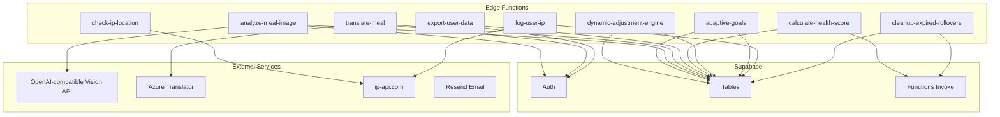

**Diagram sources**
- [analyze-meal-image/index.ts:143-344](file://supabase/functions/analyze-meal-image/index.ts#L143-L344)
- [translate-meal/index.ts:155-262](file://supabase/functions/translate-meal/index.ts#L155-L262)
- [export-user-data/index.ts:24-319](file://supabase/functions/export-user-data/index.ts#L24-L319)
- [check-ip-location/index.ts:7-106](file://supabase/functions/check-ip-location/index.ts#L7-L106)
- [calculate-health-score/index.ts:32-217](file://supabase/functions/calculate-health-score/index.ts#L32-L217)
- [dynamic-adjustment-engine/index.ts:275-454](file://supabase/functions/dynamic-adjustment-engine/index.ts#L275-L454)
- [adaptive-goals/index.ts:316-521](file://supabase/functions/adaptive-goals/index.ts#L316-L521)
- [log-user-ip/index.ts:4-64](file://supabase/functions/log-user-ip/index.ts#L4-L64)
- [cleanup-expired-rollovers/index.ts:19-198](file://supabase/functions/cleanup-expired-rollovers/index.ts#L19-L198)

**Section sources**
- [PHASE2_EDGE_FUNCTIONS.md:1-411](file://supabase/functions/PHASE2_EDGE_FUNCTIONS.md#L1-L411)

## Core Components
This section outlines the primary data processing functions and their responsibilities.

- analyze-meal-image: Validates JWT, enforces rate limits, fetches images (remote or base64), calls a vision AI API, parses JSON responses, and logs audit trails.
- translate-meal: Authenticates requests, validates inputs, translates text via Azure Translator, stores results in Supabase, and tracks translation metrics.
- export-user-data: Enforces GDPR compliance by authenticating users, validating admin privileges, collecting comprehensive user data, applying rate limits, and returning downloadable exports.
- check-ip-location: Verifies IP geolocation, enforces country restrictions, checks blocklists, and supports E2E testing bypasses.
- calculate-health-score: Computes weekly health compliance scores for active subscribers, handles permissions, and triggers email notifications.
- dynamic-adjustment-engine: Analyzes weight trends, adherence, and goals to generate personalized nutrition adjustments and optionally applies them.
- adaptive-goals: Performs scenario-based adjustments, predicts future weight trends, and maintains adherence records.
- log-user-ip: Captures user IP actions with geolocation and user agent for audit and security.
- cleanup-expired-rollovers: Processes expired rollover credits, updates subscriptions, logs events, and notifies users.

**Section sources**
- [analyze-meal-image/index.ts:13-367](file://supabase/functions/analyze-meal-image/index.ts#L13-L367)
- [translate-meal/index.ts:155-262](file://supabase/functions/translate-meal/index.ts#L155-L262)
- [export-user-data/index.ts:24-319](file://supabase/functions/export-user-data/index.ts#L24-L319)
- [check-ip-location/index.ts:7-106](file://supabase/functions/check-ip-location/index.ts#L7-L106)
- [calculate-health-score/index.ts:32-217](file://supabase/functions/calculate-health-score/index.ts#L32-L217)
- [dynamic-adjustment-engine/index.ts:275-454](file://supabase/functions/dynamic-adjustment-engine/index.ts#L275-L454)
- [adaptive-goals/index.ts:316-521](file://supabase/functions/adaptive-goals/index.ts#L316-L521)
- [log-user-ip/index.ts:4-64](file://supabase/functions/log-user-ip/index.ts#L4-L64)
- [cleanup-expired-rollovers/index.ts:19-198](file://supabase/functions/cleanup-expired-rollovers/index.ts#L19-L198)

## Architecture Overview
The edge functions operate within a layered architecture:
- Presentation: Frontend React components and hooks orchestrate function invocations.
- Edge Processing: Supabase Edge Functions execute data transformations and integrations.
- Data Layer: Supabase tables store user data, preferences, audit logs, and analytics.
- External Integrations: Vision AI, Azure Translator, Resend, and IP geolocation services.

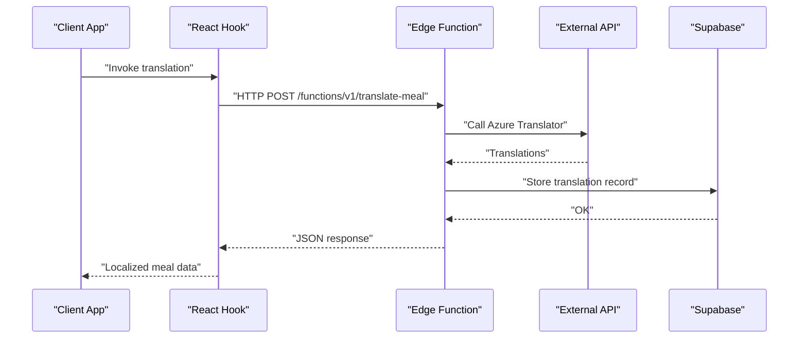

**Diagram sources**
- [translate-meal/index.ts:155-262](file://supabase/functions/translate-meal/index.ts#L155-L262)
- [useMealTranslation.ts:120-164](file://src/hooks/useMealTranslation.ts#L120-L164)

## Detailed Component Analysis

### Image Recognition Workflow: analyze-meal-image
This function performs meal image analysis using a vision-capable model via an OpenAI-compatible API.

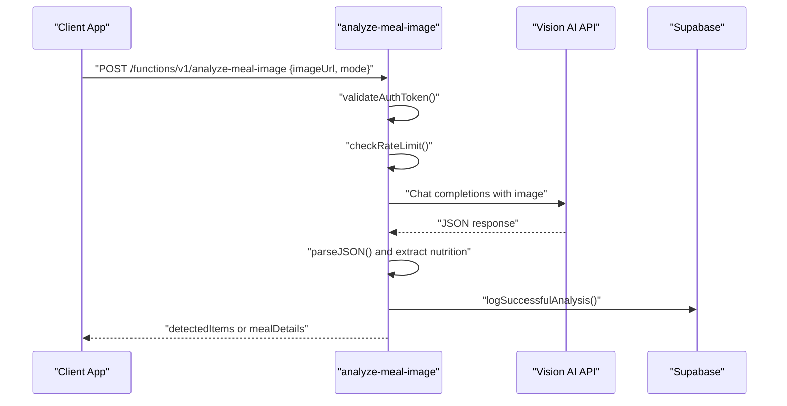

**Diagram sources**
- [analyze-meal-image/index.ts:143-344](file://supabase/functions/analyze-meal-image/index.ts#L143-L344)

Key features:
- Authentication: Validates JWT from Authorization header using Supabase auth.
- Rate limiting: Tracks per-user requests within an hourly window.
- Image handling: Supports data URIs and remote URLs; converts to base64.
- Vision API: Calls an OpenAI-compatible endpoint with system/user prompts.
- Fallback: Returns structured fallback responses when AI is unavailable.
- Auditing: Logs successful and failed attempts to api_logs.

Security and compliance:
- CORS headers configured for safe browser access.
- Audit trail maintained for all successful analyses.
- Failed auth attempts logged for monitoring.

**Section sources**
- [analyze-meal-image/index.ts:13-55](file://supabase/functions/analyze-meal-image/index.ts#L13-L55)
- [analyze-meal-image/index.ts:83-99](file://supabase/functions/analyze-meal-image/index.ts#L83-L99)
- [analyze-meal-image/index.ts:105-141](file://supabase/functions/analyze-meal-image/index.ts#L105-L141)
- [analyze-meal-image/index.ts:194-344](file://supabase/functions/analyze-meal-image/index.ts#L194-L344)

### Translation Pipeline: translate-meal
This function orchestrates multilingual translation for meal content.

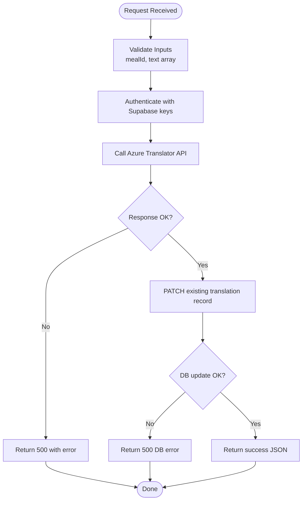

**Diagram sources**
- [translate-meal/index.ts:155-262](file://supabase/functions/translate-meal/index.ts#L155-L262)

Processing logic:
- Input validation ensures required fields are present.
- Azure Translator API is invoked with proper headers and body.
- Results are normalized and stored in the meal_translations table.
- Characters translated are tracked for monitoring and cost control.

Quality assurance:
- Comprehensive error handling for network and DB failures.
- Structured responses with success/error indicators.
- Metrics collection for operational insights.

**Section sources**
- [translate-meal/index.ts:16-31](file://supabase/functions/translate-meal/index.ts#L16-L31)
- [translate-meal/index.ts:36-107](file://supabase/functions/translate-meal/index.ts#L36-L107)
- [translate-meal/index.ts:112-153](file://supabase/functions/translate-meal/index.ts#L112-L153)
- [translate-meal/index.ts:177-262](file://supabase/functions/translate-meal/index.ts#L177-L262)

### User Data Export: export-user-data
This function implements GDPR-compliant data export for users and administrators.

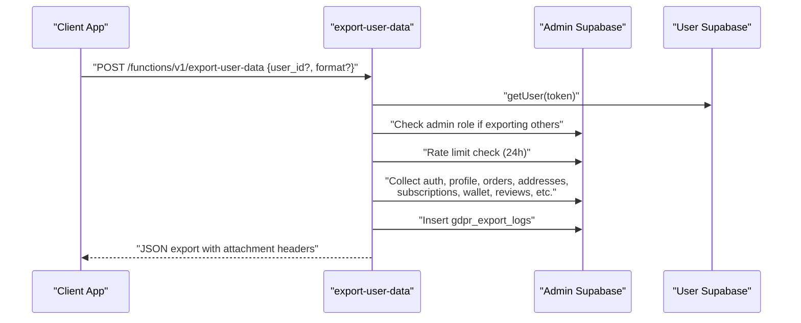

**Diagram sources**
- [export-user-data/index.ts:24-319](file://supabase/functions/export-user-data/index.ts#L24-L319)

Data coverage:
- Authentication data, profile, restaurants/meals (if partner), addresses, subscriptions, orders, meal schedules, wallet and transactions, meal history, reviews, affiliate data, driver/partner payouts, notifications, support tickets, gamification data, and audit logs.

Compliance and security:
- Rate limiting prevents excessive exports.
- Admin verification ensures authorized access to other users' data.
- Audit logging tracks who exported what and when.

**Section sources**
- [export-user-data/index.ts:19-22](file://supabase/functions/export-user-data/index.ts#L19-L22)
- [export-user-data/index.ts:80-98](file://supabase/functions/export-user-data/index.ts#L80-L98)
- [export-user-data/index.ts:100-284](file://supabase/functions/export-user-data/index.ts#L100-L284)
- [export-user-data/index.ts:286-292](file://supabase/functions/export-user-data/index.ts#L286-L292)

### IP Geolocation and Access Control: check-ip-location
Enforces geographic restrictions and validates IP addresses.

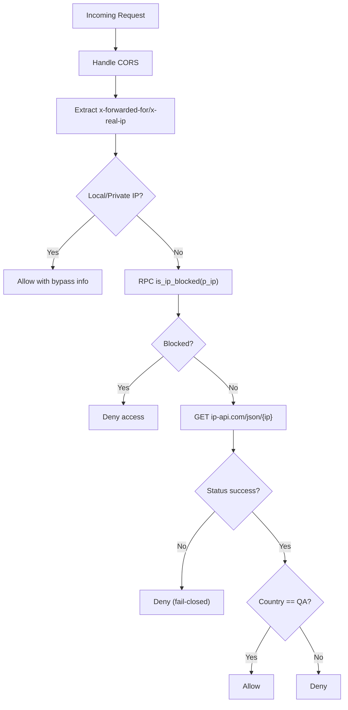

**Diagram sources**
- [check-ip-location/index.ts:7-106](file://supabase/functions/check-ip-location/index.ts#L7-L106)

Operational notes:
- E2E testing bypass for localhost and private networks.
- Fail-closed policy when geolocation lookup fails.
- Country restriction enforced to Qatar.

**Section sources**
- [check-ip-location/index.ts:26-47](file://supabase/functions/check-ip-location/index.ts#L26-L47)
- [check-ip-location/index.ts:49-89](file://supabase/functions/check-ip-location/index.ts#L49-L89)

### Health Score Calculation: calculate-health-score
Computes weekly health compliance scores and notifies users.

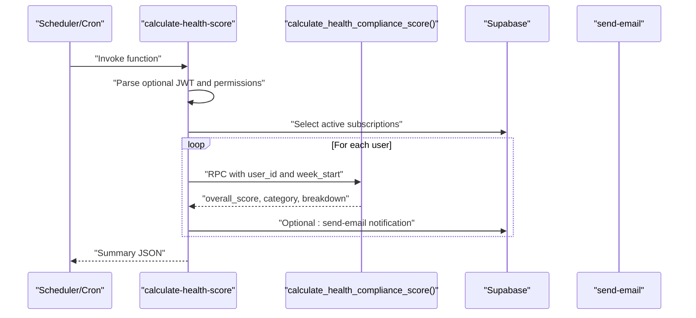

**Diagram sources**
- [calculate-health-score/index.ts:32-217](file://supabase/functions/calculate-health-score/index.ts#L32-L217)

Processing logic:
- Determines week start (Sunday-based).
- Validates JWT and admin permissions when user-specific calculation is requested.
- Iterates active subscribers to compute scores via RPC.
- Sends email notifications based on user preferences.

**Section sources**
- [calculate-health-score/index.ts:51-88](file://supabase/functions/calculate-health-score/index.ts#L51-L88)
- [calculate-health-score/index.ts:124-162](file://supabase/functions/calculate-health-score/index.ts#L124-L162)
- [calculate-health-score/index.ts:220-228](file://supabase/functions/calculate-health-score/index.ts#L220-L228)

### Dynamic Adjustment Algorithms: dynamic-adjustment-engine
Generates personalized nutrition adjustments based on progress and adherence.

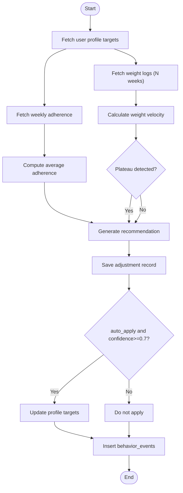

**Diagram sources**
- [dynamic-adjustment-engine/index.ts:275-454](file://supabase/functions/dynamic-adjustment-engine/index.ts#L275-L454)

Decision logic:
- Weight velocity thresholds for fat loss and muscle gain goals.
- Plateau detection over recent measurements.
- Adherence-based recommendations for low adherence scenarios.
- Confidence thresholds for automatic application.

**Section sources**
- [dynamic-adjustment-engine/index.ts:40-95](file://supabase/functions/dynamic-adjustment-engine/index.ts#L40-L95)
- [dynamic-adjustment-engine/index.ts:242-273](file://supabase/functions/dynamic-adjustment-engine/index.ts#L242-L273)
- [dynamic-adjustment-engine/index.ts:286-377](file://supabase/functions/dynamic-adjustment-engine/index.ts#L286-L377)
- [dynamic-adjustment-engine/index.ts:379-427](file://supabase/functions/dynamic-adjustment-engine/index.ts#L379-L427)

### Adaptive Goals Algorithm: adaptive-goals
Performs scenario-based adjustments and predicts future weight trends.

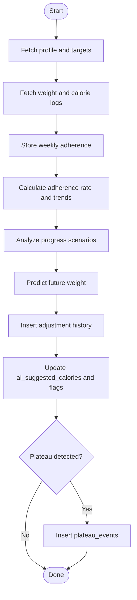

**Diagram sources**
- [adaptive-goals/index.ts:316-521](file://supabase/functions/adaptive-goals/index.ts#L316-L521)

Scenarios:
- Plateau detection with goal-specific adjustments.
- Rapid weight change warnings with corrective actions.
- Goal achievement transitions to maintenance.
- Low adherence focus on habit building.

**Section sources**
- [adaptive-goals/index.ts:52-227](file://supabase/functions/adaptive-goals/index.ts#L52-L227)
- [adaptive-goals/index.ts:229-262](file://supabase/functions/adaptive-goals/index.ts#L229-L262)
- [adaptive-goals/index.ts:368-427](file://supabase/functions/adaptive-goals/index.ts#L368-L427)

### IP Logging: log-user-ip
Captures user IP actions with geolocation for audit and security.

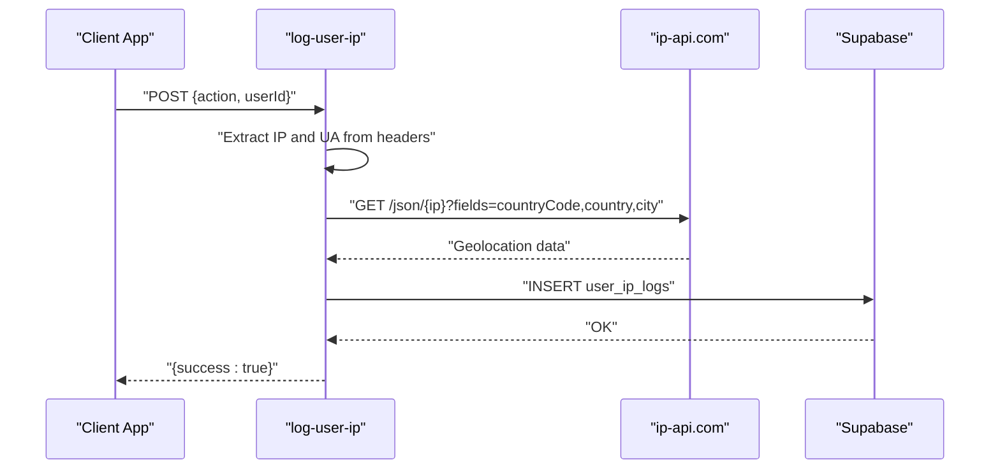

**Diagram sources**
- [log-user-ip/index.ts:4-64](file://supabase/functions/log-user-ip/index.ts#L4-L64)

**Section sources**
- [log-user-ip/index.ts:17-45](file://supabase/functions/log-user-ip/index.ts#L17-L45)

### Rollover Credits Cleanup: cleanup-expired-rollovers
Handles expired rollover credits and updates subscription records.

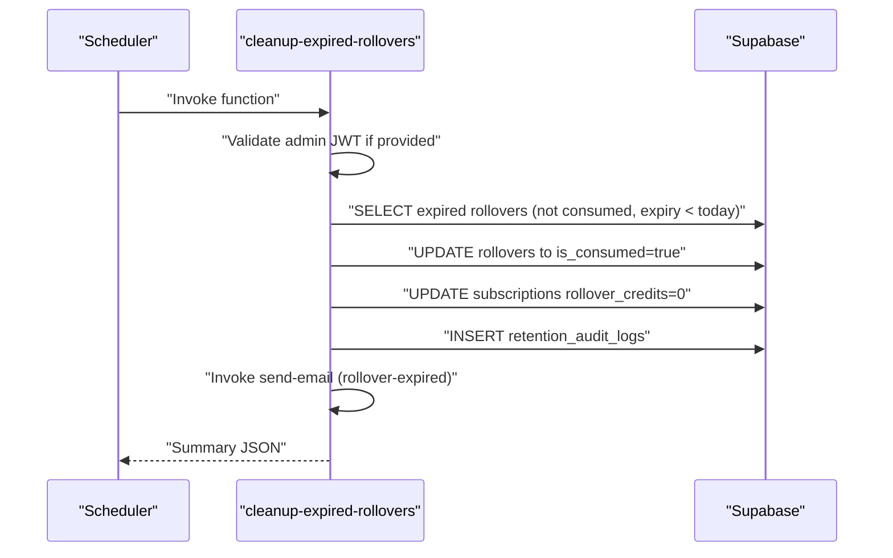

**Diagram sources**
- [cleanup-expired-rollovers/index.ts:19-198](file://supabase/functions/cleanup-expired-rollovers/index.ts#L19-L198)

**Section sources**
- [cleanup-expired-rollovers/index.ts:70-114](file://supabase/functions/cleanup-expired-rollovers/index.ts#L70-L114)
- [cleanup-expired-rollovers/index.ts:117-177](file://supabase/functions/cleanup-expired-rollovers/index.ts#L117-L177)

## Dependency Analysis
The edge functions depend on Supabase for authentication, authorization, and data operations, and integrate with external services for specialized capabilities.

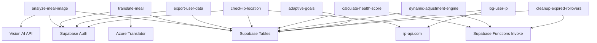

**Diagram sources**
- [analyze-meal-image/index.ts:204-281](file://supabase/functions/analyze-meal-image/index.ts#L204-L281)
- [translate-meal/index.ts:56-76](file://supabase/functions/translate-meal/index.ts#L56-L76)
- [export-user-data/index.ts:35-36](file://supabase/functions/export-user-data/index.ts#L35-L36)
- [check-ip-location/index.ts:65-66](file://supabase/functions/check-ip-location/index.ts#L65-L66)
- [calculate-health-score/index.ts:173-184](file://supabase/functions/calculate-health-score/index.ts#L173-L184)
- [dynamic-adjustment-engine/index.ts:416-427](file://supabase/functions/dynamic-adjustment-engine/index.ts#L416-L427)
- [adaptive-goals/index.ts:473-479](file://supabase/functions/adaptive-goals/index.ts#L473-L479)
- [log-user-ip/index.ts:31-32](file://supabase/functions/log-user-ip/index.ts#L31-L32)
- [cleanup-expired-rollovers/index.ts:164-173](file://supabase/functions/cleanup-expired-rollovers/index.ts#L164-L173)

## Performance Considerations
- Rate limiting: Implemented in analyze-meal-image to prevent API abuse and ensure fair usage.
- Asynchronous processing: Translation and email notifications leverage external services asynchronously.
- Efficient queries: Functions select only required fields and use appropriate filters to minimize database load.
- Caching and batching: Frontend hooks cache translation results and invalidate queries efficiently.
- Concurrency: Dynamic adjustment and adaptive goals process multiple users with careful iteration and logging.

## Troubleshooting Guide
Common issues and resolutions:
- Authentication failures: Verify Authorization header and JWT validity; check service role keys.
- Rate limit exceeded: Respect returned X-RateLimit headers and implement client-side backoff.
- External API errors: Vision AI and Azure Translator may fail; implement retry logic and fallback responses.
- Database connectivity: Confirm SUPABASE_URL and SUPABASE_SERVICE_ROLE_KEY; verify RLS policies.
- Translation storage failures: Ensure PATCH endpoints succeed and log errors appropriately.
- IP geolocation failures: Fail-closed behavior protects against unknown regions; verify ip-api.com availability.
- Email delivery: Validate RESEND_API_KEY and check email_logs for detailed errors.

**Section sources**
- [analyze-meal-image/index.ts:155-192](file://supabase/functions/analyze-meal-image/index.ts#L155-L192)
- [translate-meal/index.ts:196-207](file://supabase/functions/translate-meal/index.ts#L196-L207)
- [export-user-data/index.ts:88-98](file://supabase/functions/export-user-data/index.ts#L88-L98)
- [check-ip-location/index.ts:68-78](file://supabase/functions/check-ip-location/index.ts#L68-L78)
- [PHASE2_EDGE_FUNCTIONS.md:325-334](file://supabase/functions/PHASE2_EDGE_FUNCTIONS.md#L325-L334)

## Conclusion
The Data Processing edge functions provide robust, secure, and scalable data transformation capabilities across image analysis, translation, compliance, geolocation, health scoring, and dynamic personalization. They integrate seamlessly with Supabase and external services, incorporate comprehensive error handling and auditing, and adhere to performance and compliance best practices. Together, they form the backbone of intelligent data workflows that enhance user experience and operational efficiency.