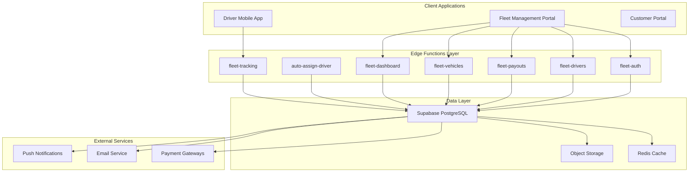
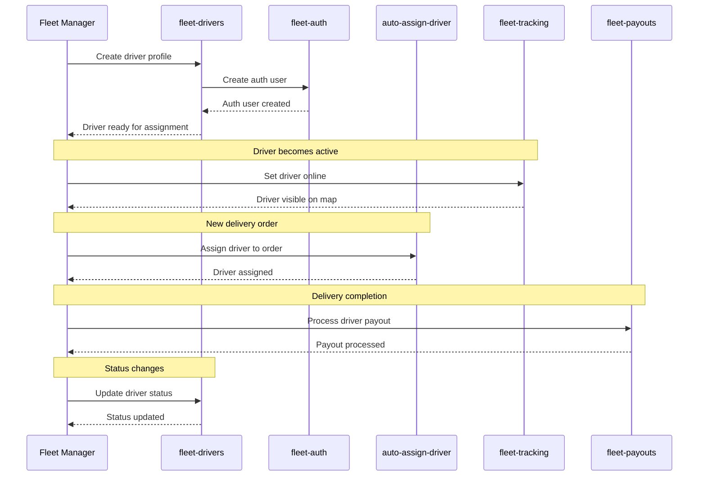
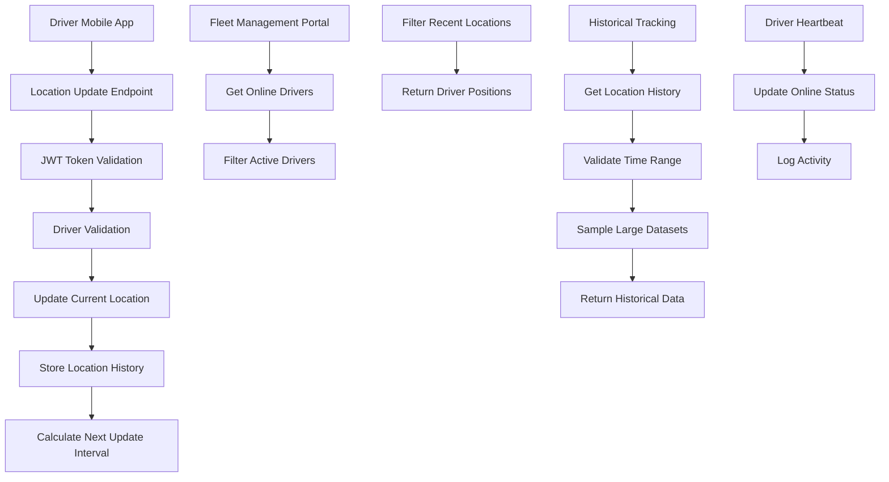
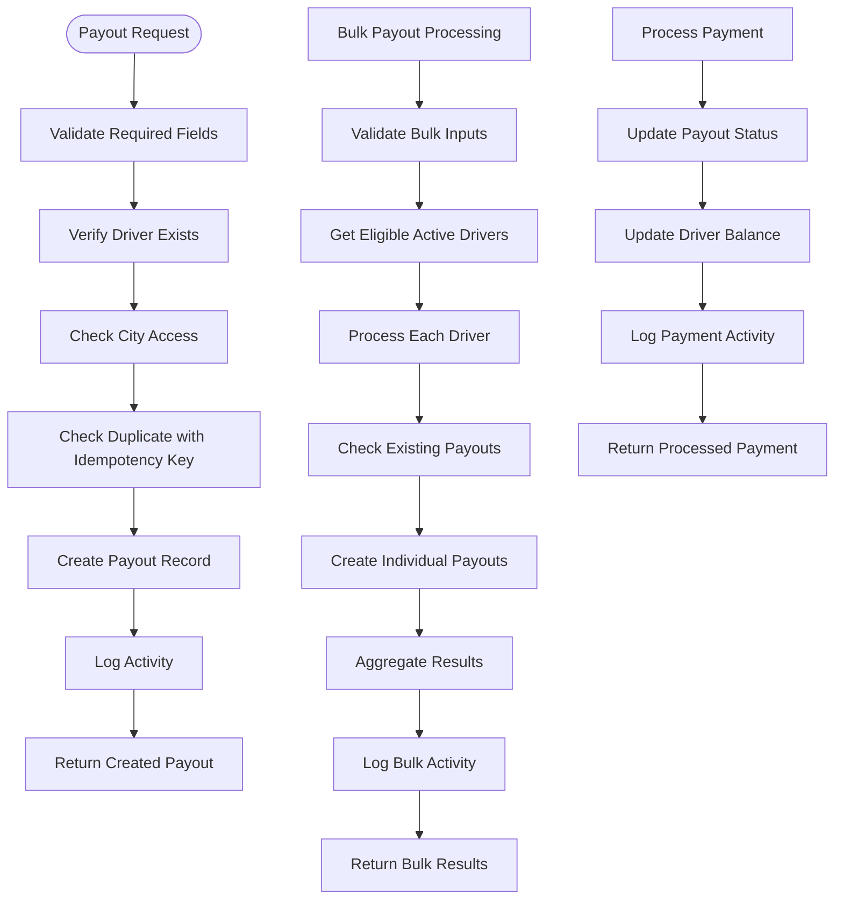
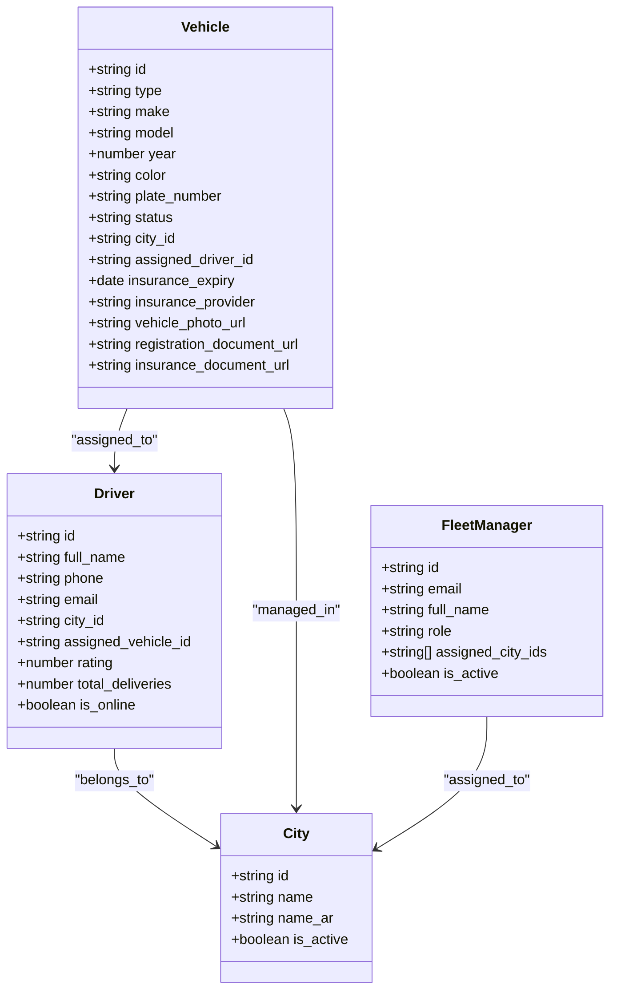
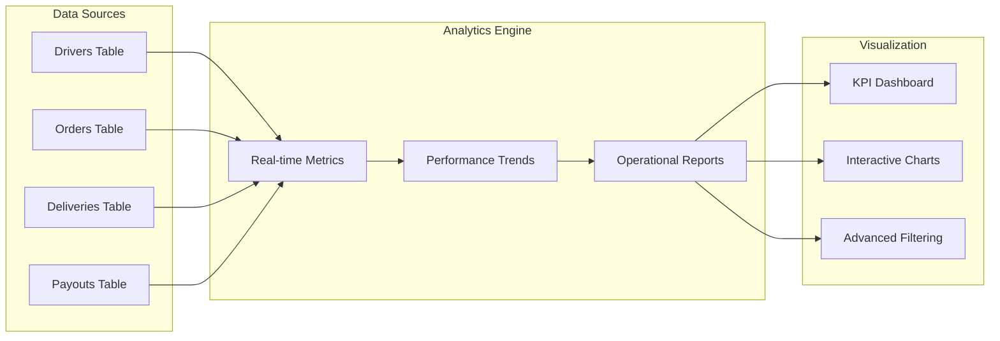
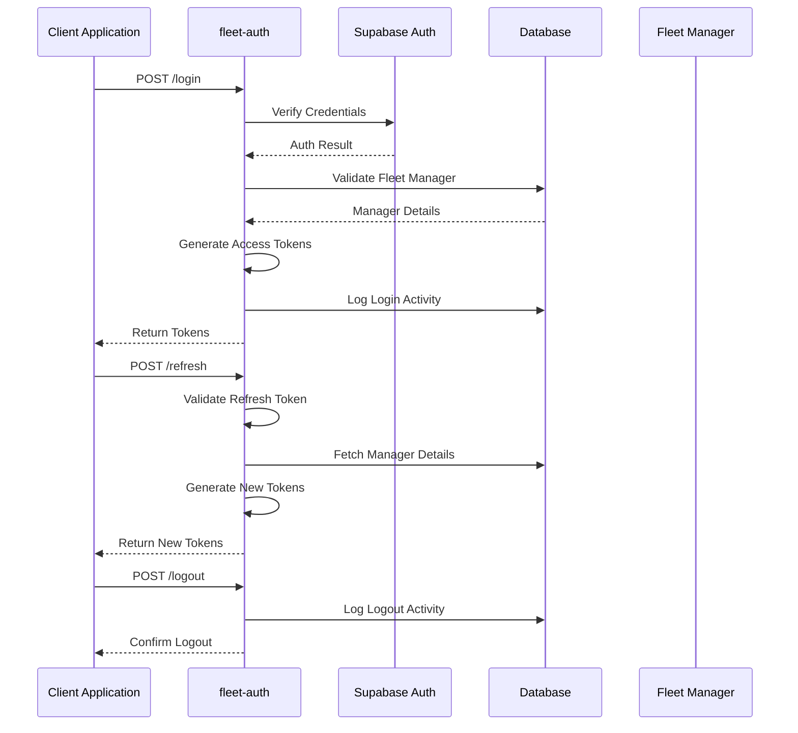
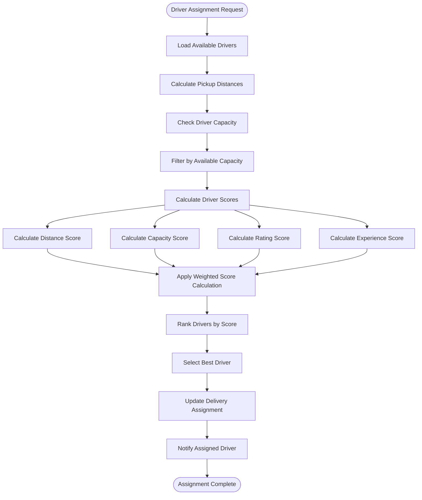
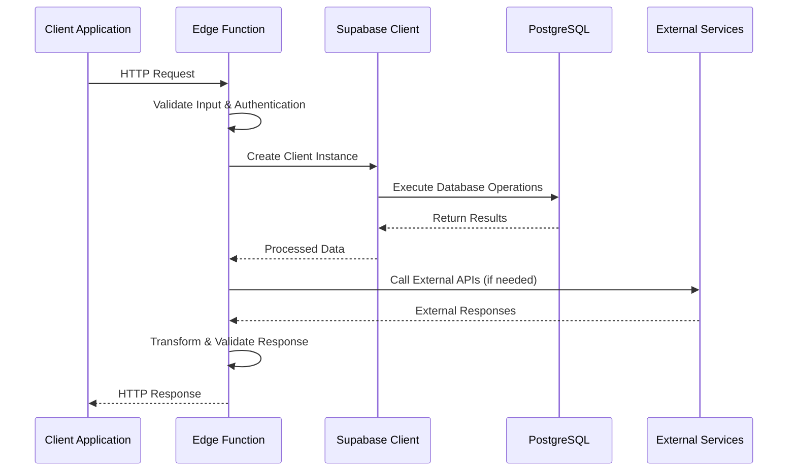
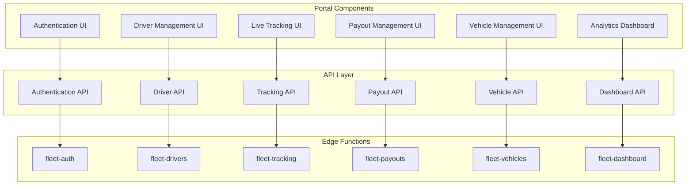

# Driver Management Functions

<cite>
**Referenced Files in This Document**
- [auto-assign-driver/index.ts](file://supabase/functions/auto-assign-driver/index.ts)
- [fleet-tracking/index.ts](file://supabase/functions/fleet-tracking/index.ts)
- [fleet-drivers/index.ts](file://supabase/functions/fleet-drivers/index.ts)
- [fleet-payouts/index.ts](file://supabase/functions/fleet-payouts/index.ts)
- [fleet-vehicles/index.ts](file://supabase/functions/fleet-vehicles/index.ts)
- [fleet-dashboard/index.ts](file://supabase/functions/fleet-dashboard/index.ts)
- [fleet-auth/index.ts](file://supabase/functions/fleet-auth/index.ts)
- [PHASE2_EDGE_FUNCTIONS.md](file://supabase/functions/PHASE2_EDGE_FUNCTIONS.md)
- [config.toml](file://supabase/config.toml)
</cite>

## Table of Contents
1. [Introduction](#introduction)
2. [System Architecture](#system-architecture)
3. [Core Components](#core-components)
4. [Driver Lifecycle Management](#driver-lifecycle-management)
5. [Real-Time Tracking System](#real-time-tracking-system)
6. [Payout Processing Engine](#payout-processing-engine)
7. [Vehicle Management](#vehicle-management)
8. [Dashboard Analytics](#dashboard-analytics)
9. [Authentication & Authorization](#authentication--authorization)
10. [Driver Matching Algorithm](#driver-matching-algorithm)
11. [Data Flow Patterns](#data-flow-patterns)
12. [Integration with Fleet Management Portal](#integration-with-fleet-management-portal)
13. [Scalability & Performance](#scalability--performance)
14. [Fault Tolerance & Monitoring](#fault-tolerance--monitoring)
15. [Operational Workflows](#operational-workflows)
16. [Emergency Handling Procedures](#emergency-handling-procedures)
17. [Conclusion](#conclusion)

## Introduction

The Driver Management Functions suite represents a comprehensive edge computing solution for fleet operations, providing automated driver assignment, real-time tracking, analytics, and operational management capabilities. Built on Supabase Edge Functions, this system automates critical fleet management processes while maintaining high availability and scalability for enterprise-scale operations.

The system consists of six primary edge functions that work together to create a seamless driver management ecosystem: auto-assignment engine, real-time tracking, driver management, payout processing, vehicle management, and dashboard analytics. Each function is designed with fault tolerance, security, and performance optimization in mind.

## System Architecture

The Driver Management Functions operate within a microservices architecture built on Supabase Edge Functions, leveraging serverless computing for scalable, event-driven operations.

**Diagram sources**
- [fleet-auth/index.ts:1-307](file://supabase/functions/fleet-auth/index.ts#L1-L307)
- [auto-assign-driver/index.ts:1-340](file://supabase/functions/auto-assign-driver/index.ts#L1-L340)
- [fleet-tracking/index.ts:1-503](file://supabase/functions/fleet-tracking/index.ts#L1-L503)

## Core Components

The system comprises six specialized edge functions, each responsible for specific aspects of fleet management:

### Auto-Assignment Engine (`auto-assign-driver`)
The primary driver assignment system that automatically matches available drivers to delivery orders using sophisticated scoring algorithms.

### Real-Time Tracking (`fleet-tracking`)
Handles driver location updates, tracking queries, and heartbeat management for live fleet visibility.

### Driver Management (`fleet-drivers`)
Provides comprehensive CRUD operations for driver profiles, status management, and performance analytics.

### Payout Processing (`fleet-payouts`)
Manages driver compensation workflows including batch processing and payment reconciliation.

### Vehicle Management (`fleet-vehicles`)
Controls vehicle assignments, maintenance scheduling, and asset tracking.

### Dashboard Analytics (`fleet-dashboard`)
Delivers aggregated fleet metrics, performance indicators, and operational insights.

**Section sources**
- [auto-assign-driver/index.ts:1-340](file://supabase/functions/auto-assign-driver/index.ts#L1-L340)
- [fleet-tracking/index.ts:1-503](file://supabase/functions/fleet-tracking/index.ts#L1-L503)
- [fleet-drivers/index.ts:1-871](file://supabase/functions/fleet-drivers/index.ts#L1-L871)
- [fleet-payouts/index.ts:1-610](file://supabase/functions/fleet-payouts/index.ts#L1-L610)
- [fleet-vehicles/index.ts:1-671](file://supabase/functions/fleet-vehicles/index.ts#L1-L671)
- [fleet-dashboard/index.ts:1-306](file://supabase/functions/fleet-dashboard/index.ts#L1-L306)

## Driver Lifecycle Management

The driver lifecycle encompasses the complete journey from onboarding to active fleet participation, automated through coordinated edge functions.

**Diagram sources**
- [fleet-drivers/index.ts:175-281](file://supabase/functions/fleet-drivers/index.ts#L175-L281)
- [fleet-auth/index.ts:90-174](file://supabase/functions/fleet-auth/index.ts#L90-L174)
- [auto-assign-driver/index.ts:130-287](file://supabase/functions/auto-assign-driver/index.ts#L130-L287)
- [fleet-tracking/index.ts:373-427](file://supabase/functions/fleet-tracking/index.ts#L373-L427)
- [fleet-payouts/index.ts:186-315](file://supabase/functions/fleet-payouts/index.ts#L186-L315)

The lifecycle follows a structured progression:
1. **Onboarding**: Driver profile creation with authentication integration
2. **Verification**: Document uploads and status validation
3. **Assignment**: Automated driver matching for delivery orders
4. **Execution**: Real-time tracking during delivery operations
5. **Settlement**: Payout processing and performance evaluation
6. **Optimization**: Continuous improvement through analytics feedback

**Section sources**
- [fleet-drivers/index.ts:175-281](file://supabase/functions/fleet-drivers/index.ts#L175-L281)
- [fleet-payouts/index.ts:186-315](file://supabase/functions/fleet-payouts/index.ts#L186-L315)

## Real-Time Tracking System

The real-time tracking system provides comprehensive fleet visibility through GPS location updates, driver status monitoring, and historical tracking capabilities.

**Diagram sources**
- [fleet-tracking/index.ts:72-188](file://supabase/functions/fleet-tracking/index.ts#L72-L188)
- [fleet-tracking/index.ts:190-264](file://supabase/functions/fleet-tracking/index.ts#L190-L264)
- [fleet-tracking/index.ts:266-371](file://supabase/functions/fleet-tracking/index.ts#L266-L371)
- [fleet-tracking/index.ts:373-427](file://supabase/functions/fleet-tracking/index.ts#L373-L427)

### Tracking Features

**Location Updates**: Drivers can update their positions with adaptive intervals based on movement patterns, battery level, and speed.

**Real-time Visibility**: Fleet managers can view all online drivers with filtering by city, status, and activity.

**Historical Tracking**: Comprehensive location history with sampling for large datasets, supporting up to 24-hour time ranges.

**Heartbeat System**: Automatic status management through periodic heartbeat signals, ensuring accurate online/offline status.

**Security Model**: Dual-token system supporting both fleet manager access and driver authentication with city-based access controls.

**Section sources**
- [fleet-tracking/index.ts:72-188](file://supabase/functions/fleet-tracking/index.ts#L72-L188)
- [fleet-tracking/index.ts:190-264](file://supabase/functions/fleet-tracking/index.ts#L190-L264)
- [fleet-tracking/index.ts:266-371](file://supabase/functions/fleet-tracking/index.ts#L266-L371)
- [fleet-tracking/index.ts:373-427](file://supabase/functions/fleet-tracking/index.ts#L373-L427)

## Payout Processing Engine

The payout processing system automates driver compensation with robust error handling, idempotency support, and comprehensive logging.

**Diagram sources**
- [fleet-payouts/index.ts:186-315](file://supabase/functions/fleet-payouts/index.ts#L186-L315)
- [fleet-payouts/index.ts:430-558](file://supabase/functions/fleet-payouts/index.ts#L430-L558)
- [fleet-payouts/index.ts:317-428](file://supabase/functions/fleet-payouts/index.ts#L317-L428)

### Payout Features

**Idempotency Support**: Prevents duplicate payouts using unique keys for transaction safety.

**Batch Processing**: Efficient bulk payout creation for multiple drivers with individual error handling.

**City-Based Access Control**: Ensures managers can only process payouts for assigned cities.

**Comprehensive Logging**: Full audit trail of all payout operations with detailed activity logs.

**Payment Methods**: Support for various payment methods with reference tracking and reconciliation.

**Section sources**
- [fleet-payouts/index.ts:186-315](file://supabase/functions/fleet-payouts/index.ts#L186-L315)
- [fleet-payouts/index.ts:430-558](file://supabase/functions/fleet-payouts/index.ts#L430-L558)
- [fleet-payouts/index.ts:317-428](file://supabase/functions/fleet-payouts/index.ts#L317-L428)

## Vehicle Management

The vehicle management system provides comprehensive fleet asset control with assignment tracking, maintenance scheduling, and compliance monitoring.

**Diagram sources**
- [fleet-vehicles/index.ts:260-330](file://supabase/functions/fleet-vehicles/index.ts#L260-L330)
- [fleet-drivers/index.ts:283-371](file://supabase/functions/fleet-drivers/index.ts#L283-L371)

### Vehicle Management Features

**Asset Tracking**: Complete vehicle inventory with detailed specifications and compliance documentation.

**Assignment Control**: Dynamic driver-vehicle pairing with automatic status updates and conflict resolution.

**Maintenance Scheduling**: Status-based maintenance tracking with insurance expiration monitoring.

**City Compliance**: Multi-city fleet management with proper segregation and access control.

**Document Management**: Secure storage of vehicle documentation with expiry tracking.

**Section sources**
- [fleet-vehicles/index.ts:56-141](file://supabase/functions/fleet-vehicles/index.ts#L56-L141)
- [fleet-vehicles/index.ts:143-258](file://supabase/functions/fleet-vehicles/index.ts#L143-L258)
- [fleet-vehicles/index.ts:260-330](file://supabase/functions/fleet-vehicles/index.ts#L260-L330)
- [fleet-vehicles/index.ts:332-490](file://supabase/functions/fleet-vehicles/index.ts#L332-L490)
- [fleet-vehicles/index.ts:492-614](file://supabase/functions/fleet-vehicles/index.ts#L492-L614)

## Dashboard Analytics

The dashboard system provides comprehensive fleet analytics with real-time metrics, performance indicators, and operational insights.

**Diagram sources**
- [fleet-dashboard/index.ts:58-280](file://supabase/functions/fleet-dashboard/index.ts#L58-L280)

### Dashboard Capabilities

**Multi-Level Analytics**: From global fleet overview to city-specific insights with drill-down capabilities.

**Real-time Metrics**: Live counters for drivers, active orders, completions, and performance indicators.

**City Intelligence**: Hierarchical city data for super administrators and city-specific views for fleet managers.

**Performance Benchmarks**: Average delivery times, completion rates, and quality metrics across time periods.

**Operational Insights**: Trend analysis and forecasting capabilities for strategic decision-making.

**Section sources**
- [fleet-dashboard/index.ts:58-280](file://supabase/functions/fleet-dashboard/index.ts#L58-L280)

## Authentication & Authorization

The authentication system provides secure access control with role-based permissions and city-specific access management.

**Diagram sources**
- [fleet-auth/index.ts:90-174](file://supabase/functions/fleet-auth/index.ts#L90-L174)
- [fleet-auth/index.ts:176-230](file://supabase/functions/fleet-auth/index.ts#L176-L230)
- [fleet-auth/index.ts:232-273](file://supabase/functions/fleet-auth/index.ts#L232-L273)

### Security Features

**Dual-Token System**: Separate access and refresh tokens with different expiration policies.

**Role-Based Access**: Distinction between super administrators and city-specific fleet managers.

**City Segregation**: Automatic filtering of data based on manager's assigned cities.

**JWT Validation**: Robust token verification with expiration and signature checking.

**Audit Trail**: Comprehensive logging of all authentication events for security monitoring.

**Section sources**
- [fleet-auth/index.ts:33-88](file://supabase/functions/fleet-auth/index.ts#L33-L88)
- [fleet-auth/index.ts:90-174](file://supabase/functions/fleet-auth/index.ts#L90-L174)
- [fleet-auth/index.ts:176-230](file://supabase/functions/fleet-auth/index.ts#L176-L230)
- [fleet-auth/index.ts:232-273](file://supabase/functions/fleet-auth/index.ts#L232-L273)

## Driver Matching Algorithm

The driver assignment system employs a sophisticated scoring algorithm that considers multiple factors to select optimal drivers for delivery assignments.

**Diagram sources**
- [auto-assign-driver/index.ts:64-97](file://supabase/functions/auto-assign-driver/index.ts#L64-L97)
- [auto-assign-driver/index.ts:224-251](file://supabase/functions/auto-assign-driver/index.ts#L224-L251)

### Scoring Algorithm Components

**Distance Factor (50%)**: Exponential decay based on pickup distance using Haversine formula for accurate geographical calculations.

**Capacity Factor (30%)**: Based on remaining delivery capacity, encouraging balanced workload distribution.

**Rating Factor (15%)**: Driver reputation scoring with maximum points for top-rated performers.

**Experience Factor (5%)**: Bonus points for experienced drivers to reward reliability and skill.

**Algorithm Formula**: Weighted combination with exponential distance decay for optimal assignment efficiency.

**Section sources**
- [auto-assign-driver/index.ts:64-97](file://supabase/functions/auto-assign-driver/index.ts#L64-L97)
- [auto-assign-driver/index.ts:130-287](file://supabase/functions/auto-assign-driver/index.ts#L130-L287)

## Data Flow Patterns

The system follows consistent data flow patterns across all edge functions, ensuring reliability and maintainability.

**Diagram sources**
- [auto-assign-driver/index.ts:289-340](file://supabase/functions/auto-assign-driver/index.ts#L289-L340)
- [fleet-tracking/index.ts:429-502](file://supabase/functions/fleet-tracking/index.ts#L429-L502)

### Consistent Patterns

**Input Validation**: All functions validate required parameters and return appropriate HTTP status codes.

**Authentication Middleware**: JWT verification with role-based access control across all protected endpoints.

**Database Operations**: Standardized Supabase client initialization with proper error handling.

**Response Formatting**: Consistent JSON response structures with appropriate HTTP status codes.

**Logging & Monitoring**: Comprehensive error logging and operational metrics collection.

**Section sources**
- [auto-assign-driver/index.ts:289-340](file://supabase/functions/auto-assign-driver/index.ts#L289-L340)
- [fleet-tracking/index.ts:429-502](file://supabase/functions/fleet-tracking/index.ts#L429-L502)

## Integration with Fleet Management Portal

The edge functions integrate seamlessly with the fleet management portal through standardized APIs and consistent data models.

**Diagram sources**
- [fleet-auth/index.ts:275-306](file://supabase/functions/fleet-auth/index.ts#L275-L306)
- [fleet-drivers/index.ts:804-871](file://supabase/functions/fleet-drivers/index.ts#L804-L871)
- [fleet-tracking/index.ts:429-502](file://supabase/functions/fleet-tracking/index.ts#L429-L502)
- [fleet-payouts/index.ts:560-610](file://supabase/functions/fleet-payouts/index.ts#L560-L610)
- [fleet-vehicles/index.ts:616-671](file://supabase/functions/fleet-vehicles/index.ts#L616-L671)
- [fleet-dashboard/index.ts:282-306](file://supabase/functions/fleet-dashboard/index.ts#L282-L306)

### Portal Integration Features

**Unified Authentication**: Single sign-on across all portal components with role-based access control.

**Real-time Data**: Live updates through WebSocket connections and periodic polling for tracking data.

**RESTful APIs**: Consistent endpoint patterns with standardized request/response formats.

**Error Handling**: Graceful error handling with user-friendly error messages and retry mechanisms.

**Performance Optimization**: Caching strategies and efficient data loading for responsive user experience.

**Section sources**
- [fleet-auth/index.ts:275-306](file://supabase/functions/fleet-auth/index.ts#L275-L306)
- [fleet-drivers/index.ts:804-871](file://supabase/functions/fleet-drivers/index.ts#L804-L871)
- [fleet-dashboard/index.ts:282-306](file://supabase/functions/fleet-dashboard/index.ts#L282-L306)

## Scalability & Performance

The system is designed for horizontal scalability and high performance through serverless architecture and optimized data access patterns.

### Performance Characteristics

**Cold Start Mitigation**: Edge functions remain warm through regular usage patterns and strategic deployment across regions.

**Database Optimization**: Proper indexing on frequently queried columns, optimized query patterns, and connection pooling.

**Caching Strategies**: Strategic caching of frequently accessed data with appropriate invalidation policies.

**Rate Limiting**: Built-in rate limiting to prevent abuse and ensure fair resource allocation.

### Scalability Approaches

**Horizontal Scaling**: Automatic scaling based on demand with multiple function instances handling concurrent requests.

**Database Partitioning**: City-based data segregation enabling independent scaling per geographic region.

**Asynchronous Processing**: Background jobs for heavy computations and long-running operations.

**CDN Integration**: Static assets and frequently accessed data served through content delivery networks.

**Monitoring & Alerting**: Comprehensive observability with performance metrics and automated alerting for capacity planning.

## Fault Tolerance & Monitoring

The system incorporates comprehensive fault tolerance mechanisms and monitoring capabilities to ensure high availability and operational visibility.

### Error Handling Strategies

**Graceful Degradation**: Functions continue operating with reduced functionality when external services are unavailable.

**Retry Logic**: Intelligent retry mechanisms with exponential backoff for transient failures.

**Circuit Breaker Pattern**: Protection against cascading failures through temporary service disabling.

**Fallback Mechanisms**: Predefined fallback responses and alternative processing paths.

### Monitoring & Observability

**Structured Logging**: Comprehensive logging with correlation IDs for request tracing across function boundaries.

**Performance Metrics**: Key performance indicators including response times, error rates, and throughput measurements.

**Alerting Systems**: Automated alerts for critical failures, performance degradation, and security incidents.

**Audit Trails**: Complete audit logs for all administrative actions and sensitive operations.

**Health Checks**: Regular health monitoring with automated recovery procedures.

**Section sources**
- [auto-assign-driver/index.ts:289-340](file://supabase/functions/auto-assign-driver/index.ts#L289-L340)
- [fleet-tracking/index.ts:429-502](file://supabase/functions/fleet-tracking/index.ts#L429-L502)
- [fleet-payouts/index.ts:560-610](file://supabase/functions/fleet-payouts/index.ts#L560-L610)

## Operational Workflows

The system supports comprehensive operational workflows covering daily fleet management activities and special scenarios.

### Standard Daily Operations

**Morning Operations**: Driver onboarding verification, vehicle inspection, and route planning.

**Peak Hours Management**: Dynamic driver allocation, surge pricing adjustments, and capacity optimization.

**End-of-Day Settlement**: Batch payout processing, performance reporting, and asset reconciliation.

**Maintenance Scheduling**: Vehicle maintenance coordination, driver training updates, and equipment replacement.

### Specialized Workflows

**Emergency Response**: Rapid driver dispatch for urgent deliveries, alternative routing, and priority handling.

**Seasonal Adjustments**: Capacity scaling for holidays, events, and weather-related demand fluctuations.

**Quality Assurance**: Performance monitoring, complaint handling, and continuous improvement initiatives.

**Compliance Management**: Regulatory reporting, safety certifications, and operational standards enforcement.

## Emergency Handling Procedures

The system includes comprehensive emergency handling procedures for critical situations requiring immediate response.

### Emergency Protocols

**Driver Safety**: Immediate assistance protocols, emergency contact systems, and safety check-in requirements.

**System Failures**: Automated failover procedures, backup communication channels, and manual intervention capabilities.

**Security Incidents**: Breach detection, incident response procedures, and forensic analysis capabilities.

**Natural Disasters**: Evacuation procedures, alternate routing, and supply chain disruption management.

### Response Mechanisms

**Automated Alerts**: Instant notification systems for critical incidents with escalation procedures.

**Manual Override**: Administrative controls for overriding automated systems during emergencies.

**Communication Channels**: Multi-channel communication systems for coordinating emergency response teams.

**Documentation**: Complete incident documentation with lessons learned for future preparedness.

## Conclusion

The Driver Management Functions suite represents a comprehensive, scalable solution for modern fleet operations. Through its six specialized edge functions, the system provides automated driver assignment, real-time tracking, comprehensive analytics, and operational management capabilities.

Key strengths include:

**Automation Excellence**: Sophisticated algorithms for driver matching and assignment optimization
**Real-time Visibility**: Comprehensive tracking and monitoring capabilities for fleet managers
**Scalable Architecture**: Serverless design enabling automatic scaling and cost optimization
**Security Focus**: Robust authentication, authorization, and audit capabilities
**Operational Efficiency**: Streamlined workflows reducing manual intervention and improving service quality

The system's modular design enables independent scaling and maintenance of individual components while maintaining cohesive fleet management capabilities. With comprehensive monitoring, fault tolerance, and emergency handling procedures, the platform provides reliable operations for growing fleet management needs.

Future enhancements could include advanced machine learning for predictive analytics, expanded integration capabilities, and enhanced mobile application features to further improve operational efficiency and driver experience.