# Edge Functions

<cite>
**Referenced Files in This Document**
- [PHASE2_EDGE_FUNCTIONS.md](file://supabase/functions/PHASE2_EDGE_FUNCTIONS.md)
- [index.ts (adaptive-goals)](file://supabase/functions/adaptive-goals/index.ts)
- [index.ts (adaptive-goals-batch)](file://supabase/functions/adaptive-goals-batch/index.ts)
- [index.ts (behavior-prediction-engine)](file://supabase/functions/behavior-prediction-engine/index.ts)
- [index.ts (nutrition-profile-engine)](file://supabase/functions/nutrition-profile-engine/index.ts)
- [index.ts (smart-meal-allocator)](file://supabase/functions/smart-meal-allocator/index.ts)
- [index.ts (auto-assign-driver)](file://supabase/functions/auto-assign-driver/index.ts)
- [index.ts (process-subscription-renewal)](file://supabase/functions/process-subscription-renewal/index.ts)
- [index.ts (send-invoice-email)](file://supabase/functions/send-invoice-email/index.ts)
</cite>

## Table of Contents
1. [Introduction](#introduction)
2. [Project Structure](#project-structure)
3. [Core Components](#core-components)
4. [Architecture Overview](#architecture-overview)
5. [Detailed Component Analysis](#detailed-component-analysis)
6. [Dependency Analysis](#dependency-analysis)
7. [Performance Considerations](#performance-considerations)
8. [Troubleshooting Guide](#troubleshooting-guide)
9. [Conclusion](#conclusion)

## Introduction
This document describes the Supabase Edge Functions implementation powering the Nutrio platform’s serverless automation. It covers the architecture, deployment patterns, and business logic for key functions including adaptive-goals, behavior-prediction-engine, nutrition-profile-engine, smart-meal-allocator, auto-assign-driver, and subscription renewal processing. It also documents function triggers, parameters, return values, error handling, composition patterns, data validation, Supabase database integration, performance optimization, cold start mitigation, monitoring, security, environment management, and scaling.

## Project Structure
The Edge Functions are organized under the Supabase project with dedicated folders per function. Each function exposes a single HTTP endpoint and integrates with Supabase Auth, Postgres, and external services (e.g., Resend for email). The repository includes a phase-2 functions overview and a dedicated auto-assignment + invoice email pair.

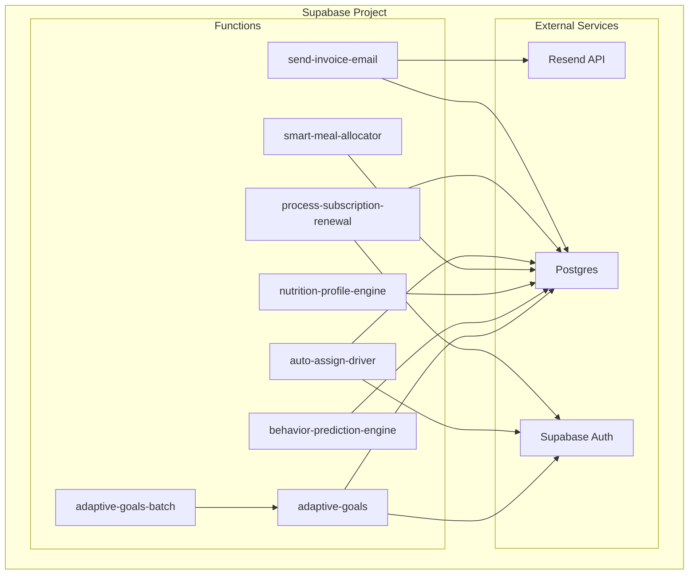

**Diagram sources**
- [PHASE2_EDGE_FUNCTIONS.md:1-411](file://supabase/functions/PHASE2_EDGE_FUNCTIONS.md#L1-L411)
- [index.ts (adaptive-goals):1-522](file://supabase/functions/adaptive-goals/index.ts#L1-L522)
- [index.ts (adaptive-goals-batch):1-136](file://supabase/functions/adaptive-goals-batch/index.ts#L1-L136)
- [index.ts (behavior-prediction-engine):1-513](file://supabase/functions/behavior-prediction-engine/index.ts#L1-L513)
- [index.ts (nutrition-profile-engine):1-338](file://supabase/functions/nutrition-profile-engine/index.ts#L1-L338)
- [index.ts (smart-meal-allocator):1-755](file://supabase/functions/smart-meal-allocator/index.ts#L1-L755)
- [index.ts (auto-assign-driver):1-340](file://supabase/functions/auto-assign-driver/index.ts#L1-L340)
- [index.ts (process-subscription-renewal):1-278](file://supabase/functions/process-subscription-renewal/index.ts#L1-L278)
- [index.ts (send-invoice-email):1-540](file://supabase/functions/send-invoice-email/index.ts#L1-L540)

**Section sources**
- [PHASE2_EDGE_FUNCTIONS.md:1-411](file://supabase/functions/PHASE2_EDGE_FUNCTIONS.md#L1-L411)

## Core Components
- adaptive-goals: Personalized nutrition goal adjustment engine with plateau detection, weight prediction, and AI confidence scoring.
- adaptive-goals-batch: Batch orchestrator that invokes adaptive-goals per eligible user based on settings and cadence.
- behavior-prediction-engine: Predictive retention engine computing churn/boredom risks and generating actionable recommendations.
- nutrition-profile-engine: Calculates BMR/TDEE/macros/meals distribution from biometric inputs and optionally persists results.
- smart-meal-allocator: Generates weekly/daily meal plans constrained by macro targets, variety, and restaurant capacity.
- auto-assign-driver: Scores and assigns nearest available drivers to delivery jobs with distance/capacity/rating weighting.
- process-subscription-renewal: Computes rollover credits and renews subscriptions, optionally sending notifications.
- send-invoice-email: Sends professional invoices via Resend upon payment completion and logs outcomes.

**Section sources**
- [index.ts (adaptive-goals):1-522](file://supabase/functions/adaptive-goals/index.ts#L1-L522)
- [index.ts (adaptive-goals-batch):1-136](file://supabase/functions/adaptive-goals-batch/index.ts#L1-L136)
- [index.ts (behavior-prediction-engine):1-513](file://supabase/functions/behavior-prediction-engine/index.ts#L1-L513)
- [index.ts (nutrition-profile-engine):1-338](file://supabase/functions/nutrition-profile-engine/index.ts#L1-L338)
- [index.ts (smart-meal-allocator):1-755](file://supabase/functions/smart-meal-allocator/index.ts#L1-L755)
- [index.ts (auto-assign-driver):1-340](file://supabase/functions/auto-assign-driver/index.ts#L1-L340)
- [index.ts (process-subscription-renewal):1-278](file://supabase/functions/process-subscription-renewal/index.ts#L1-L278)
- [index.ts (send-invoice-email):1-540](file://supabase/functions/send-invoice-email/index.ts#L1-L540)

## Architecture Overview
The Edge Functions follow a layered approach:
- Layer 1: nutrition-profile-engine computes baseline targets.
- Layer 2: smart-meal-allocator generates plans aligned with targets and preferences.
- Layer 3: adaptive-goals adjusts targets based on progress and predicts future trends.
- Layer 4: behavior-prediction-engine drives retention actions.
- Operational functions: auto-assign-driver and process-subscription-renewal automate logistics and billing.

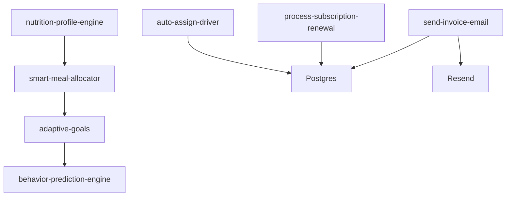

**Diagram sources**
- [index.ts (nutrition-profile-engine):1-338](file://supabase/functions/nutrition-profile-engine/index.ts#L1-L338)
- [index.ts (smart-meal-allocator):1-755](file://supabase/functions/smart-meal-allocator/index.ts#L1-L755)
- [index.ts (adaptive-goals):1-522](file://supabase/functions/adaptive-goals/index.ts#L1-L522)
- [index.ts (behavior-prediction-engine):1-513](file://supabase/functions/behavior-prediction-engine/index.ts#L1-L513)
- [index.ts (auto-assign-driver):1-340](file://supabase/functions/auto-assign-driver/index.ts#L1-L340)
- [index.ts (process-subscription-renewal):1-278](file://supabase/functions/process-subscription-renewal/index.ts#L1-L278)
- [index.ts (send-invoice-email):1-540](file://supabase/functions/send-invoice-email/index.ts#L1-L540)

## Detailed Component Analysis

### adaptive-goals
- Purpose: Analyze user progress and recommend macro adjustments, detect plateaus, and forecast weight trends.
- Inputs: user_id, optional dry_run flag.
- Outputs: recommendation object (new macros, confidence, plateau flag), predictions array, optional adjustment_id and notification flag.
- Processing logic:
  - Loads profile and recent logs (weight/calories).
  - Computes adherence and weekly summary.
  - Applies scenario-driven adjustments (plateau, rapid loss/gain, low adherence, goal achievement).
  - Stores adjustment history, predictions, and updates profile flags.
- Error handling: Returns 400/404/500 with structured messages; logs errors.
- Triggers: invoked by adaptive-goals-batch or directly.

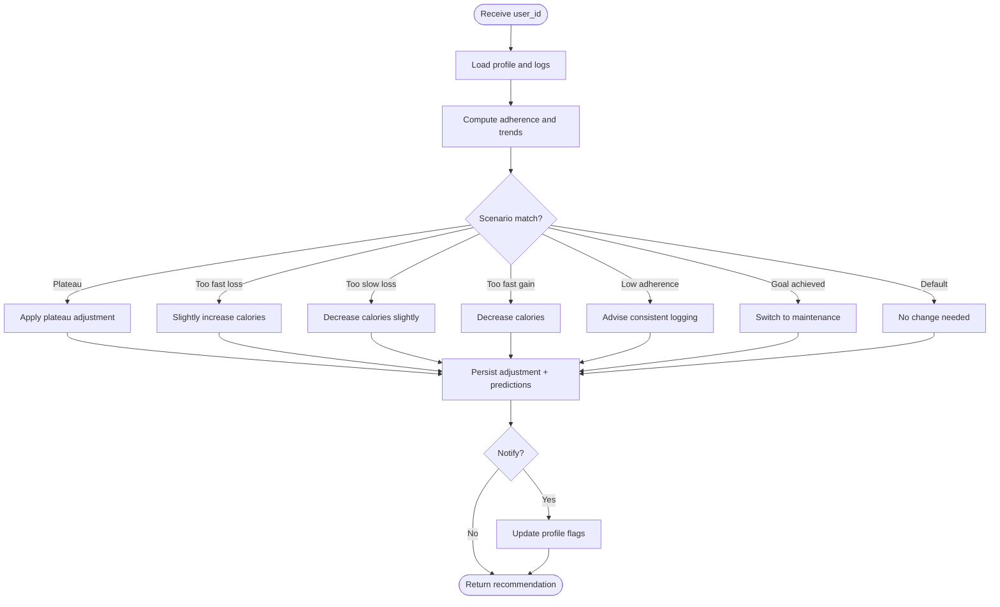

**Diagram sources**
- [index.ts (adaptive-goals):52-227](file://supabase/functions/adaptive-goals/index.ts#L52-L227)
- [index.ts (adaptive-goals):418-521](file://supabase/functions/adaptive-goals/index.ts#L418-L521)

**Section sources**
- [index.ts (adaptive-goals):1-522](file://supabase/functions/adaptive-goals/index.ts#L1-L522)

### adaptive-goals-batch
- Purpose: Periodically invoke adaptive-goals for eligible users based on settings and last adjustment cadence.
- Inputs: None (runs server-side).
- Outputs: Aggregated statistics (processed, skipped, errors, adjustments_created, plateaus_detected).
- Processing logic:
  - Queries active users with onboarding completed.
  - Checks adaptive-goal settings and last adjustment date.
  - Calls adaptive-goals endpoint per user with small delays to mitigate rate limits.
- Error handling: Per-user try/catch with counters.

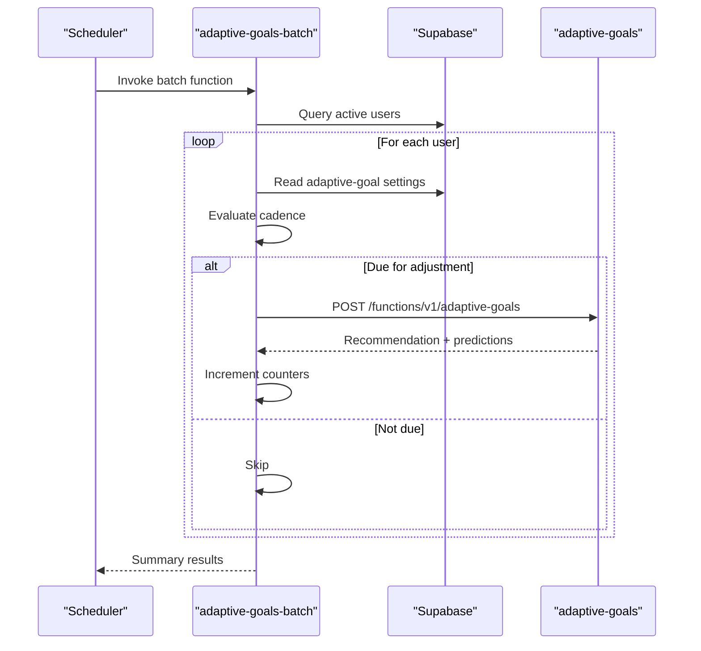

**Diagram sources**
- [index.ts (adaptive-goals-batch):19-126](file://supabase/functions/adaptive-goals-batch/index.ts#L19-L126)
- [index.ts (adaptive-goals):1-522](file://supabase/functions/adaptive-goals/index.ts#L1-L522)

**Section sources**
- [index.ts (adaptive-goals-batch):1-136](file://supabase/functions/adaptive-goals-batch/index.ts#L1-L136)

### behavior-prediction-engine
- Purpose: Predict churn/boredom risks and compute engagement score; optionally execute retention actions.
- Inputs: user_id, analyze_period_days (default 30), auto_execute (boolean).
- Outputs: predictions (churn_risk_score, boredom_risk_score, engagement_score), metrics, recommendations, optional executed_actions.
- Processing logic:
  - Aggregates orders, ratings, behavior events, and weekly plans.
  - Computes ordering frequency, skip rate, restaurant diversity, average rating, app opens, plan adherence.
  - Scores churn/boredom and generates recommendations with priorities.
  - Optionally executes actions (e.g., award credits) and logs outcomes.

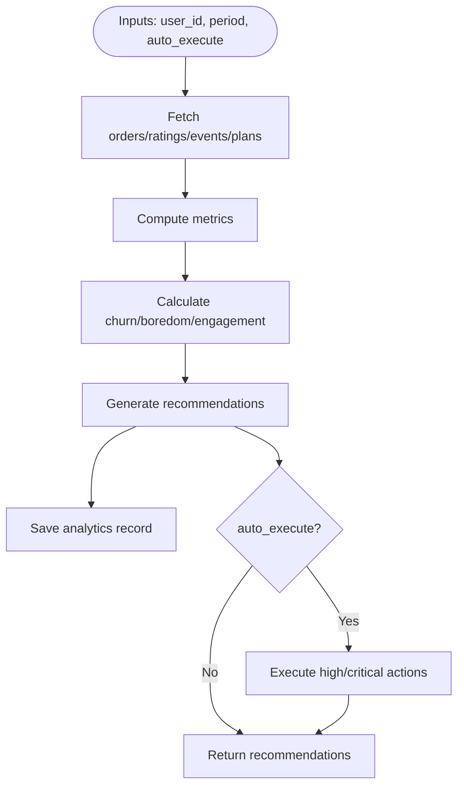

**Diagram sources**
- [index.ts (behavior-prediction-engine):306-512](file://supabase/functions/behavior-prediction-engine/index.ts#L306-L512)

**Section sources**
- [index.ts (behavior-prediction-engine):1-513](file://supabase/functions/behavior-prediction-engine/index.ts#L1-L513)

### nutrition-profile-engine
- Purpose: Compute BMR/TDEE/target macros and optional meal distribution from biometric inputs.
- Inputs: user_id, profile_data (gender, age, height_cm, weight_kg, activity_level, goal, optional training_days_per_week, preferences/allergies), save_to_database flag.
- Outputs: nutrition_profile object and success message.
- Processing logic:
  - Validates required fields and ranges.
  - Calculates BMR/TDEE/target calories/macros.
  - Optionally saves to profiles and user_preferences, logs behavior event.

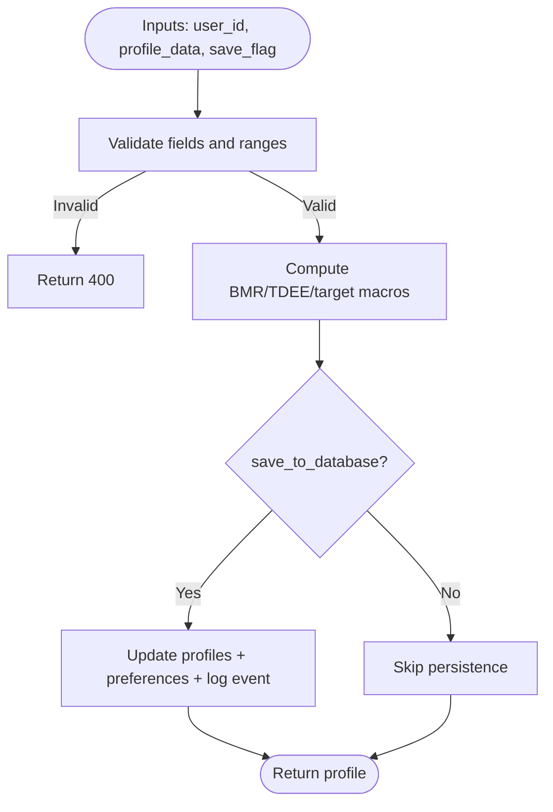

**Diagram sources**
- [index.ts (nutrition-profile-engine):199-337](file://supabase/functions/nutrition-profile-engine/index.ts#L199-L337)

**Section sources**
- [index.ts (nutrition-profile-engine):1-338](file://supabase/functions/nutrition-profile-engine/index.ts#L1-L338)

### smart-meal-allocator
- Purpose: Generate weekly/daily meal plans respecting macro targets, variety, and restaurant capacity.
- Inputs: user_id, week_start_date (YYYY-MM-DD), generate_variations, save_to_database, remaining_calories, remaining_protein, locked_meal_types, mode ("weekly"|"daily").
- Outputs: plan items enriched with restaurant/meal details, totals, compliance and variety scores.
- Processing logic:
  - Loads user profile and preferences, fetches available meals.
  - For daily mode, generates plan with remaining nutrition and locked meals.
  - For weekly mode, shuffles meals and selects best plan by macro compliance.
  - Saves plan items and logs behavior event.

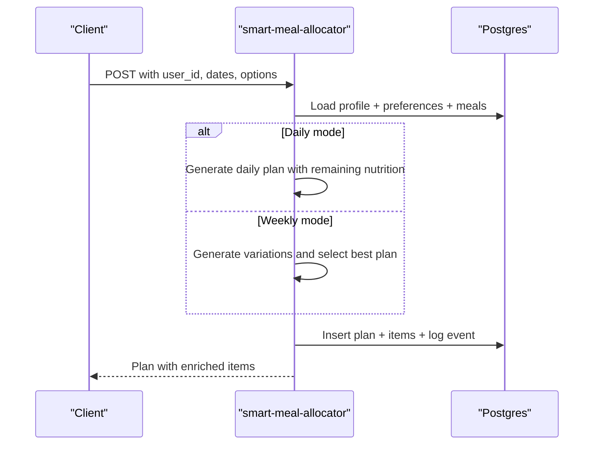

**Diagram sources**
- [index.ts (smart-meal-allocator):480-754](file://supabase/functions/smart-meal-allocator/index.ts#L480-L754)

**Section sources**
- [index.ts (smart-meal-allocator):1-755](file://supabase/functions/smart-meal-allocator/index.ts#L1-L755)

### auto-assign-driver
- Purpose: Assign the best available driver to a delivery job using a composite scoring algorithm.
- Inputs: deliveryId or orderId (backwards compatible).
- Outputs: success with driverId/score/message; or queued/no-drivers; or error.
- Processing logic:
  - Loads delivery and restaurant coordinates.
  - Queries online/approved drivers and counts active deliveries.
  - Scores drivers by distance (exp decay), capacity, rating, and experience.
  - Updates delivery status, meal_schedule, and notifies driver (non-blocking).

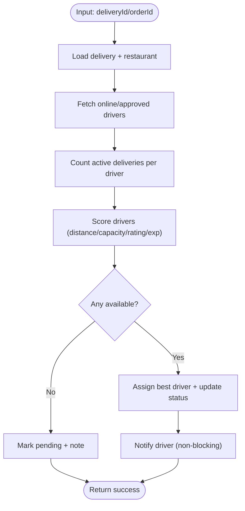

**Diagram sources**
- [index.ts (auto-assign-driver):130-287](file://supabase/functions/auto-assign-driver/index.ts#L130-L287)

**Section sources**
- [index.ts (auto-assign-driver):1-340](file://supabase/functions/auto-assign-driver/index.ts#L1-L340)

### process-subscription-renewal
- Purpose: Renew active subscriptions and compute rollover credits; optionally send notifications.
- Inputs: subscription_id (optional), user_id (optional), dry_run (boolean).
- Outputs: aggregated results per subscription with success/error, rollover_credits, cycle dates, total credits.
- Processing logic:
  - Validates JWT and permissions; builds query for due subscriptions.
  - For each subscription, fetches plan details and either previews or executes rollover via RPC.
  - Sends subscription-renewed email via send-email function on success.

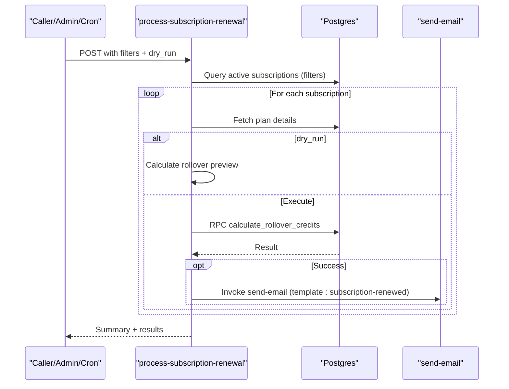

**Diagram sources**
- [index.ts (process-subscription-renewal):30-277](file://supabase/functions/process-subscription-renewal/index.ts#L30-L277)

**Section sources**
- [index.ts (process-subscription-renewal):1-278](file://supabase/functions/process-subscription-renewal/index.ts#L1-L278)

### send-invoice-email (Phase 2)
- Purpose: Automatically send professional invoices when payments complete.
- Inputs: paymentId (and optional userId).
- Outputs: success with emailId/invoiceNumber or failure with message.
- Processing logic:
  - Validates credentials and method.
  - Loads payment + profile, checks invoice linkage and status.
  - Ensures payment is completed; generates invoice number and record.
  - Renders HTML invoice and sends via Resend; logs outcome and updates invoice status.

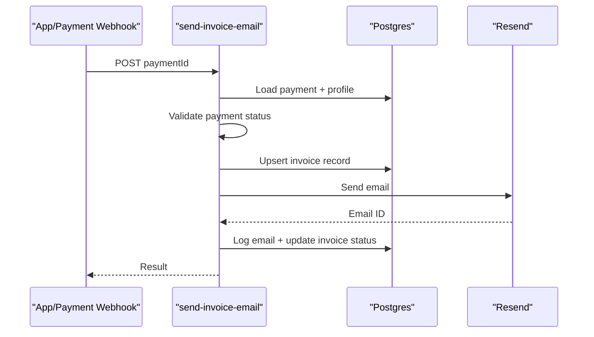

**Diagram sources**
- [index.ts (send-invoice-email):475-539](file://supabase/functions/send-invoice-email/index.ts#L475-L539)

**Section sources**
- [PHASE2_EDGE_FUNCTIONS.md:106-172](file://supabase/functions/PHASE2_EDGE_FUNCTIONS.md#L106-L172)
- [index.ts (send-invoice-email):1-540](file://supabase/functions/send-invoice-email/index.ts#L1-L540)

## Dependency Analysis
- Runtime: All functions use Deno’s std http server and Supabase JS client.
- Authentication: Functions rely on Supabase Auth; some require JWT verification (process-subscription-renewal).
- External services: Resend for email (send-invoice-email).
- Database: Supabase Postgres; functions perform reads/writes across multiple tables (profiles, subscriptions, deliveries, invoices, etc.).

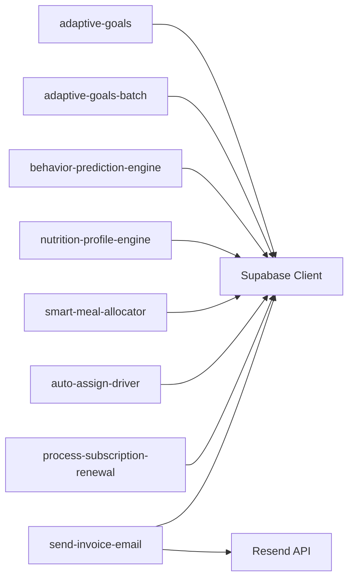

**Diagram sources**
- [index.ts (adaptive-goals):1-5](file://supabase/functions/adaptive-goals/index.ts#L1-L5)
- [index.ts (send-invoice-email):4-5](file://supabase/functions/send-invoice-email/index.ts#L4-L5)

**Section sources**
- [index.ts (adaptive-goals):1-5](file://supabase/functions/adaptive-goals/index.ts#L1-L5)
- [index.ts (send-invoice-email):4-5](file://supabase/functions/send-invoice-email/index.ts#L4-L5)

## Performance Considerations
- Cold starts: Keep functions small and avoid heavy initialization; reuse Supabase client per request lifecycle.
- Network latency: Batch calls (adaptive-goals-batch) introduce small delays to prevent rate limiting.
- Database queries: Use targeted selects and indexes; avoid N+1 queries (e.g., adaptive-goals-batch loops with minimal DB work).
- Caching: Consider in-memory caching for frequently accessed static data (e.g., plan configurations) within function scope.
- Concurrency: Use Supabase RPCs for atomic operations (e.g., rollover credits) to avoid race conditions.
- Logging: Prefer structured logs and avoid excessive console output in hot paths.

[No sources needed since this section provides general guidance]

## Troubleshooting Guide
- Function deployment failures:
  - Ensure Supabase CLI is up to date and linked to the project.
  - Verify environment variables are set and redeploy after changes.
- Missing environment variables:
  - Confirm SUPABASE_URL, SUPABASE_SERVICE_ROLE_KEY, and RESEND_API_KEY (for send-invoice-email).
- Database connectivity:
  - Validate service role key permissions and RLS policies.
- Email delivery:
  - Check Resend API key validity and quota; inspect email_logs for errors.
- Function-specific:
  - adaptive-goals: Verify user_id and adaptive goals settings; check dry_run vs. live runs.
  - auto-assign-driver: Ensure delivery exists, status allows assignment, and drivers are online/approved.
  - process-subscription-renewal: Validate JWT for non-cron invocations and permissions for specific subscriptions.

**Section sources**
- [PHASE2_EDGE_FUNCTIONS.md:380-411](file://supabase/functions/PHASE2_EDGE_FUNCTIONS.md#L380-L411)

## Conclusion
The Nutrio Edge Functions implement a robust, layered serverless automation pipeline integrating nutrition modeling, behavior analytics, meal planning, driver assignment, and subscription renewal. By leveraging Supabase Auth, Postgres, and external services like Resend, the system achieves scalable, secure, and observable automation. Proper environment management, error handling, and monitoring ensure reliability, while function composition enables flexible orchestration and future extensibility.