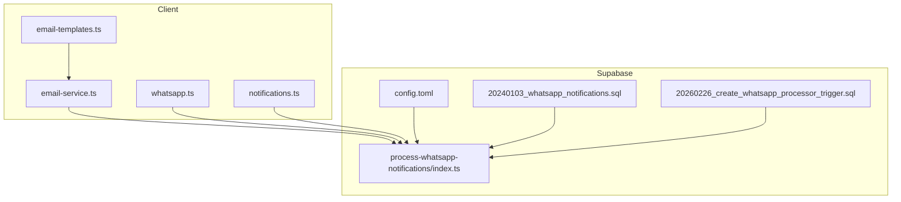
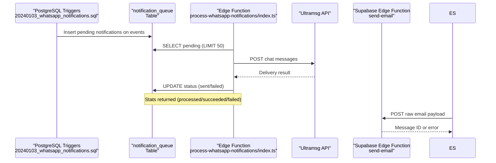
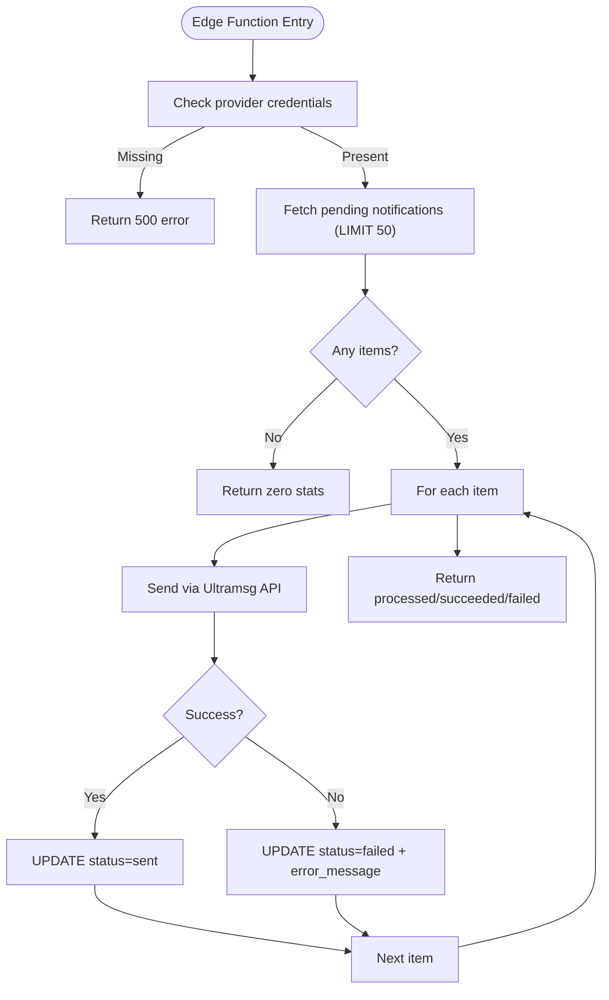
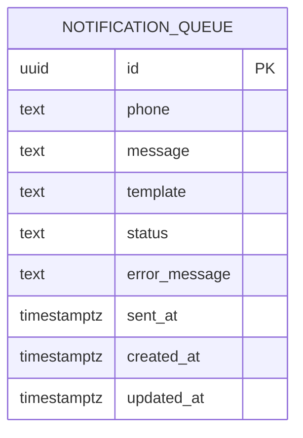
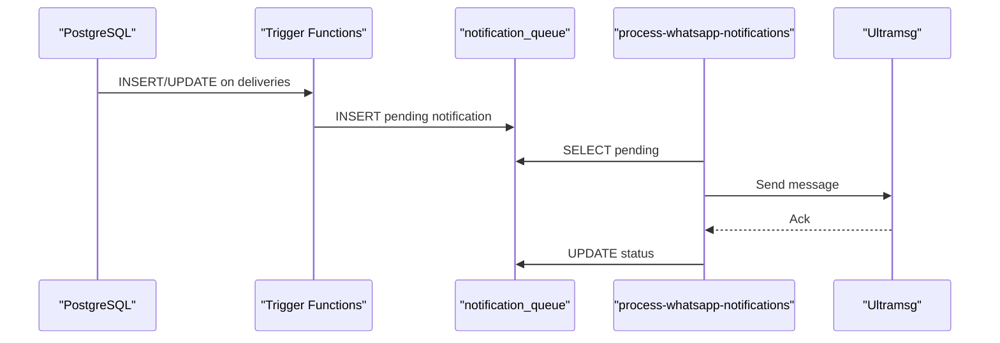
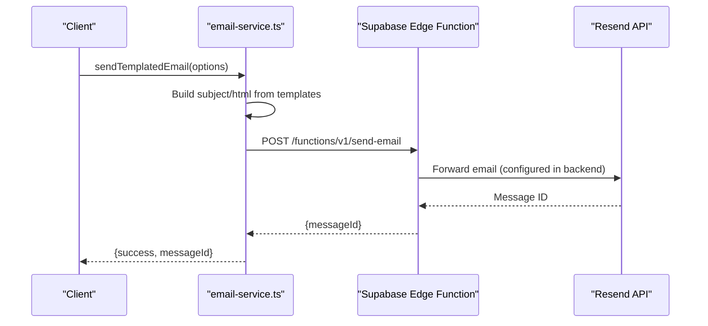
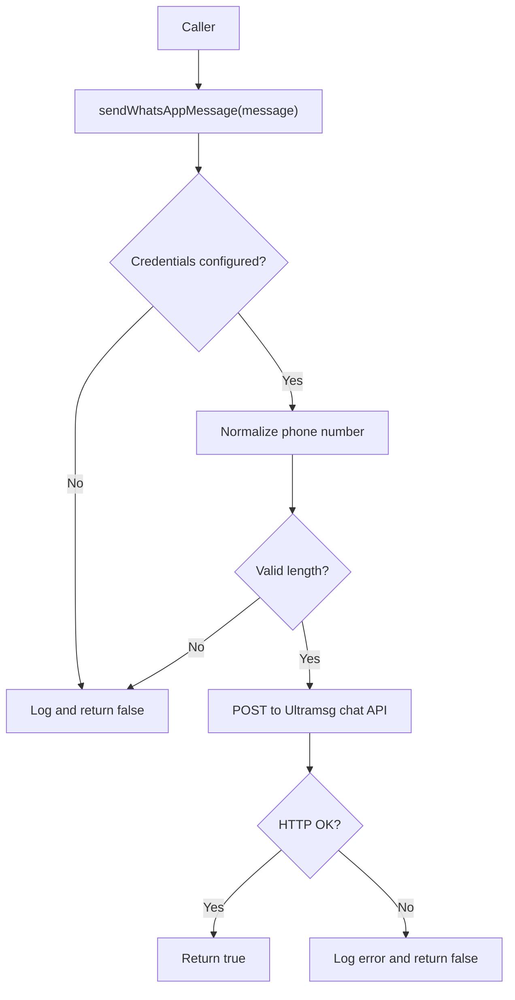
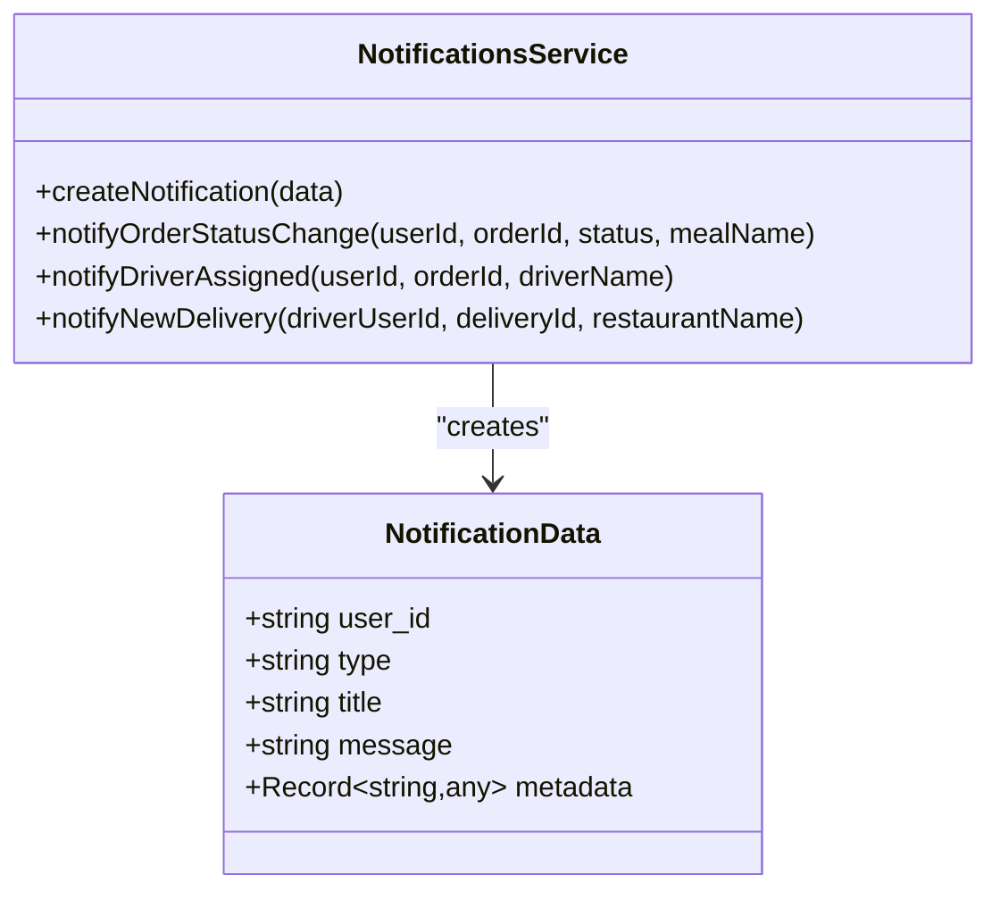
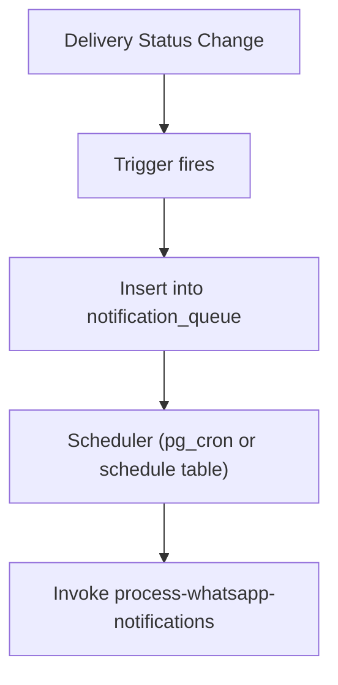
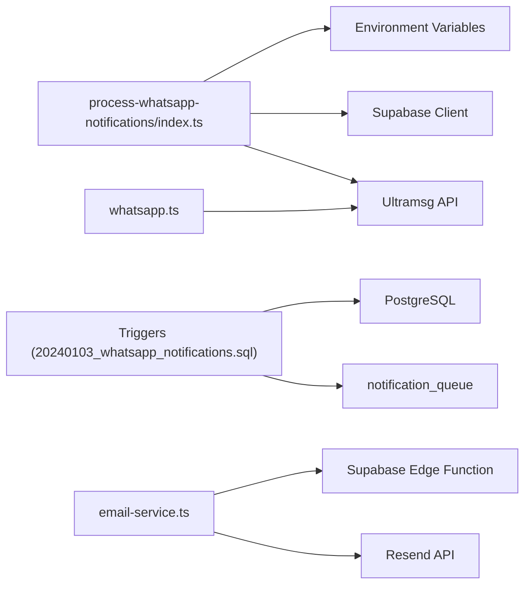

# Notification System Functions

<cite>
**Referenced Files in This Document**
- [index.ts](file://supabase/functions/process-whatsapp-notifications/index.ts)
- [20240103_whatsapp_notifications.sql](file://supabase/migrations/20240103_whatsapp_notifications.sql)
- [20260226_create_whatsapp_processor_trigger.sql](file://supabase/migrations/20260226_create_whatsapp_processor_trigger.sql)
- [email-templates.ts](file://src/lib/email-templates.ts)
- [email-service.ts](file://src/lib/email-service.ts)
- [whatsapp.ts](file://src/lib/whatsapp.ts)
- [resend.ts](file://src/lib/resend.ts)
- [notifications.ts](file://src/lib/notifications.ts)
- [config.toml](file://supabase/config.toml)
</cite>

## Table of Contents
1. [Introduction](#introduction)
2. [Project Structure](#project-structure)
3. [Core Components](#core-components)
4. [Architecture Overview](#architecture-overview)
5. [Detailed Component Analysis](#detailed-component-analysis)
6. [Dependency Analysis](#dependency-analysis)
7. [Performance Considerations](#performance-considerations)
8. [Troubleshooting Guide](#troubleshooting-guide)
9. [Conclusion](#conclusion)
10. [Appendices](#appendices)

## Introduction
This document describes the Notification System edge functions and multi-channel communication infrastructure for the Nutrio platform. It covers push notifications, email delivery, WhatsApp messaging, and automated notification workflows. It explains notification triggers, template management, personalization logic, delivery tracking, provider integrations, examples of notification sequences, conditional triggering, user preference handling, deliverability optimization, retry mechanisms, compliance considerations, analytics, A/B testing, and performance monitoring.

## Project Structure
The notification system spans client-side libraries, Supabase edge functions, and database triggers/migrations:
- Edge functions: WhatsApp processing pipeline
- Database: notification queue and triggers for event-driven notifications
- Client libraries: email templating, email dispatch, WhatsApp messaging, and local push notifications
- Provider integrations: Ultramsg (WhatsApp), Resend (email), Supabase Edge Functions (transport)

**Diagram sources**
- [email-templates.ts](file://src/lib/email-templates.ts)
- [email-service.ts](file://src/lib/email-service.ts)
- [whatsapp.ts](file://src/lib/whatsapp.ts)
- [notifications.ts](file://src/lib/notifications.ts)
- [config.toml](file://supabase/config.toml)
- [20240103_whatsapp_notifications.sql](file://supabase/migrations/20240103_whatsapp_notifications.sql)
- [20260226_create_whatsapp_processor_trigger.sql](file://supabase/migrations/20260226_create_whatsapp_processor_trigger.sql)
- [index.ts](file://supabase/functions/process-whatsapp-notifications/index.ts)

**Section sources**
- [email-templates.ts](file://src/lib/email-templates.ts)
- [email-service.ts](file://src/lib/email-service.ts)
- [whatsapp.ts](file://src/lib/whatsapp.ts)
- [notifications.ts](file://src/lib/notifications.ts)
- [config.toml](file://supabase/config.toml)
- [20240103_whatsapp_notifications.sql](file://supabase/migrations/20240103_whatsapp_notifications.sql)
- [20260226_create_whatsapp_processor_trigger.sql](file://supabase/migrations/20260226_create_whatsapp_processor_trigger.sql)
- [index.ts](file://supabase/functions/process-whatsapp-notifications/index.ts)

## Core Components
- WhatsApp edge function: processes queued notifications via Ultramsg API, updates statuses, and returns statistics.
- Database triggers and queue: enqueue WhatsApp notifications on events (delivery status changes, new deliveries, cancellations).
- Email templating and dispatch: client-side email templates and dispatch via Supabase Edge Function.
- WhatsApp client library: convenience functions for common notifications and direct chat API calls.
- Local push notifications: client-side helpers to create and categorize in-app notifications.

**Section sources**
- [index.ts](file://supabase/functions/process-whatsapp-notifications/index.ts)
- [20240103_whatsapp_notifications.sql](file://supabase/migrations/20240103_whatsapp_notifications.sql)
- [email-templates.ts](file://src/lib/email-templates.ts)
- [email-service.ts](file://src/lib/email-service.ts)
- [whatsapp.ts](file://src/lib/whatsapp.ts)
- [notifications.ts](file://src/lib/notifications.ts)

## Architecture Overview
The system uses event-driven triggers to enqueue notifications, an edge function to process them asynchronously, and provider APIs for delivery. Email is dispatched via a Supabase Edge Function endpoint. Push notifications are created locally in the client.

**Diagram sources**
- [20240103_whatsapp_notifications.sql](file://supabase/migrations/20240103_whatsapp_notifications.sql)
- [index.ts](file://supabase/functions/process-whatsapp-notifications/index.ts)
- [email-service.ts](file://src/lib/email-service.ts)

## Detailed Component Analysis

### WhatsApp Edge Function Pipeline
The edge function handles:
- Environment validation for provider credentials
- Fetching pending notifications from the queue
- Sending via Ultramsg chat API with phone number normalization and validation
- Updating statuses and error tracking
- Returning summary statistics

**Diagram sources**
- [index.ts](file://supabase/functions/process-whatsapp-notifications/index.ts)

**Section sources**
- [index.ts](file://supabase/functions/process-whatsapp-notifications/index.ts)

### Database Triggers and Queue
Triggers enqueue WhatsApp notifications for:
- Delivery lifecycle events (created, driver assigned, picked up, on the way, delivered, cancelled)
- New delivery availability to drivers
- Partner notifications when a driver claims a delivery

The queue table stores phone, message, template, status, timestamps, and optional error messages. Policies restrict access to service role.

**Diagram sources**
- [20240103_whatsapp_notifications.sql](file://supabase/migrations/20240103_whatsapp_notifications.sql)

**Section sources**
- [20240103_whatsapp_notifications.sql](file://supabase/migrations/20240103_whatsapp_notifications.sql)

### Event-Driven Notification Sequences
Common sequences:
- Customer order lifecycle: created → driver assigned → picked up → on the way → delivered
- Driver availability: new delivery → driver receives notification
- Partner notifications: driver assigned → partner receives notification

**Diagram sources**
- [20240103_whatsapp_notifications.sql](file://supabase/migrations/20240103_whatsapp_notifications.sql)
- [index.ts](file://supabase/functions/process-whatsapp-notifications/index.ts)

**Section sources**
- [20240103_whatsapp_notifications.sql](file://supabase/migrations/20240103_whatsapp_notifications.sql)

### Email Delivery Infrastructure
- Template management: centralized HTML templates with subject and HTML generators.
- Dispatch: client-side function posts to Supabase Edge Function endpoint with JWT authorization.
- Provider integration: Resend SDK supports attachments and templated HTML.

**Diagram sources**
- [email-templates.ts](file://src/lib/email-templates.ts)
- [email-service.ts](file://src/lib/email-service.ts)
- [resend.ts](file://src/lib/resend.ts)

**Section sources**
- [email-templates.ts](file://src/lib/email-templates.ts)
- [email-service.ts](file://src/lib/email-service.ts)
- [resend.ts](file://src/lib/resend.ts)

### WhatsApp Messaging Library
- Direct chat API: convenience function to send text messages via Ultramsg.
- Scenario-specific helpers: customer, partner, driver, and admin notifications with preformatted messages.

**Diagram sources**
- [whatsapp.ts](file://src/lib/whatsapp.ts)

**Section sources**
- [whatsapp.ts](file://src/lib/whatsapp.ts)

### Local Push Notifications
- Client-side helpers create structured notifications with type, title, message, and metadata.
- Stored in a local notifications table for retrieval and read/unread state.

**Diagram sources**
- [notifications.ts](file://src/lib/notifications.ts)

**Section sources**
- [notifications.ts](file://src/lib/notifications.ts)

### Conditional Triggering and Scheduling
- Triggers fire on delivery status changes and new deliveries.
- A scheduling helper table supports periodic invocation of the WhatsApp processor when external cron is unavailable.

**Diagram sources**
- [20240103_whatsapp_notifications.sql](file://supabase/migrations/20240103_whatsapp_notifications.sql)
- [20260226_create_whatsapp_processor_trigger.sql](file://supabase/migrations/20260226_create_whatsapp_processor_trigger.sql)

**Section sources**
- [20260226_create_whatsapp_processor_trigger.sql](file://supabase/migrations/20260226_create_whatsapp_processor_trigger.sql)

## Dependency Analysis
- Edge function depends on Supabase client and environment variables for provider credentials.
- Triggers depend on database relations (profiles, restaurants, drivers, meal_schedules) to construct messages.
- Client libraries depend on environment variables for provider keys and Supabase endpoints.

**Diagram sources**
- [index.ts](file://supabase/functions/process-whatsapp-notifications/index.ts)
- [20240103_whatsapp_notifications.sql](file://supabase/migrations/20240103_whatsapp_notifications.sql)
- [email-service.ts](file://src/lib/email-service.ts)
- [resend.ts](file://src/lib/resend.ts)
- [whatsapp.ts](file://src/lib/whatsapp.ts)

**Section sources**
- [index.ts](file://supabase/functions/process-whatsapp-notifications/index.ts)
- [20240103_whatsapp_notifications.sql](file://supabase/migrations/20240103_whatsapp_notifications.sql)
- [email-service.ts](file://src/lib/email-service.ts)
- [resend.ts](file://src/lib/resend.ts)
- [whatsapp.ts](file://src/lib/whatsapp.ts)

## Performance Considerations
- Batch processing: the edge function limits batch size to reduce latency and resource usage.
- Indexing: pending notifications are indexed to optimize selection queries.
- Asynchronous delivery: triggers enqueue work for later processing to keep transaction times low.
- Retry and backoff: implement exponential backoff at the provider level and consider reprocessing failed items periodically.
- Rate limiting: adhere to provider rate limits; consider jitter and throttling in client libraries.

[No sources needed since this section provides general guidance]

## Troubleshooting Guide
- Missing provider credentials: the edge function returns a 500 error when provider tokens are not configured.
- Invalid phone numbers: normalized and validated before sending; ensure E.164 format.
- Database permission errors: queue table enforces RLS for service role; verify policies and roles.
- Email dispatch failures: check Supabase Edge Function logs and provider error responses.
- Delivery tracking: inspect queue status updates and error messages for failed items.

**Section sources**
- [index.ts](file://supabase/functions/process-whatsapp-notifications/index.ts)
- [20240103_whatsapp_notifications.sql](file://supabase/migrations/20240103_whatsapp_notifications.sql)
- [email-service.ts](file://src/lib/email-service.ts)

## Conclusion
The Notification System combines database triggers, an edge function pipeline, and provider integrations to deliver reliable, scalable, and event-driven communications across WhatsApp, email, and in-app push channels. The modular design enables maintainable templates, robust delivery tracking, and extensibility for additional channels.

[No sources needed since this section summarizes without analyzing specific files]

## Appendices

### Template Management and Personalization
- Email templates define subject and HTML content builders; personalization data is injected at render time.
- WhatsApp messages are constructed from scenario-specific helpers with placeholders for names, IDs, and locations.

**Section sources**
- [email-templates.ts](file://src/lib/email-templates.ts)
- [whatsapp.ts](file://src/lib/whatsapp.ts)

### Compliance and Deliverability
- Validate phone numbers and sanitize inputs.
- Respect opt-out preferences and implement unsubscribe mechanisms.
- Monitor provider deliverability and abuse signals; implement retry and suppression lists.
- Store minimal PII and ensure encryption at rest and in transit.

[No sources needed since this section provides general guidance]

### Analytics, A/B Testing, and Monitoring
- Track delivery metrics: processed, succeeded, failed counts per run.
- Attribute events to templates and channels for funnel analysis.
- A/B test message copy, timing, and channel preferences.
- Monitor error rates, latency, and provider SLAs; alert on anomalies.

[No sources needed since this section provides general guidance]