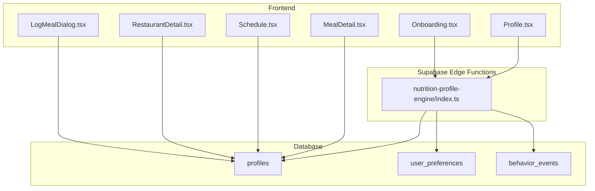
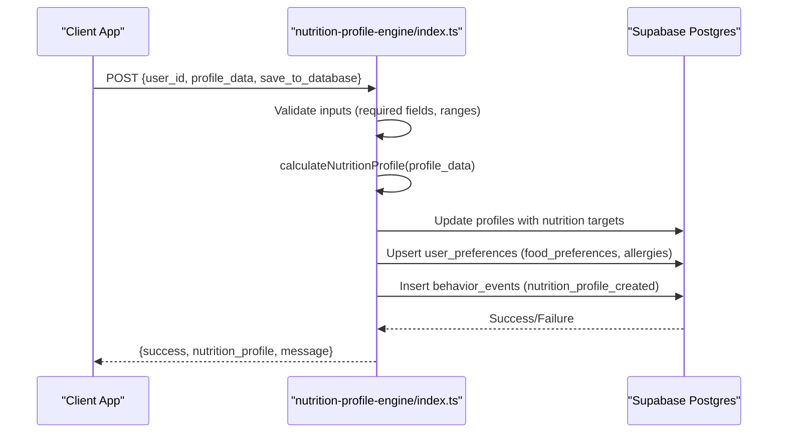
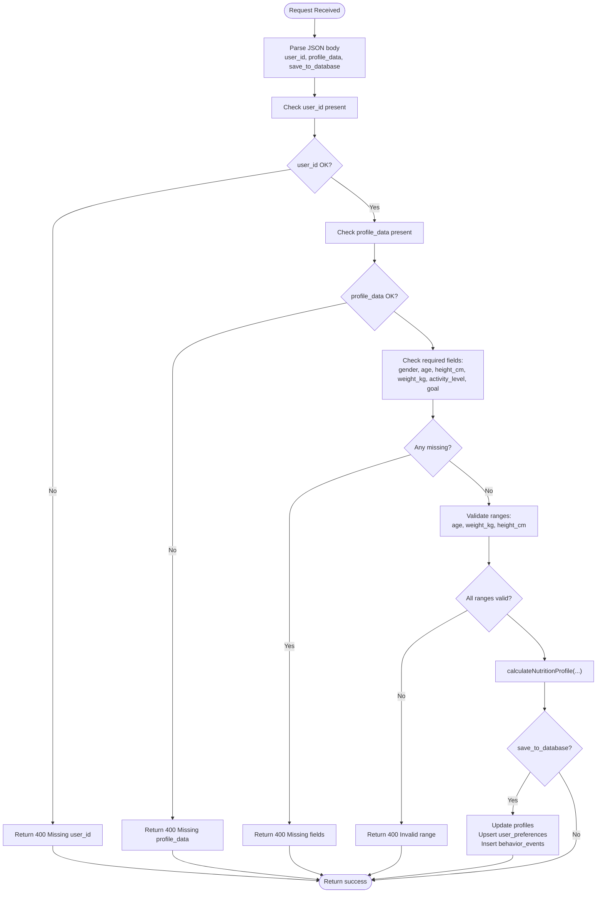
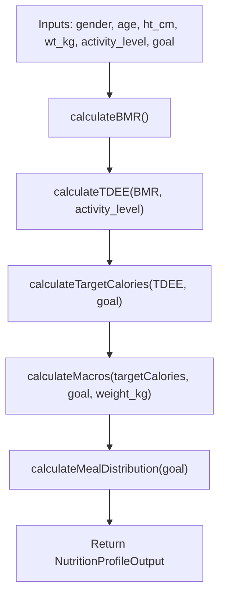
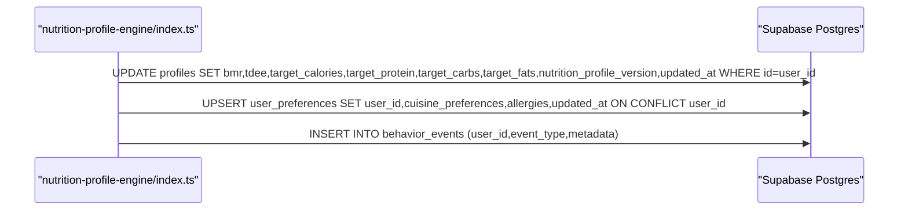
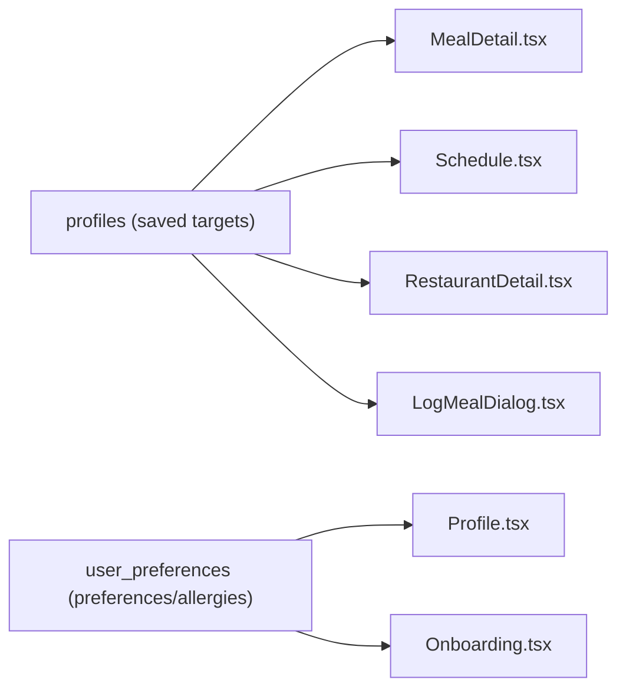
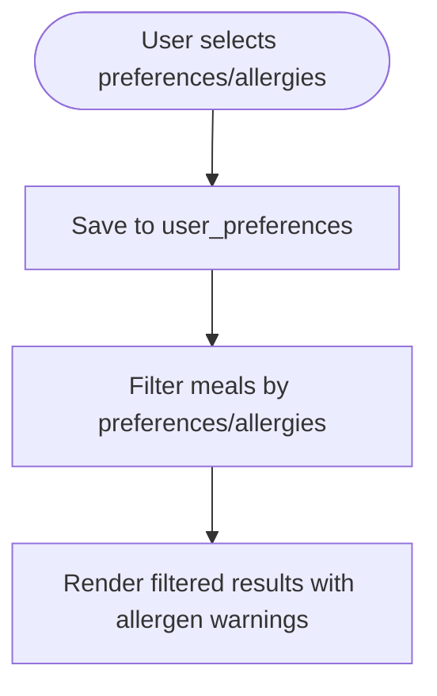
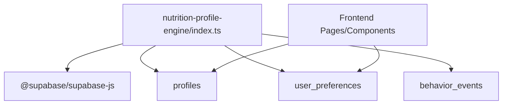

# Nutrition Profile Engine

<cite>
**Referenced Files in This Document**
- [index.ts](file://supabase/functions/nutrition-profile-engine/index.ts)
- [nutrition-calculator.ts](file://src/lib/nutrition-calculator.ts)
- [20260224000001_add_ai_profile_fields.sql](file://supabase/migrations/20260224000001_add_ai_profile_fields.sql)
- [PHASE2_EDGE_FUNCTIONS.md](file://supabase/functions/PHASE2_EDGE_FUNCTIONS.md)
- [MealDetail.tsx](file://src/pages/MealDetail.tsx)
- [LogMealDialog.tsx](file://src/components/LogMealDialog.tsx)
- [Schedule.tsx](file://src/pages/Schedule.tsx)
- [RestaurantDetail.tsx](file://src/pages/RestaurantDetail.tsx)
- [useDietTags.ts](file://src/hooks/useDietTags.ts)
- [Profile.tsx](file://src/pages/Profile.tsx)
- [Onboarding.tsx](file://src/pages/Onboarding.tsx)
</cite>

## Table of Contents
1. [Introduction](#introduction)
2. [Project Structure](#project-structure)
3. [Core Components](#core-components)
4. [Architecture Overview](#architecture-overview)
5. [Detailed Component Analysis](#detailed-component-analysis)
6. [Dependency Analysis](#dependency-analysis)
7. [Performance Considerations](#performance-considerations)
8. [Troubleshooting Guide](#troubleshooting-guide)
9. [Conclusion](#conclusion)
10. [Appendices](#appendices)

## Introduction
The Nutrition Profile Engine is a Supabase Edge Function responsible for calculating personalized nutrition targets from user biometric and lifestyle inputs. It computes Basal Metabolic Rate (BMR), Total Daily Energy Expenditure (TDEE), target calories, macronutrient distribution, and daily meal proportions. The function integrates with the broader meal ordering system by storing calculated targets and user preferences, enabling downstream features like meal selection, dietary filtering, and nutritional logging.

## Project Structure
The engine resides in the Supabase Edge Functions ecosystem and interacts with frontend components and database tables to deliver a complete nutrition workflow.

**Diagram sources**
- [index.ts:1-338](file://supabase/functions/nutrition-profile-engine/index.ts#L1-L338)
- [Profile.tsx:817-838](file://src/pages/Profile.tsx#L817-L838)
- [Onboarding.tsx:1342-1365](file://src/pages/Onboarding.tsx#L1342-L1365)
- [MealDetail.tsx:1-200](file://src/pages/MealDetail.tsx#L1-L200)
- [Schedule.tsx:901-917](file://src/pages/Schedule.tsx#L901-L917)
- [RestaurantDetail.tsx:731-745](file://src/pages/RestaurantDetail.tsx#L731-L745)
- [LogMealDialog.tsx:894-909](file://src/components/LogMealDialog.tsx#L894-L909)

**Section sources**
- [index.ts:1-338](file://supabase/functions/nutrition-profile-engine/index.ts#L1-L338)
- [Profile.tsx:817-838](file://src/pages/Profile.tsx#L817-L838)
- [Onboarding.tsx:1342-1365](file://src/pages/Onboarding.tsx#L1342-L1365)
- [MealDetail.tsx:1-200](file://src/pages/MealDetail.tsx#L1-L200)
- [Schedule.tsx:901-917](file://src/pages/Schedule.tsx#L901-L917)
- [RestaurantDetail.tsx:731-745](file://src/pages/RestaurantDetail.tsx#L731-L745)
- [LogMealDialog.tsx:894-909](file://src/components/LogMealDialog.tsx#L894-L909)

## Core Components
- Edge Function Input Model: Accepts user biometrics, activity level, goal, and optional dietary preferences/allergies.
- Calculation Engine: Implements Mifflin-St Jeor BMR, TDEE multipliers, goal-based calorie adjustments, macro distribution, and meal distribution.
- Persistence Layer: Saves nutrition targets and preferences to the database and logs behavior events.
- Frontend Integration: Reads saved targets and displays nutritional information across meal selection and logging screens.

Key outputs include BMR, TDEE, target calories, macro targets (protein, carbs, fats), macro percentages, and daily meal distribution fractions.

**Section sources**
- [index.ts:13-45](file://supabase/functions/nutrition-profile-engine/index.ts#L13-L45)
- [index.ts:47-197](file://supabase/functions/nutrition-profile-engine/index.ts#L47-L197)
- [index.ts:266-319](file://supabase/functions/nutrition-profile-engine/index.ts#L266-L319)

## Architecture Overview
The engine orchestrates a request-response flow with validation, calculation, persistence, and logging.

**Diagram sources**
- [index.ts:199-337](file://supabase/functions/nutrition-profile-engine/index.ts#L199-L337)

## Detailed Component Analysis

### Edge Function Inputs and Validation
- Required fields: gender, age, height_cm, weight_kg, activity_level, goal.
- Range validations: age (13–100), weight (30–300 kg), height (100–250 cm).
- Optional fields: training_days_per_week, food_preferences[], allergies[].
- Persistence toggle: save_to_database flag controls whether to write to DB.

**Diagram sources**
- [index.ts:212-289](file://supabase/functions/nutrition-profile-engine/index.ts#L212-L289)

**Section sources**
- [index.ts:212-289](file://supabase/functions/nutrition-profile-engine/index.ts#L212-L289)

### Calculation Algorithms
- BMR: Mifflin-St Jeor equation applied separately for male/female.
- TDEE: BMR multiplied by activity-level multiplier.
- Target Calories: Goal-specific adjustment (deficit/surplus/maintenance).
- Macros: Goal-based percentage split converted to grams (4 cal/g for protein/carbs, 9 cal/g for fats). Minimum protein enforced at 1.6 g/kg bodyweight.
- Meal Distribution: Goal-specific fractions across breakfast, lunch, dinner, and snacks.

**Diagram sources**
- [index.ts:47-197](file://supabase/functions/nutrition-profile-engine/index.ts#L47-L197)

**Section sources**
- [index.ts:47-197](file://supabase/functions/nutrition-profile-engine/index.ts#L47-L197)

### Data Persistence and Preferences
- Profiles table receives: bmr, tdee, target_calories, target_protein, target_carbs, target_fats, nutrition_profile_version, updated_at.
- User preferences are upserted into user_preferences with cuisine_preferences and allergies arrays.
- Behavior event logged for analytics.

**Diagram sources**
- [index.ts:266-319](file://supabase/functions/nutrition-profile-engine/index.ts#L266-L319)

**Section sources**
- [index.ts:266-319](file://supabase/functions/nutrition-profile-engine/index.ts#L266-L319)

### Frontend Integration and Display
- Saved nutrition targets are consumed by various UI components to show calories, protein, carbs, and fats during meal browsing and logging.
- Dietary preferences and allergies are surfaced for filtering and allergen warnings.

**Diagram sources**
- [MealDetail.tsx:1-200](file://src/pages/MealDetail.tsx#L1-L200)
- [Schedule.tsx:901-917](file://src/pages/Schedule.tsx#L901-L917)
- [RestaurantDetail.tsx:731-745](file://src/pages/RestaurantDetail.tsx#L731-L745)
- [LogMealDialog.tsx:894-909](file://src/components/LogMealDialog.tsx#L894-L909)
- [Profile.tsx:817-838](file://src/pages/Profile.tsx#L817-L838)
- [Onboarding.tsx:1342-1365](file://src/pages/Onboarding.tsx#L1342-L1365)

**Section sources**
- [MealDetail.tsx:1-200](file://src/pages/MealDetail.tsx#L1-L200)
- [Schedule.tsx:901-917](file://src/pages/Schedule.tsx#L901-L917)
- [RestaurantDetail.tsx:731-745](file://src/pages/RestaurantDetail.tsx#L731-L745)
- [LogMealDialog.tsx:894-909](file://src/components/LogMealDialog.tsx#L894-L909)
- [Profile.tsx:817-838](file://src/pages/Profile.tsx#L817-L838)
- [Onboarding.tsx:1342-1365](file://src/pages/Onboarding.tsx#L1342-L1365)

### Dietary Restriction Handling
- User preferences and allergies are stored in user_preferences and used to filter meals and highlight potential allergens.
- The frontend categorizes tags into preferences and allergies for intuitive selection and display.

**Diagram sources**
- [index.ts:290-306](file://supabase/functions/nutrition-profile-engine/index.ts#L290-L306)
- [useDietTags.ts:35-63](file://src/hooks/useDietTags.ts#L35-L63)
- [Profile.tsx:817-838](file://src/pages/Profile.tsx#L817-L838)
- [Onboarding.tsx:1342-1365](file://src/pages/Onboarding.tsx#L1342-L1365)

**Section sources**
- [index.ts:290-306](file://supabase/functions/nutrition-profile-engine/index.ts#L290-L306)
- [useDietTags.ts:35-63](file://src/hooks/useDietTags.ts#L35-L63)
- [Profile.tsx:817-838](file://src/pages/Profile.tsx#L817-L838)
- [Onboarding.tsx:1342-1365](file://src/pages/Onboarding.tsx#L1342-L1365)

### Macro/Micronutrient Analysis Processes
- Macronutrients: Calculated from goal-based percentages and converted to grams using standard caloric values.
- Micronutrients: Not computed by this edge function; downstream systems may integrate with external APIs or local databases for micronutrient analysis.
- Nutrient Density: Not implemented here; can be derived by comparing micronutrient intake against requirements in higher-level logic.

**Section sources**
- [index.ts:96-149](file://supabase/functions/nutrition-profile-engine/index.ts#L96-L149)

### Compliance with Nutritional Guidelines
- Activity multipliers align with standard TDEE calculations.
- Macro distributions follow evidence-based ranges for common goals.
- Minimum protein enforcement supports muscle preservation/synthesis.

**Section sources**
- [index.ts:65-94](file://supabase/functions/nutrition-profile-engine/index.ts#L65-L94)
- [index.ts:96-149](file://supabase/functions/nutrition-profile-engine/index.ts#L96-L149)

### Integration with Meal Ordering System
- Saved nutrition targets enable:
  - Meal selection alignment with daily goals.
  - Meal wizard aggregation of totals across selected items.
  - Nutritional logging with scaled values based on quantities.
- Restaurant and meal details surfaces calories and protein for quick scanning.

**Section sources**
- [MealDetail.tsx:1-200](file://src/pages/MealDetail.tsx#L1-L200)
- [LogMealDialog.tsx:894-909](file://src/components/LogMealDialog.tsx#L894-L909)
- [Schedule.tsx:901-917](file://src/pages/Schedule.tsx#L901-L917)
- [RestaurantDetail.tsx:731-745](file://src/pages/RestaurantDetail.tsx#L731-L745)

## Dependency Analysis
- Runtime: Deno standard server and Supabase client.
- Database: Profiles, user_preferences, behavior_events tables.
- Frontend: Multiple pages/components consume saved targets and preferences.

**Diagram sources**
- [index.ts:5-6](file://supabase/functions/nutrition-profile-engine/index.ts#L5-L6)
- [index.ts:266-319](file://supabase/functions/nutrition-profile-engine/index.ts#L266-L319)

**Section sources**
- [index.ts:5-6](file://supabase/functions/nutrition-profile-engine/index.ts#L5-L6)
- [index.ts:266-319](file://supabase/functions/nutrition-profile-engine/index.ts#L266-L319)

## Performance Considerations
- Edge Function latency: The function performs lightweight math and small DB writes; typical completion under 500 ms.
- Recommendations:
  - Keep profile_data minimal and validated on the client to reduce payload size.
  - Batch updates if multiple preferences are being saved.
  - Use caching strategies at the application layer for frequently accessed targets.

[No sources needed since this section provides general guidance]

## Troubleshooting Guide
Common issues and resolutions:
- Missing user_id or profile_data: Ensure both are provided in the request body.
- Invalid ranges: Confirm age, weight, and height fall within accepted bounds.
- Database write failures: Check service role key permissions and RLS policies.
- Missing environment variables: Verify SUPABASE_URL and SUPABASE_SERVICE_ROLE_KEY are set.

**Section sources**
- [index.ts:212-289](file://supabase/functions/nutrition-profile-engine/index.ts#L212-L289)
- [index.ts:330-336](file://supabase/functions/nutrition-profile-engine/index.ts#L330-L336)
- [PHASE2_EDGE_FUNCTIONS.md:14-21](file://supabase/functions/PHASE2_EDGE_FUNCTIONS.md#L14-L21)
- [PHASE2_EDGE_FUNCTIONS.md:325-334](file://supabase/functions/PHASE2_EDGE_FUNCTIONS.md#L325-L334)

## Conclusion
The Nutrition Profile Engine provides a robust, standards-aligned foundation for personalized nutrition targeting. It integrates seamlessly with the meal ordering system by persisting targets and preferences, enabling downstream features such as dietary filtering, nutritional logging, and goal-driven meal selection. Extending the system with micronutrient analysis and nutrient density calculations would further enhance compliance with nutritional guidelines and user insights.

## Appendices

### Database Schema Notes
- Profiles table extended with AI profile fields for training days, food preferences, and allergies.
- GIN indexes support efficient filtering by preferences and allergies.

**Section sources**
- [20260224000001_add_ai_profile_fields.sql:1-20](file://supabase/migrations/20260224000001_add_ai_profile_fields.sql#L1-L20)

### Related Frontend Utilities
- Standalone nutrition calculator module for client-side computations and UI labeling.

**Section sources**
- [nutrition-calculator.ts:1-103](file://src/lib/nutrition-calculator.ts#L1-L103)