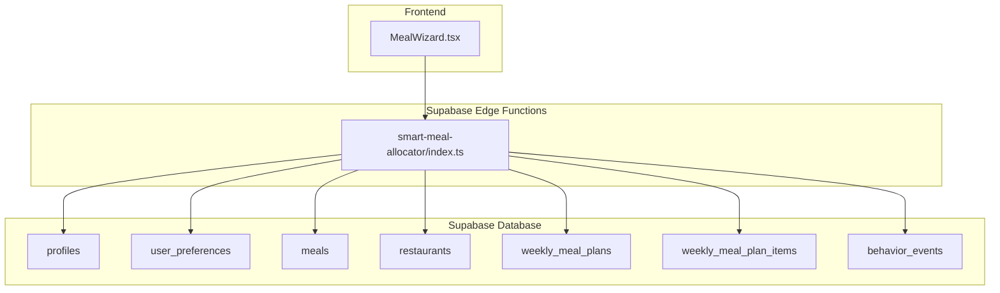
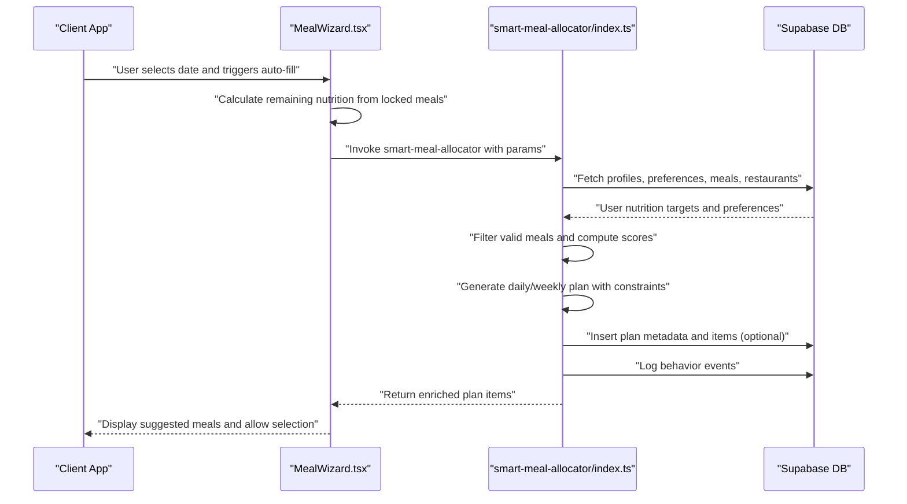
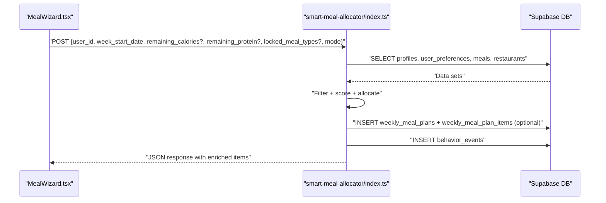
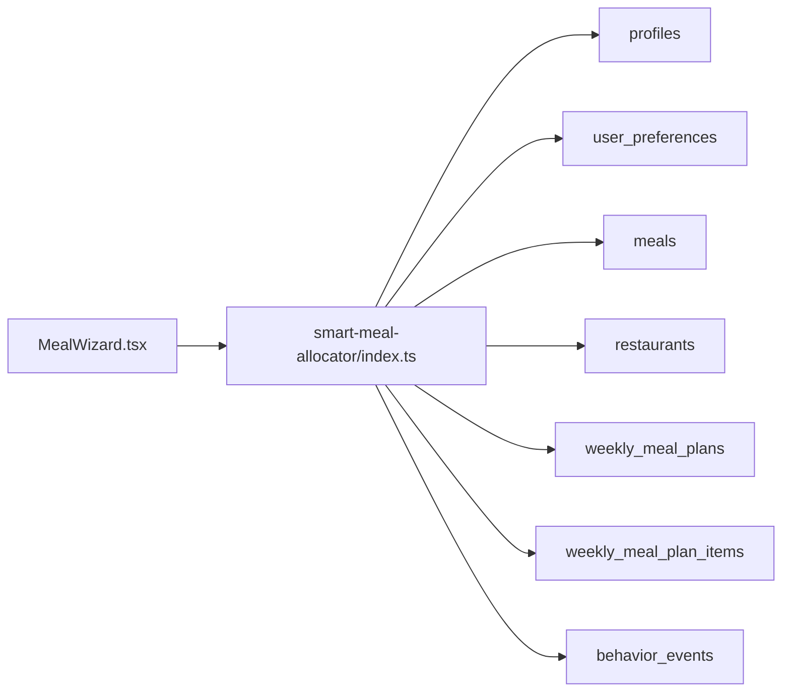

# Smart Meal Allocator

<cite>
**Referenced Files in This Document**
- [index.ts](file://supabase/functions/smart-meal-allocator/index.ts)
- [MealWizard.tsx](file://src/components/MealWizard.tsx)
- [types.ts](file://supabase/types.ts)
- [PHASE2_EDGE_FUNCTIONS.md](file://supabase/functions/PHASE2_EDGE_FUNCTIONS.md)
- [meal-plan-generator.ts](file://src/lib/meal-plan-generator.ts)
</cite>

## Table of Contents
1. [Introduction](#introduction)
2. [Project Structure](#project-structure)
3. [Core Components](#core-components)
4. [Architecture Overview](#architecture-overview)
5. [Detailed Component Analysis](#detailed-component-analysis)
6. [Dependency Analysis](#dependency-analysis)
7. [Performance Considerations](#performance-considerations)
8. [Troubleshooting Guide](#troubleshooting-guide)
9. [Conclusion](#conclusion)

## Introduction
The Smart Meal Allocator is a Supabase Edge Function that generates optimized weekly and daily meal plans tailored to user nutrition targets, preferences, and available meals. It balances macro compliance, variety, and practical constraints while integrating with restaurant inventory and user preference systems. The function supports real-time adjustments for partially scheduled days and provides performance-optimized scoring and selection logic suitable for large-scale allocations.

## Project Structure
The Smart Meal Allocator resides in the Supabase Edge Functions ecosystem and is invoked by the frontend through Supabase Functions. The frontend component orchestrates requests, handles user interactions, and merges AI-generated suggestions with user-selected meals.

**Diagram sources**
- [index.ts:480-755](file://supabase/functions/smart-meal-allocator/index.ts#L480-L755)
- [MealWizard.tsx:674-792](file://src/components/MealWizard.tsx#L674-L792)
- [types.ts:1-800](file://supabase/types.ts#L1-L800)

**Section sources**
- [index.ts:480-755](file://supabase/functions/smart-meal-allocator/index.ts#L480-L755)
- [MealWizard.tsx:674-792](file://src/components/MealWizard.tsx#L674-L792)

## Core Components
- Edge Function Entrypoint: Handles HTTP requests, validates inputs, and orchestrates plan generation.
- Plan Generators:
  - Weekly Plan Generator: Greedy allocation across seven days with macro target distribution.
  - Daily Plan Generator: Optimizes remaining nutrition for a single day with locked meal types.
- Scoring and Constraints:
  - Macro Match Scoring: Rewards calorie and protein alignment with balance emphasis.
  - Variety Scoring: Penalizes repeated restaurants/meals to improve diversity.
  - Availability Filtering: Ensures only available meals are considered.
- Persistence and Events: Saves plan metadata and logs behavior events for analytics.

**Section sources**
- [index.ts:62-419](file://supabase/functions/smart-meal-allocator/index.ts#L62-L419)
- [index.ts:421-478](file://supabase/functions/smart-meal-allocator/index.ts#L421-L478)
- [index.ts:480-755](file://supabase/functions/smart-meal-allocator/index.ts#L480-L755)

## Architecture Overview
The Smart Meal Allocator integrates with Supabase to fetch user profiles, preferences, and available meals, then computes optimized plans. Frontend components coordinate plan generation, allowing users to lock selected meals and refresh suggestions for remaining nutrition.

**Diagram sources**
- [index.ts:480-755](file://supabase/functions/smart-meal-allocator/index.ts#L480-L755)
- [MealWizard.tsx:674-792](file://src/components/MealWizard.tsx#L674-L792)

## Detailed Component Analysis

### Algorithm Overview
The allocator uses a greedy selection strategy with weighted scoring:
- Macro Match Score: Based on calorie and protein proximity to targets.
- Balance Score: Encourages macro balance around a target protein percentage.
- Variety Score: Penalizes repetition of restaurants and meals.
- Final Score: Weighted combination prioritizing macro match with variety consideration.

Allocation logic:
- Weekly Plan: Iterates over seven days and four meal slots per day, distributing daily targets proportionally by meal type.
- Daily Plan: Adjusts targets based on remaining nutrition and locked meal types, enabling real-time refresh.

Constraints:
- Availability: Only considers meals marked as available.
- Restaurant Diversity: Limits repeated selections per day/week.
- Snack Threshold: Skips optional snacks when daily calorie targets are low.

Optimization Criteria:
- Macro Compliance: Measures closeness to weekly totals.
- Variety Score: Tracks unique restaurants and meals across the plan.

**Section sources**
- [index.ts:62-81](file://supabase/functions/smart-meal-allocator/index.ts#L62-L81)
- [index.ts:99-119](file://supabase/functions/smart-meal-allocator/index.ts#L99-L119)
- [index.ts:121-160](file://supabase/functions/smart-meal-allocator/index.ts#L121-L160)
- [index.ts:162-283](file://supabase/functions/smart-meal-allocator/index.ts#L162-L283)
- [index.ts:285-419](file://supabase/functions/smart-meal-allocator/index.ts#L285-L419)

### Constraint Satisfaction Methods
- Availability Filtering: Excludes non-available meals early in selection.
- Restaurant Caps: Tracks usage per day/week to enforce diversity limits.
- Locked Meal Types: Preserves user-selected meals during daily refresh.
- Snack Cutoff: Avoids low-calorie snacks when targets are tight.

Conflict Resolution:
- When no valid meals remain for a slot, the generator skips the slot (required slots log warnings).
- Users can resolve conflicts by adjusting preferences or selecting alternative meals.

Capacity Management:
- Restaurant usage counters prevent over-allocation from single partners.
- Remaining nutrition calculation ensures subsequent selections align with user goals.

**Section sources**
- [index.ts:83-97](file://supabase/functions/smart-meal-allocator/index.ts#L83-L97)
- [index.ts:214-225](file://supabase/functions/smart-meal-allocator/index.ts#L214-L225)
- [index.ts:325-338](file://supabase/functions/smart-meal-allocator/index.ts#L325-L338)

### Integration Points
- User Preferences and Profiles: Fetched from Supabase tables to inform macro targets and preferences.
- Restaurant Inventory: Meals table supplies available options with nutritional data.
- Delivery Scheduling: The function logs behavior events for downstream analytics and scheduling decisions.
- Frontend Coordination: MealWizard invokes the function, merges locked meals, and applies suggestions.

**Section sources**
- [index.ts:518-586](file://supabase/functions/smart-meal-allocator/index.ts#L518-L586)
- [index.ts:587-755](file://supabase/functions/smart-meal-allocator/index.ts#L587-L755)
- [MealWizard.tsx:674-792](file://src/components/MealWizard.tsx#L674-L792)

### API Workflow

**Diagram sources**
- [index.ts:480-755](file://supabase/functions/smart-meal-allocator/index.ts#L480-L755)
- [MealWizard.tsx:674-792](file://src/components/MealWizard.tsx#L674-L792)

### Allocation Scenarios
- Weekly Generation: Produces seven days × four meals with proportional macro distribution.
- Daily Refresh: Computes remaining nutrition from locked meals and regenerates suggestions.
- Variation Selection: Generates multiple plans and picks the highest macro compliance score.

**Section sources**
- [index.ts:285-419](file://supabase/functions/smart-meal-allocator/index.ts#L285-L419)
- [index.ts:664-691](file://supabase/functions/smart-meal-allocator/index.ts#L664-L691)
- [index.ts:694-717](file://supabase/functions/smart-meal-allocator/index.ts#L694-L717)

### Fairness Considerations
- Macro Balance: Encourages balanced macronutrient distribution.
- Restaurant Diversity: Prevents dominance by single partners.
- User Control: Locked meals preserve user choices; daily refresh allows adjustments.

**Section sources**
- [index.ts:72-81](file://supabase/functions/smart-meal-allocator/index.ts#L72-L81)
- [index.ts:104-119](file://supabase/functions/smart-meal-allocator/index.ts#L104-L119)
- [index.ts:217-220](file://supabase/functions/smart-meal-allocator/index.ts#L217-L220)

## Dependency Analysis
The Smart Meal Allocator depends on Supabase for data retrieval and optional persistence. The frontend component coordinates requests and merges AI suggestions with user selections.

**Diagram sources**
- [index.ts:518-586](file://supabase/functions/smart-meal-allocator/index.ts#L518-L586)
- [types.ts:1-800](file://supabase/types.ts#L1-L800)
- [MealWizard.tsx:674-792](file://src/components/MealWizard.tsx#L674-L792)

**Section sources**
- [index.ts:518-586](file://supabase/functions/smart-meal-allocator/index.ts#L518-L586)
- [types.ts:1-800](file://supabase/types.ts#L1-L800)

## Performance Considerations
- Complexity:
  - Weekly Plan: O(D × M × K) where D is days, M is meal slots, K is candidate meals; scoring per meal and selection per slot.
  - Daily Plan: Similar complexity with reduced candidate set due to locking and remaining nutrition filtering.
- Optimization Strategies:
  - Early Filtering: Availability and restaurant caps reduce candidate sets.
  - Proportional Targeting: Normalized ratios minimize imbalance and reduce retries.
  - Variation Sampling: Multiple runs with shuffled meals increase diversity without excessive overhead.
  - Caching: Frontend can cache user preferences and recent plans to reduce repeated requests.
- Scalability:
  - Edge Function: Runs serverless with Supabase; ensure database indexes on availability and target columns.
  - Batch Operations: Use Supabase batch insert for plan items when persistence is enabled.

[No sources needed since this section provides general guidance]

## Troubleshooting Guide
Common Issues and Resolutions:
- Missing Inputs:
  - Ensure user_id and week_start_date are provided; the function returns validation errors otherwise.
- No Available Meals:
  - Verify meals.is_available is true and meals exist; otherwise, the function returns an error.
- Database Access:
  - Confirm SUPABASE_URL and SUPABASE_SERVICE_ROLE_KEY are configured; missing credentials cause failures.
- CORS Errors:
  - Frontend may surface CORS/network errors; the UI gracefully informs users that auto-fill is temporarily unavailable.
- Behavior Events Logging:
  - The function inserts behavior events for analytics; verify table creation and permissions if logging fails.

**Section sources**
- [index.ts:503-516](file://supabase/functions/smart-meal-allocator/index.ts#L503-L516)
- [index.ts:569-574](file://supabase/functions/smart-meal-allocator/index.ts#L569-L574)
- [index.ts:743-752](file://supabase/functions/smart-meal-allocator/index.ts#L743-L752)
- [MealWizard.tsx:727-736](file://src/components/MealWizard.tsx#L727-L736)

## Conclusion
The Smart Meal Allocator provides a robust, scalable solution for optimizing meal distribution based on user nutrition targets, preferences, and availability. Its greedy allocation with macro and variety scoring ensures balanced, diverse plans while supporting real-time adjustments. Integration with Supabase enables seamless data access and event logging, and the frontend offers intuitive controls for users to refine suggestions. With careful attention to constraints, fairness, and performance, the system scales effectively for large user bases and dynamic environments.