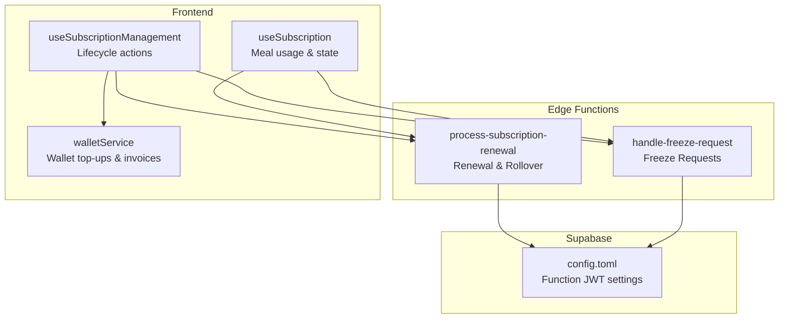
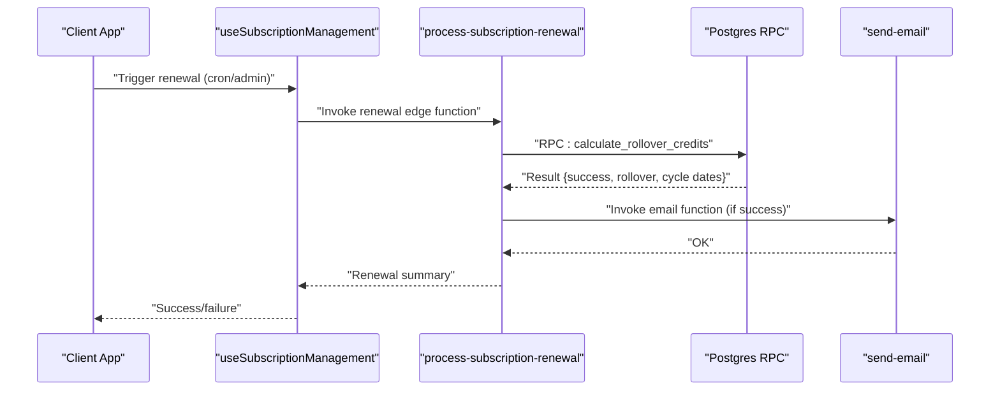
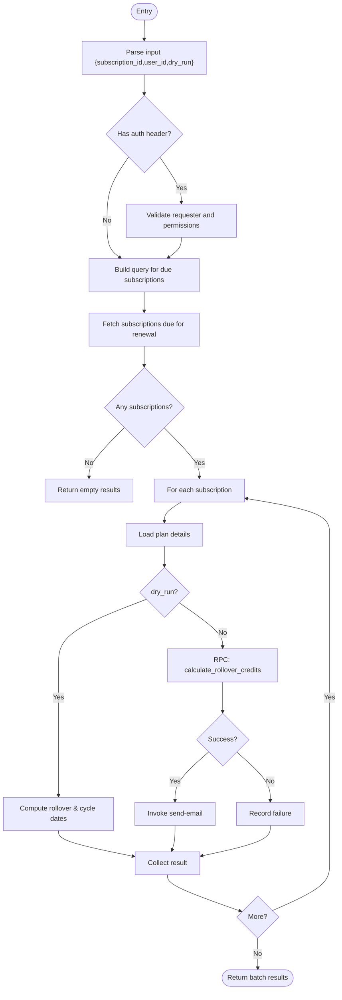
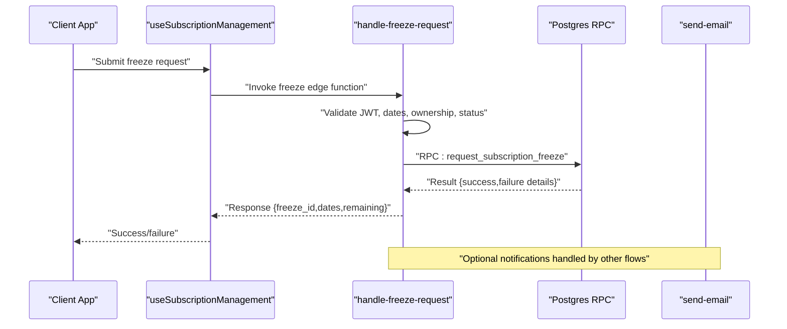
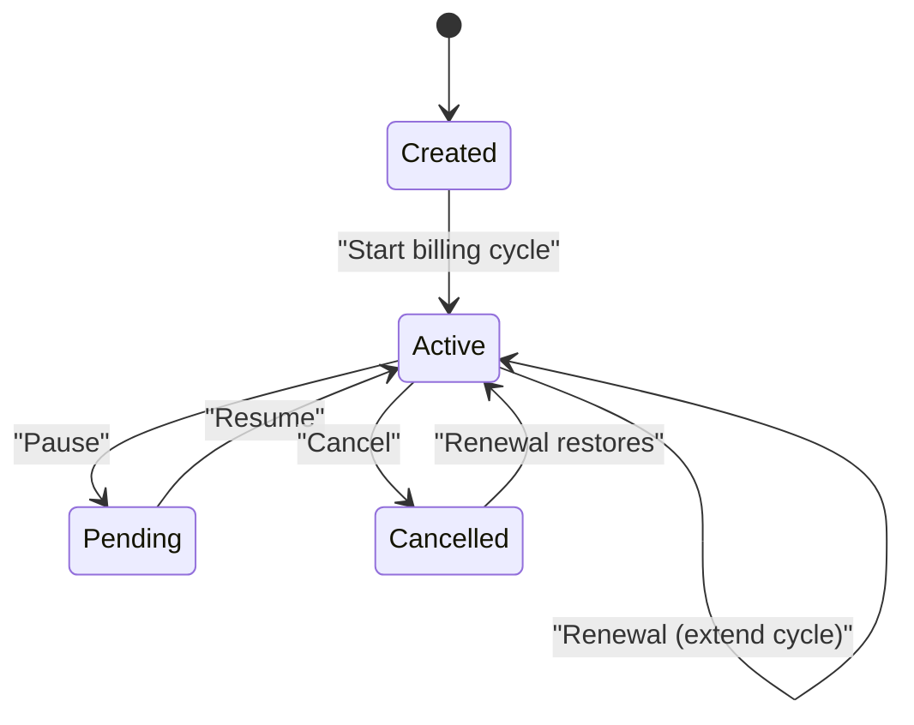
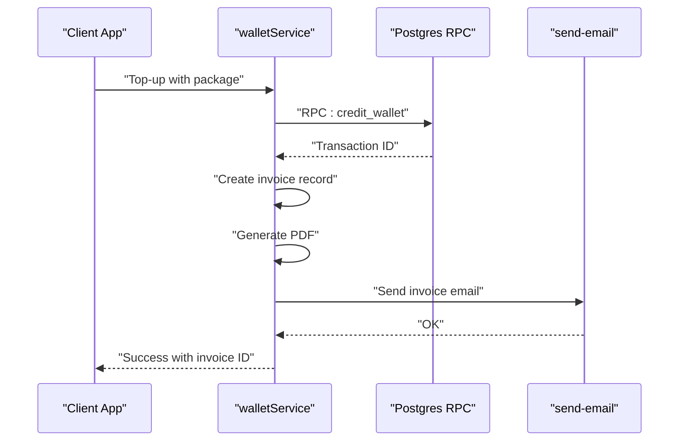
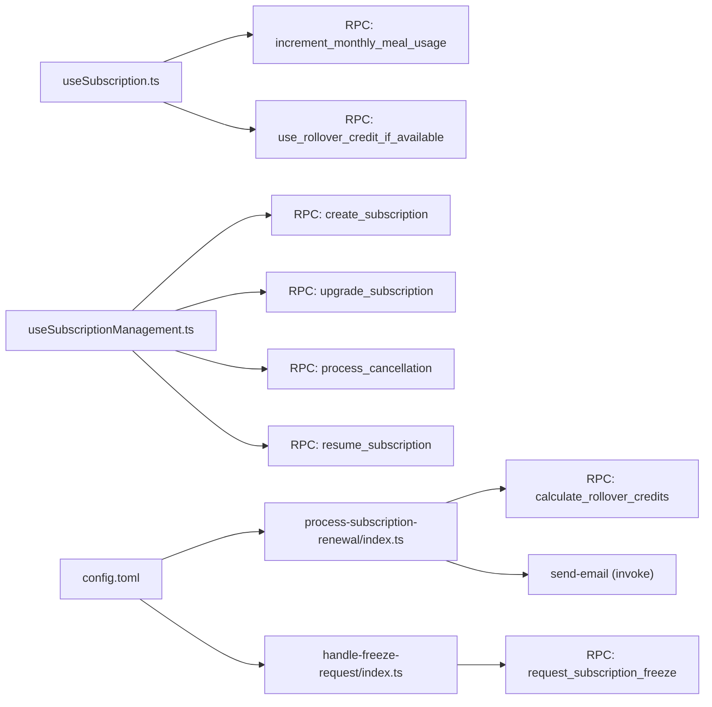

# Subscription Management Functions

<cite>
**Referenced Files in This Document**
- [process-subscription-renewal/index.ts](file://supabase/functions/process-subscription-renewal/index.ts)
- [handle-freeze-request/index.ts](file://supabase/functions/handle-freeze-request/index.ts)
- [useSubscription.ts](file://src/hooks/useSubscription.ts)
- [useSubscriptionManagement.ts](file://src/hooks/useSubscriptionManagement.ts)
- [walletService.ts](file://src/services/walletService.ts)
- [config.toml](file://supabase/config.toml)
</cite>

## Table of Contents
1. [Introduction](#introduction)
2. [Project Structure](#project-structure)
3. [Core Components](#core-components)
4. [Architecture Overview](#architecture-overview)
5. [Detailed Component Analysis](#detailed-component-analysis)
6. [Dependency Analysis](#dependency-analysis)
7. [Performance Considerations](#performance-considerations)
8. [Troubleshooting Guide](#troubleshooting-guide)
9. [Conclusion](#conclusion)

## Introduction
This document explains the Subscription Management edge functions that automate the subscription lifecycle. It covers renewal processing, freeze request handling, billing cycle management, state transitions, payment processing integration, and notification workflows. It also documents credit rollover calculations, renewal scheduling logic, subscription modification scenarios, proration considerations, grace period handling, error recovery, retry policies, and compliance with billing regulations. Integration patterns with payment processors and wallet systems are included.

## Project Structure
The Subscription Management system spans Supabase Edge Functions and the frontend React hooks/services:
- Edge Functions: process-subscription-renewal and handle-freeze-request
- Frontend Hooks: useSubscription and useSubscriptionManagement
- Wallet Integration: walletService for wallet top-ups and invoices
- Supabase Config: function-level JWT verification toggles

**Diagram sources**
- [process-subscription-renewal/index.ts:1-278](file://supabase/functions/process-subscription-renewal/index.ts#L1-L278)
- [handle-freeze-request/index.ts:1-160](file://supabase/functions/handle-freeze-request/index.ts#L1-L160)
- [useSubscription.ts:1-264](file://src/hooks/useSubscription.ts#L1-L264)
- [useSubscriptionManagement.ts:1-396](file://src/hooks/useSubscriptionManagement.ts#L1-L396)
- [walletService.ts:1-180](file://src/services/walletService.ts#L1-L180)
- [config.toml:1-59](file://supabase/config.toml#L1-L59)

**Section sources**
- [process-subscription-renewal/index.ts:1-278](file://supabase/functions/process-subscription-renewal/index.ts#L1-L278)
- [handle-freeze-request/index.ts:1-160](file://supabase/functions/handle-freeze-request/index.ts#L1-L160)
- [useSubscription.ts:1-264](file://src/hooks/useSubscription.ts#L1-L264)
- [useSubscriptionManagement.ts:1-396](file://src/hooks/useSubscriptionManagement.ts#L1-L396)
- [walletService.ts:1-180](file://src/services/walletService.ts#L1-L180)
- [config.toml:1-59](file://supabase/config.toml#L1-L59)

## Core Components
- process-subscription-renewal: Orchestrates renewal, calculates rollover credits, schedules cycles, and sends notifications.
- handle-freeze-request: Validates freeze requests, checks eligibility, and delegates to database RPC for persistence and validation.
- useSubscription: Tracks subscription state, remaining meals, and exposes actions to increment usage, pause/resume.
- useSubscriptionManagement: Manages lifecycle actions (create, upgrade, cancel, resume) via RPCs.
- walletService: Integrates wallet top-ups and invoice generation for payment processing.

**Section sources**
- [process-subscription-renewal/index.ts:1-278](file://supabase/functions/process-subscription-renewal/index.ts#L1-L278)
- [handle-freeze-request/index.ts:1-160](file://supabase/functions/handle-freeze-request/index.ts#L1-L160)
- [useSubscription.ts:1-264](file://src/hooks/useSubscription.ts#L1-L264)
- [useSubscriptionManagement.ts:1-396](file://src/hooks/useSubscriptionManagement.ts#L1-L396)
- [walletService.ts:1-180](file://src/services/walletService.ts#L1-L180)

## Architecture Overview
The system integrates frontend hooks with Supabase Edge Functions and Postgres RPCs. Renewals and freezes are executed server-side for consistency and atomicity. Notifications are triggered via Supabase Edge Functions. Wallet top-ups integrate with invoice generation and email delivery.

**Diagram sources**
- [process-subscription-renewal/index.ts:194-240](file://supabase/functions/process-subscription-renewal/index.ts#L194-L240)
- [config.toml:1-59](file://supabase/config.toml#L1-L59)

**Section sources**
- [process-subscription-renewal/index.ts:1-278](file://supabase/functions/process-subscription-renewal/index.ts#L1-L278)
- [config.toml:1-59](file://supabase/config.toml#L1-L59)

## Detailed Component Analysis

### Renewal Processing Workflow
The renewal function supports:
- Batch renewal selection by subscription/user/cron-triggered due dates
- Dry-run mode for previews
- Rollover credit calculation capped at a percentage of monthly credits
- Cycle extension based on freeze days used
- Notification dispatch on successful renewal

**Diagram sources**
- [process-subscription-renewal/index.ts:96-254](file://supabase/functions/process-subscription-renewal/index.ts#L96-L254)

**Section sources**
- [process-subscription-renewal/index.ts:1-278](file://supabase/functions/process-subscription-renewal/index.ts#L1-L278)

### Freeze Request Handling
The freeze function validates:
- Authorization and ownership
- Active subscription status
- Date range validity
It then delegates to a database RPC to enforce overlap checks, adjust freeze days, and persist the request.

**Diagram sources**
- [handle-freeze-request/index.ts:77-121](file://supabase/functions/handle-freeze-request/index.ts#L77-L121)

**Section sources**
- [handle-freeze-request/index.ts:1-160](file://supabase/functions/handle-freeze-request/index.ts#L1-L160)

### Subscription State Transitions
- Creation: via RPC from frontend hook
- Active: default state during billing cycle
- Pending/Paused: manual pause/resume actions
- Cancelled: processed via cancellation RPC with optional win-back offers
- Renewal: extends cycle, applies rollover credits, updates totals

**Diagram sources**
- [useSubscription.ts:136-141](file://src/hooks/useSubscription.ts#L136-L141)
- [useSubscriptionManagement.ts:205-241](file://src/hooks/useSubscriptionManagement.ts#L205-L241)
- [process-subscription-renewal/index.ts:194-240](file://supabase/functions/process-subscription-renewal/index.ts#L194-L240)

**Section sources**
- [useSubscription.ts:1-264](file://src/hooks/useSubscription.ts#L1-L264)
- [useSubscriptionManagement.ts:1-396](file://src/hooks/useSubscriptionManagement.ts#L1-L396)
- [process-subscription-renewal/index.ts:1-278](file://supabase/functions/process-subscription-renewal/index.ts#L1-L278)

### Payment Processing Integration and Wallet System
- Wallet top-ups are processed via RPC to credit the wallet, generating invoices and emails.
- The system separates payment orchestration (wallet top-ups) from subscription billing (edge functions).
- Invoices are generated and optionally emailed; PDFs are attached to invoice records.

**Diagram sources**
- [walletService.ts:13-137](file://src/services/walletService.ts#L13-L137)

**Section sources**
- [walletService.ts:1-180](file://src/services/walletService.ts#L1-L180)

### Notification Workflows
- Renewal success triggers an email notification via the send-email function.
- Other notification functions exist for affiliate, payout, milestone, and reminders, but renewal-specific notifications are invoked by the renewal edge function.

**Section sources**
- [process-subscription-renewal/index.ts:228-240](file://supabase/functions/process-subscription-renewal/index.ts#L228-L240)
- [config.toml:1-59](file://supabase/config.toml#L1-L59)

### Credit Rollover Calculations
- Rollover credits are computed as the minimum of unused credits and a cap (percentage of monthly credits).
- New cycle dates are derived from the previous cycle end, with optional freeze-day extensions.

**Section sources**
- [process-subscription-renewal/index.ts:166-192](file://supabase/functions/process-subscription-renewal/index.ts#L166-L192)

### Renewal Scheduling Logic
- Subscriptions due for renewal are selected based on billing_cycle_end thresholds.
- Cron-triggered runs target subscriptions nearing the end of their billing cycle.

**Section sources**
- [process-subscription-renewal/index.ts:116-121](file://supabase/functions/process-subscription-renewal/index.ts#L116-L121)

### Subscription Modification Scenarios
- Incrementing meal usage prioritizes monthly quota; if exhausted, attempts rollover credits via RPC.
- Pause/resume actions update subscription status atomically.
- Upgrades/downgrades leverage RPCs with optional billing adjustments.

**Section sources**
- [useSubscription.ts:163-203](file://src/hooks/useSubscription.ts#L163-L203)
- [useSubscriptionManagement.ts:205-241](file://src/hooks/useSubscriptionManagement.ts#L205-L241)
- [useSubscriptionManagement.ts:163-220](file://src/hooks/useSubscriptionManagement.ts#L163-L220)

### Proration and Grace Period Handling
- Proration is not explicitly implemented in the reviewed code; rollover credits act as a buffer for unused monthly credits.
- Grace periods are not present in the reviewed code; renewal logic focuses on extending cycles and applying rollover credits.

**Section sources**
- [process-subscription-renewal/index.ts:166-192](file://supabase/functions/process-subscription-renewal/index.ts#L166-L192)

### Compliance and Error Recovery
- Edge functions validate JWTs when provided and enforce ownership for targeted renewals.
- Errors are returned with structured messages; 500 responses indicate internal server errors.
- Retry policies are not explicitly defined in the code; clients should implement idempotent retries around RPC invocations.

**Section sources**
- [process-subscription-renewal/index.ts:52-94](file://supabase/functions/process-subscription-renewal/index.ts#L52-L94)
- [process-subscription-renewal/index.ts:266-276](file://supabase/functions/process-subscription-renewal/index.ts#L266-L276)
- [handle-freeze-request/index.ts:30-47](file://supabase/functions/handle-freeze-request/index.ts#L30-L47)
- [handle-freeze-request/index.ts:152-158](file://supabase/functions/handle-freeze-request/index.ts#L152-L158)

## Dependency Analysis
- Edge Functions depend on Supabase client initialization and environment variables.
- Frontend hooks rely on Supabase RPCs and real-time channels for subscription updates.
- Notification functions are referenced by edge functions but configured independently.

**Diagram sources**
- [useSubscription.ts:169-184](file://src/hooks/useSubscription.ts#L169-L184)
- [useSubscriptionManagement.ts:126-130](file://src/hooks/useSubscriptionManagement.ts#L126-L130)
- [useSubscriptionManagement.ts:183-187](file://src/hooks/useSubscriptionManagement.ts#L183-L187)
- [useSubscriptionManagement.ts:273-280](file://src/hooks/useSubscriptionManagement.ts#L273-L280)
- [useSubscriptionManagement.ts:349-351](file://src/hooks/useSubscriptionManagement.ts#L349-L351)
- [process-subscription-renewal/index.ts:195-201](file://supabase/functions/process-subscription-renewal/index.ts#L195-L201)
- [handle-freeze-request/index.ts:106-114](file://supabase/functions/handle-freeze-request/index.ts#L106-L114)
- [config.toml:1-59](file://supabase/config.toml#L1-L59)

**Section sources**
- [useSubscription.ts:1-264](file://src/hooks/useSubscription.ts#L1-L264)
- [useSubscriptionManagement.ts:1-396](file://src/hooks/useSubscriptionManagement.ts#L1-L396)
- [process-subscription-renewal/index.ts:1-278](file://supabase/functions/process-subscription-renewal/index.ts#L1-L278)
- [handle-freeze-request/index.ts:1-160](file://supabase/functions/handle-freeze-request/index.ts#L1-L160)
- [config.toml:1-59](file://supabase/config.toml#L1-L59)

## Performance Considerations
- Batch renewal queries should be indexed on status and billing_cycle_end to minimize latency.
- Edge functions should avoid unnecessary network calls; reuse Supabase client instances where possible.
- Consider pagination for large-scale renewal batches and implement backoff/retry on transient failures.

## Troubleshooting Guide
Common issues and resolutions:
- Unauthorized or forbidden responses: Verify JWT presence and ownership checks for targeted renewals.
- Subscription not found or inactive: Ensure the subscription exists and is active before attempting freeze or renewal.
- RPC errors: Inspect returned error messages and logs; validate function names and parameters.
- Notification failures: Confirm send-email function availability and configuration.

**Section sources**
- [process-subscription-renewal/index.ts:52-94](file://supabase/functions/process-subscription-renewal/index.ts#L52-L94)
- [handle-freeze-request/index.ts:77-103](file://supabase/functions/handle-freeze-request/index.ts#L77-L103)
- [process-subscription-renewal/index.ts:266-276](file://supabase/functions/process-subscription-renewal/index.ts#L266-L276)
- [handle-freeze-request/index.ts:152-158](file://supabase/functions/handle-freeze-request/index.ts#L152-L158)

## Conclusion
The Subscription Management edge functions provide robust automation for renewal, rollover, and freeze handling, integrated with frontend hooks and wallet services. While proration and grace periods are not implemented in the reviewed code, the system’s modular design allows for future enhancements. Adhering to the documented error handling and retry strategies ensures reliable operation under varying loads and edge cases.