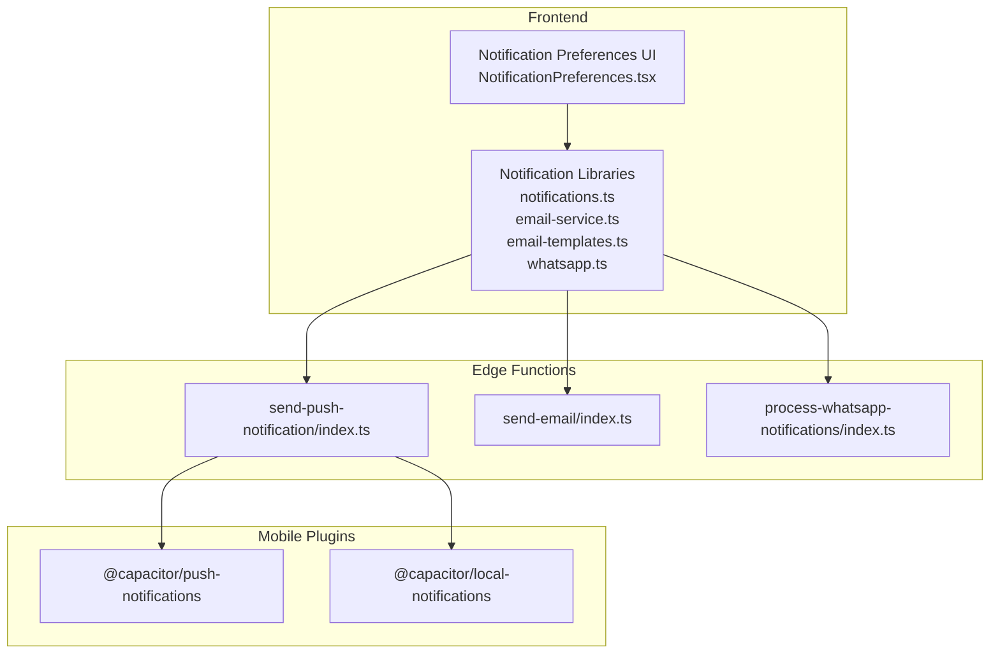
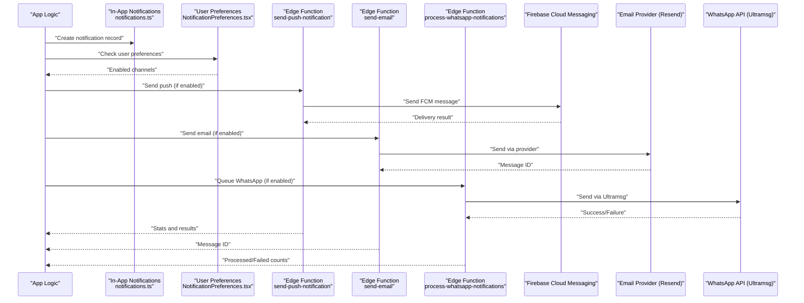
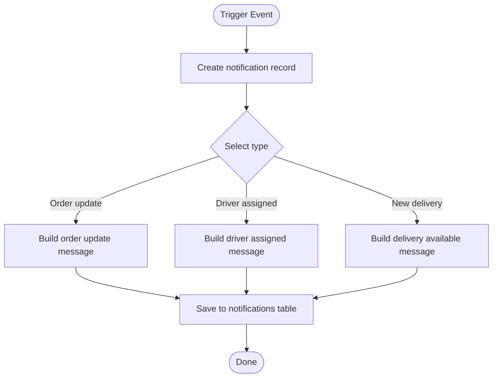
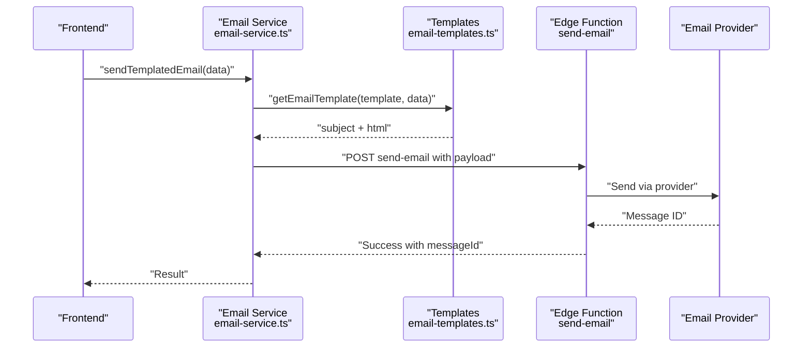
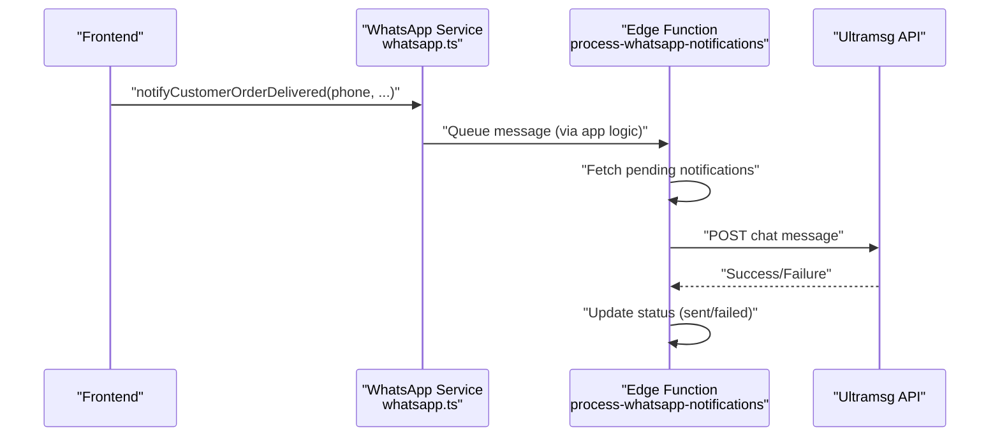
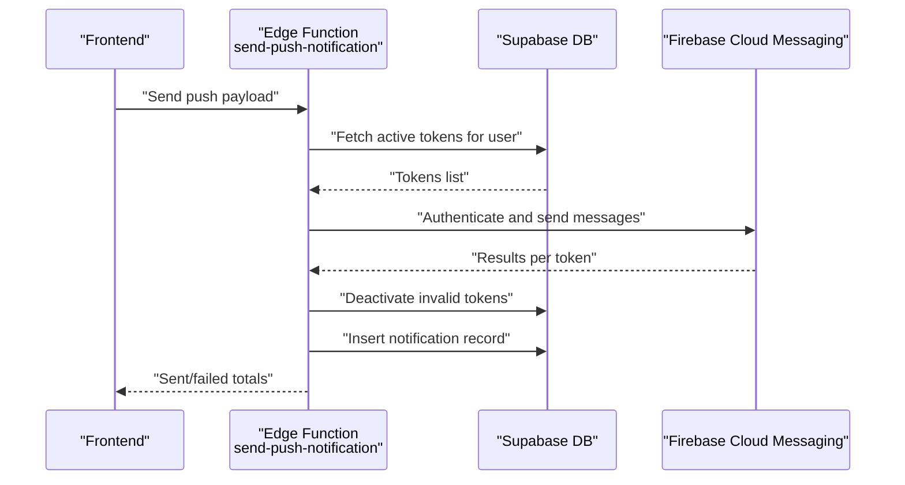
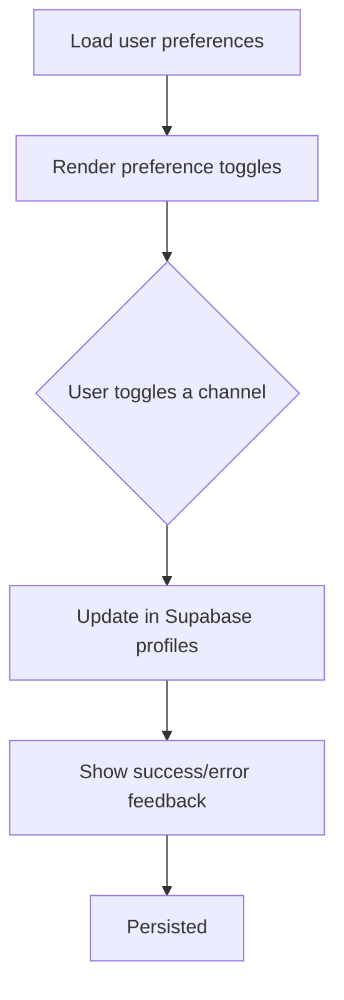
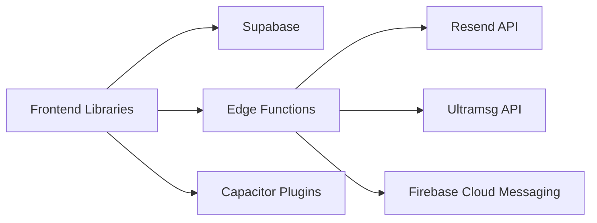

# Notification System

<cite>
**Referenced Files in This Document**
- [notifications.ts](file://src/lib/notifications.ts)
- [email-service.ts](file://src/lib/email-service.ts)
- [email-templates.ts](file://src/lib/email-templates.ts)
- [whatsapp.ts](file://src/lib/whatsapp.ts)
- [NotificationPreferences.tsx](file://src/components/NotificationPreferences.tsx)
- [send-push-notification/index.ts](file://supabase/functions/send-push-notification/index.ts)
- [process-whatsapp-notifications/index.ts](file://supabase/functions/process-whatsapp-notifications/index.ts)
- [send-email/index.ts](file://supabase/functions/send-email/index.ts)
- [Capacitor Push Notifications Plugin](file://node_modules/@capacitor/push-notifications/README.md)
- [Capacitor Local Notifications Plugin](file://node_modules/@capacitor/local-notifications/README.md)
</cite>

## Table of Contents
1. [Introduction](#introduction)
2. [Project Structure](#project-structure)
3. [Core Components](#core-components)
4. [Architecture Overview](#architecture-overview)
5. [Detailed Component Analysis](#detailed-component-analysis)
6. [Dependency Analysis](#dependency-analysis)
7. [Performance Considerations](#performance-considerations)
8. [Troubleshooting Guide](#troubleshooting-guide)
9. [Conclusion](#conclusion)

## Introduction
This document describes Nutrio's multi-channel notification system covering push notifications, email templating and sending, WhatsApp message automation, and in-app notification handling. It explains notification triggers, template management, personalization strategies, and delivery confirmation. It also documents integrations with Firebase Cloud Messaging, email service providers, and the WhatsApp Business API, along with scheduling mechanisms, fallback strategies, analytics, opt-out handling, compliance considerations, rate limiting, retry mechanisms, and monitoring delivery success rates.

## Project Structure
The notification system spans three primary areas:
- Frontend libraries for generating notifications and sending channels
- Supabase Edge Functions orchestrating backend delivery
- Capacitor plugins enabling native push and local notifications on mobile

**Diagram sources**
- [notifications.ts](file://src/lib/notifications.ts)
- [email-service.ts](file://src/lib/email-service.ts)
- [email-templates.ts](file://src/lib/email-templates.ts)
- [whatsapp.ts](file://src/lib/whatsapp.ts)
- [NotificationPreferences.tsx](file://src/components/NotificationPreferences.tsx)
- [send-push-notification/index.ts](file://supabase/functions/send-push-notification/index.ts)
- [send-email/index.ts](file://supabase/functions/send-email/index.ts)
- [process-whatsapp-notifications/index.ts](file://supabase/functions/process-whatsapp-notifications/index.ts)
- [Capacitor Push Notifications Plugin](file://node_modules/@capacitor/push-notifications/README.md)
- [Capacitor Local Notifications Plugin](file://node_modules/@capacitor/local-notifications/README.md)

**Section sources**
- [notifications.ts](file://src/lib/notifications.ts)
- [email-service.ts](file://src/lib/email-service.ts)
- [email-templates.ts](file://src/lib/email-templates.ts)
- [whatsapp.ts](file://src/lib/whatsapp.ts)
- [NotificationPreferences.tsx](file://src/components/NotificationPreferences.tsx)
- [send-push-notification/index.ts](file://supabase/functions/send-push-notification/index.ts)
- [send-email/index.ts](file://supabase/functions/send-email/index.ts)
- [process-whatsapp-notifications/index.ts](file://supabase/functions/process-whatsapp-notifications/index.ts)
- [Capacitor Push Notifications Plugin](file://node_modules/@capacitor/push-notifications/README.md)
- [Capacitor Local Notifications Plugin](file://node_modules/@capacitor/local-notifications/README.md)

## Core Components
- In-app notification creation and helpers for order/delivery events
- Email service with templating and provider integration
- WhatsApp messaging via Ultramsg API with role-specific templates
- Push notification orchestration via Supabase Edge Functions and Firebase Cloud Messaging
- User preference management for channel opt-in/out
- Mobile push and local notification plugins for native capabilities

**Section sources**
- [notifications.ts](file://src/lib/notifications.ts)
- [email-service.ts](file://src/lib/email-service.ts)
- [email-templates.ts](file://src/lib/email-templates.ts)
- [whatsapp.ts](file://src/lib/whatsapp.ts)
- [NotificationPreferences.tsx](file://src/components/NotificationPreferences.tsx)
- [send-push-notification/index.ts](file://supabase/functions/send-push-notification/index.ts)
- [send-email/index.ts](file://supabase/functions/send-email/index.ts)
- [process-whatsapp-notifications/index.ts](file://supabase/functions/process-whatsapp-notifications/index.ts)
- [Capacitor Push Notifications Plugin](file://node_modules/@capacitor/push-notifications/README.md)
- [Capacitor Local Notifications Plugin](file://node_modules/@capacitor/local-notifications/README.md)

## Architecture Overview
The system integrates frontend libraries with Supabase Edge Functions and external APIs to deliver notifications across channels. The flow varies by channel but generally follows:
- Trigger event in the application
- Create in-app notification record
- Select channels based on user preferences
- Invoke appropriate Edge Function or external API
- Update delivery status and handle failures

**Diagram sources**
- [notifications.ts](file://src/lib/notifications.ts)
- [NotificationPreferences.tsx](file://src/components/NotificationPreferences.tsx)
- [send-push-notification/index.ts](file://supabase/functions/send-push-notification/index.ts)
- [send-email/index.ts](file://supabase/functions/send-email/index.ts)
- [process-whatsapp-notifications/index.ts](file://supabase/functions/process-whatsapp-notifications/index.ts)

## Detailed Component Analysis

### In-App Notifications
- Purpose: Persist notification records for later retrieval and display within the app.
- Triggers: Order status changes, driver assignments, and delivery availability.
- Data model: Stores user_id, type, title, message, optional metadata, read/unread status.
- Helpers: Predefined functions for common scenarios (order updates, driver assignment, new delivery).

**Diagram sources**
- [notifications.ts](file://src/lib/notifications.ts)

**Section sources**
- [notifications.ts](file://src/lib/notifications.ts)

### Email Service and Templating
- Purpose: Send transactional and promotional emails using a templating system and a provider.
- Templates: Centralized HTML templates with subject generation and personalization.
- Providers: Resend integration via Supabase Edge Function.
- Personalization: Template data injection with dynamic content and links.
- Delivery confirmation: Returns message identifiers for tracking.

**Diagram sources**
- [email-service.ts](file://src/lib/email-service.ts)
- [email-templates.ts](file://src/lib/email-templates.ts)
- [send-email/index.ts](file://supabase/functions/send-email/index.ts)

**Section sources**
- [email-service.ts](file://src/lib/email-service.ts)
- [email-templates.ts](file://src/lib/email-templates.ts)
- [send-email/index.ts](file://supabase/functions/send-email/index.ts)

### WhatsApp Message Automation
- Purpose: Automate customer/partner/driver/admin notifications via Ultramsg API.
- Channels: Role-specific message builders for customers, partners, drivers, and admins.
- Queueing: Edge Function processes queued messages with status tracking.
- Validation: Phone number formatting and validation before sending.

**Diagram sources**
- [whatsapp.ts](file://src/lib/whatsapp.ts)
- [process-whatsapp-notifications/index.ts](file://supabase/functions/process-whatsapp-notifications/index.ts)

**Section sources**
- [whatsapp.ts](file://src/lib/whatsapp.ts)
- [process-whatsapp-notifications/index.ts](file://supabase/functions/process-whatsapp-notifications/index.ts)

### Push Notifications (FCM)
- Purpose: Deliver real-time push notifications to mobile devices via Firebase Cloud Messaging.
- Orchestration: Edge Function retrieves user tokens, authenticates with Firebase, sends messages, handles deactivation of invalid tokens, and persists notification records.
- Multi-platform: Supports Android and iOS APNs payload variants.
- Delivery confirmation: Aggregates sent/failed counts and updates DB.

**Diagram sources**
- [send-push-notification/index.ts](file://supabase/functions/send-push-notification/index.ts)

**Section sources**
- [send-push-notification/index.ts](file://supabase/functions/send-push-notification/index.ts)

### User Notification Preferences
- Purpose: Allow users to opt-in/out of push, email, and WhatsApp notifications for different categories.
- Storage: Persists preferences in user profiles.
- UI: Provides toggles for order updates, delivery updates, promotions, and reminders.

**Diagram sources**
- [NotificationPreferences.tsx](file://src/components/NotificationPreferences.tsx)

**Section sources**
- [NotificationPreferences.tsx](file://src/components/NotificationPreferences.tsx)

### Mobile Push and Local Notifications
- Push Notifications Plugin: Enables receiving and handling push notifications on native platforms.
- Local Notifications Plugin: Schedules and displays device-local notifications when the app is not active.

**Section sources**
- [Capacitor Push Notifications Plugin](file://node_modules/@capacitor/push-notifications/README.md)
- [Capacitor Local Notifications Plugin](file://node_modules/@capacitor/local-notifications/README.md)

## Dependency Analysis
- Frontend libraries depend on Supabase client for in-app storage and on Edge Function endpoints for channel delivery.
- Edge Functions depend on external providers (Resend, Ultramsg, Firebase) and Supabase for token and queue management.
- Mobile plugins integrate with native OS notification systems.

**Diagram sources**
- [email-service.ts](file://src/lib/email-service.ts)
- [whatsapp.ts](file://src/lib/whatsapp.ts)
- [send-push-notification/index.ts](file://supabase/functions/send-push-notification/index.ts)
- [send-email/index.ts](file://supabase/functions/send-email/index.ts)
- [process-whatsapp-notifications/index.ts](file://supabase/functions/process-whatsapp-notifications/index.ts)
- [Capacitor Push Notifications Plugin](file://node_modules/@capacitor/push-notifications/README.md)
- [Capacitor Local Notifications Plugin](file://node_modules/@capacitor/local-notifications/README.md)

**Section sources**
- [email-service.ts](file://src/lib/email-service.ts)
- [whatsapp.ts](file://src/lib/whatsapp.ts)
- [send-push-notification/index.ts](file://supabase/functions/send-push-notification/index.ts)
- [send-email/index.ts](file://supabase/functions/send-email/index.ts)
- [process-whatsapp-notifications/index.ts](file://supabase/functions/process-whatsapp-notifications/index.ts)
- [Capacitor Push Notifications Plugin](file://node_modules/@capacitor/push-notifications/README.md)
- [Capacitor Local Notifications Plugin](file://node_modules/@capacitor/local-notifications/README.md)

## Performance Considerations
- Asynchronous processing: Edge Functions process notifications asynchronously to avoid blocking the main application flow.
- Token batching: Push notifications are sent concurrently to multiple tokens with aggregated results.
- Rate limiting: External providers (Resend, Ultramsg, FCM) enforce rate limits; implement backoff and retry strategies at the application level if needed.
- Queueing: WhatsApp notifications are queued and processed in batches to manage throughput.
- Caching: Consider caching frequently used templates and avoiding repeated network calls for identical messages.

## Troubleshooting Guide
Common issues and resolutions:
- Missing credentials
  - Symptom: Email/WA/FCM functions fail with configuration errors.
  - Resolution: Ensure environment variables are set in Supabase secrets and environment.
- Invalid phone numbers
  - Symptom: WA delivery fails with validation errors.
  - Resolution: Normalize phone numbers to E.164 format before queuing.
- Unregistered tokens
  - Symptom: Push delivery failures indicating device token invalid.
  - Resolution: Edge Function automatically deactivates invalid tokens; re-register tokens when devices reconnect.
- Email validation errors
  - Symptom: Email function rejects malformed addresses.
  - Resolution: Validate email addresses on the client and handle errors gracefully.
- Template rendering errors
  - Symptom: Missing or incorrect personalization data.
  - Resolution: Ensure template data is provided and sanitized; verify template keys match expected placeholders.

**Section sources**
- [send-push-notification/index.ts](file://supabase/functions/send-push-notification/index.ts)
- [send-email/index.ts](file://supabase/functions/send-email/index.ts)
- [process-whatsapp-notifications/index.ts](file://supabase/functions/process-whatsapp-notifications/index.ts)
- [email-templates.ts](file://src/lib/email-templates.ts)

## Conclusion
Nutrio’s notification system provides a robust, multi-channel communication framework integrating in-app, email, WhatsApp, and push notifications. It leverages Supabase Edge Functions for reliable delivery orchestration, external APIs for provider-specific features, and Capacitor plugins for native mobile capabilities. The system supports user preferences, delivery confirmation, and operational resilience through token deactivation and queue processing. Extending the system involves adding new templates, channel-specific helpers, and expanding Edge Functions for additional providers while maintaining consistent data models and error handling.