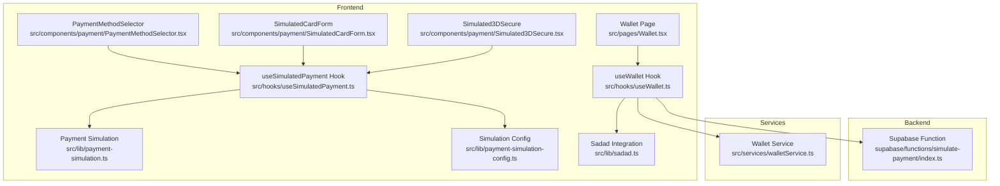
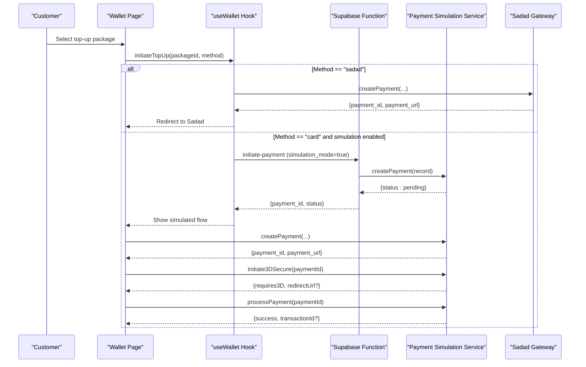
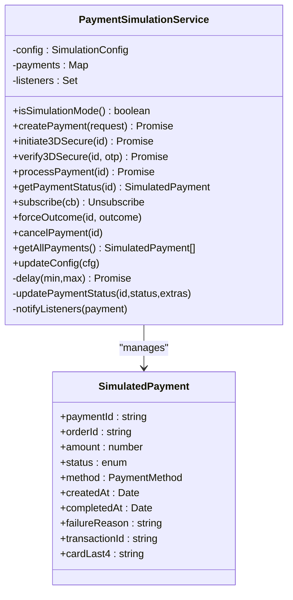
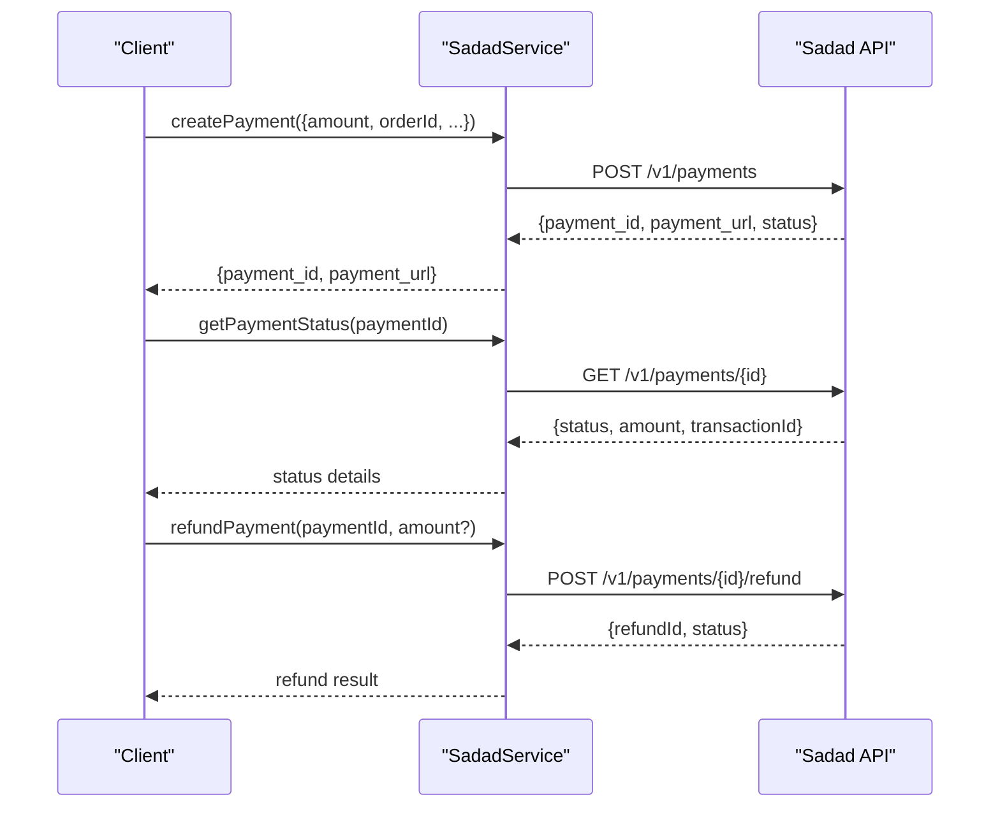
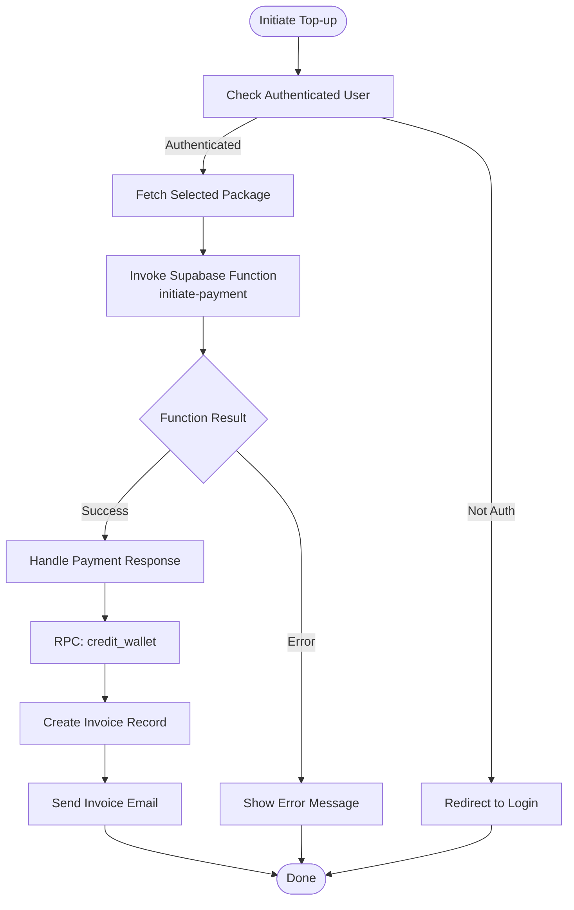
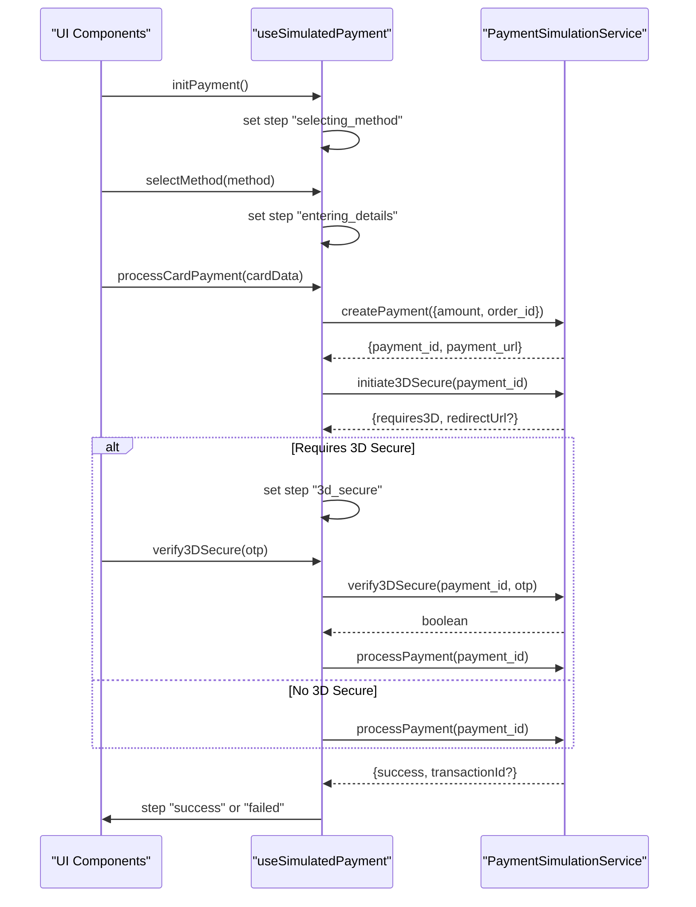
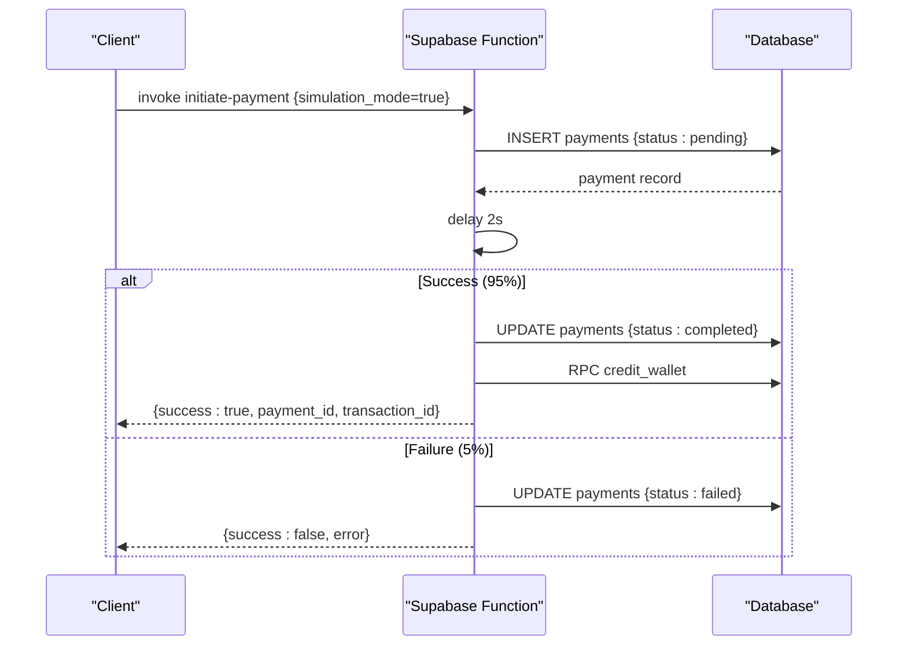
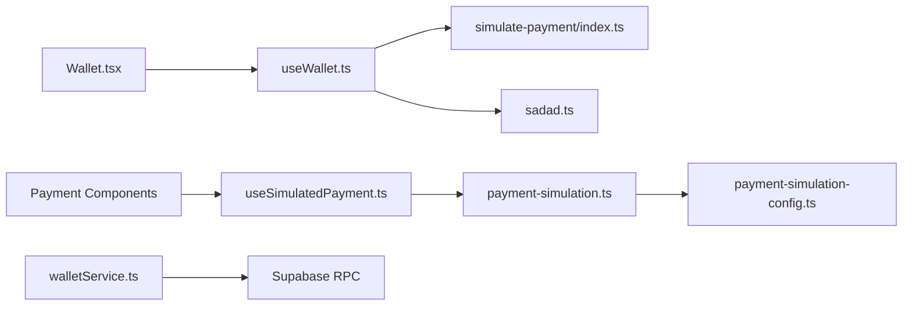

# Payment Processing

<cite>
**Referenced Files in This Document**
- [payment-simulation.ts](file://src/lib/payment-simulation.ts)
- [payment-simulation-config.ts](file://src/lib/payment-simulation-config.ts)
- [sadad.ts](file://src/lib/sadad.ts)
- [walletService.ts](file://src/services/walletService.ts)
- [useSimulatedPayment.ts](file://src/hooks/useSimulatedPayment.ts)
- [useWallet.ts](file://src/hooks/useWallet.ts)
- [PaymentMethodSelector.tsx](file://src/components/payment/PaymentMethodSelector.tsx)
- [SimulatedCardForm.tsx](file://src/components/payment/SimulatedCardForm.tsx)
- [Simulated3DSecure.tsx](file://src/components/payment/Simulated3DSecure.tsx)
- [Wallet.tsx](file://src/pages/Wallet.tsx)
- [index.ts](file://supabase/functions/simulate-payment/index.ts)
- [payment-processing-load.test.ts](file://tests/load/payment-processing-load.test.ts)
</cite>

## Table of Contents
1. [Introduction](#introduction)
2. [Project Structure](#project-structure)
3. [Core Components](#core-components)
4. [Architecture Overview](#architecture-overview)
5. [Detailed Component Analysis](#detailed-component-analysis)
6. [Dependency Analysis](#dependency-analysis)
7. [Performance Considerations](#performance-considerations)
8. [Troubleshooting Guide](#troubleshooting-guide)
9. [PCI Compliance and Security](#pci-compliance-and-security)
10. [Conclusion](#conclusion)

## Introduction
This document describes the payment processing system in Nutrio, covering:
- Payment simulation framework for development and testing
- Real payment gateway integration via Sadad (Qatari payment provider)
- Wallet management system for customer balances and top-ups
- Orchestration of payment flows, transaction lifecycle management, and payment method handling
- Examples of payment initiation, verification, failure handling, and refund processing
- PCI compliance considerations, security measures, and data protection
- Payment analytics, reconciliation, and performance monitoring

## Project Structure
The payment system spans frontend libraries, hooks, UI components, backend Supabase Edge Functions, and service utilities:
- Frontend simulation and gateway integration: src/lib, src/hooks, src/components/payment
- Wallet management: src/services, src/hooks, src/pages
- Backend simulation: supabase/functions/simulate-payment
- Load testing: tests/load

**Diagram sources**
- [Wallet.tsx:1-221](file://src/pages/Wallet.tsx#L1-L221)
- [useWallet.ts:1-276](file://src/hooks/useWallet.ts#L1-L276)
- [useSimulatedPayment.ts:1-189](file://src/hooks/useSimulatedPayment.ts#L1-L189)
- [payment-simulation.ts:1-223](file://src/lib/payment-simulation.ts#L1-L223)
- [payment-simulation-config.ts:1-79](file://src/lib/payment-simulation-config.ts#L1-L79)
- [sadad.ts:1-220](file://src/lib/sadad.ts#L1-L220)
- [PaymentMethodSelector.tsx:1-107](file://src/components/payment/PaymentMethodSelector.tsx#L1-L107)
- [SimulatedCardForm.tsx:1-144](file://src/components/payment/SimulatedCardForm.tsx#L1-L144)
- [Simulated3DSecure.tsx:1-105](file://src/components/payment/Simulated3DSecure.tsx#L1-L105)
- [index.ts:1-119](file://supabase/functions/simulate-payment/index.ts#L1-L119)
- [walletService.ts:1-180](file://src/services/walletService.ts#L1-L180)

**Section sources**
- [Wallet.tsx:1-221](file://src/pages/Wallet.tsx#L1-L221)
- [useWallet.ts:1-276](file://src/hooks/useWallet.ts#L1-L276)
- [useSimulatedPayment.ts:1-189](file://src/hooks/useSimulatedPayment.ts#L1-L189)
- [payment-simulation.ts:1-223](file://src/lib/payment-simulation.ts#L1-L223)
- [payment-simulation-config.ts:1-79](file://src/lib/payment-simulation-config.ts#L1-L79)
- [sadad.ts:1-220](file://src/lib/sadad.ts#L1-L220)
- [index.ts:1-119](file://supabase/functions/simulate-payment/index.ts#L1-L119)
- [walletService.ts:1-180](file://src/services/walletService.ts#L1-L180)

## Core Components
- Payment Simulation Service: Manages simulated payment lifecycle, 3D Secure simulation, and outcomes.
- Simulation Configuration: Controls success rates, delays, allowed methods, and 3D Secure behavior.
- Sadad Payment Service: Integrates with the Sadad gateway for real payments in Qatar.
- Wallet Management Hooks and Services: Fetch, top-up, and track wallet balances and transactions.
- UI Components: Method selection, card form, and 3D Secure dialogs for simulated flows.
- Supabase Edge Function: Backend simulation for wallet top-ups and payment records.

**Section sources**
- [payment-simulation.ts:25-223](file://src/lib/payment-simulation.ts#L25-L223)
- [payment-simulation-config.ts:4-79](file://src/lib/payment-simulation-config.ts#L4-L79)
- [sadad.ts:39-191](file://src/lib/sadad.ts#L39-L191)
- [useWallet.ts:56-276](file://src/hooks/useWallet.ts#L56-L276)
- [walletService.ts:13-180](file://src/services/walletService.ts#L13-L180)
- [index.ts:9-119](file://supabase/functions/simulate-payment/index.ts#L9-L119)

## Architecture Overview
The system supports two primary flows:
- Simulated payments for development and testing
- Real Sadad payments for production

**Diagram sources**
- [useWallet.ts:137-167](file://src/hooks/useWallet.ts#L137-L167)
- [index.ts:28-101](file://supabase/functions/simulate-payment/index.ts#L28-L101)
- [payment-simulation.ts:38-140](file://src/lib/payment-simulation.ts#L38-L140)
- [sadad.ts:54-103](file://src/lib/sadad.ts#L54-L103)

## Detailed Component Analysis

### Payment Simulation Framework
The simulation framework provides deterministic payment outcomes for testing:
- Lifecycle: pending → 3d_secure (optional) → processing → success or failed
- Configurable success rate, artificial delays, and 3D Secure probability
- Event-driven updates via subscription listeners
- Forced outcomes for test harnesses

**Diagram sources**
- [payment-simulation.ts:25-209](file://src/lib/payment-simulation.ts#L25-L209)

**Section sources**
- [payment-simulation.ts:25-223](file://src/lib/payment-simulation.ts#L25-L223)
- [payment-simulation-config.ts:4-79](file://src/lib/payment-simulation-config.ts#L4-L79)

### Sadad Payment Integration
Sadad integration handles real payment creation, verification, status polling, and refunds:
- Creates payment requests with merchant credentials and callbacks
- Verifies signatures and statuses
- Retrieves payment status and processes refunds

**Diagram sources**
- [sadad.ts:39-191](file://src/lib/sadad.ts#L39-L191)

**Section sources**
- [sadad.ts:39-191](file://src/lib/sadad.ts#L39-L191)

### Wallet Management System
The wallet system manages customer balances, top-up packages, transactions, and invoices:
- Fetch wallet, transactions, and top-up packages
- Initiate top-ups via Supabase functions or Sadad
- Credit wallet and generate invoices
- Real-time updates via Supabase Postgres changes

**Diagram sources**
- [useWallet.ts:137-167](file://src/hooks/useWallet.ts#L137-L167)
- [walletService.ts:13-137](file://src/services/walletService.ts#L13-L137)

**Section sources**
- [useWallet.ts:56-276](file://src/hooks/useWallet.ts#L56-L276)
- [walletService.ts:13-180](file://src/services/walletService.ts#L13-L180)

### Payment UI Components and Hooks
- PaymentMethodSelector: Renders selectable payment methods with icons and descriptions.
- SimulatedCardForm: Formats card inputs and submits card details for simulated processing.
- Simulated3DSecure: Handles OTP entry and simulates 3D Secure verification.
- useSimulatedPayment: Orchestrates simulated payment steps, progress tracking, and outcomes.
- useWallet: Centralizes wallet state, transactions, and top-up initiation.

**Diagram sources**
- [PaymentMethodSelector.tsx:51-106](file://src/components/payment/PaymentMethodSelector.tsx#L51-L106)
- [SimulatedCardForm.tsx:19-143](file://src/components/payment/SimulatedCardForm.tsx#L19-L143)
- [Simulated3DSecure.tsx:16-104](file://src/components/payment/Simulated3DSecure.tsx#L16-L104)
- [useSimulatedPayment.ts:22-188](file://src/hooks/useSimulatedPayment.ts#L22-L188)
- [payment-simulation.ts:38-140](file://src/lib/payment-simulation.ts#L38-L140)

**Section sources**
- [PaymentMethodSelector.tsx:1-107](file://src/components/payment/PaymentMethodSelector.tsx#L1-L107)
- [SimulatedCardForm.tsx:1-144](file://src/components/payment/SimulatedCardForm.tsx#L1-L144)
- [Simulated3DSecure.tsx:1-105](file://src/components/payment/Simulated3DSecure.tsx#L1-L105)
- [useSimulatedPayment.ts:1-189](file://src/hooks/useSimulatedPayment.ts#L1-L189)

### Backend Simulation Function
The Supabase Edge Function provides a backend simulation for wallet top-ups:
- Creates payment records
- Randomly succeeds or fails after a delay
- Credits wallet upon success
- Returns structured responses for frontend handling

**Diagram sources**
- [index.ts:9-119](file://supabase/functions/simulate-payment/index.ts#L9-L119)

**Section sources**
- [index.ts:9-119](file://supabase/functions/simulate-payment/index.ts#L9-L119)

## Dependency Analysis
- Frontend hooks depend on Supabase client and environment variables for gateway configuration.
- Simulation service is decoupled from gateway logic and configurable via environment.
- Wallet service integrates with Supabase RPC functions and external email service.
- Edge function encapsulates simulation logic and interacts with database and wallet procedures.

**Diagram sources**
- [useWallet.ts:137-167](file://src/hooks/useWallet.ts#L137-L167)
- [useSimulatedPayment.ts:1-189](file://src/hooks/useSimulatedPayment.ts#L1-L189)
- [payment-simulation.ts:1-223](file://src/lib/payment-simulation.ts#L1-L223)
- [payment-simulation-config.ts:1-79](file://src/lib/payment-simulation-config.ts#L1-L79)
- [sadad.ts:1-220](file://src/lib/sadad.ts#L1-L220)
- [walletService.ts:1-180](file://src/services/walletService.ts#L1-L180)
- [Wallet.tsx:1-221](file://src/pages/Wallet.tsx#L1-L221)
- [index.ts:1-119](file://supabase/functions/simulate-payment/index.ts#L1-L119)

**Section sources**
- [useWallet.ts:137-167](file://src/hooks/useWallet.ts#L137-L167)
- [useSimulatedPayment.ts:1-189](file://src/hooks/useSimulatedPayment.ts#L1-L189)
- [payment-simulation.ts:1-223](file://src/lib/payment-simulation.ts#L1-L223)
- [payment-simulation-config.ts:1-79](file://src/lib/payment-simulation-config.ts#L1-L79)
- [sadad.ts:1-220](file://src/lib/sadad.ts#L1-L220)
- [walletService.ts:1-180](file://src/services/walletService.ts#L1-L180)
- [Wallet.tsx:1-221](file://src/pages/Wallet.tsx#L1-L221)
- [index.ts:1-119](file://supabase/functions/simulate-payment/index.ts#L1-L119)

## Performance Considerations
- Simulation delays and success rates can be tuned for load testing scenarios.
- Use presets to simulate slow networks or flaky conditions.
- Monitor payment latency and failure rates in production via gateway logs and database metrics.
- Consider caching frequently accessed top-up packages and wallet data.

[No sources needed since this section provides general guidance]

## Troubleshooting Guide
Common issues and resolutions:
- Simulation not enabled: Ensure the environment variable enabling simulation is set appropriately.
- Sadad gateway misconfiguration: Verify merchant ID and secret key are present.
- Payment verification failures: Confirm signature verification logic and callback URLs.
- Wallet credit failures: Check RPC procedure permissions and database connectivity.
- 3D Secure simulation: OTP must be a six-digit numeric code; verify dialog input handling.

**Section sources**
- [payment-simulation.ts:34-42](file://src/lib/payment-simulation.ts#L34-L42)
- [sadad.ts:50-52](file://src/lib/sadad.ts#L50-L52)
- [useWallet.ts:137-167](file://src/hooks/useWallet.ts#L137-L167)

## PCI Compliance and Security
- Never store raw card data; rely on gateway-provided tokens or redirects.
- Use HTTPS and secure cookies for all payment endpoints.
- Validate and sanitize all inputs; enforce strict format checks for card numbers and expiry dates.
- Implement rate limiting and CAPTCHA for payment forms to prevent abuse.
- Log minimal transaction data; avoid logging sensitive fields.
- Regularly rotate API keys and secrets; restrict access to service accounts.
- Use signed callbacks and verify signatures before processing payments.

[No sources needed since this section provides general guidance]

## Conclusion
Nutrio’s payment system combines a robust simulation framework with a production-ready Sadad integration and a comprehensive wallet management system. The modular design enables flexible testing, reliable production flows, and scalable transaction lifecycle management. By adhering to the outlined security and performance practices, the system maintains compliance and resilience in real-world deployments.