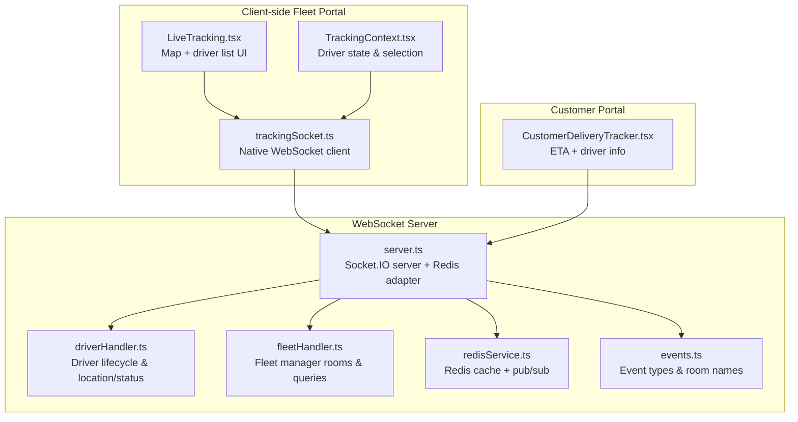
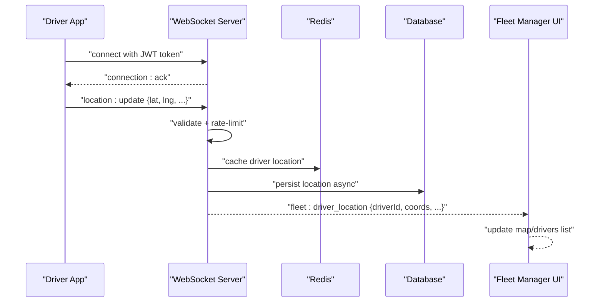
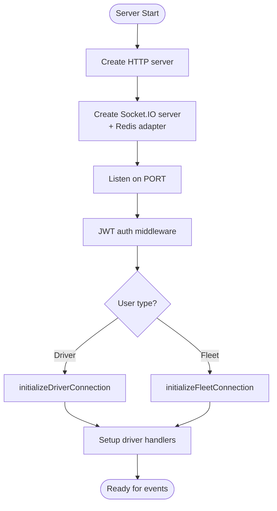
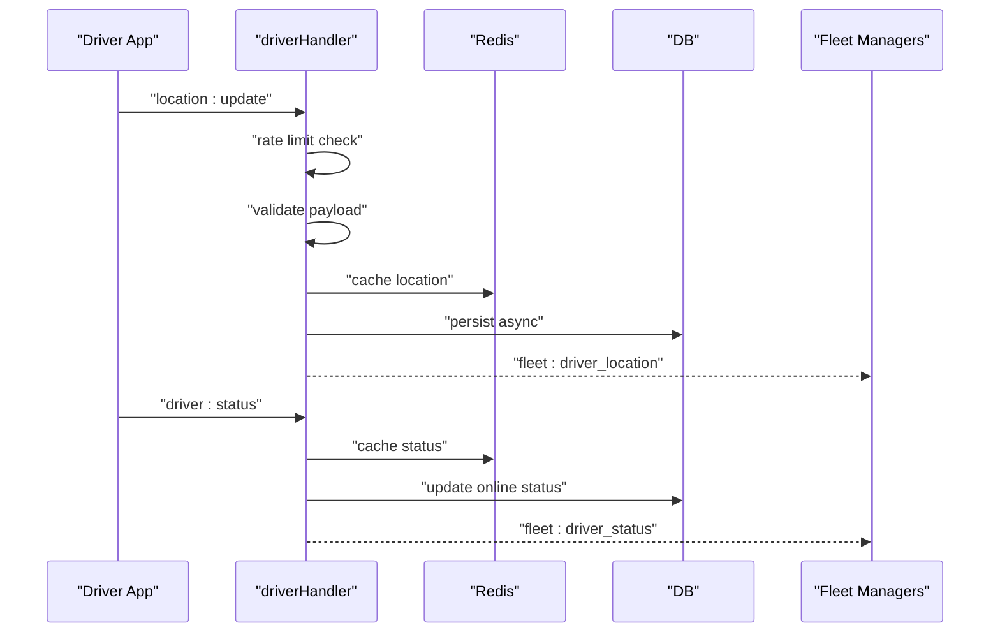
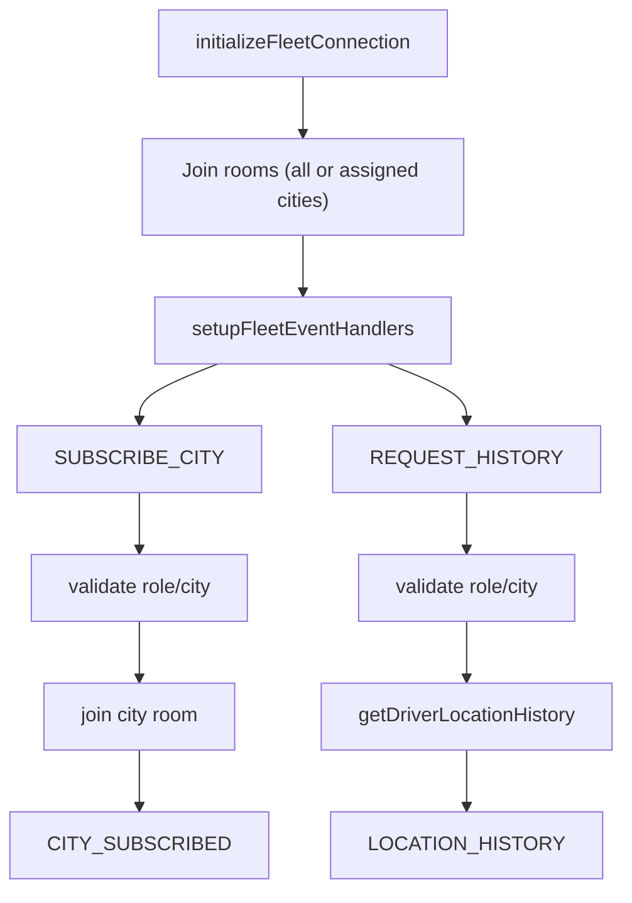
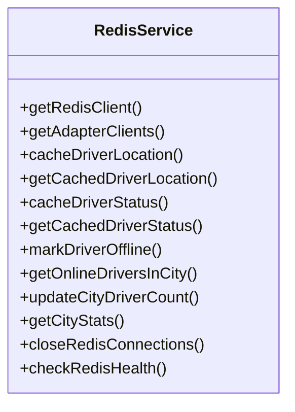
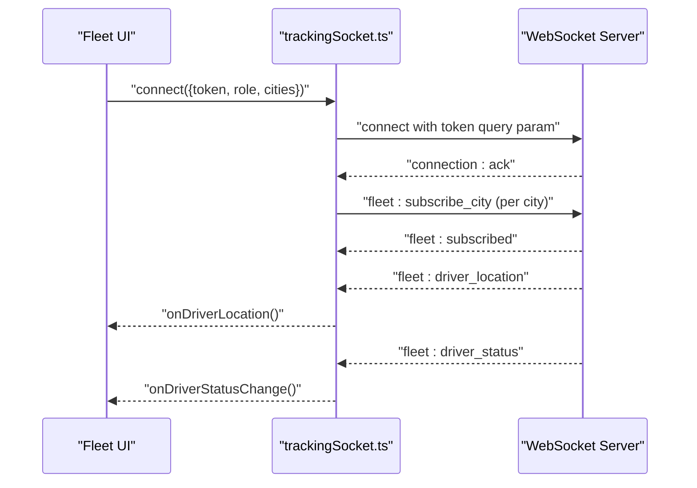
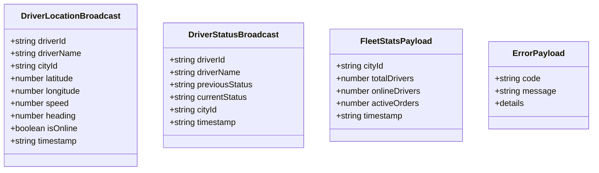
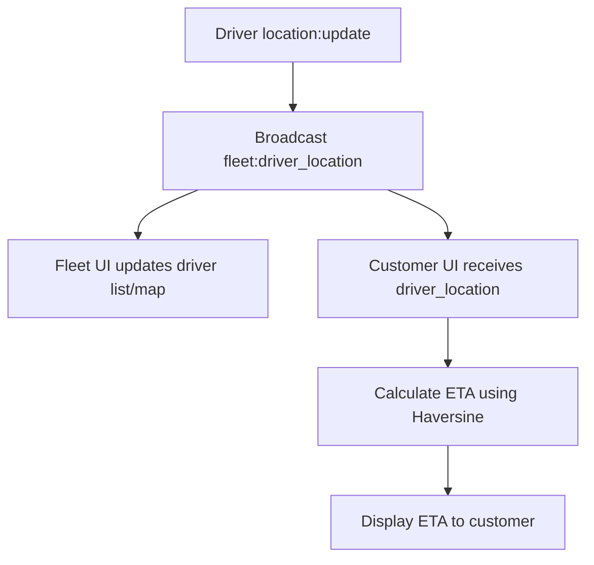
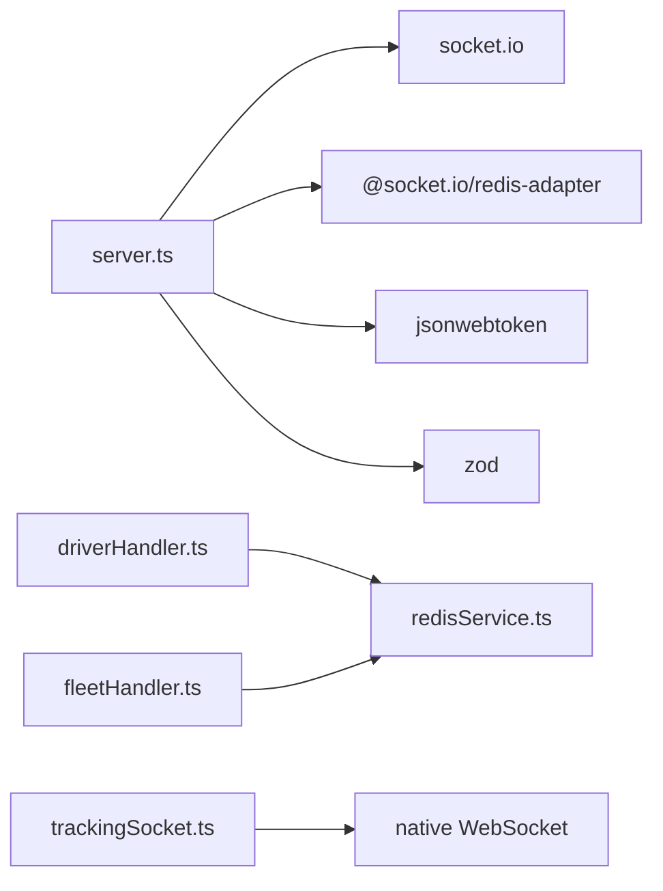

# Real-time Communication

<cite>
**Referenced Files in This Document**
- [server.ts](file://websocket-server/src/server.ts)
- [redisService.ts](file://websocket-server/src/services/redisService.ts)
- [driverHandler.ts](file://websocket-server/src/handlers/driverHandler.ts)
- [fleetHandler.ts](file://websocket-server/src/handlers/fleetHandler.ts)
- [events.ts](file://websocket-server/src/types/events.ts)
- [trackingSocket.ts](file://src/fleet/services/trackingSocket.ts)
- [LiveTracking.tsx](file://src/fleet/pages/LiveTracking.tsx)
- [TrackingContext.tsx](file://src/fleet/context/TrackingContext.tsx)
- [CustomerDeliveryTracker.tsx](file://src/components/customer/CustomerDeliveryTracker.tsx)
- [package.json](file://websocket-server/package.json)
</cite>

## Table of Contents
1. [Introduction](#introduction)
2. [Project Structure](#project-structure)
3. [Core Components](#core-components)
4. [Architecture Overview](#architecture-overview)
5. [Detailed Component Analysis](#detailed-component-analysis)
6. [Dependency Analysis](#dependency-analysis)
7. [Performance Considerations](#performance-considerations)
8. [Troubleshooting Guide](#troubleshooting-guide)
9. [Conclusion](#conclusion)
10. [Appendices](#appendices)

## Introduction
This document describes the real-time communication system in Nutrio, focusing on the WebSocket server architecture, event-driven communication patterns, and Redis-based pub/sub messaging. It explains driver tracking events, fleet management communications, and live order status updates. It also covers connection handling, message serialization, authentication for WebSocket connections, error recovery mechanisms, scaling considerations, connection pooling, performance optimization for high-concurrency scenarios, security measures, rate limiting, and monitoring real-time traffic patterns.

## Project Structure
The real-time system spans two primary areas:
- WebSocket server: a Node.js service built with Socket.IO and Redis adapter for multi-instance scaling, JWT authentication, and room-based event routing.
- Client-side fleet portal: a React-based frontend that connects to the WebSocket server and renders live driver tracking and fleet statistics.

**Diagram sources**
- [server.ts:1-256](file://websocket-server/src/server.ts#L1-L256)
- [driverHandler.ts:1-318](file://websocket-server/src/handlers/driverHandler.ts#L1-L318)
- [fleetHandler.ts:1-247](file://websocket-server/src/handlers/fleetHandler.ts#L1-L247)
- [redisService.ts:1-264](file://websocket-server/src/services/redisService.ts#L1-L264)
- [events.ts:1-210](file://websocket-server/src/types/events.ts#L1-L210)
- [trackingSocket.ts:1-287](file://src/fleet/services/trackingSocket.ts#L1-L287)
- [LiveTracking.tsx:1-250](file://src/fleet/pages/LiveTracking.tsx#L1-L250)
- [TrackingContext.tsx:1-34](file://src/fleet/context/TrackingContext.tsx#L1-L34)
- [CustomerDeliveryTracker.tsx:314-336](file://src/components/customer/CustomerDeliveryTracker.tsx#L314-L336)

**Section sources**
- [server.ts:1-256](file://websocket-server/src/server.ts#L1-L256)
- [trackingSocket.ts:1-287](file://src/fleet/services/trackingSocket.ts#L1-L287)

## Core Components
- WebSocket server: initializes Socket.IO with Redis adapter, enforces JWT authentication, manages connection counts, and exposes health/readiness endpoints.
- Driver handler: validates and rate-limits driver location/status updates, caches data in Redis, persists to database, and broadcasts to fleet managers.
- Fleet handler: manages city-based rooms, validates access, serves historical location requests, and emits stats.
- Redis service: provides Redis clients, caching for driver location/status, online driver discovery, and city stats.
- Client-side tracking socket: native WebSocket client that authenticates via token query parameter, subscribes to cities, and handles reconnection/backoff.
- UI components: render live driver tracking, driver lists, and ETA calculations.

**Section sources**
- [server.ts:37-150](file://websocket-server/src/server.ts#L37-L150)
- [driverHandler.ts:48-100](file://websocket-server/src/handlers/driverHandler.ts#L48-L100)
- [fleetHandler.ts:36-82](file://websocket-server/src/handlers/fleetHandler.ts#L36-L82)
- [redisService.ts:63-82](file://websocket-server/src/services/redisService.ts#L63-L82)
- [trackingSocket.ts:34-95](file://src/fleet/services/trackingSocket.ts#L34-L95)

## Architecture Overview
The system uses Socket.IO with a Redis adapter to scale horizontally. Clients authenticate with JWT tokens and join rooms based on roles and cities. Driver location/status updates are validated, rate-limited, cached, persisted, and broadcast to fleet managers in the same city and globally for super admins.

**Diagram sources**
- [server.ts:65-103](file://websocket-server/src/server.ts#L65-L103)
- [driverHandler.ts:105-207](file://websocket-server/src/handlers/driverHandler.ts#L105-L207)
- [redisService.ts:87-114](file://websocket-server/src/services/redisService.ts#L87-L114)
- [events.ts:157-186](file://websocket-server/src/types/events.ts#L157-L186)

## Detailed Component Analysis

### WebSocket Server
- Initialization: Creates HTTP server, Socket.IO server with CORS, ping/timeout settings, compression, and Redis adapter for clustering.
- Authentication: Validates JWT from handshake auth; populates socket metadata with user type, IDs, and assigned cities.
- Connection management: Tracks total/driver/fleet connections, enforces max connections, and logs disconnects.
- Health checks: Exposes /health and /ready endpoints for monitoring and Kubernetes readiness probes.
- Shutdown: Graceful shutdown closes HTTP/Socket.IO servers, disconnects clients, closes Redis and DB connections.

**Diagram sources**
- [server.ts:34-150](file://websocket-server/src/server.ts#L34-L150)

**Section sources**
- [server.ts:34-150](file://websocket-server/src/server.ts#L34-L150)
- [server.ts:155-224](file://websocket-server/src/server.ts#L155-L224)

### Driver Handler
- Initializes driver session: joins driver-specific room, marks driver online in Redis, updates DB, and acknowledges with recommended update interval.
- Location updates: validates payload, rate limits by driver ID, caches location, prepares broadcast, and emits to city and global fleet rooms. Asynchronously persists to DB.
- Status updates: validates payload, updates Redis status and DB, and notifies fleet managers in city and globally.
- Disconnect: marks driver offline in Redis/DB.

**Diagram sources**
- [driverHandler.ts:48-275](file://websocket-server/src/handlers/driverHandler.ts#L48-L275)
- [redisService.ts:87-146](file://websocket-server/src/services/redisService.ts#L87-L146)
- [events.ts:157-186](file://websocket-server/src/types/events.ts#L157-L186)

**Section sources**
- [driverHandler.ts:48-275](file://websocket-server/src/handlers/driverHandler.ts#L48-L275)
- [redisService.ts:87-146](file://websocket-server/src/services/redisService.ts#L87-L146)

### Fleet Handler
- Initializes fleet manager session: joins rooms based on role and assigned cities, sets up handlers, and sends initial stats.
- City subscription: validates payload, checks access, joins city room, and responds with driver count.
- Location history: validates request, checks access to driver’s city, fetches history from DB, and returns paginated points.
- Stats emission: periodically emits stats updates to subscribed cities.

**Diagram sources**
- [fleetHandler.ts:36-212](file://websocket-server/src/handlers/fleetHandler.ts#L36-L212)
- [events.ts:157-186](file://websocket-server/src/types/events.ts#L157-L186)

**Section sources**
- [fleetHandler.ts:36-212](file://websocket-server/src/handlers/fleetHandler.ts#L36-L212)

### Redis Service
- Provides shared Redis clients for Socket.IO adapter and general operations.
- Caches driver location/status with TTLs and exposes helpers to get/set online drivers and city stats.
- Supports cluster mode and password-protected single-node deployments.

**Diagram sources**
- [redisService.ts:22-263](file://websocket-server/src/services/redisService.ts#L22-L263)

**Section sources**
- [redisService.ts:22-263](file://websocket-server/src/services/redisService.ts#L22-L263)

### Client-side Tracking Socket
- Uses native WebSocket with token passed as query parameter.
- Implements exponential backoff reconnection and message queueing until connection is established.
- Handles fleet:driver_location, fleet:driver_status, fleet:stats_update, and error events.
- Subscribes to cities based on user role and supports requesting historical location data.

**Diagram sources**
- [trackingSocket.ts:34-132](file://src/fleet/services/trackingSocket.ts#L34-L132)
- [LiveTracking.tsx:225-234](file://src/fleet/pages/LiveTracking.tsx#L225-L234)

**Section sources**
- [trackingSocket.ts:34-132](file://src/fleet/services/trackingSocket.ts#L34-L132)
- [LiveTracking.tsx:225-234](file://src/fleet/pages/LiveTracking.tsx#L225-L234)

### Driver Tracking Events and Payloads
- Driver location broadcast includes driver coordinates, speed, heading, accuracy, battery level, and timestamp.
- Driver status broadcast includes driver identity, previous/current status, city, and timestamp.
- Fleet stats include city totals and online counts.
- Error payloads include machine-readable codes and optional details.

**Diagram sources**
- [events.ts:37-133](file://websocket-server/src/types/events.ts#L37-L133)

**Section sources**
- [events.ts:27-133](file://websocket-server/src/types/events.ts#L27-L133)

### Live Order Status Updates
- The driver handler emits driver_location events that include driver coordinates and optional current order ID.
- The customer portal calculates ETA using driver and customer coordinates and displays real-time updates.

**Diagram sources**
- [driverHandler.ts:160-182](file://websocket-server/src/handlers/driverHandler.ts#L160-L182)
- [CustomerDeliveryTracker.tsx:314-336](file://src/components/customer/CustomerDeliveryTracker.tsx#L314-L336)

**Section sources**
- [driverHandler.ts:160-182](file://websocket-server/src/handlers/driverHandler.ts#L160-L182)
- [CustomerDeliveryTracker.tsx:314-336](file://src/components/customer/CustomerDeliveryTracker.tsx#L314-L336)

## Dependency Analysis
- Server depends on Socket.IO, Redis adapter, JWT, and Zod for validation.
- Handlers depend on Redis service for caching and dbHelper for DB operations.
- Client-side trackingSocket depends on native WebSocket and environment configuration.

**Diagram sources**
- [package.json:21-29](file://websocket-server/package.json#L21-L29)
- [server.ts:7-16](file://websocket-server/src/server.ts#L7-L16)
- [driverHandler.ts:16-22](file://websocket-server/src/handlers/driverHandler.ts#L16-L22)
- [fleetHandler.ts:14-17](file://websocket-server/src/handlers/fleetHandler.ts#L14-L17)
- [trackingSocket.ts:6](file://src/fleet/services/trackingSocket.ts#L6)

**Section sources**
- [package.json:21-29](file://websocket-server/package.json#L21-L29)
- [server.ts:7-16](file://websocket-server/src/server.ts#L7-L16)

## Performance Considerations
- Compression: Socket.IO perMessageDeflate compresses messages larger than 1KB.
- Buffer size: maxHttpBufferSize capped at 1MB to prevent memory exhaustion.
- Ping/timeout: pingInterval and pingTimeout configured to detect stale connections.
- Rate limiting: driver location updates are rate-limited per driver ID to reduce load.
- Redis caching: location/status cached with TTLs to minimize DB reads/writes.
- Scaling: Redis adapter enables horizontal scaling across multiple server instances.
- Backpressure: asynchronous persistence avoids blocking event processing.

[No sources needed since this section provides general guidance]

## Troubleshooting Guide
- Authentication failures: verify JWT_SECRET and token validity; server emits explicit errors for missing/expired/invalid tokens.
- Capacity exceeded: server rejects new connections when WS_MAX_CONNECTIONS is reached and emits an error.
- Redis connectivity: readiness probe checks Redis health; use /ready endpoint to verify service health.
- Client reconnection: trackingSocket implements exponential backoff; inspect reconnectAttempts and delays.
- Validation errors: driver/fleet handlers return VALIDATION_ERROR with details; review payload schemas.

**Section sources**
- [server.ts:29-32](file://websocket-server/src/server.ts#L29-L32)
- [server.ts:110-117](file://websocket-server/src/server.ts#L110-L117)
- [server.ts:177-187](file://websocket-server/src/server.ts#L177-L187)
- [driverHandler.ts:125-135](file://websocket-server/src/handlers/driverHandler.ts#L125-L135)
- [fleetHandler.ts:94-103](file://websocket-server/src/handlers/fleetHandler.ts#L94-L103)
- [trackingSocket.ts:162-178](file://src/fleet/services/trackingSocket.ts#L162-L178)

## Conclusion
Nutrio’s real-time communication system combines a scalable Socket.IO server with Redis pub/sub, robust JWT authentication, and client-side reconnection logic. Driver location/status updates are validated, rate-limited, cached, and broadcast efficiently to fleet managers, enabling live tracking and fleet insights. The architecture supports high concurrency, horizontal scaling, and resilient operation with health checks and graceful shutdowns.

[No sources needed since this section summarizes without analyzing specific files]

## Appendices

### Event Types and Payloads
- Client-to-server:
  - location:update: driver location data with accuracy, speed, heading, battery level, and timestamp.
  - driver:status: online/offline flag and reason.
  - fleet:subscribe_city: city subscription request.
  - fleet:request_history: driver history retrieval request.
- Server-to-client:
  - connection:ack: connection acknowledgment with recommended update interval.
  - fleet:driver_location: driver location broadcast.
  - fleet:driver_status: driver status change broadcast.
  - fleet:stats_update: fleet statistics update.
  - fleet:subscribed: city subscription confirmation.
  - fleet:location_history: historical location points.
  - error: standardized error messages.

**Section sources**
- [events.ts:157-186](file://websocket-server/src/types/events.ts#L157-L186)
- [events.ts:27-133](file://websocket-server/src/types/events.ts#L27-L133)

### Security Measures
- JWT-based authentication on connection with role/permissions embedded in token.
- Access control in fleet handler validates role and assigned cities for subscriptions and history requests.
- Transport security: configure HTTPS and secure WebSocket (wss) in production environments.

**Section sources**
- [server.ts:65-103](file://websocket-server/src/server.ts#L65-L103)
- [fleetHandler.ts:108-116](file://websocket-server/src/handlers/fleetHandler.ts#L108-L116)

### Monitoring Real-time Traffic
- /health endpoint returns connection counts and environment metadata.
- /ready endpoint checks Redis health for readiness probes.
- Client-side logging for connection, reconnection, and error events.

**Section sources**
- [server.ts:162-192](file://websocket-server/src/server.ts#L162-L192)
- [trackingSocket.ts:58-94](file://src/fleet/services/trackingSocket.ts#L58-L94)