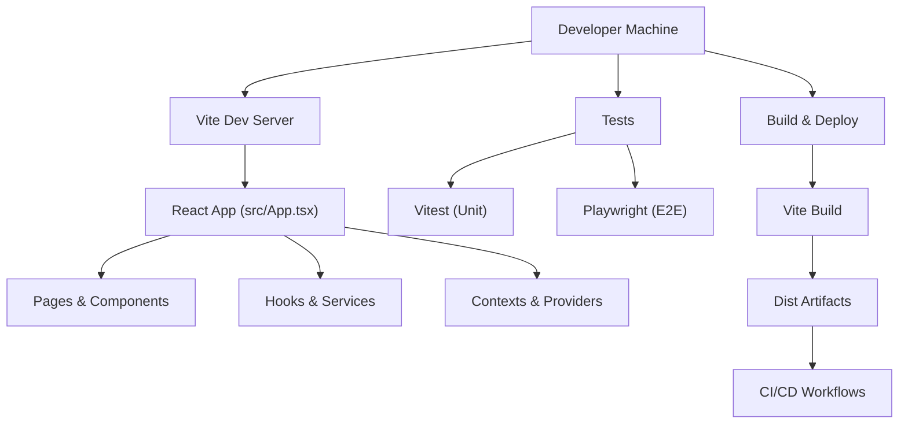
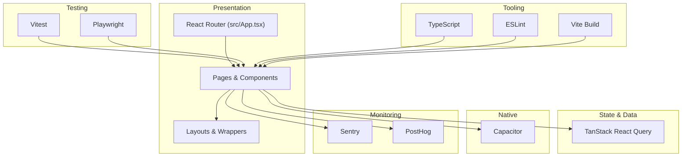
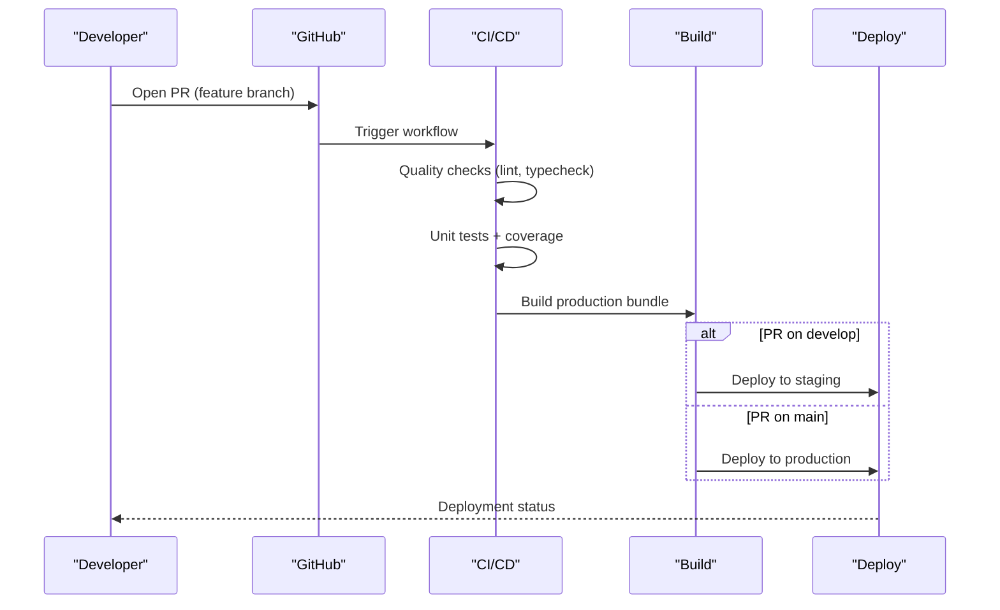
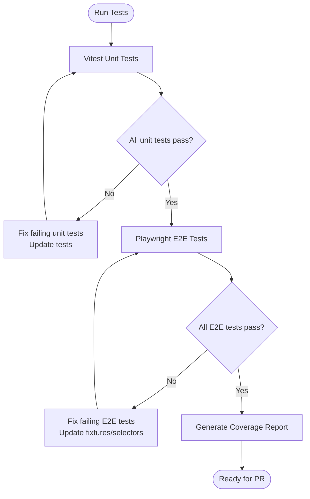
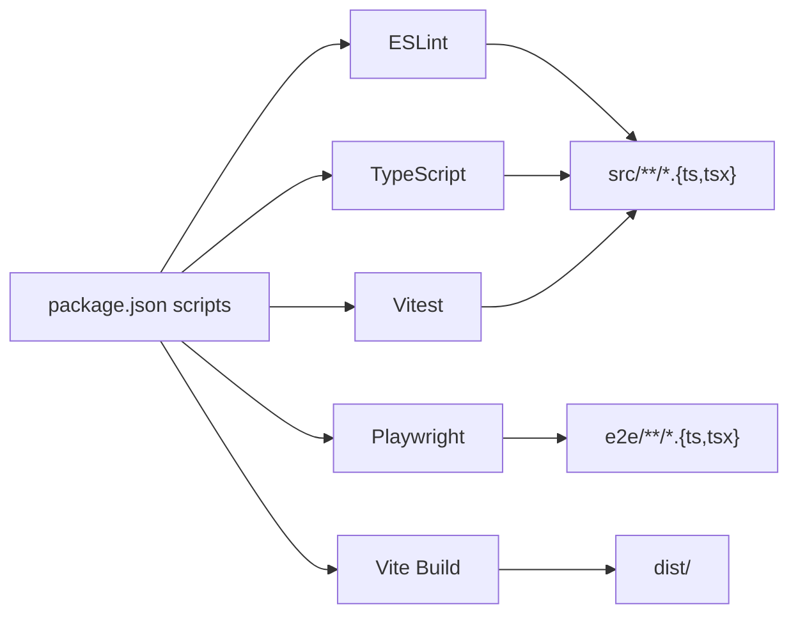

# Contributing Guidelines

<cite>
**Referenced Files in This Document**
- [README.md](file://README.md)
- [package.json](file://package.json)
- [eslint.config.js](file://eslint.config.js)
- [tsconfig.json](file://tsconfig.json)
- [vite.config.ts](file://vite.config.ts)
- [vitest.config.ts](file://vitest.config.ts)
- [playwright.config.ts](file://playwright.config.ts)
- [.github/workflows/ci-cd.yml](file://.github/workflows/ci-cd.yml)
- [src/App.tsx](file://src/App.tsx)
- [src/main.tsx](file://src/main.tsx)
- [tailwind.config.ts](file://tailwind.config.ts)
- [IMPLEMENTATION_SUMMARY.md](file://IMPLEMENTATION_SUMMARY.md)
- [docs/IMPLEMENTATION_SUMMARY.md](file://docs/IMPLEMENTATION_SUMMARY.md)
</cite>

## Table of Contents
1. [Introduction](#introduction)
2. [Project Structure](#project-structure)
3. [Core Components](#core-components)
4. [Architecture Overview](#architecture-overview)
5. [Detailed Component Analysis](#detailed-component-analysis)
6. [Dependency Analysis](#dependency-analysis)
7. [Performance Considerations](#performance-considerations)
8. [Troubleshooting Guide](#troubleshooting-guide)
9. [Conclusion](#conclusion)
10. [Appendices](#appendices)

## Introduction
Thank you for your interest in contributing to Nutrio. These guidelines define how to propose, develop, test, and deliver changes that align with the project’s engineering standards, review expectations, and deployment practices. They cover code style, React component patterns, file organization, pull request etiquette, testing and quality gates, documentation standards, and the end-to-end development workflow from planning to deployment.

## Project Structure
Nutrio is a React + TypeScript application built with Vite, integrated with Capacitor for native capabilities, and tested with Vitest and Playwright. The repository includes:
- Frontend under src/ with pages, components, hooks, services, contexts, and libraries
- Supabase-backed backend via edge functions and migrations
- E2E tests under e2e/ organized by portal and workflow
- CI/CD automation under .github/workflows/
- Documentation under docs/ and various plan/summary documents

**Diagram sources**
- [src/App.tsx:139-739](file://src/App.tsx#L139-L739)
- [vite.config.ts:1-77](file://vite.config.ts#L1-L77)
- [.github/workflows/ci-cd.yml:1-197](file://.github/workflows/ci-cd.yml#L1-L197)

**Section sources**
- [src/App.tsx:139-739](file://src/App.tsx#L139-L739)
- [package.json:7-43](file://package.json#L7-L43)
- [vite.config.ts:1-77](file://vite.config.ts#L1-L77)
- [playwright.config.ts:1-92](file://playwright.config.ts#L1-L92)

## Core Components
- Build and tooling: Vite with React SWC plugin, TypeScript strictness, Tailwind CSS, Sentry integration
- Testing: Vitest for unit tests, Playwright for E2E, with coverage reporting
- Linting: ESLint with TypeScript and React Hooks rules
- CI/CD: GitHub Actions pipeline with quality checks, unit tests, build, optional staging/production deployments, and security audit
- Routing and layouts: Centralized routing with protected routes and layout wrappers
- Native integration: Capacitor initialization and native feature toggles

Key configuration touchpoints:
- Scripts and tooling in package.json
- ESLint config in eslint.config.js
- TypeScript compiler options in tsconfig.json
- Vite build and plugins in vite.config.ts
- Vitest coverage and setup in vitest.config.ts
- Playwright test runner and reporters in playwright.config.ts
- CI/CD pipeline in .github/workflows/ci-cd.yml
- App shell and routing in src/App.tsx
- Bootstrapping and monitoring in src/main.tsx
- Tailwind theme and animations in tailwind.config.ts

**Section sources**
- [package.json:7-43](file://package.json#L7-L43)
- [eslint.config.js:1-34](file://eslint.config.js#L1-L34)
- [tsconfig.json:1-21](file://tsconfig.json#L1-L21)
- [vite.config.ts:1-77](file://vite.config.ts#L1-L77)
- [vitest.config.ts:1-28](file://vitest.config.ts#L1-L28)
- [playwright.config.ts:1-92](file://playwright.config.ts#L1-L92)
- [.github/workflows/ci-cd.yml:1-197](file://.github/workflows/ci-cd.yml#L1-L197)
- [src/App.tsx:139-739](file://src/App.tsx#L139-L739)
- [src/main.tsx:1-50](file://src/main.tsx#L1-L50)
- [tailwind.config.ts:1-128](file://tailwind.config.ts#L1-L128)

## Architecture Overview
The application follows a layered architecture:
- Presentation layer: React components and pages
- Routing and navigation: Central router with protected routes and layout wrappers
- State and data: TanStack React Query for caching and server state
- Native integration: Capacitor for device APIs and native features
- Monitoring: Sentry for error tracking and PostHog for analytics
- Testing: Unit tests with Vitest and E2E tests with Playwright

**Diagram sources**
- [src/App.tsx:139-739](file://src/App.tsx#L139-L739)
- [src/main.tsx:13-18](file://src/main.tsx#L13-L18)
- [vite.config.ts:28-40](file://vite.config.ts#L28-L40)
- [vitest.config.ts:4-21](file://vitest.config.ts#L4-L21)
- [playwright.config.ts:13-92](file://playwright.config.ts#L13-L92)

**Section sources**
- [src/App.tsx:139-739](file://src/App.tsx#L139-L739)
- [src/main.tsx:13-18](file://src/main.tsx#L13-L18)
- [vite.config.ts:28-40](file://vite.config.ts#L28-L40)

## Detailed Component Analysis

### Code Standards and Conventions

- TypeScript and ESLint
  - Strict compiler options enforce correctness and reduce runtime errors
  - ESLint enforces React Hooks rules and disables refresh warnings for exported components
  - E2E fixtures are excluded from React Hooks linting
- React component patterns
  - Centralized routing with lazy-loaded feature areas and eager loading of critical routes
  - ProtectedRoute wrapper for role-based access
  - Layout wrappers for portal-specific UI
  - Suspense-based loading fallbacks
- File organization principles
  - Feature-based grouping under src/components, src/pages, src/hooks, src/services, src/contexts, src/lib
  - Supabase-related backend under supabase/ (migrations, functions)
  - E2E tests under e2e/ grouped by portal and workflow
  - Documentation under docs/ and plan/summary files

**Section sources**
- [tsconfig.json:4-19](file://tsconfig.json#L4-L19)
- [eslint.config.js:7-33](file://eslint.config.js#L7-L33)
- [src/App.tsx:139-739](file://src/App.tsx#L139-L739)

### Pull Request Process

- Branch naming conventions
  - Use descriptive names prefixed by feature, fix, chore, or refactor followed by a short hyphenated description (e.g., feature/user-auth, fix/order-loading, chore/update-deps)
- Commit message format
  - Use imperative mood with concise subject line, optionally followed by a blank line and detailed explanation
  - Reference related issues or PRs when applicable
- Review procedures
  - Ensure all CI checks pass (lint, typecheck, unit tests, coverage, build)
  - Include screenshots or recordings for UI changes
  - Request reviews from maintainers responsible for affected areas
  - Resolve comments promptly and update tests as needed

**Section sources**
- [.github/workflows/ci-cd.yml:16-197](file://.github/workflows/ci-cd.yml#L16-L197)
- [package.json:7-43](file://package.json#L7-L43)

### Development Workflow

- Feature planning
  - Use plan/summary documents to track scope and acceptance criteria
  - Link issues to implementation plans and update progress regularly
- Local development
  - Run dev server, tests, and type checks using npm scripts
  - Use Vite’s HMR and component tagger for development
- Testing requirements
  - Unit tests with Vitest and coverage thresholds
  - E2E tests with Playwright; run specific suites for targeted workflows
- Quality assurance
  - Lint and typecheck before committing
  - Run full test suite locally prior to opening a PR
- Deployment
  - CI automatically builds and deploys to staging/production based on branch
  - Security audit runs to detect vulnerable dependencies

**Diagram sources**
- [.github/workflows/ci-cd.yml:16-197](file://.github/workflows/ci-cd.yml#L16-L197)
- [vite.config.ts:52-75](file://vite.config.ts#L52-L75)

**Section sources**
- [IMPLEMENTATION_SUMMARY.md:152-195](file://IMPLEMENTATION_SUMMARY.md#L152-L195)
- [docs/IMPLEMENTATION_SUMMARY.md:298-317](file://docs/IMPLEMENTATION_SUMMARY.md#L298-L317)
- [.github/workflows/ci-cd.yml:16-197](file://.github/workflows/ci-cd.yml#L16-L197)

### Testing Requirements and Quality Assurance

- Unit testing
  - Vitest configuration enables DOM environment, setup files, and coverage reporting
  - Coverage excludes test infrastructure and config files
- E2E testing
  - Playwright configured with HTML and JSON reporters, traces, screenshots, and videos
  - Projects for desktop browsers; mobile projects available for cross-browser testing
- Coverage and reporting
  - Coverage reports uploaded as artifacts in CI
  - Use npm scripts to run tests and generate coverage locally

**Diagram sources**
- [vitest.config.ts:4-21](file://vitest.config.ts#L4-L21)
- [playwright.config.ts:29-54](file://playwright.config.ts#L29-L54)
- [.github/workflows/ci-cd.yml:43-72](file://.github/workflows/ci-cd.yml#L43-L72)

**Section sources**
- [vitest.config.ts:4-21](file://vitest.config.ts#L4-L21)
- [playwright.config.ts:13-92](file://playwright.config.ts#L13-L92)
- [.github/workflows/ci-cd.yml:43-72](file://.github/workflows/ci-cd.yml#L43-L72)

### Code Review Criteria and Approval Workflows

- Code correctness
  - Passes lint, typecheck, unit tests, and E2E tests
  - No console logs in production builds; console logs disabled in production
- Readability and maintainability
  - Clear component boundaries, single responsibility, and consistent naming
  - Prefer composition over inheritance; leverage shared hooks and services
- Accessibility and UX
  - Semantic markup, keyboard navigation, and focus management
  - Consistent UI patterns and responsive behavior
- Security and performance
  - Avoid exposing secrets; use environment variables and CI secrets
  - Optimize bundles and lazy-load heavy features
- Documentation and tests
  - Update inline docs and plan/summary docs when changing behavior
  - Add or update tests for new features and bug fixes

**Section sources**
- [vite.config.ts:60-64](file://vite.config.ts#L60-L64)
- [.github/workflows/ci-cd.yml:33-38](file://.github/workflows/ci-cd.yml#L33-L38)

### Documentation Standards

- Keep plan/summary documents updated with current status and next steps
- Reference related issues and PRs in commit messages and PR descriptions
- Use Markdown for documentation; include diagrams where helpful
- Maintain separate docs/ and plan/ directories for different types of documentation

**Section sources**
- [IMPLEMENTATION_SUMMARY.md:152-195](file://IMPLEMENTATION_SUMMARY.md#L152-L195)
- [docs/IMPLEMENTATION_SUMMARY.md:298-317](file://docs/IMPLEMENTATION_SUMMARY.md#L298-L317)

### Practical Examples

- Submitting a contribution
  - Fork, branch, implement, test, and open a PR with a clear description
  - Ensure CI passes and address reviewer feedback promptly
- Resolving conflicts
  - Rebase onto the latest develop/main to keep history linear
  - Resolve merge conflicts locally and force-push if necessary
- Maintaining quality
  - Run npm run check:all locally before pushing
  - Keep PRs small and focused; link to relevant plan/summary documents

**Section sources**
- [package.json:18-19](file://package.json#L18-L19)
- [.github/workflows/ci-cd.yml:16-197](file://.github/workflows/ci-cd.yml#L16-L197)

## Dependency Analysis

**Diagram sources**
- [package.json:7-43](file://package.json#L7-L43)
- [eslint.config.js:10-11](file://eslint.config.js#L10-L11)
- [playwright.config.ts:14](file://playwright.config.ts#L14)

**Section sources**
- [package.json:7-43](file://package.json#L7-L43)
- [eslint.config.js:10-11](file://eslint.config.js#L10-L11)
- [playwright.config.ts:14](file://playwright.config.ts#L14)

## Performance Considerations
- Bundle optimization
  - Modern target and chunk splitting for caching and faster loads
  - Minification enabled with Terser and console removal in production
- Runtime performance
  - Lazy-load non-critical routes and pages
  - Use React Suspense with fallbacks to avoid layout shifts
  - Prefer efficient state management with React Query
- Native performance
  - Capacitor plugins are initialized early; avoid heavy synchronous work during startup

**Section sources**
- [vite.config.ts:52-75](file://vite.config.ts#L52-L75)
- [src/App.tsx:120-124](file://src/App.tsx#L120-L124)
- [src/main.tsx:13-18](file://src/main.tsx#L13-L18)

## Troubleshooting Guide
- Lint failures
  - Run npm run lint and fix reported issues; consult ESLint rules
- Type errors
  - Run npm run typecheck; ensure types match runtime behavior
- Test failures
  - Run npm run test:run and inspect failing tests; update snapshots if legitimate
  - For E2E, use npm run test:e2e:ui to inspect failures visually
- Build issues
  - Clean node_modules and reinstall; ensure environment variables are set
- CI failures
  - Review logs for lint/typecheck/test/build steps; address issues locally first

**Section sources**
- [package.json:11-19](file://package.json#L11-L19)
- [.github/workflows/ci-cd.yml:33-38](file://.github/workflows/ci-cd.yml#L33-L38)

## Conclusion
By following these guidelines, contributors can efficiently collaborate while maintaining high code quality, strong testing practices, and reliable deployments. Keep changes scoped, document intent clearly, and leverage the existing tooling to streamline development and review.

## Appendices

### Appendix A: Quick Reference

- Run checks locally
  - npm run check:all
  - npm run lint
  - npm run typecheck
  - npm run test:run
  - npm run test:coverage
- Run E2E tests
  - npm run test:e2e
  - npm run test:e2e:ui
  - npm run test:e2e:debug
- Build and preview
  - npm run build
  - npm run preview

**Section sources**
- [package.json:11-19](file://package.json#L11-L19)