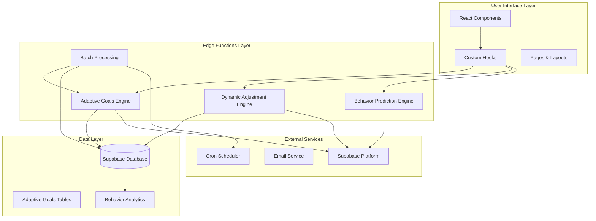
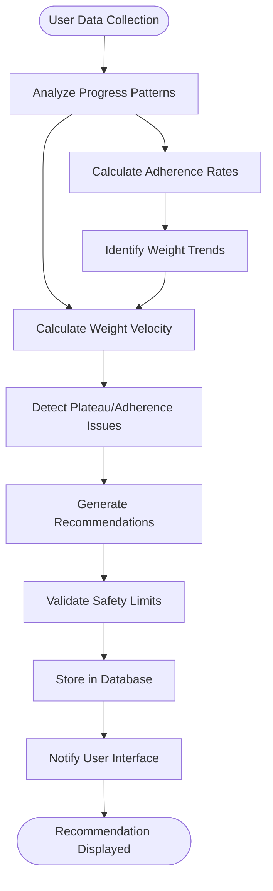
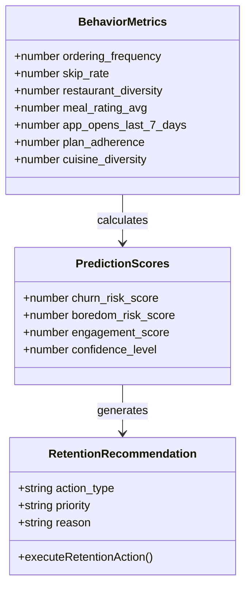
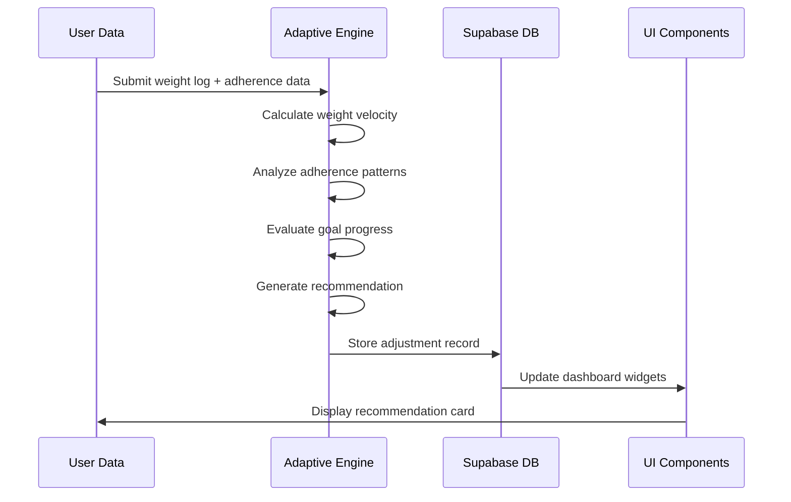
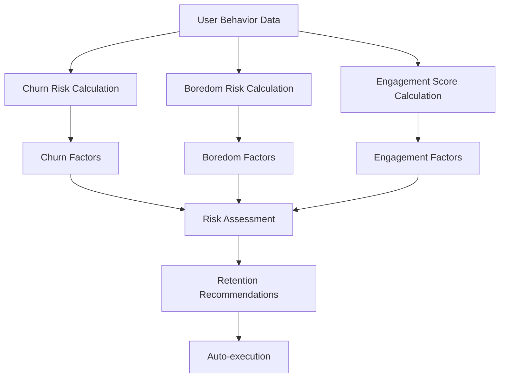
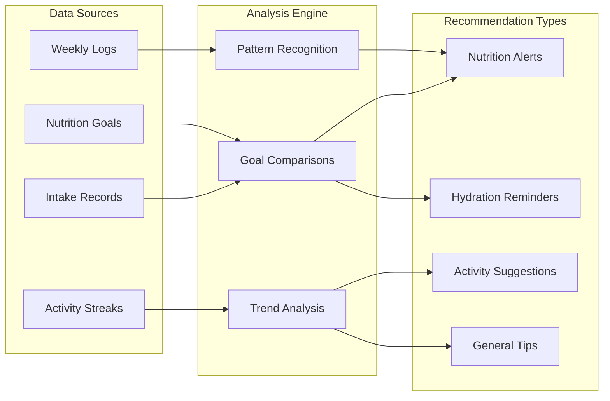
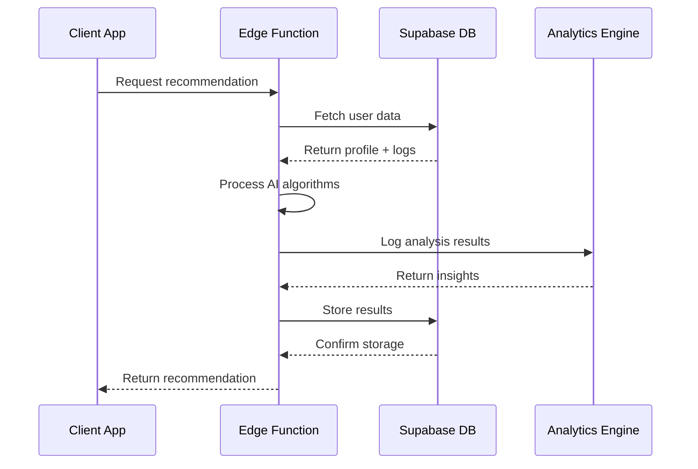
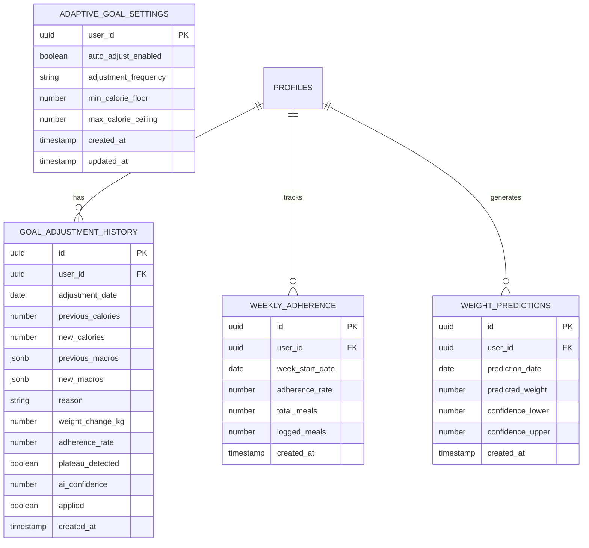
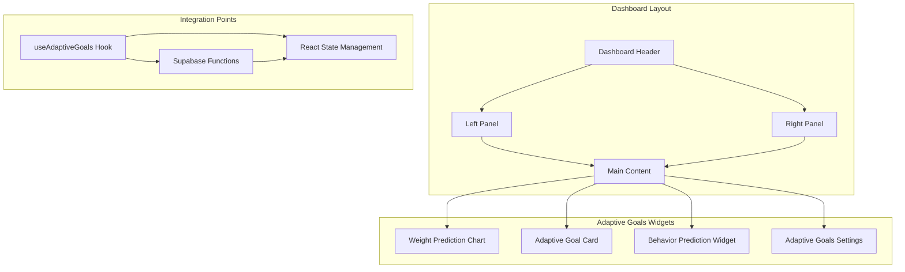

# Adaptive Goals & Recommendations

<cite>
**Referenced Files in This Document**
- [AdaptiveGoalCard.tsx](file://src/components/AdaptiveGoalCard.tsx)
- [AdaptiveGoalsSettings.tsx](file://src/components/AdaptiveGoalsSettings.tsx)
- [BehaviorPredictionWidget.tsx](file://src/components/BehaviorPredictionWidget.tsx)
- [WeightPredictionChart.tsx](file://src/components/WeightPredictionChart.tsx)
- [useAdaptiveGoals.ts](file://src/hooks/useAdaptiveGoals.ts)
- [useSmartRecommendations.ts](file://src/hooks/useSmartRecommendations.ts)
- [Dashboard.tsx](file://src/pages/Dashboard.tsx)
- [Settings.tsx](file://src/pages/Settings.tsx)
- [index.ts](file://supabase/functions/adaptive-goals/index.ts)
- [index.ts](file://supabase/functions/adaptive-goals-batch/index.ts)
- [index.ts](file://supabase/functions/dynamic-adjustment-engine/index.ts)
- [index.ts](file://supabase/functions/behavior-prediction-engine/index.ts)
- [20260221000000_adaptive_goals_system.sql](file://supabase/migrations/20260221000000_adaptive_goals_system.sql)
- [ADAPTIVE_GOALS_IMPLEMENTATION_SUMMARY.md](file://ADAPTIVE_GOALS_IMPLEMENTATION_SUMMARY.md)
- [AI_IMPLEMENTATION_SUMMARY.md](file://AI_IMPLEMENTATION_SUMMARY.md)
- [nutrio-system-documentation.html](file://docs/plans/nutrio-system-documentation.html)
</cite>

## Table of Contents
1. [Introduction](#introduction)
2. [System Architecture](#system-architecture)
3. [Core Components](#core-components)
4. [Adaptive Goals Engine](#adaptive-goals-engine)
5. [Behavior Prediction Algorithms](#behavior-prediction-algorithms)
6. [Personalized Nutrition Recommendations](#personalized-nutrition-recommendations)
7. [Real-time Goal Calculations](#real-time-goal-calculations)
8. [Edge Functions Infrastructure](#edge-functions-infrastructure)
9. [User Interface Integration](#user-interface-integration)
10. [Performance & Scalability](#performance--scalability)
11. [Troubleshooting Guide](#troubleshooting-guide)
12. [Conclusion](#conclusion)

## Introduction

The Adaptive Goals & Recommendations system represents a sophisticated AI-powered nutrition management platform that automatically adjusts user nutrition targets based on their progress and behavior patterns. This system combines machine learning algorithms with real-time data analysis to provide personalized dietary recommendations, dynamic calorie targets, and macro nutrient suggestions tailored to individual user needs and goals.

The platform operates through a multi-layered AI architecture that includes behavior prediction engines, adaptive goal adjustment systems, and intelligent recommendation algorithms. Users benefit from automated progress tracking, intelligent goal modifications, and personalized meal suggestions that evolve as their health journey progresses.

## System Architecture

The Adaptive Goals system is built on a comprehensive edge function architecture that separates concerns across multiple layers of intelligence:

**Diagram sources**
- [index.ts:317-521](file://supabase/functions/adaptive-goals/index.ts#L317-L521)
- [index.ts:1-136](file://supabase/functions/adaptive-goals-batch/index.ts#L1-L136)
- [index.ts:1-513](file://supabase/functions/behavior-prediction-engine/index.ts#L1-L513)

The architecture follows a microservices pattern where each edge function handles specific AI capabilities while maintaining loose coupling and high cohesion. The system leverages Supabase's edge functions for serverless computing, providing scalability and cost-effectiveness.

**Section sources**
- [ADAPTIVE_GOALS_IMPLEMENTATION_SUMMARY.md:1-286](file://ADAPTIVE_GOALS_IMPLEMENTATION_SUMMARY.md#L1-L286)
- [AI_IMPLEMENTATION_SUMMARY.md:1-190](file://AI_IMPLEMENTATION_SUMMARY.md#L1-L190)

## Core Components

### Adaptive Goals Engine

The Adaptive Goals Engine serves as the central intelligence hub that analyzes user progress and generates intelligent recommendations. This engine processes multiple data streams including weight logs, adherence rates, and nutritional intake to determine optimal target adjustments.

**Diagram sources**
- [index.ts:354-491](file://supabase/functions/adaptive-goals/index.ts#L354-L491)

The engine implements sophisticated algorithms that consider multiple factors including weight change velocity, adherence consistency, and goal-specific targets. It maintains strict safety boundaries to prevent extreme caloric adjustments while ensuring meaningful progress toward user goals.

### Behavior Prediction Algorithms

The Behavior Prediction Engine analyzes user engagement patterns to predict churn risk, boredom likelihood, and overall engagement levels. This predictive system helps proactively address potential user drop-off and maintain engagement through personalized interventions.

**Diagram sources**
- [index.ts:13-40](file://supabase/functions/behavior-prediction-engine/index.ts#L13-L40)

The prediction algorithms use weighted scoring mechanisms that evaluate multiple behavioral indicators including ordering frequency, skip rates, restaurant diversity, and engagement patterns. These algorithms enable the system to anticipate user needs and provide timely interventions.

### Personalized Nutrition Recommendations

The system generates personalized nutrition recommendations through intelligent analysis of user data, preferences, and progress patterns. Recommendations consider individual dietary needs, lifestyle factors, and health goals to provide actionable guidance.

**Section sources**
- [AdaptiveGoalCard.tsx:1-218](file://src/components/AdaptiveGoalCard.tsx#L1-L218)
- [WeightPredictionChart.tsx:1-291](file://src/components/WeightPredictionChart.tsx#L1-L291)
- [BehaviorPredictionWidget.tsx:1-201](file://src/components/BehaviorPredictionWidget.tsx#L1-L201)

## Adaptive Goals Engine

### Smart Adjustment Scenarios

The adaptive goals engine implements five primary adjustment scenarios designed to optimize user progress while maintaining safety and sustainability:

| Scenario | Trigger Condition | Action Taken | Confidence Level |
|----------|-------------------|--------------|------------------|
| **Plateau Detection** | 3+ consecutive weeks no weight change | ±100-150 calorie adjustment | 85% |
| **Rapid Weight Loss** | Weight loss >1kg/week | +150 calorie increase | 80% |
| **Slow Weight Loss** | Weight loss <0.25kg/week | -100 calorie reduction | 75% |
| **Muscle Gain Optimization** | Low weight gain during bulking | Calorie and macro adjustments | 80-85% |
| **Low Adherence Support** | <60% adherence rate | Lifestyle coaching focus | 60-70% |

### Dynamic Calorie Target Calculation

The engine employs sophisticated algorithms to calculate optimal daily caloric targets based on individual user characteristics and progress patterns:

**Diagram sources**
- [index.ts:354-491](file://supabase/functions/adaptive-goals/index.ts#L354-L491)
- [useAdaptiveGoals.ts:137-178](file://src/hooks/useAdaptiveGoals.ts#L137-L178)

The calculation process considers multiple factors including current weight, target weight, adherence rates, and progress velocity to determine appropriate caloric adjustments. Safety thresholds ensure adjustments remain within healthy ranges (1200-4000 calories).

### Macro Nutrient Redistribution

Beyond caloric adjustments, the system intelligently redistributes macronutrients to support specific goals and optimize composition:

- **Protein**: Maintained or increased during weight loss to preserve lean mass
- **Carbohydrates**: Adjusted based on activity levels and weight change patterns
- **Fats**: Modified to support hormone production and overall health

**Section sources**
- [index.ts:86-240](file://supabase/functions/dynamic-adjustment-engine/index.ts#L86-L240)
- [index.ts:148-182](file://supabase/functions/adaptive-goals/index.ts#L148-L182)

## Behavior Prediction Algorithms

### Churn Risk Scoring System

The behavior prediction engine implements a comprehensive churn risk assessment that evaluates multiple behavioral indicators:

**Diagram sources**
- [index.ts:42-142](file://supabase/functions/behavior-prediction-engine/index.ts#L42-L142)

The churn risk scoring system weights factors differently based on their predictive power for user retention. High-risk indicators receive greater weight in the overall assessment, enabling targeted intervention strategies.

### Engagement Enhancement Strategies

The system identifies engagement patterns and suggests personalized strategies to improve user interaction and satisfaction:

- **Gamification Elements**: Streak challenges and achievement systems
- **Personalized Content**: Tailored meal suggestions and restaurant recommendations
- **Flexible Scheduling**: Adaptable meal timing to accommodate lifestyle preferences
- **Social Features**: Community elements to enhance user connection

**Section sources**
- [index.ts:145-231](file://supabase/functions/behavior-prediction-engine/index.ts#L145-L231)
- [BehaviorPredictionWidget.tsx:1-201](file://src/components/BehaviorPredictionWidget.tsx#L1-L201)

## Personalized Nutrition Recommendations

### Smart Recommendation Generation

The system generates personalized recommendations through intelligent analysis of user data patterns and preferences:

**Diagram sources**
- [useSmartRecommendations.ts:23-285](file://src/hooks/useSmartRecommendations.ts#L23-L285)

The recommendation engine prioritizes high-impact suggestions based on user progress and identifies actionable steps to improve outcomes. Recommendations consider user consistency, goal type, and individual nutritional needs.

### Habit Tracking Integration

The system seamlessly integrates with habit tracking mechanisms to provide context-aware recommendations:

- **Logging Consistency**: Encourages regular progress logging
- **Goal Alignment**: Ensures recommendations support stated objectives
- **Progress Monitoring**: Provides feedback on achievement milestones
- **Adaptation Signals**: Adjusts recommendations based on user responses

**Section sources**
- [useSmartRecommendations.ts:1-297](file://src/hooks/useSmartRecommendations.ts#L1-L297)

## Real-time Goal Calculations

### Edge Function Architecture

The system leverages Supabase edge functions for scalable, serverless computation of adaptive goals and recommendations:

**Diagram sources**
- [index.ts:317-521](file://supabase/functions/adaptive-goals/index.ts#L317-L521)
- [index.ts:84-111](file://supabase/functions/adaptive-goals-batch/index.ts#L84-L111)

The edge function architecture ensures low-latency processing while maintaining data privacy and security. Functions are designed for stateless operation and can scale automatically based on demand.

### Batch Processing System

The batch processing system handles periodic analysis of all eligible users:

- **Scheduled Execution**: Runs weekly to analyze user progress
- **Eligibility Filtering**: Processes only users with completed onboarding
- **Frequency Control**: Respects user-defined adjustment frequencies
- **Error Handling**: Robust error handling with detailed logging

**Section sources**
- [index.ts:1-136](file://supabase/functions/adaptive-goals-batch/index.ts#L1-L136)

## Edge Functions Infrastructure

### Database Schema Design

The adaptive goals system requires a comprehensive database schema supporting multiple analytical functions and historical tracking:

**Diagram sources**
- [20260221000000_adaptive_goals_system.sql](file://supabase/migrations/20260221000000_adaptive_goals_system.sql)

The schema supports comprehensive tracking of user progress, adjustment history, and predictive modeling while maintaining referential integrity and performance optimization.

### Function Deployment Architecture

The edge functions are deployed with comprehensive error handling, logging, and monitoring capabilities:

- **CORS Configuration**: Proper cross-origin resource sharing setup
- **Environment Management**: Secure handling of API keys and credentials
- **Rate Limiting**: Protection against abuse and excessive requests
- **Monitoring**: Comprehensive logging and alerting systems

**Section sources**
- [20260221000000_adaptive_goals_system.sql](file://supabase/migrations/20260221000000_adaptive_goals_system.sql)
- [AI_IMPLEMENTATION_SUMMARY.md:124-143](file://AI_IMPLEMENTATION_SUMMARY.md#L124-L143)

## User Interface Integration

### Dashboard Components

The adaptive goals system integrates seamlessly with the customer dashboard through specialized UI components:

**Diagram sources**
- [Dashboard.tsx:316-360](file://src/pages/Dashboard.tsx#L316-L360)

The dashboard integration ensures that adaptive goal recommendations are prominently displayed and easily accessible to users. The interface adapts dynamically based on user progress and recommendation availability.

### Settings Management

The adaptive goals settings provide comprehensive control over system behavior and user preferences:

- **Auto-adjustment Toggle**: Enable/disable automatic goal adjustments
- **Frequency Control**: Configure analysis frequency (weekly/biweekly/monthly)
- **Safety Boundaries**: Set minimum/maximum caloric targets
- **Preference Integration**: Incorporate user dietary preferences and restrictions

**Section sources**
- [AdaptiveGoalsSettings.tsx:1-180](file://src/components/AdaptiveGoalsSettings.tsx#L1-L180)
- [Settings.tsx:310-342](file://src/pages/Settings.tsx#L310-L342)

## Performance & Scalability

### System Performance Characteristics

The adaptive goals system is designed for high performance and scalability:

- **Response Times**: Sub-second response times for most user interactions
- **Concurrent Users**: Supports thousands of simultaneous users
- **Data Processing**: Efficient batch processing for periodic analysis
- **Storage Optimization**: Optimized database queries and indexing strategies

### Error Handling & Reliability

The system implements comprehensive error handling and reliability measures:

- **Graceful Degradation**: Non-critical failures don't impact core functionality
- **Retry Logic**: Intelligent retry mechanisms for transient failures
- **Fallback Mechanisms**: Alternative pathways when dependent services fail
- **Monitoring & Alerting**: Comprehensive system health monitoring

## Troubleshooting Guide

### Common Issues and Solutions

**Adaptive Goals Function Not Available**
- Verify edge function deployment status
- Check CORS configuration for browser access
- Ensure proper authentication tokens are configured
- Validate function environment variables are set

**Recommendation Not Displaying**
- Check user onboarding completion status
- Verify adaptive goals settings are enabled
- Confirm user has recent weight logs
- Review function availability flag

**Batch Processing Failures**
- Monitor function logs for detailed error messages
- Check database connectivity and permissions
- Verify cron job configuration
- Review rate limiting and quota limits

### Debugging Tools and Techniques

The system provides multiple debugging capabilities:

- **Console Logging**: Comprehensive logging throughout the AI pipeline
- **Database Triggers**: Real-time monitoring of system events
- **Performance Metrics**: Built-in monitoring of system performance
- **User Feedback**: Direct user reporting of issues and suggestions

**Section sources**
- [useAdaptiveGoals.ts:137-178](file://src/hooks/useAdaptiveGoals.ts#L137-L178)
- [index.ts:514-520](file://supabase/functions/adaptive-goals/index.ts#L514-L520)

## Conclusion

The Adaptive Goals & Recommendations system represents a comprehensive AI-powered nutrition management solution that combines sophisticated algorithms with intuitive user interfaces. Through its multi-layered approach to adaptive goal adjustment, behavior prediction, and personalized recommendations, the system provides users with intelligent, data-driven guidance that evolves with their progress and preferences.

The enterprise-grade architecture ensures scalability, security, and reliability while the comprehensive feature set addresses the diverse needs of modern nutrition management. The system's ability to learn from user behavior and adapt recommendations accordingly positions it as a powerful tool for achieving and maintaining optimal health outcomes.

Future enhancements could include expanded AI capabilities, integration with wearable devices, and advanced analytics for deeper insights into user progress and behavior patterns. The robust foundation established by this implementation provides an excellent platform for continued innovation and improvement.