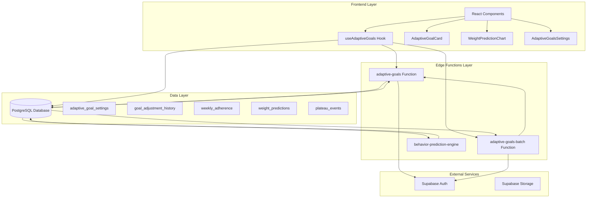
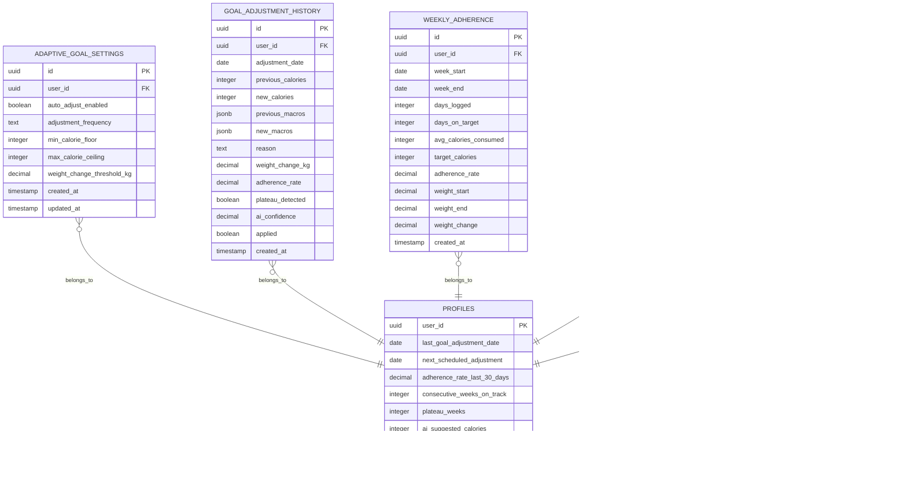
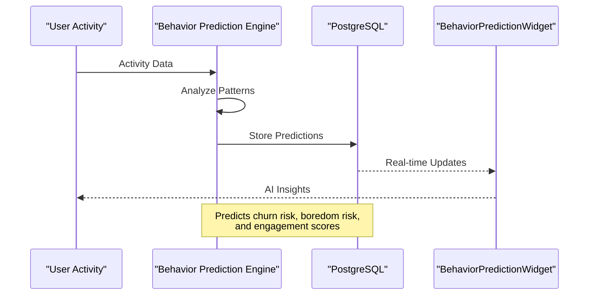
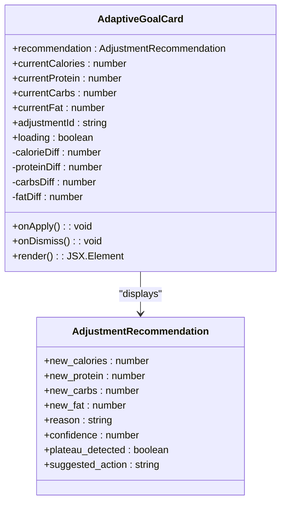
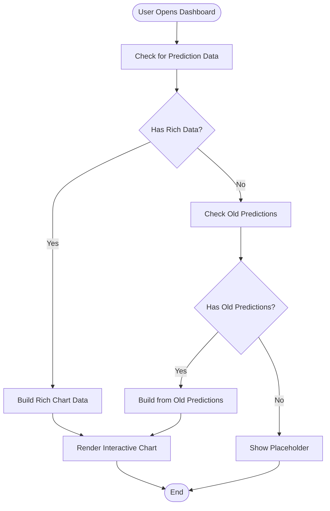
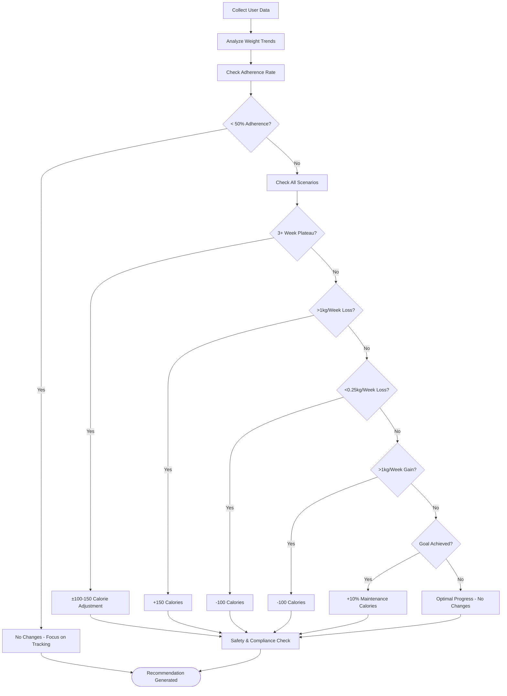
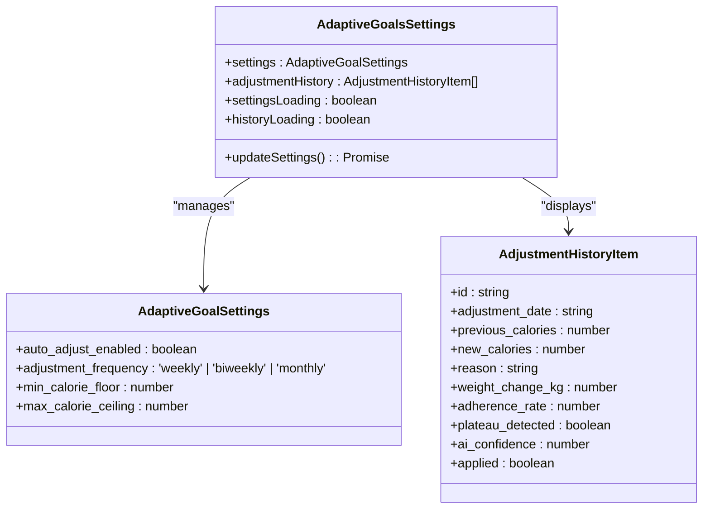
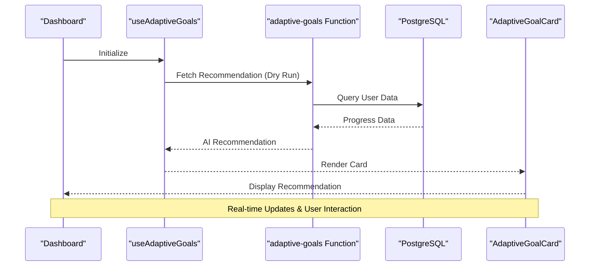
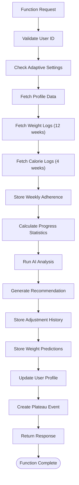
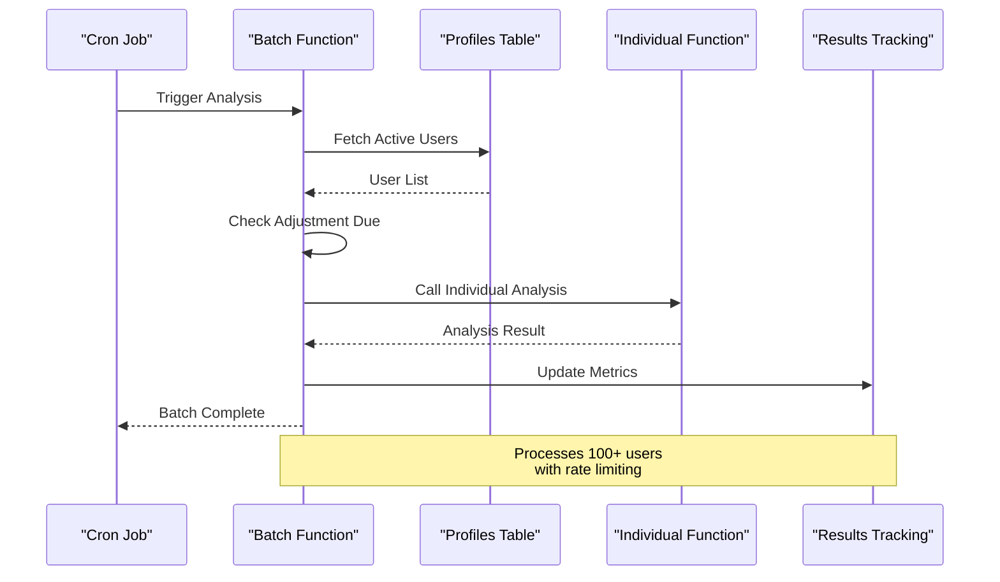

# Adaptive Goals System

<cite>
**Referenced Files in This Document**
- [ADAPTIVE_GOALS_IMPLEMENTATION_SUMMARY.md](file://ADAPTIVE_GOALS_IMPLEMENTATION_SUMMARY.md)
- [index.ts](file://supabase/functions/adaptive-goals/index.ts)
- [index.ts](file://supabase/functions/adaptive-goals-batch/index.ts)
- [20260221000000_adaptive_goals_system.sql](file://supabase/migrations/20260221000000_adaptive_goals_system.sql)
- [useAdaptiveGoals.ts](file://src/hooks/useAdaptiveGoals.ts)
- [AdaptiveGoalCard.tsx](file://src/components/AdaptiveGoalCard.tsx)
- [WeightPredictionChart.tsx](file://src/components/WeightPredictionChart.tsx)
- [AdaptiveGoalsSettings.tsx](file://src/components/AdaptiveGoalsSettings.tsx)
- [BehaviorPredictionWidget.tsx](file://src/components/BehaviorPredictionWidget.tsx)
</cite>

## Table of Contents
1. [Introduction](#introduction)
2. [System Architecture](#system-architecture)
3. [Core Components](#core-components)
4. [Behavior Prediction Engine](#behavior-prediction-engine)
5. [AI-Powered Goal Setting Interface](#ai-powered-goal-setting-interface)
6. [Dynamic Adjustment Recommendations](#dynamic-adjustment-recommendations)
7. [Settings Configuration](#settings-configuration)
8. [Integration with Nutrition Tracking](#integration-with-nutrition-tracking)
9. [Edge Functions and Data Pipeline](#edge-functions-and-data-pipeline)
10. [Performance Considerations](#performance-considerations)
11. [Troubleshooting Guide](#troubleshooting-guide)
12. [Conclusion](#conclusion)

## Introduction

The Adaptive Goals System is an AI-powered nutrition recommendation platform that automatically adjusts user nutrition targets based on their actual progress and behavior patterns. This system combines machine learning algorithms with real-time user data to provide personalized nutrition recommendations that evolve as users achieve their goals.

The system operates on a sophisticated three-tier architecture: edge functions for AI analysis, a comprehensive database layer for data persistence, and a React-based frontend for user interaction. It analyzes user eating patterns, activity levels, and health metrics to suggest optimal nutrition targets while maintaining strict safety parameters and user control.

## System Architecture

The Adaptive Goals System follows a modern serverless architecture with Supabase edge functions and PostgreSQL database integration:

**Diagram sources**
- [index.ts:1-522](file://supabase/functions/adaptive-goals/index.ts#L1-L522)
- [index.ts:1-136](file://supabase/functions/adaptive-goals-batch/index.ts#L1-L136)
- [20260221000000_adaptive_goals_system.sql:1-336](file://supabase/migrations/20260221000000_adaptive_goals_system.sql#L1-L336)

## Core Components

### Database Schema Design

The system implements a comprehensive database foundation with five primary tables that work together to provide intelligent goal adjustment capabilities:

**Diagram sources**
- [20260221000000_adaptive_goals_system.sql:9-336](file://supabase/migrations/20260221000000_adaptive_goals_system.sql#L9-L336)

### Edge Function Architecture

The system utilizes two primary edge functions that work in tandem to provide automated analysis and recommendations:

**Individual Analysis Function (`adaptive-goals`)**: Processes recommendations for individual users based on their progress data and current settings.

**Batch Processing Function (`adaptive-goals-batch`)**: Handles mass processing of all eligible users according to their configured adjustment frequencies.

**Section sources**
- [index.ts:316-522](file://supabase/functions/adaptive-goals/index.ts#L316-L522)
- [index.ts:9-136](file://supabase/functions/adaptive-goals-batch/index.ts#L9-L136)

## Behavior Prediction Engine

The Behavior Prediction Engine extends the adaptive goals system by analyzing user engagement patterns and predicting potential behavioral changes that could impact goal achievement:

**Diagram sources**
- [BehaviorPredictionWidget.tsx:1-201](file://src/components/BehaviorPredictionWidget.tsx#L1-L201)

The engine analyzes multiple behavioral indicators including:
- Churn risk assessment (scores > 0.6 trigger alerts)
- Boredom risk detection (meal plan variety patterns)
- Engagement score monitoring (app usage patterns)
- Recommended actions based on prediction severity

**Section sources**
- [BehaviorPredictionWidget.tsx:18-201](file://src/components/BehaviorPredictionWidget.tsx#L18-L201)

## AI-Powered Goal Setting Interface

### AdaptiveGoalCard Component

The AdaptiveGoalCard provides an intuitive interface for displaying AI recommendations with clear visual indicators and actionable controls:

**Diagram sources**
- [AdaptiveGoalCard.tsx:7-218](file://src/components/AdaptiveGoalCard.tsx#L7-L218)

### WeightPredictionChart Component

The WeightPredictionChart visualizes four-week weight projections with confidence intervals and interactive tooltips:

**Diagram sources**
- [WeightPredictionChart.tsx:40-291](file://src/components/WeightPredictionChart.tsx#L40-L291)

**Section sources**
- [AdaptiveGoalCard.tsx:1-218](file://src/components/AdaptiveGoalCard.tsx#L1-L218)
- [WeightPredictionChart.tsx:1-291](file://src/components/WeightPredictionChart.tsx#L1-L291)

## Dynamic Adjustment Recommendations

### Smart Scenarios Implementation

The system implements seven intelligent scenarios that trigger automatic calorie adjustments based on user progress patterns:

| Scenario | Trigger Condition | Action | Confidence Level |
|----------|-------------------|--------|------------------|
| **Plateau Detection** | 3+ consecutive weeks no weight change | ±100-150 calorie adjustment | 85% |
| **Rapid Weight Loss** | >1kg/week weight loss | +150 calories | 80% |
| **Slow Weight Loss** | <0.25kg/week weight loss | -100 calories | 75% |
| **Rapid Muscle Gain** | >1kg/week weight gain during bulking | -100 calories | 80% |
| **Low Adherence** | <50% tracking consistency | No changes | 60% |
| **Goal Achievement** | Current weight ≤ target weight | Switch to maintenance (+10%) | 95% |
| **Optimal Progress** | On-track weight loss/gain | No changes | 90% |

### Recommendation Generation Algorithm

The AI analysis engine processes user data through a multi-stage decision tree:

**Diagram sources**
- [index.ts:52-227](file://supabase/functions/adaptive-goals/index.ts#L52-L227)

**Section sources**
- [index.ts:42-227](file://supabase/functions/adaptive-goals/index.ts#L42-L227)
- [ADAPTIVE_GOALS_IMPLEMENTATION_SUMMARY.md:39-58](file://ADAPTIVE_GOALS_IMPLEMENTATION_SUMMARY.md#L39-L58)

## Settings Configuration

### AdaptiveGoalsSettings Component

The settings interface provides comprehensive control over the adaptive goals system:

**Diagram sources**
- [AdaptiveGoalsSettings.tsx:16-180](file://src/components/AdaptiveGoalsSettings.tsx#L16-L180)

### Configuration Options

The system provides granular control through several key settings:

**Auto-Adjustment Controls**:
- Enable/disable automatic goal adjustments
- Configure adjustment frequency (weekly/biweekly/monthly)
- Set minimum and maximum calorie limits (1200-4000)

**Safety Parameters**:
- Weight change thresholds for plateau detection
- Confidence level requirements for recommendations
- Adherence rate minimums before suggesting changes

**Personalization Preferences**:
- Health goal alignment (lose/gain/maintain)
- Individual user preferences for adjustment aggressiveness
- Historical data retention periods

**Section sources**
- [AdaptiveGoalsSettings.tsx:1-180](file://src/components/AdaptiveGoalsSettings.tsx#L1-L180)
- [20260221000000_adaptive_goals_system.sql:9-20](file://supabase/migrations/20260221000000_adaptive_goals_system.sql#L9-L20)

## Integration with Nutrition Tracking

### Frontend Integration Pattern

The adaptive goals system integrates seamlessly with the existing nutrition tracking infrastructure:

**Diagram sources**
- [useAdaptiveGoals.ts:136-178](file://src/hooks/useAdaptiveGoals.ts#L136-L178)

### Data Flow Integration

The system maintains bidirectional data flow between the AI engine and user interface:

**Incoming Data Flow**:
- User weight logs from progress tracking
- Calorie consumption data from meal logging
- Adherence metrics from tracking consistency
- Profile information from user settings

**Outgoing Data Flow**:
- AI-generated recommendations with confidence scores
- Four-week weight predictions with confidence intervals
- Adjustment history for audit trails
- Safety notifications for significant changes

**Section sources**
- [useAdaptiveGoals.ts:1-407](file://src/hooks/useAdaptiveGoals.ts#L1-L407)
- [ADAPTIVE_GOALS_IMPLEMENTATION_SUMMARY.md:108-133](file://ADAPTIVE_GOALS_IMPLEMENTATION_SUMMARY.md#L108-L133)

## Edge Functions and Data Pipeline

### Individual Analysis Pipeline

The adaptive-goals edge function processes user data through a comprehensive analysis pipeline:

**Diagram sources**
- [index.ts:316-522](file://supabase/functions/adaptive-goals/index.ts#L316-L522)

### Batch Processing Pipeline

The adaptive-goals-batch function orchestrates mass processing of user accounts:

**Diagram sources**
- [index.ts:9-136](file://supabase/functions/adaptive-goals-batch/index.ts#L9-L136)

### Data Validation and Safety

The system implements comprehensive safety measures:

**Input Validation**:
- User ID verification and authentication
- Data completeness checks for required fields
- Timestamp validation for log entries
- Range validation for numeric values

**Output Safety**:
- Calorie limit enforcement (1200-4000)
- Macro distribution validation
- Confidence threshold filtering
- Duplicate prevention mechanisms

**Section sources**
- [index.ts:316-522](file://supabase/functions/adaptive-goals/index.ts#L316-L522)
- [index.ts:9-136](file://supabase/functions/adaptive-goals-batch/index.ts#L9-L136)

## Performance Considerations

### Scalability Optimizations

The system implements several performance optimizations:

**Database Efficiency**:
- Indexed queries on frequently accessed columns
- Efficient aggregation functions for statistics
- Batch operations for reduced network overhead
- Connection pooling for edge function scalability

**Edge Function Performance**:
- Minimal cold start impact through optimized imports
- Caching strategies for repeated user data
- Asynchronous processing for non-critical operations
- Error handling to prevent cascading failures

**Frontend Optimization**:
- Lazy loading for heavy chart components
- Memoization for expensive calculations
- Debounced API calls for user interactions
- Progressive loading for large datasets

### Monitoring and Metrics

The system tracks key performance indicators:

**Processing Metrics**:
- Function execution time per user
- Database query performance
- Memory usage patterns
- Error rates and retry counts

**User Experience Metrics**:
- Recommendation acceptance rates
- User engagement with suggestions
- Feature adoption rates
- Support ticket volume

## Troubleshooting Guide

### Common Issues and Solutions

**Edge Function Deployment Issues**:
- Verify Supabase service role key configuration
- Check function availability before API calls
- Monitor CORS policy settings
- Validate environment variable configuration

**Data Integration Problems**:
- Confirm user profile completion status
- Verify progress log data integrity
- Check adherence calculation accuracy
- Validate weight measurement consistency

**Recommendation Accuracy**:
- Review adherence rate thresholds
- Analyze weight change calculation methods
- Check macro redistribution algorithms
- Validate confidence scoring mechanisms

### Debugging Tools

**Development Tools**:
- Console logging for edge function debugging
- Database query analysis for performance tuning
- Frontend state inspection for component debugging
- Network monitoring for API call tracking

**Production Monitoring**:
- Error tracking for edge function failures
- Database performance monitoring
- User feedback collection systems
- A/B testing for recommendation effectiveness

**Section sources**
- [useAdaptiveGoals.ts:136-178](file://src/hooks/useAdaptiveGoals.ts#L136-L178)
- [index.ts:514-521](file://supabase/functions/adaptive-goals/index.ts#L514-L521)

## Conclusion

The Adaptive Goals System represents a comprehensive solution for intelligent nutrition goal management. By combining sophisticated AI algorithms with robust data infrastructure and intuitive user interfaces, the system provides personalized nutrition recommendations that adapt to individual progress patterns.

Key achievements include:

**Technical Excellence**:
- Serverless architecture with scalable edge functions
- Comprehensive database design supporting complex analytics
- Real-time data processing and user notifications
- Extensive safety measures and error handling

**User Experience**:
- Intuitive recommendation cards with clear explanations
- Visual prediction charts for progress tracking
- Flexible settings for personal customization
- Seamless integration with existing nutrition tracking

**Business Impact**:
- Improved user retention through personalized engagement
- Enhanced goal achievement rates through adaptive recommendations
- Reduced manual intervention requirements
- Scalable architecture supporting rapid growth

The system provides a solid foundation for future enhancements including advanced machine learning models, expanded behavioral insights, and integration with additional health metrics. Its modular design ensures continued evolution while maintaining system stability and user trust.