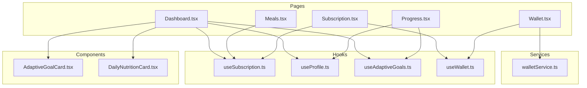
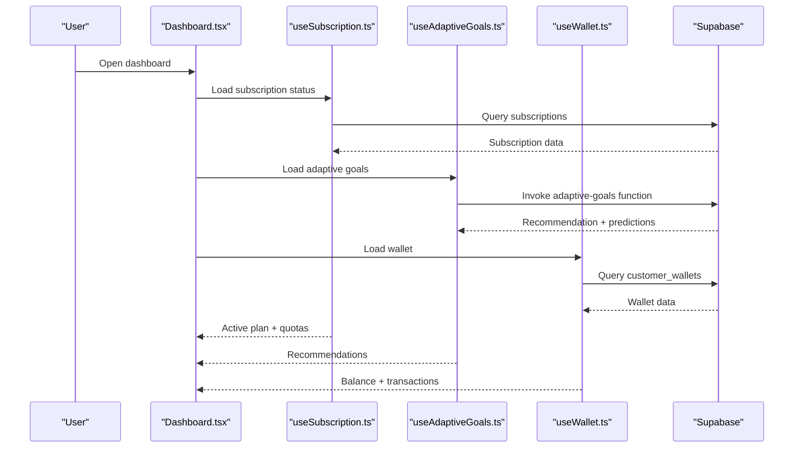
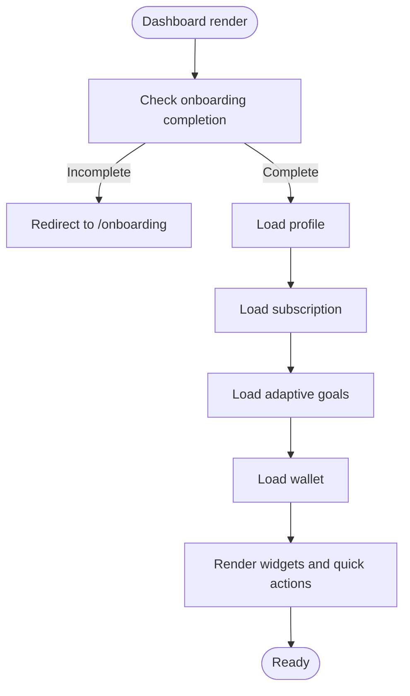
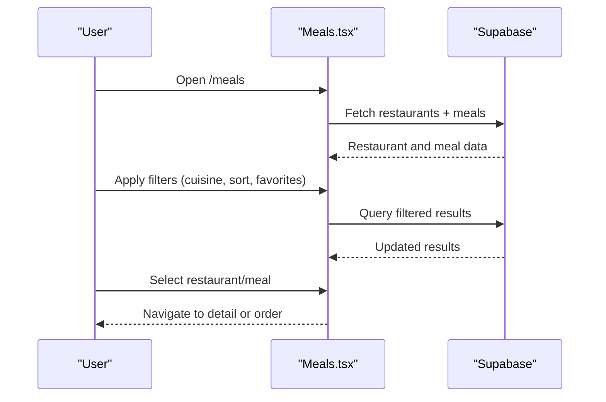
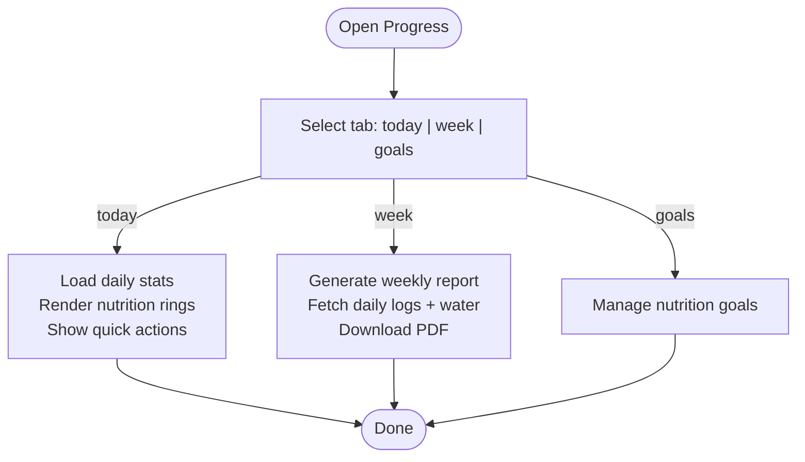
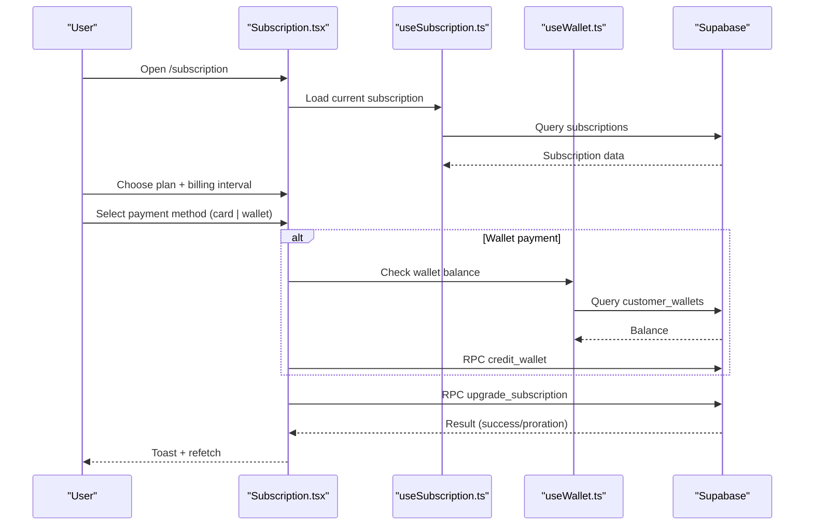
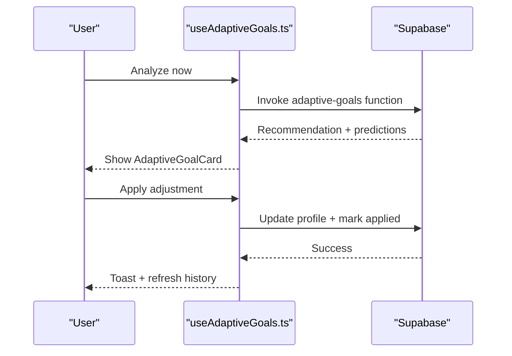
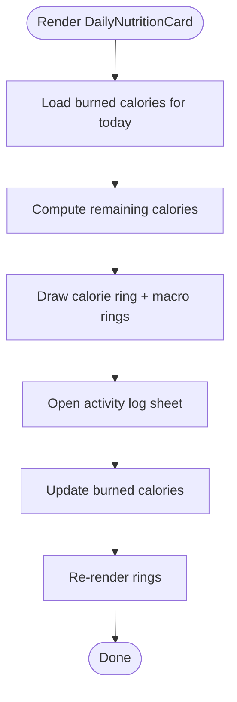
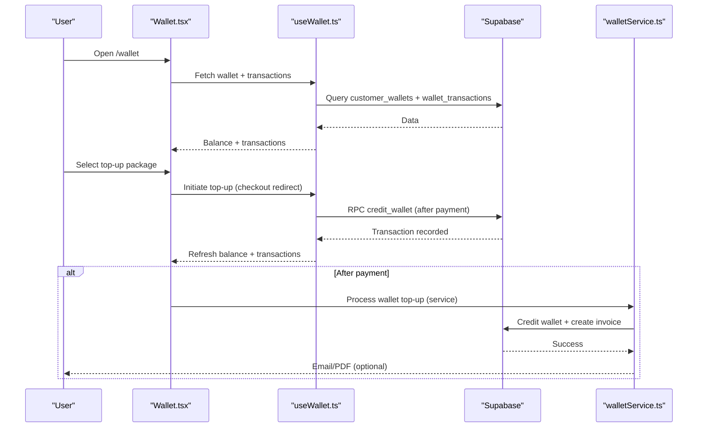
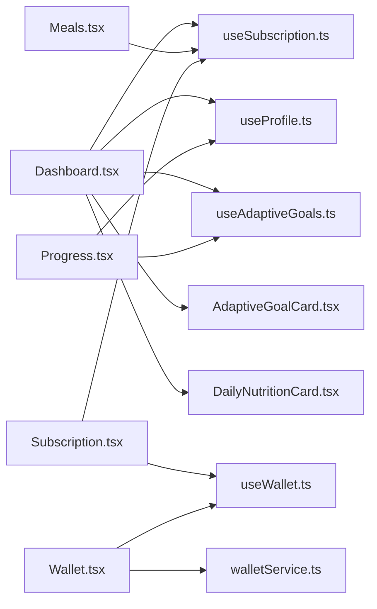

# Customer Portal

<cite>
**Referenced Files in This Document**
- [Dashboard.tsx](file://src/pages/Dashboard.tsx)
- [Meals.tsx](file://src/pages/Meals.tsx)
- [Progress.tsx](file://src/pages/Progress.tsx)
- [Subscription.tsx](file://src/pages/Subscription.tsx)
- [useSubscription.ts](file://src/hooks/useSubscription.ts)
- [useProfile.ts](file://src/hooks/useProfile.ts)
- [useAdaptiveGoals.ts](file://src/hooks/useAdaptiveGoals.ts)
- [AdaptiveGoalCard.tsx](file://src/components/AdaptiveGoalCard.tsx)
- [DailyNutritionCard.tsx](file://src/components/DailyNutritionCard.tsx)
- [useWallet.ts](file://src/hooks/useWallet.ts)
- [Wallet.tsx](file://src/pages/Wallet.tsx)
- [walletService.ts](file://src/services/walletService.ts)
</cite>

## Table of Contents
1. [Introduction](#introduction)
2. [Project Structure](#project-structure)
3. [Core Components](#core-components)
4. [Architecture Overview](#architecture-overview)
5. [Detailed Component Analysis](#detailed-component-analysis)
6. [Dependency Analysis](#dependency-analysis)
7. [Performance Considerations](#performance-considerations)
8. [Troubleshooting Guide](#troubleshooting-guide)
9. [Conclusion](#conclusion)

## Introduction
This document describes the customer-facing features of the Nutrio customer portal. It covers the meal ordering and scheduling system, nutrition tracking, progress monitoring dashboard, subscription management, adaptive goals integration, personalized recommendations, health metric tracking, wallet system and payment integration, subscription renewal processes, user onboarding flows, preference management, and notification preferences. The goal is to provide both technical depth and practical guidance for developers and stakeholders building or maintaining the customer experience.

## Project Structure
The customer portal is a React application with TypeScript, organized around feature-focused pages and shared components. Key areas include:
- Pages: Dashboard, Meals browsing, Progress tracking, Subscription management, Wallet
- Hooks: Business logic for subscriptions, profiles, adaptive goals, wallet, and analytics
- Components: Reusable UI elements for nutrition visualization, adaptive suggestions, and subscription controls
- Services: Backend orchestration for wallet top-ups and invoices

**Diagram sources**
- [Dashboard.tsx:1-566](file://src/pages/Dashboard.tsx#L1-L566)
- [Meals.tsx:1-800](file://src/pages/Meals.tsx#L1-L800)
- [Progress.tsx:1-687](file://src/pages/Progress.tsx#L1-L687)
- [Subscription.tsx:1-800](file://src/pages/Subscription.tsx#L1-L800)
- [useSubscription.ts:1-264](file://src/hooks/useSubscription.ts#L1-L264)
- [useProfile.ts:1-88](file://src/hooks/useProfile.ts#L1-L88)
- [useAdaptiveGoals.ts:1-407](file://src/hooks/useAdaptiveGoals.ts#L1-L407)
- [useWallet.ts:1-276](file://src/hooks/useWallet.ts#L1-L276)
- [AdaptiveGoalCard.tsx:1-218](file://src/components/AdaptiveGoalCard.tsx#L1-L218)
- [DailyNutritionCard.tsx:1-255](file://src/components/DailyNutritionCard.tsx#L1-L255)
- [walletService.ts:1-180](file://src/services/walletService.ts#L1-L180)

**Section sources**
- [Dashboard.tsx:1-566](file://src/pages/Dashboard.tsx#L1-L566)
- [Meals.tsx:1-800](file://src/pages/Meals.tsx#L1-L800)
- [Progress.tsx:1-687](file://src/pages/Progress.tsx#L1-L687)
- [Subscription.tsx:1-800](file://src/pages/Subscription.tsx#L1-L800)
- [useSubscription.ts:1-264](file://src/hooks/useSubscription.ts#L1-L264)
- [useProfile.ts:1-88](file://src/hooks/useProfile.ts#L1-L88)
- [useAdaptiveGoals.ts:1-407](file://src/hooks/useAdaptiveGoals.ts#L1-L407)
- [useWallet.ts:1-276](file://src/hooks/useWallet.ts#L1-L276)
- [AdaptiveGoalCard.tsx:1-218](file://src/components/AdaptiveGoalCard.tsx#L1-L218)
- [DailyNutritionCard.tsx:1-255](file://src/components/DailyNutritionCard.tsx#L1-L255)
- [walletService.ts:1-180](file://src/services/walletService.ts#L1-L180)

## Core Components
- Dashboard: Aggregates subscription status, daily nutrition, adaptive goals, quick actions, and active orders.
- Meals: Browse and filter restaurants and meals, favorites, and quick actions.
- Progress: Daily nutrition, weekly reports, goals management, water intake, and smart recommendations.
- Subscription: Plan overview, manage actions (pause/resume/cancel), upgrade/downgrade, rollover credits, freeze days, and auto-renewal.
- Wallet: Balance, top-up packages, transaction history, and payment flow integration.
- Adaptive Goals: AI-driven recommendations, settings, and adjustment history.
- Daily Nutrition Card: Visual calorie and macro tracking with animated rings.

**Section sources**
- [Dashboard.tsx:1-566](file://src/pages/Dashboard.tsx#L1-L566)
- [Meals.tsx:1-800](file://src/pages/Meals.tsx#L1-L800)
- [Progress.tsx:1-687](file://src/pages/Progress.tsx#L1-L687)
- [Subscription.tsx:1-800](file://src/pages/Subscription.tsx#L1-L800)
- [useWallet.ts:1-276](file://src/hooks/useWallet.ts#L1-L276)
- [useAdaptiveGoals.ts:1-407](file://src/hooks/useAdaptiveGoals.ts#L1-L407)
- [DailyNutritionCard.tsx:1-255](file://src/components/DailyNutritionCard.tsx#L1-L255)

## Architecture Overview
The customer portal integrates Supabase for real-time data and edge functions for AI analysis. Hooks encapsulate business logic and subscribe to real-time updates. Pages compose reusable components and orchestrate user flows.

**Diagram sources**
- [Dashboard.tsx:1-566](file://src/pages/Dashboard.tsx#L1-L566)
- [useSubscription.ts:1-264](file://src/hooks/useSubscription.ts#L1-L264)
- [useAdaptiveGoals.ts:1-407](file://src/hooks/useAdaptiveGoals.ts#L1-L407)
- [useWallet.ts:1-276](file://src/hooks/useWallet.ts#L1-L276)

## Detailed Component Analysis

### Dashboard
The dashboard presents a personalized overview:
- Subscription plan card with remaining meals and reset date
- Adaptive goal suggestion banner
- Daily nutrition card with calorie and macro visualization
- Quick actions: tracker, subscription, favorites, progress
- Active order banner and streak indicator
- Featured restaurants carousel with favorites toggle

**Diagram sources**
- [Dashboard.tsx:107-112](file://src/pages/Dashboard.tsx#L107-L112)
- [Dashboard.tsx:176-182](file://src/pages/Dashboard.tsx#L176-L182)
- [Dashboard.tsx:332-347](file://src/pages/Dashboard.tsx#L332-L347)
- [Dashboard.tsx:350-360](file://src/pages/Dashboard.tsx#L350-L360)
- [Dashboard.tsx:378-411](file://src/pages/Dashboard.tsx#L378-L411)
- [Dashboard.tsx:414-445](file://src/pages/Dashboard.tsx#L414-L445)
- [Dashboard.tsx:447-547](file://src/pages/Dashboard.tsx#L447-L547)

**Section sources**
- [Dashboard.tsx:1-566](file://src/pages/Dashboard.tsx#L1-L566)

### Meals Browsing and Ordering
The meals page enables discovery and selection:
- Cuisine filters and calorie range chips
- Sort by rating/fastest/popular
- Favorites toggle with guest login prompt
- Restaurant and meal cards with availability and ratings
- Bottom sheet filter modal

**Diagram sources**
- [Meals.tsx:675-800](file://src/pages/Meals.tsx#L675-L800)
- [Meals.tsx:721-800](file://src/pages/Meals.tsx#L721-L800)

**Section sources**
- [Meals.tsx:1-800](file://src/pages/Meals.tsx#L1-L800)

### Progress Monitoring
The progress page offers:
- Today tab: current weight, nutrition rings, water intake, meal quality, quick actions
- Week tab: professional weekly report with downloadable PDF
- Goals tab: manage nutrition targets

**Diagram sources**
- [Progress.tsx:43-687](file://src/pages/Progress.tsx#L43-L687)
- [Progress.tsx:657-673](file://src/pages/Progress.tsx#L657-L673)
- [Progress.tsx:675-679](file://src/pages/Progress.tsx#L675-L679)

**Section sources**
- [Progress.tsx:1-687](file://src/pages/Progress.tsx#L1-L687)

### Subscription Management
The subscription page supports:
- Plan overview with usage meter and rollover credits
- Manage actions: pause/resume, cancel with retention offer, freeze days
- Upgrade/downgrade with proration and billing interval toggle
- Auto-renewal toggle with backend RPC
- Promo code application and wallet payment option

**Diagram sources**
- [Subscription.tsx:126-800](file://src/pages/Subscription.tsx#L126-L800)
- [useSubscription.ts:163-203](file://src/hooks/useSubscription.ts#L163-L203)
- [useWallet.ts:137-167](file://src/hooks/useWallet.ts#L137-L167)

**Section sources**
- [Subscription.tsx:1-800](file://src/pages/Subscription.tsx#L1-L800)
- [useSubscription.ts:1-264](file://src/hooks/useSubscription.ts#L1-L264)
- [useWallet.ts:1-276](file://src/hooks/useWallet.ts#L1-L276)

### Adaptive Goals Integration
Adaptive goals provide AI-powered recommendations:
- Edge function invocation for dry-run and live analysis
- Settings management (auto-adjust, frequency, calorie bounds)
- Unviewed adjustment detection and dismissal
- Application of adjustments updates profile targets

**Diagram sources**
- [useAdaptiveGoals.ts:137-178](file://src/hooks/useAdaptiveGoals.ts#L137-L178)
- [useAdaptiveGoals.ts:247-286](file://src/hooks/useAdaptiveGoals.ts#L247-L286)
- [AdaptiveGoalCard.tsx:28-218](file://src/components/AdaptiveGoalCard.tsx#L28-L218)

**Section sources**
- [useAdaptiveGoals.ts:1-407](file://src/hooks/useAdaptiveGoals.ts#L1-L407)
- [AdaptiveGoalCard.tsx:1-218](file://src/components/AdaptiveGoalCard.tsx#L1-L218)

### Daily Nutrition Visualization
The daily nutrition card displays:
- Remaining calories ring with color-coded threshold
- Macro rings for carbs, protein, fat
- Burned calories summary and activity logging
- Animated transitions for smooth updates

**Diagram sources**
- [DailyNutritionCard.tsx:70-255](file://src/components/DailyNutritionCard.tsx#L70-L255)

**Section sources**
- [DailyNutritionCard.tsx:1-255](file://src/components/DailyNutritionCard.tsx#L1-L255)

### Wallet System and Payment Integration
The wallet system supports:
- Wallet creation and balance queries
- Top-up packages with bonus amounts
- Payment initiation and redirection to checkout
- Transaction history and real-time updates
- Wallet top-up processing service with invoice generation and optional email delivery

**Diagram sources**
- [Wallet.tsx:31-221](file://src/pages/Wallet.tsx#L31-L221)
- [useWallet.ts:65-98](file://src/hooks/useWallet.ts#L65-L98)
- [useWallet.ts:137-167](file://src/hooks/useWallet.ts#L137-L167)
- [walletService.ts:13-137](file://src/services/walletService.ts#L13-L137)

**Section sources**
- [Wallet.tsx:1-221](file://src/pages/Wallet.tsx#L1-L221)
- [useWallet.ts:1-276](file://src/hooks/useWallet.ts#L1-L276)
- [walletService.ts:1-180](file://src/services/walletService.ts#L1-L180)

## Dependency Analysis
- Pages depend on hooks for data and side effects.
- Hooks encapsulate Supabase queries, real-time channels, and RPC invocations.
- Components are stateless and receive props from pages or hooks.
- Services coordinate backend operations like wallet top-ups and invoicing.

**Diagram sources**
- [Dashboard.tsx:1-566](file://src/pages/Dashboard.tsx#L1-L566)
- [Meals.tsx:1-800](file://src/pages/Meals.tsx#L1-L800)
- [Progress.tsx:1-687](file://src/pages/Progress.tsx#L1-L687)
- [Subscription.tsx:1-800](file://src/pages/Subscription.tsx#L1-L800)
- [useSubscription.ts:1-264](file://src/hooks/useSubscription.ts#L1-L264)
- [useProfile.ts:1-88](file://src/hooks/useProfile.ts#L1-L88)
- [useAdaptiveGoals.ts:1-407](file://src/hooks/useAdaptiveGoals.ts#L1-L407)
- [useWallet.ts:1-276](file://src/hooks/useWallet.ts#L1-L276)
- [AdaptiveGoalCard.tsx:1-218](file://src/components/AdaptiveGoalCard.tsx#L1-L218)
- [DailyNutritionCard.tsx:1-255](file://src/components/DailyNutritionCard.tsx#L1-L255)
- [walletService.ts:1-180](file://src/services/walletService.ts#L1-L180)

**Section sources**
- [Dashboard.tsx:1-566](file://src/pages/Dashboard.tsx#L1-L566)
- [Meals.tsx:1-800](file://src/pages/Meals.tsx#L1-L800)
- [Progress.tsx:1-687](file://src/pages/Progress.tsx#L1-L687)
- [Subscription.tsx:1-800](file://src/pages/Subscription.tsx#L1-L800)
- [useSubscription.ts:1-264](file://src/hooks/useSubscription.ts#L1-L264)
- [useProfile.ts:1-88](file://src/hooks/useProfile.ts#L1-L88)
- [useAdaptiveGoals.ts:1-407](file://src/hooks/useAdaptiveGoals.ts#L1-L407)
- [useWallet.ts:1-276](file://src/hooks/useWallet.ts#L1-L276)
- [AdaptiveGoalCard.tsx:1-218](file://src/components/AdaptiveGoalCard.tsx#L1-L218)
- [DailyNutritionCard.tsx:1-255](file://src/components/DailyNutritionCard.tsx#L1-L255)
- [walletService.ts:1-180](file://src/services/walletService.ts#L1-L180)

## Performance Considerations
- Real-time updates: Supabase channels reduce polling and keep UI synchronized for subscriptions, wallets, and transactions.
- Memoization and callbacks: Hooks use memoized callbacks to prevent unnecessary re-renders.
- Lazy loading: Skeleton loaders and conditional rendering improve perceived performance during initial fetches.
- Animations: Framer Motion animations are scoped and optimized to avoid layout thrashing.

## Troubleshooting Guide
- Adaptive goals function not deployed: The hook gracefully handles missing edge functions and disables recommendations until deployment.
- Insufficient wallet balance: Subscription upgrades using wallet payment validate balance before RPC credit.
- Real-time sync issues: Visibility change listeners and Supabase channels ensure data stays fresh across sessions.
- Navigation loops: Dashboard redirects unauthenticated or incomplete onboarding users to appropriate pages.

**Section sources**
- [useAdaptiveGoals.ts:140-178](file://src/hooks/useAdaptiveGoals.ts#L140-L178)
- [Subscription.tsx:324-344](file://src/pages/Subscription.tsx#L324-L344)
- [Dashboard.tsx:107-112](file://src/pages/Dashboard.tsx#L107-L112)

## Conclusion
The customer portal combines modular pages, robust hooks, and reusable components to deliver a cohesive experience for meal ordering, nutrition tracking, progress monitoring, adaptive goals, subscription management, and wallet payments. Real-time data synchronization, thoughtful UI patterns, and clear separation of concerns enable maintainability and scalability.