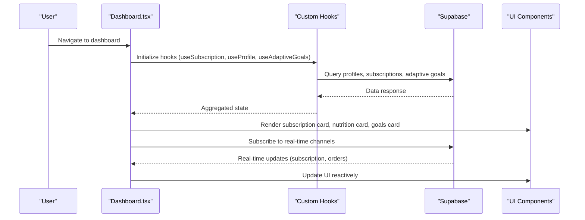
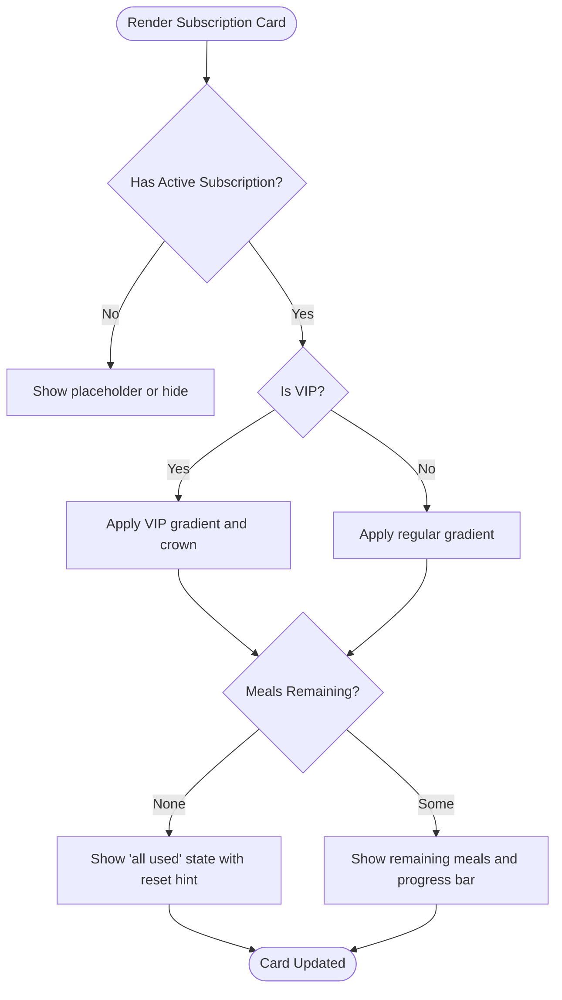
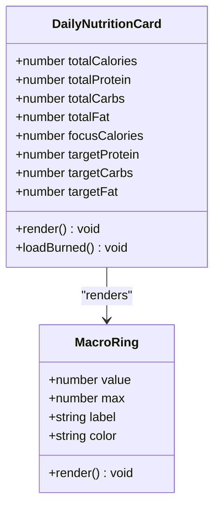
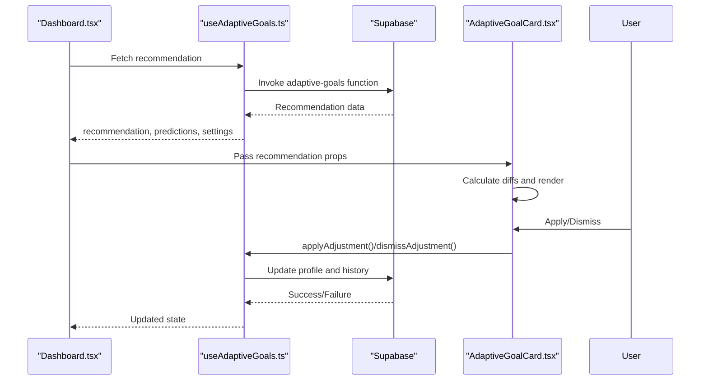
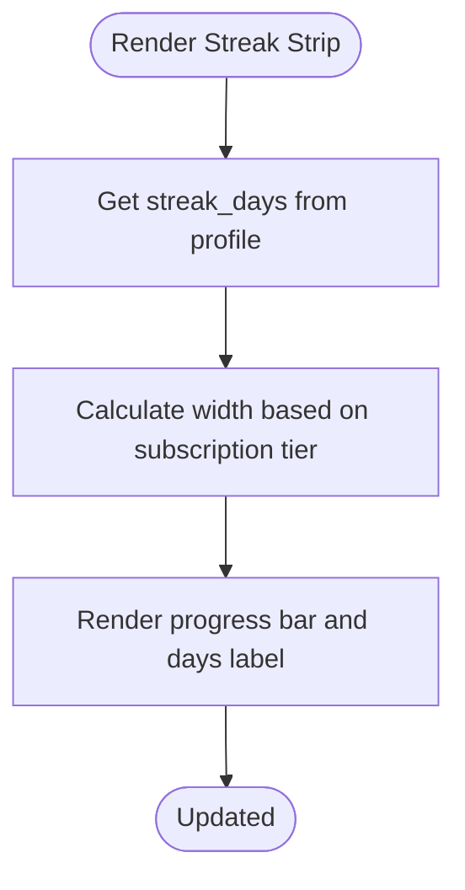
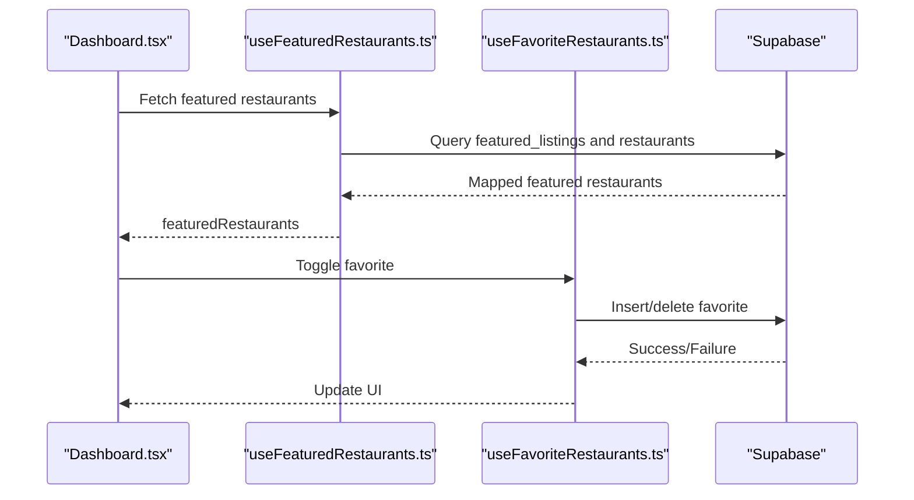
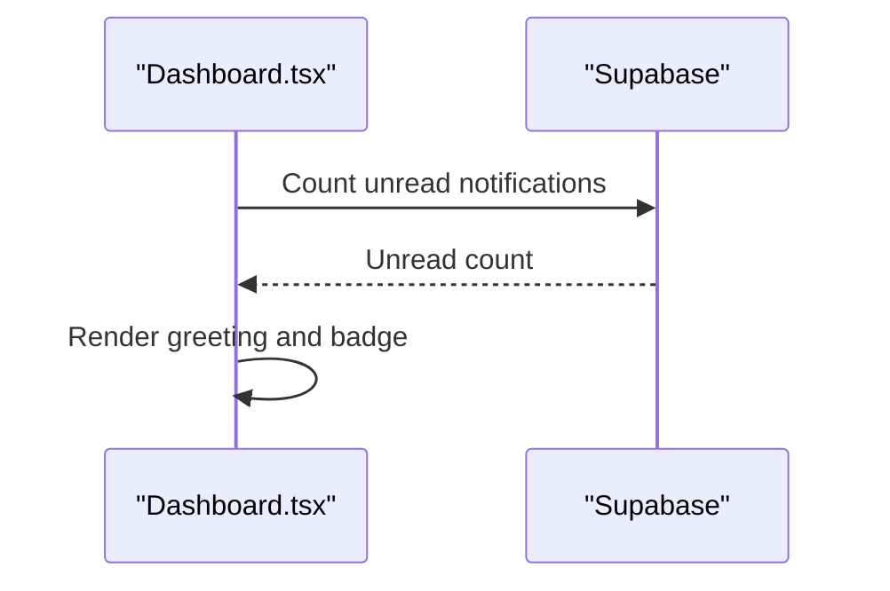
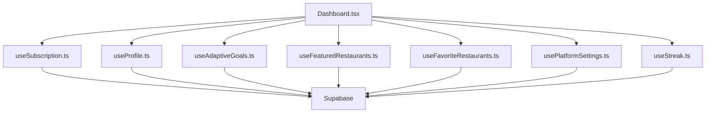

# Dashboard Overview

<cite>
**Referenced Files in This Document**
- [Dashboard.tsx](file://src/pages/Dashboard.tsx)
- [DailyNutritionCard.tsx](file://src/components/DailyNutritionCard.tsx)
- [AdaptiveGoalCard.tsx](file://src/components/AdaptiveGoalCard.tsx)
- [ActiveOrderBanner.tsx](file://src/components/ActiveOrderBanner.tsx)
- [RoleIndicator.tsx](file://src/components/RoleIndicator.tsx)
- [CustomerNavigation.tsx](file://src/components/CustomerNavigation.tsx)
- [useSubscription.ts](file://src/hooks/useSubscription.ts)
- [useProfile.ts](file://src/hooks/useProfile.ts)
- [useAdaptiveGoals.ts](file://src/hooks/useAdaptiveGoals.ts)
- [useFeaturedRestaurants.ts](file://src/hooks/useFeaturedRestaurants.ts)
- [useFavoriteRestaurants.ts](file://src/hooks/useFavoriteRestaurants.ts)
- [usePlatformSettings.ts](file://src/hooks/usePlatformSettings.ts)
- [useStreak.ts](file://src/hooks/useStreak.ts)
</cite>

## Table of Contents
1. [Introduction](#introduction)
2. [Project Structure](#project-structure)
3. [Core Components](#core-components)
4. [Architecture Overview](#architecture-overview)
5. [Detailed Component Analysis](#detailed-component-analysis)
6. [Dependency Analysis](#dependency-analysis)
7. [Performance Considerations](#performance-considerations)
8. [Troubleshooting Guide](#troubleshooting-guide)
9. [Conclusion](#conclusion)

## Introduction
This document provides comprehensive documentation for the Customer Dashboard overview section. It explains the main dashboard interface including the subscription status card, daily nutrition summary, adaptive goal recommendations, and quick action buttons. It also covers VIP user differentiation, streak display system, and the featured restaurant showcase. The document details the component architecture, data flow from hooks to UI, real-time updates, greeting system, notification integration, and role indicator functionality. Finally, it includes examples of dashboard customization and user-specific content rendering.

## Project Structure
The Customer Dashboard is implemented as a single-page React component that orchestrates multiple specialized components and hooks. The page integrates with Supabase for real-time data synchronization and uses custom hooks for business logic.

```mermaid
graph TB
subgraph "Dashboard Page"
Dashboard["Dashboard.tsx"]
end
subgraph "UI Components"
SubCard["Subscription Status Card<br/>Gradient, VIP crown, plan details"]
DailyCard["Daily Nutrition Card<br/>Calorie ring, macros, activity"]
GoalCard["Adaptive Goal Card<br/>AI suggestions, confidence"]
OrdersBanner["Active Orders Banner<br/>Real-time order tracking"]
StreakStrip["Streak Display<br/>Days counter, progress bar"]
Restaurants["Featured Restaurants<br/>Horizontal scroll, favorites"]
QuickActions["Quick Action Buttons<br/>Tracker, Subscription, Favorites, Progress"]
Greeting["Greeting & Notifications<br/>Time-based greeting, unread count"]
RoleIndicator["Role Indicator<br/>Customer/Partner switch"]
end
subgraph "Hooks"
useSub["useSubscription.ts"]
useProfile["useProfile.ts"]
useAdaptive["useAdaptiveGoals.ts"]
useFeat["useFeaturedRestaurants.ts"]
useFav["useFavoriteRestaurants.ts"]
usePlatform["usePlatformSettings.ts"]
useStreak["useStreak.ts"]
end
Dashboard --> SubCard
Dashboard --> DailyCard
Dashboard --> GoalCard
Dashboard --> OrdersBanner
Dashboard --> StreakStrip
Dashboard --> Restaurants
Dashboard --> QuickActions
Dashboard --> Greeting
Dashboard --> RoleIndicator
Dashboard --> useSub
Dashboard --> useProfile
Dashboard --> useAdaptive
Dashboard --> useFeat
Dashboard --> useFav
Dashboard --> usePlatform
Dashboard --> useStreak
```

**Diagram sources**
- [Dashboard.tsx:47-566](file://src/pages/Dashboard.tsx#L47-L566)
- [useSubscription.ts:42-264](file://src/hooks/useSubscription.ts#L42-L264)
- [useProfile.ts:33-88](file://src/hooks/useProfile.ts#L33-L88)
- [useAdaptiveGoals.ts:62-407](file://src/hooks/useAdaptiveGoals.ts#L62-L407)
- [useFeaturedRestaurants.ts:17-129](file://src/hooks/useFeaturedRestaurants.ts#L17-L129)
- [useFavoriteRestaurants.ts:6-123](file://src/hooks/useFavoriteRestaurants.ts#L6-L123)
- [usePlatformSettings.ts:50-125](file://src/hooks/usePlatformSettings.ts#L50-L125)
- [useStreak.ts:11-73](file://src/hooks/useStreak.ts#L11-L73)

**Section sources**
- [Dashboard.tsx:47-566](file://src/pages/Dashboard.tsx#L47-L566)

## Core Components
This section outlines the primary building blocks of the dashboard overview and their responsibilities:

- Subscription Status Card: Displays active plan, remaining meals, VIP indicators, and reset timing.
- Daily Nutrition Card: Shows calorie consumption, macro distribution, and activity burn with animated progress rings.
- Adaptive Goal Card: Presents AI-driven nutrition adjustments with confidence levels and rationale.
- Active Orders Banner: Real-time order tracking with status progression and cancellation controls.
- Streak Display Strip: Visualizes consecutive days with progress toward weekly milestones.
- Featured Restaurants: Curated restaurant showcase with favorites integration and horizontal scrolling.
- Quick Action Buttons: Compact navigation to tracker, subscription, favorites, and progress.
- Greeting & Notifications: Time-based greeting and unread notification badge.
- Role Indicator: Switch between customer and partner views.

**Section sources**
- [Dashboard.tsx:242-547](file://src/pages/Dashboard.tsx#L242-L547)
- [DailyNutritionCard.tsx:70-255](file://src/components/DailyNutritionCard.tsx#L70-L255)
- [AdaptiveGoalCard.tsx:28-218](file://src/components/AdaptiveGoalCard.tsx#L28-L218)
- [ActiveOrderBanner.tsx:87-607](file://src/components/ActiveOrderBanner.tsx#L87-L607)
- [useStreak.ts:11-73](file://src/hooks/useStreak.ts#L11-L73)
- [useFeaturedRestaurants.ts:17-129](file://src/hooks/useFeaturedRestaurants.ts#L17-L129)
- [RoleIndicator.tsx:16-56](file://src/components/RoleIndicator.tsx#L16-L56)

## Architecture Overview
The dashboard follows a modular architecture where the main page composes specialized components and delegates data fetching and business logic to custom hooks. Real-time updates are achieved through Supabase channels and periodic refetches.

**Diagram sources**
- [Dashboard.tsx:47-566](file://src/pages/Dashboard.tsx#L47-L566)
- [useSubscription.ts:100-135](file://src/hooks/useSubscription.ts#L100-L135)
- [ActiveOrderBanner.tsx:292-315](file://src/components/ActiveOrderBanner.tsx#L292-L315)

## Detailed Component Analysis

### Subscription Status Card
The subscription card dynamically renders based on active subscription state, VIP tier, and remaining meals. It displays plan details, remaining meals, and reset timing with a visual indicator for unlimited plans.

**Diagram sources**
- [Dashboard.tsx:242-330](file://src/pages/Dashboard.tsx#L242-L330)
- [useSubscription.ts:136-161](file://src/hooks/useSubscription.ts#L136-L161)

**Section sources**
- [Dashboard.tsx:242-330](file://src/pages/Dashboard.tsx#L242-L330)
- [useSubscription.ts:136-161](file://src/hooks/useSubscription.ts#L136-L161)

### Daily Nutrition Summary
The daily nutrition card presents a large calorie ring showing remaining calories, macro distribution rings, and activity burn integration. It animates transitions and adapts colors based on remaining calorie percentage.

**Diagram sources**
- [DailyNutritionCard.tsx:70-255](file://src/components/DailyNutritionCard.tsx#L70-L255)

**Section sources**
- [DailyNutritionCard.tsx:70-255](file://src/components/DailyNutritionCard.tsx#L70-L255)

### Adaptive Goal Recommendations
The adaptive goal card displays AI-generated nutrition adjustments with confidence levels, plateau detection, and rationale. Users can apply or dismiss recommendations.

**Diagram sources**
- [useAdaptiveGoals.ts:137-178](file://src/hooks/useAdaptiveGoals.ts#L137-L178)
- [useAdaptiveGoals.ts:246-303](file://src/hooks/useAdaptiveGoals.ts#L246-L303)
- [AdaptiveGoalCard.tsx:28-218](file://src/components/AdaptiveGoalCard.tsx#L28-L218)

**Section sources**
- [useAdaptiveGoals.ts:137-178](file://src/hooks/useAdaptiveGoals.ts#L137-L178)
- [useAdaptiveGoals.ts:246-303](file://src/hooks/useAdaptiveGoals.ts#L246-L303)
- [AdaptiveGoalCard.tsx:28-218](file://src/components/AdaptiveGoalCard.tsx#L28-L218)

### Quick Action Buttons
The quick actions provide compact navigation to key areas: tracker, subscription, favorites, and progress. These are horizontally arranged for easy access.

**Section sources**
- [Dashboard.tsx:378-411](file://src/pages/Dashboard.tsx#L378-L411)

### Streak Display System
The streak strip shows consecutive days with a progress bar indicating progress toward weekly milestones. The bar width adjusts based on active subscription status.

**Diagram sources**
- [Dashboard.tsx:416-445](file://src/pages/Dashboard.tsx#L416-L445)
- [useProfile.ts:33-88](file://src/hooks/useProfile.ts#L33-L88)

**Section sources**
- [Dashboard.tsx:416-445](file://src/pages/Dashboard.tsx#L416-L445)
- [useProfile.ts:33-88](file://src/hooks/useProfile.ts#L33-L88)

### Featured Restaurant Showcase
The featured restaurants section displays curated restaurants in a horizontal scroll with favorites integration, ratings, and meal counts.

**Diagram sources**
- [useFeaturedRestaurants.ts:22-123](file://src/hooks/useFeaturedRestaurants.ts#L22-L123)
- [useFavoriteRestaurants.ts:40-110](file://src/hooks/useFavoriteRestaurants.ts#L40-L110)
- [Dashboard.tsx:149-165](file://src/pages/Dashboard.tsx#L149-L165)

**Section sources**
- [useFeaturedRestaurants.ts:22-123](file://src/hooks/useFeaturedRestaurants.ts#L22-L123)
- [useFavoriteRestaurants.ts:40-110](file://src/hooks/useFavoriteRestaurants.ts#L40-L110)
- [Dashboard.tsx:149-165](file://src/pages/Dashboard.tsx#L149-L165)

### Greeting System and Notification Integration
The header displays a time-based greeting and an unread notification count badge. The notification count is fetched from the notifications table.

**Diagram sources**
- [Dashboard.tsx:79-91](file://src/pages/Dashboard.tsx#L79-L91)

**Section sources**
- [Dashboard.tsx:79-91](file://src/pages/Dashboard.tsx#L79-L91)

### Role Indicator Functionality
The role indicator shows the current portal (customer/partner) and provides a switch to toggle between roles.

**Section sources**
- [RoleIndicator.tsx:16-56](file://src/components/RoleIndicator.tsx#L16-L56)
- [Dashboard.tsx:227](file://src/pages/Dashboard.tsx#L227)

## Dependency Analysis
The dashboard relies on several custom hooks for data management and integrates with Supabase for real-time updates. The following diagram illustrates key dependencies:

**Diagram sources**
- [Dashboard.tsx:47-566](file://src/pages/Dashboard.tsx#L47-L566)
- [useSubscription.ts:42-264](file://src/hooks/useSubscription.ts#L42-L264)
- [useProfile.ts:33-88](file://src/hooks/useProfile.ts#L33-L88)
- [useAdaptiveGoals.ts:62-407](file://src/hooks/useAdaptiveGoals.ts#L62-L407)
- [useFeaturedRestaurants.ts:17-129](file://src/hooks/useFeaturedRestaurants.ts#L17-L129)
- [useFavoriteRestaurants.ts:6-123](file://src/hooks/useFavoriteRestaurants.ts#L6-L123)
- [usePlatformSettings.ts:50-125](file://src/hooks/usePlatformSettings.ts#L50-L125)
- [useStreak.ts:11-73](file://src/hooks/useStreak.ts#L11-L73)

**Section sources**
- [Dashboard.tsx:47-566](file://src/pages/Dashboard.tsx#L47-L566)

## Performance Considerations
- Real-time updates: The dashboard subscribes to Supabase channels for immediate UI updates on subscription and order changes. This reduces polling overhead and improves responsiveness.
- Conditional rendering: Components like the subscription card and adaptive goal card are conditionally rendered based on active subscription and available recommendations, minimizing unnecessary computations.
- Optimistic UI: Favorite toggles update immediately, providing instant feedback while asynchronous database operations finalize.
- Lazy loading: The featured restaurants section uses lazy loading and horizontal scrolling to maintain smooth performance with large datasets.

## Troubleshooting Guide
Common issues and their resolutions:

- Adaptive goals function not deployed: The system gracefully handles missing edge functions by disabling AI features and displaying informative messages. Ensure the function is deployed to enable adaptive goal recommendations.
- Real-time subscription updates failing: Verify Supabase Realtime is enabled and network connectivity is stable. The dashboard includes fallback refetch on visibility change.
- Notification count not updating: Confirm the user is authenticated and the notifications table has unread entries. Check browser console for Supabase errors.
- Streak data missing: Ensure the user has logged activities and the streak calculation service is active. Verify database records in the user_streaks table.

**Section sources**
- [useAdaptiveGoals.ts:140-178](file://src/hooks/useAdaptiveGoals.ts#L140-L178)
- [useSubscription.ts:100-135](file://src/hooks/useSubscription.ts#L100-L135)
- [Dashboard.tsx:79-91](file://src/pages/Dashboard.tsx#L79-L91)
- [useStreak.ts:20-61](file://src/hooks/useStreak.ts#L20-L61)

## Conclusion
The Customer Dashboard overview provides a comprehensive, real-time view of a user's nutrition journey, subscription status, and curated restaurant options. Its modular architecture, powered by custom hooks and Supabase, ensures responsive updates and personalized experiences. The VIP differentiation, adaptive goal recommendations, and streak system enhance engagement, while the quick actions and role indicator streamline navigation. The design supports customization through platform settings and user preferences, enabling tailored content delivery.