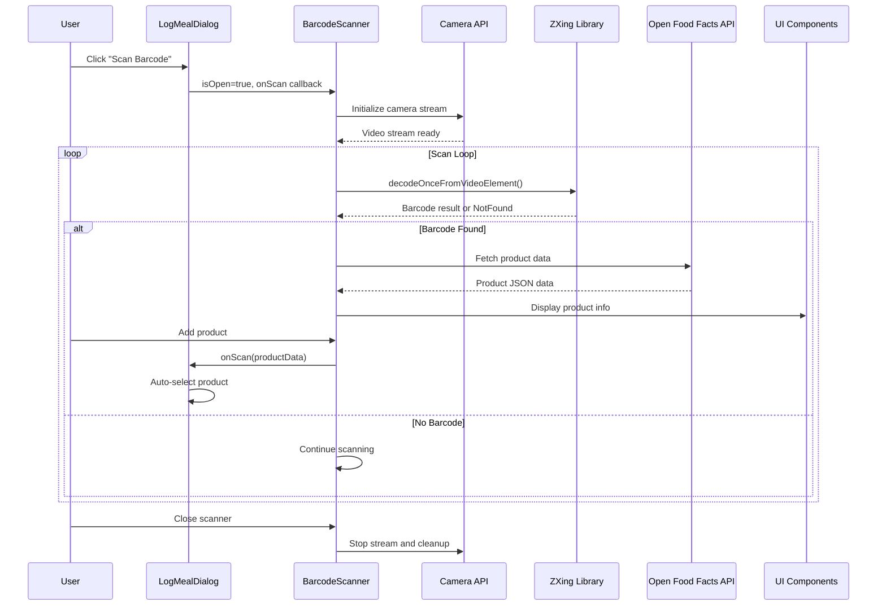
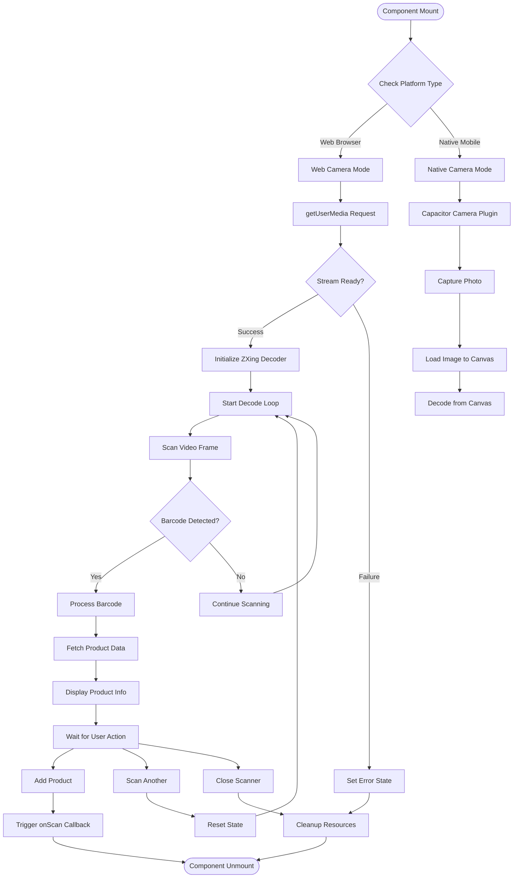
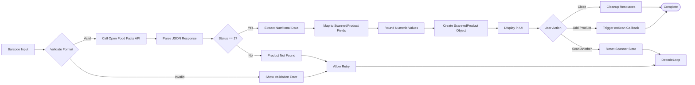

# Enhanced Barcode Scanner

<cite>
**Referenced Files in This Document**
- [BarcodeScanner.tsx](file://src/components/BarcodeScanner.tsx)
- [LogMealDialog.tsx](file://src/components/LogMealDialog.tsx)
- [capacitor.ts](file://src/lib/capacitor.ts)
- [package.json](file://package.json)
</cite>

## Table of Contents
1. [Introduction](#introduction)
2. [Project Structure](#project-structure)
3. [Core Components](#core-components)
4. [Architecture Overview](#architecture-overview)
5. [Detailed Component Analysis](#detailed-component-analysis)
6. [Dependency Analysis](#dependency-analysis)
7. [Performance Considerations](#performance-considerations)
8. [Troubleshooting Guide](#troubleshooting-guide)
9. [Conclusion](#conclusion)

## Introduction

The Enhanced Barcode Scanner is a sophisticated React component integrated into the Nutrio application's meal logging system. This component provides seamless barcode scanning capabilities for food products, leveraging both web browser APIs and native mobile camera functionality through Capacitor integration. The scanner connects to the Open Food Facts database to provide comprehensive nutritional information for scanned products, enabling users to quickly log food items with accurate macronutrient data.

The implementation supports multiple platforms including web browsers, iOS, and Android devices, with platform-specific optimizations for each environment. The component features intelligent error handling, user feedback mechanisms, and a clean user interface designed for quick and efficient food logging.

## Project Structure

The barcode scanning functionality is organized within the React component system of the Nutrio application:

```mermaid
graph TB
subgraph "Nutrio Application"
subgraph "Components"
BS[BarcodeScanner.tsx]
LMD[LogMealDialog.tsx]
end
subgraph "Libraries"
CAP[capacitor.ts]
ZXING[@zxing/library]
end
subgraph "External Services"
OFF[Open Food Facts API]
end
subgraph "UI Framework"
ION[Ionic UI Components]
SON[sonner Toast]
end
end
BS --> CAP
BS --> ZXING
BS --> OFF
BS --> ION
BS --> SON
LMD --> BS
```

**Diagram sources**
- [BarcodeScanner.tsx:1-588](file://src/components/BarcodeScanner.tsx#L1-L588)
- [LogMealDialog.tsx:1070-1091](file://src/components/LogMealDialog.tsx#L1070-L1091)
- [capacitor.ts:1-660](file://src/lib/capacitor.ts#L1-L660)

**Section sources**
- [BarcodeScanner.tsx:1-588](file://src/components/BarcodeScanner.tsx#L1-L588)
- [LogMealDialog.tsx:1070-1091](file://src/components/LogMealDialog.tsx#L1070-L1091)
- [capacitor.ts:1-660](file://src/lib/capacitor.ts#L1-L660)

## Core Components

### BarcodeScanner Component

The primary barcode scanning component provides comprehensive scanning functionality with the following key features:

**Core Functionality:**
- Dual-platform camera integration (web browser vs. native mobile)
- Real-time barcode detection using ZXing library
- Open Food Facts API integration for nutritional data
- Intelligent error handling and user feedback
- Manual barcode entry fallback
- Platform-specific optimizations

**Key Interfaces:**
- `BarcodeScannerProps`: Defines component props including scan callbacks and visibility state
- `ScannedProduct`: Standardized product data structure with nutritional information
- `OpenFoodFactsProduct`: API response interface for product data retrieval

**Platform Detection:**
The component automatically detects the execution environment using the `isNative` flag from the Capacitor wrapper, switching between:
- Web browser mode: Uses `navigator.mediaDevices.getUserMedia` for camera access
- Native mobile mode: Uses Capacitor Camera plugin for optimized mobile experience

**Section sources**
- [BarcodeScanner.tsx:12-46](file://src/components/BarcodeScanner.tsx#L12-L46)
- [BarcodeScanner.tsx:48-329](file://src/components/BarcodeScanner.tsx#L48-L329)

### LogMealDialog Integration

The barcode scanner is seamlessly integrated into the Log Meal dialog component, providing users with multiple food logging options:

**Integration Features:**
- Dedicated barcode scanning button in the meal logging interface
- Automatic product data population from scan results
- Quick selection and addition of scanned items
- Unified user experience across different logging methods

**Section sources**
- [LogMealDialog.tsx:693-704](file://src/components/LogMealDialog.tsx#L693-L704)
- [LogMealDialog.tsx:1081-1086](file://src/components/LogMealDialog.tsx#L1081-L1086)

### Capacitor Platform Wrapper

The Capacitor integration provides essential platform detection and native feature access:

**Platform Detection:**
- Automatic environment detection (web, iOS, Android, native)
- Graceful fallbacks for unsupported features
- Consistent API across all platforms

**Section sources**
- [capacitor.ts:27-43](file://src/lib/capacitor.ts#L27-L43)

## Architecture Overview

The barcode scanning architecture follows a modular design pattern with clear separation of concerns:



**Diagram sources**
- [BarcodeScanner.tsx:87-189](file://src/components/BarcodeScanner.tsx#L87-L189)
- [BarcodeScanner.tsx:253-300](file://src/components/BarcodeScanner.tsx#L253-L300)
- [LogMealDialog.tsx:384-407](file://src/components/LogMealDialog.tsx#L384-L407)

The architecture ensures optimal performance across different platforms while maintaining consistent user experience. The component handles platform-specific differences transparently, allowing developers to focus on business logic rather than implementation details.

## Detailed Component Analysis

### Camera Management System

The camera management system implements sophisticated platform detection and resource management:



**Diagram sources**
- [BarcodeScanner.tsx:87-189](file://src/components/BarcodeScanner.tsx#L87-L189)
- [BarcodeScanner.tsx:191-250](file://src/components/BarcodeScanner.tsx#L191-L250)

**Section sources**
- [BarcodeScanner.tsx:67-84](file://src/components/BarcodeScanner.tsx#L67-L84)
- [BarcodeScanner.tsx:87-189](file://src/components/BarcodeScanner.tsx#L87-L189)

### Data Processing Pipeline

The product data processing pipeline transforms raw barcode data into structured nutritional information:



**Diagram sources**
- [BarcodeScanner.tsx:253-300](file://src/components/BarcodeScanner.tsx#L253-L300)
- [BarcodeScanner.tsx:368-378](file://src/components/BarcodeScanner.tsx#L368-L378)

**Section sources**
- [BarcodeScanner.tsx:253-300](file://src/components/BarcodeScanner.tsx#L253-L300)
- [BarcodeScanner.tsx:368-378](file://src/components/BarcodeScanner.tsx#L368-L378)

### Error Handling and Recovery

The component implements comprehensive error handling strategies:

**Camera Access Errors:**
- Permission denials with user-friendly error messages
- Device unavailability detection
- Graceful fallback to manual entry mode

**Barcode Detection Errors:**
- NotFoundException handling for missed detections
- Image loading failures for native camera mode
- Network connectivity issues for API requests

**Section sources**
- [BarcodeScanner.tsx:111-119](file://src/components/BarcodeScanner.tsx#L111-L119)
- [BarcodeScanner.tsx:164-170](file://src/components/BarcodeScanner.tsx#L164-L170)
- [BarcodeScanner.tsx:238-242](file://src/components/BarcodeScanner.tsx#L238-L242)

## Dependency Analysis

The barcode scanner component relies on several key dependencies that enable its cross-platform functionality:

```mermaid
graph TB
subgraph "Core Dependencies"
REACT[React 18.3.1]
TYPESCRIPT[TypeScript 5.8.3]
VITE[Vite 7.3.1]
end
subgraph "UI Framework"
IONIC[Ionic React 8.8.1]
TAILWIND[Tailwind CSS]
LUCIDE[Lucide React Icons]
SONNER[Sonner Toast]
end
subgraph "Native Integration"
CAPACITOR[Capacitor 8.0.0]
CAMERA[Camera Plugin 8.0.1]
HAPTICS[Haptics Plugin 8.0.0]
end
subgraph "Barcode Processing"
ZXING[@zxing/library 0.21.3]
QRCODE[QRCode React 4.2.0]
end
subgraph "External APIs"
OFF[Open Food Facts API]
SUPABASE[Supabase 2.99.2]
end
subgraph "Development Tools"
SWC[SWC React Plugin]
TESTING[Vitest 4.0.18]
PLAYWRIGHT[Playwright 1.58.2]
end
BarcodeScanner --> REACT
BarcodeScanner --> IONIC
BarcodeScanner --> CAPACITOR
BarcodeScanner --> ZXING
BarcodeScanner --> OFF
LogMealDialog --> BarcodeScanner
CapacitorWrapper --> CAPACITOR
CapacitorWrapper --> CAMERA
CapacitorWrapper --> HAPTICS
```

**Diagram sources**
- [package.json:44-130](file://package.json#L44-L130)

**Section sources**
- [package.json:44-130](file://package.json#L44-L130)

### Third-Party Integrations

**Open Food Facts Integration:**
The component integrates with the Open Food Facts database, which provides comprehensive nutritional information for scanned products. This integration enables automatic retrieval of product names, brands, and detailed macronutrient data including calories, proteins, carbohydrates, fats, and fiber content.

**ZXing Library Integration:**
The @zxing/library provides robust barcode detection capabilities across multiple formats including UPC and EAN barcodes. The library handles various barcode types and provides reliable detection even under challenging lighting conditions.

**Capacitor Plugin Integration:**
The native mobile functionality leverages Capacitor's Camera plugin for optimized mobile experiences, including proper camera permissions, image capture, and platform-specific optimizations.

## Performance Considerations

The barcode scanner component implements several performance optimizations:

**Resource Management:**
- Proper cleanup of camera streams and decoder instances
- Efficient memory management for image processing
- Optimized animation frame usage for continuous scanning

**Platform-Specific Optimizations:**
- Native mobile mode reduces CPU overhead through optimized camera access
- Web browser mode utilizes hardware acceleration for video processing
- Intelligent throttling of scanning frequency to prevent excessive API calls

**User Experience Optimizations:**
- Loading states with appropriate feedback during product lookup
- Debounced barcode detection to prevent duplicate submissions
- Graceful degradation when advanced features are unavailable

## Troubleshooting Guide

### Common Issues and Solutions

**Camera Permission Denied:**
- Verify camera permissions are granted in browser settings
- Check device-specific permission dialogs for mobile devices
- Implement retry mechanism with user guidance

**Barcode Not Detected:**
- Ensure adequate lighting conditions
- Position barcode within scanning window
- Verify barcode quality and contrast
- Enable manual entry as fallback option

**Network Connectivity Issues:**
- Implement retry logic for API requests
- Display offline mode messaging
- Cache frequently accessed products locally

**Performance Issues:**
- Monitor CPU usage during extended scanning sessions
- Consider reducing video resolution for lower-end devices
- Implement scanning pause when UI is not visible

**Section sources**
- [BarcodeScanner.tsx:111-119](file://src/components/BarcodeScanner.tsx#L111-L119)
- [BarcodeScanner.tsx:164-170](file://src/components/BarcodeScanner.tsx#L164-L170)
- [BarcodeScanner.tsx:290-297](file://src/components/BarcodeScanner.tsx#L290-L297)

## Conclusion

The Enhanced Barcode Scanner represents a sophisticated implementation of cross-platform barcode scanning technology integrated into a comprehensive nutrition tracking application. The component successfully bridges the gap between web and native mobile experiences while providing robust functionality for food logging and nutritional analysis.

Key achievements include seamless platform abstraction through Capacitor integration, comprehensive error handling and recovery mechanisms, and efficient resource management for optimal performance across different devices and environments. The integration with Open Food Facts ensures access to reliable and comprehensive nutritional data, enhancing the overall user experience.

The modular architecture and clear separation of concerns facilitate maintainability and future enhancements, while the comprehensive testing and troubleshooting guidelines support reliable deployment and operation across diverse user scenarios.