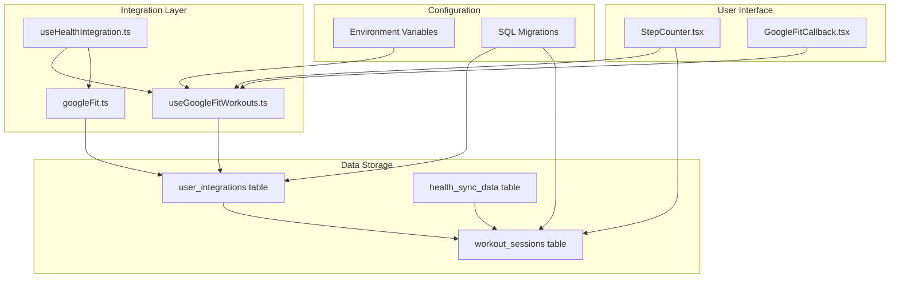
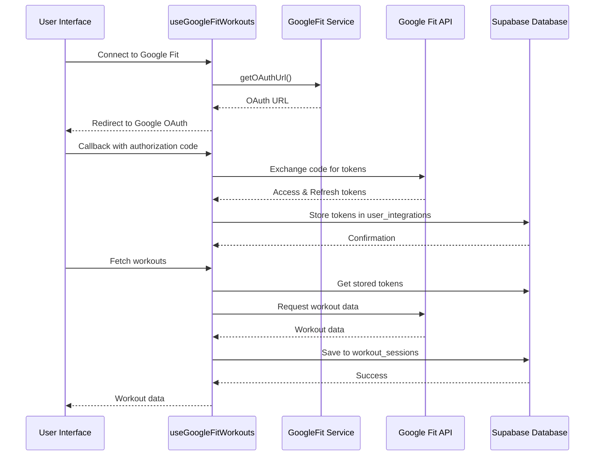
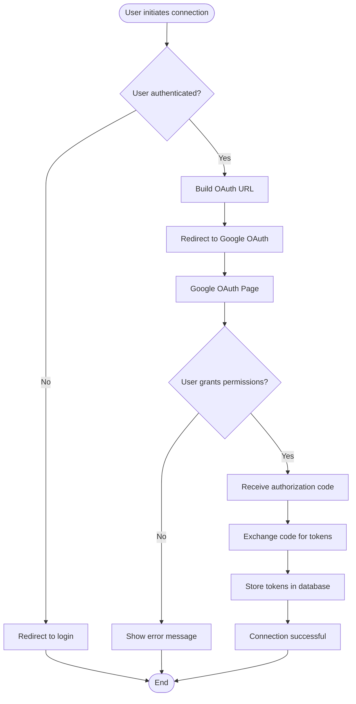
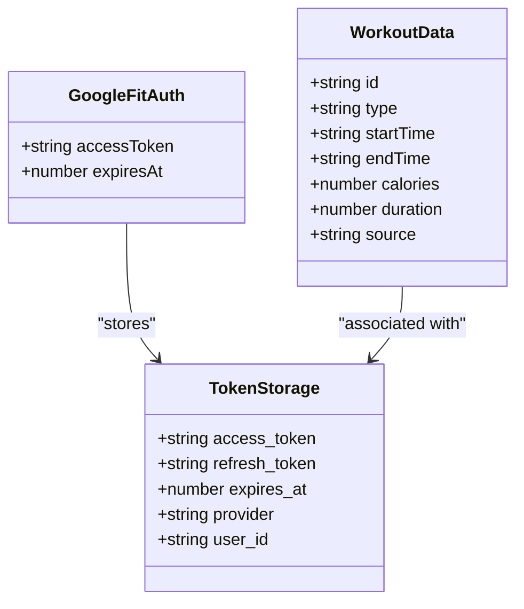
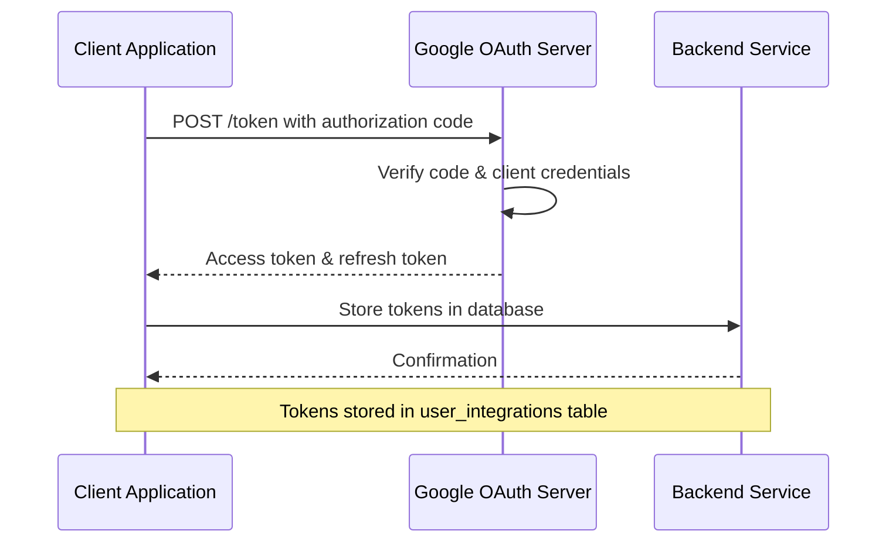
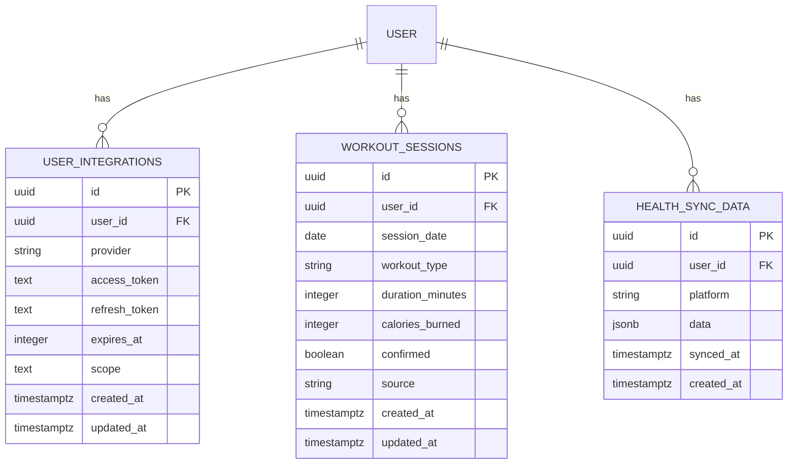
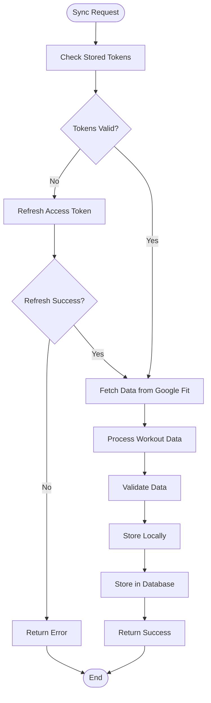

# Google Fit Integration

<cite>
**Referenced Files in This Document**
- [useGoogleFitWorkouts.ts](file://src/hooks/useGoogleFitWorkouts.ts)
- [GoogleFitCallback.tsx](file://src/pages/GoogleFitCallback.tsx)
- [useHealthIntegration.ts](file://src/hooks/useHealthIntegration.ts)
- [googleFit.ts](file://src/services/health/googleFit.ts)
- [SQL_MIGRATION.sql](file://SQL_MIGRATION.sql)
- [20260318_google_fit_integration.sql](file://supabase/migrations/20260318_google_fit_integration.sql)
- [StepCounter.tsx](file://src/pages/StepCounter.tsx)
</cite>

## Table of Contents
1. [Introduction](#introduction)
2. [Project Structure](#project-structure)
3. [Core Components](#core-components)
4. [Architecture Overview](#architecture-overview)
5. [Detailed Component Analysis](#detailed-component-analysis)
6. [OAuth Flow Implementation](#oauth-flow-implementation)
7. [Data Flow and Storage](#data-flow-and-storage)
8. [Mobile vs Web Implementation](#mobile-vs-web-implementation)
9. [Configuration Requirements](#configuration-requirements)
10. [Troubleshooting Guide](#troubleshooting-guide)
11. [Conclusion](#conclusion)

## Introduction

The Google Fit Integration is a comprehensive health data synchronization system that enables users to connect their Google Fit accounts to the Nutrio application. This integration supports both mobile (Android native) and web platforms, allowing users to automatically sync their workout data, track fitness metrics, and maintain a centralized health history.

The system provides seamless OAuth authentication, automatic token refresh capabilities, and structured data storage for workout sessions. It integrates with the broader health ecosystem by supporting multiple data sources and maintaining consistency across different platforms.

## Project Structure

The Google Fit integration is organized across several key areas within the codebase:

**Diagram sources**
- [useHealthIntegration.ts:1-285](file://src/hooks/useHealthIntegration.ts#L1-L285)
- [useGoogleFitWorkouts.ts:1-363](file://src/hooks/useGoogleFitWorkouts.ts#L1-L363)
- [googleFit.ts:1-280](file://src/services/health/googleFit.ts#L1-L280)

**Section sources**
- [useHealthIntegration.ts:1-285](file://src/hooks/useHealthIntegration.ts#L1-L285)
- [useGoogleFitWorkouts.ts:1-363](file://src/hooks/useGoogleFitWorkouts.ts#L1-L363)
- [googleFit.ts:1-280](file://src/services/health/googleFit.ts#L1-L280)

## Core Components

### Health Integration Hook

The primary integration point is the `useHealthIntegration` hook, which provides a unified interface for accessing health data across different platforms. This hook manages platform detection, permission requests, and data synchronization.

**Key Features:**
- Platform-specific implementation (iOS HealthKit, Android Google Fit, Web OAuth)
- Permission management for different health data types
- Automatic data synchronization with local storage
- Cross-platform compatibility layer

### Google Fit Workouts Hook

The `useGoogleFitWorkouts` hook focuses specifically on workout data retrieval and management. It handles the complete OAuth flow, token management, and workout data processing.

**Core Functionality:**
- OAuth authorization flow implementation
- Token refresh and expiration handling
- Workout data aggregation from Google Fit API
- Local workout session storage

### Google Fit Service

The service layer provides low-level Google Fit API interactions, supporting both native Android integration and web-based OAuth flows.

**Capabilities:**
- Native Android Google Fit plugin integration
- Web OAuth authentication support
- Workout data fetching and parsing
- Permission request handling

**Section sources**
- [useHealthIntegration.ts:52-260](file://src/hooks/useHealthIntegration.ts#L52-L260)
- [useGoogleFitWorkouts.ts:42-363](file://src/hooks/useGoogleFitWorkouts.ts#L42-L363)
- [googleFit.ts:54-280](file://src/services/health/googleFit.ts#L54-L280)

## Architecture Overview

The Google Fit integration follows a layered architecture pattern that separates concerns between user interface, business logic, and data persistence:

**Diagram sources**
- [useGoogleFitWorkouts.ts:131-187](file://src/hooks/useGoogleFitWorkouts.ts#L131-L187)
- [useGoogleFitWorkouts.ts:189-338](file://src/hooks/useGoogleFitWorkouts.ts#L189-L338)
- [GoogleFitCallback.tsx:12-57](file://src/pages/GoogleFitCallback.tsx#L12-L57)

## Detailed Component Analysis

### OAuth Authentication Flow

The OAuth implementation follows Google's standard authorization code flow with offline access permissions:

**Diagram sources**
- [useGoogleFitWorkouts.ts:131-187](file://src/hooks/useGoogleFitWorkouts.ts#L131-L187)
- [GoogleFitCallback.tsx:12-57](file://src/pages/GoogleFitCallback.tsx#L12-L57)

### Token Management System

The integration implements a robust token management system that handles automatic refresh and expiration:

**Diagram sources**
- [useGoogleFitWorkouts.ts:37-40](file://src/hooks/useGoogleFitWorkouts.ts#L37-L40)
- [useGoogleFitWorkouts.ts:20-35](file://src/hooks/useGoogleFitWorkouts.ts#L20-L35)

### Data Processing Pipeline

The workout data processing pipeline transforms raw Google Fit API responses into a standardized format:

```mermaid
flowchart LR
RawAPI[Raw Google Fit API Response] --> ParseBuckets[Parse Activity Buckets]
ParseBuckets --> ExtractActivity[Extract Activity Type]
ExtractActivity --> ExtractDuration[Extract Duration]
ExtractDuration --> ExtractCalories[Extract Calories]
ExtractCalories --> MapTypes[Map to Standard Types]
MapTypes --> CreateWorkouts[Create Workout Objects]
CreateWorkouts --> ValidateData[Validate Data]
ValidateData --> StoreDB[Store in workout_sessions]
StoreDB --> ReturnData[Return processed data]
```

**Diagram sources**
- [useGoogleFitWorkouts.ts:267-331](file://src/hooks/useGoogleFitWorkouts.ts#L267-L331)
- [googleFit.ts:198-244](file://src/services/health/googleFit.ts#L198-L244)

**Section sources**
- [useGoogleFitWorkouts.ts:69-128](file://src/hooks/useGoogleFitWorkouts.ts#L69-L128)
- [useGoogleFitWorkouts.ts:189-338](file://src/hooks/useGoogleFitWorkouts.ts#L189-L338)
- [googleFit.ts:154-244](file://src/services/health/googleFit.ts#L154-L244)

## OAuth Flow Implementation

The OAuth implementation follows Google's recommended security practices and supports offline access for continuous data synchronization:

### Authorization URL Generation

The system generates OAuth URLs with comprehensive scope definitions covering fitness activity and body data:

| Scope | Description | Purpose |
|-------|-------------|---------|
| `fitness.activity.read` | Read activity data | Workout types, durations, distances |
| `fitness.body.read` | Read body measurements | Calories, heart rate, nutrition |
| `fitness.location.read` | Read location data | Exercise routes, GPS tracking |

### Token Exchange Process

The token exchange process securely converts authorization codes to access tokens with refresh capabilities:

**Diagram sources**
- [useGoogleFitWorkouts.ts:145-187](file://src/hooks/useGoogleFitWorkouts.ts#L145-L187)
- [googleFit.ts:120-149](file://src/services/health/googleFit.ts#L120-L149)

**Section sources**
- [useGoogleFitWorkouts.ts:131-142](file://src/hooks/useGoogleFitWorkouts.ts#L131-L142)
- [useGoogleFitWorkouts.ts:145-187](file://src/hooks/useGoogleFitWorkouts.ts#L145-L187)
- [googleFit.ts:104-115](file://src/services/health/googleFit.ts#L104-L115)

## Data Flow and Storage

### Database Schema Design

The integration utilizes a normalized database schema optimized for health data storage and retrieval:

**Diagram sources**
- [SQL_MIGRATION.sql:1-26](file://SQL_MIGRATION.sql#L1-L26)
- [20260318_google_fit_integration.sql:34-58](file://supabase/migrations/20260318_google_fit_integration.sql#L34-L58)

### Data Synchronization Process

The synchronization process ensures data consistency across platforms while maintaining performance optimization:

**Diagram sources**
- [useGoogleFitWorkouts.ts:189-338](file://src/hooks/useGoogleFitWorkouts.ts#L189-L338)
- [useHealthIntegration.ts:134-190](file://src/hooks/useHealthIntegration.ts#L134-L190)

**Section sources**
- [SQL_MIGRATION.sql:1-26](file://SQL_MIGRATION.sql#L1-L26)
- [20260318_google_fit_integration.sql:34-58](file://supabase/migrations/20260318_google_fit_integration.sql#L34-L58)
- [useHealthIntegration.ts:134-190](file://src/hooks/useHealthIntegration.ts#L134-L190)

## Mobile vs Web Implementation

### Native Android Integration

The Android implementation leverages the Capacitor Google Fit plugin for optimal performance and native feature access:

**Advantages:**
- Direct native API access without OAuth overhead
- Background data synchronization capabilities
- Enhanced battery optimization
- Real-time data streaming

**Implementation Details:**
- Uses `@capacitor-community/google-fit` plugin
- Direct permission management through Android system
- Native data aggregation and processing
- Offline data caching capabilities

### Web Platform Implementation

The web implementation provides OAuth-based integration with comprehensive error handling and user experience:

**Features:**
- Complete OAuth flow with state management
- Automatic token refresh and expiration handling
- Cross-browser compatibility
- Progressive enhancement for better UX

**Security Measures:**
- Secure token storage in database
- CSRF protection for OAuth state
- Error boundary handling for OAuth failures
- Graceful degradation for unsupported browsers

**Section sources**
- [googleFit.ts:54-99](file://src/services/health/googleFit.ts#L54-L99)
- [useHealthIntegration.ts:74-94](file://src/hooks/useHealthIntegration.ts#L74-L94)

## Configuration Requirements

### Environment Variables

The integration requires specific environment variables for OAuth configuration:

| Variable | Purpose | Required |
|----------|---------|----------|
| `VITE_GOOGLE_FIT_CLIENT_ID` | OAuth client identifier | Yes |
| `VITE_GOOGLE_FIT_CLIENT_SECRET` | OAuth client secret | Yes |
| `VITE_GOOGLE_FIT_REDIRECT_URI` | OAuth redirect endpoint | Yes |

### Database Configuration

The system requires specific database schema modifications for proper operation:

**Required Tables:**
- `user_integrations`: Stores OAuth tokens and user connections
- `workout_sessions`: Contains processed workout data
- `health_sync_data`: Maintains sync history and metadata

**Security Policies:**
- Row-level security enabled for user data isolation
- Separate policies for CRUD operations
- Unique constraints for user-provider combinations

**Section sources**
- [useGoogleFitWorkouts.ts:85-86](file://src/hooks/useGoogleFitWorkouts.ts#L85-L86)
- [SQL_MIGRATION.sql:1-26](file://SQL_MIGRATION.sql#L1-L26)
- [20260318_google_fit_integration.sql:34-58](file://supabase/migrations/20260318_google_fit_integration.sql#L34-L58)

## Troubleshooting Guide

### Common Issues and Solutions

**OAuth Connection Failures:**
- Verify client credentials are properly configured
- Check redirect URI matches OAuth configuration
- Ensure HTTPS is enabled for production deployments
- Validate user authentication state before initiating OAuth

**Token Expiration Issues:**
- Implement automatic token refresh logic
- Handle refresh failures gracefully
- Provide user feedback for expired sessions
- Monitor token expiration timestamps

**Data Synchronization Problems:**
- Verify Google Fit API permissions are granted
- Check network connectivity and API quotas
- Validate date range parameters for API requests
- Monitor API response codes and error messages

**Mobile Integration Issues:**
- Ensure Google Fit app is installed and updated
- Verify device compatibility with Google Fit plugin
- Check runtime permissions for health data access
- Test on physical devices for accurate results

### Debugging Tools

**Development Utilities:**
- Console logging for OAuth flow tracking
- Network inspection for API requests
- Database inspection for token storage
- Error boundary implementation for graceful failure

**Monitoring and Analytics:**
- Track OAuth flow completion rates
- Monitor API response times and error rates
- Analyze user connection success rates
- Measure data synchronization frequency

**Section sources**
- [useGoogleFitWorkouts.ts:88-91](file://src/hooks/useGoogleFitWorkouts.ts#L88-L91)
- [GoogleFitCallback.tsx:35-39](file://src/pages/GoogleFitCallback.tsx#L35-L39)
- [useHealthIntegration.ts:184-187](file://src/hooks/useHealthIntegration.ts#L184-L187)

## Conclusion

The Google Fit Integration represents a comprehensive solution for health data synchronization across multiple platforms. The implementation demonstrates robust architecture patterns, secure OAuth handling, and efficient data processing capabilities.

Key strengths of the implementation include:

- **Cross-platform compatibility** enabling seamless integration on iOS, Android, and web platforms
- **Secure token management** with automatic refresh and expiration handling
- **Structured data processing** transforming raw API responses into standardized workout data
- **Comprehensive error handling** ensuring reliable operation across different environments
- **Scalable architecture** supporting future expansion and additional health data sources

The integration successfully bridges the gap between Google Fit's ecosystem and the Nutrio application, providing users with valuable insights into their fitness journey while maintaining data privacy and system reliability.

Future enhancements could include expanded health data types, improved offline synchronization capabilities, and integration with additional fitness platforms to create a comprehensive health data ecosystem.