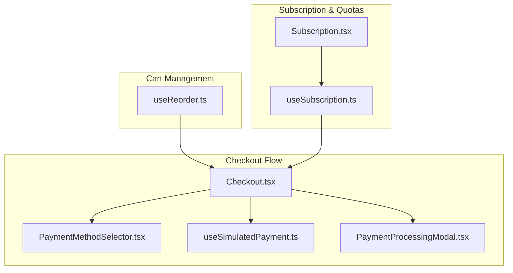
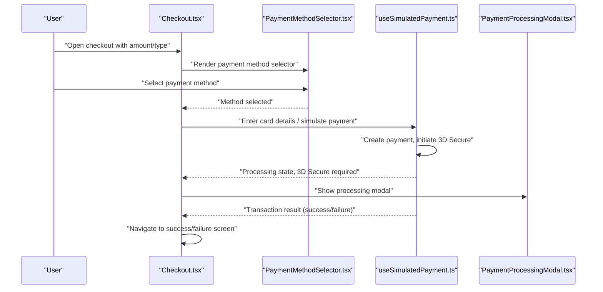
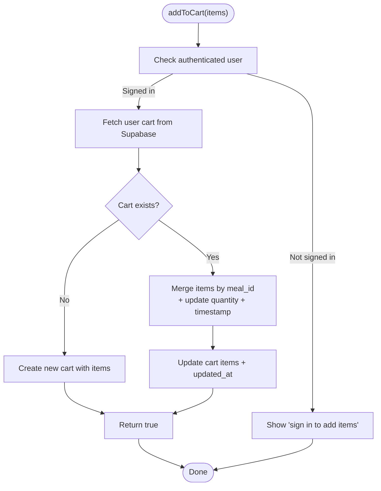
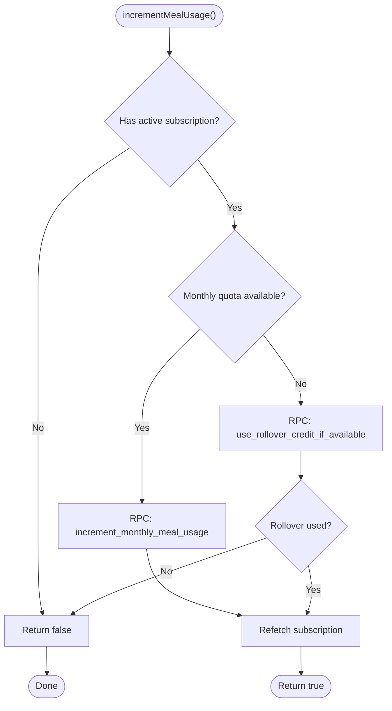
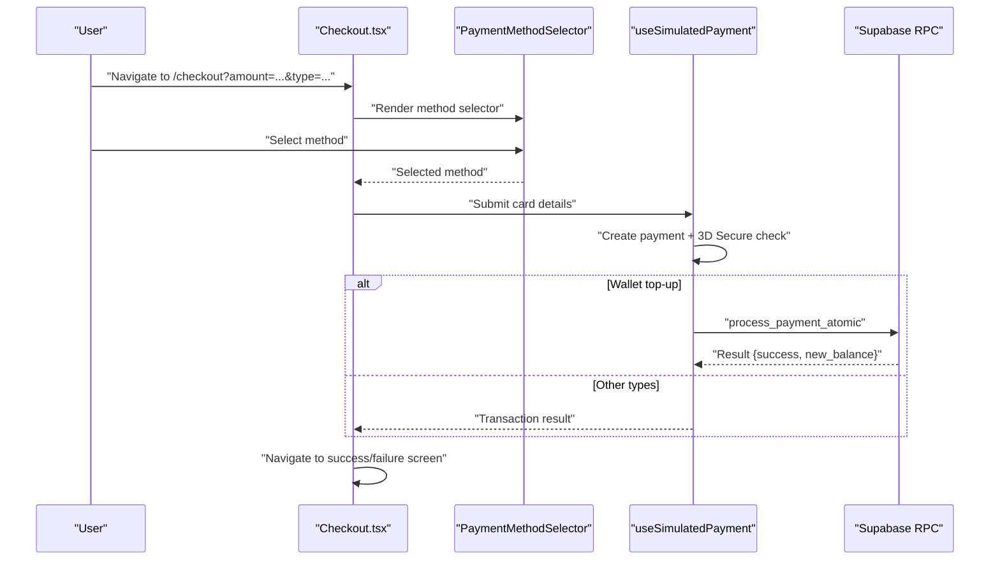
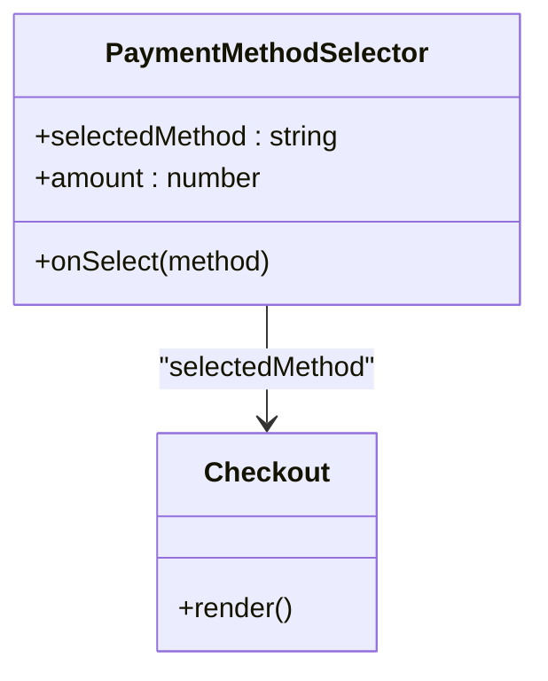
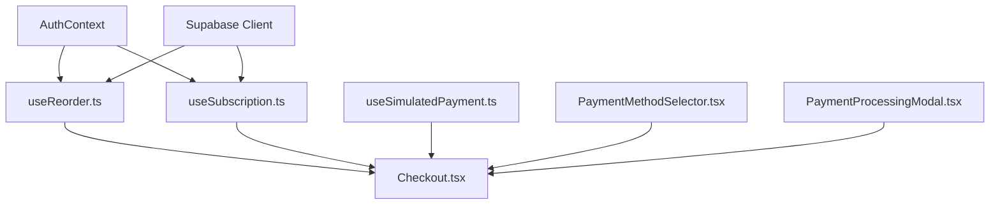

# Cart & Checkout Integration

<cite>
**Referenced Files in This Document**
- [Checkout.tsx](file://src/pages/Checkout.tsx)
- [useReorder.ts](file://src/hooks/useReorder.ts)
- [useSubscription.ts](file://src/hooks/useSubscription.ts)
- [PaymentMethodSelector.tsx](file://src/components/payment/PaymentMethodSelector.tsx)
- [useSimulatedPayment.ts](file://src/hooks/useSimulatedPayment.ts)
- [PaymentProcessingModal.tsx](file://src/components/payment/PaymentProcessingModal.tsx)
- [Subscription.tsx](file://src/pages/Subscription.tsx)
</cite>

## Table of Contents
1. [Introduction](#introduction)
2. [Project Structure](#project-structure)
3. [Core Components](#core-components)
4. [Architecture Overview](#architecture-overview)
5. [Detailed Component Analysis](#detailed-component-analysis)
6. [Dependency Analysis](#dependency-analysis)
7. [Performance Considerations](#performance-considerations)
8. [Troubleshooting Guide](#troubleshooting-guide)
9. [Conclusion](#conclusion)

## Introduction
This document describes the cart and checkout integration system, covering cart management, subscription quota enforcement, real-time updates, and secure payment processing. It explains how meal selections interact with user subscription limits, how inventory validation and price recalculation occur during checkout, and how the payment method selector integrates with simulated payment processing. Examples of cart state management, checkout flow patterns, and error handling for out-of-stock items or quota limitations are included.

## Project Structure
The cart and checkout system spans several key areas:
- Page-level checkout flow orchestrating payment steps
- Hooks managing cart operations and subscription quotas
- Payment components for method selection and processing simulation
- Real-time subscription updates and rollover credit handling

**Diagram sources**
- [Checkout.tsx:17-288](file://src/pages/Checkout.tsx#L17-L288)
- [useReorder.ts:40-241](file://src/hooks/useReorder.ts#L40-L241)
- [useSubscription.ts:42-263](file://src/hooks/useSubscription.ts#L42-L263)
- [PaymentMethodSelector.tsx:51-85](file://src/components/payment/PaymentMethodSelector.tsx#L51-L85)
- [useSimulatedPayment.ts:79-125](file://src/hooks/useSimulatedPayment.ts#L79-L125)
- [PaymentProcessingModal.tsx:21-42](file://src/components/payment/PaymentProcessingModal.tsx#L21-L42)
- [Subscription.tsx:126-172](file://src/pages/Subscription.tsx#L126-L172)

**Section sources**
- [Checkout.tsx:17-288](file://src/pages/Checkout.tsx#L17-L288)
- [useReorder.ts:40-241](file://src/hooks/useReorder.ts#L40-L241)
- [useSubscription.ts:42-263](file://src/hooks/useSubscription.ts#L42-L263)

## Core Components
- Cart Management Hook (`useReorder`): Adds items to the user's cart, merges quantities for existing items, and supports reordering from past orders.
- Subscription Hook (`useSubscription`): Tracks active subscription status, remaining meal quotas, and handles rollover credits for bonus meals.
- Checkout Page (`Checkout`): Orchestrates payment steps, integrates payment method selection, and manages success/failure states.
- Payment Components: Method selector, processing modal, and simulated payment hook for 3D Secure and transaction verification.

Key capabilities:
- Item addition, quantity adjustment, and removal via cart operations
- Subscription quota enforcement and rollover credit usage
- Real-time subscription updates via Supabase real-time channels
- Simulated payment processing with 3D Secure flow

**Section sources**
- [useReorder.ts:45-122](file://src/hooks/useReorder.ts#L45-L122)
- [useSubscription.ts:136-203](file://src/hooks/useSubscription.ts#L136-L203)
- [Checkout.tsx:88-104](file://src/pages/Checkout.tsx#L88-L104)
- [PaymentMethodSelector.tsx:51-85](file://src/components/payment/PaymentMethodSelector.tsx#L51-L85)

## Architecture Overview
The checkout flow integrates cart operations, subscription validation, and payment processing through a series of coordinated components and hooks.

**Diagram sources**
- [Checkout.tsx:88-104](file://src/pages/Checkout.tsx#L88-L104)
- [PaymentMethodSelector.tsx:51-85](file://src/components/payment/PaymentMethodSelector.tsx#L51-L85)
- [useSimulatedPayment.ts:79-125](file://src/hooks/useSimulatedPayment.ts#L79-L125)
- [PaymentProcessingModal.tsx:21-42](file://src/components/payment/PaymentProcessingModal.tsx#L21-L42)

## Detailed Component Analysis

### Cart Management Hook (`useReorder`)
Responsibilities:
- Add items to the user's cart, merging quantities for existing items
- Create a new cart if none exists
- Reorder items from previous orders into the cart
- Emit analytics events and navigation actions

Implementation highlights:
- Fetches existing cart per user and merges new items by `meal_id`
- Updates timestamps for freshness tracking
- Returns success/failure with error capture and user feedback

**Diagram sources**
- [useReorder.ts:45-122](file://src/hooks/useReorder.ts#L45-L122)

**Section sources**
- [useReorder.ts:45-122](file://src/hooks/useReorder.ts#L45-L122)
- [useReorder.ts:124-234](file://src/hooks/useReorder.ts#L124-L234)

### Subscription Quota Integration (`useSubscription`)
Responsibilities:
- Determine active subscription status and remaining meal quotas
- Enforce monthly and weekly limits
- Use rollover credits when monthly quota is exhausted
- Provide real-time updates via Supabase real-time channels

Key behaviors:
- Calculates remaining meals considering VIP unlimited status
- Uses RPC functions to increment monthly usage or apply rollover credits
- Subscribes to subscription changes for live updates

**Diagram sources**
- [useSubscription.ts:163-203](file://src/hooks/useSubscription.ts#L163-L203)

**Section sources**
- [useSubscription.ts:136-203](file://src/hooks/useSubscription.ts#L136-L203)
- [Subscription.tsx:126-172](file://src/pages/Subscription.tsx#L126-L172)

### Checkout Page (`Checkout`)
Responsibilities:
- Parse query parameters for amount and type
- Orchestrate payment steps: method selection, card details, processing, 3D Secure
- Handle success and failure states with navigation and messaging
- Integrate atomic payment processing for wallet top-ups

**Diagram sources**
- [Checkout.tsx:24-78](file://src/pages/Checkout.tsx#L24-L78)
- [Checkout.tsx:88-104](file://src/pages/Checkout.tsx#L88-L104)
- [useSimulatedPayment.ts:79-125](file://src/hooks/useSimulatedPayment.ts#L79-L125)

**Section sources**
- [Checkout.tsx:24-78](file://src/pages/Checkout.tsx#L24-L78)
- [Checkout.tsx:130-186](file://src/pages/Checkout.tsx#L130-L186)

### Payment Method Selector Integration
Responsibilities:
- Present selectable payment methods with icons and popularity indicators
- Pass selected method to the checkout flow
- Display total amount for context

**Diagram sources**
- [PaymentMethodSelector.tsx:51-85](file://src/components/payment/PaymentMethodSelector.tsx#L51-L85)
- [Checkout.tsx:189-215](file://src/pages/Checkout.tsx#L189-L215)

**Section sources**
- [PaymentMethodSelector.tsx:51-85](file://src/components/payment/PaymentMethodSelector.tsx#L51-L85)
- [Checkout.tsx:189-215](file://src/pages/Checkout.tsx#L189-L215)

### Real-time Cart Updates and Inventory Validation
Real-time behavior:
- Cart updates are persisted to Supabase and can be observed via real-time channels
- Subscription changes trigger refetches for accurate quota enforcement

Inventory validation:
- While the cart hook merges quantities locally, inventory checks are typically performed during order placement or payment processing
- The checkout page defers final stock validation to the payment processing step

**Section sources**
- [useReorder.ts:45-122](file://src/hooks/useReorder.ts#L45-L122)
- [useSubscription.ts:100-123](file://src/hooks/useSubscription.ts#L100-L123)

### Price Recalculation During Checkout
The checkout page reads the amount from query parameters and displays it as the total. Payment processing may adjust totals based on promotions or fees, with the final amount reflected in success messages.

**Section sources**
- [Checkout.tsx:24-28](file://src/pages/Checkout.tsx#L24-L28)
- [Checkout.tsx:174-186](file://src/pages/Checkout.tsx#L174-L186)

### Order History Management
The system supports reordering from previous orders, transforming order items into cart items and optionally navigating to checkout. Eligibility checks ensure only completed or delivered orders can be reordered.

**Section sources**
- [useReorder.ts:124-234](file://src/hooks/useReorder.ts#L124-L234)
- [useReorder.ts:243-259](file://src/hooks/useReorder.ts#L243-L259)

## Dependency Analysis
The checkout system depends on:
- Authentication context for user identification
- Supabase client for cart and subscription persistence
- Payment simulation utilities for transaction lifecycle
- Real-time channels for live subscription updates

**Diagram sources**
- [useReorder.ts:40-241](file://src/hooks/useReorder.ts#L40-L241)
- [useSubscription.ts:42-263](file://src/hooks/useSubscription.ts#L42-L263)
- [Checkout.tsx:17-288](file://src/pages/Checkout.tsx#L17-L288)

**Section sources**
- [useReorder.ts:40-241](file://src/hooks/useReorder.ts#L40-L241)
- [useSubscription.ts:42-263](file://src/hooks/useSubscription.ts#L42-L263)
- [Checkout.tsx:17-288](file://src/pages/Checkout.tsx#L17-L288)

## Performance Considerations
- Minimize cart writes by batching item additions and merging quantities efficiently
- Use real-time channels judiciously; subscribe only when needed (e.g., during active checkout)
- Cache frequently accessed subscription data and invalidate on channel events
- Debounce user input in payment forms to reduce unnecessary processing

## Troubleshooting Guide
Common issues and resolutions:
- Out-of-stock items: Validate inventory during payment processing; show user-friendly messages and prevent checkout completion
- Quota limitations: Ensure `incrementMealUsage` is called before allowing meal orders; handle rollover credit fallback gracefully
- Payment failures: Capture error details and route users to failure screen with retry and support options
- Real-time sync delays: Implement manual refetch triggers on visibility change and explicit user actions

**Section sources**
- [useSubscription.ts:163-203](file://src/hooks/useSubscription.ts#L163-L203)
- [Checkout.tsx:80-86](file://src/pages/Checkout.tsx#L80-L86)
- [useSimulatedPayment.ts:111-125](file://src/hooks/useSimulatedPayment.ts#L111-L125)

## Conclusion
The cart and checkout integration provides a robust foundation for managing meal selections, enforcing subscription quotas, and processing payments securely. By combining cart operations, subscription validation, and simulated payment processing, the system ensures reliable user experiences while maintaining real-time synchronization and clear error handling pathways.