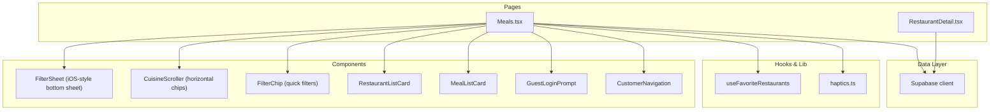
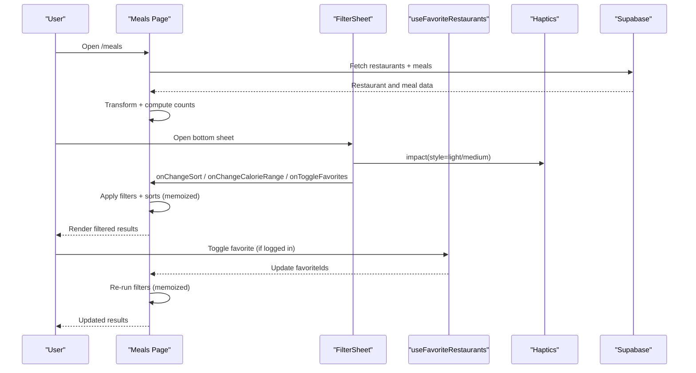
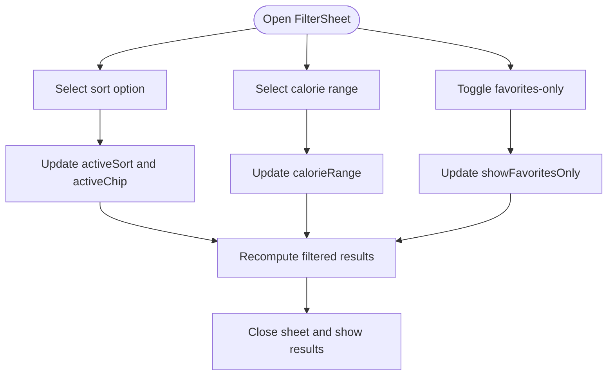
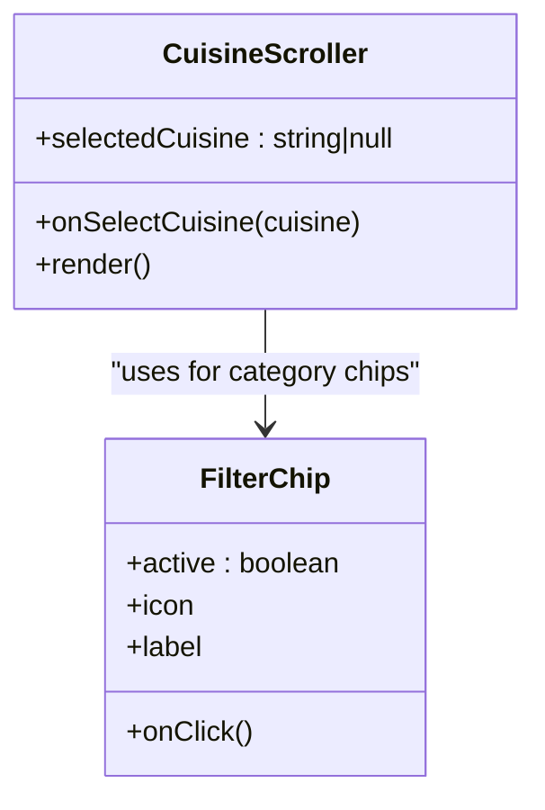
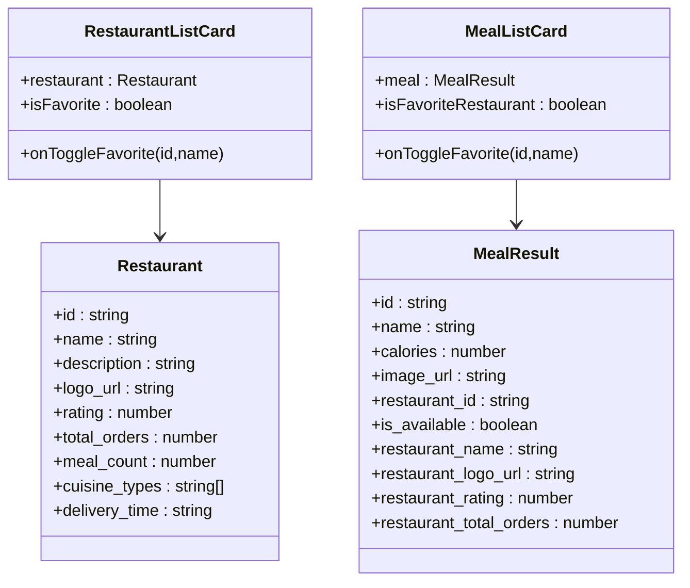
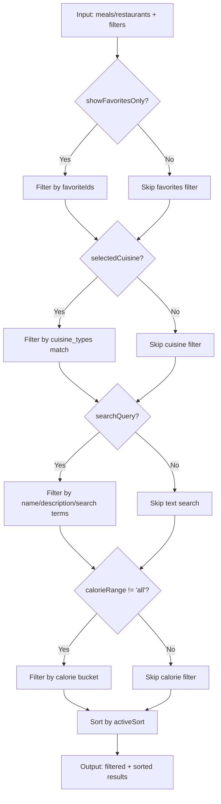
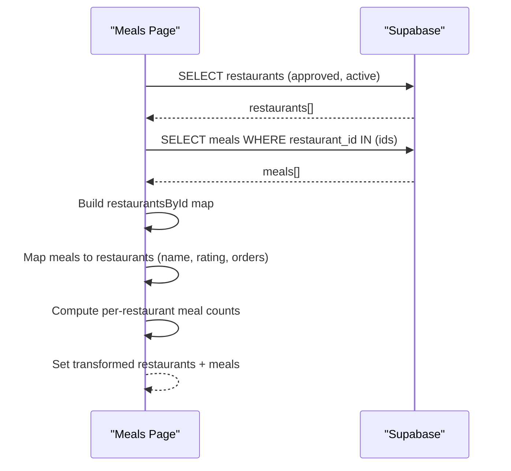
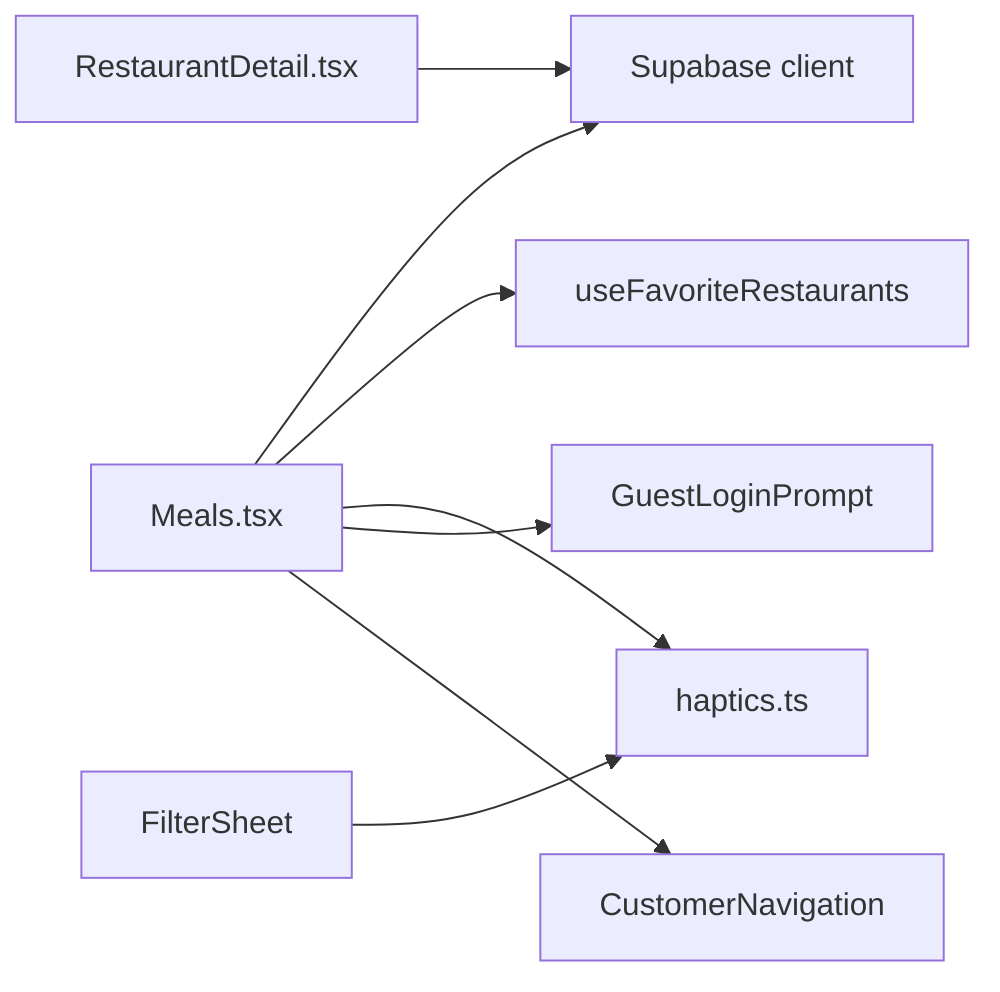

# Meal Browsing & Filtering

<cite>
**Referenced Files in This Document**
- [Meals.tsx](file://src/pages/Meals.tsx)
- [RestaurantDetail.tsx](file://src/pages/RestaurantDetail.tsx)
- [haptics.ts](file://src/lib/haptics.ts)
- [useFavoriteRestaurants.ts](file://src/hooks/useFavoriteRestaurants.ts)
- [GuestLoginPrompt.tsx](file://src/components/GuestLoginPrompt.tsx)
- [CustomerNavigation.tsx](file://src/components/CustomerNavigation.tsx)
- [meals.spec.ts](file://e2e/customer/meals.spec.ts)
</cite>

## Table of Contents
1. [Introduction](#introduction)
2. [Project Structure](#project-structure)
3. [Core Components](#core-components)
4. [Architecture Overview](#architecture-overview)
5. [Detailed Component Analysis](#detailed-component-analysis)
6. [Dependency Analysis](#dependency-analysis)
7. [Performance Considerations](#performance-considerations)
8. [Accessibility Features](#accessibility-features)
9. [Troubleshooting Guide](#troubleshooting-guide)
10. [Conclusion](#conclusion)

## Introduction
This document describes the meal browsing and filtering system, focusing on the restaurant and meal listing interfaces, multi-layered filtering capabilities, and the iOS-style bottom sheet filter. It explains how cuisine chips enable horizontal category selection, how favorites-only mode integrates with user preferences, and how dynamic filtering responds to user selections. The document also covers performance considerations for large datasets and accessibility features for screen readers.

## Project Structure
The meal browsing experience centers around a single-page application built with React and TypeScript. The main implementation resides in the Meals page, which orchestrates data fetching, filtering, sorting, and rendering of both restaurant and meal results. Supporting components include a bottom sheet filter, cuisine chips, skeleton loaders, and navigation elements. End-to-end tests validate basic browsing and filtering flows.

**Diagram sources**
- [Meals.tsx:345-547](file://src/pages/Meals.tsx#L345-L547)
- [Meals.tsx:601-670](file://src/pages/Meals.tsx#L601-L670)
- [Meals.tsx:552-596](file://src/pages/Meals.tsx#L552-L596)
- [Meals.tsx:138-246](file://src/pages/Meals.tsx#L138-L246)
- [Meals.tsx:248-340](file://src/pages/Meals.tsx#L248-L340)
- [Meals.tsx:675-1195](file://src/pages/Meals.tsx#L675-L1195)
- [RestaurantDetail.tsx:178-205](file://src/pages/RestaurantDetail.tsx#L178-L205)
- [useFavoriteRestaurants.ts](file://src/hooks/useFavoriteRestaurants.ts)
- [haptics.ts](file://src/lib/haptics.ts)

**Section sources**
- [Meals.tsx:675-1195](file://src/pages/Meals.tsx#L675-L1195)
- [RestaurantDetail.tsx:178-205](file://src/pages/RestaurantDetail.tsx#L178-L205)

## Core Components
- Meals page: Orchestrates data fetching, transforms restaurant and meal data, applies filters and sorts, renders either restaurant or meal results, and manages the bottom sheet filter.
- FilterSheet: iOS-style bottom sheet providing sort options (rating, fastest, popular), calorie range selection, and favorites-only toggle with haptic feedback.
- CuisineScroller: Horizontal scrollable chip system for cuisine categories with emoji and image representations.
- FilterChip: Quick-filter chips for opening the bottom sheet, sorting by rating/fastest, and toggling favorites-only.
- RestaurantListCard and MealListCard: Grid/list cards displaying restaurant or meal information, including calories, ratings, availability status, and favorite toggles.
- useFavoriteRestaurants: Hook managing favorite restaurants and IDs for filtering.
- haptics.ts: Utility for iOS-style haptic feedback during interactions.
- GuestLoginPrompt: Prompts guest users to sign in when attempting to toggle favorites.

**Section sources**
- [Meals.tsx:345-547](file://src/pages/Meals.tsx#L345-L547)
- [Meals.tsx:601-670](file://src/pages/Meals.tsx#L601-L670)
- [Meals.tsx:552-596](file://src/pages/Meals.tsx#L552-L596)
- [Meals.tsx:138-246](file://src/pages/Meals.tsx#L138-L246)
- [Meals.tsx:248-340](file://src/pages/Meals.tsx#L248-L340)
- [useFavoriteRestaurants.ts](file://src/hooks/useFavoriteRestaurants.ts)
- [haptics.ts](file://src/lib/haptics.ts)
- [GuestLoginPrompt.tsx](file://src/components/GuestLoginPrompt.tsx)

## Architecture Overview
The system follows a reactive pattern:
- Data is fetched from Supabase for restaurants and associated meals.
- Results are transformed and stored in state.
- Filters and sorts are applied via memoized computations.
- Rendering switches between restaurant and meal views depending on active filters.
- The bottom sheet filter updates state and triggers re-computation.

**Diagram sources**
- [Meals.tsx:721-818](file://src/pages/Meals.tsx#L721-L818)
- [Meals.tsx:822-877](file://src/pages/Meals.tsx#L822-L877)
- [Meals.tsx:1161-1179](file://src/pages/Meals.tsx#L1161-L1179)
- [useFavoriteRestaurants.ts](file://src/hooks/useFavoriteRestaurants.ts)
- [haptics.ts](file://src/lib/haptics.ts)

## Detailed Component Analysis

### Bottom Sheet Filter (iOS-style)
The bottom sheet provides:
- Sort options: rating, fastest, popular.
- Calorie range filter: all, under 300, 300–500, 500–700, over 700.
- Favorites-only toggle with animated switch.
- Haptic feedback on interactions.
- iOS-style drag-to-dismiss and backdrop click-to-close.

**Diagram sources**
- [Meals.tsx:345-547](file://src/pages/Meals.tsx#L345-L547)
- [Meals.tsx:1161-1179](file://src/pages/Meals.tsx#L1161-L1179)

**Section sources**
- [Meals.tsx:345-547](file://src/pages/Meals.tsx#L345-L547)
- [Meals.tsx:1161-1179](file://src/pages/Meals.tsx#L1161-L1179)

### Cuisine Chip System (Horizontal Scrolling)
The cuisine scroller offers:
- A central "All" chip to reset cuisine filter.
- Category chips with emojis and images.
- Active state indication and smooth tap animations.
- Translation keys for localized cuisine names.

**Diagram sources**
- [Meals.tsx:601-670](file://src/pages/Meals.tsx#L601-L670)
- [Meals.tsx:552-596](file://src/pages/Meals.tsx#L552-L596)

**Section sources**
- [Meals.tsx:601-670](file://src/pages/Meals.tsx#L601-L670)
- [Meals.tsx:552-596](file://src/pages/Meals.tsx#L552-L596)

### Meal Cards and Restaurant Cards
- Restaurant cards display name, description, cuisine types, rating badge, delivery time, and meal count. They include a favorite toggle with haptic feedback.
- Meal cards display name, restaurant name, availability status, calories, and rating. They also include a favorite toggle bound to the parent restaurant.

**Diagram sources**
- [Meals.tsx:54-90](file://src/pages/Meals.tsx#L54-L90)
- [Meals.tsx:138-246](file://src/pages/Meals.tsx#L138-L246)
- [Meals.tsx:248-340](file://src/pages/Meals.tsx#L248-L340)

**Section sources**
- [Meals.tsx:54-90](file://src/pages/Meals.tsx#L54-L90)
- [Meals.tsx:138-246](file://src/pages/Meals.tsx#L138-L246)
- [Meals.tsx:248-340](file://src/pages/Meals.tsx#L248-L340)

### Filtering and Sorting Logic
The filtering pipeline applies:
- Favorites-only mode using favorite restaurant IDs.
- Cuisine filter by matching restaurant cuisine types.
- Text search across meal/restaurant names and restaurant descriptions.
- Calorie range filter with discrete buckets.
- Sorting by rating, fastest (ascending calories), or popularity (orders).

**Diagram sources**
- [Meals.tsx:822-877](file://src/pages/Meals.tsx#L822-L877)
- [Meals.tsx:879-920](file://src/pages/Meals.tsx#L879-L920)

**Section sources**
- [Meals.tsx:822-877](file://src/pages/Meals.tsx#L822-L877)
- [Meals.tsx:879-920](file://src/pages/Meals.tsx#L879-L920)

### Integration Between Restaurant and Meal Data
- Restaurant data is fetched with approval and activity status filters.
- Associated meals are queried using restaurant IDs.
- A map is constructed to join restaurant metadata with meals.
- Restaurant-level delivery time is generated dynamically for display.

**Diagram sources**
- [Meals.tsx:721-818](file://src/pages/Meals.tsx#L721-L818)
- [Meals.tsx:777-806](file://src/pages/Meals.tsx#L777-L806)

**Section sources**
- [Meals.tsx:721-818](file://src/pages/Meals.tsx#L721-L818)
- [Meals.tsx:777-806](file://src/pages/Meals.tsx#L777-L806)

### Dynamic Filtering Based on User Preferences
- Favorites-only mode toggles via quick filter chip and bottom sheet.
- Cuisine selection affects both restaurant and meal views.
- Calorie range filter is exclusive to the meal view.
- Sort preference persists across filter changes.

**Section sources**
- [Meals.tsx:682-700](file://src/pages/Meals.tsx#L682-L700)
- [Meals.tsx:822-877](file://src/pages/Meals.tsx#L822-L877)
- [Meals.tsx:879-920](file://src/pages/Meals.tsx#L879-L920)

### Examples of Filter Combinations
- Favorites-only + Top-rated: Show only favorite restaurants, sorted by rating.
- Cuisine: Mediterranean + Fastest: Show restaurants offering Mediterranean food, sorted by estimated delivery time.
- Calories: Under 300 + Popular: Show meals under 300 calories, sorted by popularity.
- Clear all filters: Reset search, cuisine, favorites, and sorting to defaults.

**Section sources**
- [Meals.tsx:922-932](file://src/pages/Meals.tsx#L922-L932)
- [Meals.tsx:1161-1179](file://src/pages/Meals.tsx#L1161-L1179)

## Dependency Analysis
- Meals depends on:
  - Supabase for data fetching.
  - useFavoriteRestaurants for favorites state.
  - Haptics for tactile feedback.
  - GuestLoginPrompt for authentication gating.
  - CustomerNavigation for app shell.
- FilterSheet depends on:
  - Haptics for feedback.
  - Memoized recomputation of results.
- RestaurantDetail integrates similar filtering concepts for meals within a restaurant context.

**Diagram sources**
- [Meals.tsx:19-26](file://src/pages/Meals.tsx#L19-L26)
- [Meals.tsx:675-1195](file://src/pages/Meals.tsx#L675-L1195)
- [RestaurantDetail.tsx:178-205](file://src/pages/RestaurantDetail.tsx#L178-L205)

**Section sources**
- [Meals.tsx:19-26](file://src/pages/Meals.tsx#L19-L26)
- [RestaurantDetail.tsx:178-205](file://src/pages/RestaurantDetail.tsx#L178-L205)

## Performance Considerations
- Memoization: Filtering and sorting are computed via useMemo to avoid unnecessary recalculations when dependencies are unchanged.
- Conditional queries: Cuisine and favorites filters are applied in the UI layer after fetching base data, reducing database complexity.
- Skeleton loading: Native iOS-style skeletons improve perceived performance during initial load.
- Rendering strategy: Switching between restaurant and meal lists based on active filters avoids rendering irrelevant data.
- Large datasets: For very large datasets, consider pagination or virtualized lists to reduce DOM nodes and reflows.

[No sources needed since this section provides general guidance]

## Accessibility Features
- Screen reader support:
  - Descriptive alt texts for images (restaurant and meal logos).
  - Semantic headings and labels for filters and chips.
  - Clear focus states and keyboard navigability for interactive elements.
- Content labeling:
  - Availability status messages for meals clarify item state.
  - Result counts and empty states provide context for current filters.
- Interaction feedback:
  - Haptics enhance touch feedback for mobile users.
  - Motion animations use easing appropriate for accessibility guidelines.

[No sources needed since this section provides general guidance]

## Troubleshooting Guide
- No results found:
  - Clear active filters to restore baseline results.
  - Verify network connectivity and Supabase service status.
- Favorites toggle not working:
  - Ensure user is authenticated; GuestLoginPrompt will appear to guide sign-in.
  - Confirm useFavoriteRestaurants hook is initialized and favoriteIds are populated.
- Bottom sheet not responding:
  - Check haptics integration and ensure device supports haptic feedback.
  - Verify FilterSheet props are passed correctly from Meals page.
- Performance issues:
  - Monitor filteredMeals and filteredRestaurants sizes; consider adding pagination or debounced search.

**Section sources**
- [Meals.tsx:708-719](file://src/pages/Meals.tsx#L708-L719)
- [Meals.tsx:1182-1189](file://src/pages/Meals.tsx#L1182-L1189)
- [GuestLoginPrompt.tsx](file://src/components/GuestLoginPrompt.tsx)
- [haptics.ts](file://src/lib/haptics.ts)

## Conclusion
The meal browsing and filtering system combines an intuitive iOS-style bottom sheet, horizontal cuisine chips, and robust filtering/sorting logic to deliver a responsive and accessible experience. By leveraging memoization, conditional queries, and clear affordances, it scales effectively for large datasets while maintaining a native-feeling interface.