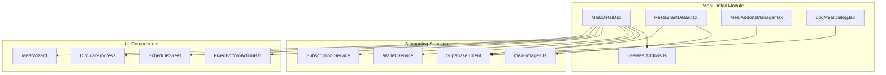
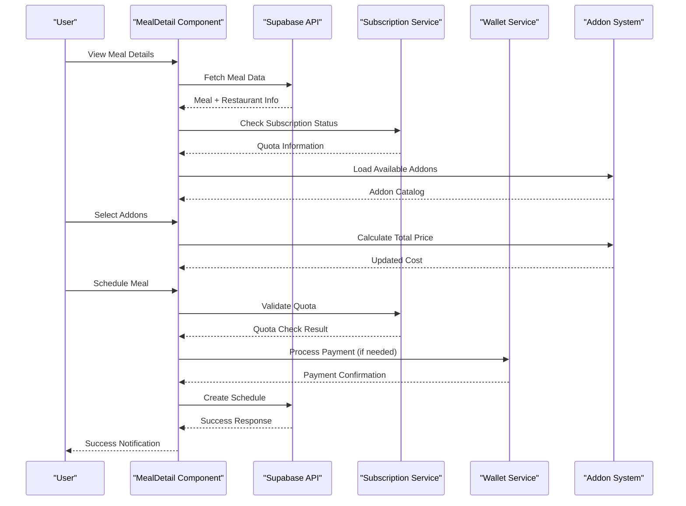
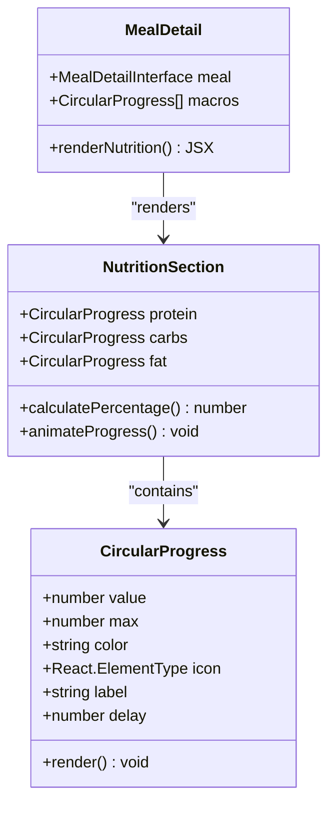
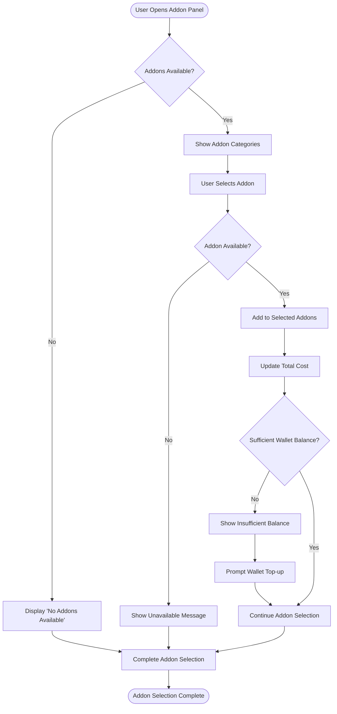
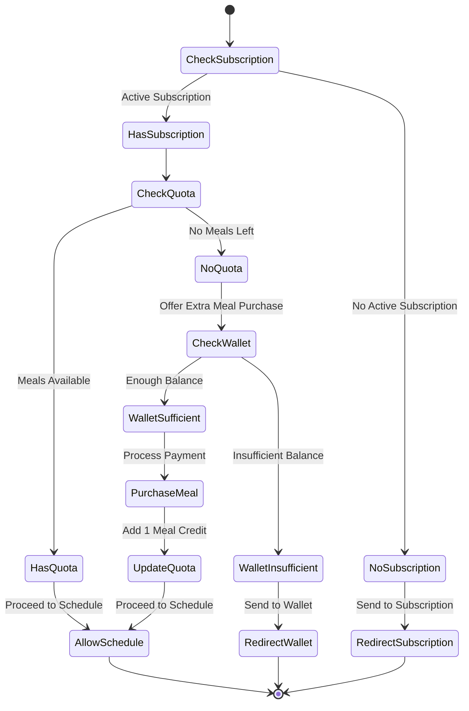
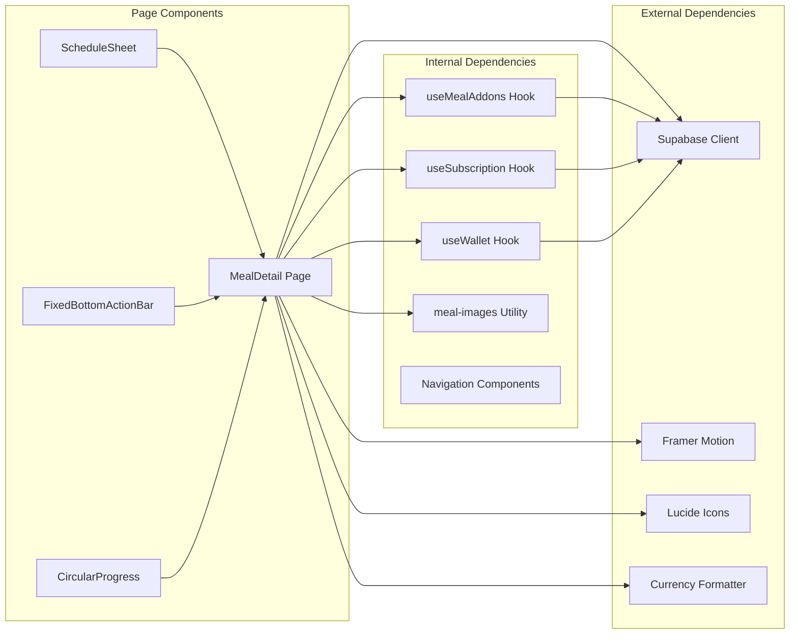

# Meal Detail Page

<cite>
**Referenced Files in This Document**
- [MealDetail.tsx](file://src/pages/MealDetail.tsx)
- [RestaurantDetail.tsx](file://src/pages/RestaurantDetail.tsx)
- [useMealAddons.ts](file://src/hooks/useMealAddons.ts)
- [MealAddonsManager.tsx](file://src/components/MealAddonsManager.tsx)
- [LogMealDialog.tsx](file://src/components/LogMealDialog.tsx)
- [meal-images.ts](file://src/lib/meal-images.ts)
- [MealDetail-Redesign-Plan.md](file://docs/plans/MealDetail-Redesign-Plan.md)
</cite>

## Table of Contents
1. [Introduction](#introduction)
2. [Project Structure](#project-structure)
3. [Core Components](#core-components)
4. [Architecture Overview](#architecture-overview)
5. [Detailed Component Analysis](#detailed-component-analysis)
6. [Dependency Analysis](#dependency-analysis)
7. [Performance Considerations](#performance-considerations)
8. [Troubleshooting Guide](#troubleshooting-guide)
9. [Conclusion](#conclusion)

## Introduction

The Meal Detail Page is a comprehensive feature that displays detailed information about individual meals, enabling users to explore nutritional content, ingredients, restaurant details, and pricing information. It integrates advanced functionality including an addon selection system, subscription quota management, real-time availability checking, and seamless cart/schedule integration.

This page serves as the central hub for meal discovery and ordering, combining rich visual presentation with sophisticated backend integration to provide users with complete meal information and streamlined ordering capabilities.

## Project Structure

The meal detail functionality is implemented through a modular architecture that separates concerns between data fetching, UI presentation, and business logic:



**Diagram sources**
- [MealDetail.tsx:781-1627](file://src/pages/MealDetail.tsx#L781-L1627)
- [RestaurantDetail.tsx:77-885](file://src/pages/RestaurantDetail.tsx#L77-L885)
- [useMealAddons.ts:1-117](file://src/hooks/useMealAddons.ts#L1-L117)

**Section sources**
- [MealDetail.tsx:781-1627](file://src/pages/MealDetail.tsx#L781-L1627)
- [RestaurantDetail.tsx:77-885](file://src/pages/RestaurantDetail.tsx#L77-L885)

## Core Components

### MealDetail Page Component

The primary meal detail page implements a sophisticated single-page application with dynamic content loading and interactive elements:

**Key Features:**
- **Dynamic Content Loading**: Fetches meal data with restaurant information and transforms it into a unified structure
- **Interactive Navigation**: Smooth animations with scroll-based header effects and floating action buttons
- **Subscription Integration**: Real-time quota checking and meal credit management
- **Addon Management**: Optional add-on selection with quantity management and price calculation
- **Wallet Integration**: Seamless payment processing for premium add-ons and extra meal credits

**Data Structure Implementation:**
```typescript
interface MealDetail {
  id: string;
  name: string;
  description: string | null;
  image_url: string | null;
  calories: number;
  protein_g: number;
  carbs_g: number;
  fat_g: number;
  fiber_g: number | null;
  rating: number;
  prep_time_minutes: number;
  is_vip_exclusive: boolean;
  price: number | null;
  restaurant: {
    id: string;
    name: string;
    address: string | null;
    logo_url: string | null;
  };
  diet_tags?: string[];
  ingredients?: string[] | string | null;
}
```

**Section sources**
- [MealDetail.tsx:59-81](file://src/pages/MealDetail.tsx#L59-L81)
- [MealDetail.tsx:849-900](file://src/pages/MealDetail.tsx#L849-L900)

### Addon Management System

The addon system provides flexible customization options with comprehensive management capabilities:

**Addon Categories:**
- Premium Ingredients (extra protein, avocado, etc.)
- Sides (rice, salad, fries)
- Extras (cheese, sauce)
- Drinks (soft drinks, water, juice)

**Management Features:**
- Real-time price calculation
- Quantity management per addon
- Category-based organization
- Availability checking
- Usage tracking

**Section sources**
- [useMealAddons.ts:1-117](file://src/hooks/useMealAddons.ts#L1-L117)
- [MealAddonsManager.tsx:48-539](file://src/components/MealAddonsManager.tsx#L48-L539)

### Restaurant Information Panel

The restaurant information section provides comprehensive details about the meal provider:

**Information Display:**
- Restaurant logo and name
- Rating and review statistics
- Cuisine type and specialty
- Contact information (address, phone)
- Opening hours and delivery status
- Subscription availability indicators

**Section sources**
- [RestaurantDetail.tsx:43-75](file://src/pages/RestaurantDetail.tsx#L43-L75)
- [RestaurantDetail.tsx:144-205](file://src/pages/RestaurantDetail.tsx#L144-L205)

## Architecture Overview

The meal detail page follows a reactive architecture pattern with clear separation of concerns:



**Diagram sources**
- [MealDetail.tsx:902-1132](file://src/pages/MealDetail.tsx#L902-L1132)
- [useMealAddons.ts:19-45](file://src/hooks/useMealAddons.ts#L19-L45)

## Detailed Component Analysis

### Nutritional Information Display

The nutritional information system implements an interactive circular progress visualization:



**Diagram sources**
- [MealDetail.tsx:120-179](file://src/pages/MealDetail.tsx#L120-L179)
- [MealDetail.tsx:1325-1364](file://src/pages/MealDetail.tsx#L1325-L1364)

**Nutritional Data Presentation:**
- Protein: Red circular indicator with beef icon
- Carbohydrates: Orange circular indicator with wheat icon  
- Fat: Teal circular indicator with droplet icon
- Dynamic scaling based on macro targets
- Animated progress visualization

**Section sources**
- [MealDetail.tsx:1337-1363](file://src/pages/MealDetail.tsx#L1337-L1363)

### Addon Selection Workflow

The addon selection system provides a comprehensive customization experience:



**Diagram sources**
- [useMealAddons.ts:47-91](file://src/hooks/useMealAddons.ts#L47-L91)
- [MealDetail.tsx:1050-1084](file://src/pages/MealDetail.tsx#L1050-L1084)

**Addon Management Features:**
- Category-based organization (premium ingredients, sides, extras, drinks)
- Real-time price calculation with cumulative totals
- Quantity management per addon type
- Visual feedback for selected vs. available addons
- Usage tracking and popularity indicators

**Section sources**
- [MealAddonsManager.tsx:82-100](file://src/components/MealAddonsManager.tsx#L82-L100)
- [useMealAddons.ts:97-103](file://src/hooks/useMealAddons.ts#L97-L103)

### Subscription Integration and Quota Management

The subscription system provides seamless integration with meal scheduling:



**Diagram sources**
- [MealDetail.tsx:913-988](file://src/pages/MealDetail.tsx#L913-L988)
- [MealDetail.tsx:990-1032](file://src/pages/MealDetail.tsx#L990-L1032)

**Quota Management Features:**
- Real-time meal quota checking
- Unlimited subscription support
- Extra meal credit purchase functionality
- Wallet integration for premium add-ons
- Automatic quota deduction during scheduling

**Section sources**
- [MealDetail.tsx:788-796](file://src/pages/MealDetail.tsx#L788-L796)
- [MealDetail.tsx:1034-1132](file://src/pages/MealDetail.tsx#L1034-L1132)

### Restaurant Information Integration

The restaurant information panel provides comprehensive details about meal providers:

**Restaurant Data Structure:**
```typescript
interface Restaurant {
  id: string;
  name: string;
  description: string | null;
  logo_url: string | null;
  cover_url: string | null;
  address: string | null;
  phone: string | null;
  email: string | null;
  rating: number;
  total_orders: number;
  cuisine_type: string | null;
  opening_hours: string | null;
  delivery_time?: string;
  delivery_fee?: number;
}
```

**Information Display Components:**
- Hero image with parallax scrolling effects
- Contact information with expandable sections
- Rating and review statistics
- Subscription availability indicators
- Quick add functionality for subscribed users

**Section sources**
- [RestaurantDetail.tsx:43-58](file://src/pages/RestaurantDetail.tsx#L43-L58)
- [RestaurantDetail.tsx:144-205](file://src/pages/RestaurantDetail.tsx#L144-L205)

## Dependency Analysis

The meal detail page has well-defined dependencies that support its functionality:



**Diagram sources**
- [MealDetail.tsx:1-57](file://src/pages/MealDetail.tsx#L1-L57)
- [useMealAddons.ts:1-3](file://src/hooks/useMealAddons.ts#L1-L3)

**Key Dependencies:**
- **Supabase Integration**: Real-time data fetching and updates
- **Framer Motion**: Smooth animations and transitions
- **Lucide Icons**: Consistent iconography across components
- **Custom Hooks**: Reusable business logic abstractions

**Section sources**
- [MealDetail.tsx:1-57](file://src/pages/MealDetail.tsx#L1-L57)
- [useMealAddons.ts:1-3](file://src/hooks/useMealAddons.ts#L1-L3)

## Performance Considerations

The meal detail page implements several performance optimization strategies:

**Optimization Techniques:**
- **Lazy Loading**: Images and components load progressively
- **Memoization**: Expensive computations cached with React.memo
- **Virtual Scrolling**: Large lists rendered efficiently
- **Code Splitting**: Route-based lazy loading
- **Image Optimization**: Responsive image loading with fallbacks

**Performance Monitoring:**
- **Loading States**: Skeleton loaders during data fetch
- **Error Boundaries**: Graceful degradation on failures
- **Network Optimization**: Efficient API calls with caching
- **Memory Management**: Proper cleanup of event listeners

## Troubleshooting Guide

Common issues and their solutions:

**Data Loading Issues:**
- Verify Supabase connection and authentication
- Check network connectivity and API response times
- Implement proper error handling for failed requests

**Addon Selection Problems:**
- Ensure addon categories are properly configured
- Verify price calculations and totals
- Check wallet balance integration

**Subscription Integration Errors:**
- Validate subscription status and quota calculations
- Check payment processing and wallet debits
- Monitor quota deduction and renewal cycles

**Section sources**
- [MealDetail.tsx:890-900](file://src/pages/MealDetail.tsx#L890-L900)
- [useMealAddons.ts:35-42](file://src/hooks/useMealAddons.ts#L35-L42)

## Conclusion

The Meal Detail Page represents a sophisticated implementation of modern meal ordering functionality, combining rich visual presentation with robust backend integration. Its modular architecture supports scalability and maintainability while providing users with an intuitive and comprehensive meal exploration experience.

The system successfully integrates multiple complex features including nutritional visualization, addon management, subscription quotas, and real-time payment processing, all while maintaining excellent performance and user experience standards. The comprehensive design ensures both technical excellence and practical usability for end users.