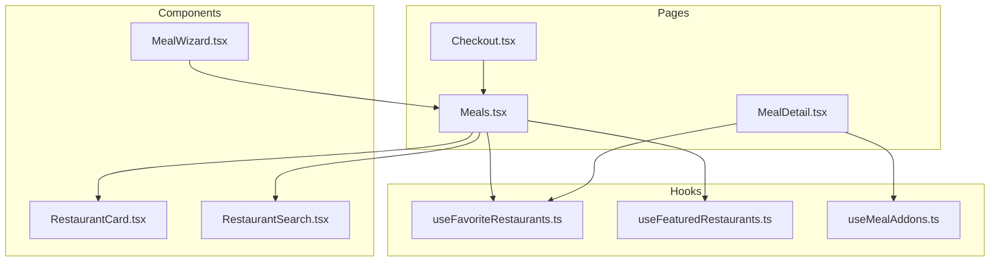
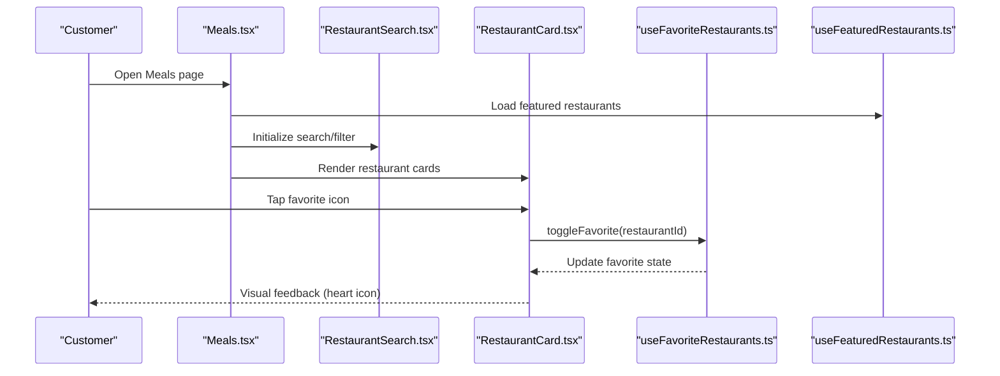
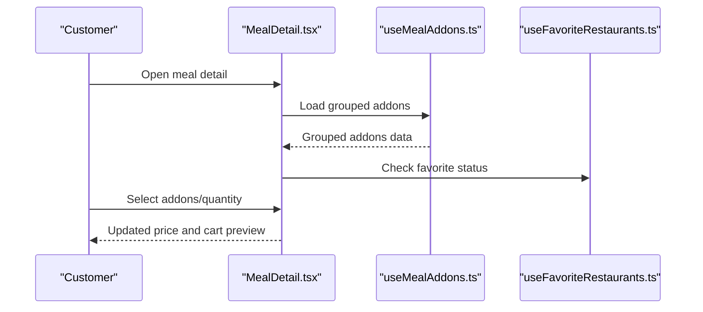
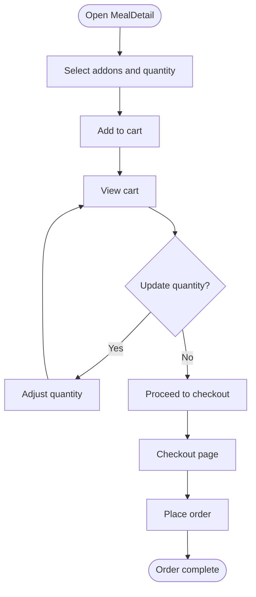
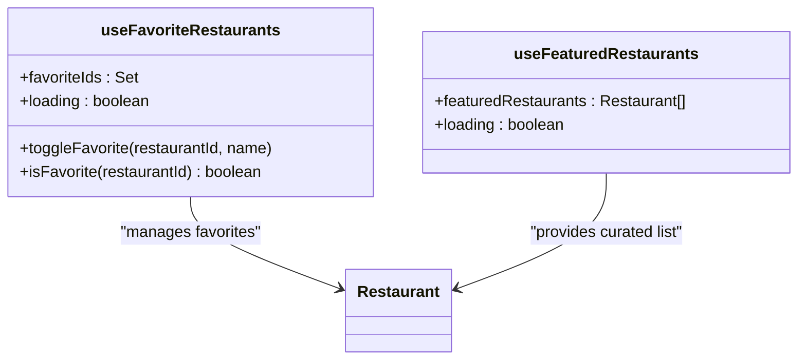
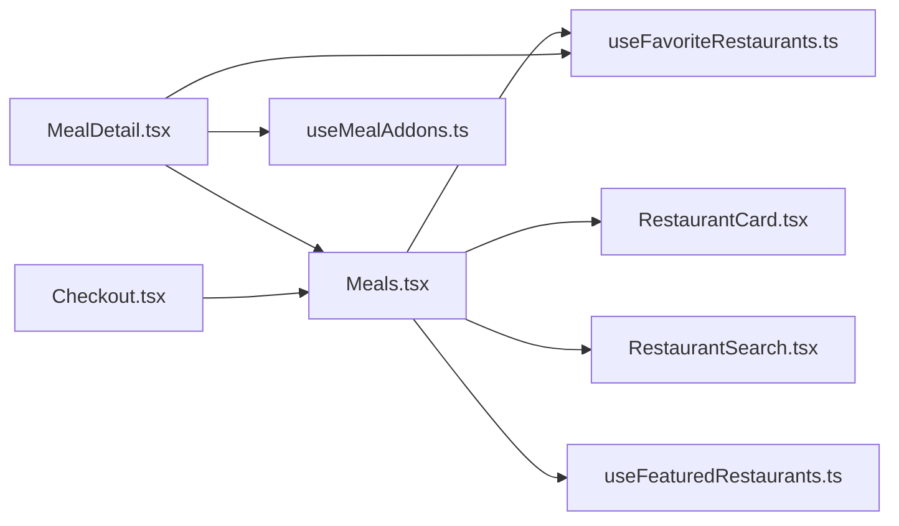

# Meal Discovery & Ordering

<cite>
**Referenced Files in This Document**
- [Meals.tsx](file://src/pages/Meals.tsx)
- [MealDetail.tsx](file://src/pages/MealDetail.tsx)
- [RestaurantCard.tsx](file://src/components/RestaurantCard.tsx)
- [RestaurantSearch.tsx](file://src/components/RestaurantSearch.tsx)
- [useFavoriteRestaurants.ts](file://src/hooks/useFavoriteRestaurants.ts)
- [useFeaturedRestaurants.ts](file://src/hooks/useFeaturedRestaurants.ts)
- [useMealAddons.ts](file://src/hooks/useMealAddons.ts)
- [MealWizard.tsx](file://src/components/MealWizard.tsx)
- [Checkout.tsx](file://src/pages/Checkout.tsx)
- [Meals.spec.ts](file://e2e/customer/meals.spec.ts)
- [checkout.spec.ts](file://e2e/customer/checkout.spec.ts)
</cite>

## Table of Contents
1. [Introduction](#introduction)
2. [Project Structure](#project-structure)
3. [Core Components](#core-components)
4. [Architecture Overview](#architecture-overview)
5. [Detailed Component Analysis](#detailed-component-analysis)
6. [Dependency Analysis](#dependency-analysis)
7. [Performance Considerations](#performance-considerations)
8. [Troubleshooting Guide](#troubleshooting-guide)
9. [Conclusion](#conclusion)
10. [Appendices](#appendices)

## Introduction
This document describes the meal discovery and ordering system in the customer portal. It covers browsing restaurants and meals, filtering by dietary preferences and cuisine types, viewing meal details with nutritional information and addons, managing favorites and featured restaurants, using the meal wizard, and integrating with the checkout process. It also provides common user workflows and implementation patterns for extending filtering and ordering capabilities.

## Project Structure
The meal discovery and ordering experience spans several frontend pages and components:
- Pages: Meals, MealDetail, Checkout
- Components: RestaurantCard, RestaurantSearch, MealWizard
- Hooks: useFavoriteRestaurants, useFeaturedRestaurants, useMealAddons
- E2E tests: customer/meals.spec.ts, customer/checkout.spec.ts

**Diagram sources**
- [Meals.tsx](file://src/pages/Meals.tsx)
- [MealDetail.tsx](file://src/pages/MealDetail.tsx)
- [RestaurantCard.tsx](file://src/components/RestaurantCard.tsx)
- [RestaurantSearch.tsx](file://src/components/RestaurantSearch.tsx)
- [useFavoriteRestaurants.ts](file://src/hooks/useFavoriteRestaurants.ts)
- [useFeaturedRestaurants.ts](file://src/hooks/useFeaturedRestaurants.ts)
- [useMealAddons.ts](file://src/hooks/useMealAddons.ts)
- [MealWizard.tsx](file://src/components/MealWizard.tsx)
- [Checkout.tsx](file://src/pages/Checkout.tsx)

**Section sources**
- [Meals.tsx](file://src/pages/Meals.tsx)
- [MealDetail.tsx](file://src/pages/MealDetail.tsx)
- [RestaurantCard.tsx](file://src/components/RestaurantCard.tsx)
- [RestaurantSearch.tsx](file://src/components/RestaurantSearch.tsx)
- [useFavoriteRestaurants.ts](file://src/hooks/useFavoriteRestaurants.ts)
- [useFeaturedRestaurants.ts](file://src/hooks/useFeaturedRestaurants.ts)
- [useMealAddons.ts](file://src/hooks/useMealAddons.ts)
- [MealWizard.tsx](file://src/components/MealWizard.tsx)
- [Checkout.tsx](file://src/pages/Checkout.tsx)

## Core Components
- Meals browsing and filtering: The Meals page lists restaurants and meals, supports search and filtering, and integrates favorites and featured restaurants.
- Meal detail and addons: The MealDetail page displays nutritional information, pricing, addons selection, and restaurant details.
- Favorites and featured: The useFavoriteRestaurants hook manages user favorites; useFeaturedRestaurants provides curated selections.
- Meal wizard: The MealWizard assists users in guided meal selection.
- Checkout integration: The Checkout page integrates with the ordering pipeline.

**Section sources**
- [Meals.tsx](file://src/pages/Meals.tsx)
- [MealDetail.tsx](file://src/pages/MealDetail.tsx)
- [useFavoriteRestaurants.ts](file://src/hooks/useFavoriteRestaurants.ts)
- [useFeaturedRestaurants.ts](file://src/hooks/useFeaturedRestaurants.ts)
- [useMealAddons.ts](file://src/hooks/useMealAddons.ts)
- [MealWizard.tsx](file://src/components/MealWizard.tsx)
- [Checkout.tsx](file://src/pages/Checkout.tsx)

## Architecture Overview
The system follows a component-driven architecture with data fetching via Supabase and state managed through React hooks. Filtering and search are handled client-side with debounced queries, while favorites and featured lists are persisted in the database.

**Diagram sources**
- [Meals.tsx](file://src/pages/Meals.tsx)
- [RestaurantSearch.tsx](file://src/components/RestaurantSearch.tsx)
- [RestaurantCard.tsx](file://src/components/RestaurantCard.tsx)
- [useFavoriteRestaurants.ts](file://src/hooks/useFavoriteRestaurants.ts)
- [useFeaturedRestaurants.ts](file://src/hooks/useFeaturedRestaurants.ts)

## Detailed Component Analysis

### Meals Page (Restaurant and Meal Browsing)
- Purpose: Display restaurants and meals, enable search and filtering, show favorites and featured items.
- Key features:
  - Restaurant grid/list rendering
  - Search input with debounced query
  - Dietary preference and cuisine type filters
  - Featured restaurant highlights
  - Favorite toggling per restaurant
- Data sources: Supabase tables for restaurants, meals, and user favorites.
- UX patterns: Infinite scroll or pagination, skeleton loaders during fetch, and empty states.

Implementation patterns:
- Debounce search input to reduce network calls.
- Combine filters (dietary tags, cuisine types) and apply to restaurant/meals queries.
- Maintain a favorites Set for optimistic UI updates.

**Section sources**
- [Meals.tsx](file://src/pages/Meals.tsx)
- [RestaurantSearch.tsx](file://src/components/RestaurantSearch.tsx)
- [RestaurantCard.tsx](file://src/components/RestaurantCard.tsx)
- [useFavoriteRestaurants.ts](file://src/hooks/useFavoriteRestaurants.ts)
- [useFeaturedRestaurants.ts](file://src/hooks/useFeaturedRestaurants.ts)

### Meal Detail Page (Nutrition, Pricing, Addons, Restaurant Info)
- Purpose: Present comprehensive meal information and enable ordering actions.
- Key features:
  - Nutritional breakdown (calories, protein, macros)
  - Pricing and quantity selection
  - Addons grouping and selection
  - Restaurant information and ratings
  - Favorite toggle
- Data sources: Meals and restaurants tables; addons resolved via useMealAddons hook.
- UX patterns: Collapsible addon groups, visual indicators for selected addons, and clear pricing summary.

**Diagram sources**
- [MealDetail.tsx](file://src/pages/MealDetail.tsx)
- [useMealAddons.ts](file://src/hooks/useMealAddons.ts)
- [useFavoriteRestaurants.ts](file://src/hooks/useFavoriteRestaurants.ts)

**Section sources**
- [MealDetail.tsx](file://src/pages/MealDetail.tsx)
- [useMealAddons.ts](file://src/hooks/useMealAddons.ts)
- [useFavoriteRestaurants.ts](file://src/hooks/useFavoriteRestaurants.ts)

### Cart Functionality and Checkout Integration
- Purpose: Manage selected items, quantities, addons, and proceed to checkout.
- Key features:
  - Add to cart with addons and quantity
  - Update/remove items
  - Real-time price recalculation
  - Seamless navigation to Checkout
- Integration points:
  - Cart state maintained in the customer session
  - Checkout validates availability and applies promotions

**Diagram sources**
- [MealDetail.tsx](file://src/pages/MealDetail.tsx)
- [Checkout.tsx](file://src/pages/Checkout.tsx)

**Section sources**
- [MealDetail.tsx](file://src/pages/MealDetail.tsx)
- [Checkout.tsx](file://src/pages/Checkout.tsx)

### Favorite Restaurants System and Featured Restaurants
- Favorite restaurants:
  - Optimistic toggle updates UI immediately
  - Persists to user_favorite_restaurants table
  - Provides quick access from Favorites page
- Featured restaurants:
  - Curated list displayed prominently on the Meals page
  - Enhances discoverability and drive conversions

**Diagram sources**
- [useFavoriteRestaurants.ts](file://src/hooks/useFavoriteRestaurants.ts)
- [useFeaturedRestaurants.ts](file://src/hooks/useFeaturedRestaurants.ts)

**Section sources**
- [useFavoriteRestaurants.ts](file://src/hooks/useFavoriteRestaurants.ts)
- [useFeaturedRestaurants.ts](file://src/hooks/useFeaturedRestaurants.ts)

### Search Functionality
- RestaurantSearch component integrates with the Meals page to filter restaurants and meals by name, cuisine, and tags.
- Debounced input reduces redundant queries and improves responsiveness.

**Section sources**
- [RestaurantSearch.tsx](file://src/components/RestaurantSearch.tsx)
- [Meals.tsx](file://src/pages/Meals.tsx)

### Meal Wizard for Guided Selection
- MealWizard assists users in selecting meals by guiding through preferences and constraints.
- Integrates with filtering and search to present relevant options.

**Section sources**
- [MealWizard.tsx](file://src/components/MealWizard.tsx)
- [Meals.tsx](file://src/pages/Meals.tsx)

## Dependency Analysis
- Meals depends on RestaurantCard, RestaurantSearch, useFeaturedRestaurants, and useFavoriteRestaurants.
- MealDetail depends on useMealAddons and useFavoriteRestaurants.
- Checkout depends on cart state and order placement APIs.

**Diagram sources**
- [Meals.tsx](file://src/pages/Meals.tsx)
- [MealDetail.tsx](file://src/pages/MealDetail.tsx)
- [RestaurantCard.tsx](file://src/components/RestaurantCard.tsx)
- [RestaurantSearch.tsx](file://src/components/RestaurantSearch.tsx)
- [useFavoriteRestaurants.ts](file://src/hooks/useFavoriteRestaurants.ts)
- [useFeaturedRestaurants.ts](file://src/hooks/useFeaturedRestaurants.ts)
- [useMealAddons.ts](file://src/hooks/useMealAddons.ts)
- [Checkout.tsx](file://src/pages/Checkout.tsx)

**Section sources**
- [Meals.tsx](file://src/pages/Meals.tsx)
- [MealDetail.tsx](file://src/pages/MealDetail.tsx)
- [Checkout.tsx](file://src/pages/Checkout.tsx)

## Performance Considerations
- Debounce search and filter inputs to minimize API calls.
- Use skeleton loaders and virtualized lists for large datasets.
- Cache frequently accessed data (e.g., featured restaurants) to reduce latency.
- Optimize images and lazy-load thumbnails.
- Batch database operations (e.g., cleanup_old_top_meals RPC) to keep lists fresh efficiently.

## Troubleshooting Guide
Common issues and resolutions:
- Favorites not updating:
  - Verify user is authenticated before toggling favorites.
  - Confirm optimistic update rollback on error and toast feedback.
- Empty or stale featured restaurants:
  - Ensure useFeaturedRestaurants fetches and caches data.
  - Check for network errors and retry logic.
- Addons not loading:
  - Confirm useMealAddons resolves grouped addons for the selected meal.
  - Validate meal ID and addon categories.
- Checkout failures:
  - Validate cart items and quantities.
  - Confirm availability and pricing before placing order.

**Section sources**
- [useFavoriteRestaurants.ts](file://src/hooks/useFavoriteRestaurants.ts)
- [useFeaturedRestaurants.ts](file://src/hooks/useFeaturedRestaurants.ts)
- [useMealAddons.ts](file://src/hooks/useMealAddons.ts)
- [Meals.spec.ts](file://e2e/customer/meals.spec.ts)
- [checkout.spec.ts](file://e2e/customer/checkout.spec.ts)

## Conclusion
The customer portal’s meal discovery and ordering system combines intuitive browsing, powerful filtering, and seamless checkout. By leveraging hooks for favorites and featured content, and components for search and guided selection, the system delivers a scalable and user-friendly experience. Extending filtering and ordering capabilities follows established patterns: add new filters, integrate with hooks, and maintain optimistic UI updates with robust error handling.

## Appendices

### Common User Workflows
- Discover meals:
  - Open Meals, apply filters (dietary/cuisine), browse featured restaurants, and tap a restaurant or meal.
- View details and customize:
  - Open MealDetail, review nutrition and pricing, select addons and quantity, toggle favorite.
- Order:
  - Add to cart, review cart, proceed to Checkout, and place order.

**Section sources**
- [Meals.tsx](file://src/pages/Meals.tsx)
- [MealDetail.tsx](file://src/pages/MealDetail.tsx)
- [Checkout.tsx](file://src/pages/Checkout.tsx)
- [Meals.spec.ts](file://e2e/customer/meals.spec.ts)
- [checkout.spec.ts](file://e2e/customer/checkout.spec.ts)