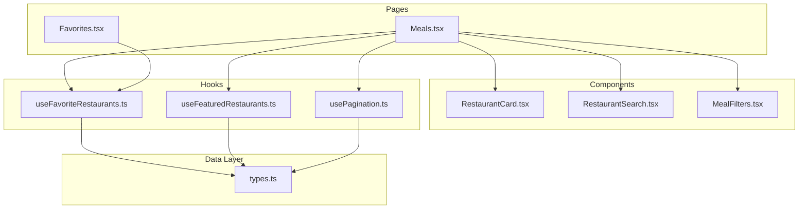
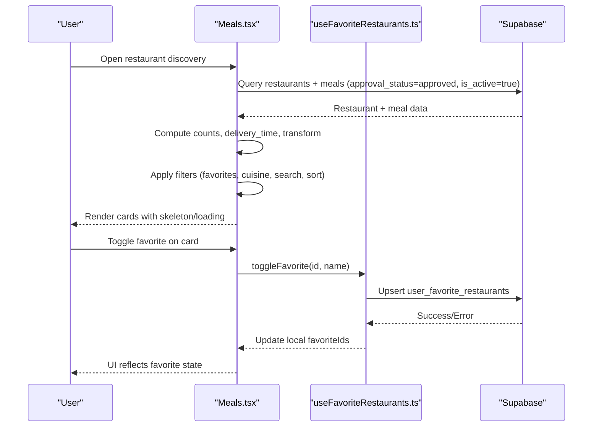
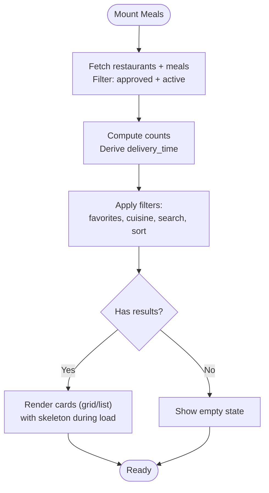
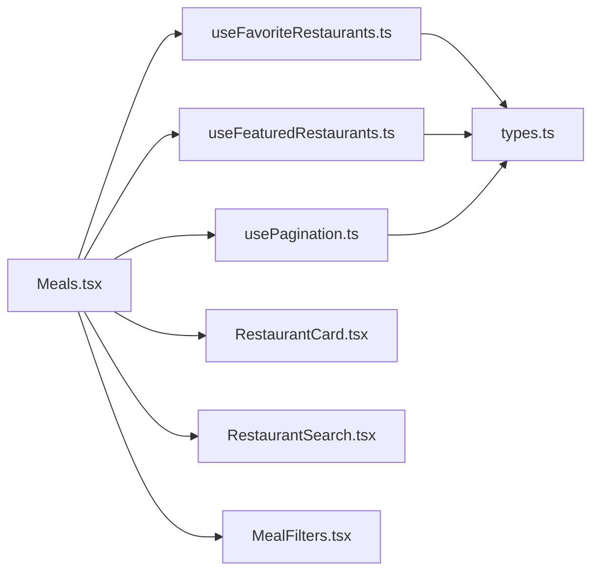

# Restaurant Discovery

<cite>
**Referenced Files in This Document**
- [Meals.tsx](file://src/pages/Meals.tsx)
- [RestaurantCard.tsx](file://src/components/RestaurantCard.tsx)
- [RestaurantSearch.tsx](file://src/components/RestaurantSearch.tsx)
- [useFavoriteRestaurants.ts](file://src/hooks/useFavoriteRestaurants.ts)
- [useFeaturedRestaurants.ts](file://src/hooks/useFeaturedRestaurants.ts)
- [Favorites.tsx](file://src/pages/Favorites.tsx)
- [MealFilters.tsx](file://src/components/MealFilters.tsx)
- [usePagination.ts](file://src/hooks/usePagination.ts)
- [types.ts](file://src/integrations/supabase/types.ts)
</cite>

## Table of Contents
1. [Introduction](#introduction)
2. [Project Structure](#project-structure)
3. [Core Components](#core-components)
4. [Architecture Overview](#architecture-overview)
5. [Detailed Component Analysis](#detailed-component-analysis)
6. [Dependency Analysis](#dependency-analysis)
7. [Performance Considerations](#performance-considerations)
8. [Troubleshooting Guide](#troubleshooting-guide)
9. [Conclusion](#conclusion)

## Introduction
This document describes the restaurant discovery system, focusing on browsing experiences, filtering, favorites, featured restaurants, search integration, and performance optimizations for large datasets. It explains how restaurants are fetched, filtered, sorted, and rendered in grid/list views, and how user preferences (favorites) are persisted and synchronized.

## Project Structure
The restaurant discovery feature spans several UI pages and shared hooks/components:
- Page: Restaurant browsing and filtering
- Components: Cards, search, and filter chips
- Hooks: Favorites management, featured restaurants, pagination
- Types: Supabase-generated types for database contracts

**Diagram sources**
- [Meals.tsx:675-1195](file://src/pages/Meals.tsx#L675-L1195)
- [RestaurantCard.tsx:1-95](file://src/components/RestaurantCard.tsx#L1-L95)
- [RestaurantSearch.tsx:1-159](file://src/components/RestaurantSearch.tsx#L1-L159)
- [MealFilters.tsx:1-236](file://src/components/MealFilters.tsx#L1-L236)
- [useFavoriteRestaurants.ts:1-123](file://src/hooks/useFavoriteRestaurants.ts#L1-L123)
- [useFeaturedRestaurants.ts:1-129](file://src/hooks/useFeaturedRestaurants.ts#L1-L129)
- [usePagination.ts:1-191](file://src/hooks/usePagination.ts#L1-L191)
- [types.ts:1-800](file://src/integrations/supabase/types.ts#L1-L800)

**Section sources**
- [Meals.tsx:675-1195](file://src/pages/Meals.tsx#L675-L1195)
- [RestaurantCard.tsx:1-95](file://src/components/RestaurantCard.tsx#L1-L95)
- [RestaurantSearch.tsx:1-159](file://src/components/RestaurantSearch.tsx#L1-L159)
- [MealFilters.tsx:1-236](file://src/components/MealFilters.tsx#L1-L236)
- [useFavoriteRestaurants.ts:1-123](file://src/hooks/useFavoriteRestaurants.ts#L1-L123)
- [useFeaturedRestaurants.ts:1-129](file://src/hooks/useFeaturedRestaurants.ts#L1-L129)
- [usePagination.ts:1-191](file://src/hooks/usePagination.ts#L1-L191)
- [types.ts:1-800](file://src/integrations/supabase/types.ts#L1-L800)

## Core Components
- Restaurant browsing page with grid/list rendering, search, cuisine filters, sorting, and skeleton loading.
- Restaurant card with favorite toggle, rating, order count, and optional cuisine badges.
- Favorites page consolidating favorite restaurants and top meals.
- Hooks for favorites persistence and featured restaurants retrieval.
- Pagination hook for scalable data loading.

**Section sources**
- [Meals.tsx:675-1195](file://src/pages/Meals.tsx#L675-L1195)
- [RestaurantCard.tsx:1-95](file://src/components/RestaurantCard.tsx#L1-L95)
- [Favorites.tsx:1-379](file://src/pages/Favorites.tsx#L1-L379)
- [useFavoriteRestaurants.ts:1-123](file://src/hooks/useFavoriteRestaurants.ts#L1-L123)
- [useFeaturedRestaurants.ts:1-129](file://src/hooks/useFeaturedRestaurants.ts#L1-L129)
- [usePagination.ts:1-191](file://src/hooks/usePagination.ts#L1-L191)

## Architecture Overview
The restaurant discovery pipeline:
- Fetch restaurants and meals from Supabase.
- Compute derived fields (e.g., delivery time) and counts (meal availability).
- Apply filters and sorts locally (favorites, cuisine, search, calorie ranges, sort criteria).
- Render skeleton placeholders during initial load and empty states.
- Persist favorites via optimistic updates and database transactions.

**Diagram sources**
- [Meals.tsx:721-818](file://src/pages/Meals.tsx#L721-L818)
- [useFavoriteRestaurants.ts:40-110](file://src/hooks/useFavoriteRestaurants.ts#L40-L110)

## Detailed Component Analysis

### Restaurant Browsing Page (Meals)
Responsibilities:
- Fetch restaurants and meals, compute counts and delivery estimates.
- Provide search, cuisine filter chips, quick sort chips, and a bottom sheet filter panel.
- Render skeleton placeholders during load and empty states.
- Support favorites-only mode and sorting by rating, fastest, or popularity.

Key behaviors:
- Fetch restaurants with approval and activity checks.
- Join meals to restaurants and compute per-restaurant meal counts.
- Derive delivery_time for UI presentation.
- Local filtering and sorting for both restaurants and meals.
- Skeleton loading pattern for smooth UX.

**Diagram sources**
- [Meals.tsx:721-818](file://src/pages/Meals.tsx#L721-L818)
- [Meals.tsx:820-920](file://src/pages/Meals.tsx#L820-L920)

**Section sources**
- [Meals.tsx:675-1195](file://src/pages/Meals.tsx#L675-L1195)

### Restaurant Card Component
Responsibilities:
- Display restaurant thumbnail, name, description, rating, order count, and meal count.
- Provide favorite toggle button with visual feedback.
- Navigate to restaurant detail on click.

Implementation highlights:
- Uses interactive card and link to detail route.
- Favorite button respects isFavorite prop and triggers onToggleFavorite.
- Renders fallback emoji when no logo is present.

**Section sources**
- [RestaurantCard.tsx:1-95](file://src/components/RestaurantCard.tsx#L1-L95)

### Restaurant Search Component
Responsibilities:
- Provide inline search with autocomplete dropdown.
- Filter suggestions by name/description and show up to five matches.
- Keyboard navigation (arrow keys, enter, escape) and suggestion click handling.
- Clear input and focus management.

Behavior:
- Suggestions derived from provided restaurant list.
- Dropdown closes on outside clicks.
- Navigates to restaurant detail on selection.

**Section sources**
- [RestaurantSearch.tsx:1-159](file://src/components/RestaurantSearch.tsx#L1-L159)

### Favorites Management Hook
Responsibilities:
- Load user’s favorite restaurant IDs from Supabase.
- Toggle favorites with optimistic UI updates and rollback on error.
- Expose loading state and helper to check favorite status.

Patterns:
- Optimistic update: immediately flip favorite state in memory.
- Transaction: insert/delete from user_favorite_restaurants.
- Toast notifications for success/error.

**Section sources**
- [useFavoriteRestaurants.ts:1-123](file://src/hooks/useFavoriteRestaurants.ts#L1-L123)

### Featured Restaurants Hook
Responsibilities:
- Fetch active featured listings within date bounds.
- Resolve restaurant details and apply approval/activity filters.
- Compute per-restaurant meal counts for display.
- Expose featured restaurants and helper to check featured status.

Data flow:
- Query featured_listings for active, time-qualified records.
- Join restaurants with approval_status=approved and is_active=true.
- Count meals per restaurant where is_available=true.
- Map to FeaturedRestaurant shape for UI consumption.

**Section sources**
- [useFeaturedRestaurants.ts:1-129](file://src/hooks/useFeaturedRestaurants.ts#L1-L129)

### Favorites Page
Responsibilities:
- Display favorite restaurants and top meals in tabs.
- Remove favorites and manage top meals.
- Integrate with useFavoriteRestaurants for real-time updates.

**Section sources**
- [Favorites.tsx:1-379](file://src/pages/Favorites.tsx#L1-L379)

### Cuisine Type Filtering System
Responsibilities:
- Horizontal scroll of cuisine chips with emoji or image-based icons.
- Single-select cuisine filter affecting both restaurants and meals.
- Translation keys for cuisine names.

Implementation:
- Emojis mapped per cuisine type.
- Optional cuisine images for richer visuals.
- Filter applies to both restaurants and meals lists.

**Section sources**
- [Meals.tsx:82-103](file://src/pages/Meals.tsx#L82-L103)
- [Meals.tsx:601-670](file://src/pages/Meals.tsx#L601-L670)

### Meal Filters (Additional)
Responsibilities:
- Bottom sheet with diet tags and nutritional sliders.
- Reset and apply controls.
- Integration surface for advanced meal filtering.

**Section sources**
- [MealFilters.tsx:1-236](file://src/components/MealFilters.tsx#L1-L236)

### Pagination Hook
Responsibilities:
- Offset-based pagination for large datasets.
- Append vs replace modes, refresh, and error handling.
- Generic support for any table with filters and ordering.

**Section sources**
- [usePagination.ts:1-191](file://src/hooks/usePagination.ts#L1-L191)

## Dependency Analysis
- Meals.tsx depends on:
  - Supabase client for restaurant/meals queries.
  - useFavoriteRestaurants for favorite state and mutations.
  - useFeaturedRestaurants for featured data.
  - usePagination for scalable data loading.
  - Local components for rendering and filtering.
- RestaurantCard.tsx depends on:
  - UI primitives and Lucide icons.
  - Callbacks for favorite toggling.
- Favorites.tsx depends on:
  - useFavoriteRestaurants for live updates.
  - Supabase for direct fetch/remove operations.

**Diagram sources**
- [Meals.tsx:675-1195](file://src/pages/Meals.tsx#L675-L1195)
- [RestaurantCard.tsx:1-95](file://src/components/RestaurantCard.tsx#L1-L95)
- [RestaurantSearch.tsx:1-159](file://src/components/RestaurantSearch.tsx#L1-L159)
- [MealFilters.tsx:1-236](file://src/components/MealFilters.tsx#L1-L236)
- [useFavoriteRestaurants.ts:1-123](file://src/hooks/useFavoriteRestaurants.ts#L1-L123)
- [useFeaturedRestaurants.ts:1-129](file://src/hooks/useFeaturedRestaurants.ts#L1-L129)
- [usePagination.ts:1-191](file://src/hooks/usePagination.ts#L1-L191)
- [types.ts:1-800](file://src/integrations/supabase/types.ts#L1-L800)

**Section sources**
- [Meals.tsx:675-1195](file://src/pages/Meals.tsx#L675-L1195)
- [RestaurantCard.tsx:1-95](file://src/components/RestaurantCard.tsx#L1-L95)
- [RestaurantSearch.tsx:1-159](file://src/components/RestaurantSearch.tsx#L1-L159)
- [MealFilters.tsx:1-236](file://src/components/MealFilters.tsx#L1-L236)
- [useFavoriteRestaurants.ts:1-123](file://src/hooks/useFavoriteRestaurants.ts#L1-L123)
- [useFeaturedRestaurants.ts:1-129](file://src/hooks/useFeaturedRestaurants.ts#L1-L129)
- [usePagination.ts:1-191](file://src/hooks/usePagination.ts#L1-L191)
- [types.ts:1-800](file://src/integrations/supabase/types.ts#L1-L800)

## Performance Considerations
- Local filtering and sorting:
  - Apply filters and sorts via useMemo to avoid unnecessary re-renders.
  - Separate computations for restaurants and meals to keep lists responsive.
- Skeleton loading:
  - Use RestaurantCardSkeleton during initial fetch to reduce perceived latency.
  - Empty states with animations improve perceived responsiveness.
- Data shaping:
  - Precompute counts (meal_count, delivery_time) after fetch to minimize render-time work.
- Pagination:
  - Use offset-based pagination for large datasets with loadMore/refresh patterns.
- Network efficiency:
  - Fetch restaurants and meals in two steps (join and count) to limit payload sizes.
  - Filter at the database level where possible (e.g., approval_status, is_active).

[No sources needed since this section provides general guidance]

## Troubleshooting Guide
Common issues and resolutions:
- Favorites not persisting:
  - Verify user is authenticated; guest toggles trigger a login prompt.
  - Check optimistic update rollback on error and toast messages.
- Featured restaurants not appearing:
  - Ensure featured listings are active and within start/end dates.
  - Confirm restaurants meet approval and activity criteria.
- Empty results:
  - Clear active filters (favorites-only, cuisine, search, sort).
  - Adjust calorie range or search terms.
- Slow loading:
  - Enable pagination for large datasets.
  - Reduce concurrent queries and leverage skeleton placeholders.

**Section sources**
- [useFavoriteRestaurants.ts:40-110](file://src/hooks/useFavoriteRestaurants.ts#L40-L110)
- [useFeaturedRestaurants.ts:22-123](file://src/hooks/useFeaturedRestaurants.ts#L22-L123)
- [Meals.tsx:922-932](file://src/pages/Meals.tsx#L922-L932)
- [usePagination.ts:57-103](file://src/hooks/usePagination.ts#L57-L103)

## Conclusion
The restaurant discovery system combines efficient data fetching, robust local filtering/sorting, and a polished UI with skeleton loading and favorites persistence. By structuring components around reusable hooks and clear data contracts, the system scales to large datasets while maintaining a smooth user experience.