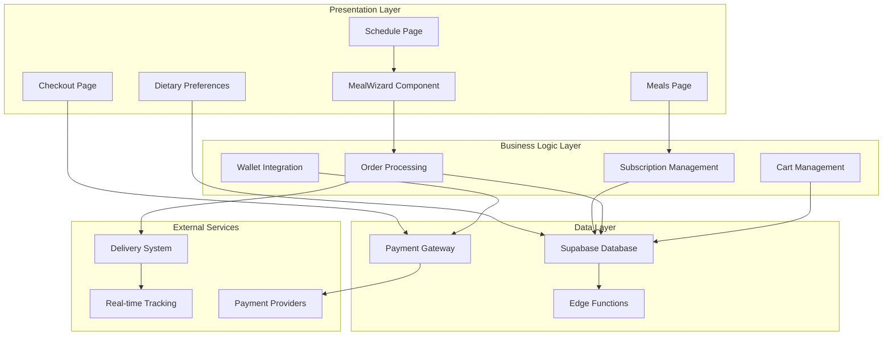
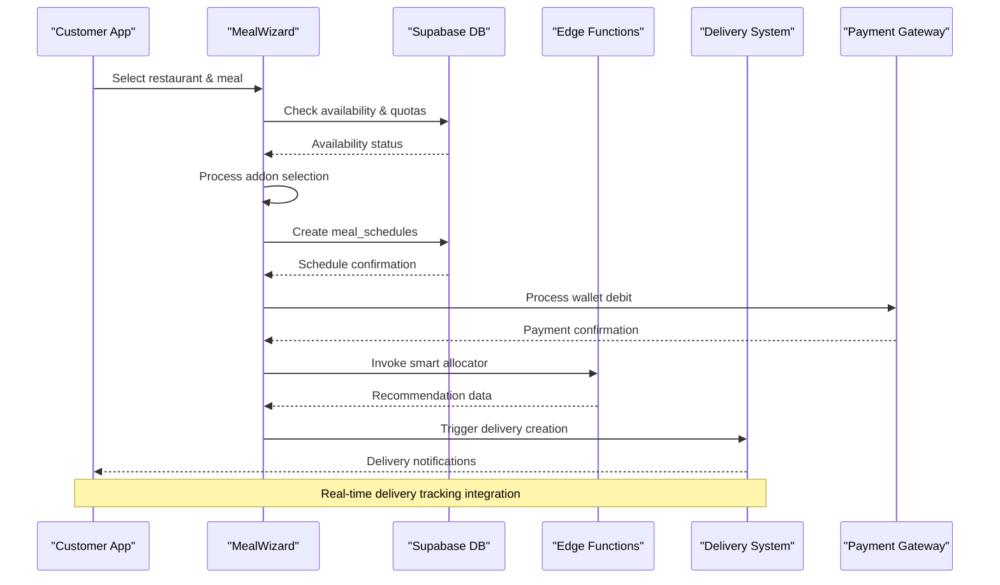
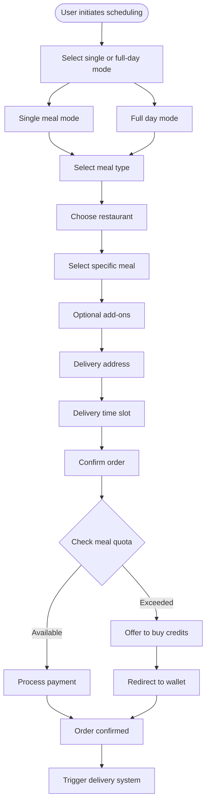
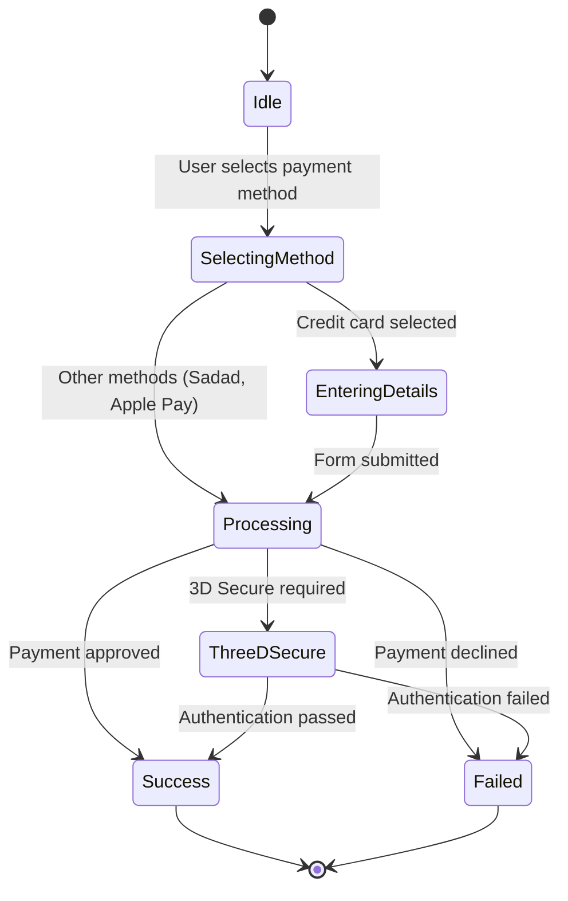
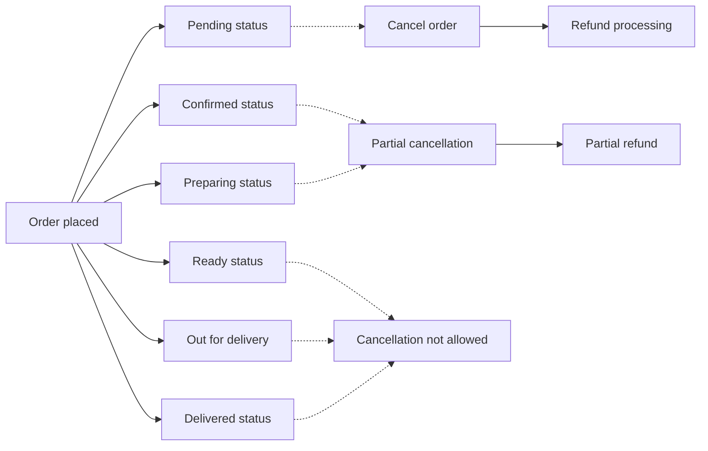
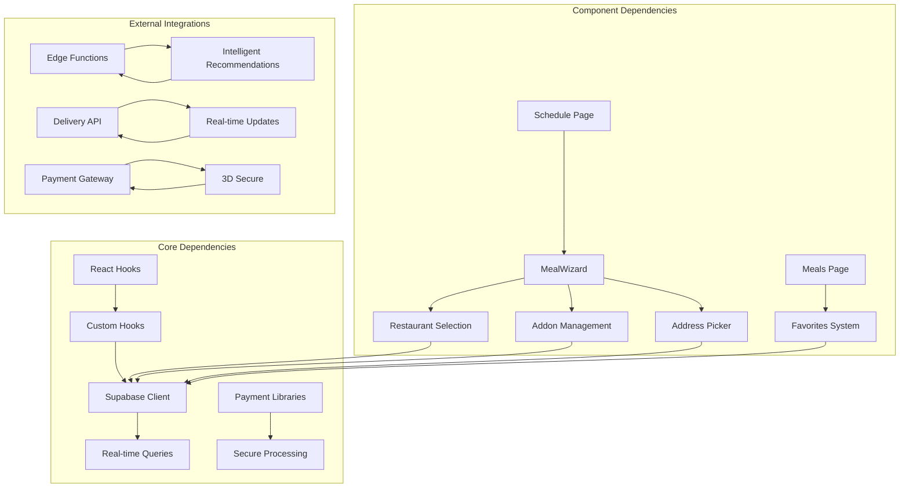

# Meal Ordering & Scheduling

<cite>
**Referenced Files in This Document**
- [Meals.tsx](file://src/pages/Meals.tsx)
- [Schedule.tsx](file://src/pages/Schedule.tsx)
- [MealWizard.tsx](file://src/components/MealWizard.tsx)
- [Checkout.tsx](file://src/pages/Checkout.tsx)
- [Dietary.tsx](file://src/pages/Dietary.tsx)
- [OrderCancellation.tsx](file://src/components/CancellationFlow/OrderCancellation.tsx)
- [OrderCancellation RPC](file://supabase/migrations/20240101000002_add_cancel_order_rpc.sql)
- [delivery_analysis.md](file://delivery_analysis.md)
- [delivery_system_visual.md](file://delivery_system_visual.md)
- [delivery_integration_plan.md](file://delivery_integration_plan.md)
</cite>

## Table of Contents
1. [Introduction](#introduction)
2. [Project Structure](#project-structure)
3. [Core Components](#core-components)
4. [Architecture Overview](#architecture-overview)
5. [Detailed Component Analysis](#detailed-component-analysis)
6. [Dependency Analysis](#dependency-analysis)
7. [Performance Considerations](#performance-considerations)
8. [Troubleshooting Guide](#troubleshooting-guide)
9. [Conclusion](#conclusion)

## Introduction

The Nutrio meal ordering and scheduling system provides a comprehensive solution for customers to browse restaurants, discover meals, customize their orders, and manage their weekly meal plans. The system integrates advanced features including real-time availability checking, subscription-based ordering mechanics, dietary restriction handling, and a sophisticated delivery scheduling workflow.

This documentation covers the complete meal ordering journey from restaurant discovery to delivery confirmation, including the innovative meal wizard component, addon selection system, and subscription management features.

## Project Structure

The meal ordering system is built with a modern React/TypeScript architecture featuring a clean separation of concerns across multiple layers:

**Diagram sources**
- [Meals.tsx:1-1195](file://src/pages/Meals.tsx#L1-1195)
- [Schedule.tsx:1-1038](file://src/pages/Schedule.tsx#L1-1038)
- [MealWizard.tsx:1-2222](file://src/components/MealWizard.tsx#L1-2222)

**Section sources**
- [Meals.tsx:1-1195](file://src/pages/Meals.tsx#L1-1195)
- [Schedule.tsx:1-1038](file://src/pages/Schedule.tsx#L1-1038)

## Core Components

### Restaurant Discovery & Meal Browsing

The restaurant discovery system provides an intuitive interface for customers to explore dining options:

- **Restaurant Cards**: Feature-rich displays with ratings, delivery times, and cuisine types
- **Advanced Filtering**: Cuisine-specific filters, calorie ranges, and sorting options
- **Favorites System**: Persistent restaurant favorites with sync across devices
- **Search Functionality**: Real-time search with instant results filtering

### Meal Selection & Customization

The meal selection process offers comprehensive customization options:

- **Meal Cards**: Detailed displays with nutritional information and availability status
- **Addon System**: Optional add-ons with real-time pricing updates
- **Quantity Management**: Flexible quantity selection with immediate cost calculations
- **Dietary Compliance**: Automatic conflict detection with allergy warnings

### Subscription-Based Ordering

The subscription system enables unlimited meal ordering with flexible credit management:

- **Meal Credits**: Monthly allowance with automatic rollover capabilities
- **Credit Management**: Purchase additional credits via integrated wallet system
- **Usage Tracking**: Real-time monitoring of remaining meal quotas
- **Unlimited Plans**: Special subscription tiers for premium users

**Section sources**
- [Meals.tsx:54-1195](file://src/pages/Meals.tsx#L54-1195)
- [Schedule.tsx:115-1038](file://src/pages/Schedule.tsx#L115-1038)

## Architecture Overview

The meal ordering system follows a microservices architecture with clear separation between frontend presentation, business logic, and backend services:

**Diagram sources**
- [MealWizard.tsx:544-657](file://src/components/MealWizard.tsx#L544-657)
- [Schedule.tsx:205-267](file://src/pages/Schedule.tsx#L205-267)

The system leverages Supabase for real-time database operations, edge functions for intelligent meal recommendations, and external APIs for payment processing and delivery coordination.

**Section sources**
- [delivery_analysis.md:568-670](file://delivery_analysis.md#L568-L670)
- [delivery_system_visual.md:1-58](file://delivery_system_visual.md#L1-L58)

## Detailed Component Analysis

### Meal Wizard Component

The MealWizard serves as the centerpiece of the ordering experience, providing an intelligent guided workflow:

**Diagram sources**
- [MealWizard.tsx:864-947](file://src/components/MealWizard.tsx#L864-947)

The wizard implements several advanced features:

- **Smart Recommendations**: AI-powered meal suggestions based on user preferences and nutritional goals
- **Real-time Availability**: Instant checking of restaurant availability and meal stock levels
- **Dynamic Pricing**: Real-time calculation of addon costs and delivery fees
- **Progressive Disclosure**: Step-by-step guidance reducing cognitive load

**Section sources**
- [MealWizard.tsx:1-2222](file://src/components/MealWizard.tsx#L1-2222)

### Cart Management System

The cart management system provides seamless shopping experience with advanced features:

- **Persistent Shopping**: Cart items saved between sessions with automatic synchronization
- **Bulk Operations**: Support for adding multiple items from restaurant pages
- **Real-time Updates**: Instant cart total calculations with tax and delivery fee adjustments
- **Cross-platform Sync**: Seamless experience across web, iOS, and Android platforms

### Checkout & Payment Integration

The checkout system supports multiple payment methods with robust security:

**Diagram sources**
- [Checkout.tsx:17-288](file://src/pages/Checkout.tsx#L17-L288)

**Section sources**
- [Checkout.tsx:17-288](file://src/pages/Checkout.tsx#L17-288)

### Delivery Scheduling & Tracking

The delivery system integrates seamlessly with the ordering workflow:

- **Flexible Scheduling**: Multiple delivery time slots with real-time availability
- **Address Management**: Saved delivery addresses with quick selection
- **Real-time Tracking**: Live delivery status updates with driver location
- **Integration Points**: Seamless handoff between ordering and delivery systems

**Section sources**
- [Schedule.tsx:351-390](file://src/pages/Schedule.tsx#L351-390)
- [delivery_analysis.md:568-670](file://delivery_analysis.md#L568-L670)

### Order Modification & Cancellation

The system provides comprehensive order management capabilities:

**Diagram sources**
- [OrderCancellation.tsx:1262-1268](file://src/components/CancellationFlow/OrderCancellation.tsx#L1262-L1268)

**Section sources**
- [OrderCancellation.tsx:1230-1385](file://src/components/CancellationFlow/OrderCancellation.tsx#L1230-L1385)
- [OrderCancellation RPC:104-257](file://supabase/migrations/20240101000002_add_cancel_order_rpc.sql#L104-L257)

### Dietary Restrictions & Allergy Management

The system includes comprehensive dietary compliance features:

- **Allergy Detection**: Automatic conflict identification between meals and user allergies
- **Dietary Tags**: Comprehensive tagging system for special diets (vegetarian, vegan, keto, etc.)
- **Restaurant Filtering**: Cuisine-specific filtering based on dietary preferences
- **Nutritional Information**: Detailed macronutrient breakdown for all meals

**Section sources**
- [Dietary.tsx:191-219](file://src/pages/Dietary.tsx#L191-L219)
- [Meals.tsx:820-920](file://src/pages/Meals.tsx#L820-L920)

## Dependency Analysis

The system exhibits excellent modularity with clear dependency relationships:

**Diagram sources**
- [MealWizard.tsx:1-80](file://src/components/MealWizard.tsx#L1-80)
- [Schedule.tsx:1-50](file://src/pages/Schedule.tsx#L1-L50)

The dependency graph reveals a well-structured system where components maintain loose coupling while sharing common infrastructure through hooks and services.

**Section sources**
- [MealWizard.tsx:1-80](file://src/components/MealWizard.tsx#L1-80)
- [Schedule.tsx:1-50](file://src/pages/Schedule.tsx#L1-L50)

## Performance Considerations

The system implements several performance optimization strategies:

- **Lazy Loading**: Restaurant and meal data loaded on-demand to minimize initial payload
- **Virtual Scrolling**: Efficient rendering of large lists with smooth scrolling performance
- **Caching Strategy**: Strategic caching of frequently accessed data with automatic invalidation
- **Optimized Queries**: Database queries designed for minimal latency and optimal indexing
- **Bundle Splitting**: Code splitting to reduce initial bundle size and improve load times

## Troubleshooting Guide

### Common Issues and Solutions

**Restaurant Availability Problems**
- Verify restaurant approval status in admin portal
- Check delivery zones and service areas
- Review restaurant capacity limits and peak hour restrictions

**Payment Processing Failures**
- Validate payment method compatibility
- Check 3D Secure authentication requirements
- Verify sufficient wallet balance for subscription purchases

**Delivery Scheduling Conflicts**
- Confirm delivery address validity
- Check time slot availability during requested period
- Verify driver availability in delivery zone

**Order Cancellation Issues**
- Review cancellation policy based on order status
- Check refund eligibility for partial cancellations
- Verify proper authorization for cancellation requests

**Section sources**
- [OrderCancellation.tsx:1262-1268](file://src/components/CancellationFlow/OrderCancellation.tsx#L1262-L1268)
- [OrderCancellation RPC:112-130](file://supabase/migrations/20240101000002_add_cancel_order_rpc.sql#L112-L130)

## Conclusion

The Nutrio meal ordering and scheduling system represents a comprehensive solution for modern food delivery needs. Its architecture balances flexibility with performance, providing users with an intuitive experience while maintaining robust backend operations.

Key strengths include the intelligent meal wizard, comprehensive dietary compliance features, seamless subscription management, and integrated delivery tracking. The system's modular design ensures maintainability and scalability for future enhancements.

The combination of real-time availability checking, smart recommendations, and flexible scheduling options positions the platform to deliver exceptional user experiences while supporting efficient restaurant operations and reliable delivery services.