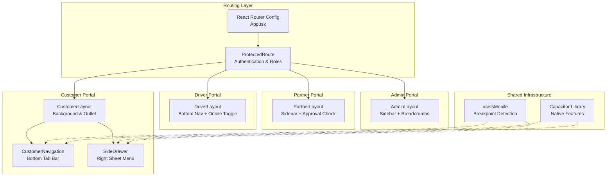
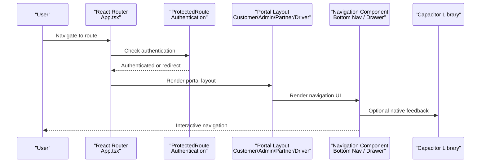
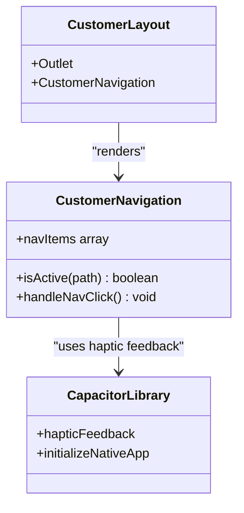
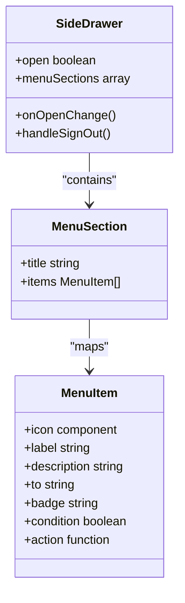
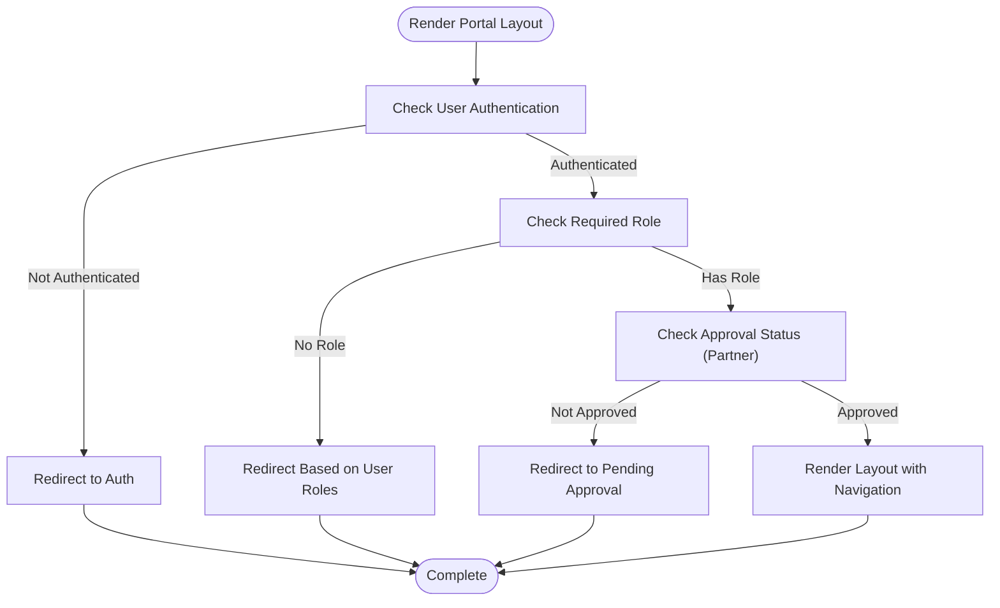
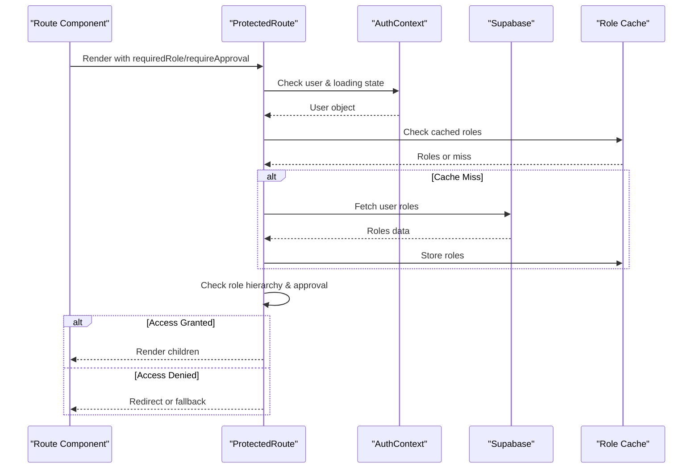
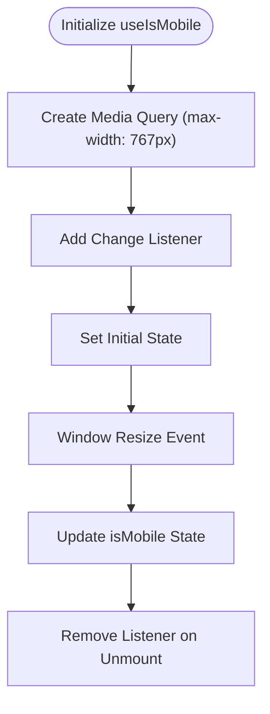
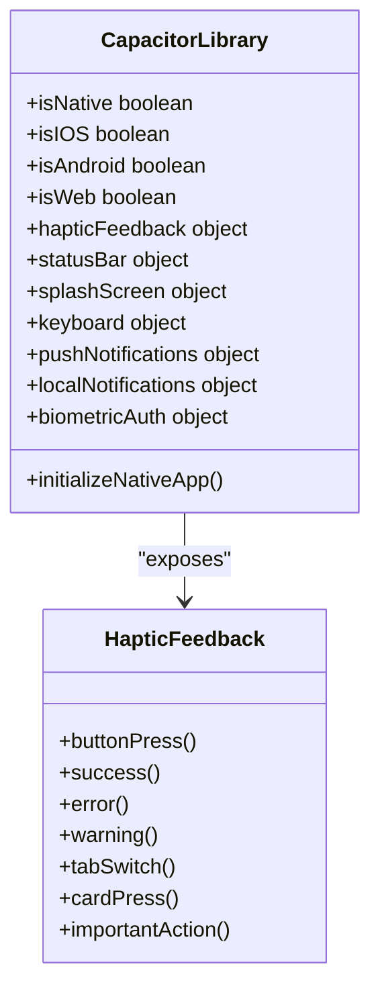
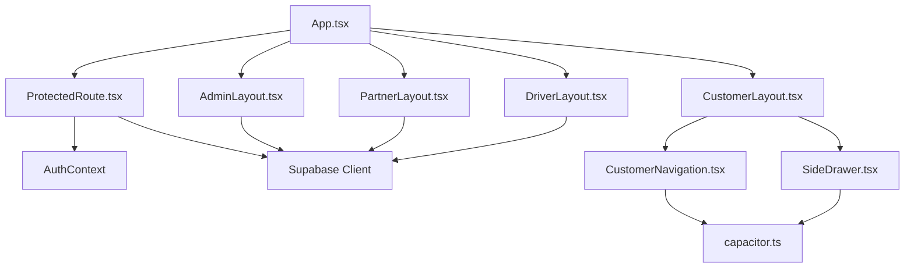

# Mobile-First Design & Navigation

<cite>
**Referenced Files in This Document**
- [App.tsx](file://src/App.tsx)
- [capacitor.config.ts](file://capacitor.config.ts)
- [CustomerNavigation.tsx](file://src/components/CustomerNavigation.tsx)
- [CustomerLayout.tsx](file://src/components/CustomerLayout.tsx)
- [SideDrawer.tsx](file://src/components/SideDrawer.tsx)
- [use-mobile.tsx](file://src/hooks/use-mobile.tsx)
- [ProtectedRoute.tsx](file://src/components/ProtectedRoute.tsx)
- [capacitor.ts](file://src/lib/capacitor.ts)
- [AdminLayout.tsx](file://src/components/AdminLayout.tsx)
- [PartnerLayout.tsx](file://src/components/PartnerLayout.tsx)
- [DriverLayout.tsx](file://src/components/DriverLayout.tsx)
- [MainMenu.tsx](file://src/components/MainMenu.tsx)
</cite>

## Table of Contents
1. [Introduction](#introduction)
2. [Project Structure](#project-structure)
3. [Core Components](#core-components)
4. [Architecture Overview](#architecture-overview)
5. [Detailed Component Analysis](#detailed-component-analysis)
6. [Dependency Analysis](#dependency-analysis)
7. [Performance Considerations](#performance-considerations)
8. [Troubleshooting Guide](#troubleshooting-guide)
9. [Conclusion](#conclusion)

## Introduction
This document provides comprehensive documentation for the mobile-first design implementation and navigation system. It covers responsive navigation patterns including bottom navigation, side drawers, and mobile-optimized layouts. The guide explains touch-friendly interface components, gesture handling, and mobile-specific interactions. It also details navigation state management, route protection, and portal switching functionality. The drawer-based navigation system with menu items, user actions, and settings access is documented alongside mobile breakpoint handling, component adaptation strategies, and performance optimizations for mobile devices. Finally, it addresses integration with Capacitor for native mobile features and offline capabilities.

## Project Structure
The navigation and layout system is organized around portal-specific layouts and shared navigation components:
- Customer portal: Bottom navigation and drawer-based navigation
- Admin portal: Sidebar-based navigation with breadcrumb support
- Partner portal: Sidebar-based navigation with approval gating
- Driver portal: Bottom navigation with online status toggle
- Shared: Route protection, mobile detection, and Capacitor integration

**Diagram sources**
- [App.tsx:139-739](file://src/App.tsx#L139-L739)
- [CustomerLayout.tsx:8-21](file://src/components/CustomerLayout.tsx#L8-L21)
- [CustomerNavigation.tsx:8-60](file://src/components/CustomerNavigation.tsx#L8-L60)
- [SideDrawer.tsx:37-314](file://src/components/SideDrawer.tsx#L37-L314)
- [AdminLayout.tsx:25-129](file://src/components/AdminLayout.tsx#L25-L129)
- [PartnerLayout.tsx:27-140](file://src/components/PartnerLayout.tsx#L27-L140)
- [DriverLayout.tsx:16-182](file://src/components/DriverLayout.tsx#L16-L182)
- [use-mobile.tsx:5-19](file://src/hooks/use-mobile.tsx#L5-L19)
- [capacitor.ts:27-640](file://src/lib/capacitor.ts#L27-L640)

**Section sources**
- [App.tsx:139-739](file://src/App.tsx#L139-L739)
- [capacitor.config.ts:1-45](file://capacitor.config.ts#L1-L45)

## Core Components
This section outlines the primary building blocks of the mobile-first navigation system.

- Bottom Navigation (Customer Portal)
  - Fixed-position tab bar with five primary destinations: Home, Restaurants, Schedule, Affiliate (conditional), and Profile
  - Active state indication and haptic feedback on tab switches
  - Backdrop blur and safe area awareness via CSS classes

- Drawer-Based Navigation (Customer Portal)
  - Right-side sheet menu with categorized sections: Food & Meals, Progress & Orders, Account & Settings, and optional Earn Rewards
  - Dynamic menu items based on platform settings and user subscription status
  - User profile header with subscription badges and sign-out action

- Portal Layouts
  - AdminLayout: Sidebar provider with breadcrumb navigation and role-based access
  - PartnerLayout: Sidebar provider with approval gating and order notifications
  - DriverLayout: Bottom navigation with online/offline status toggle and driver-specific routes

- Route Protection
  - ProtectedRoute enforces authentication and role-based access with caching and fallback redirection
  - Supports hierarchical roles and partner approval checks

- Mobile Adaptation
  - useIsMobile hook detects viewport width below 768px
  - Conditional rendering for mobile-only UI elements
  - Safe area insets applied via CSS variables for modern devices

- Capacitor Integration
  - Native haptic feedback, status bar control, splash screen, keyboard, push/local notifications, and biometric authentication
  - Graceful fallbacks when running in web browsers

**Section sources**
- [CustomerNavigation.tsx:8-60](file://src/components/CustomerNavigation.tsx#L8-L60)
- [SideDrawer.tsx:37-314](file://src/components/SideDrawer.tsx#L37-L314)
- [AdminLayout.tsx:25-129](file://src/components/AdminLayout.tsx#L25-L129)
- [PartnerLayout.tsx:27-140](file://src/components/PartnerLayout.tsx#L27-L140)
- [DriverLayout.tsx:16-182](file://src/components/DriverLayout.tsx#L16-L182)
- [ProtectedRoute.tsx:139-230](file://src/components/ProtectedRoute.tsx#L139-L230)
- [use-mobile.tsx:5-19](file://src/hooks/use-mobile.tsx#L5-L19)
- [capacitor.ts:27-640](file://src/lib/capacitor.ts#L27-L640)

## Architecture Overview
The navigation architecture combines routing, layout wrappers, and portal-specific navigation patterns. ProtectedRoute ensures secure access to protected routes, while portal layouts provide consistent navigation experiences tailored to user roles.

**Diagram sources**
- [App.tsx:139-739](file://src/App.tsx#L139-L739)
- [ProtectedRoute.tsx:139-230](file://src/components/ProtectedRoute.tsx#L139-L230)
- [CustomerNavigation.tsx:8-60](file://src/components/CustomerNavigation.tsx#L8-L60)
- [capacitor.ts:613-621](file://src/lib/capacitor.ts#L613-L621)

## Detailed Component Analysis

### Bottom Navigation (Customer Portal)
The bottom navigation provides a fixed tab bar at the screen base with five primary destinations. It adapts dynamically based on user eligibility for affiliate features and platform settings.

**Diagram sources**
- [CustomerNavigation.tsx:8-60](file://src/components/CustomerNavigation.tsx#L8-L60)
- [CustomerLayout.tsx:8-21](file://src/components/CustomerLayout.tsx#L8-L21)
- [capacitor.ts:613-621](file://src/lib/capacitor.ts#L613-L621)

**Section sources**
- [CustomerNavigation.tsx:8-60](file://src/components/CustomerNavigation.tsx#L8-L60)
- [CustomerLayout.tsx:8-21](file://src/components/CustomerLayout.tsx#L8-L21)

### Drawer-Based Navigation (Customer Portal)
The side drawer presents a categorized menu accessible via a trigger button. It includes user profile information, subscription status, and navigation to key sections.

**Diagram sources**
- [SideDrawer.tsx:37-314](file://src/components/SideDrawer.tsx#L37-L314)
- [SideDrawer.tsx:15-35](file://src/components/SideDrawer.tsx#L15-L35)
- [SideDrawer.tsx:20-29](file://src/components/SideDrawer.tsx#L20-L29)

**Section sources**
- [SideDrawer.tsx:37-314](file://src/components/SideDrawer.tsx#L37-L314)

### Portal Layouts and Navigation State Management
Portal layouts encapsulate role-specific navigation and access control. They manage breadcrumbs, sidebar triggers, and conditional rendering based on user roles and approval status.

**Diagram sources**
- [ProtectedRoute.tsx:139-230](file://src/components/ProtectedRoute.tsx#L139-L230)
- [AdminLayout.tsx:25-129](file://src/components/AdminLayout.tsx#L25-L129)
- [PartnerLayout.tsx:27-140](file://src/components/PartnerLayout.tsx#L27-L140)
- [DriverLayout.tsx:16-182](file://src/components/DriverLayout.tsx#L16-L182)

**Section sources**
- [ProtectedRoute.tsx:139-230](file://src/components/ProtectedRoute.tsx#L139-L230)
- [AdminLayout.tsx:25-129](file://src/components/AdminLayout.tsx#L25-L129)
- [PartnerLayout.tsx:27-140](file://src/components/PartnerLayout.tsx#L27-L140)
- [DriverLayout.tsx:16-182](file://src/components/DriverLayout.tsx#L16-L182)

### Route Protection and Portal Switching
ProtectedRoute manages authentication, role hierarchies, and approval checks. It caches role data to minimize database queries and redirects users appropriately when access is denied.

**Diagram sources**
- [ProtectedRoute.tsx:139-230](file://src/components/ProtectedRoute.tsx#L139-L230)
- [ProtectedRoute.tsx:34-98](file://src/components/ProtectedRoute.tsx#L34-L98)

**Section sources**
- [ProtectedRoute.tsx:139-230](file://src/components/ProtectedRoute.tsx#L139-L230)

### Mobile Breakpoint Handling and Component Adaptation
The useIsMobile hook detects viewport width below 768px and updates state on media query changes. This enables conditional rendering of mobile-specific UI elements and responsive adaptations.

**Diagram sources**
- [use-mobile.tsx:5-19](file://src/hooks/use-mobile.tsx#L5-L19)

**Section sources**
- [use-mobile.tsx:5-19](file://src/hooks/use-mobile.tsx#L5-L19)

### Capacitor Integration for Native Mobile Features
The Capacitor library provides native capabilities with graceful fallbacks for web environments. It includes haptic feedback, status bar control, splash screen, keyboard, push/local notifications, and biometric authentication.

**Diagram sources**
- [capacitor.ts:27-640](file://src/lib/capacitor.ts#L27-L640)
- [capacitor.ts:613-621](file://src/lib/capacitor.ts#L613-L621)

**Section sources**
- [capacitor.ts:27-640](file://src/lib/capacitor.ts#L27-L640)

## Dependency Analysis
The navigation system exhibits clear separation of concerns with minimal coupling between components. ProtectedRoute depends on authentication and role management, while portal layouts depend on Supabase for role and approval checks. Capacitor integration is isolated to haptic feedback and native feature access.

**Diagram sources**
- [App.tsx:139-739](file://src/App.tsx#L139-L739)
- [ProtectedRoute.tsx:139-230](file://src/components/ProtectedRoute.tsx#L139-L230)
- [CustomerNavigation.tsx:8-60](file://src/components/CustomerNavigation.tsx#L8-L60)
- [SideDrawer.tsx:37-314](file://src/components/SideDrawer.tsx#L37-L314)
- [AdminLayout.tsx:25-129](file://src/components/AdminLayout.tsx#L25-L129)
- [PartnerLayout.tsx:27-140](file://src/components/PartnerLayout.tsx#L27-L140)
- [DriverLayout.tsx:16-182](file://src/components/DriverLayout.tsx#L16-L182)
- [capacitor.ts:27-640](file://src/lib/capacitor.ts#L27-L640)

**Section sources**
- [App.tsx:139-739](file://src/App.tsx#L139-L739)
- [ProtectedRoute.tsx:139-230](file://src/components/ProtectedRoute.tsx#L139-L230)

## Performance Considerations
- Route protection caching: Role checks are cached to reduce database queries and improve navigation responsiveness.
- Lazy loading: Feature pages are lazily loaded to minimize initial bundle size.
- Conditional rendering: Mobile-specific components and drawer menus are rendered conditionally to avoid unnecessary DOM nodes.
- Capacitor fallbacks: Native features gracefully degrade in web environments to prevent runtime errors.
- Safe area handling: CSS variables are used to accommodate device notches and immersive modes.

## Troubleshooting Guide
Common issues and resolutions:
- Authentication redirects: ProtectedRoute redirects unauthenticated users to the auth page and handles role-based fallbacks.
- Role hierarchy mismatches: ProtectedRoute validates user roles against required roles using a hierarchical comparison.
- Partner approval gating: PartnerLayout checks approval status and redirects to pending approval when necessary.
- Capacitor initialization: initializeNativeApp sets status bar style, hides splash screen, and requests notification permissions.
- Drawer menu actions: SideDrawer handles sign-out with user feedback and navigation to home.

**Section sources**
- [ProtectedRoute.tsx:139-230](file://src/components/ProtectedRoute.tsx#L139-L230)
- [PartnerLayout.tsx:27-140](file://src/components/PartnerLayout.tsx#L27-L140)
- [capacitor.ts:590-608](file://src/lib/capacitor.ts#L590-L608)
- [SideDrawer.tsx:45-52](file://src/components/SideDrawer.tsx#L45-L52)

## Conclusion
The mobile-first navigation system integrates bottom navigation, drawer-based menus, and portal-specific layouts with robust route protection and native mobile capabilities. The architecture emphasizes responsive design, user experience, and maintainability through clear component boundaries and shared infrastructure. Capacitor integration enhances the native feel with haptic feedback and system-level features, while mobile breakpoint handling ensures optimal performance across devices.