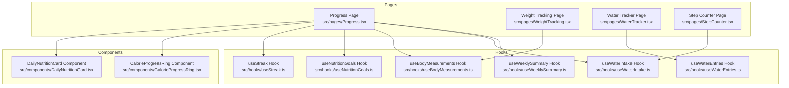
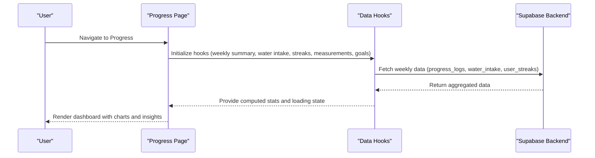
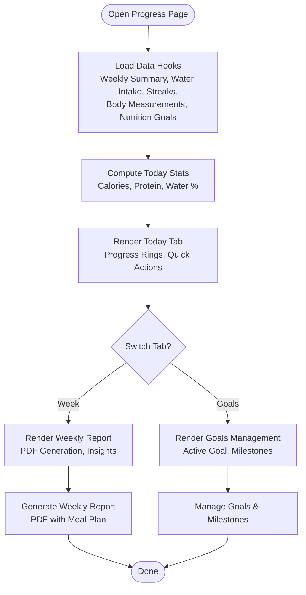
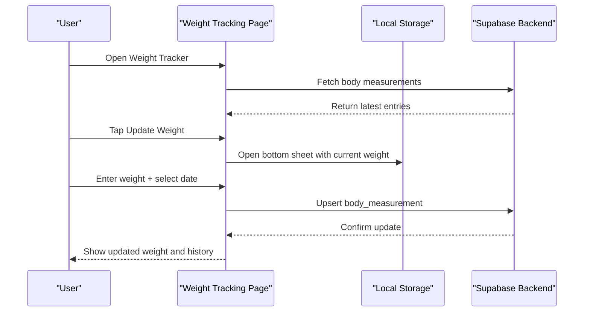
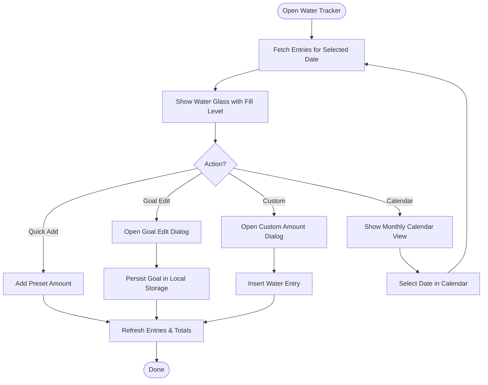
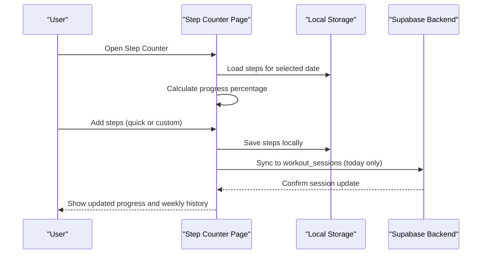
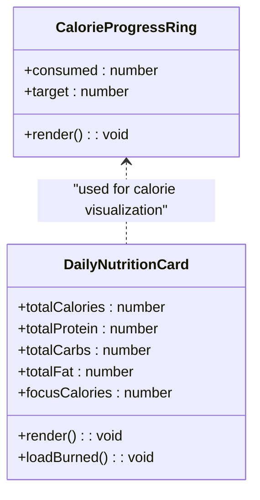
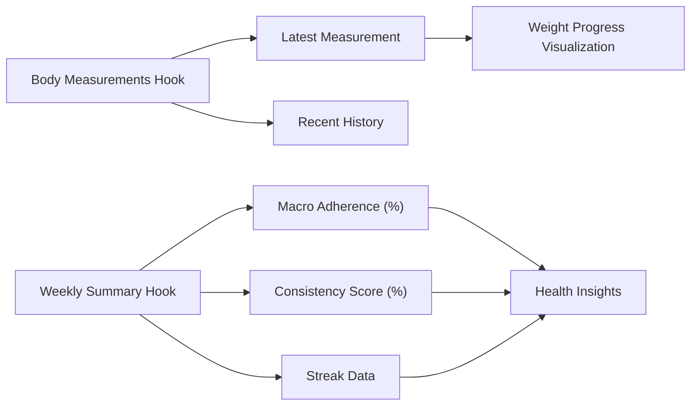
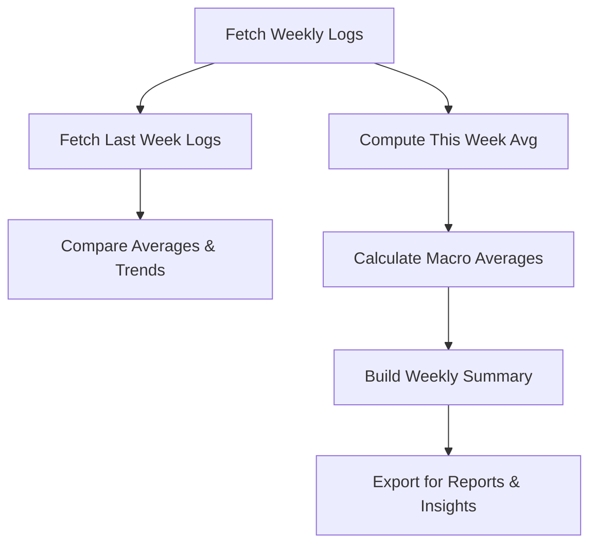
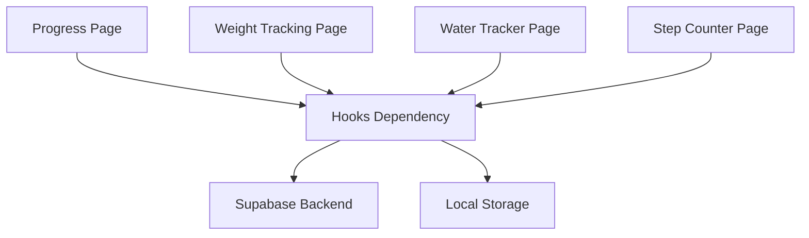

# Nutrition Tracking & Health Metrics

<cite>
**Referenced Files in This Document**
- [Progress.tsx](file://src/pages/Progress.tsx)
- [WeightTracking.tsx](file://src/pages/WeightTracking.tsx)
- [WaterTracker.tsx](file://src/pages/WaterTracker.tsx)
- [StepCounter.tsx](file://src/pages/StepCounter.tsx)
- [useWeeklySummary.ts](file://src/hooks/useWeeklySummary.ts)
- [useWaterIntake.ts](file://src/hooks/useWaterIntake.ts)
- [useBodyMeasurements.ts](file://src/hooks/useBodyMeasurements.ts)
- [useNutritionGoals.ts](file://src/hooks/useNutritionGoals.ts)
- [useStreak.ts](file://src/hooks/useStreak.ts)
- [useWaterEntries.ts](file://src/hooks/useWaterEntries.ts)
- [CalorieProgressRing.tsx](file://src/components/CalorieProgressRing.tsx)
- [DailyNutritionCard.tsx](file://src/components/DailyNutritionCard.tsx)
</cite>

## Table of Contents
1. [Introduction](#introduction)
2. [Project Structure](#project-structure)
3. [Core Components](#core-components)
4. [Architecture Overview](#architecture-overview)
5. [Detailed Component Analysis](#detailed-component-analysis)
6. [Dependency Analysis](#dependency-analysis)
7. [Performance Considerations](#performance-considerations)
8. [Troubleshooting Guide](#troubleshooting-guide)
9. [Conclusion](#conclusion)

## Introduction
This document provides comprehensive documentation for the nutrition tracking and health metrics system. It covers the progress dashboard, weight tracking interface, water intake logging, and step counter functionality. It also explains body metrics integration, health score calculation, trend visualization, macro nutrient tracking, calorie consumption monitoring, daily progress indicators, body measurements system, weekly summaries, and health insights generation. The guide details data entry methods, goal setting, and progress reporting features.

## Project Structure
The system is organized around four primary pages and supporting hooks for data management:
- Progress dashboard page orchestrates weekly summaries, water intake, streaks, body measurements, nutrition goals, and smart recommendations.
- Weight tracking page manages weight entries, goal progress, and historical entries.
- Water tracker page handles daily water consumption, goal setting, and calendar views.
- Step counter page tracks daily steps, goals, and integrates with workout sessions.

**Diagram sources**
- [Progress.tsx:1-687](file://src/pages/Progress.tsx#L1-L687)
- [WeightTracking.tsx:1-315](file://src/pages/WeightTracking.tsx#L1-L315)
- [WaterTracker.tsx:1-542](file://src/pages/WaterTracker.tsx#L1-L542)
- [StepCounter.tsx:1-509](file://src/pages/StepCounter.tsx#L1-L509)
- [useWeeklySummary.ts:1-183](file://src/hooks/useWeeklySummary.ts#L1-L183)
- [useWaterIntake.ts:1-148](file://src/hooks/useWaterIntake.ts#L1-L148)
- [useBodyMeasurements.ts:1-113](file://src/hooks/useBodyMeasurements.ts#L1-L113)
- [useNutritionGoals.ts:1-134](file://src/hooks/useNutritionGoals.ts#L1-L134)
- [useStreak.ts:1-73](file://src/hooks/useStreak.ts#L1-L73)
- [useWaterEntries.ts:1-143](file://src/hooks/useWaterEntries.ts#L1-L143)
- [CalorieProgressRing.tsx:1-110](file://src/components/CalorieProgressRing.tsx#L1-L110)
- [DailyNutritionCard.tsx:1-255](file://src/components/DailyNutritionCard.tsx#L1-L255)

**Section sources**
- [Progress.tsx:1-687](file://src/pages/Progress.tsx#L1-L687)
- [WeightTracking.tsx:1-315](file://src/pages/WeightTracking.tsx#L1-L315)
- [WaterTracker.tsx:1-542](file://src/pages/WaterTracker.tsx#L1-L542)
- [StepCounter.tsx:1-509](file://src/pages/StepCounter.tsx#L1-L509)

## Core Components
This section outlines the primary components and their responsibilities:

- Progress Dashboard
  - Aggregates weekly summary, water intake, streaks, body measurements, nutrition goals, and smart recommendations.
  - Provides quick actions for water logging and weight entry.
  - Generates weekly reports with insights and recommendations.

- Weight Tracking Interface
  - Manages current weight, goal progress, and historical entries.
  - Supports entry creation, editing, and deletion with a bottom sheet UI.
  - Calculates progress toward target weight.

- Water Intake Logging
  - Tracks daily water consumption with preset amounts and custom entries.
  - Offers calendar view for monthly totals and goal management.
  - Integrates with local storage for goal persistence.

- Step Counter
  - Records daily steps with goal selection and quick-add options.
  - Synchronizes today's steps to workout sessions for calories and duration.
  - Provides weekly history with derived metrics (distance, calories, minutes).

- Supporting Components
  - CalorieProgressRing: Visualizes daily calorie consumption against target.
  - DailyNutritionCard: Shows macro distribution and remaining calorie budget.

**Section sources**
- [Progress.tsx:43-687](file://src/pages/Progress.tsx#L43-L687)
- [WeightTracking.tsx:33-315](file://src/pages/WeightTracking.tsx#L33-L315)
- [WaterTracker.tsx:199-542](file://src/pages/WaterTracker.tsx#L199-L542)
- [StepCounter.tsx:28-509](file://src/pages/StepCounter.tsx#L28-L509)
- [CalorieProgressRing.tsx:9-110](file://src/components/CalorieProgressRing.tsx#L9-L110)
- [DailyNutritionCard.tsx:70-255](file://src/components/DailyNutritionCard.tsx#L70-L255)

## Architecture Overview
The system follows a modular architecture with page-level components coordinating multiple hooks for data fetching and state management. Supabase serves as the backend for persistent data, while local storage supports lightweight preferences (e.g., water goals, step goals).

**Diagram sources**
- [Progress.tsx:68-145](file://src/pages/Progress.tsx#L68-L145)
- [useWeeklySummary.ts:38-183](file://src/hooks/useWeeklySummary.ts#L38-L183)
- [useWaterIntake.ts:18-148](file://src/hooks/useWaterIntake.ts#L18-L148)
- [useStreak.ts:11-73](file://src/hooks/useStreak.ts#L11-L73)
- [useBodyMeasurements.ts:17-113](file://src/hooks/useBodyMeasurements.ts#L17-L113)
- [useNutritionGoals.ts:27-134](file://src/hooks/useNutritionGoals.ts#L27-L134)

## Detailed Component Analysis

### Progress Dashboard
The progress dashboard aggregates multiple health metrics into a unified view:
- Today tab displays current weight, water intake, meal quality, and streaks.
- Weekly tab presents a professional weekly report with trends and insights.
- Goals tab manages active nutrition goals and milestones.

**Diagram sources**
- [Progress.tsx:43-687](file://src/pages/Progress.tsx#L43-L687)
- [useWeeklySummary.ts:38-183](file://src/hooks/useWeeklySummary.ts#L38-L183)
- [useWaterIntake.ts:18-148](file://src/hooks/useWaterIntake.ts#L18-L148)
- [useStreak.ts:11-73](file://src/hooks/useStreak.ts#L11-L73)
- [useBodyMeasurements.ts:17-113](file://src/hooks/useBodyMeasurements.ts#L17-L113)
- [useNutritionGoals.ts:27-134](file://src/hooks/useNutritionGoals.ts#L27-L134)

**Section sources**
- [Progress.tsx:68-295](file://src/pages/Progress.tsx#L68-L295)
- [useWeeklySummary.ts:38-183](file://src/hooks/useWeeklySummary.ts#L38-L183)
- [useWaterIntake.ts:18-148](file://src/hooks/useWaterIntake.ts#L18-L148)
- [useStreak.ts:11-73](file://src/hooks/useStreak.ts#L11-L73)
- [useBodyMeasurements.ts:17-113](file://src/hooks/useBodyMeasurements.ts#L17-L113)
- [useNutritionGoals.ts:27-134](file://src/hooks/useNutritionGoals.ts#L27-L134)

### Weight Tracking Interface
The weight tracking interface provides:
- Current weight display with recent change indicator.
- Goal progress visualization and target weight display.
- Bottom sheet for adding/updating weight entries with date selection.
- History list with delete capability.

**Diagram sources**
- [WeightTracking.tsx:33-315](file://src/pages/WeightTracking.tsx#L33-L315)
- [useBodyMeasurements.ts:17-113](file://src/hooks/useBodyMeasurements.ts#L17-L113)

**Section sources**
- [WeightTracking.tsx:60-114](file://src/pages/WeightTracking.tsx#L60-L114)
- [WeightTracking.tsx:216-310](file://src/pages/WeightTracking.tsx#L216-L310)
- [useBodyMeasurements.ts:22-111](file://src/hooks/useBodyMeasurements.ts#L22-L111)

### Water Intake Logging
The water tracker offers:
- Daily water consumption visualization with a glass-style progress indicator.
- Preset amounts and custom entry dialogs.
- Weekly calendar view with monthly totals.
- Goal management persisted in local storage.

**Diagram sources**
- [WaterTracker.tsx:199-542](file://src/pages/WaterTracker.tsx#L199-L542)
- [useWaterEntries.ts:15-143](file://src/hooks/useWaterEntries.ts#L15-L143)

**Section sources**
- [WaterTracker.tsx:204-287](file://src/pages/WaterTracker.tsx#L204-L287)
- [WaterTracker.tsx:358-367](file://src/pages/WaterTracker.tsx#L358-L367)
- [useWaterEntries.ts:34-141](file://src/hooks/useWaterEntries.ts#L34-L141)

### Step Counter Functionality
The step counter enables:
- Daily step recording with goal selection and quick-add options.
- Automatic synchronization to workout sessions for calories and duration.
- Weekly history with derived metrics (distance, calories, minutes).
- Monthly calendar overlay for step visualization.

**Diagram sources**
- [StepCounter.tsx:28-509](file://src/pages/StepCounter.tsx#L28-L509)

**Section sources**
- [StepCounter.tsx:47-130](file://src/pages/StepCounter.tsx#L47-L130)
- [StepCounter.tsx:131-157](file://src/pages/StepCounter.tsx#L131-L157)
- [StepCounter.tsx:211-291](file://src/pages/StepCounter.tsx#L211-L291)

### Macro Nutrient Tracking and Calorie Monitoring
The system provides:
- Daily calorie visualization via a ring component.
- Macro distribution rings for protein, carbs, and fat.
- Remaining calorie budget calculation considering burned calories.

**Diagram sources**
- [CalorieProgressRing.tsx:9-110](file://src/components/CalorieProgressRing.tsx#L9-L110)
- [DailyNutritionCard.tsx:70-255](file://src/components/DailyNutritionCard.tsx#L70-L255)

**Section sources**
- [CalorieProgressRing.tsx:9-110](file://src/components/CalorieProgressRing.tsx#L9-L110)
- [DailyNutritionCard.tsx:70-255](file://src/components/DailyNutritionCard.tsx#L70-L255)

### Body Metrics Integration and Health Score Calculation
The system integrates body metrics and calculates health-related insights:
- Body measurements hook retrieves weight, waist, hip, chest, body fat, and muscle mass.
- Weekly summary computes macro adherence and consistency scores.
- Streaks track logging consistency across categories.

**Diagram sources**
- [useBodyMeasurements.ts:17-113](file://src/hooks/useBodyMeasurements.ts#L17-L113)
- [useWeeklySummary.ts:27-167](file://src/hooks/useWeeklySummary.ts#L27-L167)
- [useStreak.ts:11-73](file://src/hooks/useStreak.ts#L11-L73)

**Section sources**
- [useBodyMeasurements.ts:17-113](file://src/hooks/useBodyMeasurements.ts#L17-L113)
- [useWeeklySummary.ts:27-167](file://src/hooks/useWeeklySummary.ts#L27-L167)
- [useStreak.ts:11-73](file://src/hooks/useStreak.ts#L11-L73)

### Trend Visualization and Weekly Summaries
The weekly summary provides:
- Average calories and trend comparison to last week.
- Macro adherence percentages and targets.
- Consistency metrics and streak data.
- Integration with recommendation engine for insights.

**Diagram sources**
- [useWeeklySummary.ts:42-175](file://src/hooks/useWeeklySummary.ts#L42-L175)

**Section sources**
- [useWeeklySummary.ts:42-175](file://src/hooks/useWeeklySummary.ts#L42-L175)

### Data Entry Methods, Goal Setting, and Progress Reporting
Key features include:
- Weight entry via bottom sheet with date selection and immediate updates.
- Water logging with presets, custom amounts, and goal adjustments.
- Step recording with quick-add and automatic workout session synchronization.
- Goal management for nutrition targets and weight progress.
- Progress reporting with downloadable weekly PDFs containing insights and meal plans.

**Section sources**
- [WeightTracking.tsx:73-114](file://src/pages/WeightTracking.tsx#L73-L114)
- [WaterTracker.tsx:244-287](file://src/pages/WaterTracker.tsx#L244-L287)
- [StepCounter.tsx:97-130](file://src/pages/StepCounter.tsx#L97-L130)
- [useNutritionGoals.ts:69-132](file://src/hooks/useNutritionGoals.ts#L69-L132)
- [Progress.tsx:162-295](file://src/pages/Progress.tsx#L162-L295)

## Dependency Analysis
The system exhibits clear separation of concerns:
- Pages depend on hooks for data fetching and state management.
- Hooks encapsulate Supabase queries and calculations.
- Components are reusable and self-contained.

**Diagram sources**
- [Progress.tsx:68-145](file://src/pages/Progress.tsx#L68-L145)
- [WeightTracking.tsx:60-114](file://src/pages/WeightTracking.tsx#L60-L114)
- [WaterTracker.tsx:204-287](file://src/pages/WaterTracker.tsx#L204-L287)
- [StepCounter.tsx:47-130](file://src/pages/StepCounter.tsx#L47-L130)

**Section sources**
- [Progress.tsx:68-145](file://src/pages/Progress.tsx#L68-L145)
- [WeightTracking.tsx:60-114](file://src/pages/WeightTracking.tsx#L60-L114)
- [WaterTracker.tsx:204-287](file://src/pages/WaterTracker.tsx#L204-L287)
- [StepCounter.tsx:47-130](file://src/pages/StepCounter.tsx#L47-L130)

## Performance Considerations
- Efficient data fetching: Hooks use targeted queries and caching via local state to minimize redundant network requests.
- Local storage usage: Lightweight preferences (e.g., water goals, step goals) are stored locally to reduce backend load.
- Lazy rendering: Components render only visible data and animate transitions for smooth UX.
- Pagination and limits: Body measurements are limited to recent entries to keep queries fast.

## Troubleshooting Guide
Common issues and resolutions:
- Water table missing: The water tracker detects missing tables and shows a user-friendly error message.
- Authentication required: Water logging requires sign-in; the tracker displays a toast prompting sign-in.
- Network errors: Hooks wrap operations in try/catch blocks and log errors to the console.
- Data conflicts: Upserts and conflict resolution prevent duplicate entries for the same date.

**Section sources**
- [WaterTracker.tsx:258-274](file://src/pages/WaterTracker.tsx#L258-L274)
- [useWaterEntries.ts:84-108](file://src/hooks/useWaterEntries.ts#L84-L108)
- [useBodyMeasurements.ts:56-80](file://src/hooks/useBodyMeasurements.ts#L56-L80)

## Conclusion
The nutrition tracking and health metrics system provides a comprehensive, modular solution for monitoring daily health behaviors. Its layered architecture ensures maintainability, while robust hooks and components deliver responsive user experiences. The integration of weekly summaries, goal management, and progress reporting enables users to track trends and achieve their health objectives effectively.