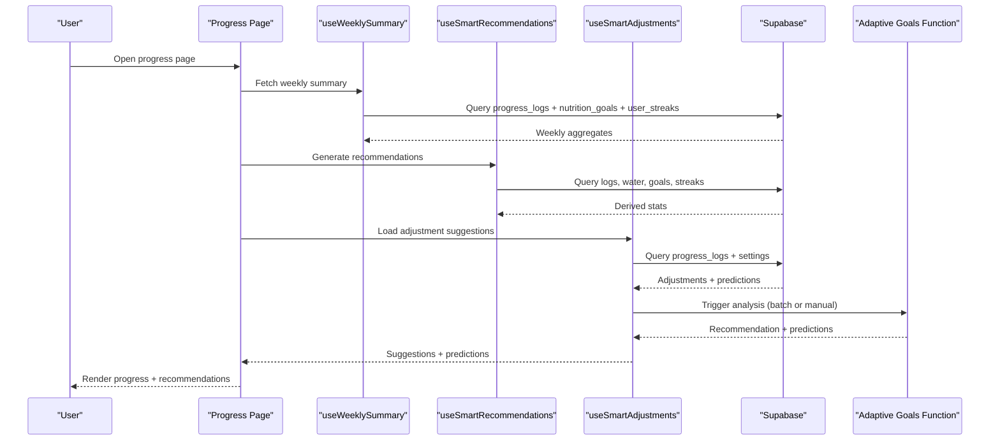
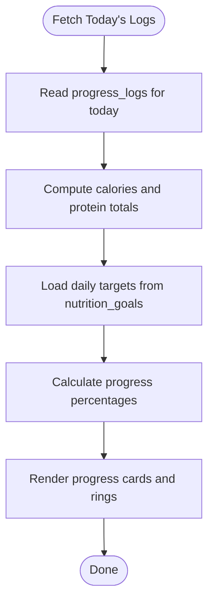
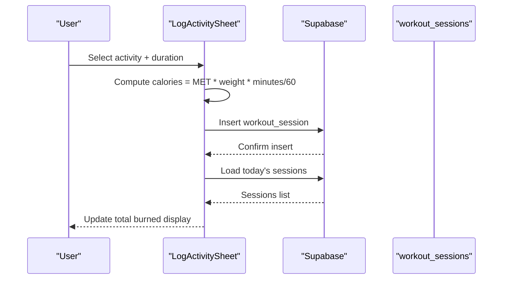
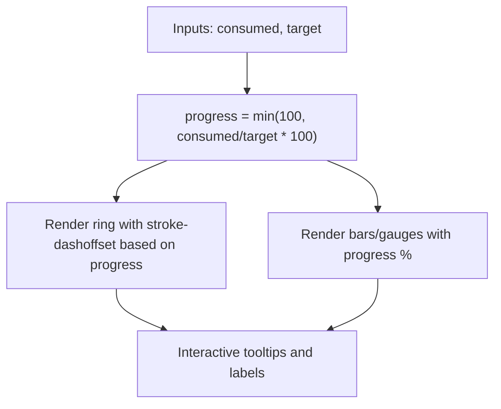
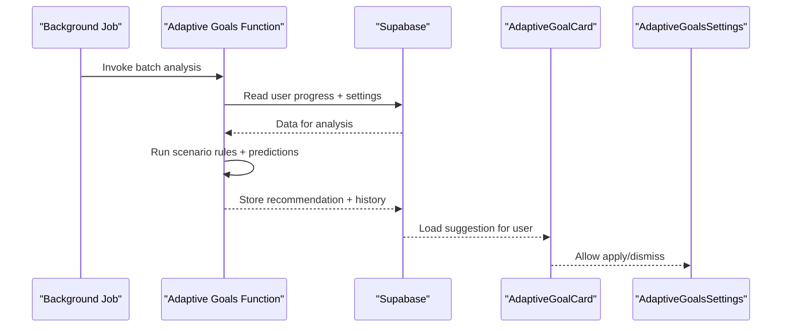
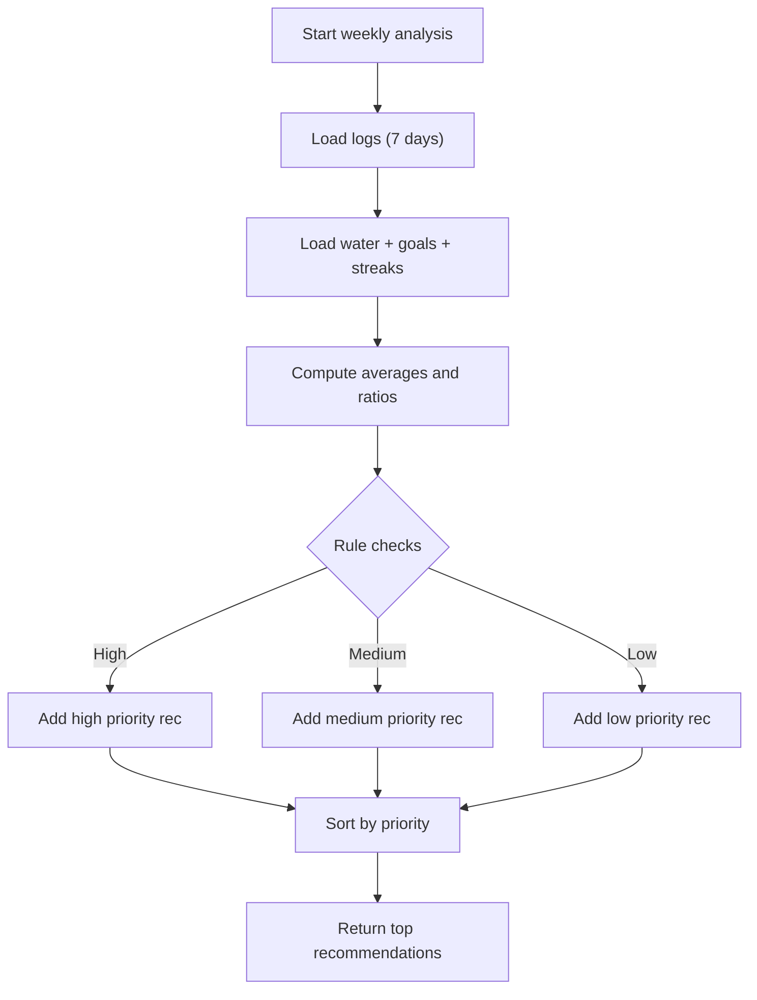
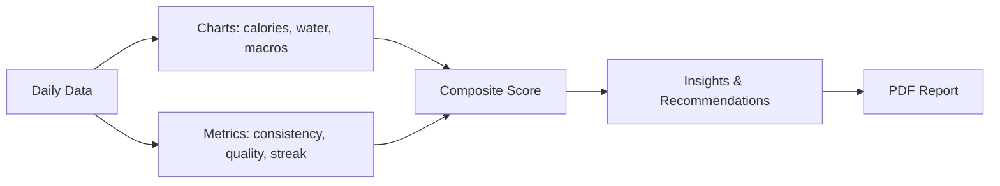
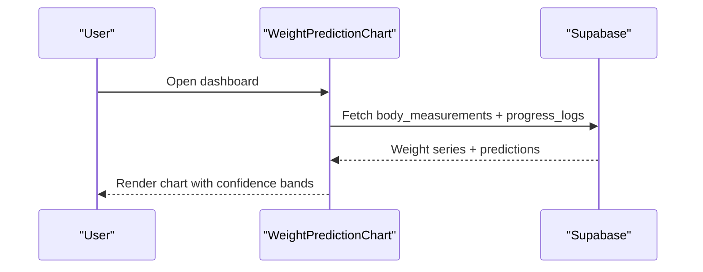
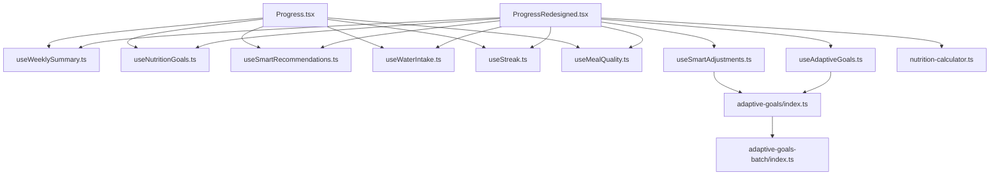

# Daily Progress Tracking

<cite>
**Referenced Files in This Document**
- [Progress.tsx](file://src/pages/Progress.tsx)
- [ProgressRedesigned.tsx](file://src/pages/ProgressRedesigned.tsx)
- [ProfessionalWeeklyReport.tsx](file://src/components/progress/ProfessionalWeeklyReport.tsx)
- [useWeeklySummary.ts](file://src/hooks/useWeeklySummary.ts)
- [useNutritionGoals.ts](file://src/hooks/useNutritionGoals.ts)
- [useSmartRecommendations.ts](file://src/hooks/useSmartRecommendations.ts)
- [useWaterIntake.ts](file://src/hooks/useWaterIntake.ts)
- [useStreak.ts](file://src/hooks/useStreak.ts)
- [useMealQuality.ts](file://src/hooks/useMealQuality.ts)
- [useSmartAdjustments.ts](file://src/hooks/useSmartAdjustments.ts)
- [LogActivitySheet.tsx](file://src/components/LogActivitySheet.tsx)
- [DailyNutritionCard.tsx](file://src/components/DailyNutritionCard.tsx)
- [CalorieProgressRing.tsx](file://src/components/CalorieProgressRing.tsx)
- [WeightPredictionChart.tsx](file://src/components/WeightPredictionChart.tsx)
- [nutrition-calculator.ts](file://src/lib/nutrition-calculator.ts)
- [adaptive-goals/index.ts](file://supabase/functions/adaptive-goals/index.ts)
- [adaptive-goals-batch/index.ts](file://supabase/functions/adaptive-goals-batch/index.ts)
- [AdaptiveGoalCard.tsx](file://src/components/AdaptiveGoalCard.tsx)
- [AdaptiveGoalsSettings.tsx](file://src/components/AdaptiveGoalsSettings.tsx)
- [useAdaptiveGoals.ts](file://src/hooks/useAdaptiveGoals.ts)
- [progress-page-enhancement-plan.md](file://docs/progress-page-enhancement-plan.md)
</cite>

## Table of Contents
1. [Introduction](#introduction)
2. [Project Structure](#project-structure)
3. [Core Components](#core-components)
4. [Architecture Overview](#architecture-overview)
5. [Detailed Component Analysis](#detailed-component-analysis)
6. [Dependency Analysis](#dependency-analysis)
7. [Performance Considerations](#performance-considerations)
8. [Troubleshooting Guide](#troubleshooting-guide)
9. [Conclusion](#conclusion)

## Introduction
This document explains the daily progress tracking functionality that powers real-time nutrition monitoring, integrated workout tracking, adaptive goal adjustments, and intelligent recommendations. It covers how calorie consumption and macronutrients (protein, carbs, fat) are tracked, how progress percentages are calculated and visualized, how physical activity burns are integrated, and how the system adapts goals based on user behavior. It also documents the integration with progress logs, activity sessions, and the recommendation engine that provides personalized nutrition advice.

## Project Structure
The daily progress tracking spans UI pages, reusable components, and supporting hooks that fetch and compute data from Supabase. The main entry points are:
- Progress page (legacy native layout)
- Progress dashboard (redesigned modern layout)
- Weekly report generator
- Activity logging sheet
- Nutrition goal management
- Smart recommendations and adaptive goals

```mermaid
graph TB
subgraph "Pages"
P1["Progress.tsx"]
P2["ProgressRedesigned.tsx"]
end
subgraph "Components"
C1["ProfessionalWeeklyReport.tsx"]
C2["LogActivitySheet.tsx"]
C3["DailyNutritionCard.tsx"]
C4["CalorieProgressRing.tsx"]
C5["WeightPredictionChart.tsx"]
C6["AdaptiveGoalCard.tsx"]
C7["AdaptiveGoalsSettings.tsx"]
end
subgraph "Hooks"
H1["useWeeklySummary.ts"]
H2["useNutritionGoals.ts"]
H3["useSmartRecommendations.ts"]
H4["useWaterIntake.ts"]
H5["useStreak.ts"]
H6["useMealQuality.ts"]
H7["useSmartAdjustments.ts"]
H8["useAdaptiveGoals.ts"]
end
subgraph "Lib"
L1["nutrition-calculator.ts"]
end
subgraph "Functions"
F1["adaptive-goals/index.ts"]
F2["adaptive-goals-batch/index.ts"]
end
P1 --> H1
P1 --> H2
P1 --> H3
P1 --> H4
P1 --> H5
P1 --> H6
P1 --> C1
P2 --> H1
P2 --> H2
P2 --> H3
P2 --> H4
P2 --> H5
P2 --> H6
P2 --> C1
P2 --> C2
P2 --> C3
P2 --> C4
P2 --> C5
P2 --> C6
P2 --> C7
P2 --> H7
P2 --> H8
P2 --> L1
H7 --> F1
H8 --> F1
F2 --> F1
```

**Diagram sources**
- [Progress.tsx:43-687](file://src/pages/Progress.tsx#L43-L687)
- [ProgressRedesigned.tsx:64-732](file://src/pages/ProgressRedesigned.tsx#L64-L732)
- [ProfessionalWeeklyReport.tsx:41-1031](file://src/components/progress/ProfessionalWeeklyReport.tsx#L41-L1031)
- [LogActivitySheet.tsx:78-252](file://src/components/LogActivitySheet.tsx#L78-L252)
- [DailyNutritionCard.tsx:70-255](file://src/components/DailyNutritionCard.tsx#L70-L255)
- [CalorieProgressRing.tsx:9-110](file://src/components/CalorieProgressRing.tsx#L9-L110)
- [WeightPredictionChart.tsx:40-291](file://src/components/WeightPredictionChart.tsx#L40-L291)
- [useWeeklySummary.ts:38-183](file://src/hooks/useWeeklySummary.ts#L38-L183)
- [useNutritionGoals.ts:27-134](file://src/hooks/useNutritionGoals.ts#L27-L134)
- [useSmartRecommendations.ts:18-297](file://src/hooks/useSmartRecommendations.ts#L18-L297)
- [useWaterIntake.ts:18-148](file://src/hooks/useWaterIntake.ts#L18-L148)
- [useStreak.ts:11-73](file://src/hooks/useStreak.ts#L11-L73)
- [useMealQuality.ts:23-164](file://src/hooks/useMealQuality.ts#L23-L164)
- [useSmartAdjustments.ts:155-181](file://src/hooks/useSmartAdjustments.ts#L155-L181)
- [useAdaptiveGoals.ts:259-305](file://src/hooks/useAdaptiveGoals.ts#L259-L305)
- [nutrition-calculator.ts:69-88](file://src/lib/nutrition-calculator.ts#L69-L88)
- [adaptive-goals/index.ts:478-521](file://supabase/functions/adaptive-goals/index.ts#L478-L521)
- [adaptive-goals-batch/index.ts:43-83](file://supabase/functions/adaptive-goals-batch/index.ts#L43-L83)

**Section sources**
- [Progress.tsx:43-687](file://src/pages/Progress.tsx#L43-L687)
- [ProgressRedesigned.tsx:64-732](file://src/pages/ProgressRedesigned.tsx#L64-L732)

## Core Components
- Real-time nutrition tracking: daily calories and macronutrients from progress logs, with progress bars and percentage displays.
- Integrated workout tracking: MET-based calculation of calories burned during activities, aggregated per day and displayed in the nutrition card and weekly report.
- Adaptive goal adjustment: AI-driven recommendations to modify calorie and macro targets based on progress trends and adherence.
- Intelligent recommendations: personalized tips derived from weekly consumption patterns, hydration, consistency, and streaks.
- Progress visualization: rings, charts, and weekly summaries with actionable insights.

**Section sources**
- [useWeeklySummary.ts:38-183](file://src/hooks/useWeeklySummary.ts#L38-L183)
- [useSmartRecommendations.ts:18-297](file://src/hooks/useSmartRecommendations.ts#L18-L297)
- [useSmartAdjustments.ts:155-181](file://src/hooks/useSmartAdjustments.ts#L155-L181)
- [LogActivitySheet.tsx:78-252](file://src/components/LogActivitySheet.tsx#L78-L252)
- [DailyNutritionCard.tsx:70-255](file://src/components/DailyNutritionCard.tsx#L70-L255)

## Architecture Overview
The system follows a reactive architecture:
- Pages orchestrate data fetching via hooks.
- Hooks query Supabase for progress logs, water intake, streaks, and quality logs.
- Components render progress visuals and recommendations.
- Edge functions analyze long-term trends and propose goal adjustments.
- Adaptive goal components surface AI suggestions and enable user approval.

**Diagram sources**
- [Progress.tsx:68-145](file://src/pages/Progress.tsx#L68-L145)
- [useWeeklySummary.ts:42-175](file://src/hooks/useWeeklySummary.ts#L42-L175)
- [useSmartRecommendations.ts:23-285](file://src/hooks/useSmartRecommendations.ts#L23-L285)
- [useSmartAdjustments.ts:155-181](file://src/hooks/useSmartAdjustments.ts#L155-L181)
- [adaptive-goals/index.ts:478-521](file://supabase/functions/adaptive-goals/index.ts#L478-L521)

## Detailed Component Analysis

### Real-Time Nutrition Tracking
- Daily stats: calories consumed and protein grams are fetched for the current day and displayed with progress bars and percentages.
- Weekly aggregation: averages and trends are computed from progress logs, including macro adherence and consistency.
- Visualization: progress rings and bars show how close the user is to daily targets.

**Diagram sources**
- [Progress.tsx:76-100](file://src/pages/Progress.tsx#L76-L100)
- [useWeeklySummary.ts:87-167](file://src/hooks/useWeeklySummary.ts#L87-L167)

**Section sources**
- [Progress.tsx:147-151](file://src/pages/Progress.tsx#L147-L151)
- [useWeeklySummary.ts:38-183](file://src/hooks/useWeeklySummary.ts#L38-L183)

### Integrated Workout Tracking
- Activities are logged with MET values, duration, and user weight to compute calories burned.
- Daily burned calories are summed from workout sessions and displayed alongside eaten and remaining calories.
- The activity sheet supports filtering by category, previewing today’s sessions, and deleting entries.

**Diagram sources**
- [LogActivitySheet.tsx:78-174](file://src/components/LogActivitySheet.tsx#L78-L174)
- [LogActivitySheet.tsx:114-130](file://src/components/LogActivitySheet.tsx#L114-L130)

**Section sources**
- [LogActivitySheet.tsx:78-252](file://src/components/LogActivitySheet.tsx#L78-L252)
- [DailyNutritionCard.tsx:86-100](file://src/components/DailyNutritionCard.tsx#L86-L100)

### Progress Percentage Calculations and Visualizations
- Percentages are computed as consumed/target × 100, capped at 100%.
- Visualizations include:
  - Circular progress rings for calories and macros.
  - Bar charts for weekly calories and macro distribution.
  - Consistency and hydration gauges.
  - BMI visualization in the weekly report.

**Diagram sources**
- [Progress.tsx:147-151](file://src/pages/Progress.tsx#L147-L151)
- [DailyNutritionCard.tsx:105-116](file://src/components/DailyNutritionCard.tsx#L105-L116)
- [CalorieProgressRing.tsx:9-22](file://src/components/CalorieProgressRing.tsx#L9-L22)

**Section sources**
- [Progress.tsx:147-151](file://src/pages/Progress.tsx#L147-L151)
- [DailyNutritionCard.tsx:105-116](file://src/components/DailyNutritionCard.tsx#L105-L116)
- [CalorieProgressRing.tsx:9-110](file://src/components/CalorieProgressRing.tsx#L9-L110)

### Adaptive Goal Adjustment System
- The system periodically evaluates progress and adherence to suggest calorie and macro adjustments.
- Batch processing triggers analysis across users based on settings.
- AI decisions include plateau detection, rapid change warnings, and optimal progress markers.
- Users can review suggestions and apply or dismiss changes.

**Diagram sources**
- [adaptive-goals-batch/index.ts:43-83](file://supabase/functions/adaptive-goals-batch/index.ts#L43-L83)
- [adaptive-goals/index.ts:478-521](file://supabase/functions/adaptive-goals/index.ts#L478-L521)
- [useAdaptiveGoals.ts:259-305](file://src/hooks/useAdaptiveGoals.ts#L259-L305)
- [AdaptiveGoalCard.tsx:69-100](file://src/components/AdaptiveGoalCard.tsx#L69-L100)
- [AdaptiveGoalsSettings.tsx:1-45](file://src/components/AdaptiveGoalsSettings.tsx#L1-L45)

**Section sources**
- [useSmartAdjustments.ts:155-181](file://src/hooks/useSmartAdjustments.ts#L155-L181)
- [useAdaptiveGoals.ts:259-305](file://src/hooks/useAdaptiveGoals.ts#L259-L305)
- [AdaptiveGoalCard.tsx:69-100](file://src/components/AdaptiveGoalCard.tsx#L69-L100)
- [AdaptiveGoalsSettings.tsx:1-45](file://src/components/AdaptiveGoalsSettings.tsx#L1-L45)
- [progress-page-enhancement-plan.md:229-335](file://docs/progress-page-enhancement-plan.md#L229-L335)

### Intelligent Recommendation Engine
- Recommendations are generated weekly from consumption, hydration, consistency, and streak data.
- Priorities include high, medium, and low severity categories (e.g., protein under-consumption, hydration, consistency).
- Each recommendation includes a progress indicator when applicable and quick actions.

**Diagram sources**
- [useSmartRecommendations.ts:23-285](file://src/hooks/useSmartRecommendations.ts#L23-L285)

**Section sources**
- [useSmartRecommendations.ts:18-297](file://src/hooks/useSmartRecommendations.ts#L18-L297)

### Weekly Progress Visualization and Reports
- The weekly report compiles daily logs into charts and metrics, including calories, hydration, and macro distribution.
- It computes composite scores and highlights insights with expandable details.
- Users can download a PDF report with embedded meal plans and tracker insights.

**Diagram sources**
- [ProfessionalWeeklyReport.tsx:96-154](file://src/components/progress/ProfessionalWeeklyReport.tsx#L96-L154)
- [ProfessionalWeeklyReport.tsx:585-702](file://src/components/progress/ProfessionalWeeklyReport.tsx#L585-L702)

**Section sources**
- [ProfessionalWeeklyReport.tsx:74-1031](file://src/components/progress/ProfessionalWeeklyReport.tsx#L74-L1031)

### Body Weight Prediction and Progress Tracking
- Weight prediction charts combine historical logged weights with AI forecasts and confidence bands.
- Progress toward goals is shown as a percentage based on current vs. baseline and target weight.

**Diagram sources**
- [WeightPredictionChart.tsx:40-139](file://src/components/WeightPredictionChart.tsx#L40-L139)

**Section sources**
- [WeightPredictionChart.tsx:40-291](file://src/components/WeightPredictionChart.tsx#L40-L291)
- [ProgressRedesigned.tsx:80-162](file://src/pages/ProgressRedesigned.tsx#L80-L162)

## Dependency Analysis
- Pages depend on multiple hooks for data orchestration.
- Components encapsulate presentation logic and rely on shared hooks.
- Edge functions depend on Supabase RPC functions for scoring and grading.
- The adaptive goals system integrates frontend components with backend analysis.

**Diagram sources**
- [Progress.tsx:34-74](file://src/pages/Progress.tsx#L34-L74)
- [ProgressRedesigned.tsx:44-58](file://src/pages/ProgressRedesigned.tsx#L44-L58)
- [useSmartAdjustments.ts:155-181](file://src/hooks/useSmartAdjustments.ts#L155-L181)
- [useAdaptiveGoals.ts:259-305](file://src/hooks/useAdaptiveGoals.ts#L259-L305)
- [adaptive-goals/index.ts:478-521](file://supabase/functions/adaptive-goals/index.ts#L478-L521)
- [adaptive-goals-batch/index.ts:43-83](file://supabase/functions/adaptive-goals-batch/index.ts#L43-L83)

**Section sources**
- [Progress.tsx:34-74](file://src/pages/Progress.tsx#L34-L74)
- [ProgressRedesigned.tsx:44-58](file://src/pages/ProgressRedesigned.tsx#L44-L58)

## Performance Considerations
- Efficient queries: weekly summaries and daily stats use targeted date ranges and single-table reads.
- Parallel data loading: weekly report aggregates data from multiple tables concurrently.
- Client-side animations: progress rings use Framer Motion for smooth transitions without blocking UI.
- Recommendation caching: recommendations regenerate weekly to avoid frequent recomputation.

## Troubleshooting Guide
- Missing daily targets: ensure active nutrition goals exist and are marked as active.
- Empty recommendations: verify sufficient logging data (minimum 3 days) and hydration/water logs.
- Activity logging issues: confirm user weight is set and durations are positive.
- Adaptive goal not appearing: check adjustment frequency settings and that batch jobs are scheduled.

**Section sources**
- [useNutritionGoals.ts:69-100](file://src/hooks/useNutritionGoals.ts#L69-L100)
- [useSmartRecommendations.ts:23-62](file://src/hooks/useSmartRecommendations.ts#L23-L62)
- [LogActivitySheet.tsx:148-174](file://src/components/LogActivitySheet.tsx#L148-L174)
- [useAdaptiveGoals.ts:259-305](file://src/hooks/useAdaptiveGoals.ts#L259-L305)

## Conclusion
The daily progress tracking system provides a comprehensive, real-time view of nutrition and activity, with intelligent recommendations and adaptive goal adjustments. Its modular architecture ensures scalability, while rich visualizations and actionable insights help users stay on track toward their health goals.