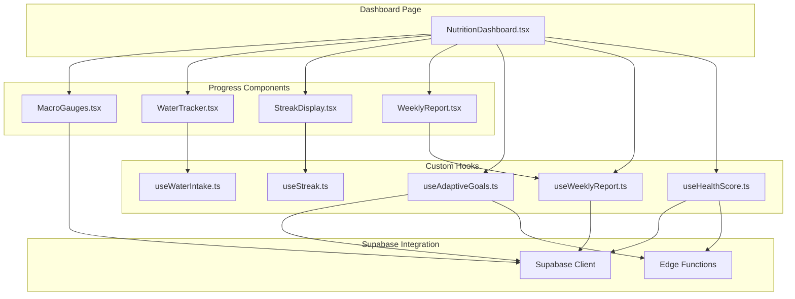
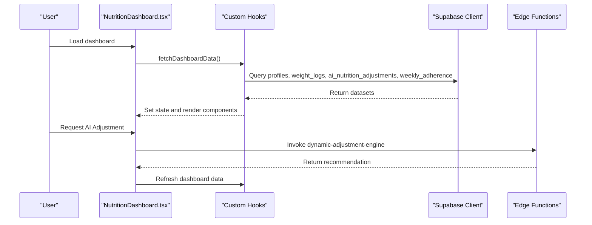
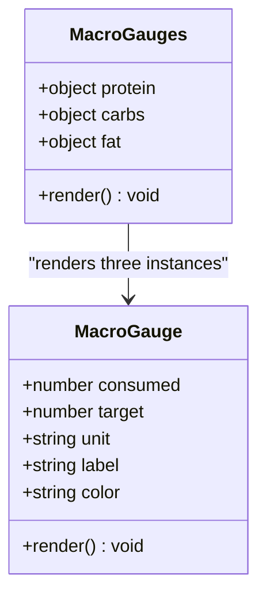
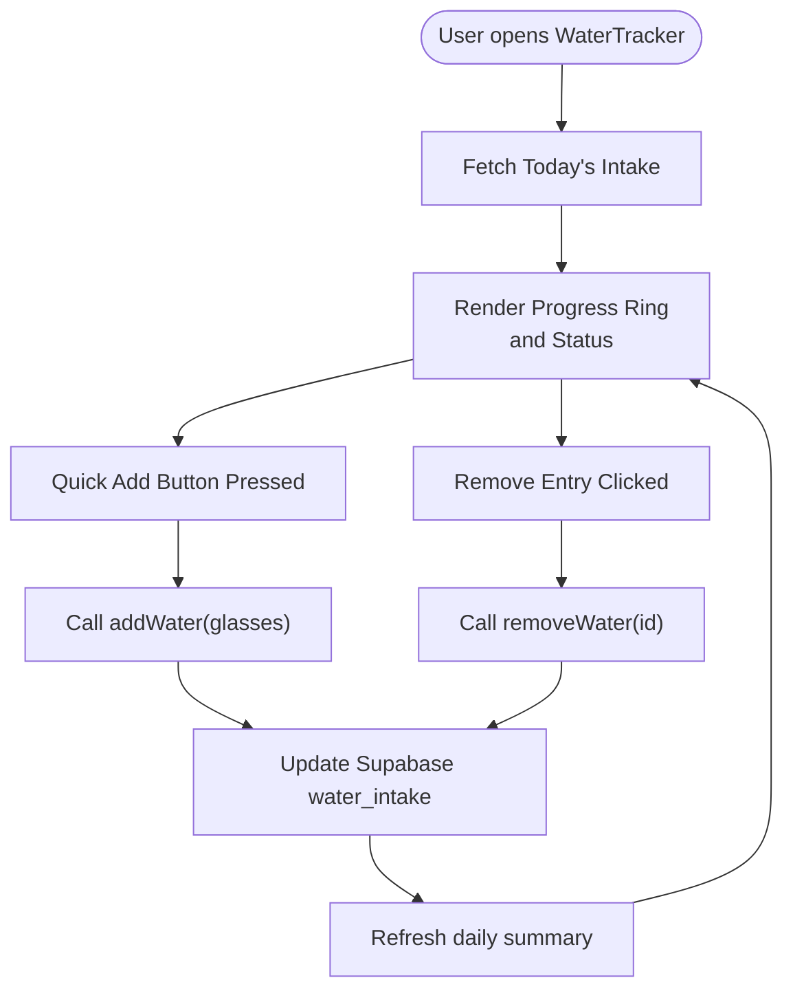
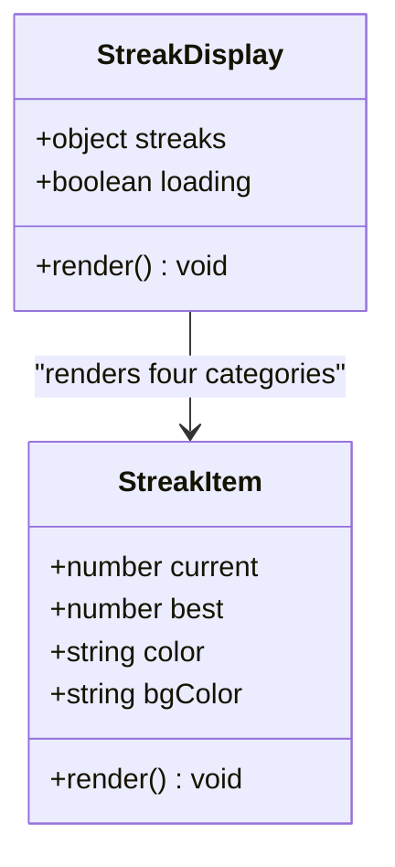
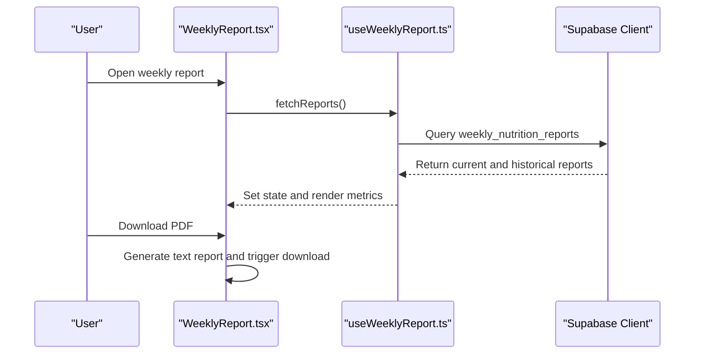
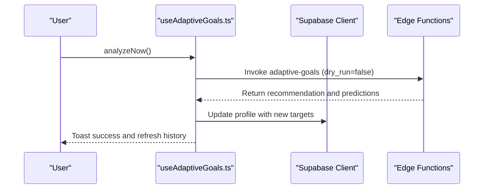
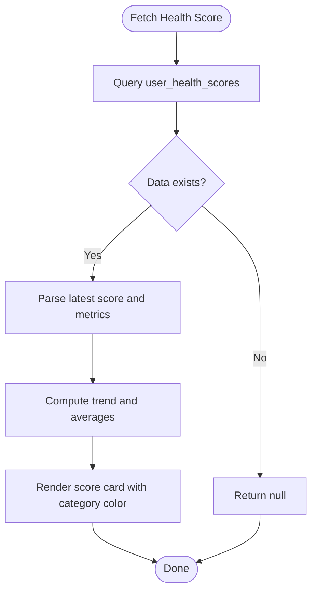
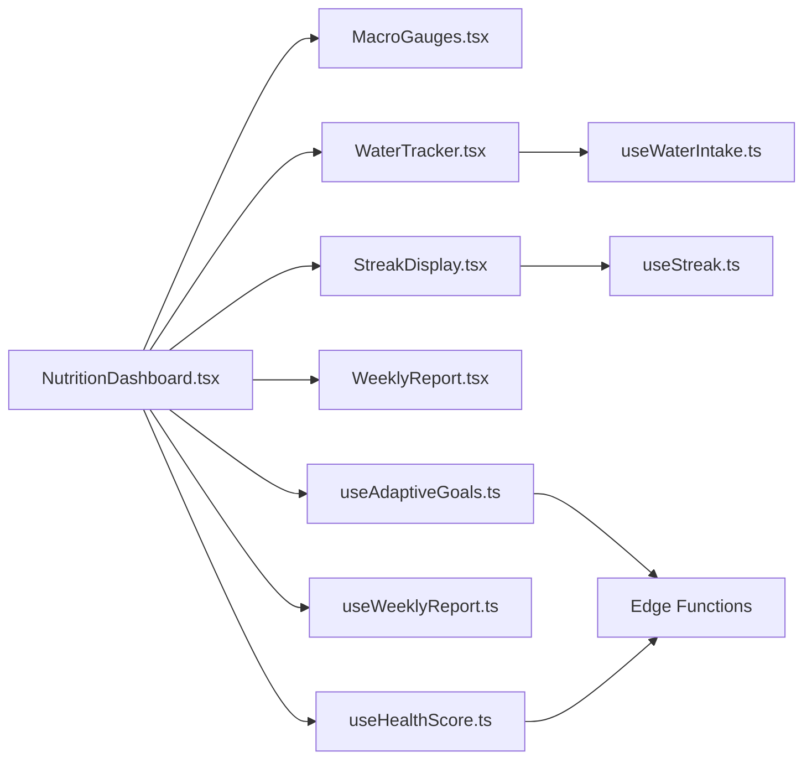

# Nutrition Tracking Dashboard

<cite>
**Referenced Files in This Document**
- [NutritionDashboard.tsx](file://src/pages/dashboard/NutritionDashboard.tsx)
- [MacroGauges.tsx](file://src/components/progress/MacroGauges.tsx)
- [WaterTracker.tsx](file://src/components/progress/WaterTracker.tsx)
- [StreakDisplay.tsx](file://src/components/progress/StreakDisplay.tsx)
- [WeeklyReport.tsx](file://src/components/progress/WeeklyReport.tsx)
- [useWaterIntake.ts](file://src/hooks/useWaterIntake.ts)
- [useAdaptiveGoals.ts](file://src/hooks/useAdaptiveGoals.ts)
- [useWeeklyReport.ts](file://src/hooks/useWeeklyReport.ts)
- [useStreak.ts](file://src/hooks/useStreak.ts)
- [useHealthScore.ts](file://src/hooks/useHealthScore.ts)
</cite>

## Table of Contents
1. [Introduction](#introduction)
2. [Project Structure](#project-structure)
3. [Core Components](#core-components)
4. [Architecture Overview](#architecture-overview)
5. [Detailed Component Analysis](#detailed-component-analysis)
6. [Dependency Analysis](#dependency-analysis)
7. [Performance Considerations](#performance-considerations)
8. [Troubleshooting Guide](#troubleshooting-guide)
9. [Conclusion](#conclusion)

## Introduction
This document provides comprehensive documentation for the nutrition tracking dashboard functionality. It covers progress visualization components for macronutrient tracking (protein, carbohydrates, fats), calorie consumption monitoring, daily nutrition summaries, water intake tracking with hydration goals and reminders, streak tracking for consecutive healthy habits, weekly progress reports with trend analysis, and integration with adaptive goal recommendations and health scoring systems. The guide also includes customization examples, data visualization patterns, and integration approaches for external health devices.

## Project Structure
The nutrition dashboard functionality is implemented across several React components and custom hooks:
- Dashboard page: orchestrates data fetching and renders summary cards
- Progress components: modular widgets for macros, hydration, streaks, and weekly reports
- Hooks: encapsulate Supabase data fetching, mutations, and local state management
- Health integration: adaptive goals, weekly reports, and health score calculations

**Diagram sources**
- [NutritionDashboard.tsx:1-619](file://src/pages/dashboard/NutritionDashboard.tsx#L1-L619)
- [MacroGauges.tsx:1-133](file://src/components/progress/MacroGauges.tsx#L1-L133)
- [WaterTracker.tsx:1-172](file://src/components/progress/WaterTracker.tsx#L1-L172)
- [StreakDisplay.tsx:1-160](file://src/components/progress/StreakDisplay.tsx#L1-L160)
- [WeeklyReport.tsx:1-228](file://src/components/progress/WeeklyReport.tsx#L1-L228)
- [useWaterIntake.ts:1-148](file://src/hooks/useWaterIntake.ts#L1-L148)
- [useAdaptiveGoals.ts:1-407](file://src/hooks/useAdaptiveGoals.ts#L1-L407)
- [useWeeklyReport.ts:1-90](file://src/hooks/useWeeklyReport.ts#L1-L90)
- [useStreak.ts:1-73](file://src/hooks/useStreak.ts#L1-L73)
- [useHealthScore.ts:1-246](file://src/hooks/useHealthScore.ts#L1-L246)

**Section sources**
- [NutritionDashboard.tsx:1-619](file://src/pages/dashboard/NutritionDashboard.tsx#L1-L619)
- [MacroGauges.tsx:1-133](file://src/components/progress/MacroGauges.tsx#L1-L133)
- [WaterTracker.tsx:1-172](file://src/components/progress/WaterTracker.tsx#L1-L172)
- [StreakDisplay.tsx:1-160](file://src/components/progress/StreakDisplay.tsx#L1-L160)
- [WeeklyReport.tsx:1-228](file://src/components/progress/WeeklyReport.tsx#L1-L228)
- [useWaterIntake.ts:1-148](file://src/hooks/useWaterIntake.ts#L1-L148)
- [useAdaptiveGoals.ts:1-407](file://src/hooks/useAdaptiveGoals.ts#L1-L407)
- [useWeeklyReport.ts:1-90](file://src/hooks/useWeeklyReport.ts#L1-L90)
- [useStreak.ts:1-73](file://src/hooks/useStreak.ts#L1-L73)
- [useHealthScore.ts:1-246](file://src/hooks/useHealthScore.ts#L1-L246)

## Core Components
This section outlines the primary components that power the nutrition dashboard:

- Macro Nutrient Tracking: Circular progress gauges for protein, carbs, and fats with target-based percentage visualization.
- Calorie Consumption Monitoring: Centralized display of daily calorie targets and adherence metrics.
- Daily Nutrition Summaries: Pie charts and progress bars for macro distribution and weekly adherence.
- Water Intake Tracking: Hydration progress ring with quick-add buttons, recent logs, and status messaging.
- Streak Tracking: Multi-category streak counters with visual fire badges for consistency milestones.
- Weekly Progress Reports: Personalized insights, trend analysis, and downloadable summaries.
- Adaptive Goal Recommendations: AI-driven adjustments with confidence scores and prediction models.
- Health Score Calculations: Composite metrics with category-based coloring and trend analytics.

**Section sources**
- [MacroGauges.tsx:97-133](file://src/components/progress/MacroGauges.tsx#L97-L133)
- [NutritionDashboard.tsx:266-419](file://src/pages/dashboard/NutritionDashboard.tsx#L266-L419)
- [WaterTracker.tsx:21-172](file://src/components/progress/WaterTracker.tsx#L21-L172)
- [StreakDisplay.tsx:46-160](file://src/components/progress/StreakDisplay.tsx#L46-L160)
- [WeeklyReport.tsx:32-228](file://src/components/progress/WeeklyReport.tsx#L32-L228)
- [useAdaptiveGoals.ts:62-407](file://src/hooks/useAdaptiveGoals.ts#L62-L407)
- [useHealthScore.ts:35-246](file://src/hooks/useHealthScore.ts#L35-L246)

## Architecture Overview
The dashboard follows a modular architecture:
- Page-level orchestration: The dashboard page fetches user profiles, weight logs, AI adjustments, and weekly adherence.
- Component-level rendering: Progress components render visualizations using Recharts and custom SVG.
- Hook-level data management: Custom hooks encapsulate Supabase queries, mutations, and edge function invocations.
- Edge function integration: Adaptive goals and health score calculations are computed server-side for scalability and accuracy.

**Diagram sources**
- [NutritionDashboard.tsx:96-185](file://src/pages/dashboard/NutritionDashboard.tsx#L96-L185)
- [useAdaptiveGoals.ts:137-178](file://src/hooks/useAdaptiveGoals.ts#L137-L178)

**Section sources**
- [NutritionDashboard.tsx:72-185](file://src/pages/dashboard/NutritionDashboard.tsx#L72-L185)
- [useAdaptiveGoals.ts:137-178](file://src/hooks/useAdaptiveGoals.ts#L137-L178)

## Detailed Component Analysis

### Macro Nutrient Tracking
The macro tracking component provides circular progress indicators for protein, carbs, and fats. It calculates completion percentages and displays them with color-coded themes.

**Diagram sources**
- [MacroGauges.tsx:12-133](file://src/components/progress/MacroGauges.tsx#L12-L133)

Implementation highlights:
- Percentage calculation capped at 100% to prevent overflow visuals.
- SVG-based circular progress with configurable stroke dasharrays for smooth animations.
- Color mapping for consistent visual semantics across nutrients.

**Section sources**
- [MacroGauges.tsx:12-133](file://src/components/progress/MacroGauges.tsx#L12-L133)

### Water Intake Tracking
The water tracker manages daily hydration goals, quick-add actions, and recent logs with immediate feedback.

**Diagram sources**
- [WaterTracker.tsx:21-172](file://src/components/progress/WaterTracker.tsx#L21-L172)
- [useWaterIntake.ts:18-148](file://src/hooks/useWaterIntake.ts#L18-L148)

Key features:
- Quick-add buttons for common increments (1–4 glasses).
- Real-time progress ring updates with percentage thresholds for status messages.
- Recent logs with individual removal capability.

**Section sources**
- [WaterTracker.tsx:21-172](file://src/components/progress/WaterTracker.tsx#L21-L172)
- [useWaterIntake.ts:18-148](file://src/hooks/useWaterIntake.ts#L18-L148)

### Streak Tracking
The streak display aggregates multiple habit streaks and presents them with visual emphasis for long-term consistency.

**Diagram sources**
- [StreakDisplay.tsx:46-160](file://src/components/progress/StreakDisplay.tsx#L46-L160)

Behavior:
- On-fire indicator activates at 7-day streaks.
- Aggregate total streaks highlighted for overall consistency recognition.
- Empty-state messaging encourages users to start logging.

**Section sources**
- [StreakDisplay.tsx:46-160](file://src/components/progress/StreakDisplay.tsx#L46-L160)
- [useStreak.ts:11-73](file://src/hooks/useStreak.ts#L11-L73)

### Weekly Progress Reports
The weekly report component synthesizes performance metrics, trends, and personalized insights.

**Diagram sources**
- [WeeklyReport.tsx:32-228](file://src/components/progress/WeeklyReport.tsx#L32-L228)
- [useWeeklyReport.ts:19-90](file://src/hooks/useWeeklyReport.ts#L19-L90)

Highlights:
- Consistency score progress bar and trend visualization.
- Highlights and recommendations extracted from report_data.
- Historical trend bars for recent weeks with hover details.

**Section sources**
- [WeeklyReport.tsx:32-228](file://src/components/progress/WeeklyReport.tsx#L32-L228)
- [useWeeklyReport.ts:19-90](file://src/hooks/useWeeklyReport.ts#L19-L90)

### Adaptive Goal Recommendations
The adaptive goals system provides AI-driven nutrition adjustments with confidence and prediction capabilities.

**Diagram sources**
- [useAdaptiveGoals.ts:327-377](file://src/hooks/useAdaptiveGoals.ts#L327-L377)
- [useAdaptiveGoals.ts:246-286](file://src/hooks/useAdaptiveGoals.ts#L246-L286)

Capabilities:
- Dry-run mode for previewing adjustments.
- Prediction model for future weight trends.
- Settings management for adjustment frequency and calorie bounds.
- History tracking with applied/unapplied statuses.

**Section sources**
- [useAdaptiveGoals.ts:62-407](file://src/hooks/useAdaptiveGoals.ts#L62-L407)

### Health Score Calculations
Health scores combine multiple metrics into a composite score with category-based interpretation.

**Diagram sources**
- [useHealthScore.ts:35-209](file://src/hooks/useHealthScore.ts#L35-L209)

Features:
- Category-based coloring (green/orange/red) for quick assessment.
- Breakdown of contributing metrics with weights.
- Manual calculation endpoint via edge function invocation.

**Section sources**
- [useHealthScore.ts:35-246](file://src/hooks/useHealthScore.ts#L35-L246)

## Dependency Analysis
The dashboard components depend on a combination of local state, Supabase data, and edge functions. Cohesion is strong within each component, while coupling is primarily through shared hooks and the Supabase client.

**Diagram sources**
- [NutritionDashboard.tsx:1-619](file://src/pages/dashboard/NutritionDashboard.tsx#L1-L619)
- [useWaterIntake.ts:1-148](file://src/hooks/useWaterIntake.ts#L1-L148)
- [useAdaptiveGoals.ts:1-407](file://src/hooks/useAdaptiveGoals.ts#L1-L407)
- [useWeeklyReport.ts:1-90](file://src/hooks/useWeeklyReport.ts#L1-L90)
- [useStreak.ts:1-73](file://src/hooks/useStreak.ts#L1-L73)
- [useHealthScore.ts:1-246](file://src/hooks/useHealthScore.ts#L1-L246)

**Section sources**
- [NutritionDashboard.tsx:1-619](file://src/pages/dashboard/NutritionDashboard.tsx#L1-L619)
- [useWaterIntake.ts:1-148](file://src/hooks/useWaterIntake.ts#L1-L148)
- [useAdaptiveGoals.ts:1-407](file://src/hooks/useAdaptiveGoals.ts#L1-L407)
- [useWeeklyReport.ts:1-90](file://src/hooks/useWeeklyReport.ts#L1-L90)
- [useStreak.ts:1-73](file://src/hooks/useStreak.ts#L1-L73)
- [useHealthScore.ts:1-246](file://src/hooks/useHealthScore.ts#L1-L246)

## Performance Considerations
- Minimize re-renders by consolidating data fetching in the dashboard page and passing derived props to child components.
- Use lazy loading for heavy charts (Recharts) and defer non-critical data until after initial render.
- Cache frequently accessed datasets (e.g., weekly adherence) to reduce redundant Supabase calls.
- Debounce user-triggered actions (e.g., hydration quick-add) to prevent rapid successive writes.
- Offload computation-heavy tasks (e.g., adaptive goals, health score calculations) to edge functions to keep the UI responsive.

## Troubleshooting Guide
Common issues and resolutions:
- Edge function availability: Adaptive goals and health score calculations rely on deployed edge functions. If CORS or network errors occur, the system gracefully disables the feature and warns the user.
- Water intake persistence: Ensure daily logs are saved under the correct date; duplicates are merged by summing glasses.
- Streak data freshness: Streaks are aggregated from a dedicated table; verify that logging events update this table consistently.
- Weekly report generation: If a report for the current week is missing, the system attempts to generate it via RPC; ensure the stored procedure exists and has proper permissions.

**Section sources**
- [useAdaptiveGoals.ts:145-161](file://src/hooks/useAdaptiveGoals.ts#L145-L161)
- [useWaterIntake.ts:58-93](file://src/hooks/useWaterIntake.ts#L58-L93)
- [useWeeklyReport.ts:60-71](file://src/hooks/useWeeklyReport.ts#L60-L71)

## Conclusion
The nutrition tracking dashboard integrates modular components with robust data hooks to deliver a comprehensive view of dietary and lifestyle progress. Its visualization patterns emphasize clarity and actionable insights, while adaptive goal recommendations and health scoring provide intelligent personalization. By leveraging edge functions and efficient caching strategies, the system remains performant and scalable for diverse user needs.