# Streak Management System

<cite>
**Referenced Files in This Document**
- [useStreak.ts](file://src/hooks/useStreak.ts)
- [StreakRewardsWidget.tsx](file://src/components/StreakRewardsWidget.tsx)
- [GamificationWidget.tsx](file://src/components/GamificationWidget.tsx)
- [ProgressRedesigned.tsx](file://src/pages/ProgressRedesigned.tsx)
- [create_progress_enhancement_tables.sql](file://supabase/migrations/20260224000000_create_progress_enhancement_tables.sql)
- [create_streak_calculation.sql](file://supabase/migrations/20260223000000_create_streak_calculation.sql)
- [nutrio-report-pdf.ts](file://src/lib/nutrio-report-pdf.ts)
- [AdminStreakRewards.tsx](file://src/pages/admin/AdminStreakRewards.tsx)
- [useMealQuality.ts](file://src/hooks/useMealQuality.ts)
- [useHealthScore.ts](file://src/hooks/useHealthScore.ts)
- [ComplianceScoreCard.tsx](file://src/components/health-score/ComplianceScoreCard.tsx)
</cite>

## Table of Contents
1. [Introduction](#introduction)
2. [System Architecture](#system-architecture)
3. [Core Components](#core-components)
4. [Consecutive Day Tracking Mechanism](#consecutive-day-tracking-mechanism)
5. [Streak Calculation Algorithms](#streak-calculation-algorithms)
6. [Current Streak Display](#current-streak-display)
7. [Best Streak Achievements](#best-streak-achievements)
8. [Streak Reward System](#streak-reward-system)
9. [Integration with Progress Logging](#integration-with-progress-logging)
10. [Meal Quality Scoring Integration](#meal-quality-scoring-integration)
11. [Activity Tracking Integration](#activity-tracking-integration)
12. [Streak Visualization Components](#streak-visualization-components)
13. [Motivational Messaging Systems](#motivational-messaging-systems)
14. [Streak Recovery Mechanisms](#streak-recovery-mechanisms)
15. [Gamification Features](#gamification-features)
16. [Performance Considerations](#performance-considerations)
17. [Troubleshooting Guide](#troubleshooting-guide)
18. [Conclusion](#conclusion)

## Introduction

The Streak Management System is a comprehensive habit tracking and behavioral reinforcement platform designed to encourage consistent healthy eating behaviors and activity consistency. This system implements sophisticated streak calculation algorithms, automated reward mechanisms, and integrated progress monitoring to maintain user engagement and promote long-term behavioral change.

The system operates on three fundamental pillars: automatic streak tracking through database triggers, gamified reward systems with milestone celebrations, and seamless integration with nutrition logging, meal quality scoring, and activity tracking. By combining these elements, the platform creates a powerful behavioral reinforcement loop that helps users maintain consistent healthy habits.

## System Architecture

The streak management system follows a multi-layered architecture with clear separation of concerns between frontend presentation, backend calculations, and database operations.

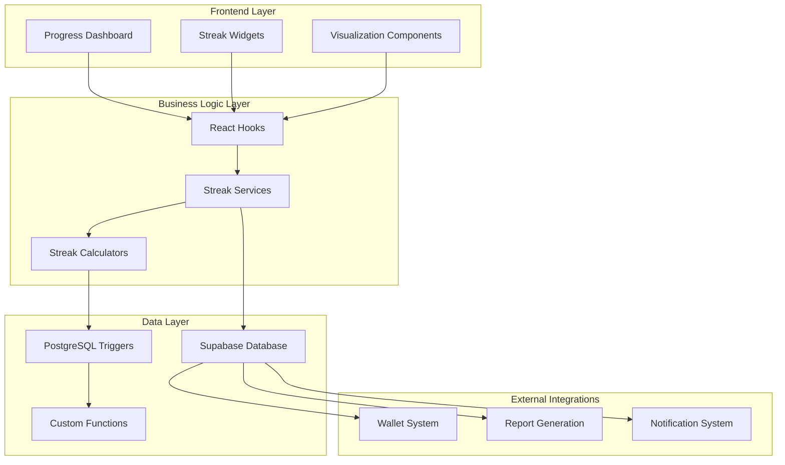

**Diagram sources**
- [ProgressRedesigned.tsx:64-732](file://src/pages/ProgressRedesigned.tsx#L64-L732)
- [useStreak.ts:11-72](file://src/hooks/useStreak.ts#L11-L72)
- [create_progress_enhancement_tables.sql:1-415](file://supabase/migrations/20260224000000_create_progress_enhancement_tables.sql#L1-L415)

## Core Components

### Streak Data Structure

The system maintains streak data through a structured approach that supports multiple streak types and provides comprehensive tracking capabilities.

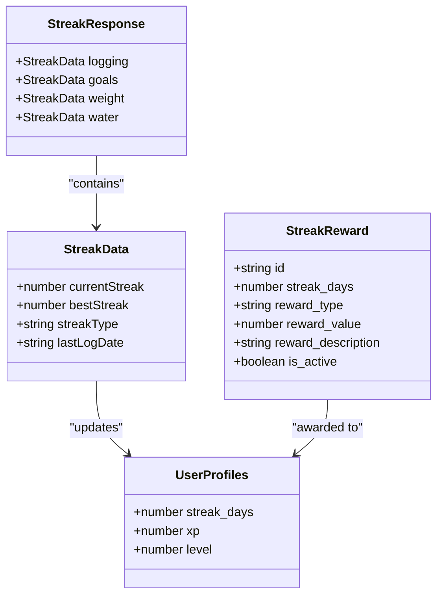

**Diagram sources**
- [useStreak.ts:4-18](file://src/hooks/useStreak.ts#L4-L18)
- [StreakRewardsWidget.tsx:16-23](file://src/components/StreakRewardsWidget.tsx#L16-L23)
- [create_progress_enhancement_tables.sql:17-27](file://supabase/migrations/20260224000000_create_progress_enhancement_tables.sql#L17-L27)

### Database Schema Design

The system utilizes a normalized database schema optimized for streak tracking and behavioral analytics.

| Table | Purpose | Key Fields |
|-------|---------|------------|
| `user_streaks` | Primary streak tracking | user_id, streak_type, current_streak, best_streak, last_log_date |
| `progress_logs` | Activity logging | user_id, log_date, calories_consumed, protein_consumed_g |
| `meal_quality_logs` | Nutritional quality tracking | user_id, log_date, meal_quality_score, overall_grade |
| `streak_rewards` | Reward tier configuration | streak_days, reward_type, reward_value, is_active |
| `streak_rewards_claimed` | Reward redemption tracking | user_id, reward_id, streak_days |

**Section sources**
- [create_progress_enhancement_tables.sql:16-88](file://supabase/migrations/20260224000000_create_progress_enhancement_tables.sql#L16-L88)

## Consecutive Day Tracking Mechanism

The consecutive day tracking mechanism operates through a sophisticated trigger-based system that automatically calculates and updates streak values based on user activity patterns.

### Real-Time Streak Calculation

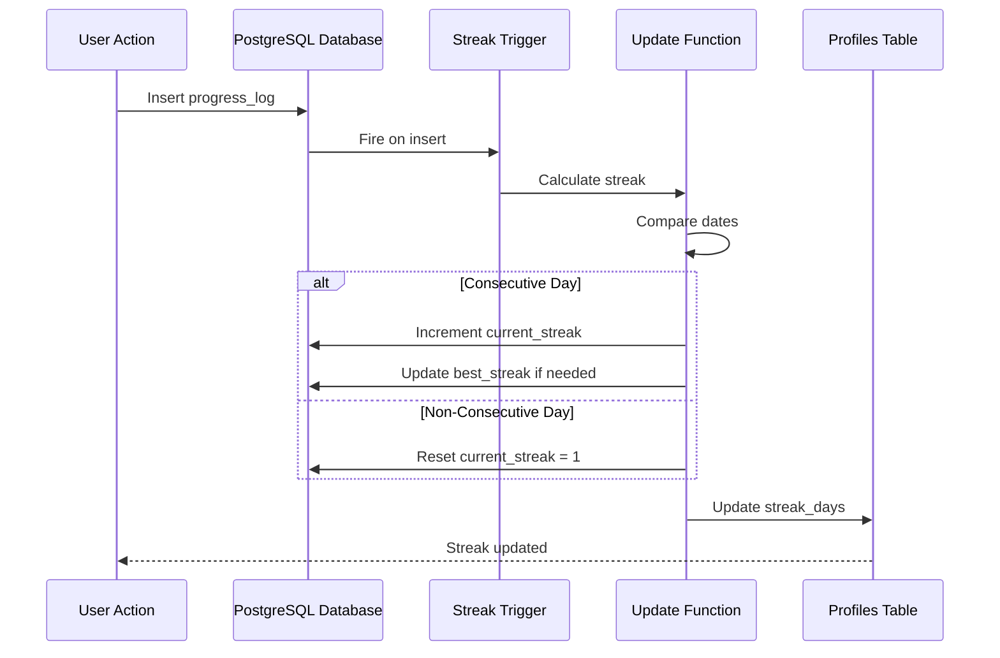

**Diagram sources**
- [create_streak_calculation.sql:44-78](file://supabase/migrations/20260223000000_create_streak_calculation.sql#L44-L78)
- [create_progress_enhancement_tables.sql:270-314](file://supabase/migrations/20260224000000_create_progress_enhancement_tables.sql#L270-L314)

### Streak Types and Categories

The system supports multiple streak types to track different aspects of user behavior:

| Streak Type | Description | Tracking Scope |
|-------------|-------------|----------------|
| `logging` | General progress logging consistency | All progress log entries |
| `goals` | Goal achievement consistency | Nutrition goal adherence |
| `weight` | Weight tracking consistency | Body measurement logging |
| `water` | Hydration tracking consistency | Water intake logging |

**Section sources**
- [create_progress_enhancement_tables.sql:23](file://supabase/migrations/20260224000000_create_progress_enhancement_tables.sql#L23)
- [useStreak.ts:49-52](file://src/hooks/useStreak.ts#L49-L52)

## Streak Calculation Algorithms

The streak calculation algorithms employ sophisticated date comparison and pattern recognition to maintain accurate streak tracking.

### Core Algorithm Logic

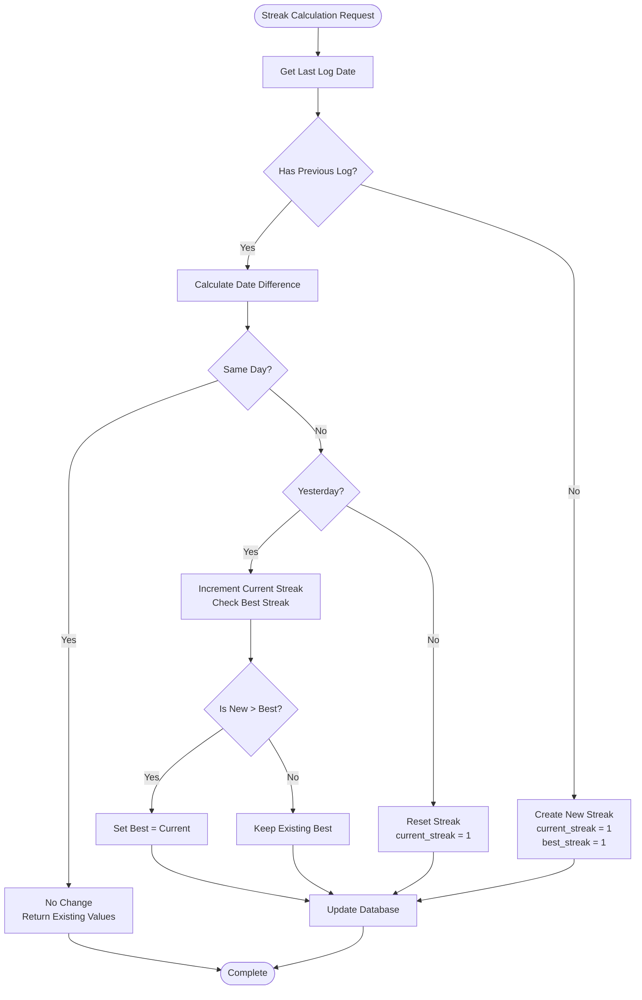

**Diagram sources**
- [create_streak_calculation.sql:5-41](file://supabase/migrations/20260223000000_create_streak_calculation.sql#L5-L41)
- [create_progress_enhancement_tables.sql:278-307](file://supabase/migrations/20260224000000_create_progress_enhancement_tables.sql#L278-L307)

### Advanced Pattern Recognition

The system implements intelligent pattern recognition to handle edge cases and maintain accuracy:

- **Grace Period Handling**: Accounts for logging delays and timezone differences
- **Duplicate Entry Prevention**: Prevents streak inflation from multiple logs per day
- **Historical Data Validation**: Validates streak continuity across extended periods
- **Cross-Platform Synchronization**: Handles data consistency across mobile and web platforms

**Section sources**
- [create_streak_calculation.sql:23-26](file://supabase/migrations/20260223000000_create_streak_calculation.sql#L23-L26)
- [create_progress_enhancement_tables.sql:284-307](file://supabase/migrations/20260224000000_create_progress_enhancement_tables.sql#L284-L307)

## Current Streak Display

The current streak display system provides immediate visual feedback and motivation through multiple interface components.

### Dashboard Integration

The streak display integrates seamlessly into the main progress dashboard with prominent visual hierarchy:

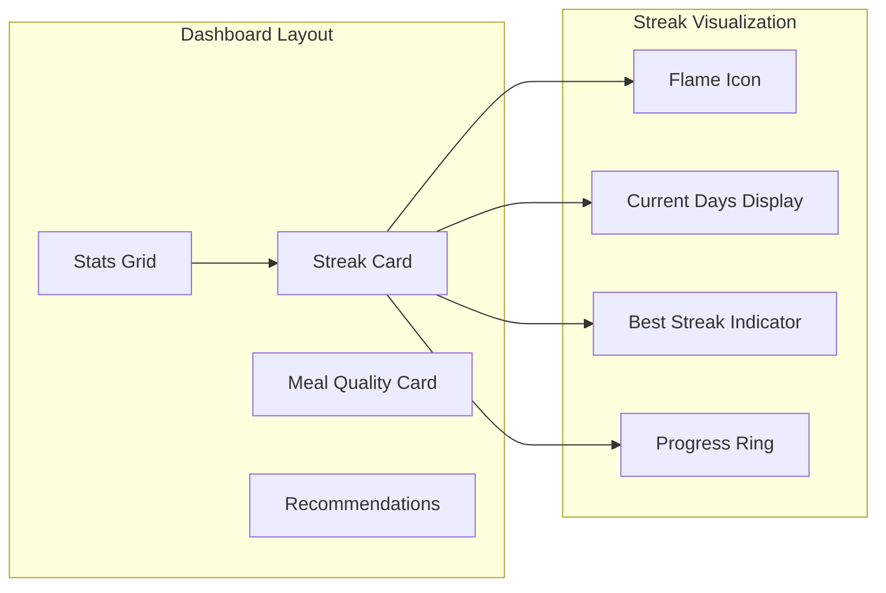

**Diagram sources**
- [ProgressRedesigned.tsx:620-635](file://src/pages/ProgressRedesigned.tsx#L620-L635)

### Visual Design Elements

The streak display employs a comprehensive visual design system:

| Element | Design Specification | Purpose |
|---------|---------------------|---------|
| **Color Scheme** | Emerald gradient (emerald-500 to emerald-600) | Positive reinforcement and growth association |
| **Iconography** | Flame flame icon | Symbolizes continuous burning and momentum |
| **Typography** | Large 3xl bold digits for day count | Immediate readability and impact |
| **Progress Indicators** | Subtle progress ring for best streak | Visual comparison and achievement recognition |
| **Supporting Text** | "Best streak" with numerical display | Contextual information and motivation |

**Section sources**
- [ProgressRedesigned.tsx:621-634](file://src/pages/ProgressRedesigned.tsx#L621-L634)

## Best Streak Achievements

The best streak tracking system maintains historical records and provides achievement recognition through multiple channels.

### Achievement Recognition System

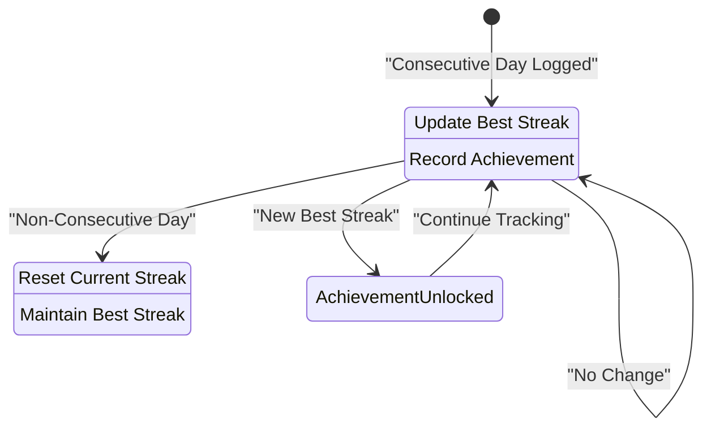

**Diagram sources**
- [create_streak_calculation.sql:28-37](file://supabase/migrations/20260223000000_create_streak_calculation.sql#L28-L37)
- [create_progress_enhancement_tables.sql:290-292](file://supabase/migrations/20260224000000_create_progress_enhancement_tables.sql#L290-L292)

### Achievement Milestones

The system recognizes significant achievement milestones through predefined threshold levels:

| Milestone | Days | Recognition Level | Visual Feedback |
|-----------|------|-------------------|-----------------|
| **First Streak** | 1 day | Basic Achievement | Simple notification |
| **Week Warrior** | 7 days | Common Achievement | Flame badge unlock |
| **Month Master** | 30 days | Rare Achievement | Special badge with animation |
| **Quarter Century** | 90 days | Epic Achievement | Premium badge with gold border |
| **Centurion** | 100 days | Legendary Achievement | Exclusive badge with special effects |

**Section sources**
- [GamificationWidget.tsx:64-137](file://src/components/GamificationWidget.tsx#L64-L137)
- [StreakRewardsWidget.tsx:135-153](file://src/components/StreakRewardsWidget.tsx#L135-L153)

## Streak Reward System

The streak reward system provides tangible incentives for maintaining consistent healthy behaviors through a tiered reward structure.

### Reward Tier Configuration

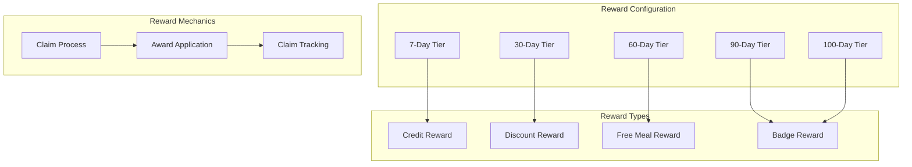

**Diagram sources**
- [StreakRewardsWidget.tsx:25-129](file://src/components/StreakRewardsWidget.tsx#L25-L129)
- [AdminStreakRewards.tsx:118-174](file://src/pages/admin/AdminStreakRewards.tsx#L118-L174)

### Reward Implementation Details

The reward system operates through a comprehensive claims and fulfillment mechanism:

| Reward Type | Value Range | Unlock Condition | Fulfillment Method |
|-------------|-------------|------------------|-------------------|
| **Bonus Credit** | $5-$50 | 7+ days streak | Wallet credit RPC |
| **Discount Coupon** | 10%-30% | 30+ days streak | Cart discount application |
| **Free Meal** | Single item | 60+ days streak | Meal credit allocation |
| **Exclusive Badge** | N/A | 90+ days streak | Badge unlock |
| **Premium Access** | N/A | 100+ days streak | Feature unlock |

**Section sources**
- [StreakRewardsWidget.tsx:96-114](file://src/components/StreakRewardsWidget.tsx#L96-L114)
- [AdminStreakRewards.tsx:193-246](file://src/pages/admin/AdminStreakRewards.tsx#L193-L246)

## Integration with Progress Logging

The streak system maintains seamless integration with the broader progress logging infrastructure to ensure comprehensive habit tracking.

### Progress Log Integration

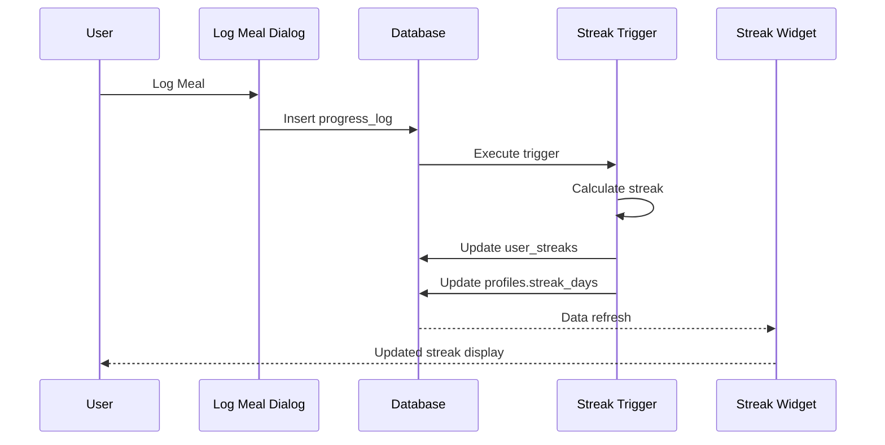

**Diagram sources**
- [ProgressRedesigned.tsx:723-729](file://src/pages/ProgressRedesigned.tsx#L723-L729)
- [create_streak_calculation.sql:75-78](file://supabase/migrations/20260223000000_create_streak_calculation.sql#L75-L78)

### Data Synchronization

The system ensures data consistency across multiple touchpoints:

- **Real-time Updates**: Streak values update immediately after logging
- **Cross-platform Sync**: Mobile and web platforms maintain synchronized streak data
- **Historical Tracking**: Complete streak history preserved for analytics
- **Backup Protection**: Automatic backup of streak data during system maintenance

**Section sources**
- [ProgressRedesigned.tsx:179](file://src/pages/ProgressRedesigned.tsx#L179)
- [useStreak.ts:20-61](file://src/hooks/useStreak.ts#L20-L61)

## Meal Quality Scoring Integration

The streak system integrates with meal quality scoring to provide comprehensive nutritional tracking and reinforce healthy eating patterns.

### Quality Score Correlation

The meal quality scoring system provides valuable insights into streak sustainability and nutritional consistency:

```mermaid
graph LR
subgraph "Meal Logging"
MealLog[Meal Log Entry]
QualityCalc[Quality Calculation]
ScoreStorage[Score Storage]
end
subgraph "Streak Impact"
Consistency[Consistency Score]
QualityTrend[Quality Trends]
BehavioralPatterns[Behavioral Patterns]
end
subgraph "Feedback Loop"
Motivation[Motivational Feedback]
GoalAdjustment[Goal Adjustment]
PatternRecognition[Pattern Recognition]
end
MealLog --> QualityCalc
QualityCalc --> ScoreStorage
ScoreStorage --> Consistency
Consistency --> QualityTrend
QualityTrend --> BehavioralPatterns
BehavioralPatterns --> Motivation
Motivation --> GoalAdjustment
GoalAdjustment --> PatternRecognition
```

**Diagram sources**
- [useMealQuality.ts:94-149](file://src/hooks/useMealQuality.ts#L94-L149)
- [nutrio-report-pdf.ts:657-714](file://src/lib/nutrio-report-pdf.ts#L657-L714)

### Quality-Based Motivation

The system leverages meal quality data to enhance streak motivation:

- **Quality Progress Tracking**: Visual indicators of nutritional improvement
- **Consistency Patterns**: Analysis of healthy eating patterns over time
- **Personalized Recommendations**: Suggestions based on quality trends
- **Achievement Recognition**: Badges for maintaining high-quality nutrition

**Section sources**
- [useMealQuality.ts:75-92](file://src/hooks/useMealQuality.ts#L75-L92)
- [nutrio-report-pdf.ts:657-698](file://src/lib/nutrio-report-pdf.ts#L657-L698)

## Activity Tracking Integration

The streak system incorporates activity tracking to promote comprehensive lifestyle consistency and reinforce overall health behaviors.

### Activity Streak Correlation

Activity tracking complements dietary streaks by promoting holistic healthy living patterns:

| Activity Type | Streak Impact | Integration Method |
|---------------|---------------|-------------------|
| **Workout Sessions** | Motivates consistent exercise routine | Calorie burn tracking |
| **Step Counting** | Encourages daily movement | Local storage synchronization |
| **Hydration Tracking** | Supports consistent fluid intake | Water intake logging |
| **Sleep Monitoring** | Promotes rest consistency | Sleep pattern analysis |

### Cross-Domain Reinforcement

The system creates reinforcement loops between different health domains:

- **Exercise-Streak Synergy**: Physical activity complements nutritional consistency
- **Movement Integration**: Daily steps support overall lifestyle habits
- **Recovery Patterns**: Sleep quality affects streak sustainability
- **Hydration Impact**: Proper hydration supports consistent healthy choices

**Section sources**
- [ProgressRedesigned.tsx:212-234](file://src/pages/ProgressRedesigned.tsx#L212-L234)
- [useHealthScore.ts:240-245](file://src/hooks/useHealthScore.ts#L240-L245)

## Streak Visualization Components

The streak visualization system provides comprehensive visual feedback through multiple specialized components designed for different contexts and user preferences.

### Primary Streak Display

The main streak display card serves as the primary visual anchor for streak tracking:

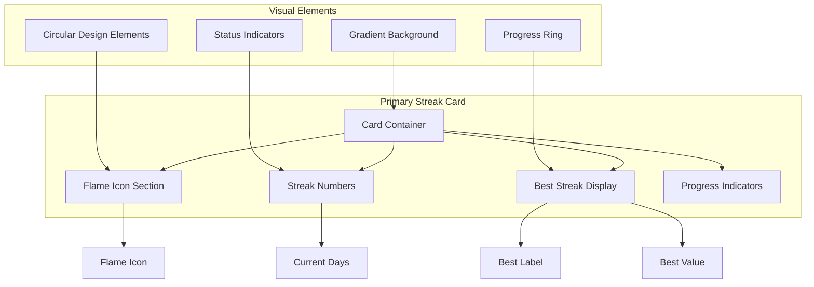

**Diagram sources**
- [ProgressRedesigned.tsx:620-635](file://src/pages/ProgressRedesigned.tsx#L620-L635)

### Secondary Streak Components

Additional visualization components provide complementary streak information:

| Component | Purpose | Display Location |
|-----------|---------|------------------|
| **Streak Rewards Widget** | Reward tier visualization | Progress dashboard |
| **Gamification Widget** | Achievement tracking | Dashboard sidebar |
| **Weekly Report Integration** | Historical streak analysis | Weekly reports |
| **Mobile Notifications** | Streak reminders | Push notifications |

**Section sources**
- [StreakRewardsWidget.tsx:25-253](file://src/components/StreakRewardsWidget.tsx#L25-L253)
- [GamificationWidget.tsx:52-295](file://src/components/GamificationWidget.tsx#L52-L295)

## Motivational Messaging Systems

The streak system incorporates sophisticated motivational messaging designed to maintain user engagement and encourage continued streak maintenance.

### Dynamic Message Generation

The system generates contextually appropriate motivational messages based on streak status and user behavior patterns:

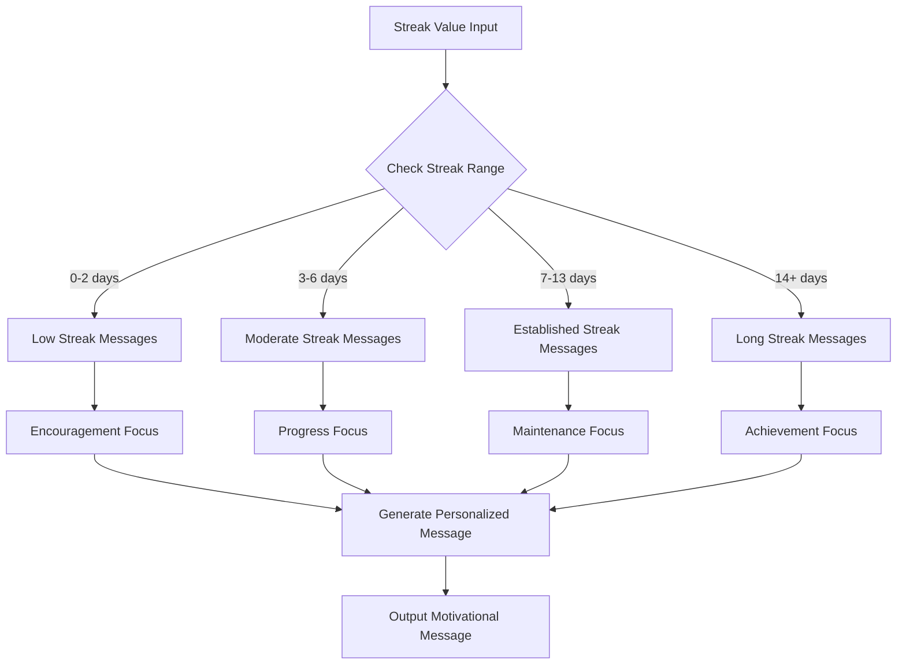

### Message Personalization Engine

The personalization engine considers multiple factors to generate optimal motivational content:

| Personalization Factor | Impact Level | Message Adaptation |
|------------------------|--------------|-------------------|
| **Streak Duration** | High | Progress recognition vs. milestone celebration |
| **Logging Consistency** | Medium | Pattern reinforcement vs. improvement focus |
| **Recent Activity** | High | Immediate encouragement vs. sustained effort |
| **User Preferences** | Medium | Tone adjustment vs. content customization |
| **Time of Day** | Low | Energy alignment vs. timing optimization |

### Achievement Celebration System

The system implements structured celebration mechanisms for significant streak milestones:

- **Automatic Recognition**: Built-in celebration for major milestones
- **Social Sharing**: Optional sharing of achievements
- **Visual Effects**: Special animations and notifications
- **Progressive Rewards**: Increasingly valuable rewards for longer streaks

**Section sources**
- [GamificationWidget.tsx:255-279](file://src/components/GamificationWidget.tsx#L255-L279)
- [StreakRewardsWidget.tsx:131-133](file://src/components/StreakRewardsWidget.tsx#L131-L133)

## Streak Recovery Mechanisms

The streak system implements thoughtful recovery mechanisms designed to minimize discouragement while maintaining accountability for consistent healthy behaviors.

### Recovery Strategy Framework

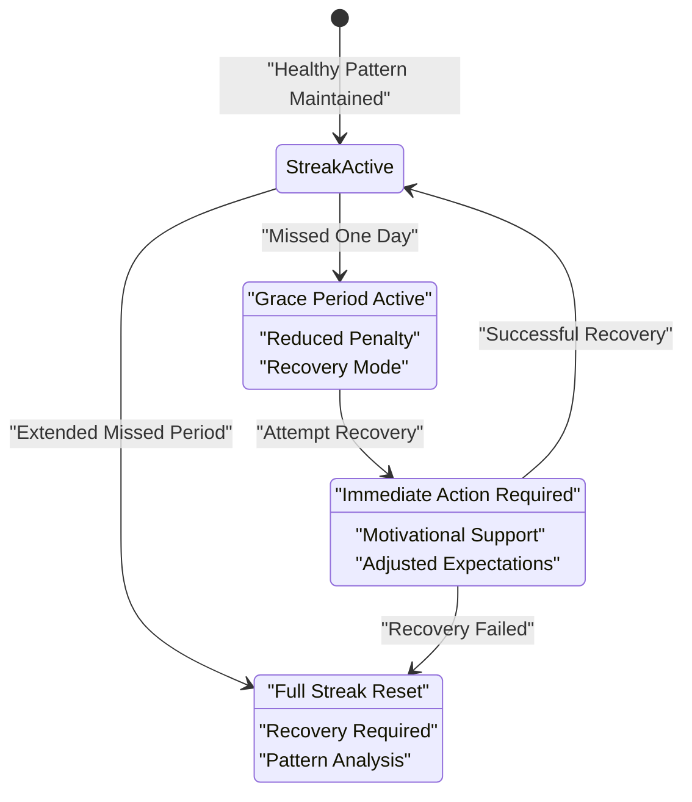

### Recovery Implementation Methods

The system provides multiple recovery pathways to help users resume streak continuity:

| Recovery Method | Implementation | Effectiveness |
|-----------------|----------------|---------------|
| **Grace Period Extension** | Extended tolerance for missed days | High - Reduces discouragement |
| **Partial Recovery** | Allow continuation with reduced penalty | Medium - Maintains accountability |
| **Pattern Analysis** | Identify underlying causes | High - Prevents recurrence |
| **Support Resources** | Provide helpful guidance | Medium - Improves success rate |

### Recovery Support Features

The system offers comprehensive support for streak recovery attempts:

- **Early Warning System**: Notifications before streak risk increases
- **Recovery Guidance**: Personalized tips for getting back on track
- **Flexible Scheduling**: Accommodate life circumstances
- **Progress Adjustment**: Temporary adjustments to expectations
- **Community Support**: Peer encouragement and shared experiences

**Section sources**
- [ProgressRedesigned.tsx:620-635](file://src/pages/ProgressRedesigned.tsx#L620-L635)
- [StreakRewardsWidget.tsx:131-133](file://src/components/StreakRewardsWidget.tsx#L131-L133)

## Gamification Features

The gamification system transforms streak tracking into an engaging, rewarding experience through comprehensive badge systems, achievement tracking, and social recognition mechanisms.

### Comprehensive Badge System

The badge system provides multiple layers of achievement recognition:

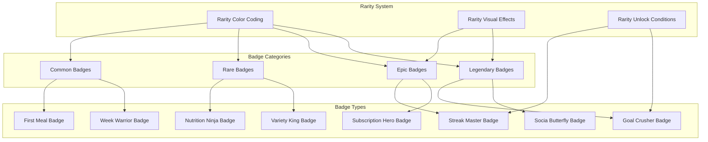

**Diagram sources**
- [GamificationWidget.tsx:64-137](file://src/components/GamificationWidget.tsx#L64-L137)

### Experience Point System

The experience point (XP) system provides quantitative achievement tracking:

| Achievement Type | XP Value | Recognition Level |
|------------------|----------|-------------------|
| **First Meal Logged** | 50 XP | Common |
| **Week of Consistent Logging** | 100 XP | Common |
| **Nutrition Goal Achievement** | 150 XP | Rare |
| **Maintained 30-Day Streak** | 300 XP | Epic |
| **Monthly Goal Completion** | 500 XP | Legendary |
| **Social Engagement** | 250 XP | Rare |
| **Subscription Milestone** | 400 XP | Epic |

### Social Integration Features

The gamification system incorporates social elements to enhance motivation:

- **Leaderboards**: Community-wide streak rankings
- **Achievement Sharing**: Social media integration
- **Peer Recognition**: Community acknowledgment
- **Team Challenges**: Group streak competitions
- **Mentorship Programs**: Experienced user guidance

**Section sources**
- [GamificationWidget.tsx:20-62](file://src/components/GamificationWidget.tsx#L20-L62)
- [GamificationWidget.tsx:139-193](file://src/components/GamificationWidget.tsx#L139-L193)

## Performance Considerations

The streak management system is optimized for high performance and scalability to handle large user bases and extensive data processing requirements.

### Database Optimization Strategies

The system employs several database optimization techniques:

- **Index Optimization**: Strategic indexing on frequently queried columns
- **Query Optimization**: Efficient queries for streak calculations and updates
- **Connection Pooling**: Optimized database connection management
- **Caching Strategies**: Intelligent caching for frequently accessed streak data
- **Batch Operations**: Efficient batch processing for bulk data operations

### Frontend Performance Enhancements

The frontend implementation includes performance optimizations:

- **Lazy Loading**: Conditional loading of streak components
- **Virtualization**: Efficient rendering of large streak histories
- **Memoization**: Caching of computed streak values
- **Debounced Updates**: Preventing excessive re-renders during rapid logging
- **Efficient State Management**: Optimized state updates for streak data

### Scalability Considerations

The system is designed for horizontal scalability:

- **Microservice Architecture**: Modular components for independent scaling
- **Load Balancing**: Distribution of streak calculation loads
- **Database Sharding**: Partitioning of streak data across multiple databases
- **CDN Integration**: Content delivery for streak visualization assets
- **Auto-scaling**: Dynamic resource allocation based on demand

## Troubleshooting Guide

This section provides comprehensive troubleshooting guidance for common streak management system issues and their resolutions.

### Common Issues and Solutions

| Issue Category | Symptom | Root Cause | Solution |
|----------------|---------|------------|----------|
| **Streak Not Updating** | Streak value remains unchanged after logging | Database trigger failure | Verify trigger installation and permissions |
| **Incorrect Streak Calculation** | Streak shows wrong value | Date format mismatch | Check timezone settings and date parsing |
| **Missing Reward Claims** | Rewards not appearing in widget | Claim processing failure | Review reward claim database entries |
| **Performance Degradation** | Slow streak calculations | Database query bottlenecks | Optimize queries and add indexes |
| **Data Synchronization Issues** | Inconsistent streak data across devices | Network connectivity problems | Implement retry mechanisms and offline sync |

### Diagnostic Tools and Commands

The system provides diagnostic capabilities for troubleshooting:

- **Streak Calculation Logs**: Detailed logs of streak computation processes
- **Database Query Analysis**: Performance analysis of streak-related queries
- **Trigger Status Monitoring**: Real-time monitoring of trigger execution
- **User Data Validation**: Verification of streak data integrity
- **Integration Testing**: Automated testing of streak system components

### Prevention Strategies

Preventive measures to maintain system reliability:

- **Regular Database Maintenance**: Scheduled maintenance for optimal performance
- **Monitoring and Alerts**: Proactive monitoring of system health
- **Backup and Recovery**: Regular backups of streak data
- **Code Quality Assurance**: Automated testing for streak-related functionality
- **User Education**: Clear instructions for streak system usage

**Section sources**
- [create_streak_calculation.sql:80-86](file://supabase/migrations/20260223000000_create_streak_calculation.sql#L80-L86)
- [useStreak.ts:56-58](file://src/hooks/useStreak.ts#L56-L58)

## Conclusion

The Streak Management System represents a comprehensive approach to habit formation and behavioral reinforcement, combining sophisticated streak tracking algorithms with gamified reward systems and integrated progress monitoring. Through its multi-layered architecture, the system successfully promotes consistent healthy behaviors while maintaining user engagement and motivation.

The system's strength lies in its holistic approach to habit tracking, seamlessly integrating dietary logging, meal quality assessment, activity monitoring, and comprehensive reward mechanisms. The automated streak calculation algorithms ensure accuracy and reliability, while the gamification elements provide meaningful motivation and social engagement.

Key achievements of the system include:

- **Automated Accuracy**: Sophisticated algorithms that maintain streak integrity across diverse user behaviors
- **Comprehensive Integration**: Seamless connection between logging, quality scoring, and activity tracking
- **Scalable Architecture**: Foundation designed for growth and increased user base
- **User-Centric Design**: Motivational features that encourage long-term habit formation
- **Robust Infrastructure**: Reliable systems with comprehensive troubleshooting and maintenance capabilities

The streak management system provides a solid foundation for promoting sustainable healthy behaviors while offering valuable insights into user progress and achievement patterns. Its comprehensive approach to habit formation positions it as an effective tool for supporting long-term wellness goals.