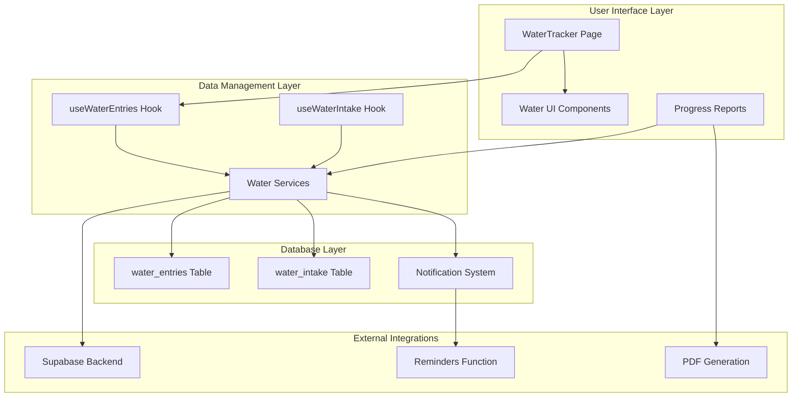
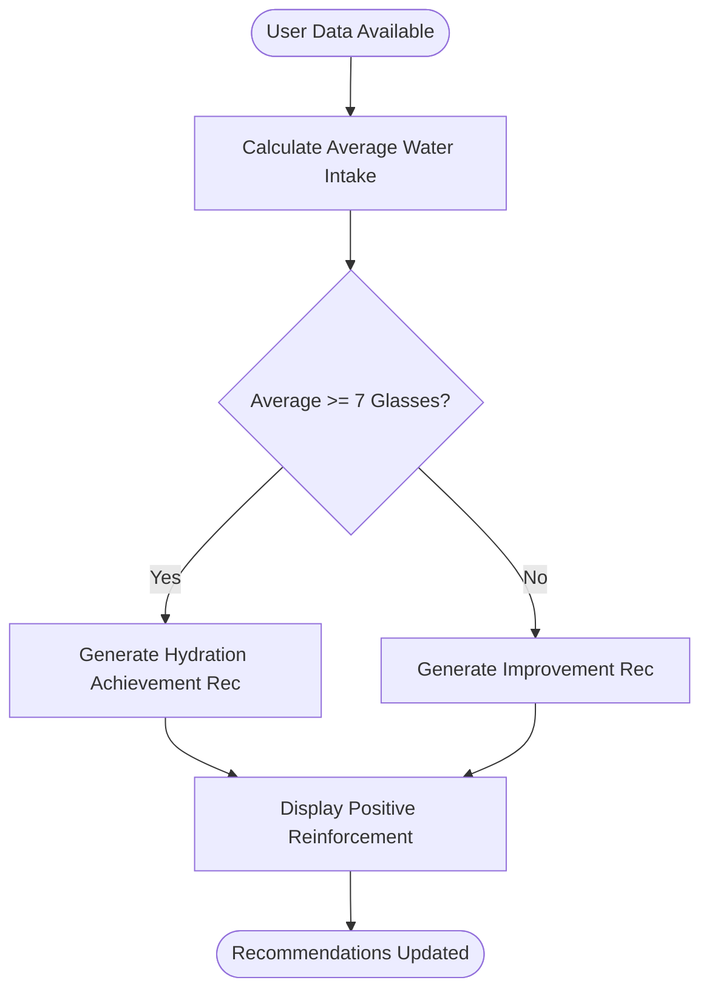
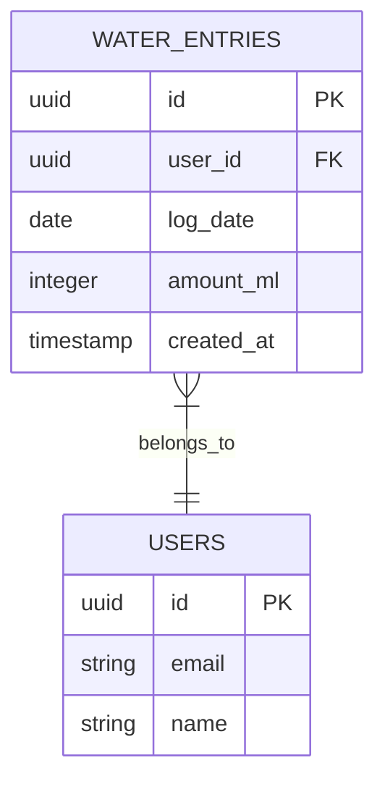

# Water Intake Tracking

<cite>
**Referenced Files in This Document**
- [WaterTracker.tsx](file://src/pages/WaterTracker.tsx)
- [useWaterEntries.ts](file://src/hooks/useWaterEntries.ts)
- [useWaterIntake.ts](file://src/hooks/useWaterIntake.ts)
- [ProfessionalWeeklyReport.tsx](file://src/components/progress/ProfessionalWeeklyReport.tsx)
- [professional-weekly-report-pdf.ts](file://src/lib/professional-weekly-report-pdf.ts)
- [nutrio-report-pdf.ts](file://src/lib/nutrio-report-pdf.ts)
- [useSmartRecommendations.ts](file://src/hooks/useSmartRecommendations.ts)
- [water_entries.sql](file://supabase/migrations/20260305000000_water_entries.sql)
- [index.ts](file://supabase/functions/send-meal-reminders/index.ts)
</cite>

## Table of Contents
1. [Introduction](#introduction)
2. [System Architecture](#system-architecture)
3. [Core Components](#core-components)
4. [Daily Water Consumption Tracking](#daily-water-consumption-tracking)
5. [Quick-Add Functionality](#quick-add-functionality)
6. [Progress Visualization](#progress-visualization)
7. [Weekly Report Integration](#weekly-report-integration)
8. [Personalized Hydration Recommendations](#personalized-hydration-recommendations)
9. [Unit Conversions and Calculations](#unit-conversions-and-calculations)
10. [Reminders System](#reminders-system)
11. [Database Schema](#database-schema)
12. [UI Components and Design](#ui-components-and-design)
13. [Performance Considerations](#performance-considerations)
14. [Troubleshooting Guide](#troubleshooting-guide)
15. [Conclusion](#conclusion)

## Introduction

The water intake tracking system in Nutrio is a comprehensive hydration monitoring solution designed to help users maintain optimal fluid intake levels. The system provides granular tracking capabilities, personalized goals, progress visualization, and seamless integration with the overall nutrition tracking dashboard. It supports both milliliter-based tracking for precise measurements and glass-based visualization for intuitive understanding.

The system operates on a dual-approach: individual water entries tracked in milliliters for accuracy, and glass-based visualization for user-friendly progress representation. Users can set personalized daily goals, quickly add water consumption through preset increments, and monitor their hydration progress through various visualization methods including water glass graphics, calendar views, and weekly reports.

## System Architecture

The water tracking system follows a modular architecture with clear separation of concerns between data management, UI presentation, and reporting functionality.

**Diagram sources**
- [WaterTracker.tsx:199-542](file://src/pages/WaterTracker.tsx#L199-L542)
- [useWaterEntries.ts:15-143](file://src/hooks/useWaterEntries.ts#L15-L143)
- [water_entries.sql:1-26](file://supabase/migrations/20260305000000_water_entries.sql#L1-L26)

## Core Components

### WaterTracker Page Component

The main water tracking interface provides a comprehensive dashboard for daily hydration monitoring with multiple interaction modes.

**Key Features:**
- Daily water consumption display with milliliter precision
- Glass-based visualization for intuitive progress understanding
- Quick-add functionality with preset increments
- Calendar-based historical tracking
- Personalized daily goals with local storage persistence
- Toast notifications for user feedback

**Section sources**
- [WaterTracker.tsx:199-542](file://src/pages/WaterTracker.tsx#L199-L542)

### Water Entries Hook

Manages water consumption data retrieval, updates, and calculations for the current day's tracking.

**Core Functionality:**
- Fetch water entries for specific dates
- Calculate daily totals and progress percentages
- Manage user-defined hydration goals
- Handle month-over-month totals for calendar view
- Local storage integration for goal persistence

**Section sources**
- [useWaterEntries.ts:15-143](file://src/hooks/useWaterEntries.ts#L15-L143)

### Water Intake Hook

Provides simplified glass-based tracking for basic hydration monitoring needs.

**Key Features:**
- Default 8-glass daily target
- Automatic daily summary calculations
- CRUD operations for water intake records
- Real-time progress updates

**Section sources**
- [useWaterIntake.ts:18-148](file://src/hooks/useWaterIntake.ts#L18-L148)

## Daily Water Consumption Tracking

The system maintains two complementary approaches to tracking water consumption:

### Milliliter-Based Tracking
The primary tracking method uses individual water entries measured in milliliters, providing precise measurement capabilities.

**Data Structure:**
- `amount_ml`: Integer value representing milliliters consumed
- `log_date`: Date identifier for daily aggregation
- `created_at`: Timestamp for entry ordering

**Calculation Methods:**
- Daily total: Sum of all entries for the selected date
- Progress percentage: `(total_ml / goal_ml) * 100`
- Rounded to nearest whole percent for display

### Glass-Based Visualization
A secondary visualization layer converts milliliter amounts to glass equivalents for intuitive understanding.

**Conversion Reference:**
- Standard glass size: 200ml
- Progress calculation: `glasses = amount_ml / 200`
- Rounded to appropriate decimal places

**Section sources**
- [WaterTracker.tsx:23-27](file://src/pages/WaterTracker.tsx#L23-L27)
- [useWaterEntries.ts:127-128](file://src/hooks/useWaterEntries.ts#L127-L128)

## Quick-Add Functionality

The quick-add system provides efficient ways to log water consumption without manual input.

### Preset Increments
The system offers predefined milliliter increments optimized for common glass sizes:

**Available Presets:** 100ml, 125ml, 150ml, 200ml, 250ml, 300ml, 350ml, 400ml, 500ml, 600ml

**Implementation Details:**
- Grid-based interface with visual water cup icons
- Immediate logging upon selection
- Percentage-based fill visualization for each preset
- Maximum preset limit of 600ml to prevent excessive entries

### Custom Amount Entry
Users can specify custom quantities for unusual serving sizes or special circumstances.

**Validation Requirements:**
- Minimum 50ml, maximum 2000ml
- Positive integer values only
- Real-time validation feedback

**Section sources**
- [WaterTracker.tsx:26-27](file://src/pages/WaterTracker.tsx#L26-L27)
- [WaterTracker.tsx:476-538](file://src/pages/WaterTracker.tsx#L476-L538)

## Progress Visualization

The system provides multiple visualization methods to help users understand their hydration progress.

### Water Glass Visualization
A stylized water glass graphic dynamically fills based on progress percentage.

**Visual Elements:**
- SVG-based glass outline with tapered design
- Animated water fill from bottom to top
- Gradient coloring from light to dark blue
- Shadow effects for depth perception
- Fill height calculation: `waterTopY = 140 - (percentage/100 * 120)`

### Circular Progress Indicators
Calendar cells display circular progress indicators for monthly overview.

**Implementation:**
- SVG circle with stroke-dasharray for progress visualization
- Dynamic stroke color based on completion percentage
- Hover and selection states for interactive feedback
- Border styling for days with zero consumption

### Weekly Progress Display
Horizontal glass visualization showing average hydration across the week.

**Features:**
- Eight glass markers representing daily targets
- Color-coded progress bars
- Average calculation across tracked days
- Target comparison (8 glasses per day)

**Section sources**
- [WaterTracker.tsx:29-45](file://src/pages/WaterTracker.tsx#L29-L45)
- [WaterTracker.tsx:105-197](file://src/pages/WaterTracker.tsx#L105-L197)
- [ProfessionalWeeklyReport.tsx:464-497](file://src/components/progress/ProfessionalWeeklyReport.tsx#L464-L497)

## Weekly Report Integration

The water tracking system seamlessly integrates with comprehensive weekly health reports.

### Report Data Collection
Weekly reports aggregate water intake data alongside other nutritional metrics.

**Data Sources:**
- Individual water entries from `water_entries` table
- Daily averages calculated across 7-day periods
- Consistency metrics based on days with recorded intake
- Integration with broader nutrition tracking dashboard

### Report Visualization Components

#### Hydration Summary Cards
Professional weekly reports present hydration data in multiple formats:

**Average Water Intake Display:**
- Current week average in glasses
- Comparison to 8-glass daily target
- Color-coded status indicators (excellent, good, needs improvement)
- Progress bars showing target achievement

**Hydration Insights:**
- Automated recommendations based on average consumption
- Consistency analysis across tracked days
- Trend comparisons with previous weeks
- Personalized improvement suggestions

#### Water Intake Charts
Interactive charts visualize water consumption patterns over time.

**Chart Types:**
- Bar charts showing daily water intake in glasses
- Line graphs for trend analysis
- Target line comparison (8 glasses)
- Consistency visualization across the week

**Section sources**
- [ProfessionalWeeklyReport.tsx:114-117](file://src/components/progress/ProfessionalWeeklyReport.tsx#L114-L117)
- [ProfessionalWeeklyReport.tsx:200-246](file://src/components/progress/ProfessionalWeeklyReport.tsx#L200-L246)
- [professional-weekly-report-pdf.ts:961-990](file://src/lib/professional-weekly-report-pdf.ts#L961-L990)

## Personalized Hydration Recommendations

The system generates intelligent recommendations based on user hydration patterns and overall health metrics.

### Recommendation Engine Logic

**Hydration Achievement Recognition:**
- Users consuming 7+ glasses daily receive positive reinforcement
- Automated messages acknowledging excellent hydration habits
- Progress tracking toward optimal hydration goals

**Integration with Smart Recommendations:**
The hydration recommendations work alongside other health insights:

**Diagram sources**
- [useSmartRecommendations.ts:253-263](file://src/hooks/useSmartRecommendations.ts#L253-L263)

### Recommendation Categories
Recommendations are categorized for better user engagement:

**Hydration Category:**
- Achievement recognition for meeting targets
- Encouragement for maintaining good habits
- Actionable suggestions for improvement
- Integration with water tracking interface

**Priority System:**
- Urgent: Immediate hydration needs
- Recommended: Positive reinforcement
- Tip: General health suggestions

**Section sources**
- [useSmartRecommendations.ts:253-296](file://src/hooks/useSmartRecommendations.ts#L253-L296)
- [ProfessionalWeeklyReport.tsx:932-936](file://src/components/progress/ProfessionalWeeklyReport.tsx#L932-L936)

## Unit Conversions and Calculations

The system handles multiple measurement units and conversion scenarios for accurate tracking.

### Milliliter to Glass Conversions

**Standard Conversion:**
- 1 glass = 200ml (standard drinking glass size)
- Conversion formula: `glasses = milliliters / 200`
- Precision: Rounded to appropriate decimal places for display

**Visualization Scaling:**
- Water glass fill height: `height = (glasses/8) * 120 pixels`
- Progress percentage: `(milliliters/goal_milliliters) * 100`

### Daily Goal Management

**Default Goals:**
- Standard daily goal: 2500ml (approximately 12.5 glasses)
- Minimum: 500ml, Maximum: 10000ml
- Increment: 100ml steps for precise customization

**Local Storage Persistence:**
- Goals saved in browser localStorage
- Automatic restoration on application load
- Cross-session consistency

### Percentage Calculations

**Progress Formulas:**
- Daily progress: `(total_ml / goal_ml) * 100`
- Rounded to nearest whole percent
- Maximum cap at 100% for display consistency

**Section sources**
- [WaterTracker.tsx:23](file://src/pages/WaterTracker.tsx#L23)
- [useWaterEntries.ts:12](file://src/hooks/useWaterEntries.ts#L12)
- [useWaterEntries.ts:127-128](file://src/hooks/useWaterEntries.ts#L127-L128)

## Reminders System

While primarily focused on meal scheduling, the system's notification infrastructure supports potential hydration reminders.

### Current Implementation Focus
The existing notification system is designed for meal reminders and scheduling:

**Meal Reminder Functionality:**
- Scheduled meal notifications via Supabase Edge Functions
- User preference filtering for notification opt-out
- Batch processing for multiple users
- Platform-wide notification settings

### Integration Opportunities
The notification infrastructure provides foundation for future hydration reminders:

**Potential Features:**
- Customizable hydration reminder intervals
- Weather-conditioned recommendations
- Activity-level adjusted hydration suggestions
- Integration with wearable device data

**Section sources**
- [index.ts:29-229](file://supabase/functions/send-meal-reminders/index.ts#L29-L229)

## Database Schema

The water tracking system utilizes a well-designed database schema optimized for performance and scalability.

### Water Entries Table Structure

**Table Properties:**
- **Primary Key:** Auto-generated UUID for unique identification
- **Foreign Key:** References `auth.users` table for user association
- **Date Index:** Composite index on `(user_id, log_date)` for optimal query performance
- **Data Validation:** Check constraint ensuring positive milliliter values

**Security Features:**
- Row-level security policies for user data isolation
- Select permissions: Users can only access their own entries
- Insert permissions: Controlled through application logic
- Delete permissions: User-controlled removal capability

**Section sources**
- [water_entries.sql:1-26](file://supabase/migrations/20260305000000_water_entries.sql#L1-L26)

## UI Components and Design

The water tracking interface employs modern React patterns with comprehensive state management and responsive design.

### Component Architecture

**Main Page Components:**
- **WaterTracker Page:** Primary interface with all tracking functionality
- **Calendar View:** Monthly overview with daily progress indicators
- **Quick-Add Sheet:** Preset increment selection interface
- **Goal Management Dialog:** Daily target customization
- **Custom Amount Dialog:** Flexible entry for unusual serving sizes

### State Management Patterns

**Hook-Based State:**
- Centralized data fetching and caching
- Local state for UI interactions
- Optimistic updates for immediate feedback
- Error boundary handling for robust user experience

**Responsive Design:**
- Mobile-first layout with bottom-sheet interfaces
- Touch-friendly button sizing and spacing
- Adaptive typography for different screen sizes
- Safe area insets for modern mobile devices

### Visual Design Elements

**Color Scheme:**
- Primary: Blue gradients (#60a5fa, #3b82f6) for water themes
- Secondary: Neutral grays for backgrounds and borders
- Accent: Emerald greens for success states
- Warning: Amber/orange for caution states

**Animation and Feedback:**
- Smooth transitions for state changes
- Loading animations during data fetches
- Toast notifications for user actions
- Interactive hover and focus states

**Section sources**
- [WaterTracker.tsx:309-542](file://src/pages/WaterTracker.tsx#L309-L542)

## Performance Considerations

The water tracking system is designed with performance optimization in mind for smooth user experiences.

### Database Optimization

**Index Strategy:**
- Composite index on `(user_id, log_date)` for efficient queries
- Reverse chronological ordering for recent data access
- Range queries optimized for monthly aggregations

**Query Patterns:**
- Single-date lookups for current day tracking
- Monthly range queries for calendar view
- Aggregation queries for progress calculations

### Frontend Performance

**State Management:**
- Memoized calculations to prevent unnecessary re-renders
- Local storage caching for user preferences
- Efficient array operations for entry management

**Memory Management:**
- Cleanup of event listeners and timers
- Proper disposal of async operations
- Optimized rendering for large datasets

### Scalability Considerations

**Data Volume:**
- Efficient aggregation for monthly totals
- Lazy loading for calendar data
- Pagination strategies for extensive history

**Concurrency:**
- Optimistic UI updates with rollback on failure
- Conflict resolution for simultaneous edits
- Offline capability with sync strategies

## Troubleshooting Guide

Common issues and their solutions for the water tracking system.

### Data Synchronization Issues

**Problem:** Water entries not appearing after logging
**Solution:** 
- Verify user authentication status
- Check network connectivity for data sync
- Clear browser cache and reload page
- Review console errors for API failures

**Problem:** Progress percentage not updating
**Solution:**
- Force refresh of the water tracker page
- Verify goal settings are properly configured
- Check for browser extension interference
- Restart application if persistent issues occur

### Database Connection Problems

**Problem:** "Table does not exist" errors
**Solution:**
- Verify database migration completion
- Check Supabase project configuration
- Ensure proper database credentials
- Review server logs for connection errors

**Problem:** Permission denied errors
**Solution:**
- Verify user authentication
- Check row-level security policies
- Review user session validity
- Confirm database user privileges

### UI Interaction Issues

**Problem:** Quick-add buttons not responding
**Solution:**
- Check for JavaScript errors in browser console
- Verify React DevTools for component state
- Test with different browsers
- Clear browser cookies and cache

**Problem:** Calendar view not loading
**Solution:**
- Verify date formatting consistency
- Check timezone settings
- Ensure proper date library initialization
- Review network tab for failed API calls

**Section sources**
- [WaterTracker.tsx:258-274](file://src/pages/WaterTracker.tsx#L258-L274)

## Conclusion

The water intake tracking system in Nutrio provides a comprehensive solution for hydration monitoring with its dual approach of precise milliliter tracking and intuitive glass-based visualization. The system successfully integrates with the broader nutrition tracking ecosystem through weekly reports, personalized recommendations, and dashboard integration.

Key strengths of the system include its flexible quick-add functionality, robust progress visualization methods, and seamless integration with health insights. The modular architecture ensures maintainability and extensibility for future enhancements such as personalized hydration reminders and advanced analytics.

The implementation demonstrates best practices in React development, database design, and user experience optimization. The system's performance considerations and error handling mechanisms contribute to a reliable and responsive user experience across different devices and usage scenarios.

Future enhancements could include integration with wearable devices for automatic hydration tracking, weather-conditioned recommendations, and more sophisticated personalization based on individual health metrics and activity levels.