# Weekly Progress Reports

<cite>
**Referenced Files in This Document**
- [professional-weekly-report-pdf.ts](file://src/lib/professional-weekly-report-pdf.ts)
- [weekly-report-pdf.ts](file://src/lib/weekly-report-pdf.ts)
- [useWeeklyReport.ts](file://src/hooks/useWeeklyReport.ts)
- [useWeeklySummary.ts](file://src/hooks/useWeeklySummary.ts)
- [ProfessionalWeeklyReport.tsx](file://src/components/progress/ProfessionalWeeklyReport.tsx)
- [useSmartRecommendations.ts](file://src/hooks/useSmartRecommendations.ts)
- [ai-report-generator.ts](file://src/lib/ai-report-generator.ts)
- [meal-plan-generator.ts](file://src/lib/meal-plan-generator.ts)
</cite>

## Table of Contents
1. [Introduction](#introduction)
2. [System Architecture](#system-architecture)
3. [Core Components](#core-components)
4. [Weekly Data Aggregation](#weekly-data-aggregation)
5. [Report Generation Workflow](#report-generation-workflow)
6. [Professional Report Content](#professional-report-content)
7. [AI-Powered Recommendations](#ai-powered-recommendations)
8. [Data Visualization Components](#data-visualization-components)
9. [Export and Customization](#export-and-customization)
10. [Integration with Meal Planning](#integration-with-meal-planning)
11. [Performance Considerations](#performance-considerations)
12. [Troubleshooting Guide](#troubleshooting-guide)
13. [Conclusion](#conclusion)

## Introduction

The Weekly Progress Reporting System is a comprehensive automated solution that transforms user health and fitness data into professional PDF reports. This system consolidates nutrition data, activity logs, and health metrics to provide actionable insights and personalized recommendations for long-term behavior modification.

The system operates on a weekly cadence, aggregating data from multiple sources including progress logs, water intake, workout sessions, and body measurements. It generates both basic and professional reports with advanced analytics, trend analysis, and AI-powered insights to support sustained lifestyle improvements.

## System Architecture

The reporting system follows a modular architecture with clear separation of concerns:

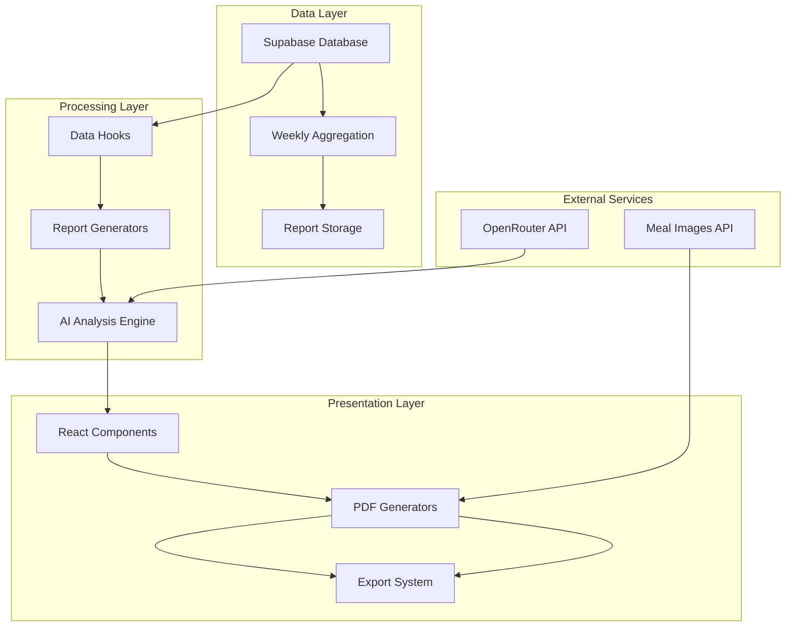

**Diagram sources**
- [useWeeklyReport.ts:19-89](file://src/hooks/useWeeklyReport.ts#L19-L89)
- [professional-weekly-report-pdf.ts:127-192](file://src/lib/professional-weekly-report-pdf.ts#L127-L192)
- [ai-report-generator.ts:25-78](file://src/lib/ai-report-generator.ts#L25-L78)

## Core Components

### Report Data Models

The system uses structured data models to represent weekly health data:

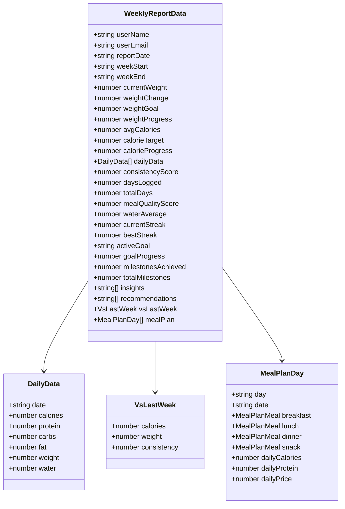

**Diagram sources**
- [professional-weekly-report-pdf.ts:67-125](file://src/lib/professional-weekly-report-pdf.ts#L67-L125)

**Section sources**
- [professional-weekly-report-pdf.ts:36-125](file://src/lib/professional-weekly-report-pdf.ts#L36-L125)

### Report Generation Classes

The system employs specialized classes for different report types:

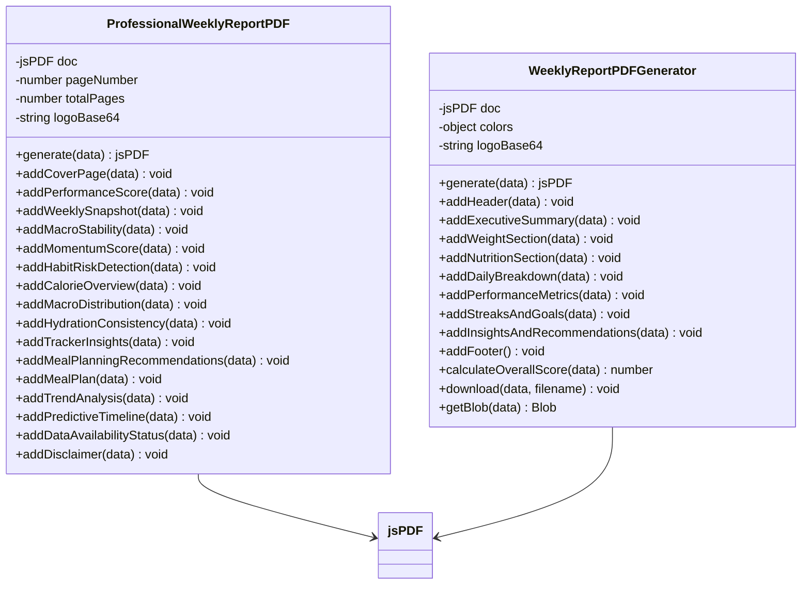

**Diagram sources**
- [professional-weekly-report-pdf.ts:127-192](file://src/lib/professional-weekly-report-pdf.ts#L127-L192)
- [weekly-report-pdf.ts:93-130](file://src/lib/weekly-report-pdf.ts#L93-L130)

**Section sources**
- [professional-weekly-report-pdf.ts:127-192](file://src/lib/professional-weekly-report-pdf.ts#L127-L192)
- [weekly-report-pdf.ts:93-130](file://src/lib/weekly-report-pdf.ts#L93-L130)

## Weekly Data Aggregation

### Data Collection Pipeline

The system aggregates data from multiple sources using dedicated hooks:

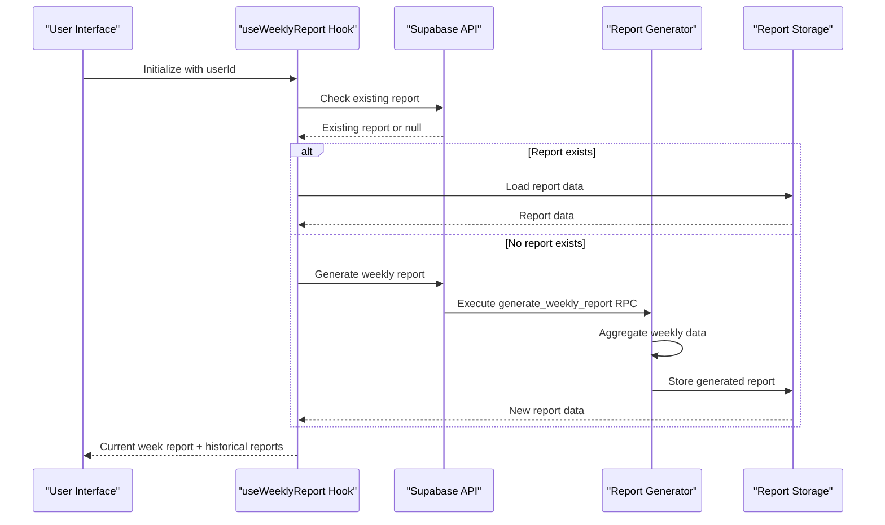

**Diagram sources**
- [useWeeklyReport.ts:24-71](file://src/hooks/useWeeklyReport.ts#L24-L71)

### Data Aggregation Process

The weekly summary aggregation combines multiple data sources:

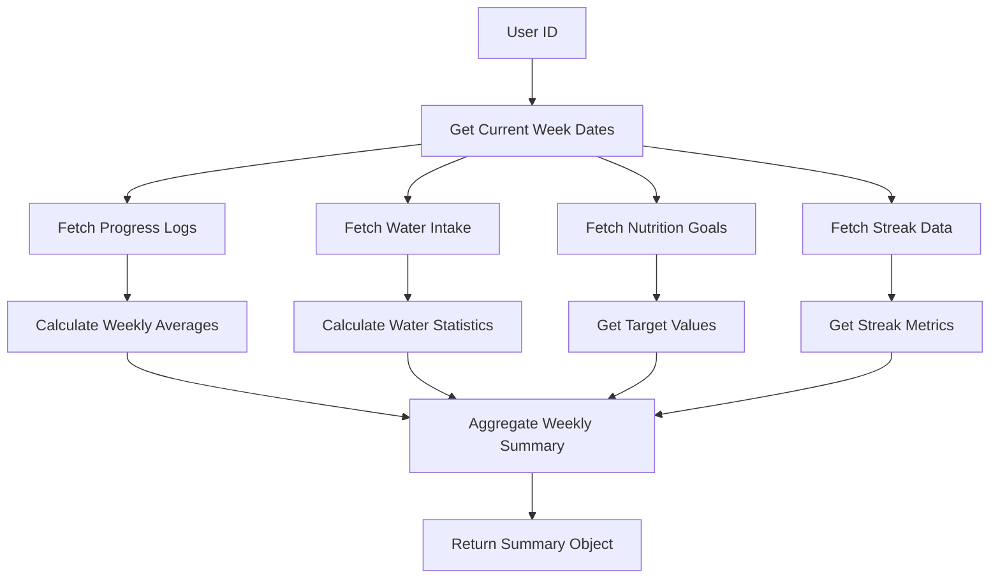

**Diagram sources**
- [useWeeklySummary.ts:42-175](file://src/hooks/useWeeklySummary.ts#L42-L175)

**Section sources**
- [useWeeklyReport.ts:19-89](file://src/hooks/useWeeklyReport.ts#L19-L89)
- [useWeeklySummary.ts:38-182](file://src/hooks/useWeeklySummary.ts#L38-L182)

## Report Generation Workflow

### Automated Report Generation

The system automatically generates weekly reports through a multi-stage process:

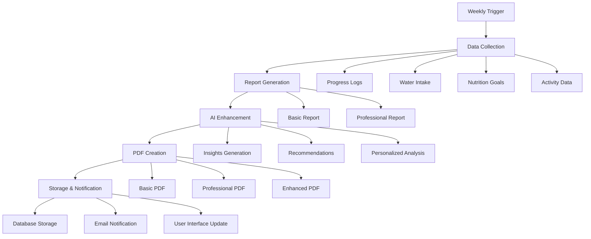

**Diagram sources**
- [professional-weekly-report-pdf.ts:164-192](file://src/lib/professional-weekly-report-pdf.ts#L164-L192)
- [ai-report-generator.ts:95-126](file://src/lib/ai-report-generator.ts#L95-L126)

### Report Content Structure

The professional weekly report follows a comprehensive structure:

| Section | Content | Purpose |
|---------|---------|---------|
| Cover Page | Branding, user info, date range | Professional presentation |
| Performance Score | Overall score calculation | Quick progress assessment |
| Weekly Snapshot | Key metrics summary | Executive overview |
| Macro Stability | Calorie variance analysis | Intake consistency measurement |
| Momentum Score | Trend analysis | Progress direction indicator |
| Habit Pattern Analysis | Risk detection | Behavioral pattern identification |
| Calorie Alignment | Target comparison | Energy balance assessment |
| Macro Distribution | Daily breakdown | Nutritional composition |
| Hydration Consistency | Fluid intake tracking | Health optimization |
| Tracker Insights | Activity integration | Holistic wellness view |
| Meal Planning | Personalized recommendations | Actionable guidance |
| Trend Analysis | Historical patterns | Long-term progress |
| Predictive Timeline | Future projections | Goal achievement planning |

**Section sources**
- [professional-weekly-report-pdf.ts:194-181](file://src/lib/professional-weekly-report-pdf.ts#L194-L181)

## Professional Report Content

### Performance Metrics

The professional report calculates comprehensive performance scores:

```mermaid
graph LR
subgraph "Performance Score Components"
A[Logging Consistency 30%] --> G[Overall Score]
B[Calorie Alignment 25%] --> G
C[Protein Alignment 15%] --> G
D[Macro Balance 10%] --> G
E[Hydration 10%] --> G
F[Stability & Momentum 10%] --> G
end
subgraph "Calculation Formula"
H[Σ(Component Scores)] --> I[Final Percentage]
end
G --> H
```

**Diagram sources**
- [professional-weekly-report-pdf.ts:341-348](file://src/lib/professional-weekly-report-pdf.ts#L341-L348)

### Trend Analysis Components

The system provides sophisticated trend analysis:

| Metric | Analysis Type | Thresholds | Action Indicators |
|--------|---------------|------------|-------------------|
| Calorie Intake | Daily variance | <10% High, 10-20% Moderate, >20% Variable | Stability recommendations |
| Protein Consumption | Weekly progression | >90% Target, 60-90% Adequate, <60% Low | Quality improvements |
| Hydration | Daily consistency | ≥75% Target, 50-75% Good, <50% Low | Hydration challenges |
| Logging Frequency | Weekly adherence | ≥80% Excellent, 50-80% Good, <50% Developing | Habit building |

**Section sources**
- [professional-weekly-report-pdf.ts:466-548](file://src/lib/professional-weekly-report-pdf.ts#L466-L548)

## AI-Powered Recommendations

### Recommendation Generation Engine

The AI recommendation system uses multiple data sources to provide personalized guidance:

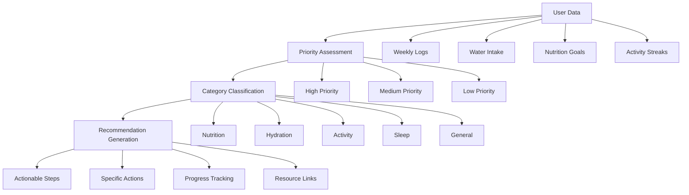

**Diagram sources**
- [useSmartRecommendations.ts:23-285](file://src/hooks/useSmartRecommendations.ts#L23-L285)

### Recommendation Categories

The system generates recommendations across multiple domains:

| Category | Priority | Examples | Implementation |
|----------|----------|----------|----------------|
| Nutrition | High | Protein intake, calorie balance, macronutrient targets | Meal suggestions, recipe ideas |
| Hydration | Medium | Water consumption, timing, goals | Reminder systems, tracking |
| Activity | Medium | Exercise consistency, intensity, variety | Workout plans, movement challenges |
| Sleep | Low | Rest patterns, recovery | Sleep hygiene tips |
| General | Low | Logging consistency, goal alignment | Habit formation strategies |

**Section sources**
- [useSmartRecommendations.ts:18-296](file://src/hooks/useSmartRecommendations.ts#L18-L296)

### AI Content Generation

The AI system enhances reports with personalized content:

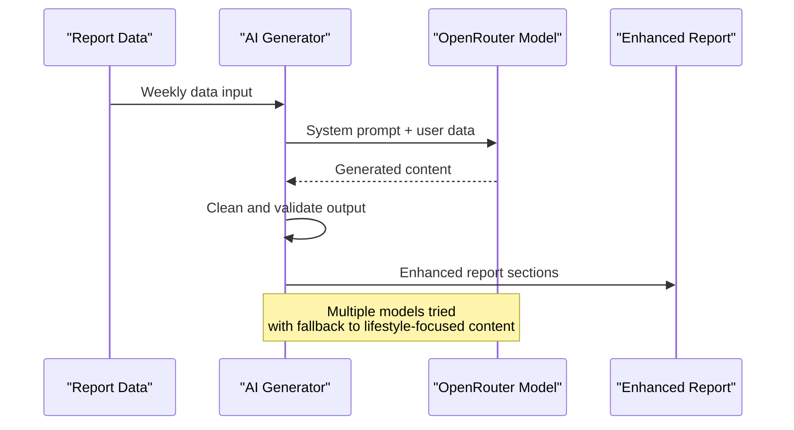

**Diagram sources**
- [ai-report-generator.ts:32-78](file://src/lib/ai-report-generator.ts#L32-L78)

**Section sources**
- [ai-report-generator.ts:25-126](file://src/lib/ai-report-generator.ts#L25-L126)

## Data Visualization Components

### Interactive Dashboard Elements

The professional report includes sophisticated visualizations:

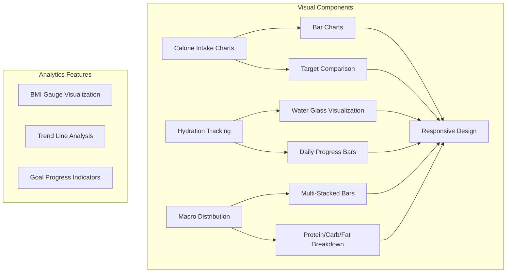

**Diagram sources**
- [ProfessionalWeeklyReport.tsx:156-178](file://src/components/progress/ProfessionalWeeklyReport.tsx#L156-L178)

### Chart Types and Implementation

| Chart Type | Purpose | Data Source | Visualization |
|------------|---------|-------------|---------------|
| Bar Charts | Daily calorie intake | DailyData array | Recharts implementation |
| Progress Rings | Macro targets | Target vs actual | SVG circle progress bars |
| Water Glasses | Hydration tracking | Water intake logs | Custom glass icons |
| BMI Gauge | Body composition | Weight and height | SVG needle gauge |
| Multi-Stacked Bars | Macro distribution | Macro breakdown | Recharts grouped bars |

**Section sources**
- [ProfessionalWeeklyReport.tsx:156-700](file://src/components/progress/ProfessionalWeeklyReport.tsx#L156-L700)

## Export and Customization

### PDF Generation Options

The system provides multiple report formats:

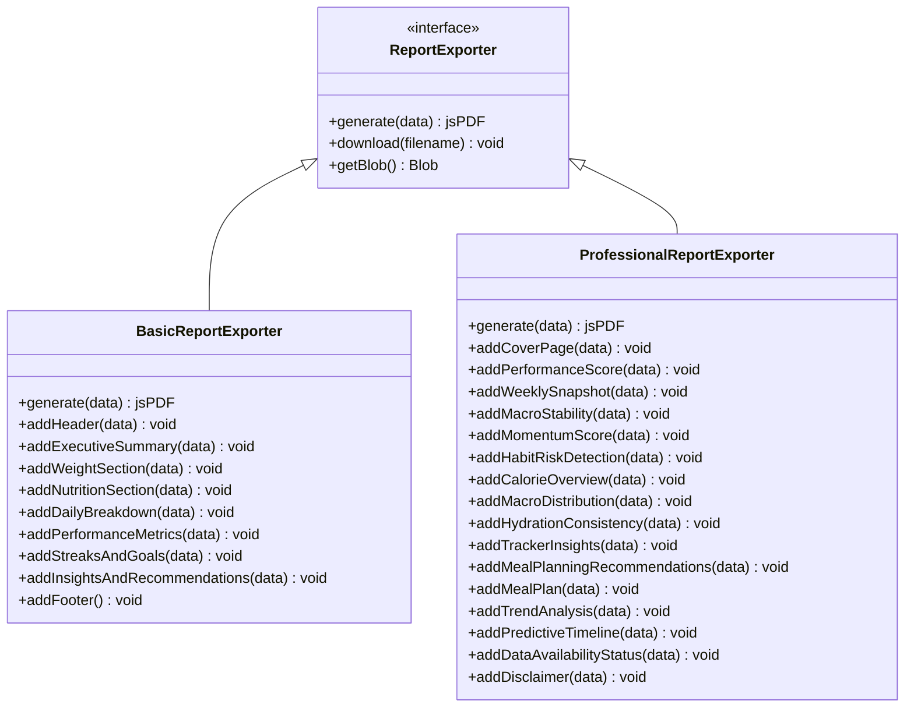

**Diagram sources**
- [weekly-report-pdf.ts:93-130](file://src/lib/weekly-report-pdf.ts#L93-L130)
- [professional-weekly-report-pdf.ts:127-192](file://src/lib/professional-weekly-report-pdf.ts#L127-L192)

### Customization Options

Users can customize their reports through various parameters:

| Customization | Options | Impact |
|---------------|---------|--------|
| Report Style | Basic/Professional | Visual presentation |
| Date Range | Customizable weeks | Historical analysis |
| Data Filters | By goal type, activity level | Focused insights |
| Export Format | PDF, downloadable | Distribution method |
| Language | Multi-language support | Accessibility |

**Section sources**
- [weekly-report-pdf.ts:753-762](file://src/lib/weekly-report-pdf.ts#L753-L762)
- [professional-weekly-report-pdf.ts:164-192](file://src/lib/professional-weekly-report-pdf.ts#L164-L192)

## Integration with Meal Planning

### Meal Plan Generation

The system integrates with meal planning through intelligent selection algorithms:

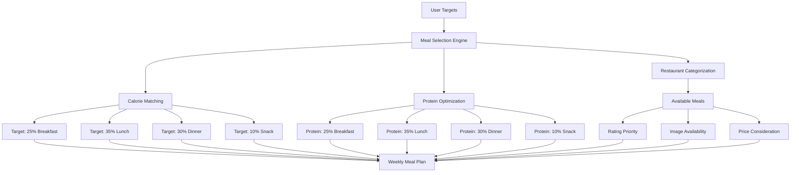

**Diagram sources**
- [meal-plan-generator.ts:64-164](file://src/lib/meal-plan-generator.ts#L64-L164)

### Image Loading and Processing

The meal plan includes optimized image handling:

| Strategy | Purpose | Timeout | Fallback |
|----------|---------|---------|----------|
| Supabase SDK | CORS-free downloads | Immediate | None |
| Direct Fetch | Standard images | 5s | Canvas conversion |
| Cross-Origin | Third-party images | 8s | Stock photo fallback |
| Canvas Conversion | Format standardization | 2s | Null result |

**Section sources**
- [meal-plan-generator.ts:307-407](file://src/lib/meal-plan-generator.ts#L307-L407)

## Performance Considerations

### Data Processing Optimization

The system implements several optimization strategies:

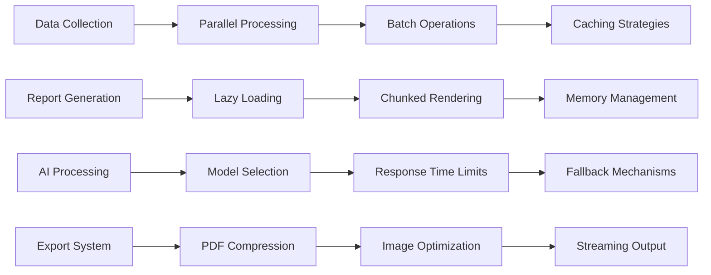

### Scalability Features

| Feature | Implementation | Benefit |
|---------|----------------|---------|
| Parallel Data Fetching | Promise.all() for multiple queries | Reduced API latency |
| Lazy Loading | On-demand report generation | Improved initial load times |
| Caching | Local storage for frequently accessed data | Faster subsequent loads |
| Pagination | Limited historical data retrieval | Prevents memory overload |
| Compression | PDF compression settings | Smaller file sizes |

**Section sources**
- [useWeeklySummary.ts:34-56](file://src/hooks/useWeeklySummary.ts#L34-L56)
- [useSmartRecommendations.ts:23-56](file://src/hooks/useSmartRecommendations.ts#L23-L56)

## Troubleshooting Guide

### Common Issues and Solutions

| Issue | Symptoms | Solution |
|-------|----------|----------|
| Report Generation Failure | Empty report, error messages | Check API keys, retry generation |
| Missing Data | Incomplete charts, zero values | Verify data collection, check permissions |
| Slow Performance | Long loading times, timeouts | Optimize queries, implement caching |
| AI Content Issues | Generic responses, errors | Verify API connectivity, check model availability |
| Export Problems | Corrupted PDFs, blank pages | Validate data structure, check formatting |

### Error Handling Strategies

The system implements comprehensive error handling:

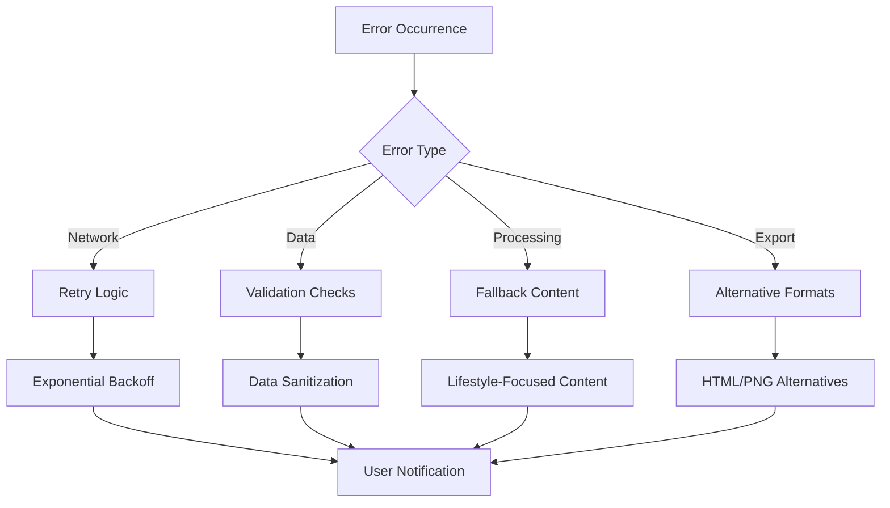

**Section sources**
- [ai-report-generator.ts:32-78](file://src/lib/ai-report-generator.ts#L32-L78)
- [professional-weekly-report-pdf.ts:145-162](file://src/lib/professional-weekly-report-pdf.ts#L145-L162)

## Conclusion

The Weekly Progress Reporting System represents a comprehensive solution for transforming health and fitness data into actionable insights. Through automated data aggregation, sophisticated analysis algorithms, and AI-powered personalization, the system provides users with professional-quality reports that support long-term behavior modification.

Key strengths of the system include its modular architecture, extensive customization options, robust data visualization capabilities, and seamless integration with meal planning services. The combination of automated report generation and AI-driven recommendations creates a powerful platform for sustained lifestyle improvement.

The system's focus on user experience, performance optimization, and comprehensive data analysis positions it as a valuable tool for both individual users and healthcare professionals seeking to monitor and improve patient outcomes through structured weekly reporting and personalized guidance.