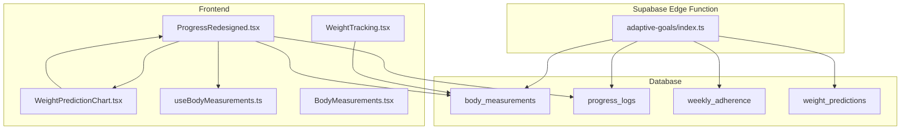
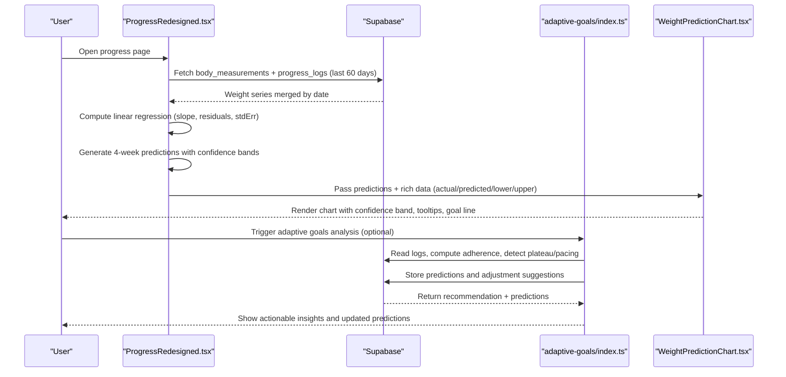
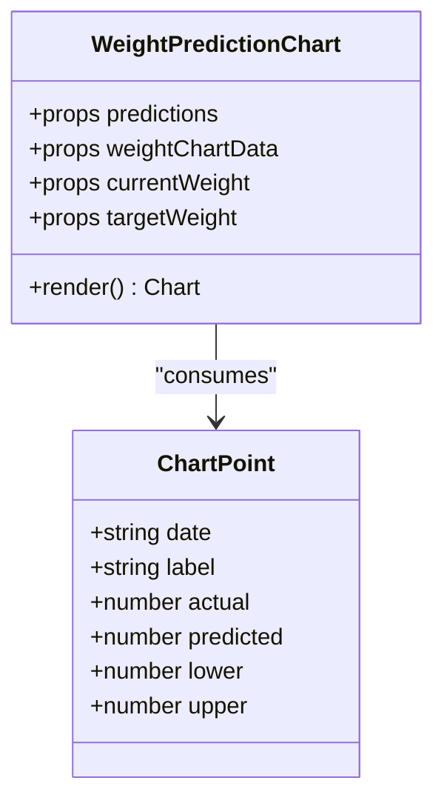
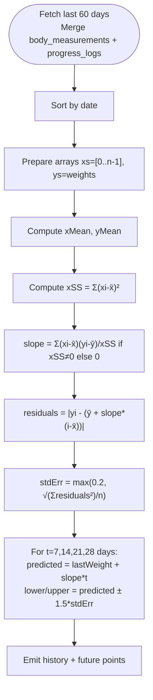
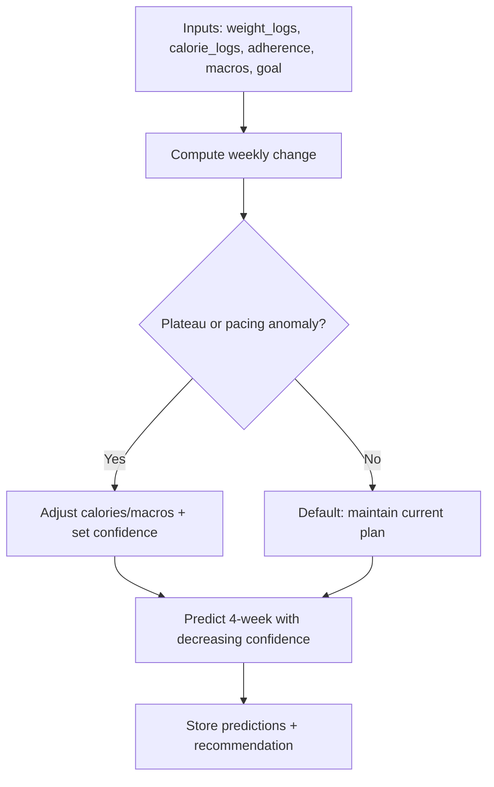
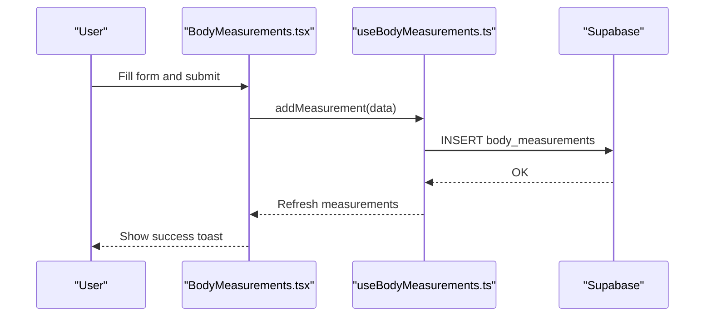
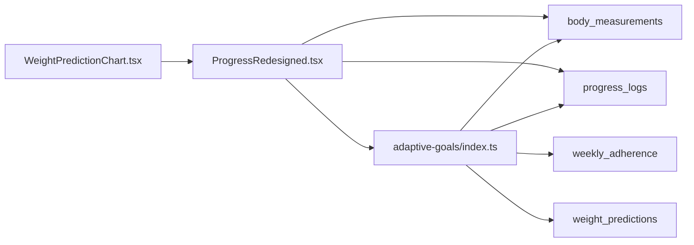

# Weight Prediction Charts

<cite>
**Referenced Files in This Document**
- [WeightPredictionChart.tsx](file://src/components/WeightPredictionChart.tsx)
- [ProgressRedesigned.tsx](file://src/pages/ProgressRedesigned.tsx)
- [WeightTracking.tsx](file://src/pages/WeightTracking.tsx)
- [index.ts](file://supabase/functions/adaptive-goals/index.ts)
- [useBodyMeasurements.ts](file://src/hooks/useBodyMeasurements.ts)
- [BodyMeasurements.tsx](file://src/components/progress/BodyMeasurements.tsx)
- [20260309000000_add_body_measurements_delete_policy.sql](file://supabase/migrations/20260309000000_add_body_measurements_delete_policy.sql)
</cite>

## Table of Contents
1. [Introduction](#introduction)
2. [Project Structure](#project-structure)
3. [Core Components](#core-components)
4. [Architecture Overview](#architecture-overview)
5. [Detailed Component Analysis](#detailed-component-analysis)
6. [Dependency Analysis](#dependency-analysis)
7. [Performance Considerations](#performance-considerations)
8. [Troubleshooting Guide](#troubleshooting-guide)
9. [Conclusion](#conclusion)
10. [Appendices](#appendices)

## Introduction
This document describes the advanced weight prediction and trend visualization system. It covers the linear regression algorithm used to analyze historical weight data, compute confidence intervals, and render interactive charts with uncertainty bands. It also documents how body measurements and progress logs integrate to produce comprehensive weight tracking charts, the chart rendering components and interactive features, real-time prediction updates, mathematical foundations, data preprocessing, outlier handling, missing data strategies, and integration with weight goal tracking and dietary recommendations.

## Project Structure
The weight prediction system spans frontend React components, Supabase edge functions, and database tables:
- Frontend pages and components orchestrate data fetching, preprocessing, and visualization.
- Supabase Edge Functions perform adaptive goal analysis and generate short-term predictions with confidence bounds.
- Database tables store body measurements, progress logs, and related analytics.

**Diagram sources**
- [ProgressRedesigned.tsx:79-162](file://src/pages/ProgressRedesigned.tsx#L79-L162)
- [WeightPredictionChart.tsx:40-291](file://src/components/WeightPredictionChart.tsx#L40-L291)
- [WeightTracking.tsx:33-315](file://src/pages/WeightTracking.tsx#L33-L315)
- [index.ts:316-521](file://supabase/functions/adaptive-goals/index.ts#L316-L521)
- [useBodyMeasurements.ts:17-112](file://src/hooks/useBodyMeasurements.ts#L17-L112)

**Section sources**
- [ProgressRedesigned.tsx:79-162](file://src/pages/ProgressRedesigned.tsx#L79-L162)
- [WeightPredictionChart.tsx:40-291](file://src/components/WeightPredictionChart.tsx#L40-L291)
- [WeightTracking.tsx:33-315](file://src/pages/WeightTracking.tsx#L33-L315)
- [index.ts:316-521](file://supabase/functions/adaptive-goals/index.ts#L316-L521)
- [useBodyMeasurements.ts:17-112](file://src/hooks/useBodyMeasurements.ts#L17-L112)

## Core Components
- WeightPredictionChart: Renders the composed chart with actual logged weight, predicted trend, and confidence bands. Handles empty-state messaging and responsive layout.
- ProgressRedesigned: Builds rich chart data by merging body measurements and progress logs, computes linear regression, and generates 4-week forecasts with confidence intervals.
- WeightTracking: Manages daily weight logging, displays current and recent entries, and supports editing/deleting entries.
- Adaptive Goals Edge Function: Performs weekly adherence analysis, detects plateaus and pacing anomalies, and predicts 4-week weight trajectories with decreasing confidence.
- Body Measurements Integration: Provides body composition logging and retrieval via hooks and UI components.

**Section sources**
- [WeightPredictionChart.tsx:40-291](file://src/components/WeightPredictionChart.tsx#L40-L291)
- [ProgressRedesigned.tsx:79-162](file://src/pages/ProgressRedesigned.tsx#L79-L162)
- [WeightTracking.tsx:33-315](file://src/pages/WeightTracking.tsx#L33-L315)
- [index.ts:52-227](file://supabase/functions/adaptive-goals/index.ts#L52-L227)
- [useBodyMeasurements.ts:17-112](file://src/hooks/useBodyMeasurements.ts#L17-L112)

## Architecture Overview
The system integrates three pillars:
- Data ingestion: Users log weight and body measurements; progress logs capture daily nutrition and activity.
- Modeling: Frontend computes linear regression on recent historical points; backend performs adaptive goal analysis and short-term predictions.
- Visualization: Recharts renders actual weight, predicted trend, and confidence bands with tooltips, legends, and goal reference lines.

**Diagram sources**
- [ProgressRedesigned.tsx:79-162](file://src/pages/ProgressRedesigned.tsx#L79-L162)
- [index.ts:316-521](file://supabase/functions/adaptive-goals/index.ts#L316-L521)
- [WeightPredictionChart.tsx:40-291](file://src/components/WeightPredictionChart.tsx#L40-L291)

## Detailed Component Analysis

### WeightPredictionChart
- Purpose: Renders a responsive composed chart with actual logged weight, dashed predicted trend, and shaded confidence bands. Displays goal reference line and summary statistics.
- Data model: Accepts either rich chart data (with actual/predicted/lower/upper) or legacy predictions-only data.
- Rendering:
  - Uses Recharts ComposedChart with Area for confidence band and Line for actual and predicted series.
  - Gradient fills define transparency for actual and predicted areas.
  - Tooltip formats values and labels; XAxis uses localized date labels; YAxis adds “kg” suffix.
  - ReferenceLine highlights the target weight when within chart domain.
- Empty state: Displays a friendly placeholder with guidance when no data or current weight is configured.
- Interactions: Hover tooltips, responsive container, and legend for clarity.

**Diagram sources**
- [WeightPredictionChart.tsx:18-38](file://src/components/WeightPredictionChart.tsx#L18-L38)
- [WeightPredictionChart.tsx:40-291](file://src/components/WeightPredictionChart.tsx#L40-L291)

**Section sources**
- [WeightPredictionChart.tsx:40-291](file://src/components/WeightPredictionChart.tsx#L40-L291)

### Linear Regression and Confidence Bands (Frontend)
- Data preparation: Merges body_measurements and progress_logs by date, prioritizing body_measurements when duplicates occur, then sorts chronologically.
- Model: Computes slope and mean residual error over a window of logged points. Uses least-squares slope estimation and residual standard error.
- Forecasts: Projects 4 weeks forward using the linear trend; confidence bands derived from residual error with a multiplier.
- Band calculation: Lower and upper bounds computed from predicted weight minus/adding scaled residual error.

**Diagram sources**
- [ProgressRedesigned.tsx:120-158](file://src/pages/ProgressRedesigned.tsx#L120-L158)

**Section sources**
- [ProgressRedesigned.tsx:79-162](file://src/pages/ProgressRedesigned.tsx#L79-L162)

### Adaptive Goals Prediction and Confidence Decay (Backend)
- Inputs: Weight logs (last 12 weeks), calorie logs (last 4 weeks), adherence rate, current macros, goal type, and profile.
- Algorithm:
  - Detects plateau (minimal weekly change over 3+ weeks), excessive loss/gain rates, low adherence, or goal achievement.
  - Adjusts calories/macros with confidence scores and suggests actions.
  - Predicts 4-week trajectory using recent 2-week trend; confidence decays linearly with horizon.
- Outputs: Recommendation with confidence and 4 WeightPrediction entries with symmetric confidence bounds.

**Diagram sources**
- [index.ts:52-227](file://supabase/functions/adaptive-goals/index.ts#L52-L227)
- [index.ts:229-262](file://supabase/functions/adaptive-goals/index.ts#L229-L262)

**Section sources**
- [index.ts:52-227](file://supabase/functions/adaptive-goals/index.ts#L52-L227)
- [index.ts:229-262](file://supabase/functions/adaptive-goals/index.ts#L229-L262)

### Body Measurements Integration
- Hook: useBodyMeasurements manages fetching, adding, and deleting body measurements with optimistic updates.
- UI: BodyMeasurements component provides a form to log weight and body composition metrics; supports notes and batch operations.
- Policy: Supabase migration adds DELETE policy for body_measurements to ensure user-scoped deletions.

**Diagram sources**
- [BodyMeasurements.tsx:63-164](file://src/components/progress/BodyMeasurements.tsx#L63-L164)
- [useBodyMeasurements.ts:47-80](file://src/hooks/useBodyMeasurements.ts#L47-L80)
- [20260309000000_add_body_measurements_delete_policy.sql:1-6](file://supabase/migrations/20260309000000_add_body_measurements_delete_policy.sql#L1-L6)

**Section sources**
- [useBodyMeasurements.ts:17-112](file://src/hooks/useBodyMeasurements.ts#L17-L112)
- [BodyMeasurements.tsx:39-164](file://src/components/progress/BodyMeasurements.tsx#L39-L164)
- [20260309000000_add_body_measurements_delete_policy.sql:1-6](file://supabase/migrations/20260309000000_add_body_measurements_delete_policy.sql#L1-L6)

### Weight Tracking Page
- Features: Displays current weight, recent history, difference indicators, progress percentage toward goal, and a bottom sheet to add/edit weight entries.
- Real-time updates: After saving, the page refetches body_measurements and updates profile’s current weight if applicable.

**Section sources**
- [WeightTracking.tsx:33-315](file://src/pages/WeightTracking.tsx#L33-L315)

## Dependency Analysis
- Frontend depends on:
  - Supabase client for data access.
  - Recharts for visualization.
  - Local hooks for body measurements.
- Backend depends on:
  - Supabase for reading logs, writing adherence and predictions, and updating profiles.
- Data tables:
  - body_measurements: weight and body composition logs.
  - progress_logs: daily nutrition and weight entries.
  - weekly_adherence: aggregated adherence metrics.
  - weight_predictions: short-term forecasts with confidence bounds.

**Diagram sources**
- [WeightPredictionChart.tsx:40-291](file://src/components/WeightPredictionChart.tsx#L40-L291)
- [ProgressRedesigned.tsx:79-162](file://src/pages/ProgressRedesigned.tsx#L79-L162)
- [index.ts:316-521](file://supabase/functions/adaptive-goals/index.ts#L316-L521)

**Section sources**
- [ProgressRedesigned.tsx:79-162](file://src/pages/ProgressRedesigned.tsx#L79-L162)
- [index.ts:316-521](file://supabase/functions/adaptive-goals/index.ts#L316-L521)

## Performance Considerations
- Data windowing: Frontend limits lookback to 60 days for chart building and backend to 12 weeks for adaptive goals to keep computations efficient.
- Parallel queries: Merging body_measurements and progress_logs is executed concurrently to reduce latency.
- Rendering: Recharts composes series efficiently; gradients are cached via defs.
- Confidence decay: Backend reduces prediction confidence over 4 weeks to reflect uncertainty growth.

[No sources needed since this section provides general guidance]

## Troubleshooting Guide
- No data shown:
  - Ensure current weight is set and recent entries exist.
  - Verify body_measurements and progress_logs contain valid numeric weight_kg values.
- Empty state message:
  - WeightPredictionChart displays guidance when no data or current weight is configured.
- Missing entries:
  - Confirm date filters and merge logic prioritize body_measurements; check for nulls and non-numeric values.
- Prediction not updating:
  - Trigger adaptive goals analysis to refresh backend predictions and recommendations.
- Access control:
  - Confirm DELETE policy exists for body_measurements to allow user-scoped deletions.

**Section sources**
- [WeightPredictionChart.tsx:56-111](file://src/components/WeightPredictionChart.tsx#L56-L111)
- [ProgressRedesigned.tsx:79-118](file://src/pages/ProgressRedesigned.tsx#L79-L118)
- [20260309000000_add_body_measurements_delete_policy.sql:1-6](file://supabase/migrations/20260309000000_add_body_measurements_delete_policy.sql#L1-L6)

## Conclusion
The weight prediction and visualization system combines robust frontend linear regression modeling with backend adaptive goal analysis to deliver accurate, interpretable forecasts. Confidence bands communicate uncertainty, while integrated body measurements and progress logs enrich the narrative. The modular architecture enables real-time updates, responsive UI, and actionable insights aligned with user goals and dietary recommendations.

[No sources needed since this section summarizes without analyzing specific files]

## Appendices

### Mathematical Foundations
- Linear regression:
  - Estimate slope using least squares over ordered indices.
  - Compute residual error and standard error for uncertainty quantification.
- Confidence intervals:
  - Predicted values plus/minus scaled residual error define symmetric bands.
  - Backend applies a multiplier and horizon-dependent confidence decay.

**Section sources**
- [ProgressRedesigned.tsx:120-158](file://src/pages/ProgressRedesigned.tsx#L120-L158)
- [index.ts:229-262](file://supabase/functions/adaptive-goals/index.ts#L229-L262)

### Data Preprocessing and Outlier Handling
- Merge by date with precedence given to body_measurements.
- Filter out nulls and non-positive weights.
- Use rolling windows (e.g., last 14 days) for trend stability.

**Section sources**
- [ProgressRedesigned.tsx:106-118](file://src/pages/ProgressRedesigned.tsx#L106-L118)

### Missing Data Strategies
- Frontend:
  - Skip nulls and interpolate where appropriate in chart rendering.
  - Clamp Y-axis domain around observed values.
- Backend:
  - Requires minimum data points before generating predictions.

**Section sources**
- [WeightPredictionChart.tsx:136-138](file://src/components/WeightPredictionChart.tsx#L136-L138)
- [index.ts:236-238](file://supabase/functions/adaptive-goals/index.ts#L236-L238)

### Seasonality and External Factors
- The current model focuses on linear trends and residual error.
- External factors (e.g., sleep, stress, medication) are not modeled in the provided code; future enhancements could incorporate periodic features or external signals.

[No sources needed since this section provides general guidance]

### Chart Configurations and Examples
- Example configuration:
  - Rich data mode: Provide actual/predicted/lower/upper arrays for seamless rendering.
  - Legacy mode: Supply predictions-only array with date, predicted_weight, confidence_lower, confidence_upper.
- Prediction scenarios:
  - Ideal loss/gain pace: Maintain current plan with high confidence.
  - Plateau detected: Reduce/increase calories and widen bands.
  - Excessive loss/gain: Adjust calories to normalize weekly change.

**Section sources**
- [WeightPredictionChart.tsx:114-126](file://src/components/WeightPredictionChart.tsx#L114-L126)
- [index.ts:83-227](file://supabase/functions/adaptive-goals/index.ts#L83-L227)

### Integration with Goals and Recommendations
- Weight goal tracking:
  - Target line overlays the chart when within domain.
  - Progress percentage computed against start and target weights.
- Dietary recommendations:
  - Adaptive goals adjust macros and suggest actions based on adherence and pacing.
  - Recommendations surface in the progress dashboard alongside the chart.

**Section sources**
- [WeightPredictionChart.tsx:153-177](file://src/components/WeightPredictionChart.tsx#L153-L177)
- [index.ts:52-227](file://supabase/functions/adaptive-goals/index.ts#L52-L227)
- [ProgressRedesigned.tsx:678-684](file://src/pages/ProgressRedesigned.tsx#L678-L684)