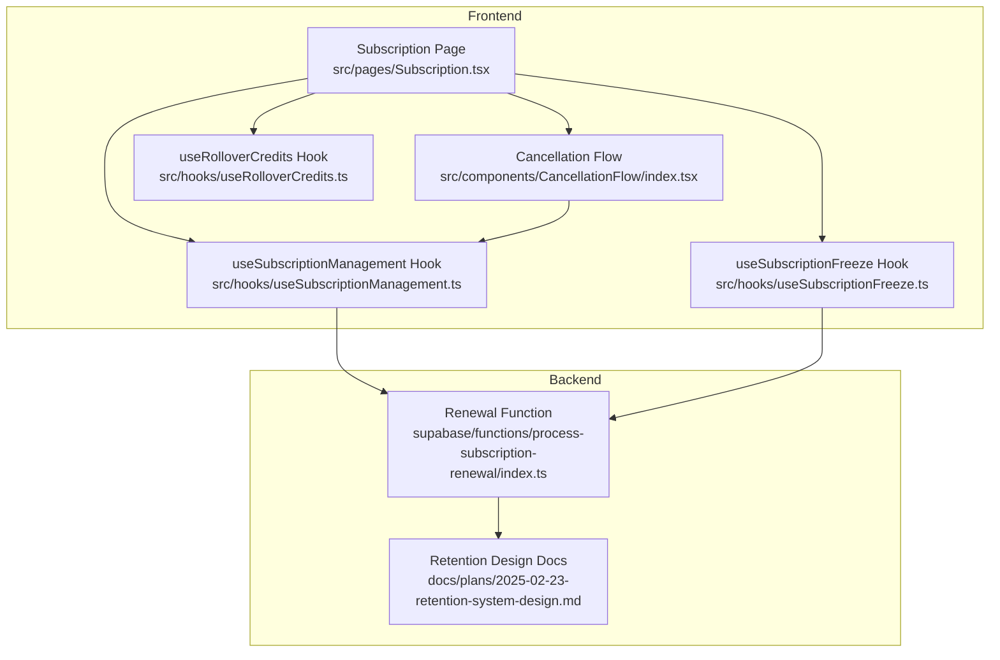
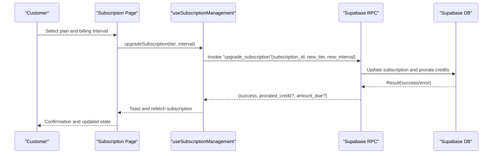
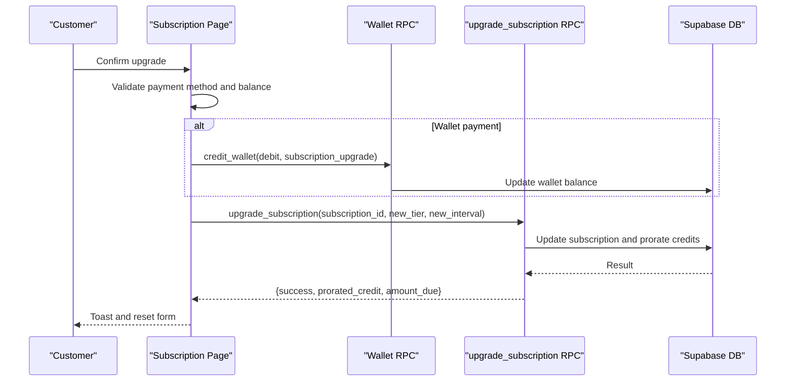
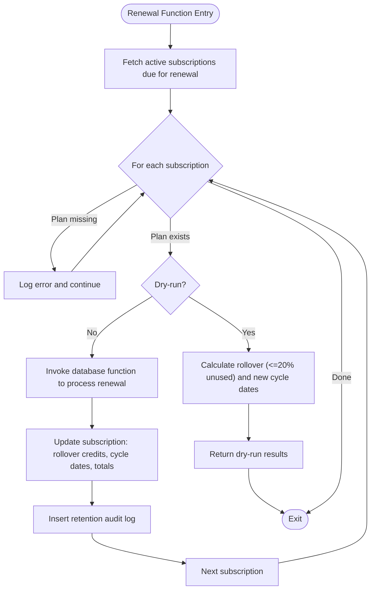
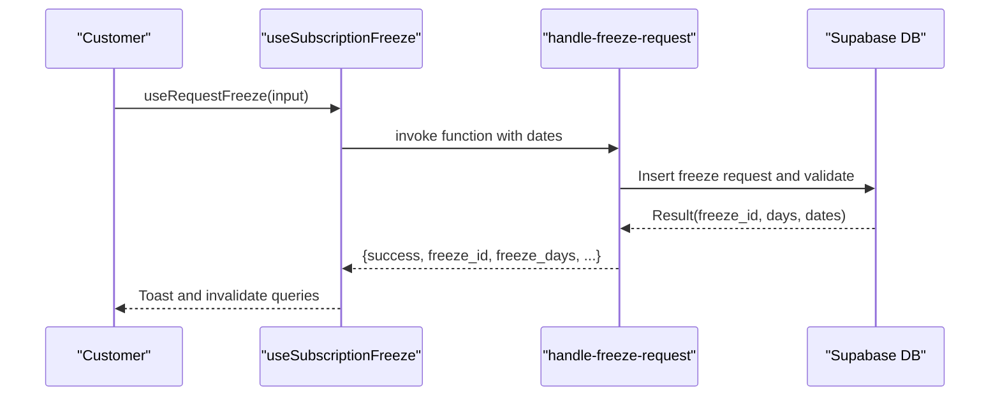
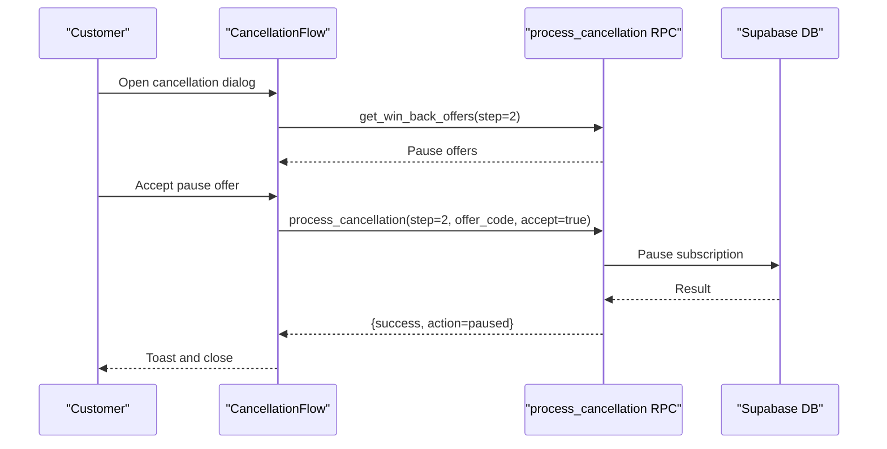
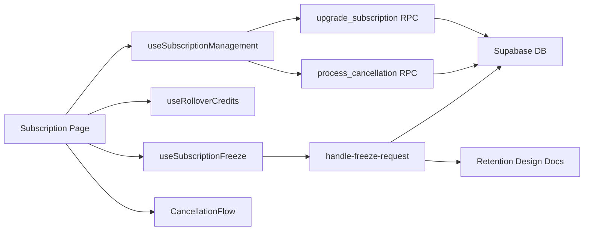

# Subscription Management

<cite>
**Referenced Files in This Document**
- [Subscription.tsx](file://src/pages/Subscription.tsx)
- [useSubscriptionManagement.ts](file://src/hooks/useSubscriptionManagement.ts)
- [CancellationFlow/index.tsx](file://src/components/CancellationFlow/index.tsx)
- [useRolloverCredits.ts](file://src/hooks/useRolloverCredits.ts)
- [useSubscriptionFreeze.ts](file://src/hooks/useSubscriptionFreeze.ts)
- [process-subscription-renewal/index.ts](file://supabase/functions/process-subscription-renewal/index.ts)
- [2025-02-23-retention-system-design.md](file://docs/plans/2025-02-23-retention-system-design.md)
- [2025-02-23-retention-system-plan.md](file://docs/plans/2025-02-23-retention-system-plan.md)
- [AdminSubscriptions.tsx](file://src/pages/admin/AdminSubscriptions.tsx)
- [UserSubscriptionManager.tsx](file://src/components/admin/UserSubscriptionManager.tsx)
</cite>

## Table of Contents
1. [Introduction](#introduction)
2. [Project Structure](#project-structure)
3. [Core Components](#core-components)
4. [Architecture Overview](#architecture-overview)
5. [Detailed Component Analysis](#detailed-component-analysis)
6. [Dependency Analysis](#dependency-analysis)
7. [Performance Considerations](#performance-considerations)
8. [Troubleshooting Guide](#troubleshooting-guide)
9. [Conclusion](#conclusion)

## Introduction
This document describes the subscription management system, covering subscription plans and pricing tiers, the subscription wizard and plan selection process, upgrade/downgrade procedures, status monitoring, renewal date tracking, automatic payment processing, freeze/unfreeze functionality, rollover credits system, cancellation workflow, analytics, usage tracking, and billing history management. The system integrates frontend React components with Supabase database queries and serverless functions to provide a robust subscription lifecycle experience.

## Project Structure
The subscription management system spans frontend pages, hooks, components, and backend Supabase functions and documentation:

- Frontend pages and components:
  - Subscription page for plan selection, upgrades, and management
  - Cancellation flow with multi-step wizard
  - Hooks for subscription plans, rollover credits, and freeze management
- Backend:
  - Supabase functions for renewal processing and freeze handling
  - Retention system design documents detailing rollover and freeze mechanics

**Diagram sources**
- [Subscription.tsx:126-418](file://src/pages/Subscription.tsx#L126-L418)
- [useSubscriptionManagement.ts:48-395](file://src/hooks/useSubscriptionManagement.ts#L48-L395)
- [CancellationFlow/index.tsx:25-360](file://src/components/CancellationFlow/index.tsx#L25-L360)
- [useRolloverCredits.ts:24-122](file://src/hooks/useRolloverCredits.ts#L24-L122)
- [useSubscriptionFreeze.ts:88-267](file://src/hooks/useSubscriptionFreeze.ts#L88-L267)
- [process-subscription-renewal/index.ts:96-194](file://supabase/functions/process-subscription-renewal/index.ts#L96-L194)
- [2025-02-23-retention-system-design.md:278-422](file://docs/plans/2025-02-23-retention-system-design.md#L278-L422)

**Section sources**
- [Subscription.tsx:126-418](file://src/pages/Subscription.tsx#L126-L418)
- [useSubscriptionManagement.ts:48-395](file://src/hooks/useSubscriptionManagement.ts#L48-L395)
- [CancellationFlow/index.tsx:25-360](file://src/components/CancellationFlow/index.tsx#L25-L360)
- [useRolloverCredits.ts:24-122](file://src/hooks/useRolloverCredits.ts#L24-L122)
- [useSubscriptionFreeze.ts:88-267](file://src/hooks/useSubscriptionFreeze.ts#L88-L267)
- [process-subscription-renewal/index.ts:96-194](file://supabase/functions/process-subscription-renewal/index.ts#L96-L194)
- [2025-02-23-retention-system-design.md:278-422](file://docs/plans/2025-02-23-retention-system-design.md#L278-L422)

## Core Components
- Subscription Page: Renders plan cards, manages billing interval selection, handles upgrades, toggles auto-renewal, displays usage and rollover credits, and opens the cancellation flow.
- Cancellation Flow: Multi-step wizard guiding users through survey, pause offer, discount offer, and final confirmation or downgrade options.
- useSubscriptionManagement Hook: Centralizes plan retrieval, current plan detection, subscription creation/upgrades, win-back offers, cancellation processing, and resuming paused subscriptions.
- useRolloverCredits Hook: Provides rollover credit information and related utilities; currently returns defaults due to disabled rollover tables/columns.
- useSubscriptionFreeze Hook: Manages freeze requests, cancellations, active/freezes queries, and freeze-day counters.
- Renewal Function: Processes subscription renewals, calculates rollover credits, updates cycles, and handles dry-run scenarios.

**Section sources**
- [Subscription.tsx:126-418](file://src/pages/Subscription.tsx#L126-L418)
- [CancellationFlow/index.tsx:25-360](file://src/components/CancellationFlow/index.tsx#L25-L360)
- [useSubscriptionManagement.ts:48-395](file://src/hooks/useSubscriptionManagement.ts#L48-L395)
- [useRolloverCredits.ts:24-122](file://src/hooks/useRolloverCredits.ts#L24-L122)
- [useSubscriptionFreeze.ts:88-267](file://src/hooks/useSubscriptionFreeze.ts#L88-L267)
- [process-subscription-renewal/index.ts:96-194](file://supabase/functions/process-subscription-renewal/index.ts#L96-L194)

## Architecture Overview
The system follows a client-server pattern:
- Frontend components and hooks query Supabase for subscription data and invoke RPC functions for operations like upgrades and cancellations.
- Backend Supabase functions encapsulate business logic for renewal processing, freeze handling, and win-back offers.
- Retention system design documents define server-side calculations for rollover credits and freeze extensions.

**Diagram sources**
- [Subscription.tsx:310-418](file://src/pages/Subscription.tsx#L310-L418)
- [useSubscriptionManagement.ts:163-220](file://src/hooks/useSubscriptionManagement.ts#L163-L220)

**Section sources**
- [Subscription.tsx:310-418](file://src/pages/Subscription.tsx#L310-L418)
- [useSubscriptionManagement.ts:163-220](file://src/hooks/useSubscriptionManagement.ts#L163-L220)

## Detailed Component Analysis

### Subscription Plans and Pricing Tiers
- Plan metadata includes tier, billing interval, price in QAR, meals per month, daily allocations, features, and popularity/VIP flags.
- Annual billing applies a 17% savings banner and recalculates plan prices accordingly.
- Features and descriptions are localized and can be overridden by database-provided content.

Implementation highlights:
- Plan mapping and annual pricing conversion
- Feature lists and promotional badges
- VIP plan identification and special styling

**Section sources**
- [Subscription.tsx:52-124](file://src/pages/Subscription.tsx#L52-L124)
- [Subscription.tsx:500-517](file://src/pages/Subscription.tsx#L500-L517)

### Subscription Wizard and Plan Selection
- Users choose between monthly and annual billing intervals.
- Plan cards display pricing, meal quotas, and benefits.
- Annual plans show savings messaging and feature enhancements.

**Section sources**
- [Subscription.tsx:500-604](file://src/pages/Subscription.tsx#L500-L604)

### Upgrade/Downgrade Procedures
- Upgrade flow validates payment method (card or wallet), checks wallet balance if applicable, debits wallet via RPC, and invokes the upgrade RPC for proration and billing interval changes.
- Downgrade occurs within the cancellation flow via win-back offers (e.g., bonus or downgrade options).

**Diagram sources**
- [Subscription.tsx:310-418](file://src/pages/Subscription.tsx#L310-L418)

**Section sources**
- [Subscription.tsx:310-418](file://src/pages/Subscription.tsx#L310-L418)

### Status Monitoring and Auto-Renewal
- Auto-renewal toggle syncs with database and provides immediate feedback via toasts.
- Subscription status (active, paused, cancelled) is displayed prominently with formatted dates.

**Section sources**
- [Subscription.tsx:206-225](file://src/pages/Subscription.tsx#L206-L225)
- [Subscription.tsx:724-763](file://src/pages/Subscription.tsx#L724-L763)

### Renewal Date Tracking and Automatic Payment Processing
- Renewal function identifies subscriptions due for renewal, calculates rollover credits (up to 20% unused monthly credits), extends billing cycles, and applies freeze-day extensions.
- Dry-run mode allows previewing renewal outcomes without executing changes.

**Diagram sources**
- [process-subscription-renewal/index.ts:96-194](file://supabase/functions/process-subscription-renewal/index.ts#L96-L194)
- [2025-02-23-retention-system-design.md:280-422](file://docs/plans/2025-02-23-retention-system-design.md#L280-L422)

**Section sources**
- [process-subscription-renewal/index.ts:96-194](file://supabase/functions/process-subscription-renewal/index.ts#L96-L194)
- [2025-02-23-retention-system-design.md:280-422](file://docs/plans/2025-02-23-retention-system-design.md#L280-L422)

### Freeze/Unfreeze Functionality
- Users can request freezes within a 7-day allowance per billing cycle; requests are validated and scheduled.
- Active freezes are tracked, and the system prevents overlapping freezes.
- Freezes extend billing cycles by the freeze duration upon completion.

**Diagram sources**
- [useSubscriptionFreeze.ts:117-163](file://src/hooks/useSubscriptionFreeze.ts#L117-L163)

**Section sources**
- [useSubscriptionFreeze.ts:88-267](file://src/hooks/useSubscriptionFreeze.ts#L88-L267)

### Rollover Credits System
- Rollover credits represent unused monthly credits rolled over (up to 20%) into the next cycle.
- The retention design document defines the server-side calculation and audit logging.
- The frontend hook currently returns default values because rollover tables/columns are not present in the database.

**Section sources**
- [2025-02-23-retention-system-design.md:280-422](file://docs/plans/2025-02-23-retention-system-design.md#L280-L422)
- [useRolloverCredits.ts:24-122](file://src/hooks/useRolloverCredits.ts#L24-L122)

### Cancellation Workflow
- Multi-step wizard captures cancellation reasons, presents win-back offers (pause, discount, downgrade, bonus), and confirms cancellation.
- Offers are fetched dynamically per step and processed via the cancellation RPC.
- Abandonment and acceptance events are tracked for analytics.

**Diagram sources**
- [CancellationFlow/index.tsx:50-144](file://src/components/CancellationFlow/index.tsx#L50-L144)

**Section sources**
- [CancellationFlow/index.tsx:25-360](file://src/components/CancellationFlow/index.tsx#L25-L360)

### Subscription Analytics, Usage Tracking, and Billing History
- Usage tracking includes meals used, remaining, and days until reset; unlimited plans bypass per-meal quotas.
- Rollover credits widget surfaces rollover balances and expirations.
- Billing history management is handled through Supabase queries and RPCs invoked by the frontend.

**Section sources**
- [Subscription.tsx:658-700](file://src/pages/Subscription.tsx#L658-L700)
- [Subscription.tsx:764-763](file://src/pages/Subscription.tsx#L764-L763)

### Admin Subscription Management
- Admin pages allow viewing and editing subscription plans, creating new plans, and managing user subscriptions.
- Plan editing supports tier, billing interval, pricing, and feature configuration.

**Section sources**
- [AdminSubscriptions.tsx:539-732](file://src/pages/admin/AdminSubscriptions.tsx#L539-L732)
- [UserSubscriptionManager.tsx:435-466](file://src/components/admin/UserSubscriptionManager.tsx#L435-L466)

## Dependency Analysis
The subscription system exhibits clear separation of concerns:
- Frontend pages depend on hooks for data and operations.
- Hooks depend on Supabase client and RPC functions.
- RPC functions depend on Supabase database tables and server-side logic.
- Retention design documents define the authoritative server-side behavior for rollover and freeze.

**Diagram sources**
- [Subscription.tsx:126-418](file://src/pages/Subscription.tsx#L126-L418)
- [useSubscriptionManagement.ts:163-395](file://src/hooks/useSubscriptionManagement.ts#L163-L395)
- [useRolloverCredits.ts:24-122](file://src/hooks/useRolloverCredits.ts#L24-L122)
- [useSubscriptionFreeze.ts:117-163](file://src/hooks/useSubscriptionFreeze.ts#L117-L163)
- [CancellationFlow/index.tsx:50-144](file://src/components/CancellationFlow/index.tsx#L50-L144)
- [process-subscription-renewal/index.ts:96-194](file://supabase/functions/process-subscription-renewal/index.ts#L96-L194)
- [2025-02-23-retention-system-design.md:280-422](file://docs/plans/2025-02-23-retention-system-design.md#L280-L422)

**Section sources**
- [Subscription.tsx:126-418](file://src/pages/Subscription.tsx#L126-L418)
- [useSubscriptionManagement.ts:163-395](file://src/hooks/useSubscriptionManagement.ts#L163-L395)
- [useRolloverCredits.ts:24-122](file://src/hooks/useRolloverCredits.ts#L24-L122)
- [useSubscriptionFreeze.ts:117-163](file://src/hooks/useSubscriptionFreeze.ts#L117-L163)
- [CancellationFlow/index.tsx:50-144](file://src/components/CancellationFlow/index.tsx#L50-L144)
- [process-subscription-renewal/index.ts:96-194](file://supabase/functions/process-subscription-renewal/index.ts#L96-L194)
- [2025-02-23-retention-system-design.md:280-422](file://docs/plans/2025-02-23-retention-system-design.md#L280-L422)

## Performance Considerations
- Use optimistic updates for quick UI feedback during upgrades and cancellations, with fallbacks on error.
- Debounce or batch queries for rollover and freeze data to reduce network overhead.
- Cache frequently accessed plan data and subscription state to minimize repeated fetches.
- Monitor RPC latency and implement retry/backoff strategies for critical operations.

## Troubleshooting Guide
Common issues and resolutions:
- Upgrade fails due to insufficient wallet balance: Verify wallet balance and payment method selection before invoking upgrade.
- Cancellation flow errors: Check RPC responses for actionable messages and surface user-friendly errors via toasts.
- Freeze request conflicts: Ensure no overlapping freezes and respect the 7-day allowance per cycle.
- Rollover data not updating: Confirm rollover tables/columns exist; the frontend currently returns defaults when disabled.

**Section sources**
- [Subscription.tsx:324-344](file://src/pages/Subscription.tsx#L324-L344)
- [CancellationFlow/index.tsx:134-143](file://src/components/CancellationFlow/index.tsx#L134-L143)
- [useSubscriptionFreeze.ts:120-162](file://src/hooks/useSubscriptionFreeze.ts#L120-L162)
- [useRolloverCredits.ts:24-39](file://src/hooks/useRolloverCredits.ts#L24-L39)

## Conclusion
The subscription management system provides a comprehensive, user-friendly experience for plan selection, upgrades, cancellations, and lifecycle maintenance. It leverages Supabase RPCs and serverless functions to enforce business rules for renewals, rollovers, and freezes while offering clear analytics and admin controls. Areas for future enhancement include enabling the rollover feature set and expanding billing history visibility.