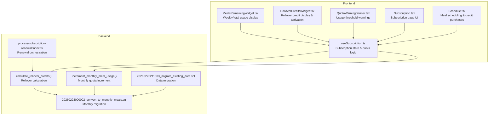
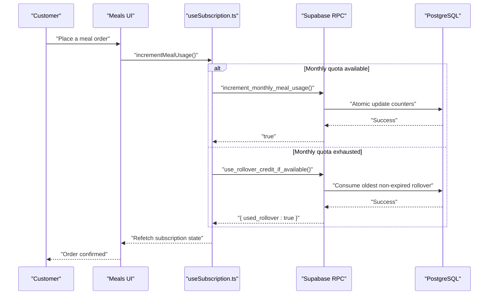
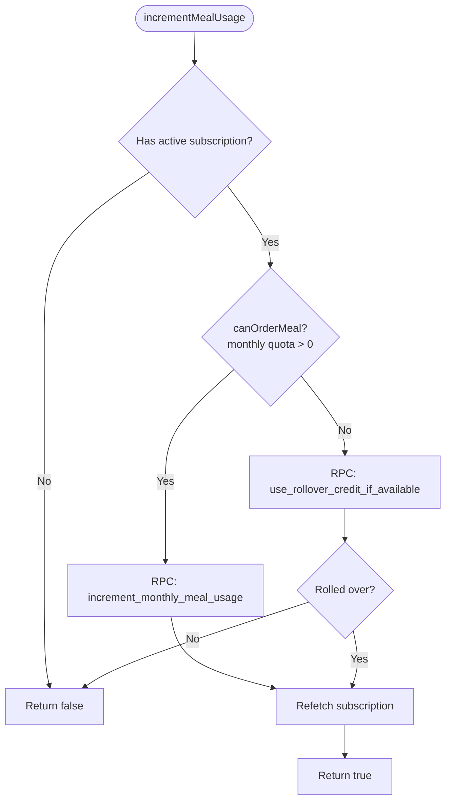
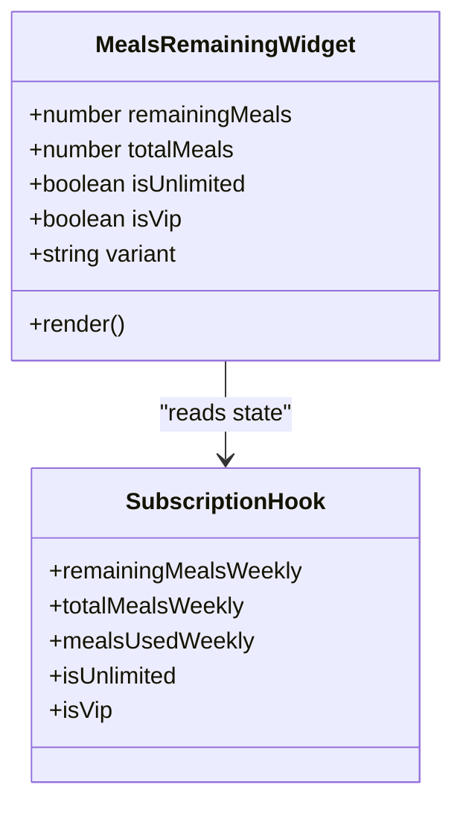
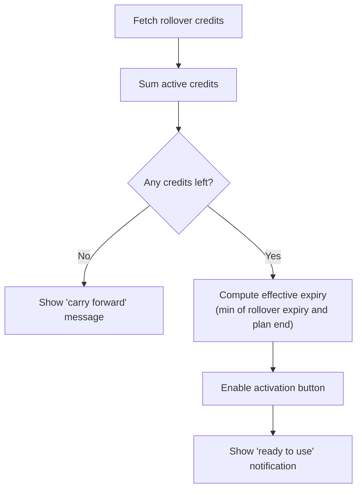
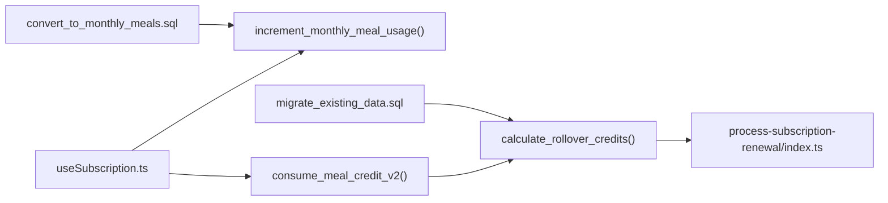

# Meal Quota & Usage Tracking

<cite>
**Referenced Files in This Document**
- [useSubscription.ts](file://src/hooks/useSubscription.ts)
- [MealsRemainingWidget.tsx](file://src/components/MealsRemainingWidget.tsx)
- [RolloverCreditsWidget.tsx](file://src/components/RolloverCreditsWidget.tsx)
- [QuotaWarningBanner.tsx](file://src/components/QuotaWarningBanner.tsx)
- [Subscription.tsx](file://src/pages/Subscription.tsx)
- [Schedule.tsx](file://src/pages/Schedule.tsx)
- [20260223000002_convert_to_monthly_meals.sql](file://supabase/migrations/20260223000002_convert_to_monthly_meals.sql)
- [2025-02-23-retention-system-design.md](file://docs/plans/2025-02-23-retention-system-design.md)
- [process-subscription-renewal/index.ts](file://supabase/functions/process-subscription-renewal/index.ts)
- [20260225211303_migrate_existing_data.sql](file://supabase/migrations/20260225211303_migrate_existing_data.sql)
- [20250225_add_annual_billing.sql](file://supabase/migrations/20250225_add_annual_billing.sql)
- [BUSINESS_MODEL_FIX_SUMMARY.md](file://BUSINESS_MODEL_FIX_SUMMARY.md)
- [progress.spec.ts](file://e2e/customer/progress.spec.ts)
</cite>

## Table of Contents
1. [Introduction](#introduction)
2. [Project Structure](#project-structure)
3. [Core Components](#core-components)
4. [Architecture Overview](#architecture-overview)
5. [Detailed Component Analysis](#detailed-component-analysis)
6. [Dependency Analysis](#dependency-analysis)
7. [Performance Considerations](#performance-considerations)
8. [Troubleshooting Guide](#troubleshooting-guide)
9. [Conclusion](#conclusion)

## Introduction
This document explains the meal quota system and usage tracking across the customer portal, covering unlimited versus limited plans, monthly quota cycles, snack tracking, rollover credits, quota enforcement, and integration with the nutrition tracking dashboard. It also documents how the system prevents orders beyond available meal limits and how unused weekly credits roll over to the next week under the retention system.

## Project Structure
The meal quota system spans frontend React components and backend Supabase functions and migrations:
- Frontend: subscription hook, quota widgets, warning banners, and subscription pages
- Backend: monthly quota functions, rollover calculation, renewal processing, and data migrations

**Diagram sources**
- [useSubscription.ts:42-263](file://src/hooks/useSubscription.ts#L42-L263)
- [MealsRemainingWidget.tsx:15-282](file://src/components/MealsRemainingWidget.tsx#L15-L282)
- [RolloverCreditsWidget.tsx:23-229](file://src/components/RolloverCreditsWidget.tsx#L23-L229)
- [QuotaWarningBanner.tsx:8-48](file://src/components/QuotaWarningBanner.tsx#L8-L48)
- [Subscription.tsx:649-673](file://src/pages/Subscription.tsx#L649-L673)
- [Schedule.tsx:133-168](file://src/pages/Schedule.tsx#L133-L168)
- [20260223000002_convert_to_monthly_meals.sql:32-130](file://supabase/migrations/20260223000002_convert_to_monthly_meals.sql#L32-L130)
- [2025-02-23-retention-system-design.md:283-423](file://docs/plans/2025-02-23-retention-system-design.md#L283-L423)
- [process-subscription-renewal/index.ts:122-277](file://supabase/functions/process-subscription-renewal/index.ts#L122-L277)
- [20260225211303_migrate_existing_data.sql:1-36](file://supabase/migrations/20260225211303_migrate_existing_data.sql#L1-L36)

**Section sources**
- [useSubscription.ts:42-263](file://src/hooks/useSubscription.ts#L42-L263)
- [20260223000002_convert_to_monthly_meals.sql:32-130](file://supabase/migrations/20260223000002_convert_to_monthly_meals.sql#L32-L130)

## Core Components
- Subscription hook: centralizes quota state, calculates remaining meals, enforces ordering rules, and triggers quota increments or rollover consumption
- MealsRemainingWidget: displays weekly and monthly usage with progress indicators and status messaging
- RolloverCreditsWidget: shows rollover credit balance, expiration, and activation state
- QuotaWarningBanner: alerts users when usage exceeds thresholds and guides upgrade actions
- Subscription page: shows remaining meals, usage bars, and rollover details
- Schedule page: allows purchasing extra meal credits when wallet balance permits

**Section sources**
- [useSubscription.ts:21-40](file://src/hooks/useSubscription.ts#L21-L40)
- [MealsRemainingWidget.tsx:6-22](file://src/components/MealsRemainingWidget.tsx#L6-L22)
- [RolloverCreditsWidget.tsx:18-21](file://src/components/RolloverCreditsWidget.tsx#L18-L21)
- [QuotaWarningBanner.tsx:8-17](file://src/components/QuotaWarningBanner.tsx#L8-L17)
- [Subscription.tsx:649-673](file://src/pages/Subscription.tsx#L649-L673)
- [Schedule.tsx:133-168](file://src/pages/Schedule.tsx#L133-L168)

## Architecture Overview
The quota system operates on a monthly cycle with optional rollover credits. The frontend consumes Supabase RPC functions to increment quotas and consume rollover credits atomically, ensuring concurrency safety and accurate usage tracking.

**Diagram sources**
- [useSubscription.ts:163-203](file://src/hooks/useSubscription.ts#L163-L203)
- [20260223000002_convert_to_monthly_meals.sql:32-72](file://supabase/migrations/20260223000002_convert_to_monthly_meals.sql#L32-L72)
- [2025-02-23-retention-system-design.md:578-723](file://docs/plans/2025-02-23-retention-system-design.md#L578-L723)

## Detailed Component Analysis

### Subscription Hook: Quota State & Enforcement
The hook manages:
- Active subscription detection and paused states
- Unlimited/VIP plans (no finite quota)
- Monthly and weekly quota calculations
- Quota enforcement for ordering
- Incrementing usage via RPC and consuming rollover credits

Key behaviors:
- Remaining meals computed from monthly totals minus used count
- canOrderMeal gate prevents placing orders when quota is exhausted and no rollover credits are available
- incrementMealUsage chooses between monthly increment and rollover consumption

**Diagram sources**
- [useSubscription.ts:163-203](file://src/hooks/useSubscription.ts#L163-L203)

**Section sources**
- [useSubscription.ts:136-161](file://src/hooks/useSubscription.ts#L136-L161)
- [useSubscription.ts:163-203](file://src/hooks/useSubscription.ts#L163-L203)

### MealsRemainingWidget: Usage Display & Progress
Displays:
- Weekly remaining meals and usage percentage
- Color-coded status based on remaining meals
- Progress bar indicating used vs remaining
- Variant modes for compact, banner, and full layouts

**Diagram sources**
- [MealsRemainingWidget.tsx:15-282](file://src/components/MealsRemainingWidget.tsx#L15-L282)
- [useSubscription.ts:251-259](file://src/hooks/useSubscription.ts#L251-L259)

**Section sources**
- [MealsRemainingWidget.tsx:15-282](file://src/components/MealsRemainingWidget.tsx#L15-L282)

### RolloverCreditsWidget: Rollover Management
Displays:
- Total rollover credits and nearest expiry
- Activation toggle to indicate credits are ready to use
- Syncs expiry dates with plan end date when known
- Local persistence of activation state per device

**Diagram sources**
- [RolloverCreditsWidget.tsx:58-98](file://src/components/RolloverCreditsWidget.tsx#L58-L98)
- [RolloverCreditsWidget.tsx:155-228](file://src/components/RolloverCreditsWidget.tsx#L155-L228)

**Section sources**
- [RolloverCreditsWidget.tsx:23-229](file://src/components/RolloverCreditsWidget.tsx#L23-L229)

### QuotaWarningBanner: Threshold Alerts
Shows:
- Warning when usage exceeds 75%
- Destructive alert when quota is fully used
- Navigation to subscription page for upgrades

**Section sources**
- [QuotaWarningBanner.tsx:8-48](file://src/components/QuotaWarningBanner.tsx#L8-L48)

### Subscription Page: Monthly Quota Overview
Displays:
- Remaining meals and rollover credits when applicable
- Usage bar showing meals used vs total
- Days until reset countdown

**Section sources**
- [Subscription.tsx:649-673](file://src/pages/Subscription.tsx#L649-L673)

### Schedule Page: Extra Credit Purchase
Allows:
- Purchasing additional meal credits when wallet balance suffices
- Updating subscription monthly allowance accordingly

**Section sources**
- [Schedule.tsx:133-168](file://src/pages/Schedule.tsx#L133-L168)

## Dependency Analysis
The quota system depends on:
- Supabase RPC functions for atomic quota increments and rollover consumption
- Monthly migration for normalized quota tracking
- Rollover calculation function invoked during renewal processing
- Data migration to align existing subscriptions to the new credit system

**Diagram sources**
- [useSubscription.ts:163-203](file://src/hooks/useSubscription.ts#L163-L203)
- [20260223000002_convert_to_monthly_meals.sql:32-72](file://supabase/migrations/20260223000002_convert_to_monthly_meals.sql#L32-L72)
- [2025-02-23-retention-system-design.md:578-723](file://docs/plans/2025-02-23-retention-system-design.md#L578-L723)
- [process-subscription-renewal/index.ts:122-277](file://supabase/functions/process-subscription-renewal/index.ts#L122-L277)
- [20260225211303_migrate_existing_data.sql:1-36](file://supabase/migrations/20260225211303_migrate_existing_data.sql#L1-L36)

**Section sources**
- [20260223000002_convert_to_monthly_meals.sql:32-130](file://supabase/migrations/20260223000002_convert_to_monthly_meals.sql#L32-L130)
- [2025-02-23-retention-system-design.md:283-423](file://docs/plans/2025-02-23-retention-system-design.md#L283-L423)
- [process-subscription-renewal/index.ts:122-277](file://supabase/functions/process-subscription-renewal/index.ts#L122-L277)
- [20260225211303_migrate_existing_data.sql:1-36](file://supabase/migrations/20260225211303_migrate_existing_data.sql#L1-L36)

## Performance Considerations
- Atomic updates: RPC functions ensure concurrency safety for quota increments and rollover consumption
- Minimal UI refresh: Real-time subscription channels trigger targeted refetches
- Efficient queries: Widgets compute derived values client-side from normalized subscription data
- Indexes and policies: Database migrations include indexes and row-level security for optimal performance and access control

## Troubleshooting Guide
Common scenarios and resolutions:
- Orders blocked despite having rollover credits:
  - Verify activation state and that rollover credits are not expired
  - Confirm the subscription end date is synchronized with rollover expiries
- Quota not resetting:
  - Ensure the monthly migration is applied and the monthly reset function is active
  - Check that the subscription tier and plan mapping align with expected quotas
- VIP users unable to order:
  - Unlimited plans bypass quota checks; verify tier assignment and monthly quota values
- Edge case: zero remaining meals with rollover credits:
  - The system attempts rollover consumption first; if none is available, orders are blocked

**Section sources**
- [RolloverCreditsWidget.tsx:47-56](file://src/components/RolloverCreditsWidget.tsx#L47-L56)
- [useSubscription.ts:163-203](file://src/hooks/useSubscription.ts#L163-L203)
- [BUSINESS_MODEL_FIX_SUMMARY.md:150-175](file://BUSINESS_MODEL_FIX_SUMMARY.md#L150-L175)

## Conclusion
The meal quota system combines monthly tracking with rollover credits to provide flexible, fair usage while preventing overspending. The frontend enforces ordering rules, while backend RPC functions ensure atomic, race-condition-free quota updates. Integration with the nutrition dashboard enables users to correlate meal usage with health metrics, supporting long-term engagement and retention.