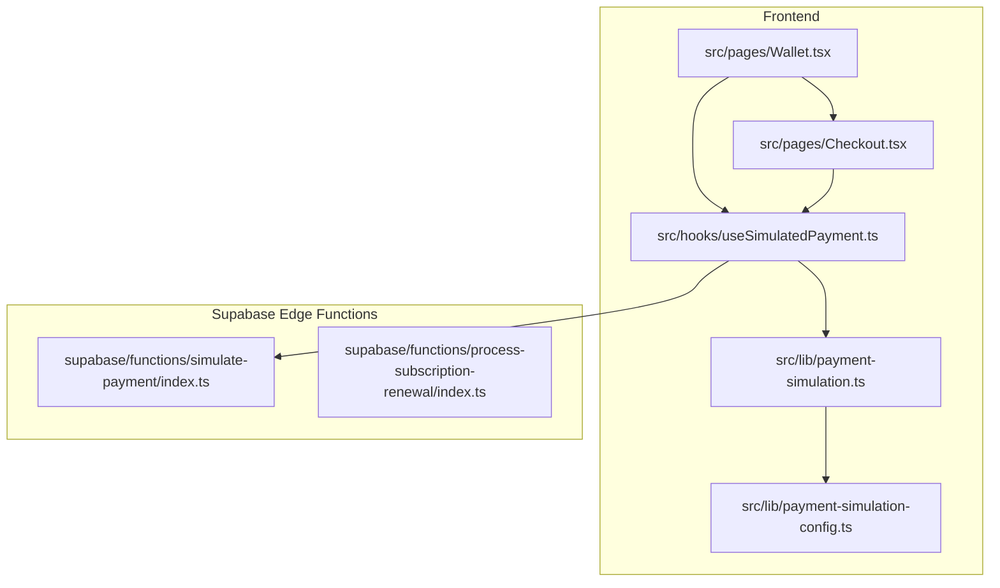
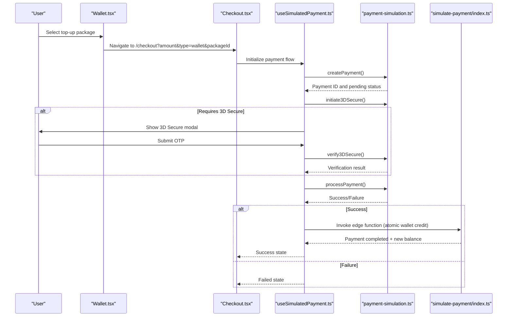
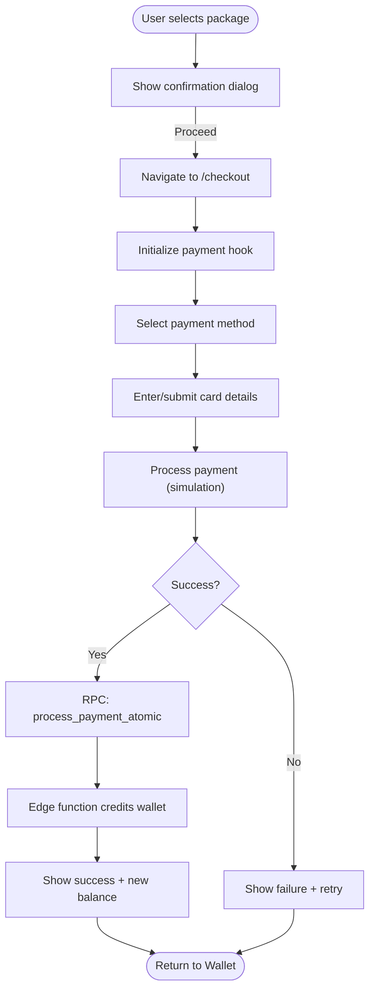
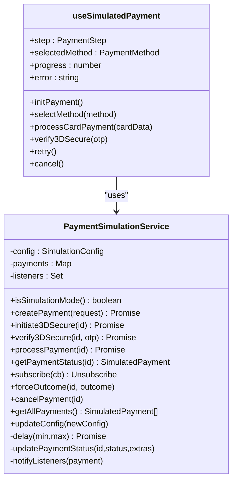
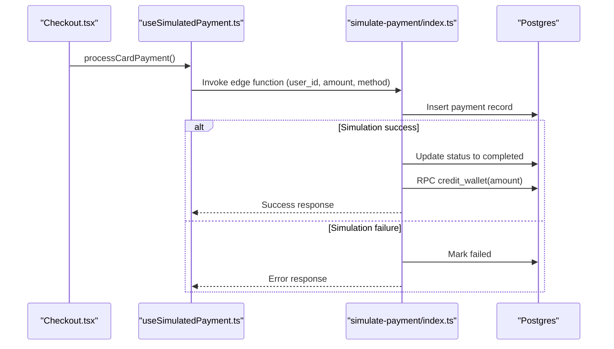
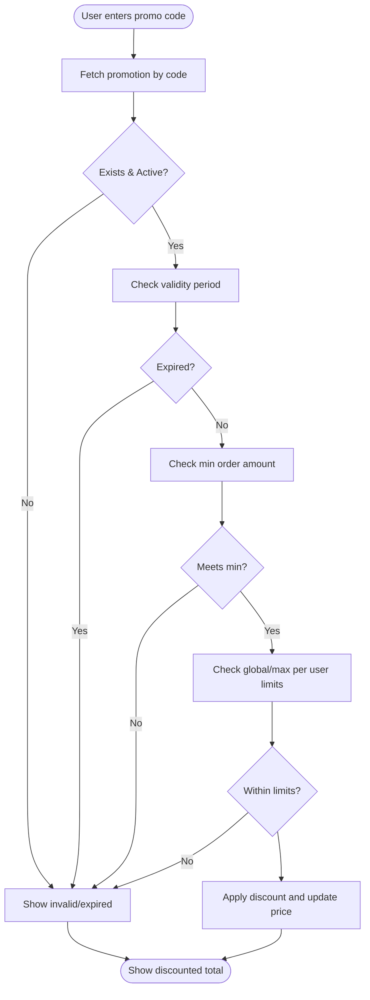
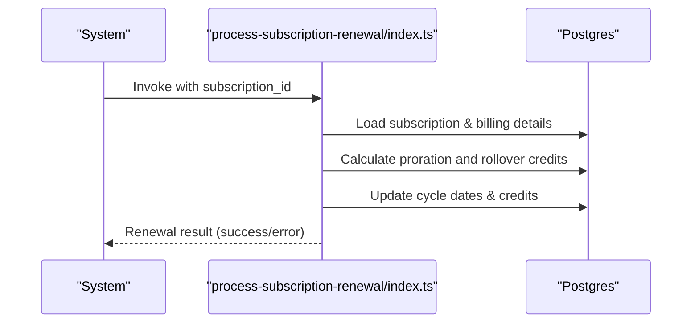
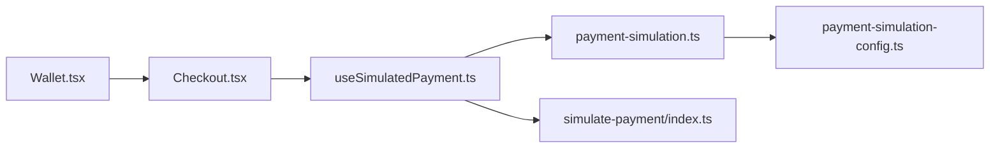

# Payment Processing & Wallet Integration

<cite>
**Referenced Files in This Document**
- [Checkout.tsx](file://src/pages/Checkout.tsx)
- [Wallet.tsx](file://src/pages/Wallet.tsx)
- [payment-simulation.ts](file://src/lib/payment-simulation.ts)
- [payment-simulation-config.ts](file://src/lib/payment-simulation-config.ts)
- [useSimulatedPayment.ts](file://src/hooks/useSimulatedPayment.ts)
- [simulate-payment/index.ts](file://supabase/functions/simulate-payment/index.ts)
- [Subscription.tsx](file://src/pages/Subscription.tsx)
- [process-subscription-renewal/index.ts](file://supabase/functions/process-subscription-renewal/index.ts)
- [PHASE2_EDGE_FUNCTIONS.md](file://supabase/functions/PHASE2_EDGE_FUNCTIONS.md)
- [PAYMENT_SIMULATION_SUMMARY.md](file://PAYMENT_SIMULATION_SUMMARY.md)
- [critical-flows.test.tsx](file://src/test/integration/critical-flows.test.tsx)
</cite>

## Table of Contents
1. [Introduction](#introduction)
2. [Project Structure](#project-structure)
3. [Core Components](#core-components)
4. [Architecture Overview](#architecture-overview)
5. [Detailed Component Analysis](#detailed-component-analysis)
6. [Dependency Analysis](#dependency-analysis)
7. [Performance Considerations](#performance-considerations)
8. [Troubleshooting Guide](#troubleshooting-guide)
9. [Conclusion](#conclusion)

## Introduction
This document describes the payment processing system and wallet integration for the customer portal. It covers:
- Dual payment method support (credit/debit cards, Sadad, Apple Pay, Google Pay) with seamless switching
- Wallet balance management (funding, bonuses, transaction history, balance calculations)
- Payment simulation for testing and development
- Supabase edge function integration for secure payment processing and wallet transactions
- Promotional pricing system with discount code validation and usage tracking
- Proration calculations for plan upgrades and partial billing periods
- Error handling for failed payments, insufficient funds, and gateway issues
- Examples of payment flows, wallet integration patterns, and security considerations

## Project Structure
The payment and wallet system spans frontend components, hooks, libraries, and backend Supabase edge functions:
- Frontend pages: Wallet and Checkout
- Hooks and libraries: Payment simulation service and configuration
- Edge functions: Payment simulation and subscription renewal processing
- Subscription page: Promotion code validation and discount application

**Diagram sources**
- [Wallet.tsx:1-221](file://src/pages/Wallet.tsx#L1-221)
- [Checkout.tsx:1-288](file://src/pages/Checkout.tsx#L1-288)
- [useSimulatedPayment.ts:1-189](file://src/hooks/useSimulatedPayment.ts#L1-189)
- [payment-simulation.ts:1-223](file://src/lib/payment-simulation.ts#L1-223)
- [payment-simulation-config.ts:1-79](file://src/lib/payment-simulation-config.ts#L1-79)
- [simulate-payment/index.ts:1-119](file://supabase/functions/simulate-payment/index.ts#L1-119)
- [process-subscription-renewal/index.ts:1-48](file://supabase/functions/process-subscription-renewal/index.ts#L1-48)

**Section sources**
- [Wallet.tsx:1-221](file://src/pages/Wallet.tsx#L1-221)
- [Checkout.tsx:1-288](file://src/pages/Checkout.tsx#L1-288)
- [useSimulatedPayment.ts:1-189](file://src/hooks/useSimulatedPayment.ts#L1-189)
- [payment-simulation.ts:1-223](file://src/lib/payment-simulation.ts#L1-223)
- [payment-simulation-config.ts:1-79](file://src/lib/payment-simulation-config.ts#L1-79)
- [simulate-payment/index.ts:1-119](file://supabase/functions/simulate-payment/index.ts#L1-119)
- [process-subscription-renewal/index.ts:1-48](file://supabase/functions/process-subscription-renewal/index.ts#L1-48)

## Core Components
- Wallet Page: Allows users to select top-up packages, view balance, and access transaction history. Integrates with the checkout flow for payment initiation.
- Checkout Page: Presents payment methods, simulates payment processing, handles 3D Secure verification, and displays success/failure states.
- Payment Simulation Service: Provides realistic payment simulation with configurable success rates, delays, and optional 3D Secure challenges.
- Supabase Edge Functions: Handle payment creation, wallet crediting, and subscription renewal with rollover credits.
- Subscription Page: Implements promotion code validation and discount application logic.

**Section sources**
- [Wallet.tsx:31-221](file://src/pages/Wallet.tsx#L31-221)
- [Checkout.tsx:17-288](file://src/pages/Checkout.tsx#L17-288)
- [payment-simulation.ts:25-223](file://src/lib/payment-simulation.ts#L25-223)
- [simulate-payment/index.ts:14-118](file://supabase/functions/simulate-payment/index.ts#L14-118)
- [Subscription.tsx:250-272](file://src/pages/Subscription.tsx#L250-272)

## Architecture Overview
The system supports two primary flows:
- Wallet Top-up: User selects a package on the Wallet page, navigates to Checkout, and the edge function creates a payment record and credits the wallet upon success.
- Subscription Purchase: Users choose a plan, optionally apply promotions, and the system invokes backend functions for atomic processing.

**Diagram sources**
- [Wallet.tsx:80-90](file://src/pages/Wallet.tsx#L80-90)
- [Checkout.tsx:32-78](file://src/pages/Checkout.tsx#L32-78)
- [useSimulatedPayment.ts:73-132](file://src/hooks/useSimulatedPayment.ts#L73-132)
- [payment-simulation.ts:38-140](file://src/lib/payment-simulation.ts#L38-140)
- [simulate-payment/index.ts:28-82](file://supabase/functions/simulate-payment/index.ts#L28-82)

## Detailed Component Analysis

### Wallet Top-up Flow
- Package selection and confirmation dialog on Wallet page
- Navigation to Checkout with amount, type, and packageId
- Atomic payment processing via Supabase RPC for wallet crediting
- Success notification with new balance and navigation to Wallet page

**Diagram sources**
- [Wallet.tsx:75-90](file://src/pages/Wallet.tsx#L75-90)
- [Checkout.tsx:32-61](file://src/pages/Checkout.tsx#L32-61)
- [useSimulatedPayment.ts:73-132](file://src/hooks/useSimulatedPayment.ts#L73-132)
- [simulate-payment/index.ts:28-82](file://supabase/functions/simulate-payment/index.ts#L28-82)

**Section sources**
- [Wallet.tsx:75-90](file://src/pages/Wallet.tsx#L75-90)
- [Checkout.tsx:32-61](file://src/pages/Checkout.tsx#L32-61)

### Payment Simulation System
- Realistic simulation with configurable delays, success/failure outcomes, and optional 3D Secure challenges
- Progress tracking during processing steps
- Event-driven updates via subscription pattern
- Environment-controlled toggling between simulation and real gateway modes

**Diagram sources**
- [payment-simulation.ts:25-223](file://src/lib/payment-simulation.ts#L25-223)
- [useSimulatedPayment.ts:22-189](file://src/hooks/useSimulatedPayment.ts#L22-189)

**Section sources**
- [payment-simulation.ts:25-223](file://src/lib/payment-simulation.ts#L25-223)
- [payment-simulation-config.ts:23-38](file://src/lib/payment-simulation-config.ts#L23-38)
- [useSimulatedPayment.ts:22-189](file://src/hooks/useSimulatedPayment.ts#L22-189)

### Supabase Edge Function Integration
- Payment simulation function creates payment records, simulates success/failure, and credits wallets atomically
- Real-world integration can be enabled by setting environment variables and invoking real gateway APIs
- Edge functions can be invoked via Supabase client or HTTP requests

**Diagram sources**
- [Checkout.tsx:40-47](file://src/pages/Checkout.tsx#L40-47)
- [useSimulatedPayment.ts:108-126](file://src/hooks/useSimulatedPayment.ts#L108-126)
- [simulate-payment/index.ts:14-118](file://supabase/functions/simulate-payment/index.ts#L14-118)

**Section sources**
- [simulate-payment/index.ts:14-118](file://supabase/functions/simulate-payment/index.ts#L14-118)
- [PHASE2_EDGE_FUNCTIONS.md:224-254](file://supabase/functions/PHASE2_EDGE_FUNCTIONS.md#L224-L254)

### Promotional Pricing System
- Validates promo codes against active promotions with expiration, minimum order amounts, and usage limits
- Applies percentage or fixed discounts and tracks usage per user and globally
- Integrates with subscription checkout to compute discounted totals

**Diagram sources**
- [Subscription.tsx:250-272](file://src/pages/Subscription.tsx#L250-272)

**Section sources**
- [Subscription.tsx:250-272](file://src/pages/Subscription.tsx#L250-272)

### Proration Calculations for Plan Upgrades
- Subscription renewal edge function computes rollover credits and billing cycles
- Integration tests demonstrate annual subscription creation with discount and upgrade scenarios with proration
- Supports partial billing periods and rollover credit adjustments

**Diagram sources**
- [process-subscription-renewal/index.ts:13-28](file://supabase/functions/process-subscription-renewal/index.ts#L13-28)
- [critical-flows.test.tsx:172-197](file://src/test/integration/critical-flows.test.tsx#L172-L197)

**Section sources**
- [process-subscription-renewal/index.ts:13-28](file://supabase/functions/process-subscription-renewal/index.ts#L13-28)
- [critical-flows.test.tsx:172-197](file://src/test/integration/critical-flows.test.tsx#L172-L197)

### Error Handling and Security Considerations
- Payment failure states show user-friendly messages and retry/cancel options
- Simulation mode prominently warns users and logs transactions for auditing
- 3D Secure challenges enhance security for card payments
- Edge functions enforce service role keys and CORS policies for secure invocation

**Section sources**
- [Checkout.tsx:68-86](file://src/pages/Checkout.tsx#L68-86)
- [payment-simulation.ts:129-139](file://src/lib/payment-simulation.ts#L129-139)
- [simulate-payment/index.ts:4-7](file://supabase/functions/simulate-payment/index.ts#L4-7)
- [PAYMENT_SIMULATION_SUMMARY.md:162-167](file://PAYMENT_SIMULATION_SUMMARY.md#L162-L167)

## Dependency Analysis
Key dependencies and relationships:
- Wallet.tsx depends on useWallet hook and navigates to Checkout
- Checkout.tsx orchestrates useSimulatedPayment and invokes Supabase RPC for atomic payments
- useSimulatedPayment integrates with payment-simulation.ts for state management and progress tracking
- payment-simulation.ts uses payment-simulation-config.ts for runtime configuration
- simulate-payment/index.ts interacts with Supabase Postgres to manage payments and wallet credits

**Diagram sources**
- [Wallet.tsx:1-221](file://src/pages/Wallet.tsx#L1-221)
- [Checkout.tsx:1-288](file://src/pages/Checkout.tsx#L1-288)
- [useSimulatedPayment.ts:1-189](file://src/hooks/useSimulatedPayment.ts#L1-189)
- [payment-simulation.ts:1-223](file://src/lib/payment-simulation.ts#L1-223)
- [payment-simulation-config.ts:1-79](file://src/lib/payment-simulation-config.ts#L1-79)
- [simulate-payment/index.ts:1-119](file://supabase/functions/simulate-payment/index.ts#L1-119)

**Section sources**
- [Wallet.tsx:1-221](file://src/pages/Wallet.tsx#L1-221)
- [Checkout.tsx:1-288](file://src/pages/Checkout.tsx#L1-288)
- [useSimulatedPayment.ts:1-189](file://src/hooks/useSimulatedPayment.ts#L1-189)
- [payment-simulation.ts:1-223](file://src/lib/payment-simulation.ts#L1-223)
- [payment-simulation-config.ts:1-79](file://src/lib/payment-simulation-config.ts#L1-79)
- [simulate-payment/index.ts:1-119](file://supabase/functions/simulate-payment/index.ts#L1-119)

## Performance Considerations
- Simulation delays and progress bars provide realistic UX while avoiding real payment latency
- Edge function execution times should be monitored under load; consider connection pooling and CDN caching
- Database triggers can invoke edge functions; ensure proper indexing and monitoring
- Use environment-specific configurations to optimize simulation parameters for testing

[No sources needed since this section provides general guidance]

## Troubleshooting Guide
Common issues and resolutions:
- Simulation mode not enabled: Verify environment variable and banner presence on checkout page
- Payment stuck in processing: Check progress intervals and payment status subscriptions
- 3D Secure failures: Ensure OTP verification logic and reattempt flow
- Edge function errors: Confirm Supabase credentials, CORS headers, and function deployment status
- Promotion validation errors: Validate code existence, expiry, minimum order, and usage limits

**Section sources**
- [PAYMENT_SIMULATION_SUMMARY.md:175-187](file://PAYMENT_SIMULATION_SUMMARY.md#L175-L187)
- [useSimulatedPayment.ts:60-71](file://src/hooks/useSimulatedPayment.ts#L60-71)
- [simulate-payment/index.ts:112-118](file://supabase/functions/simulate-payment/index.ts#L112-118)
- [Subscription.tsx:250-272](file://src/pages/Subscription.tsx#L250-272)

## Conclusion
The payment processing and wallet integration system provides a robust, testable foundation for both wallet top-ups and subscription purchases. The dual payment method support, simulation framework, and Supabase edge functions enable secure, scalable operations with comprehensive error handling and promotional capabilities. The modular design allows seamless switching between simulation and real-world payment gateways, ensuring reliable development and production workflows.