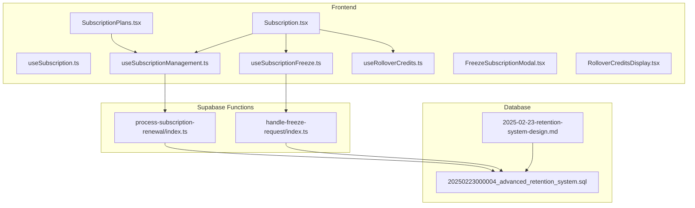
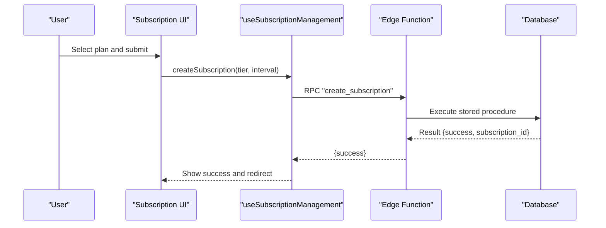
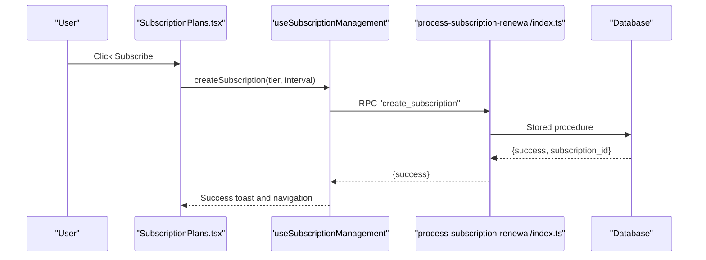
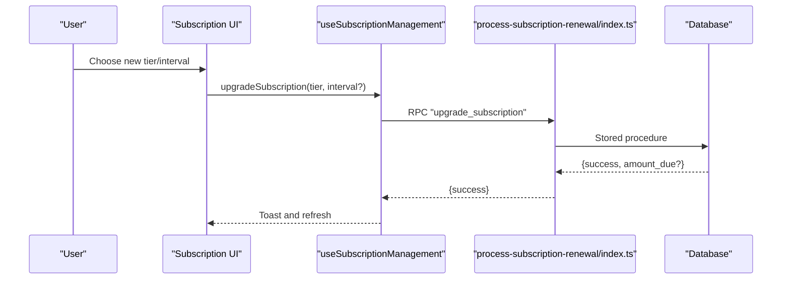
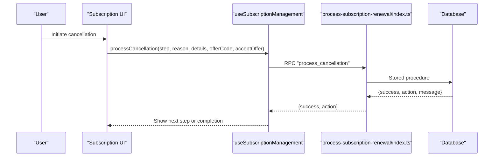
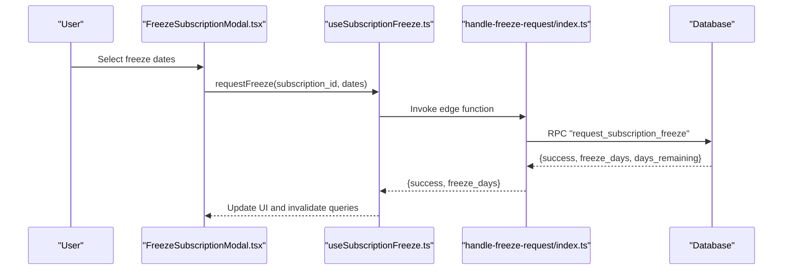
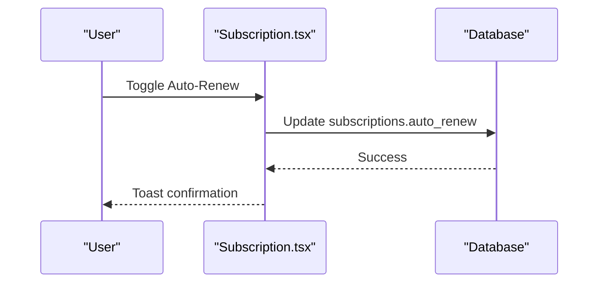
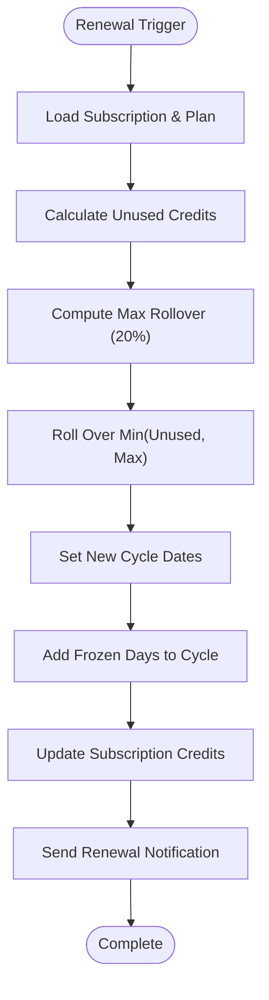
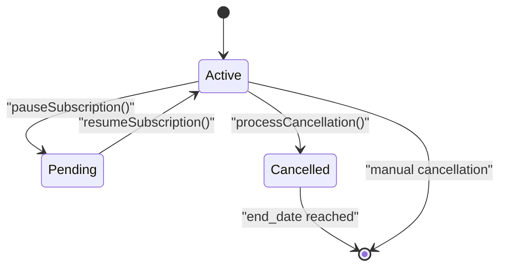
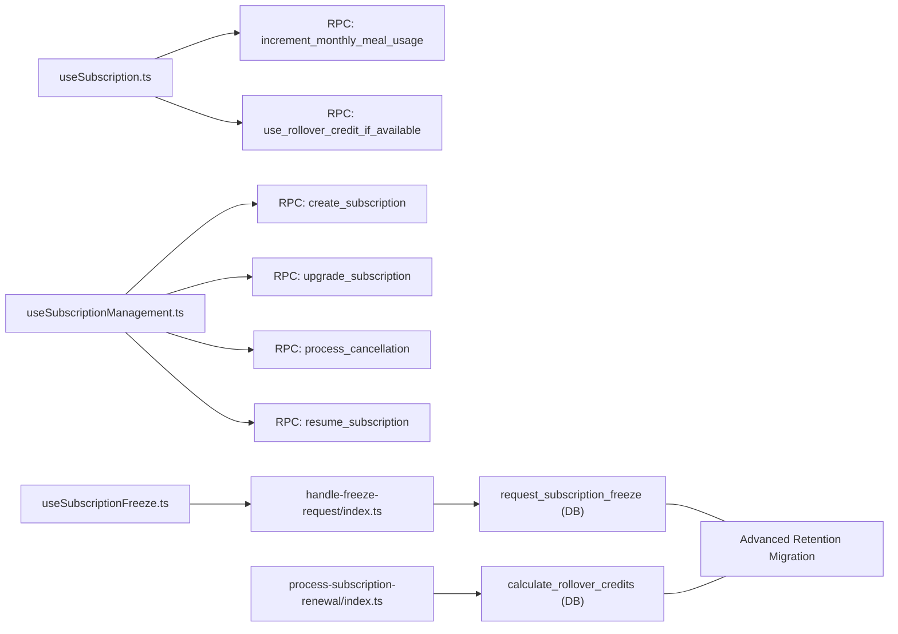

# Subscription Lifecycle Management

<cite>
**Referenced Files in This Document**
- [SubscriptionPlans.tsx](file://src/pages/subscription/SubscriptionPlans.tsx)
- [useSubscription.ts](file://src/hooks/useSubscription.ts)
- [useSubscriptionManagement.ts](file://src/hooks/useSubscriptionManagement.ts)
- [useSubscriptionFreeze.ts](file://src/hooks/useSubscriptionFreeze.ts)
- [useRolloverCredits.ts](file://src/hooks/useRolloverCredits.ts)
- [FreezeSubscriptionModal.tsx](file://src/components/subscription/FreezeSubscriptionModal.tsx)
- [RolloverCreditsDisplay.tsx](file://src/components/subscription/RolloverCreditsDisplay.tsx)
- [Subscription.tsx](file://src/pages/Subscription.tsx)
- [process-subscription-renewal/index.ts](file://supabase/functions/process-subscription-renewal/index.ts)
- [handle-freeze-request/index.ts](file://supabase/functions/handle-freeze-request/index.ts)
- [20250223000004_advanced_retention_system.sql](file://supabase/migrations/20250223000004_advanced_retention_system.sql)
- [2025-02-23-retention-system-design.md](file://docs/plans/2025-02-23-retention-system-design.md)
</cite>

## Table of Contents
1. [Introduction](#introduction)
2. [Project Structure](#project-structure)
3. [Core Components](#core-components)
4. [Architecture Overview](#architecture-overview)
5. [Detailed Component Analysis](#detailed-component-analysis)
6. [Dependency Analysis](#dependency-analysis)
7. [Performance Considerations](#performance-considerations)
8. [Troubleshooting Guide](#troubleshooting-guide)
9. [Conclusion](#conclusion)

## Introduction
This document provides a comprehensive guide to the subscription lifecycle management system. It covers the complete journey from initial plan selection and activation through ongoing management, including upgrades/downgrades, cancellations, freezes, auto-renewal toggling, and rollover credit handling. The system integrates frontend hooks and components with Supabase edge functions and database functions to deliver a robust, real-time subscription experience.

## Project Structure
The subscription lifecycle spans three primary areas:
- Frontend pages and hooks for user-facing flows (plan selection, management, freezing, rollover display)
- Supabase edge functions orchestrating backend operations (renewal processing, freeze requests)
- Database schema and stored procedures supporting state transitions and policies

**Diagram sources**
- [SubscriptionPlans.tsx:1-306](file://src/pages/subscription/SubscriptionPlans.tsx#L1-L306)
- [useSubscription.ts:1-264](file://src/hooks/useSubscription.ts#L1-L264)
- [useSubscriptionManagement.ts:1-396](file://src/hooks/useSubscriptionManagement.ts#L1-L396)
- [useSubscriptionFreeze.ts:138-222](file://src/hooks/useSubscriptionFreeze.ts#L138-L222)
- [useRolloverCredits.ts:1-123](file://src/hooks/useRolloverCredits.ts#L1-L123)
- [FreezeSubscriptionModal.tsx:1-258](file://src/components/subscription/FreezeSubscriptionModal.tsx#L1-L258)
- [RolloverCreditsDisplay.tsx:1-197](file://src/components/subscription/RolloverCreditsDisplay.tsx#L1-L197)
- [Subscription.tsx:206-1028](file://src/pages/Subscription.tsx#L206-L1028)
- [process-subscription-renewal/index.ts:1-278](file://supabase/functions/process-subscription-renewal/index.ts#L1-L278)
- [handle-freeze-request/index.ts:1-160](file://supabase/functions/handle-freeze-request/index.ts#L1-L160)
- [20250223000004_advanced_retention_system.sql:62-448](file://supabase/migrations/20250223000004_advanced_retention_system.sql#L62-L448)
- [2025-02-23-retention-system-design.md:52-573](file://docs/plans/2025-02-23-retention-system-design.md#L52-L573)

**Section sources**
- [SubscriptionPlans.tsx:1-306](file://src/pages/subscription/SubscriptionPlans.tsx#L1-L306)
- [useSubscription.ts:1-264](file://src/hooks/useSubscription.ts#L1-L264)
- [useSubscriptionManagement.ts:1-396](file://src/hooks/useSubscriptionManagement.ts#L1-L396)
- [useSubscriptionFreeze.ts:138-222](file://src/hooks/useSubscriptionFreeze.ts#L138-L222)
- [useRolloverCredits.ts:1-123](file://src/hooks/useRolloverCredits.ts#L1-L123)
- [FreezeSubscriptionModal.tsx:1-258](file://src/components/subscription/FreezeSubscriptionModal.tsx#L1-L258)
- [RolloverCreditsDisplay.tsx:1-197](file://src/components/subscription/RolloverCreditsDisplay.tsx#L1-L197)
- [Subscription.tsx:206-1028](file://src/pages/Subscription.tsx#L206-L1028)
- [process-subscription-renewal/index.ts:1-278](file://supabase/functions/process-subscription-renewal/index.ts#L1-L278)
- [handle-freeze-request/index.ts:1-160](file://supabase/functions/handle-freeze-request/index.ts#L1-L160)
- [20250223000004_advanced_retention_system.sql:62-448](file://supabase/migrations/20250223000004_advanced_retention_system.sql#L62-L448)
- [2025-02-23-retention-system-design.md:52-573](file://docs/plans/2025-02-23-retention-system-design.md#L52-L573)

## Core Components
- Plan selection and activation: Users choose a plan and proceed to checkout; backend creates a subscription via a stored procedure.
- Modification system: Upgrade/downgrade and billing interval changes are handled through RPC calls.
- Cancellation flow: Multi-step process with win-back offers and state transitions.
- Freeze/unfreeze: Temporary suspension with freeze day limits and overlap checks.
- Auto-renewal management: Toggle switch updates subscription settings.
- Rollover credits: Credit rollover calculations during renewal cycles.
- State transitions: Active, pending (paused), cancelled, expired states and their management.

**Section sources**
- [SubscriptionPlans.tsx:40-57](file://src/pages/subscription/SubscriptionPlans.tsx#L40-L57)
- [useSubscriptionManagement.ts:118-220](file://src/hooks/useSubscriptionManagement.ts#L118-L220)
- [useSubscriptionManagement.ts:250-330](file://src/hooks/useSubscriptionManagement.ts#L250-L330)
- [useSubscriptionFreeze.ts:166-214](file://src/hooks/useSubscriptionFreeze.ts#L166-L214)
- [Subscription.tsx:206-225](file://src/pages/Subscription.tsx#L206-L225)
- [process-subscription-renewal/index.ts:194-241](file://supabase/functions/process-subscription-renewal/index.ts#L194-L241)
- [useSubscription.ts:163-241](file://src/hooks/useSubscription.ts#L163-L241)

## Architecture Overview
The lifecycle is orchestrated by frontend hooks invoking Supabase RPCs and edge functions, which in turn call database functions and enforce business rules.

**Diagram sources**
- [useSubscriptionManagement.ts:118-161](file://src/hooks/useSubscriptionManagement.ts#L118-L161)
- [process-subscription-renewal/index.ts:194-241](file://supabase/functions/process-subscription-renewal/index.ts#L194-L241)

## Detailed Component Analysis

### Activation and Account Setup
- Plan selection page renders available plans and navigates to checkout upon selection.
- Activation uses a stored procedure invoked via an edge function to create the subscription and initialize billing cycles.

**Diagram sources**
- [SubscriptionPlans.tsx:40-57](file://src/pages/subscription/SubscriptionPlans.tsx#L40-L57)
- [useSubscriptionManagement.ts:118-161](file://src/hooks/useSubscriptionManagement.ts#L118-L161)
- [process-subscription-renewal/index.ts:194-241](file://supabase/functions/process-subscription-renewal/index.ts#L194-L241)

**Section sources**
- [SubscriptionPlans.tsx:40-57](file://src/pages/subscription/SubscriptionPlans.tsx#L40-L57)
- [useSubscriptionManagement.ts:118-161](file://src/hooks/useSubscriptionManagement.ts#L118-L161)

### Modification System (Upgrade/Downgrade/Billing Interval)
- Upgrades/downgrades are executed via RPC calls that compute proration and update plan details.
- Billing interval changes are supported alongside tier changes.

**Diagram sources**
- [useSubscriptionManagement.ts:163-220](file://src/hooks/useSubscriptionManagement.ts#L163-L220)
- [process-subscription-renewal/index.ts:194-241](file://supabase/functions/process-subscription-renewal/index.ts#L194-L241)

**Section sources**
- [useSubscriptionManagement.ts:163-220](file://src/hooks/useSubscriptionManagement.ts#L163-L220)

### Cancellation Flow (Multi-step, Win-back Offers)
- The cancellation process is multi-step and supports win-back offers (pause, discount, downgrade, bonus).
- The system validates the active subscription, collects reasons, and executes the cancellation pipeline.

**Diagram sources**
- [useSubscriptionManagement.ts:250-330](file://src/hooks/useSubscriptionManagement.ts#L250-L330)
- [process-subscription-renewal/index.ts:194-241](file://supabase/functions/process-subscription-renewal/index.ts#L194-L241)

**Section sources**
- [useSubscriptionManagement.ts:250-330](file://src/hooks/useSubscriptionManagement.ts#L250-L330)

### Freeze/Unfreeze Functionality
- Users can schedule freezes within the current billing cycle with day limits and overlap checks.
- Freezes are validated and inserted via a stored procedure, updating freeze day usage.

**Diagram sources**
- [FreezeSubscriptionModal.tsx:87-105](file://src/components/subscription/FreezeSubscriptionModal.tsx#L87-L105)
- [useSubscriptionFreeze.ts:166-214](file://src/hooks/useSubscriptionFreeze.ts#L166-L214)
- [handle-freeze-request/index.ts:106-159](file://supabase/functions/handle-freeze-request/index.ts#L106-L159)
- [20250223000004_advanced_retention_system.sql:428-573](file://supabase/migrations/20250223000004_advanced_retention_system.sql#L428-L573)

**Section sources**
- [FreezeSubscriptionModal.tsx:87-105](file://src/components/subscription/FreezeSubscriptionModal.tsx#L87-L105)
- [useSubscriptionFreeze.ts:166-214](file://src/hooks/useSubscriptionFreeze.ts#L166-L214)
- [handle-freeze-request/index.ts:106-159](file://supabase/functions/handle-freeze-request/index.ts#L106-L159)
- [20250223000004_advanced_retention_system.sql:428-573](file://supabase/migrations/20250223000004_advanced_retention_system.sql#L428-L573)

### Auto-renewal Management
- The auto-renewal toggle updates the subscription setting and triggers user notifications.
- Disabled when the subscription is cancelled.

**Diagram sources**
- [Subscription.tsx:206-225](file://src/pages/Subscription.tsx#L206-L225)

**Section sources**
- [Subscription.tsx:206-225](file://src/pages/Subscription.tsx#L206-L225)

### Rollover Credits and Credit Utilization
- Rollover credits are calculated during renewal cycles and consumed before new credits.
- The system displays rollover credit breakdowns and expiry countdowns.

**Diagram sources**
- [process-subscription-renewal/index.ts:166-241](file://supabase/functions/process-subscription-renewal/index.ts#L166-L241)

**Section sources**
- [process-subscription-renewal/index.ts:166-241](file://supabase/functions/process-subscription-renewal/index.ts#L166-L241)
- [RolloverCreditsDisplay.tsx:40-129](file://src/components/subscription/RolloverCreditsDisplay.tsx#L40-L129)
- [useRolloverCredits.ts:25-39](file://src/hooks/useRolloverCredits.ts#L25-L39)

### State Transitions and Management Patterns
- Active: Subscription is billing and delivering credits.
- Pending/Paused: Subscription temporarily suspended; can be resumed.
- Cancelled: Subscription marked for termination; remains active until end_date.
- Expired: After end_date passes, the subscription is considered expired.

**Diagram sources**
- [useSubscription.ts:205-241](file://src/hooks/useSubscription.ts#L205-L241)
- [useSubscriptionManagement.ts:332-380](file://src/hooks/useSubscriptionManagement.ts#L332-L380)

**Section sources**
- [useSubscription.ts:205-241](file://src/hooks/useSubscription.ts#L205-L241)
- [useSubscriptionManagement.ts:332-380](file://src/hooks/useSubscriptionManagement.ts#L332-L380)

### Integration with Payment Systems and Wallet Balances
- The subscription UI integrates with wallet services to support payment methods and balance checks during activation and modifications.
- Payment flows are coordinated through the checkout process and RPC invocations.

**Section sources**
- [Subscription.tsx:228-231](file://src/pages/Subscription.tsx#L228-L231)

## Dependency Analysis
The frontend hooks depend on Supabase RPCs and edge functions, which in turn rely on database functions and stored procedures. The freeze and renewal flows enforce strict business rules via database constraints and policies.

**Diagram sources**
- [useSubscription.ts:169-184](file://src/hooks/useSubscription.ts#L169-L184)
- [useSubscriptionManagement.ts:126-130](file://src/hooks/useSubscriptionManagement.ts#L126-L130)
- [useSubscriptionManagement.ts:183-187](file://src/hooks/useSubscriptionManagement.ts#L183-L187)
- [useSubscriptionManagement.ts:273-279](file://src/hooks/useSubscriptionManagement.ts#L273-L279)
- [useSubscriptionManagement.ts:349-351](file://src/hooks/useSubscriptionManagement.ts#L349-L351)
- [useSubscriptionFreeze.ts:169-187](file://src/hooks/useSubscriptionFreeze.ts#L169-L187)
- [handle-freeze-request/index.ts:106-114](file://supabase/functions/handle-freeze-request/index.ts#L106-L114)
- [process-subscription-renewal/index.ts:195-201](file://supabase/functions/process-subscription-renewal/index.ts#L195-L201)
- [20250223000004_advanced_retention_system.sql:428-573](file://supabase/migrations/20250223000004_advanced_retention_system.sql#L428-L573)

**Section sources**
- [useSubscription.ts:169-184](file://src/hooks/useSubscription.ts#L169-L184)
- [useSubscriptionManagement.ts:126-130](file://src/hooks/useSubscriptionManagement.ts#L126-L130)
- [useSubscriptionManagement.ts:183-187](file://src/hooks/useSubscriptionManagement.ts#L183-L187)
- [useSubscriptionManagement.ts:273-279](file://src/hooks/useSubscriptionManagement.ts#L273-L279)
- [useSubscriptionManagement.ts:349-351](file://src/hooks/useSubscriptionManagement.ts#L349-L351)
- [useSubscriptionFreeze.ts:169-187](file://src/hooks/useSubscriptionFreeze.ts#L169-L187)
- [handle-freeze-request/index.ts:106-114](file://supabase/functions/handle-freeze-request/index.ts#L106-L114)
- [process-subscription-renewal/index.ts:195-201](file://supabase/functions/process-subscription-renewal/index.ts#L195-L201)
- [20250223000004_advanced_retention_system.sql:428-573](file://supabase/migrations/20250223000004_advanced_retention_system.sql#L428-L573)

## Performance Considerations
- Real-time updates: Subscriptions use Supabase real-time channels to keep UI synchronized with backend state changes.
- Query invalidation: Hooks invalidate related queries after mutations to ensure data consistency.
- Batch processing: Renewal edge function processes multiple subscriptions efficiently and supports dry runs for previews.
- Constraints: Database constraints prevent invalid states (e.g., freeze overlaps, excessive freeze days) and maintain data integrity.

[No sources needed since this section provides general guidance]

## Troubleshooting Guide
- Authentication failures: Edge functions validate JWT tokens; unauthorized or missing headers cause 401/403 responses.
- Validation errors: Freeze requests require proper date formats and active subscriptions; errors are returned with specific messages.
- Business rule violations: Overlapping freezes, exceeding freeze day limits, or scheduling outside the billing cycle are rejected by stored procedures.
- Renewal failures: Edge function captures errors and returns structured results for diagnostics.

**Section sources**
- [handle-freeze-request/index.ts:30-47](file://supabase/functions/handle-freeze-request/index.ts#L30-L47)
- [handle-freeze-request/index.ts:50-75](file://supabase/functions/handle-freeze-request/index.ts#L50-L75)
- [handle-freeze-request/index.ts:77-103](file://supabase/functions/handle-freeze-request/index.ts#L77-L103)
- [process-subscription-renewal/index.ts:52-94](file://supabase/functions/process-subscription-renewal/index.ts#L52-L94)
- [process-subscription-renewal/index.ts:266-276](file://supabase/functions/process-subscription-renewal/index.ts#L266-L276)

## Conclusion
The subscription lifecycle management system combines robust frontend hooks with Supabase edge functions and database procedures to provide a seamless user experience. It supports plan activation, modifications, cancellations, freezes, auto-renewal, and rollover credits while enforcing strict business rules and maintaining real-time synchronization.