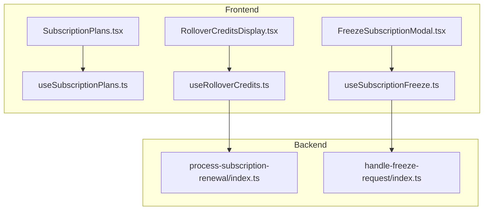
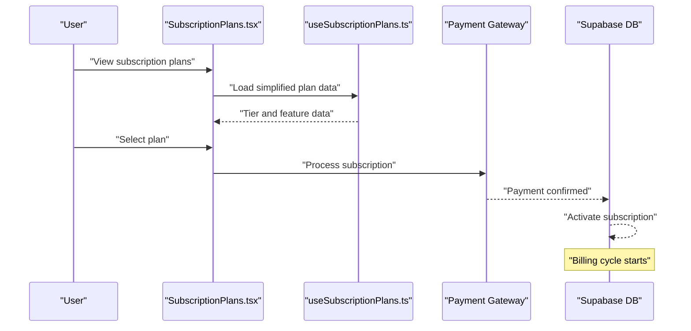
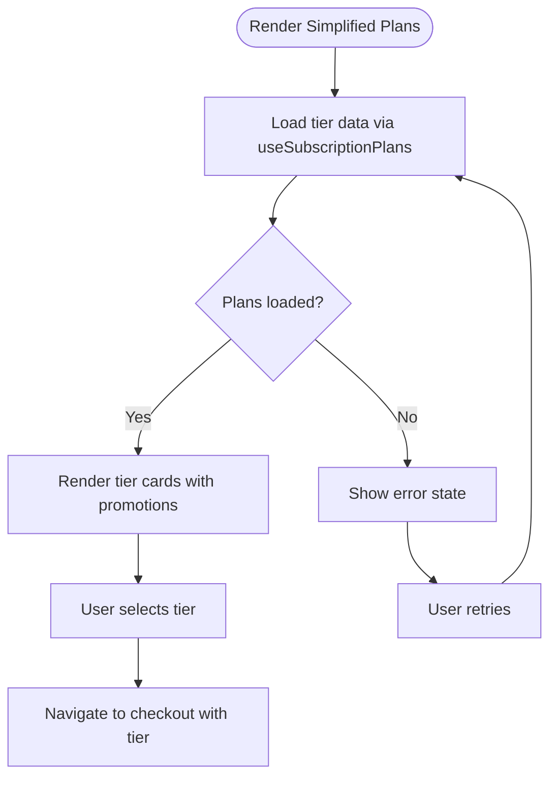
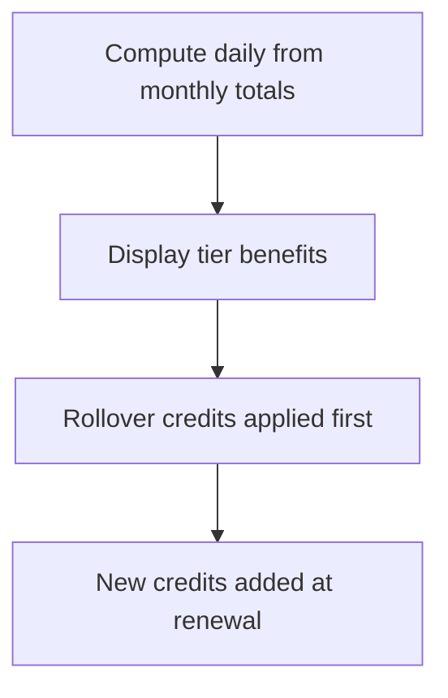
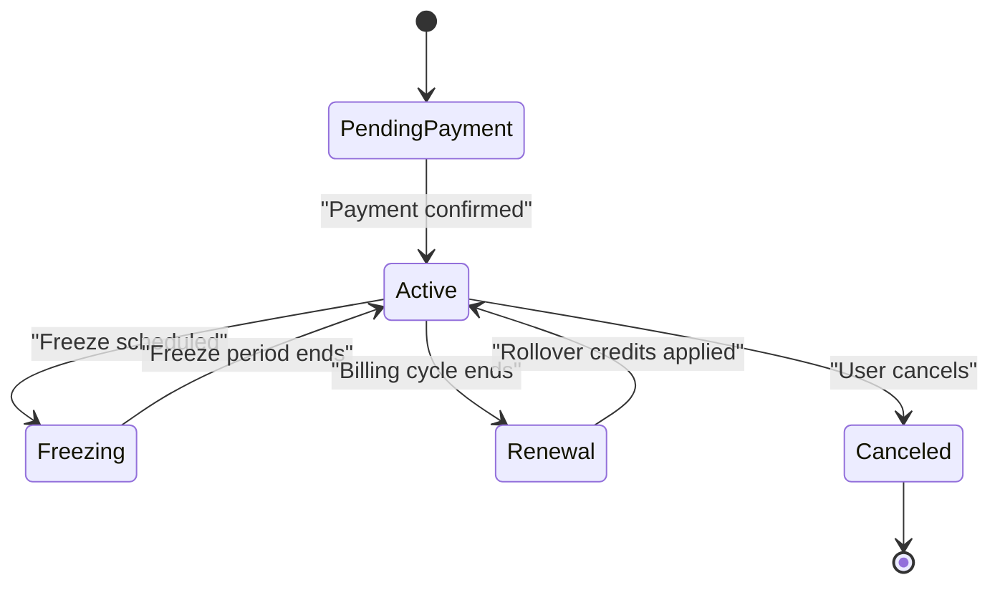
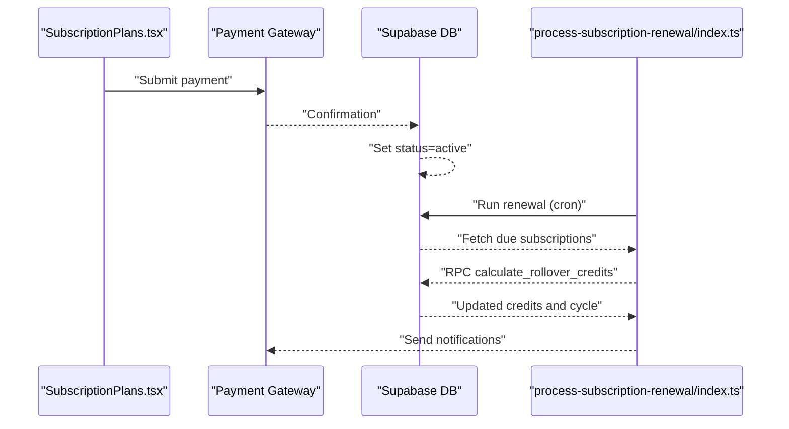
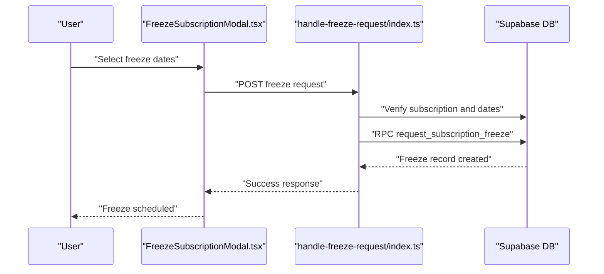
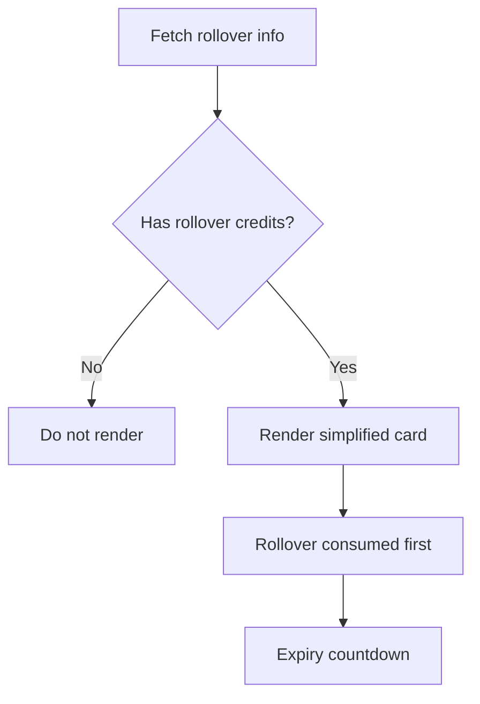
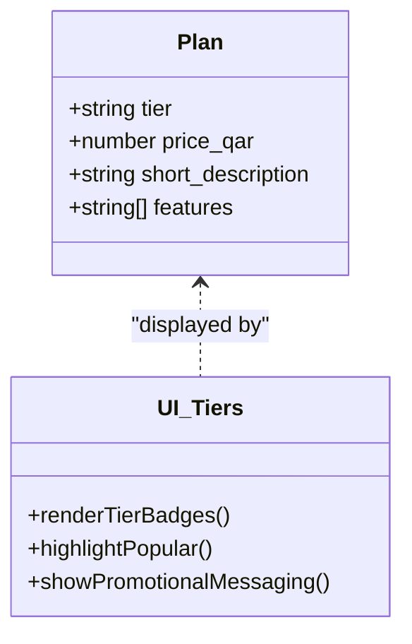
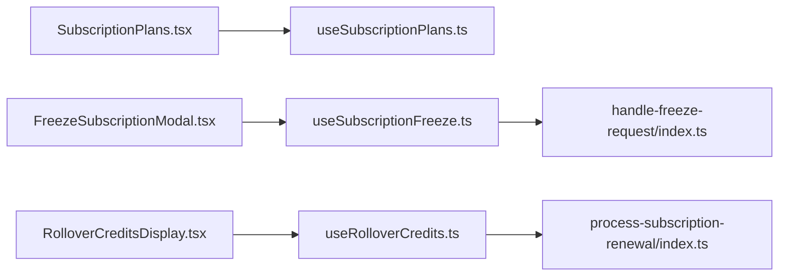

# Subscription Management

<cite>
**Referenced Files in This Document**
- [SubscriptionPlans.tsx](file://src/pages/subscription/SubscriptionPlans.tsx)
- [FreezeSubscriptionModal.tsx](file://src/components/subscription/FreezeSubscriptionModal.tsx)
- [RolloverCreditsDisplay.tsx](file://src/components/subscription/RolloverCreditsDisplay.tsx)
- [useSubscriptionPlans.ts](file://src/hooks/useSubscriptionPlans.ts)
- [useSubscriptionFreeze.ts](file://src/hooks/useSubscriptionFreeze.ts)
- [useRolloverCredits.ts](file://src/hooks/useRolloverCredits.ts)
</cite>

## Update Summary
**Changes Made**
- Updated subscription plans interface to focus on simplified promotional messaging instead of detailed pricing displays
- Removed detailed meal showcase components and pricing breakdowns
- Streamlined plan presentation to emphasize benefits and simplicity
- Maintained core subscription management functionality while simplifying the user interface

## Table of Contents
1. [Introduction](#introduction)
2. [Project Structure](#project-structure)
3. [Core Components](#core-components)
4. [Architecture Overview](#architecture-overview)
5. [Detailed Component Analysis](#detailed-component-analysis)
6. [Dependency Analysis](#dependency-analysis)
7. [Performance Considerations](#performance-considerations)
8. [Troubleshooting Guide](#troubleshooting-guide)
9. [Conclusion](#conclusion)

## Introduction
This document describes the subscription management system, focusing on subscription plans, tiered benefits, and upgrade/downgrade options. The system emphasizes simplified promotional messaging over detailed pricing displays. It explains the meal quota system, freeze/unfreeze functionality, and usage tracking. The subscription lifecycle covers activation, modification, freezing, and cancellation processes. Payment processing integration, billing cycles, and renewal automation are documented, along with VIP subscription benefits and tier-based restrictions.

## Project Structure
The subscription management system consists of frontend React components and hooks for subscription plan management, freeze scheduling, and rollover credit handling. The simplified interface focuses on clear tier differentiation and promotional messaging rather than complex pricing details.

**Diagram sources**
- [SubscriptionPlans.tsx:1-306](file://src/pages/subscription/SubscriptionPlans.tsx#L1-L306)
- [FreezeSubscriptionModal.tsx:1-258](file://src/components/subscription/FreezeSubscriptionModal.tsx#L1-L258)
- [RolloverCreditsDisplay.tsx:1-199](file://src/components/subscription/RolloverCreditsDisplay.tsx#L1-L199)
- [useSubscriptionPlans.ts](file://src/hooks/useSubscriptionPlans.ts)
- [useSubscriptionFreeze.ts](file://src/hooks/useSubscriptionFreeze.ts)
- [useRolloverCredits.ts](file://src/hooks/useRolloverCredits.ts)

**Section sources**
- [SubscriptionPlans.tsx:1-306](file://src/pages/subscription/SubscriptionPlans.tsx#L1-L306)
- [FreezeSubscriptionModal.tsx:1-258](file://src/components/subscription/FreezeSubscriptionModal.tsx#L1-L258)
- [RolloverCreditsDisplay.tsx:1-199](file://src/components/subscription/RolloverCreditsDisplay.tsx#L1-L199)

## Core Components
- **Simplified subscription plans interface**: Renders tiered plans with promotional messaging, tier badges, and essential features. Removes detailed pricing breakdowns and meal showcases.
- **Freeze subscription modal**: Allows users to select freeze date ranges and submit freeze requests with clear validation.
- **Rollover credits display**: Visualizes rollover credits with simplified presentation, focusing on usage priority and expiration warnings.
- **Backend freeze handler**: Validates freeze requests and manages freeze lifecycle through database operations.

Key responsibilities:
- Tier presentation and selection with simplified messaging
- Freeze scheduling and validation
- Rollover credit visualization and consumption priority
- Freeze request authorization and persistence

**Section sources**
- [SubscriptionPlans.tsx:12-306](file://src/pages/subscription/SubscriptionPlans.tsx#L12-L306)
- [FreezeSubscriptionModal.tsx:18-258](file://src/components/subscription/FreezeSubscriptionModal.tsx#L18-L258)
- [RolloverCreditsDisplay.tsx:15-199](file://src/components/subscription/RolloverCreditsDisplay.tsx#L15-L199)

## Architecture Overview
The system integrates frontend UI with backend services for subscription management. Users interact with simplified plan presentations and freeze scheduling interfaces. The architecture maintains core subscription functionality while emphasizing clear user experience over detailed technical specifications.

**Diagram sources**
- [SubscriptionPlans.tsx:40-57](file://src/pages/subscription/SubscriptionPlans.tsx#L40-L57)
- [useSubscriptionPlans.ts](file://src/hooks/useSubscriptionPlans.ts)

**Section sources**
- [SubscriptionPlans.tsx:40-57](file://src/pages/subscription/SubscriptionPlans.tsx#L40-L57)

## Detailed Component Analysis

### Simplified Subscription Plans Interface
The plans page renders tiered plans with promotional messaging and essential features. The interface focuses on:
- Tier badges and popularity indicators
- Promotional descriptions and benefits
- Essential feature lists
- Simple pricing display (monthly amount)
- Navigation to checkout with plan context

**Diagram sources**
- [SubscriptionPlans.tsx:12-90](file://src/pages/subscription/SubscriptionPlans.tsx#L12-L90)
- [useSubscriptionPlans.ts](file://src/hooks/useSubscriptionPlans.ts)

**Section sources**
- [SubscriptionPlans.tsx:18-70](file://src/pages/subscription/SubscriptionPlans.tsx#L18-L70)
- [SubscriptionPlans.tsx:115-251](file://src/pages/subscription/SubscriptionPlans.tsx#L115-L251)

### Meal Quota System and Tier Benefits
- Daily allocation is calculated from monthly totals for display purposes
- Snack quotas are optional and rendered conditionally
- Unlimited plans are supported but not explicitly highlighted in the simplified interface
- Rollover credits are prioritized for consumption before new credits arrive
- The interface emphasizes tier benefits over detailed quota breakdowns

**Diagram sources**
- [SubscriptionPlans.tsx:66-70](file://src/pages/subscription/SubscriptionPlans.tsx#L66-L70)
- [RolloverCreditsDisplay.tsx:62-87](file://src/components/subscription/RolloverCreditsDisplay.tsx#L62-L87)

**Section sources**
- [SubscriptionPlans.tsx:66-70](file://src/pages/subscription/SubscriptionPlans.tsx#L66-L70)
- [RolloverCreditsDisplay.tsx:62-87](file://src/components/subscription/RolloverCreditsDisplay.tsx#L62-L87)

### Subscription Lifecycle Management
- **Activation**: Occurs after successful payment; billing cycle begins
- **Modification**: Supported through upgrade/downgrade flows with simplified messaging
- **Freezing**: Users can schedule freeze periods with clear validation
- **Cancellation**: Managed through payment gateway callbacks and user actions

### Payment Processing Integration and Billing Cycles
- The plans page navigates to checkout upon plan selection
- Payment confirmation triggers subscription activation and billing cycle start
- Renewal automation runs via backend functions that calculate rollover credits
- Simplified interface focuses on tier benefits rather than detailed billing specifics

**Diagram sources**
- [SubscriptionPlans.tsx:40-57](file://src/pages/subscription/SubscriptionPlans.tsx#L40-L57)

**Section sources**
- [SubscriptionPlans.tsx:40-57](file://src/pages/subscription/SubscriptionPlans.tsx#L40-L57)

### Freeze/Unfreeze Functionality and Credit Management
- **Freeze scheduling**: Users pick a date range constrained by remaining freeze days
- **Validation**: Backend checks ownership, active status, date validity, and overlap
- **Rollover calculation**: Up to 20% of monthly credits can rollover, capped by freeze days
- **Interface focus**: Simplified freeze modal with clear validation and feedback

**Diagram sources**
- [FreezeSubscriptionModal.tsx:72-105](file://src/components/subscription/FreezeSubscriptionModal.tsx#L72-L105)

**Section sources**
- [FreezeSubscriptionModal.tsx:36-72](file://src/components/subscription/FreezeSubscriptionModal.tsx#L36-L72)
- [FreezeSubscriptionModal.tsx:107-141](file://src/components/subscription/FreezeSubscriptionModal.tsx#L107-L141)

### Rollover Credits Display and Usage Priority
- **Simplified presentation**: Displays rollover credits with basic breakdown
- **Usage emphasis**: Highlights that rollover credits are consumed before new credits
- **Expiration warnings**: Shows countdown with color-coded urgency indicators
- **Interface design**: Clean card layout with essential information only

**Diagram sources**
- [RolloverCreditsDisplay.tsx:24-46](file://src/components/subscription/RolloverCreditsDisplay.tsx#L24-L46)
- [RolloverCreditsDisplay.tsx:89-119](file://src/components/subscription/RolloverCreditsDisplay.tsx#L89-L119)

**Section sources**
- [RolloverCreditsDisplay.tsx:20-46](file://src/components/subscription/RolloverCreditsDisplay.tsx#L20-L46)
- [RolloverCreditsDisplay.tsx:89-119](file://src/components/subscription/RolloverCreditsDisplay.tsx#L89-L119)

### VIP Subscription Benefits and Tier-Based Features
- **Tier structure**: Elite, Healthy Balance, Fresh Start, and Weekly Boost
- **Promotional emphasis**: Elite highlighted as most popular with clear badges
- **Feature presentation**: Essential features displayed from plan metadata
- **Simplified messaging**: Focus on benefits rather than detailed feature comparisons

**Diagram sources**
- [SubscriptionPlans.tsx:19-38](file://src/pages/subscription/SubscriptionPlans.tsx#L19-L38)
- [SubscriptionPlans.tsx:118-141](file://src/pages/subscription/SubscriptionPlans.tsx#L118-L141)

**Section sources**
- [SubscriptionPlans.tsx:19-38](file://src/pages/subscription/SubscriptionPlans.tsx#L19-L38)
- [SubscriptionPlans.tsx:118-141](file://src/pages/subscription/SubscriptionPlans.tsx#L118-L141)

### Examples of Subscription State Management and UI Patterns
- **State management patterns**:
  - Selection state for tier cards
  - Loading and error states during plan fetch
  - Freeze modal open/close state and range selection
  - Simplified rollover credit loading and countdown state
- **UI patterns**:
  - Gradient headers with promotional messaging
  - Clear tier badges and popularity indicators
  - Minimal feature checklists focused on benefits
  - Native-style modals with action bars
  - Simplified trust badges and guarantees

**Section sources**
- [SubscriptionPlans.tsx:12-16](file://src/pages/subscription/SubscriptionPlans.tsx#L12-L16)
- [SubscriptionPlans.tsx:115-135](file://src/pages/subscription/SubscriptionPlans.tsx#L115-L135)
- [FreezeSubscriptionModal.tsx:27-42](file://src/components/subscription/FreezeSubscriptionModal.tsx#L27-L42)
- [RolloverCreditsDisplay.tsx:24-34](file://src/components/subscription/RolloverCreditsDisplay.tsx#L24-L34)

## Dependency Analysis
- Frontend components depend on hooks for data fetching and mutation
- Hooks encapsulate Supabase queries and mutations with simplified interfaces
- Backend functions handle freeze requests and rollover calculations
- The system maintains separation between presentation layer and business logic

**Diagram sources**
- [SubscriptionPlans.tsx](file://src/pages/subscription/SubscriptionPlans.tsx#L10)
- [FreezeSubscriptionModal.tsx](file://src/components/subscription/FreezeSubscriptionModal.tsx#L15)
- [RolloverCreditsDisplay.tsx](file://src/components/subscription/RolloverCreditsDisplay.tsx#L11)
- [useSubscriptionPlans.ts](file://src/hooks/useSubscriptionPlans.ts)
- [useSubscriptionFreeze.ts](file://src/hooks/useSubscriptionFreeze.ts)
- [useRolloverCredits.ts](file://src/hooks/useRolloverCredits.ts)

**Section sources**
- [process-subscription-renewal/index.ts:195-201](file://supabase/functions/process-subscription-renewal/index.ts#L195-L201)
- [handle-freeze-request/index.ts:106-114](file://supabase/functions/handle-freeze-request/index.ts#L106-L114)

## Performance Considerations
- Minimize re-renders by memoizing tier computations and promotional messaging
- Debounce calendar interactions in the freeze modal to reduce unnecessary state updates
- Cache plan data locally to avoid repeated network requests
- Batch freeze requests and limit concurrent operations to improve user experience

## Troubleshooting Guide
Common issues and resolutions:
- **Plans fail to load**: Verify network connectivity and hook data fetching logic; show retry button
- **Freeze request denied**: Check subscription ownership, active status, and date validity; surface error messages
- **Renewal not triggered**: Confirm cron job configuration and function invocation; inspect logs for errors
- **Rollover credits not displayed**: Ensure rollover info is fetched and total credits > 0

**Section sources**
- [SubscriptionPlans.tsx:72-89](file://src/pages/subscription/SubscriptionPlans.tsx#L72-L89)
- [handle-freeze-request/index.ts:84-103](file://supabase/functions/handle-freeze-request/index.ts#L84-L103)

## Conclusion
The subscription management system provides a simplified yet comprehensive approach to subscription management. By focusing on promotional messaging and essential features rather than detailed pricing displays, the system delivers a cleaner user experience while maintaining all core functionality. The design emphasizes clear tier differentiation, transparent credit usage, and straightforward freeze scheduling. Extending the system to support advanced features would involve enhancing the simplified interface while preserving the existing hooks and backend architecture.