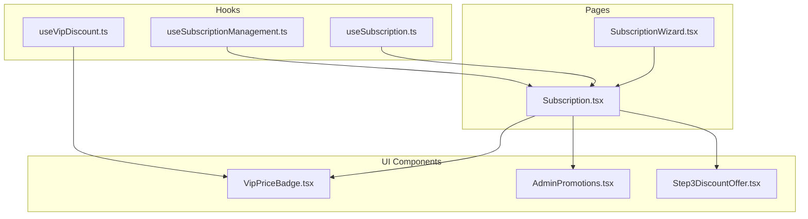
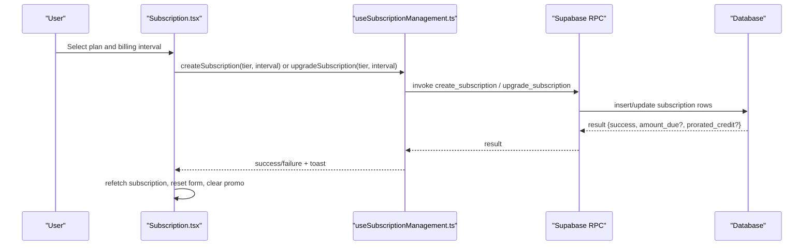
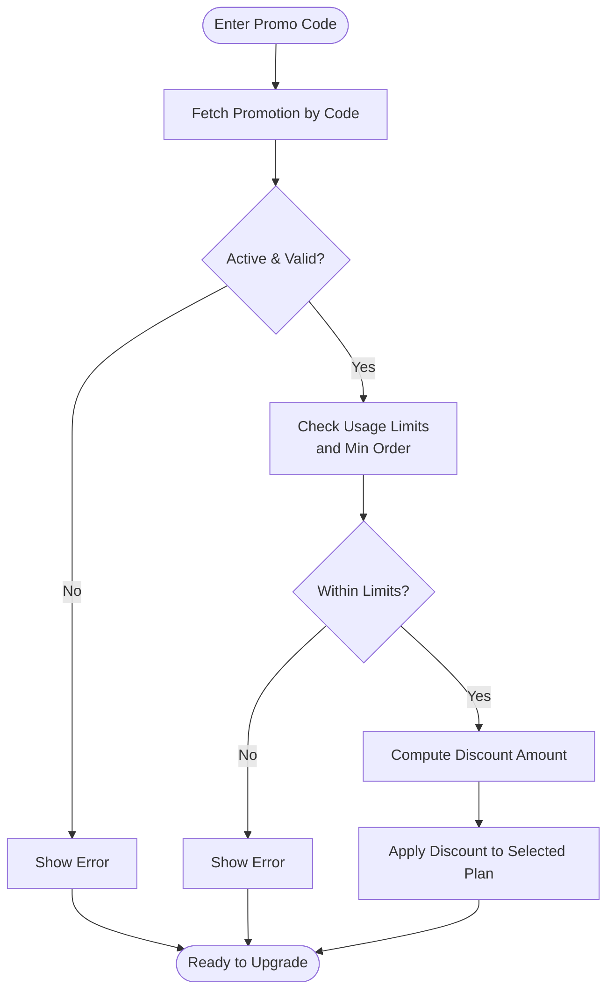
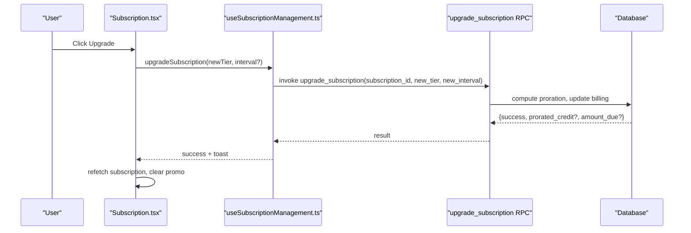
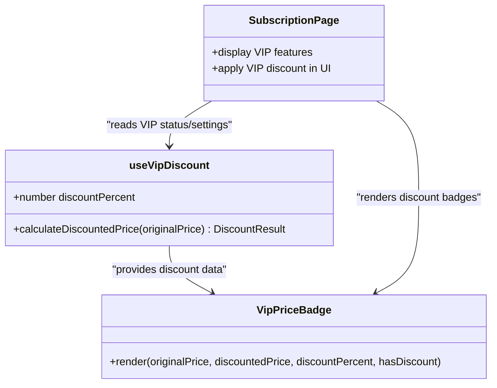
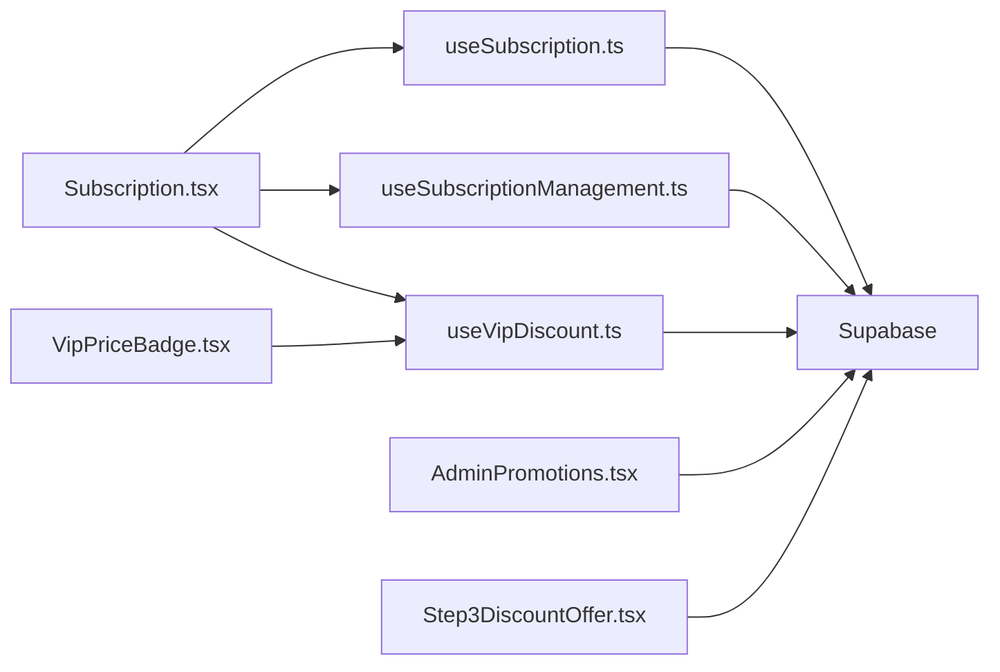

# Subscription Plans & Pricing

<cite>
**Referenced Files in This Document**
- [useSubscription.ts](file://src/hooks/useSubscription.ts)
- [useSubscriptionManagement.ts](file://src/hooks/useSubscriptionManagement.ts)
- [Subscription.tsx](file://src/pages/Subscription.tsx)
- [SubscriptionWizard.tsx](file://src/components/SubscriptionWizard.tsx)
- [useVipDiscount.ts](file://src/hooks/useVipDiscount.ts)
- [VipPriceBadge.tsx](file://src/components/VipPriceBadge.tsx)
- [AdminPromotions.tsx](file://src/pages/admin/AdminPromotions.tsx)
- [Step3DiscountOffer.tsx](file://src/components/CancellationFlow/Step3DiscountOffer.tsx)
</cite>

## Table of Contents
1. [Introduction](#introduction)
2. [Project Structure](#project-structure)
3. [Core Components](#core-components)
4. [Architecture Overview](#architecture-overview)
5. [Detailed Component Analysis](#detailed-component-analysis)
6. [Dependency Analysis](#dependency-analysis)
7. [Performance Considerations](#performance-considerations)
8. [Troubleshooting Guide](#troubleshooting-guide)
9. [Conclusion](#conclusion)

## Introduction
This document explains the subscription plans and pricing system, covering:
- Subscription tiers and features
- Billing cycles (monthly vs annual) and pricing mechanics
- Plan comparison and selection
- Promotional pricing with discount codes and usage limits
- Plan switching, upgrades, and downgrades
- VIP tier benefits and premium features access

## Project Structure
The subscription system spans React hooks, UI pages, and admin tools:
- Hooks manage subscription state, plans, and lifecycle actions
- Pages render plan selection, upgrade flows, and cancellation
- Admin tools manage promotions and discounts
- VIP-specific UI and discount logic are integrated across components

**Diagram sources**
- [useSubscription.ts:42-263](file://src/hooks/useSubscription.ts#L42-L263)
- [useSubscriptionManagement.ts:48-395](file://src/hooks/useSubscriptionManagement.ts#L48-L395)
- [Subscription.tsx:126-1248](file://src/pages/Subscription.tsx#L126-L1248)
- [SubscriptionWizard.tsx:59-184](file://src/components/SubscriptionWizard.tsx#L59-L184)
- [useVipDiscount.ts:19-86](file://src/hooks/useVipDiscount.ts#L19-L86)
- [VipPriceBadge.tsx:14-69](file://src/components/VipPriceBadge.tsx#L14-L69)
- [AdminPromotions.tsx:292-657](file://src/pages/admin/AdminPromotions.tsx#L292-L657)
- [Step3DiscountOffer.tsx:24-110](file://src/components/CancellationFlow/Step3DiscountOffer.tsx#L24-L110)

**Section sources**
- [useSubscription.ts:42-263](file://src/hooks/useSubscription.ts#L42-L263)
- [useSubscriptionManagement.ts:48-395](file://src/hooks/useSubscriptionManagement.ts#L48-L395)
- [Subscription.tsx:126-1248](file://src/pages/Subscription.tsx#L126-L1248)
- [SubscriptionWizard.tsx:59-184](file://src/components/SubscriptionWizard.tsx#L59-L184)
- [useVipDiscount.ts:19-86](file://src/hooks/useVipDiscount.ts#L19-L86)
- [VipPriceBadge.tsx:14-69](file://src/components/VipPriceBadge.tsx#L14-L69)
- [AdminPromotions.tsx:292-657](file://src/pages/admin/AdminPromotions.tsx#L292-L657)
- [Step3DiscountOffer.tsx:24-110](file://src/components/CancellationFlow/Step3DiscountOffer.tsx#L24-L110)

## Core Components
- useSubscription: Fetches active/pending/cancelled-not-expired subscriptions; exposes quota, weekly totals, VIP flag, and actions to increment usage, pause/resume.
- useSubscriptionManagement: Loads active plans, current plan, billing interval, and orchestrates creation/upgrades/cancellations via RPCs.
- Subscription page: Renders plan cards, billing toggle, promo code application, upgrade flow, and cancellation management.
- SubscriptionWizard: Guides users to a recommended plan based on answers.
- useVipDiscount: Provides VIP discount configuration and calculates discounted prices.
- VipPriceBadge: Visual badge for VIP pricing and discount indicators.
- AdminPromotions: Manages promotions (codes, validity, usage caps).
- Step3DiscountOffer: Win-back discount offers during cancellation.

**Section sources**
- [useSubscription.ts:5-263](file://src/hooks/useSubscription.ts#L5-L263)
- [useSubscriptionManagement.ts:7-395](file://src/hooks/useSubscriptionManagement.ts#L7-L395)
- [Subscription.tsx:52-1248](file://src/pages/Subscription.tsx#L52-L1248)
- [SubscriptionWizard.tsx:17-184](file://src/components/SubscriptionWizard.tsx#L17-L184)
- [useVipDiscount.ts:5-86](file://src/hooks/useVipDiscount.ts#L5-L86)
- [VipPriceBadge.tsx:5-69](file://src/components/VipPriceBadge.tsx#L5-L69)
- [AdminPromotions.tsx:292-657](file://src/pages/admin/AdminPromotions.tsx#L292-L657)
- [Step3DiscountOffer.tsx:24-110](file://src/components/CancellationFlow/Step3DiscountOffer.tsx#L24-L110)

## Architecture Overview
The system integrates Supabase for data and RPCs, with React hooks encapsulating business logic and UI pages orchestrating user flows.

**Diagram sources**
- [useSubscriptionManagement.ts:118-220](file://src/hooks/useSubscriptionManagement.ts#L118-L220)
- [Subscription.tsx:310-418](file://src/pages/Subscription.tsx#L310-L418)

## Detailed Component Analysis

### Subscription Tiers and Features
- Tiers supported include: elite, healthy, fresh, weekly, basic, standard, premium, vip.
- Each tier maps to a UI presentation with icons, colors, popularity, and VIP flag.
- Database-backed plans define meals/snacks quotas, daily allocations, and features.

Key behaviors:
- VIP tier grants unlimited meals and special UI treatment.
- Annual billing applies a 17% savings banner and adjusted pricing.

**Section sources**
- [Subscription.tsx:71-91](file://src/pages/Subscription.tsx#L71-L91)
- [Subscription.tsx:93-124](file://src/pages/Subscription.tsx#L93-L124)
- [Subscription.tsx:236-248](file://src/pages/Subscription.tsx#L236-L248)

### Billing Cycle Options and Pricing Mechanics
- Billing intervals: monthly or annual.
- Annual pricing logic: monthly price × 10 for display; backend RPCs handle proration and billing adjustments.
- 17% savings banner appears for annual billing; VIP annual savings computed as monthly × 2.

**Section sources**
- [Subscription.tsx:96-99](file://src/pages/Subscription.tsx#L96-L99)
- [Subscription.tsx:242-248](file://src/pages/Subscription.tsx#L242-L248)
- [useSubscriptionManagement.ts:57-80](file://src/hooks/useSubscriptionManagement.ts#L57-L80)

### Plan Comparison and Selection
- Plan cards display tier name, description, price, period, meals/month, and features.
- Annual plans append a “save 17%” indicator.
- Wizard asks three questions to recommend a plan (basic, standard, premium, vip) and navigates to the subscription page.

**Section sources**
- [Subscription.tsx:520-604](file://src/pages/Subscription.tsx#L520-L604)
- [SubscriptionWizard.tsx:17-48](file://src/components/SubscriptionWizard.tsx#L17-L48)
- [SubscriptionWizard.tsx:50-57](file://src/components/SubscriptionWizard.tsx#L50-L57)

### Promotional Pricing System
- Users enter a promo code and validate it against the promotions table.
- Validation checks:
  - Active status
  - Validity dates
  - Global and per-user usage limits
  - Minimum order amount
- Discount computation supports percentage or fixed amount with optional cap.
- On successful upgrade, usage records are updated (best-effort).

**Diagram sources**
- [Subscription.tsx:250-308](file://src/pages/Subscription.tsx#L250-L308)

**Section sources**
- [Subscription.tsx:250-308](file://src/pages/Subscription.tsx#L250-L308)
- [AdminPromotions.tsx:292-657](file://src/pages/admin/AdminPromotions.tsx#L292-L657)

### Plan Switching, Upgrades, and Downgrades
- Upgrade flow:
  - Validates payment method (wallet or card)
  - Deducts from wallet if selected
  - Calls upgrade_subscription RPC for proration and billing interval changes
  - Updates usage counts and records promo usage
- Downgrades handled via cancellation flow with win-back offers (discount pause downgrade bonus).

**Diagram sources**
- [useSubscriptionManagement.ts:163-220](file://src/hooks/useSubscriptionManagement.ts#L163-L220)
- [Subscription.tsx:310-418](file://src/pages/Subscription.tsx#L310-L418)

**Section sources**
- [useSubscriptionManagement.ts:163-220](file://src/hooks/useSubscriptionManagement.ts#L163-L220)
- [Subscription.tsx:310-418](file://src/pages/Subscription.tsx#L310-L418)

### VIP Subscription Tier and Premium Benefits
- VIP tier:
  - Unlimited meals
  - Special UI badges and gradient styling
  - Platform-configurable discount (default 15%) applied to eligible purchases
- VIP discount calculation:
  - Uses platform settings for discount percent and benefit flags
  - Provides a helper to compute discounted price

**Diagram sources**
- [useVipDiscount.ts:19-86](file://src/hooks/useVipDiscount.ts#L19-L86)
- [VipPriceBadge.tsx:14-69](file://src/components/VipPriceBadge.tsx#L14-L69)
- [Subscription.tsx:629-673](file://src/pages/Subscription.tsx#L629-L673)

**Section sources**
- [useVipDiscount.ts:5-86](file://src/hooks/useVipDiscount.ts#L5-L86)
- [VipPriceBadge.tsx:14-69](file://src/components/VipPriceBadge.tsx#L14-L69)
- [Subscription.tsx:629-673](file://src/pages/Subscription.tsx#L629-L673)

### Cancellation and Win-Back Offers
- During cancellation, the system can present discount offers to retain users.
- Offers include percentages and durations; acceptance updates the subscription accordingly.

**Section sources**
- [Step3DiscountOffer.tsx:24-110](file://src/components/CancellationFlow/Step3DiscountOffer.tsx#L24-L110)
- [useSubscriptionManagement.ts:222-248](file://src/hooks/useSubscriptionManagement.ts#L222-L248)

## Dependency Analysis
- useSubscription depends on Supabase for real-time subscription data and RPCs for usage increments and rollover credits.
- useSubscriptionManagement depends on Supabase for plan retrieval and RPCs for subscription lifecycle actions.
- Subscription page composes these hooks and renders plan comparisons, promo logic, and upgrade flows.
- VIP discount logic is centralized and consumed by UI components.

**Diagram sources**
- [useSubscription.ts:42-263](file://src/hooks/useSubscription.ts#L42-L263)
- [useSubscriptionManagement.ts:48-395](file://src/hooks/useSubscriptionManagement.ts#L48-L395)
- [Subscription.tsx:126-1248](file://src/pages/Subscription.tsx#L126-L1248)
- [useVipDiscount.ts:19-86](file://src/hooks/useVipDiscount.ts#L19-L86)
- [VipPriceBadge.tsx:14-69](file://src/components/VipPriceBadge.tsx#L14-L69)
- [AdminPromotions.tsx:292-657](file://src/pages/admin/AdminPromotions.tsx#L292-L657)
- [Step3DiscountOffer.tsx:24-110](file://src/components/CancellationFlow/Step3DiscountOffer.tsx#L24-L110)

**Section sources**
- [useSubscription.ts:42-263](file://src/hooks/useSubscription.ts#L42-L263)
- [useSubscriptionManagement.ts:48-395](file://src/hooks/useSubscriptionManagement.ts#L48-L395)
- [Subscription.tsx:126-1248](file://src/pages/Subscription.tsx#L126-L1248)
- [useVipDiscount.ts:19-86](file://src/hooks/useVipDiscount.ts#L19-L86)
- [VipPriceBadge.tsx:14-69](file://src/components/VipPriceBadge.tsx#L14-L69)
- [AdminPromotions.tsx:292-657](file://src/pages/admin/AdminPromotions.tsx#L292-L657)
- [Step3DiscountOffer.tsx:24-110](file://src/components/CancellationFlow/Step3DiscountOffer.tsx#L24-L110)

## Performance Considerations
- Real-time subscription updates via Supabase channels reduce stale data and improve UX responsiveness.
- Annual pricing is computed client-side for immediate feedback; backend RPCs finalize billing.
- Promo validation short-circuits on invalid or expired codes to avoid unnecessary backend calls.

## Troubleshooting Guide
Common issues and resolutions:
- Insufficient wallet balance when selecting wallet payment during upgrade:
  - Ensure sufficient funds before attempting upgrade.
- Promo code errors:
  - Verify code activity, validity dates, usage caps, and minimum order amount.
- Upgrade failures:
  - Confirm active subscription exists and RPC response indicates success; check toast messages for details.
- VIP discount not visible:
  - Ensure VIP status and platform settings allow meal discounts.

**Section sources**
- [Subscription.tsx:324-344](file://src/pages/Subscription.tsx#L324-L344)
- [Subscription.tsx:250-308](file://src/pages/Subscription.tsx#L250-L308)
- [useSubscriptionManagement.ts:163-220](file://src/hooks/useSubscriptionManagement.ts#L163-L220)
- [useVipDiscount.ts:19-86](file://src/hooks/useVipDiscount.ts#L19-L86)

## Conclusion
The subscription system provides flexible tiered plans with clear billing options, robust promotional controls, and a seamless upgrade/downgrade experience. VIP users receive exclusive benefits and discounts, while the UI and hooks ensure accurate quota tracking, real-time updates, and intuitive plan management.