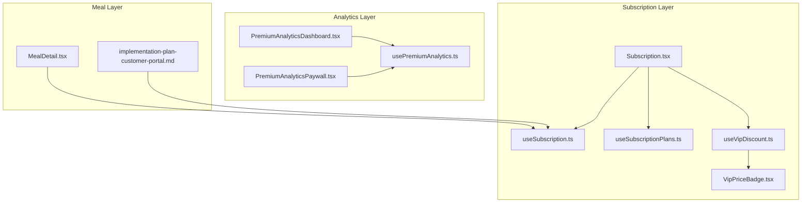
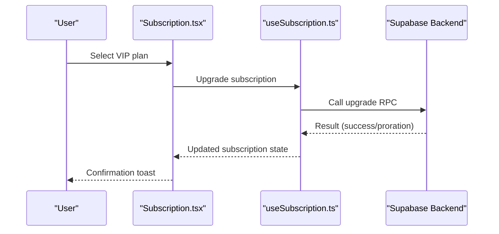
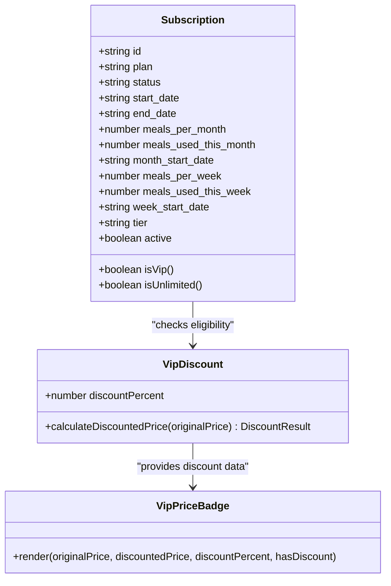
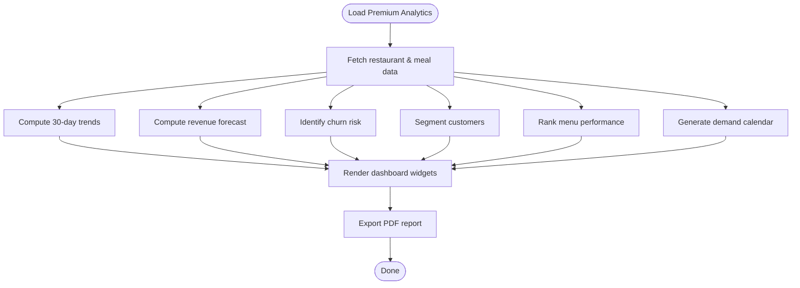
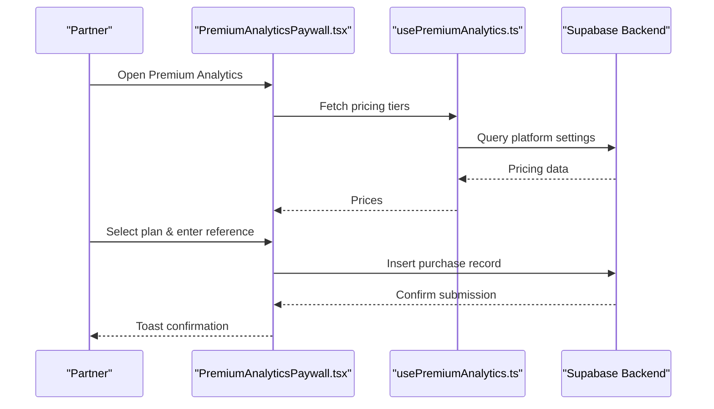
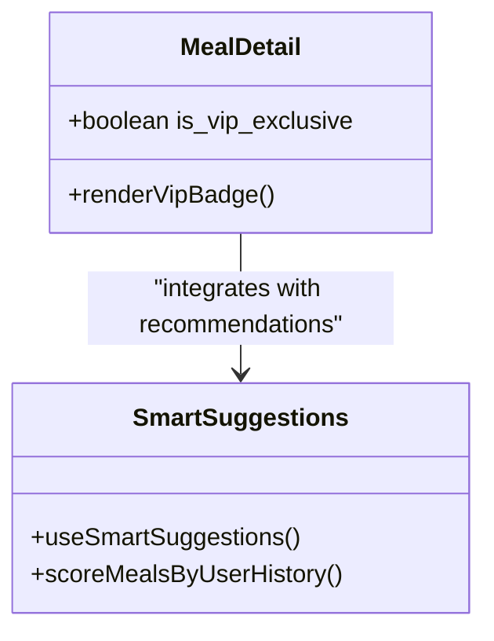
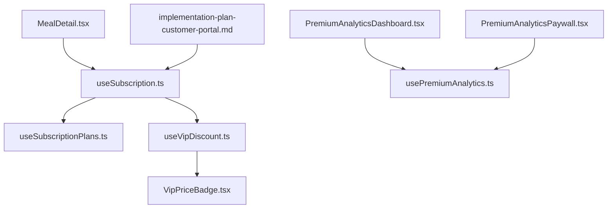

# VIP & Premium Features

<cite>
**Referenced Files in This Document**
- [Subscription.tsx](file://src/pages/Subscription.tsx)
- [useSubscription.ts](file://src/hooks/useSubscription.ts)
- [useVipDiscount.ts](file://src/hooks/useVipDiscount.ts)
- [VipPriceBadge.tsx](file://src/components/VipPriceBadge.tsx)
- [PremiumAnalyticsDashboard.tsx](file://src/components/PremiumAnalyticsDashboard.tsx)
- [PremiumAnalyticsPaywall.tsx](file://src/components/PremiumAnalyticsPaywall.tsx)
- [usePremiumAnalytics.ts](file://src/hooks/usePremiumAnalytics.ts)
- [useSubscriptionPlans.ts](file://src/hooks/useSubscriptionPlans.ts)
- [MealDetail.tsx](file://src/pages/MealDetail.tsx)
- [implementation-plan-customer-portal.md](file://docs/implementation-plan-customer-portal.md)
- [create_report.py](file://create_report.py)
- [NUTRIOFUEL_ULTIMATE_WIKI.html](file://NUTRIOFUEL_ULTIMATE_WIKI.html)
</cite>

## Table of Contents
1. [Introduction](#introduction)
2. [Project Structure](#project-structure)
3. [Core Components](#core-components)
4. [Architecture Overview](#architecture-overview)
5. [Detailed Component Analysis](#detailed-component-analysis)
6. [Dependency Analysis](#dependency-analysis)
7. [Performance Considerations](#performance-considerations)
8. [Troubleshooting Guide](#troubleshooting-guide)
9. [Conclusion](#conclusion)

## Introduction
This document provides comprehensive coverage of VIP and premium subscription features within the Nutrio ecosystem. It explains VIP tier benefits, premium analytics capabilities, pricing structure, discount systems, and VIP-only features such as exclusive meals and priority delivery. It also documents the premium analytics dashboard with detailed performance metrics, trend analysis, and professional reports, along with practical usage examples and how VIP features enhance the overall user experience compared to standard subscriptions.

## Project Structure
VIP and premium features are implemented across several frontend components and hooks, integrated with Supabase backend services for subscription management, analytics, and pricing configuration. Key areas include:
- Subscription management UI and logic
- VIP discount calculation and display
- Premium analytics dashboard and paywall
- Meal exclusivity indicators
- Smart recommendation hooks for personalized experiences

**Diagram sources**
- [Subscription.tsx:126-264](file://src/pages/Subscription.tsx#L126-L264)
- [useSubscription.ts:42-264](file://src/hooks/useSubscription.ts#L42-L264)
- [useSubscriptionPlans.ts:28-84](file://src/hooks/useSubscriptionPlans.ts#L28-L84)
- [useVipDiscount.ts:19-85](file://src/hooks/useVipDiscount.ts#L19-L85)
- [VipPriceBadge.tsx:14-68](file://src/components/VipPriceBadge.tsx#L14-L68)
- [PremiumAnalyticsDashboard.tsx:147-939](file://src/components/PremiumAnalyticsDashboard.tsx#L147-L939)
- [PremiumAnalyticsPaywall.tsx:147-441](file://src/components/PremiumAnalyticsPaywall.tsx#L147-L441)
- [usePremiumAnalytics.ts:16-118](file://src/hooks/usePremiumAnalytics.ts#L16-L118)
- [MealDetail.tsx:1234-1246](file://src/pages/MealDetail.tsx#L1234-L1246)
- [implementation-plan-customer-portal.md:1767-1875](file://docs/implementation-plan-customer-portal.md#L1767-L1875)

**Section sources**
- [Subscription.tsx:126-264](file://src/pages/Subscription.tsx#L126-L264)
- [useSubscription.ts:42-264](file://src/hooks/useSubscription.ts#L42-L264)
- [useSubscriptionPlans.ts:28-84](file://src/hooks/useSubscriptionPlans.ts#L28-L84)
- [useVipDiscount.ts:19-85](file://src/hooks/useVipDiscount.ts#L19-L85)
- [VipPriceBadge.tsx:14-68](file://src/components/VipPriceBadge.tsx#L14-L68)
- [PremiumAnalyticsDashboard.tsx:147-939](file://src/components/PremiumAnalyticsDashboard.tsx#L147-L939)
- [PremiumAnalyticsPaywall.tsx:147-441](file://src/components/PremiumAnalyticsPaywall.tsx#L147-L441)
- [usePremiumAnalytics.ts:16-118](file://src/hooks/usePremiumAnalytics.ts#L16-L118)
- [MealDetail.tsx:1234-1246](file://src/pages/MealDetail.tsx#L1234-L1246)
- [implementation-plan-customer-portal.md:1767-1875](file://docs/implementation-plan-customer-portal.md#L1767-L1875)

## Core Components
- VIP Subscription Tier: Unlimited meals, priority delivery, VIP exclusive meals, and 15% meal discount for eligible users.
- Premium Analytics: Advanced restaurant insights including revenue forecasting, churn alerts, customer segmentation, menu performance matrix, and demand calendars.
- VIP Discount System: Configurable discount percentage and benefit toggles stored in platform settings.
- VIP Price Badge: Visual indicator for discounted pricing with optional original price strikethrough.
- Smart Recommendations: Personalized meal suggestions leveraging user history and nutrition targets.

**Section sources**
- [Subscription.tsx:520-604](file://src/pages/Subscription.tsx#L520-L604)
- [useSubscription.ts:142-146](file://src/hooks/useSubscription.ts#L142-L146)
- [useVipDiscount.ts:19-85](file://src/hooks/useVipDiscount.ts#L19-L85)
- [VipPriceBadge.tsx:14-68](file://src/components/VipPriceBadge.tsx#L14-L68)
- [PremiumAnalyticsDashboard.tsx:147-939](file://src/components/PremiumAnalyticsDashboard.tsx#L147-L939)
- [implementation-plan-customer-portal.md:1788-1875](file://docs/implementation-plan-customer-portal.md#L1788-L1875)

## Architecture Overview
The VIP and premium feature architecture integrates frontend components with Supabase for real-time subscription status, analytics data retrieval, and platform configuration. The VIP discount system reads from platform settings, while the premium analytics dashboard queries meal scheduling and restaurant data to compute insights.

**Diagram sources**
- [Subscription.tsx:310-418](file://src/pages/Subscription.tsx#L310-L418)
- [useSubscription.ts:163-203](file://src/hooks/useSubscription.ts#L163-L203)

**Section sources**
- [Subscription.tsx:310-418](file://src/pages/Subscription.tsx#L310-L418)
- [useSubscription.ts:163-203](file://src/hooks/useSubscription.ts#L163-L203)

## Detailed Component Analysis

### VIP Subscription Benefits and Pricing
- Unlimited meals for VIP tier
- Priority delivery
- VIP exclusive meals
- 15% discount on eligible meals
- Annual billing savings and promotional offers

**Diagram sources**
- [useSubscription.ts:5-19](file://src/hooks/useSubscription.ts#L5-L19)
- [useSubscription.ts:142-146](file://src/hooks/useSubscription.ts#L142-L146)
- [useVipDiscount.ts:19-85](file://src/hooks/useVipDiscount.ts#L19-L85)
- [VipPriceBadge.tsx:14-68](file://src/components/VipPriceBadge.tsx#L14-L68)

**Section sources**
- [Subscription.tsx:520-604](file://src/pages/Subscription.tsx#L520-L604)
- [useSubscription.ts:142-146](file://src/hooks/useSubscription.ts#L142-L146)
- [useVipDiscount.ts:19-85](file://src/hooks/useVipDiscount.ts#L19-L85)
- [VipPriceBadge.tsx:14-68](file://src/components/VipPriceBadge.tsx#L14-L68)

### Premium Analytics Dashboard
The premium analytics dashboard provides actionable insights for restaurant partners, including:
- Weekly performance digest
- 30-day growth metrics
- Revenue forecast
- Churn alert and customer segmentation
- Menu performance matrix and profitability report
- Meal combo patterns and demand forecast calendar

**Diagram sources**
- [PremiumAnalyticsDashboard.tsx:181-526](file://src/components/PremiumAnalyticsDashboard.tsx#L181-L526)

**Section sources**
- [PremiumAnalyticsDashboard.tsx:147-939](file://src/components/PremiumAnalyticsDashboard.tsx#L147-L939)
- [usePremiumAnalytics.ts:16-81](file://src/hooks/usePremiumAnalytics.ts#L16-L81)

### VIP Discount System and Paywall
- Discount configuration stored in platform settings
- Dynamic discount calculation and display
- Premium analytics paywall with pricing tiers and bank transfer instructions

**Diagram sources**
- [PremiumAnalyticsPaywall.tsx:147-441](file://src/components/PremiumAnalyticsPaywall.tsx#L147-L441)
- [usePremiumAnalytics.ts:83-118](file://src/hooks/usePremiumAnalytics.ts#L83-L118)

**Section sources**
- [PremiumAnalyticsPaywall.tsx:147-441](file://src/components/PremiumAnalyticsPaywall.tsx#L147-L441)
- [usePremiumAnalytics.ts:83-118](file://src/hooks/usePremiumAnalytics.ts#L83-L118)

### VIP-Only Features and Exclusivity
- VIP exclusive meal badges in meal listings
- Priority delivery and exclusive meal access for VIP subscribers
- Enhanced progress tracking and personalized nutrition insights

**Diagram sources**
- [MealDetail.tsx:1234-1246](file://src/pages/MealDetail.tsx#L1234-L1246)
- [implementation-plan-customer-portal.md:1788-1875](file://docs/implementation-plan-customer-portal.md#L1788-L1875)

**Section sources**
- [MealDetail.tsx:1234-1246](file://src/pages/MealDetail.tsx#L1234-L1246)
- [implementation-plan-customer-portal.md:1788-1875](file://docs/implementation-plan-customer-portal.md#L1788-L1875)

### VIP Pricing Structure and Comparisons
- Subscription tiers include Basic, Standard, Premium, and VIP Elite
- VIP Elite offers unlimited meals, priority delivery, and VIP exclusive meals
- Annual billing provides savings and promotional offers

**Section sources**
- [Subscription.tsx:520-604](file://src/pages/Subscription.tsx#L520-L604)
- [create_report.py:343-349](file://create_report.py#L343-L349)
- [NUTRIOFUEL_ULTIMATE_WIKI.html:1088-1115](file://NUTRIOFUEL_ULTIMATE_WIKI.html#L1088-L1115)

## Dependency Analysis
VIP and premium features depend on:
- Subscription state management for tier eligibility and quotas
- Platform settings for discount configuration and analytics pricing
- Real-time meal scheduling and restaurant data for analytics computations
- Supabase RPCs for subscription upgrades and wallet transactions

**Diagram sources**
- [useSubscription.ts:42-264](file://src/hooks/useSubscription.ts#L42-L264)
- [useSubscriptionPlans.ts:28-84](file://src/hooks/useSubscriptionPlans.ts#L28-L84)
- [useVipDiscount.ts:19-85](file://src/hooks/useVipDiscount.ts#L19-L85)
- [VipPriceBadge.tsx:14-68](file://src/components/VipPriceBadge.tsx#L14-L68)
- [PremiumAnalyticsDashboard.tsx:147-939](file://src/components/PremiumAnalyticsDashboard.tsx#L147-L939)
- [usePremiumAnalytics.ts:16-118](file://src/hooks/usePremiumAnalytics.ts#L16-L118)
- [PremiumAnalyticsPaywall.tsx:147-441](file://src/components/PremiumAnalyticsPaywall.tsx#L147-L441)
- [MealDetail.tsx:1234-1246](file://src/pages/MealDetail.tsx#L1234-L1246)
- [implementation-plan-customer-portal.md:1788-1875](file://docs/implementation-plan-customer-portal.md#L1788-L1875)

**Section sources**
- [useSubscription.ts:42-264](file://src/hooks/useSubscription.ts#L42-L264)
- [useSubscriptionPlans.ts:28-84](file://src/hooks/useSubscriptionPlans.ts#L28-L84)
- [useVipDiscount.ts:19-85](file://src/hooks/useVipDiscount.ts#L19-L85)
- [VipPriceBadge.tsx:14-68](file://src/components/VipPriceBadge.tsx#L14-L68)
- [PremiumAnalyticsDashboard.tsx:147-939](file://src/components/PremiumAnalyticsDashboard.tsx#L147-L939)
- [usePremiumAnalytics.ts:16-118](file://src/hooks/usePremiumAnalytics.ts#L16-L118)
- [PremiumAnalyticsPaywall.tsx:147-441](file://src/components/PremiumAnalyticsPaywall.tsx#L147-L441)
- [MealDetail.tsx:1234-1246](file://src/pages/MealDetail.tsx#L1234-L1246)
- [implementation-plan-customer-portal.md:1788-1875](file://docs/implementation-plan-customer-portal.md#L1788-L1875)

## Performance Considerations
- Use efficient Supabase queries with appropriate limits and filters for analytics computations
- Cache subscription and discount configurations to minimize repeated network requests
- Debounce user interactions in analytics dashboards to reduce unnecessary computations
- Optimize chart rendering by limiting data points and using responsive containers

## Troubleshooting Guide
Common issues and resolutions:
- VIP discount not applying: Verify platform settings key and user subscription tier
- Premium analytics not loading: Check restaurant association and active purchase records
- Subscription upgrade failures: Validate payment method and user balance for wallet payments
- VIP exclusive meal visibility: Confirm meal flags and user subscription status

**Section sources**
- [useVipDiscount.ts:24-54](file://src/hooks/useVipDiscount.ts#L24-L54)
- [usePremiumAnalytics.ts:30-78](file://src/hooks/usePremiumAnalytics.ts#L30-L78)
- [Subscription.tsx:310-418](file://src/pages/Subscription.tsx#L310-L418)

## Conclusion
VIP and premium features deliver significant enhancements to the Nutrio experience, including unlimited meals, priority delivery, VIP exclusive meals, and advanced analytics for restaurant partners. The VIP discount system and pricing tiers provide clear value propositions, while the premium analytics dashboard enables data-driven decision-making. Together, these features elevate user engagement and operational efficiency for both customers and restaurant partners.