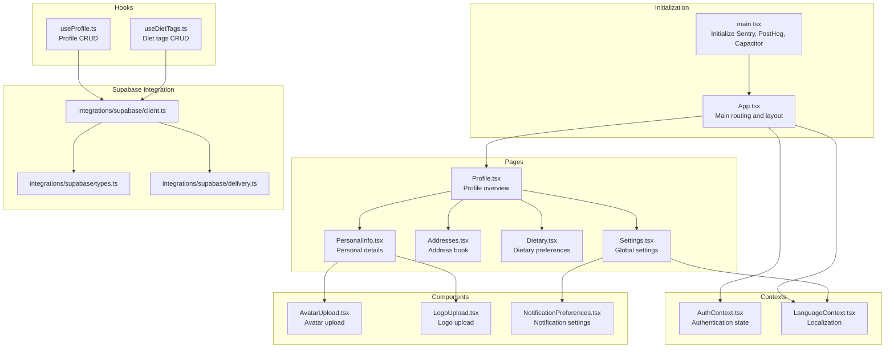
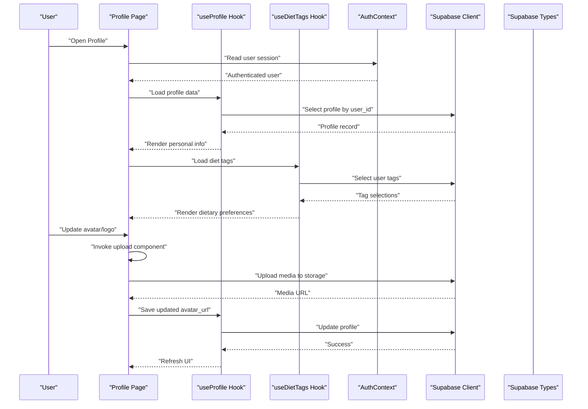
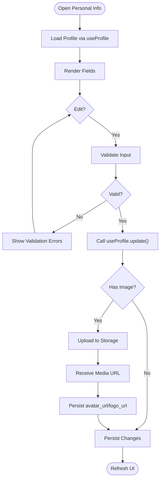
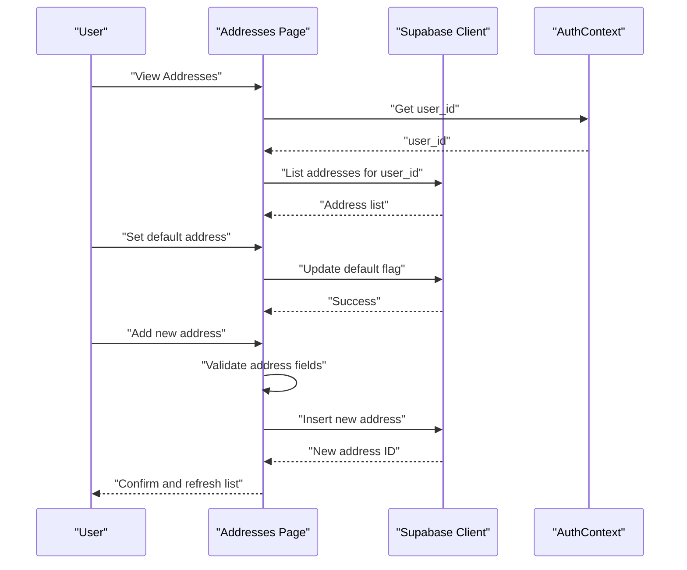
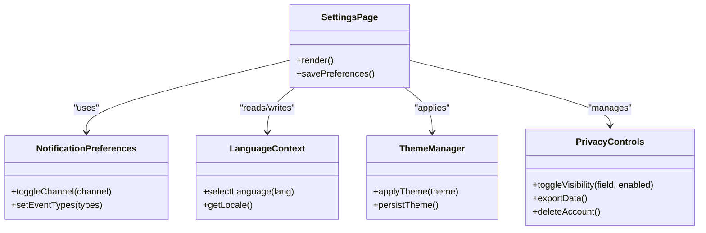
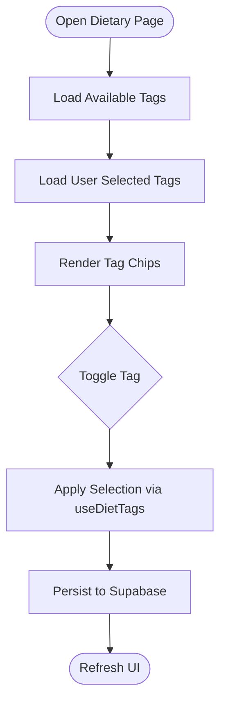
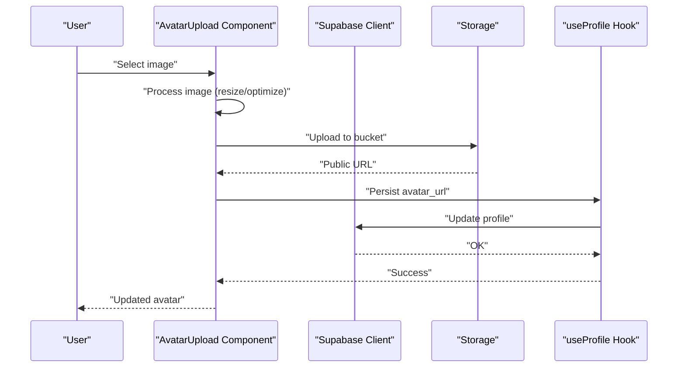
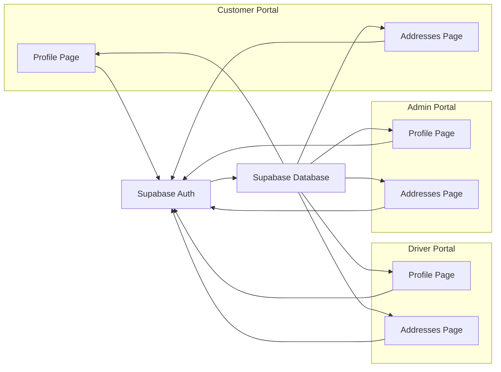
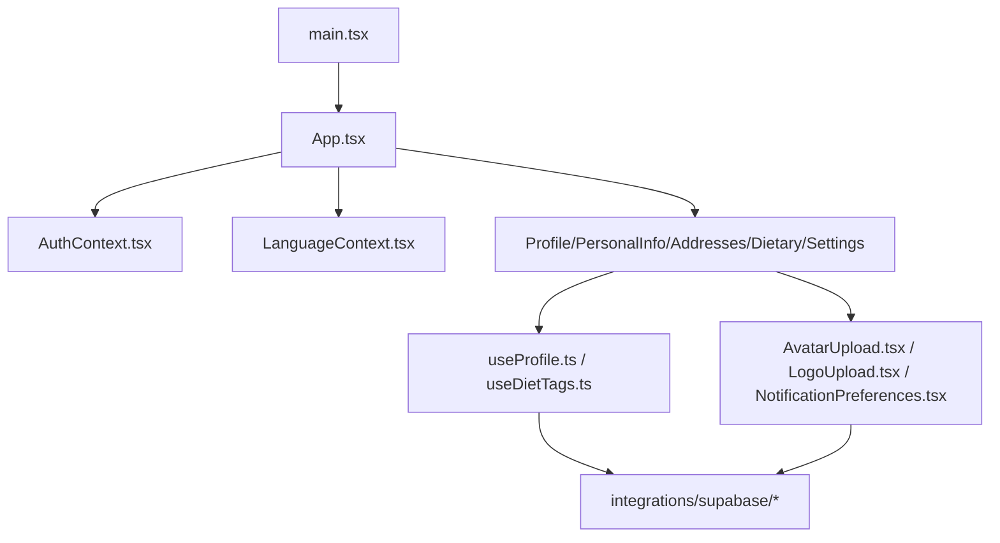

# User Profile & Settings

<cite>
**Referenced Files in This Document**
- [App.tsx](file://src/App.tsx)
- [main.tsx](file://src/main.tsx)
- [AuthContext.tsx](file://src/contexts/AuthContext.tsx)
- [LanguageContext.tsx](file://src/contexts/LanguageContext.tsx)
- [AvatarUpload.tsx](file://src/components/AvatarUpload.tsx)
- [LogoUpload.tsx](file://src/components/LogoUpload.tsx)
- [useProfile.ts](file://src/hooks/useProfile.ts)
- [useDietTags.ts](file://src/hooks/useDietTags.ts)
- [client.ts](file://src/integrations/supabase/client.ts)
- [types.ts](file://src/integrations/supabase/types.ts)
- [delivery.ts](file://src/integrations/supabase/delivery.ts)
- [Profile.tsx](file://src/pages/Profile.tsx)
- [PersonalInfo.tsx](file://src/pages/PersonalInfo.tsx)
- [Addresses.tsx](file://src/pages/Addresses.tsx)
- [Dietary.tsx](file://src/pages/Dietary.tsx)
- [Settings.tsx](file://src/pages/Settings.tsx)
- [NotificationPreferences.tsx](file://src/components/NotificationPreferences.tsx)
- [routes.tsx](file://src/fleet/routes.tsx)
- [index.ts](file://src/fleet/index.ts)
</cite>

## Table of Contents
1. [Introduction](#introduction)
2. [Project Structure](#project-structure)
3. [Core Components](#core-components)
4. [Architecture Overview](#architecture-overview)
5. [Detailed Component Analysis](#detailed-component-analysis)
6. [Dependency Analysis](#dependency-analysis)
7. [Performance Considerations](#performance-considerations)
8. [Troubleshooting Guide](#troubleshooting-guide)
9. [Conclusion](#conclusion)

## Introduction
This document describes the user profile management and settings functionality across the customer portal. It covers personal details, dietary preferences, health metrics, avatar and logo uploads, address book management with multiple delivery locations and default selection, settings configuration (notifications, language, theme, privacy), and the diet tags system for allergies, restrictions, and preferences. It also explains integration with the authentication system, cross-portal profile synchronization, data validation rules, and provides examples of update workflows, address management patterns, and settings persistence.

## Project Structure
The profile and settings features are implemented as React components and hooks integrated with Supabase for data persistence and authentication via Supabase Auth. The application initializes monitoring, analytics, and native capabilities before rendering the main App shell.

**Diagram sources**
- [main.tsx:1-50](file://src/main.tsx#L1-L50)
- [App.tsx](file://src/App.tsx)
- [AuthContext.tsx](file://src/contexts/AuthContext.tsx)
- [LanguageContext.tsx](file://src/contexts/LanguageContext.tsx)
- [Profile.tsx](file://src/pages/Profile.tsx)
- [PersonalInfo.tsx](file://src/pages/PersonalInfo.tsx)
- [Addresses.tsx](file://src/pages/Addresses.tsx)
- [Dietary.tsx](file://src/pages/Dietary.tsx)
- [Settings.tsx](file://src/pages/Settings.tsx)
- [AvatarUpload.tsx](file://src/components/AvatarUpload.tsx)
- [LogoUpload.tsx](file://src/components/LogoUpload.tsx)
- [NotificationPreferences.tsx](file://src/components/NotificationPreferences.tsx)
- [useProfile.ts](file://src/hooks/useProfile.ts)
- [useDietTags.ts](file://src/hooks/useDietTags.ts)
- [client.ts](file://src/integrations/supabase/client.ts)
- [types.ts](file://src/integrations/supabase/types.ts)
- [delivery.ts](file://src/integrations/supabase/delivery.ts)

**Section sources**
- [main.tsx:1-50](file://src/main.tsx#L1-L50)
- [App.tsx](file://src/App.tsx)

## Core Components
- Authentication and session management are provided by the authentication context, enabling protected routes and user-aware UI.
- Language selection is centralized via the language context, affecting UI text and potentially date/time/number formatting.
- Profile management is handled by a dedicated hook that encapsulates Supabase queries and mutations for profile data.
- Dietary preferences are managed through a diet tags hook that reads and updates user-selected tags.
- Avatar and logo uploads are implemented as reusable components with image processing and storage integration.
- Address book management supports multiple delivery locations with default selection and validation.
- Settings include notification preferences, language selection, theme customization, and privacy controls.

**Section sources**
- [AuthContext.tsx](file://src/contexts/AuthContext.tsx)
- [LanguageContext.tsx](file://src/contexts/LanguageContext.tsx)
- [useProfile.ts](file://src/hooks/useProfile.ts)
- [useDietTags.ts](file://src/hooks/useDietTags.ts)
- [AvatarUpload.tsx](file://src/components/AvatarUpload.tsx)
- [LogoUpload.tsx](file://src/components/LogoUpload.tsx)
- [Addresses.tsx](file://src/pages/Addresses.tsx)
- [Settings.tsx](file://src/pages/Settings.tsx)

## Architecture Overview
The profile and settings subsystem integrates React components, hooks, and Supabase for data access. Authentication drives visibility and permissions, while contexts manage localization and global state. Upload components coordinate image processing and storage, and pages orchestrate workflows.

**Diagram sources**
- [Profile.tsx](file://src/pages/Profile.tsx)
- [useProfile.ts](file://src/hooks/useProfile.ts)
- [useDietTags.ts](file://src/hooks/useDietTags.ts)
- [AuthContext.tsx](file://src/contexts/AuthContext.tsx)
- [client.ts](file://src/integrations/supabase/client.ts)
- [types.ts](file://src/integrations/supabase/types.ts)

## Detailed Component Analysis

### Authentication Integration
- The authentication context provides the current user session and related state. Profile and settings pages rely on this to enable editing and to resolve ownership of records.
- Protected routes ensure only authenticated users can access profile and settings pages.

**Section sources**
- [AuthContext.tsx](file://src/contexts/AuthContext.tsx)
- [Profile.tsx](file://src/pages/Profile.tsx)

### Profile Information Management
- Personal details include name, email, phone, and optional metadata. The profile hook encapsulates loading, updating, and validation of these fields.
- Health metrics can be stored alongside profile data and rendered in dedicated views.
- Avatar and logo URLs are persisted and refreshed after successful uploads.

**Diagram sources**
- [PersonalInfo.tsx](file://src/pages/PersonalInfo.tsx)
- [useProfile.ts](file://src/hooks/useProfile.ts)
- [AvatarUpload.tsx](file://src/components/AvatarUpload.tsx)
- [LogoUpload.tsx](file://src/components/LogoUpload.tsx)

**Section sources**
- [PersonalInfo.tsx](file://src/pages/PersonalInfo.tsx)
- [useProfile.ts](file://src/hooks/useProfile.ts)
- [AvatarUpload.tsx](file://src/components/AvatarUpload.tsx)
- [LogoUpload.tsx](file://src/components/LogoUpload.tsx)

### Address Book System
- Multiple delivery locations are supported with default address selection.
- Address validation ensures required fields are present and formatted consistently.
- Default address toggles update the user’s preferred delivery location.

**Diagram sources**
- [Addresses.tsx](file://src/pages/Addresses.tsx)
- [delivery.ts](file://src/integrations/supabase/delivery.ts)
- [AuthContext.tsx](file://src/contexts/AuthContext.tsx)
- [client.ts](file://src/integrations/supabase/client.ts)

**Section sources**
- [Addresses.tsx](file://src/pages/Addresses.tsx)
- [delivery.ts](file://src/integrations/supabase/delivery.ts)

### Settings Configuration
- Notification preferences allow users to opt in/out of various channels and event types.
- Language selection is controlled via the language context and persists per user preference.
- Theme customization can be applied globally and saved to user settings.
- Privacy controls manage data sharing and visibility of profile information.

**Diagram sources**
- [Settings.tsx](file://src/pages/Settings.tsx)
- [NotificationPreferences.tsx](file://src/components/NotificationPreferences.tsx)
- [LanguageContext.tsx](file://src/contexts/LanguageContext.tsx)

**Section sources**
- [Settings.tsx](file://src/pages/Settings.tsx)
- [NotificationPreferences.tsx](file://src/components/NotificationPreferences.tsx)
- [LanguageContext.tsx](file://src/contexts/LanguageContext.tsx)

### Diet Tags System
- Users select diet tags representing allergies, restrictions, and preferences.
- The diet tags hook fetches current selections and applies updates atomically.
- Tags are validated against a controlled taxonomy to prevent invalid entries.

**Diagram sources**
- [Dietary.tsx](file://src/pages/Dietary.tsx)
- [useDietTags.ts](file://src/hooks/useDietTags.ts)

**Section sources**
- [Dietary.tsx](file://src/pages/Dietary.tsx)
- [useDietTags.ts](file://src/hooks/useDietTags.ts)

### Avatar and Logo Upload Functionality
- AvatarUpload and LogoUpload components handle image selection, optional resizing/thumbnails, and secure upload to storage.
- After successful upload, the media URL is persisted to the profile record.
- Integration with Supabase storage ensures scalability and CDN-ready URLs.

**Diagram sources**
- [AvatarUpload.tsx](file://src/components/AvatarUpload.tsx)
- [LogoUpload.tsx](file://src/components/LogoUpload.tsx)
- [useProfile.ts](file://src/hooks/useProfile.ts)
- [client.ts](file://src/integrations/supabase/client.ts)

**Section sources**
- [AvatarUpload.tsx](file://src/components/AvatarUpload.tsx)
- [LogoUpload.tsx](file://src/components/LogoUpload.tsx)
- [useProfile.ts](file://src/hooks/useProfile.ts)

### Cross-Portal Profile Synchronization
- Authentication tokens and user identifiers are consistent across portals, ensuring synchronized profile data.
- Supabase Auth and Supabase ORM maintain normalized user records that reflect updates in real time.

**Diagram sources**
- [AuthContext.tsx](file://src/contexts/AuthContext.tsx)
- [Profile.tsx](file://src/pages/Profile.tsx)
- [Addresses.tsx](file://src/pages/Addresses.tsx)
- [routes.tsx](file://src/fleet/routes.tsx)
- [index.ts](file://src/fleet/index.ts)

**Section sources**
- [AuthContext.tsx](file://src/contexts/AuthContext.tsx)
- [Profile.tsx](file://src/pages/Profile.tsx)
- [Addresses.tsx](file://src/pages/Addresses.tsx)
- [routes.tsx](file://src/fleet/routes.tsx)
- [index.ts](file://src/fleet/index.ts)

## Dependency Analysis
- Initialization: main.tsx sets up monitoring, analytics, and native app initialization before mounting the App shell.
- Routing and Layout: App.tsx orchestrates page-level navigation and layout containers.
- Authentication: AuthContext provides session state used by profile and settings pages.
- Localization: LanguageContext manages locale and language preferences.
- Data Access: Supabase client and typed schemas define CRUD operations for profiles, addresses, and diet tags.
- Uploads: AvatarUpload and LogoUpload integrate with Supabase storage and persist URLs via the profile hook.

**Diagram sources**
- [main.tsx:1-50](file://src/main.tsx#L1-L50)
- [App.tsx](file://src/App.tsx)
- [AuthContext.tsx](file://src/contexts/AuthContext.tsx)
- [LanguageContext.tsx](file://src/contexts/LanguageContext.tsx)
- [useProfile.ts](file://src/hooks/useProfile.ts)
- [useDietTags.ts](file://src/hooks/useDietTags.ts)
- [client.ts](file://src/integrations/supabase/client.ts)
- [AvatarUpload.tsx](file://src/components/AvatarUpload.tsx)
- [LogoUpload.tsx](file://src/components/LogoUpload.tsx)
- [NotificationPreferences.tsx](file://src/components/NotificationPreferences.tsx)

**Section sources**
- [main.tsx:1-50](file://src/main.tsx#L1-L50)
- [App.tsx](file://src/App.tsx)
- [client.ts](file://src/integrations/supabase/client.ts)

## Performance Considerations
- Debounce input fields in forms to reduce unnecessary writes during typing.
- Batch updates for multiple settings to minimize network requests.
- Lazy-load images and thumbnails for avatar/logo previews.
- Cache frequently accessed lists (diet tags, languages) to avoid repeated fetches.
- Use optimistic UI for quick feedback on toggles and switches, with rollback on failure.

## Troubleshooting Guide
- Authentication failures: Verify AuthContext session and re-authenticate if needed. Ensure Supabase Auth is reachable and tokens are valid.
- Upload errors: Confirm storage bucket permissions and file size limits. Check image processing steps and retry with supported formats.
- Validation failures: Review field constraints and error messages returned by the backend. Normalize inputs before submission.
- Settings not persisting: Ensure settings are written to the correct user record and that the write operation completes successfully.

**Section sources**
- [AuthContext.tsx](file://src/contexts/AuthContext.tsx)
- [AvatarUpload.tsx](file://src/components/AvatarUpload.tsx)
- [LogoUpload.tsx](file://src/components/LogoUpload.tsx)
- [Settings.tsx](file://src/pages/Settings.tsx)

## Conclusion
The profile and settings subsystem provides a cohesive, authenticated experience for managing personal details, dietary preferences, health metrics, and account-wide configurations. Through Supabase-backed hooks and components, it supports robust data validation, scalable media uploads, and cross-portal synchronization. The modular design enables easy extension for additional preferences, integrations, and advanced features.