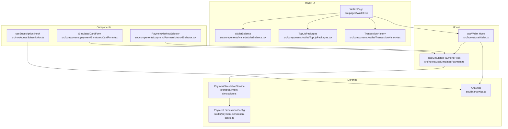
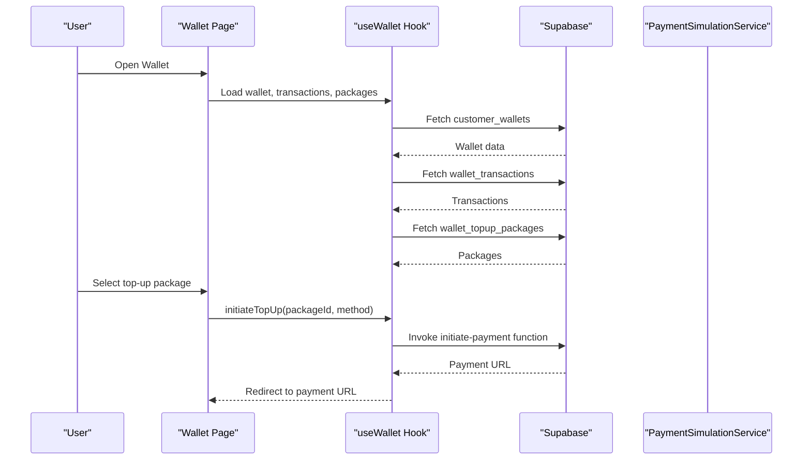
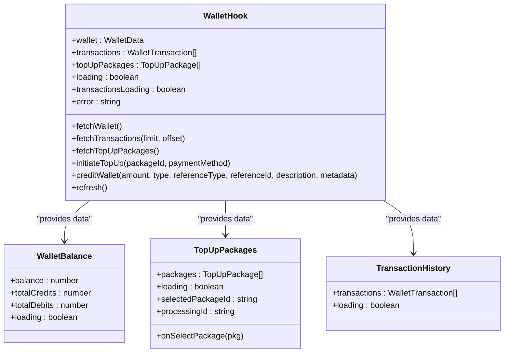
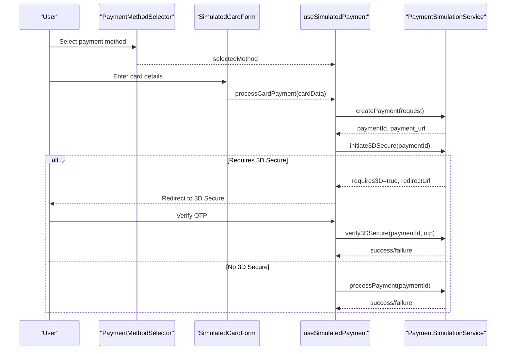
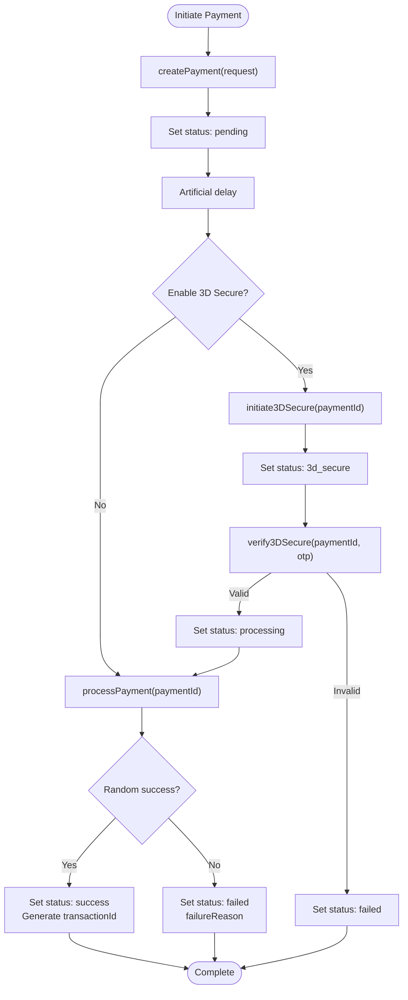
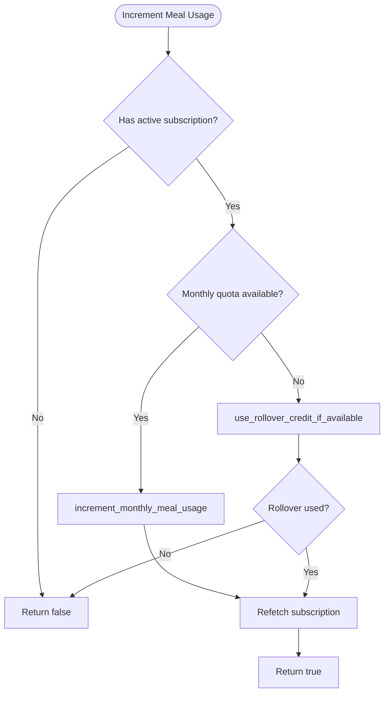
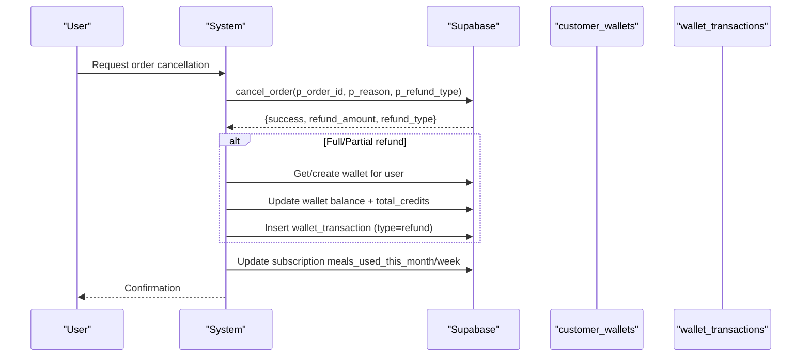
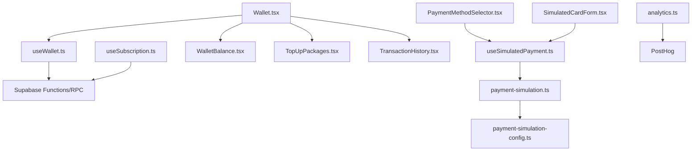

# Wallet & Payment System

<cite>
**Referenced Files in This Document**
- [useWallet.ts](file://src/hooks/useWallet.ts)
- [Wallet.tsx](file://src/pages/Wallet.tsx)
- [WalletBalance.tsx](file://src/components/wallet/WalletBalance.tsx)
- [TopUpPackages.tsx](file://src/components/wallet/TopUpPackages.tsx)
- [TransactionHistory.tsx](file://src/components/wallet/TransactionHistory.tsx)
- [Profile.tsx](file://src/pages/Profile.tsx)
- [useSimulatedPayment.ts](file://src/hooks/useSimulatedPayment.ts)
- [payment-simulation.ts](file://src/lib/payment-simulation.ts)
- [payment-simulation-config.ts](file://src/lib/payment-simulation-config.ts)
- [PaymentMethodSelector.tsx](file://src/components/payment/PaymentMethodSelector.tsx)
- [SimulatedCardForm.tsx](file://src/components/payment/SimulatedCardForm.tsx)
- [useSubscription.ts](file://src/hooks/useSubscription.ts)
- [analytics.ts](file://src/lib/analytics.ts)
- [cancel_meal_schedule_function.sql](file://supabase/migrations/20260303160000_cancel_meal_schedule_function.sql)
- [advanced_retention_system.sql](file://supabase/migrations/20250223000004_advanced_retention_system.sql)
- [implementation-plan-customer-portal.md](file://docs/implementation-plan-customer-portal.md)
</cite>

## Table of Contents
1. [Introduction](#introduction)
2. [Project Structure](#project-structure)
3. [Core Components](#core-components)
4. [Architecture Overview](#architecture-overview)
5. [Detailed Component Analysis](#detailed-component-analysis)
6. [Dependency Analysis](#dependency-analysis)
7. [Performance Considerations](#performance-considerations)
8. [Troubleshooting Guide](#troubleshooting-guide)
9. [Conclusion](#conclusion)

## Introduction
This document provides comprehensive documentation for the wallet and payment system. It covers wallet balance management, top-up options, and transaction history. It explains payment method integration, the secure checkout process, and the payment simulation framework. It also details subscription billing, meal purchase payments, and refund processing. Additional topics include the payment method selector, saved cards management, international payment support, wallet analytics, spending patterns, and payment security measures.

## Project Structure
The wallet and payment system is organized around three main areas:
- Wallet management: balance, top-ups, and transaction history
- Payment processing: method selection, checkout flow, and simulation
- Subscription and meal billing: quotas, rollover credits, and refunds

**Diagram sources**
- [Wallet.tsx:1-184](file://src/pages/Wallet.tsx#L1-L184)
- [useWallet.ts:1-276](file://src/hooks/useWallet.ts#L1-L276)
- [payment-simulation.ts:1-223](file://src/lib/payment-simulation.ts#L1-L223)
- [payment-simulation-config.ts:1-79](file://src/lib/payment-simulation-config.ts#L1-L79)
- [PaymentMethodSelector.tsx:1-107](file://src/components/payment/PaymentMethodSelector.tsx#L1-L107)
- [SimulatedCardForm.tsx:1-144](file://src/components/payment/SimulatedCardForm.tsx#L1-L144)
- [useSimulatedPayment.ts:1-189](file://src/hooks/useSimulatedPayment.ts#L1-L189)
- [useSubscription.ts:1-264](file://src/hooks/useSubscription.ts#L1-L264)
- [analytics.ts:1-170](file://src/lib/analytics.ts#L1-L170)

**Section sources**
- [Wallet.tsx:1-184](file://src/pages/Wallet.tsx#L1-L184)
- [useWallet.ts:1-276](file://src/hooks/useWallet.ts#L1-L276)

## Core Components
This section outlines the primary building blocks of the wallet and payment system.

- Wallet Hook: Manages wallet data, top-up packages, transactions, and payment initiation. Provides real-time updates via Supabase channels.
- Wallet UI Components: Display balance, top-up packages, and transaction history with loading states and user feedback.
- Payment Simulation: Provides a configurable simulation service for testing payment flows, including 3D Secure verification and outcomes.
- Payment Method Selector: Allows users to choose among supported payment methods.
- Simulated Card Form: Collects card details in simulation mode with formatting and validation.
- Subscription Management: Handles subscription status, meal quotas, rollover credits, and meal usage increments.
- Analytics: Tracks user actions, payments, and system events while sanitizing sensitive data.

**Section sources**
- [useWallet.ts:56-275](file://src/hooks/useWallet.ts#L56-L275)
- [WalletBalance.tsx:13-69](file://src/components/wallet/WalletBalance.tsx#L13-L69)
- [TopUpPackages.tsx:17-132](file://src/components/wallet/TopUpPackages.tsx#L17-L132)
- [TransactionHistory.tsx:57-161](file://src/components/wallet/TransactionHistory.tsx#L57-L161)
- [useSimulatedPayment.ts:22-187](file://src/hooks/useSimulatedPayment.ts#L22-L187)
- [payment-simulation.ts:25-212](file://src/lib/payment-simulation.ts#L25-L212)
- [PaymentMethodSelector.tsx:51-106](file://src/components/payment/PaymentMethodSelector.tsx#L51-L106)
- [SimulatedCardForm.tsx:19-143](file://src/components/payment/SimulatedCardForm.tsx#L19-L143)
- [useSubscription.ts:42-263](file://src/hooks/useSubscription.ts#L42-L263)
- [analytics.ts:55-144](file://src/lib/analytics.ts#L55-L144)

## Architecture Overview
The system integrates frontend hooks and components with Supabase for real-time data and with a payment simulation service for testing. Subscription and wallet operations are coordinated through Supabase functions and stored procedures.

**Diagram sources**
- [Wallet.tsx:31-184](file://src/pages/Wallet.tsx#L31-L184)
- [useWallet.ts:137-167](file://src/hooks/useWallet.ts#L137-L167)

**Section sources**
- [Wallet.tsx:31-184](file://src/pages/Wallet.tsx#L31-L184)
- [useWallet.ts:137-167](file://src/hooks/useWallet.ts#L137-L167)

## Detailed Component Analysis

### Wallet Management
The wallet system manages user balance, top-up packages, and transaction history. It supports real-time updates and provides a seamless user experience.

**Diagram sources**
- [useWallet.ts:56-275](file://src/hooks/useWallet.ts#L56-L275)
- [WalletBalance.tsx:6-14](file://src/components/wallet/WalletBalance.tsx#L6-L14)
- [TopUpPackages.tsx:9-25](file://src/components/wallet/TopUpPackages.tsx#L9-L25)
- [TransactionHistory.tsx:16-58](file://src/components/wallet/TransactionHistory.tsx#L16-L58)

**Section sources**
- [useWallet.ts:56-275](file://src/hooks/useWallet.ts#L56-L275)
- [WalletBalance.tsx:13-69](file://src/components/wallet/WalletBalance.tsx#L13-L69)
- [TopUpPackages.tsx:17-132](file://src/components/wallet/TopUpPackages.tsx#L17-L132)
- [TransactionHistory.tsx:57-161](file://src/components/wallet/TransactionHistory.tsx#L57-L161)

### Payment Method Integration and Secure Checkout
The system supports multiple payment methods and simulates the secure checkout process, including 3D Secure verification.

**Diagram sources**
- [PaymentMethodSelector.tsx:51-106](file://src/components/payment/PaymentMethodSelector.tsx#L51-L106)
- [SimulatedCardForm.tsx:19-143](file://src/components/payment/SimulatedCardForm.tsx#L19-L143)
- [useSimulatedPayment.ts:79-157](file://src/hooks/useSimulatedPayment.ts#L79-L157)
- [payment-simulation.ts:38-140](file://src/lib/payment-simulation.ts#L38-L140)

**Section sources**
- [PaymentMethodSelector.tsx:51-106](file://src/components/payment/PaymentMethodSelector.tsx#L51-L106)
- [SimulatedCardForm.tsx:19-143](file://src/components/payment/SimulatedCardForm.tsx#L19-L143)
- [useSimulatedPayment.ts:79-157](file://src/hooks/useSimulatedPayment.ts#L79-L157)
- [payment-simulation.ts:38-140](file://src/lib/payment-simulation.ts#L38-L140)

### Payment Simulation Framework
The payment simulation service enables deterministic testing of payment flows with configurable success rates, delays, and 3D Secure behavior.

**Diagram sources**
- [payment-simulation.ts:25-212](file://src/lib/payment-simulation.ts#L25-L212)
- [payment-simulation-config.ts:23-38](file://src/lib/payment-simulation-config.ts#L23-L38)

**Section sources**
- [payment-simulation.ts:25-212](file://src/lib/payment-simulation.ts#L25-L212)
- [payment-simulation-config.ts:23-38](file://src/lib/payment-simulation-config.ts#L23-L38)

### Subscription Billing and Meal Purchase Payments
Subscription management handles quotas, rollover credits, and meal usage. The system supports unlimited tiers and automatic rollover credit consumption.

**Diagram sources**
- [useSubscription.ts:163-203](file://src/hooks/useSubscription.ts#L163-L203)
- [advanced_retention_system.sql:530-574](file://supabase/migrations/20250223000004_advanced_retention_system.sql#L530-L574)

**Section sources**
- [useSubscription.ts:163-203](file://src/hooks/useSubscription.ts#L163-L203)
- [advanced_retention_system.sql:530-574](file://supabase/migrations/20250223000004_advanced_retention_system.sql#L530-L574)

### Refund Processing
Refunds are processed for canceled orders, crediting the wallet and adjusting subscription quotas.

**Diagram sources**
- [implementation-plan-customer-portal.md:2057-2137](file://docs/implementation-plan-customer-portal.md#L2057-L2137)

**Section sources**
- [implementation-plan-customer-portal.md:2057-2137](file://docs/implementation-plan-customer-portal.md#L2057-L2137)

### Saved Cards Management
Saved cards are managed through the payment method selector and simulated card form. The system supports multiple payment methods and displays popular options prominently.

**Section sources**
- [PaymentMethodSelector.tsx:51-106](file://src/components/payment/PaymentMethodSelector.tsx#L51-L106)
- [SimulatedCardForm.tsx:19-143](file://src/components/payment/SimulatedCardForm.tsx#L19-L143)

### International Payment Support
The system currently supports Qatari Riyal (QAR) and Sadad as the primary payment method. The simulation framework allows testing of various payment methods, including credit/debit cards, Apple Pay, Google Pay, and Sadad.

**Section sources**
- [payment-simulation-config.ts:41-78](file://src/lib/payment-simulation-config.ts#L41-L78)
- [Wallet.tsx:56-73](file://src/pages/Wallet.tsx#L56-L73)

### Wallet Analytics and Spending Patterns
Analytics tracks user actions, payments, and system events while sanitizing sensitive data. Events include wallet top-ups, order completions, and subscription changes.

**Section sources**
- [analytics.ts:55-144](file://src/lib/analytics.ts#L55-L144)

## Dependency Analysis
The wallet and payment system exhibits clear separation of concerns:
- Hooks depend on Supabase for data and functions
- Components depend on hooks for state and data
- Simulation service is decoupled and configurable
- Subscription logic coordinates with wallet and transaction logs

**Diagram sources**
- [useWallet.ts:1-276](file://src/hooks/useWallet.ts#L1-L276)
- [useSimulatedPayment.ts:1-189](file://src/hooks/useSimulatedPayment.ts#L1-L189)
- [payment-simulation.ts:1-223](file://src/lib/payment-simulation.ts#L1-L223)
- [payment-simulation-config.ts:1-79](file://src/lib/payment-simulation-config.ts#L1-L79)
- [PaymentMethodSelector.tsx:1-107](file://src/components/payment/PaymentMethodSelector.tsx#L1-L107)
- [SimulatedCardForm.tsx:1-144](file://src/components/payment/SimulatedCardForm.tsx#L1-L144)
- [Wallet.tsx:1-184](file://src/pages/Wallet.tsx#L1-L184)
- [WalletBalance.tsx:1-70](file://src/components/wallet/WalletBalance.tsx#L1-L70)
- [TopUpPackages.tsx:1-133](file://src/components/wallet/TopUpPackages.tsx#L1-L133)
- [TransactionHistory.tsx:1-162](file://src/components/wallet/TransactionHistory.tsx#L1-L162)
- [useSubscription.ts:1-264](file://src/hooks/useSubscription.ts#L1-L264)
- [analytics.ts:1-170](file://src/lib/analytics.ts#L1-L170)

**Section sources**
- [useWallet.ts:1-276](file://src/hooks/useWallet.ts#L1-L276)
- [useSimulatedPayment.ts:1-189](file://src/hooks/useSimulatedPayment.ts#L1-L189)
- [payment-simulation.ts:1-223](file://src/lib/payment-simulation.ts#L1-L223)
- [payment-simulation-config.ts:1-79](file://src/lib/payment-simulation-config.ts#L1-L79)
- [PaymentMethodSelector.tsx:1-107](file://src/components/payment/PaymentMethodSelector.tsx#L1-L107)
- [SimulatedCardForm.tsx:1-144](file://src/components/payment/SimulatedCardForm.tsx#L1-L144)
- [Wallet.tsx:1-184](file://src/pages/Wallet.tsx#L1-L184)
- [WalletBalance.tsx:1-70](file://src/components/wallet/WalletBalance.tsx#L1-L70)
- [TopUpPackages.tsx:1-133](file://src/components/wallet/TopUpPackages.tsx#L1-L133)
- [TransactionHistory.tsx:1-162](file://src/components/wallet/TransactionHistory.tsx#L1-L162)
- [useSubscription.ts:1-264](file://src/hooks/useSubscription.ts#L1-L264)
- [analytics.ts:1-170](file://src/lib/analytics.ts#L1-L170)

## Performance Considerations
- Real-time updates: Supabase channels reduce polling overhead and provide immediate UI updates.
- Debounced fetches: Visibility change listeners prevent redundant network calls when the app becomes visible.
- Simulation delays: Configurable artificial delays help simulate realistic network conditions during testing.
- Pagination: Transaction fetching uses range-based pagination to limit payload sizes.

## Troubleshooting Guide
Common issues and resolutions:
- Payment simulation disabled: Ensure the environment variable enabling payment simulation is set correctly.
- 3D Secure failures: Verify OTP input format and retry; simulation accepts any 6-digit code.
- Insufficient funds: The simulation randomly selects failure reasons; retry with corrected card details.
- Wallet not updating: Confirm Supabase channel subscriptions and visibility change handlers are active.
- Subscription quota exceeded: Use rollover credits if available; otherwise wait until next period.

**Section sources**
- [payment-simulation.ts:34-36](file://src/lib/payment-simulation.ts#L34-L36)
- [useSimulatedPayment.ts:134-157](file://src/hooks/useSimulatedPayment.ts#L134-L157)
- [useWallet.ts:210-221](file://src/hooks/useWallet.ts#L210-L221)
- [useSubscription.ts:163-203](file://src/hooks/useSubscription.ts#L163-L203)

## Conclusion
The wallet and payment system provides a robust foundation for managing user balances, facilitating secure payments, and supporting subscription-based meal services. Its modular architecture, real-time capabilities, and comprehensive simulation framework enable reliable development, testing, and deployment across diverse environments.