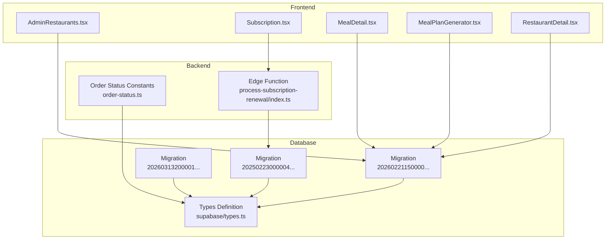
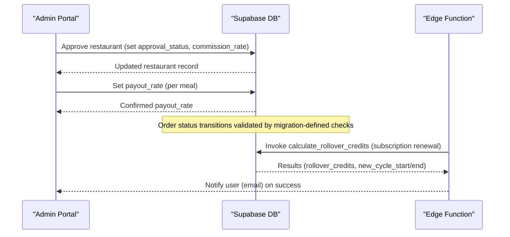
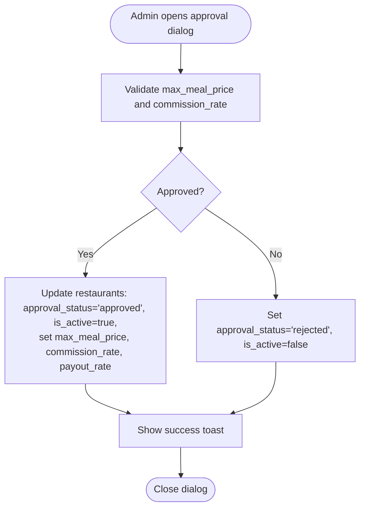
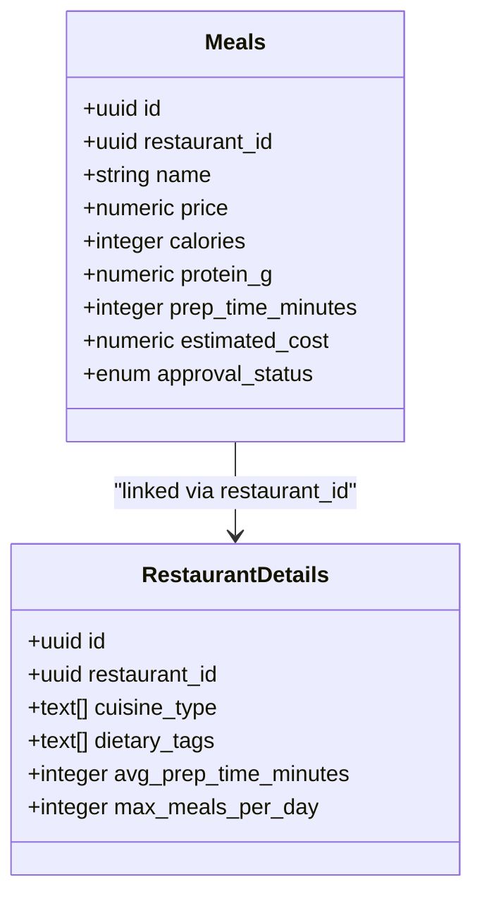
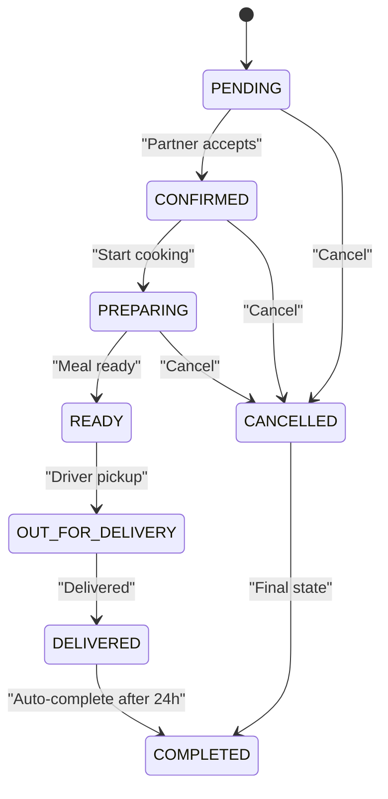
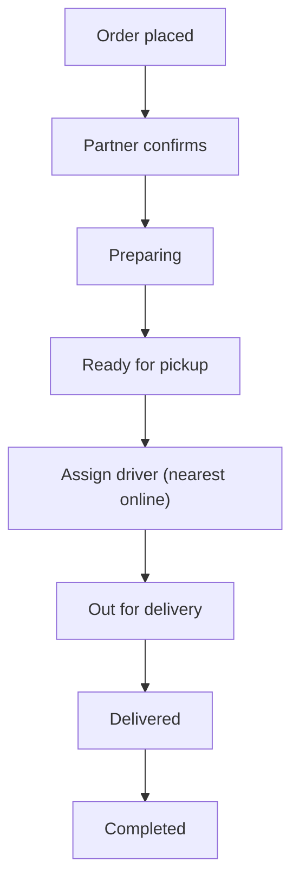
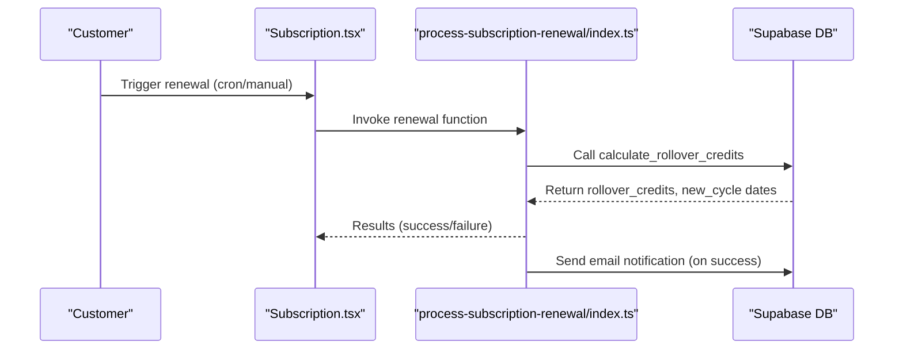
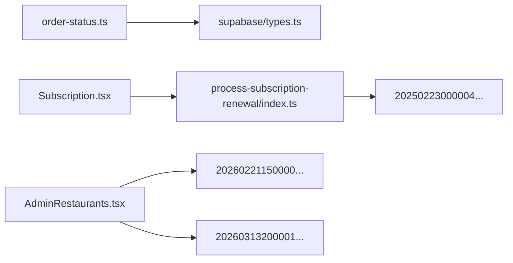

# Business Entities

<cite>
**Referenced Files in This Document**
- [AdminRestaurants.tsx](file://src/pages/admin/AdminRestaurants.tsx)
- [order-status.ts](file://src/lib/constants/order-status.ts)
- [order-status.test.ts](file://src/lib/constants/order-status.test.ts)
- [types.ts](file://supabase/types.ts)
- [20260221150000_comprehensive_business_model_fix.sql](file://supabase/migrations/20260221150000_comprehensive_business_model_fix.sql)
- [20260313200001_add_commission_rate_to_restaurants.sql](file://supabase/migrations/20260313200001_add_commission_rate_to_restaurants.sql)
- [20260222170000_test_order_workflow.sql](file://supabase/migrations/20260222170000_test_order_workflow.sql)
- [Order-Workflow-Proposal.md](file://docs/Order-Workflow-Proposal.md)
- [Subscription.tsx](file://src/pages/Subscription.tsx)
- [process-subscription-renewal/index.ts](file://supabase/functions/process-subscription-renewal/index.ts)
- [20250223000004_advanced_retention_system.sql](file://supabase/migrations/20250223000004_advanced_retention_system.sql)
- [MealDetail.tsx](file://src/pages/MealDetail.tsx)
- [useDietTags.ts](file://src/hooks/useDietTags.ts)
- [MealPlanGenerator.tsx](file://src/components/MealPlanGenerator.tsx)
- [RestaurantDetail.tsx](file://src/pages/RestaurantDetail.tsx)
- [delivery_system_visual.md](file://delivery_system_visual.md)
- [delivery_system_design.md](file://delivery_system_design.md)
- [delivery_system_plan_simplified.md](file://delivery_system_plan_simplified.md)
- [delivery_integration_plan.md](file://delivery_integration_plan.md)
</cite>

## Table of Contents
1. [Introduction](#introduction)
2. [Project Structure](#project-structure)
3. [Core Components](#core-components)
4. [Architecture Overview](#architecture-overview)
5. [Detailed Component Analysis](#detailed-component-analysis)
6. [Dependency Analysis](#dependency-analysis)
7. [Performance Considerations](#performance-considerations)
8. [Troubleshooting Guide](#troubleshooting-guide)
9. [Conclusion](#conclusion)

## Introduction
This document describes Nutrio’s business logic entities and their operational workflows: restaurants, meals, orders, deliveries, and subscription management. It explains approval and commission mechanics, meal catalog features (pricing, nutrition, tags), order lifecycle and status tracking, delivery coordination, and subscription plans, billing cycles, cancellations, and renewal. It also documents business rule enforcement, validation constraints, and state management across the system.

## Project Structure
The business logic spans frontend React components, Supabase database schemas and migrations, and backend edge functions. Key areas:
- Restaurant partner system: approvals, commission rates, payout rates, and restaurant details
- Meal catalog: nutritional info, dietary tags, optional pricing, and availability
- Orders: unified status model, transitions, and UI state
- Deliveries: driver assignment and tracking
- Subscriptions: tiers, billing intervals, rollover credits, and renewal automation

**Diagram sources**
- [AdminRestaurants.tsx:164-238](file://src/pages/admin/AdminRestaurants.tsx#L164-L238)
- [Subscription.tsx:126-418](file://src/pages/Subscription.tsx#L126-L418)
- [order-status.ts:1-116](file://src/lib/constants/order-status.ts#L1-L116)
- [process-subscription-renewal/index.ts:1-278](file://supabase/functions/process-subscription-renewal/index.ts#L1-L278)
- [20260221150000_comprehensive_business_model_fix.sql:1-530](file://supabase/migrations/20260221150000_comprehensive_business_model_fix.sql#L1-L530)
- [20260313200001_add_commission_rate_to_restaurants.sql:1-10](file://supabase/migrations/20260313200001_add_commission_rate_to_restaurants.sql#L1-L10)
- [20250223000004_advanced_retention_system.sql:333-375](file://supabase/migrations/20250223000004_advanced_retention_system.sql#L333-L375)
- [types.ts:230-330](file://supabase/types.ts#L230-L330)

**Section sources**
- [AdminRestaurants.tsx:164-238](file://src/pages/admin/AdminRestaurants.tsx#L164-L238)
- [order-status.ts:1-116](file://src/lib/constants/order-status.ts#L1-L116)
- [process-subscription-renewal/index.ts:1-278](file://supabase/functions/process-subscription-renewal/index.ts#L1-L278)
- [20260221150000_comprehensive_business_model_fix.sql:1-530](file://supabase/migrations/20260221150000_comprehensive_business_model_fix.sql#L1-L530)
- [20260313200001_add_commission_rate_to_restaurants.sql:1-10](file://supabase/migrations/20260313200001_add_commission_rate_to_restaurants.sql#L1-L10)
- [20250223000004_advanced_retention_system.sql:333-375](file://supabase/migrations/20250223000004_advanced_retention_system.sql#L333-L375)
- [types.ts:230-330](file://supabase/types.ts#L230-L330)

## Core Components
- Restaurants: approval workflow, commission rate, payout rate, and extended details
- Meals: optional pricing, nutritional info, dietary tags, and availability
- Orders: unified status model with timeline and validation
- Deliveries: driver assignment and tracking
- Subscriptions: tiers, billing cycles, rollover credits, and renewal automation

**Section sources**
- [AdminRestaurants.tsx:164-238](file://src/pages/admin/AdminRestaurants.tsx#L164-L238)
- [20260221150000_comprehensive_business_model_fix.sql:42-64](file://supabase/migrations/20260221150000_comprehensive_business_model_fix.sql#L42-L64)
- [order-status.ts:1-116](file://src/lib/constants/order-status.ts#L1-L116)
- [delivery_system_visual.md:74-119](file://delivery_system_visual.md#L74-L119)
- [Subscription.tsx:126-418](file://src/pages/Subscription.tsx#L126-L418)

## Architecture Overview
The system enforces business rules at the database layer (migrations, policies, triggers) and coordinates state transitions in the frontend and edge functions. The order lifecycle is governed by a strict status model, while subscription renewal is automated with rollover credit calculations.

**Diagram sources**
- [AdminRestaurants.tsx:175-238](file://src/pages/admin/AdminRestaurants.tsx#L175-L238)
- [20260221150000_comprehensive_business_model_fix.sql:42-64](file://supabase/migrations/20260221150000_comprehensive_business_model_fix.sql#L42-L64)
- [20260222170000_test_order_workflow.sql:245-255](file://supabase/migrations/20260222170000_test_order_workflow.sql#L245-L255)
- [process-subscription-renewal/index.ts:166-241](file://supabase/functions/process-subscription-renewal/index.ts#L166-L241)

## Detailed Component Analysis

### Restaurant Partner System
- Approval workflow: Admin sets approval_status to approved/rejected, activates/deactivates, and defines commission_rate and max_meal_price.
- Commission structure: commission_rate stored per restaurant; payout_rate is the fixed QAR amount paid per meal prepared.
- Extended details: restaurant_details table captures cuisine types, dietary tags, operating hours, banking info, and onboarding steps.

**Diagram sources**
- [AdminRestaurants.tsx:168-238](file://src/pages/admin/AdminRestaurants.tsx#L168-L238)
- [20260313200001_add_commission_rate_to_restaurants.sql:1-10](file://supabase/migrations/20260313200001_add_commission_rate_to_restaurants.sql#L1-L10)
- [20260221150000_comprehensive_business_model_fix.sql:42-64](file://supabase/migrations/20260221150000_comprehensive_business_model_fix.sql#L42-L64)

**Section sources**
- [AdminRestaurants.tsx:164-238](file://src/pages/admin/AdminRestaurants.tsx#L164-L238)
- [20260313200001_add_commission_rate_to_restaurants.sql:1-10](file://supabase/migrations/20260313200001_add_commission_rate_to_restaurants.sql#L1-L10)
- [20260221150000_comprehensive_business_model_fix.sql:67-130](file://supabase/migrations/20260221150000_comprehensive_business_model_fix.sql#L67-L130)

### Meal Catalog System
- Pricing: price is optional and deprecated for subscription model; estimated_cost maintained for internal cost tracking.
- Nutrition and tags: calories, protein, prep time; diet_tags surfaced to UI; allergy detection compares user preferences against meal tags.
- Availability: max_meals_per_day and average prep time configured per restaurant.

**Diagram sources**
- [20260221150000_comprehensive_business_model_fix.sql:196-208](file://supabase/migrations/20260221150000_comprehensive_business_model_fix.sql#L196-L208)
- [20260221150000_comprehensive_business_model_fix.sql:71-111](file://supabase/migrations/20260221150000_comprehensive_business_model_fix.sql#L71-L111)

**Section sources**
- [MealDetail.tsx:923-950](file://src/pages/MealDetail.tsx#L923-L950)
- [useDietTags.ts:35-63](file://src/hooks/useDietTags.ts#L35-L63)
- [20260221150000_comprehensive_business_model_fix.sql:196-208](file://supabase/migrations/20260221150000_comprehensive_business_model_fix.sql#L196-L208)
- [RestaurantDetail.tsx:731-778](file://src/pages/RestaurantDetail.tsx#L731-L778)
- [MealPlanGenerator.tsx:548-584](file://src/components/MealPlanGenerator.tsx#L548-L584)

### Order Management System
- Unified status model: pending, confirmed, preparing, ready, out_for_delivery, delivered, cancelled.
- Timeline and visibility: customer-visible statuses exclude cancelled from the timeline.
- Validation: migration enforces valid transitions and audit logging on changes.

**Diagram sources**
- [Order-Workflow-Proposal.md:65-103](file://docs/Order-Workflow-Proposal.md#L65-L103)
- [order-status.ts:75-83](file://src/lib/constants/order-status.ts#L75-L83)

**Section sources**
- [order-status.ts:1-116](file://src/lib/constants/order-status.ts#L1-L116)
- [order-status.test.ts:111-151](file://src/lib/constants/order-status.test.ts#L111-L151)
- [Order-Workflow-Proposal.md:65-199](file://docs/Order-Workflow-Proposal.md#L65-L199)
- [20260222170000_test_order_workflow.sql:245-255](file://supabase/migrations/20260222170000_test_order_workflow.sql#L245-L255)

### Delivery Coordination
- Drivers and deliveries: drivers table with approval and availability; deliveries table tracks status, addresses, fees, tips, and timestamps.
- Assignment and tracking: simplified algorithm assigns nearest online driver; admin dashboard supports manual and batch operations.

**Diagram sources**
- [delivery_system_visual.md:74-119](file://delivery_system_visual.md#L74-L119)
- [delivery_system_design.md:286-293](file://delivery_system_design.md#L286-L293)
- [delivery_system_plan_simplified.md:163-191](file://delivery_system_plan_simplified.md#L163-L191)
- [delivery_integration_plan.md:243-302](file://delivery_integration_plan.md#L243-L302)

**Section sources**
- [delivery_system_visual.md:74-119](file://delivery_system_visual.md#L74-L119)
- [delivery_system_design.md:286-293](file://delivery_system_design.md#L286-L293)
- [delivery_system_plan_simplified.md:163-191](file://delivery_system_plan_simplified.md#L163-L191)
- [delivery_integration_plan.md:243-302](file://delivery_integration_plan.md#L243-L302)
- [types.ts:230-330](file://supabase/types.ts#L230-L330)

### Subscription Management
- Plans and tiers: basic, standard, premium, vip with configurable meals per week and pricing.
- Billing cycles: monthly/annual billing with auto-renew toggled per subscription.
- Cancellations: cancellation flow integrates with UI and backend.
- Renewal and rollover: edge function calculates rollover credits (up to 20% unused credits), extends billing cycle, and notifies users.

**Diagram sources**
- [Subscription.tsx:126-418](file://src/pages/Subscription.tsx#L126-L418)
- [process-subscription-renewal/index.ts:166-241](file://supabase/functions/process-subscription-renewal/index.ts#L166-L241)
- [20250223000004_advanced_retention_system.sql:333-375](file://supabase/migrations/20250223000004_advanced_retention_system.sql#L333-L375)

**Section sources**
- [Subscription.tsx:126-418](file://src/pages/Subscription.tsx#L126-L418)
- [process-subscription-renewal/index.ts:1-278](file://supabase/functions/process-subscription-renewal/index.ts#L1-L278)
- [20250223000004_advanced_retention_system.sql:333-375](file://supabase/migrations/20250223000004_advanced_retention_system.sql#L333-L375)

## Dependency Analysis
- Frontend depends on Supabase types and constants for order status and entity shapes.
- Restaurant approval and payout logic is enforced by database migrations and policies.
- Subscription renewal is decoupled via an edge function invoking database functions.

**Diagram sources**
- [order-status.ts:1-116](file://src/lib/constants/order-status.ts#L1-L116)
- [types.ts:230-330](file://supabase/types.ts#L230-L330)
- [Subscription.tsx:126-418](file://src/pages/Subscription.tsx#L126-L418)
- [process-subscription-renewal/index.ts:1-278](file://supabase/functions/process-subscription-renewal/index.ts#L1-L278)
- [20250223000004_advanced_retention_system.sql:333-375](file://supabase/migrations/20250223000004_advanced_retention_system.sql#L333-L375)
- [20260221150000_comprehensive_business_model_fix.sql:42-64](file://supabase/migrations/20260221150000_comprehensive_business_model_fix.sql#L42-L64)
- [20260313200001_add_commission_rate_to_restaurants.sql:1-10](file://supabase/migrations/20260313200001_add_commission_rate_to_restaurants.sql#L1-L10)

**Section sources**
- [order-status.ts:1-116](file://src/lib/constants/order-status.ts#L1-L116)
- [types.ts:230-330](file://supabase/types.ts#L230-L330)
- [Subscription.tsx:126-418](file://src/pages/Subscription.tsx#L126-L418)
- [process-subscription-renewal/index.ts:1-278](file://supabase/functions/process-subscription-renewal/index.ts#L1-L278)
- [20250223000004_advanced_retention_system.sql:333-375](file://supabase/migrations/20250223000004_advanced_retention_system.sql#L333-L375)
- [20260221150000_comprehensive_business_model_fix.sql:42-64](file://supabase/migrations/20260221150000_comprehensive_business_model_fix.sql#L42-L64)
- [20260313200001_add_commission_rate_to_restaurants.sql:1-10](file://supabase/migrations/20260313200001_add_commission_rate_to_restaurants.sql#L1-L10)

## Performance Considerations
- Database indexes: payout_rate and approval_status for restaurants; order_status for meal_schedules; partner_earnings for reporting.
- Atomic operations: race-condition fixes for meal quota usage and weekly reset automation.
- Edge function caching: dry-run previews for renewal to avoid unnecessary writes.

[No sources needed since this section provides general guidance]

## Troubleshooting Guide
- Order status transitions: ensure only valid transitions occur; migration enforces constraints and logs changes.
- Subscription renewal: verify rollover credits calculation and edge function invocation; check daily margin reports for discrepancies.
- Restaurant approvals: validate commission_rate range and max_meal_price inputs; confirm payout_rate is set for approved restaurants.

**Section sources**
- [20260222170000_test_order_workflow.sql:245-255](file://supabase/migrations/20260222170000_test_order_workflow.sql#L245-L255)
- [20250223000004_advanced_retention_system.sql:333-375](file://supabase/migrations/20250223000004_advanced_retention_system.sql#L333-L375)
- [AdminRestaurants.tsx:175-238](file://src/pages/admin/AdminRestaurants.tsx#L175-L238)

## Conclusion
Nutrio’s business logic is centered on a robust database schema with explicit constraints, a unified order status model, and automated subscription renewal with rollover credits. Restaurant partners operate under clear approval and commission rules, while the meal catalog emphasizes nutrition and dietary tags. Delivery coordination is streamlined through driver assignment and tracking, and the subscription system offers flexible billing and cancellation flows.