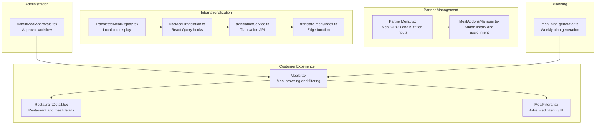
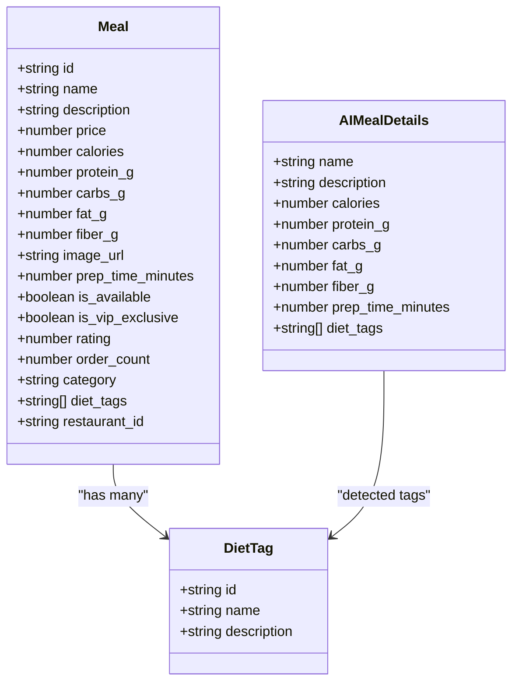
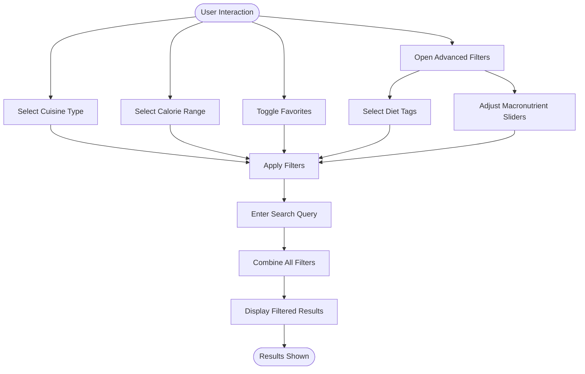
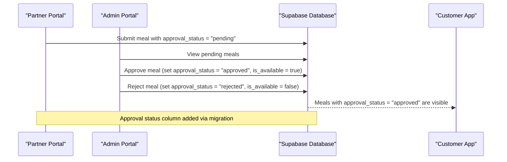
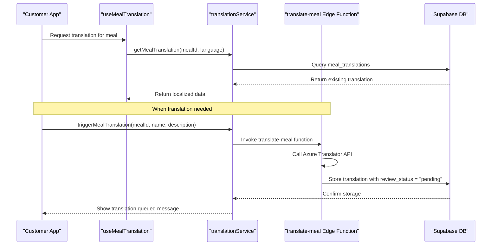
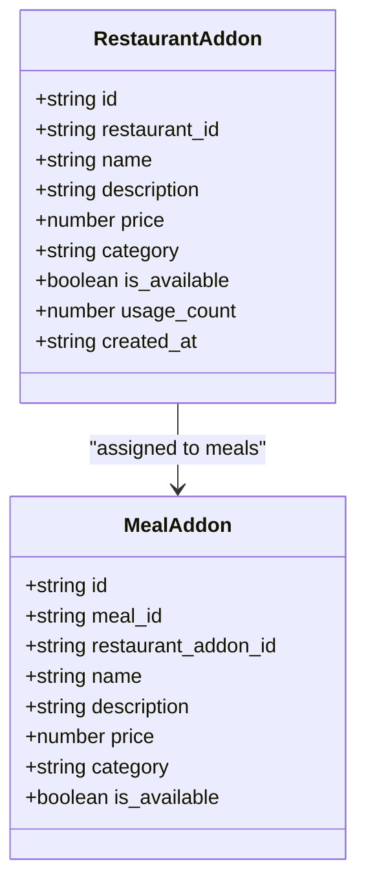
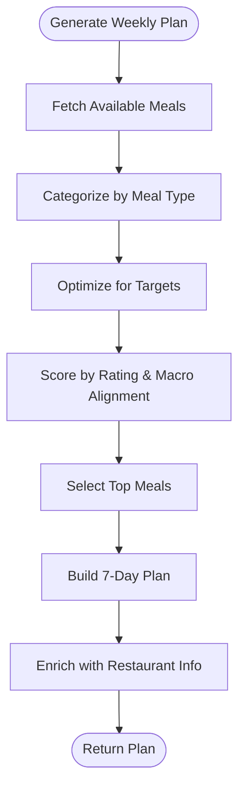
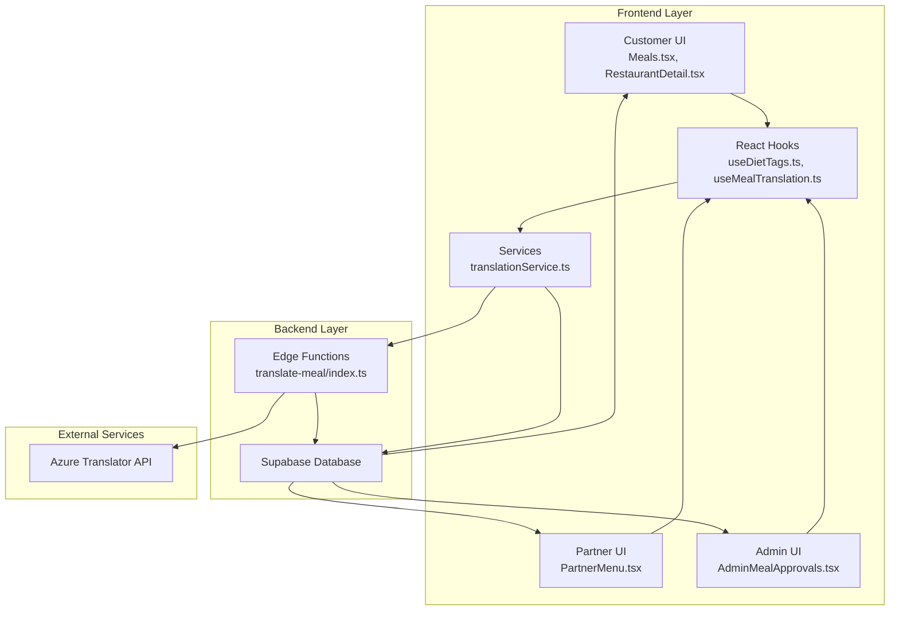
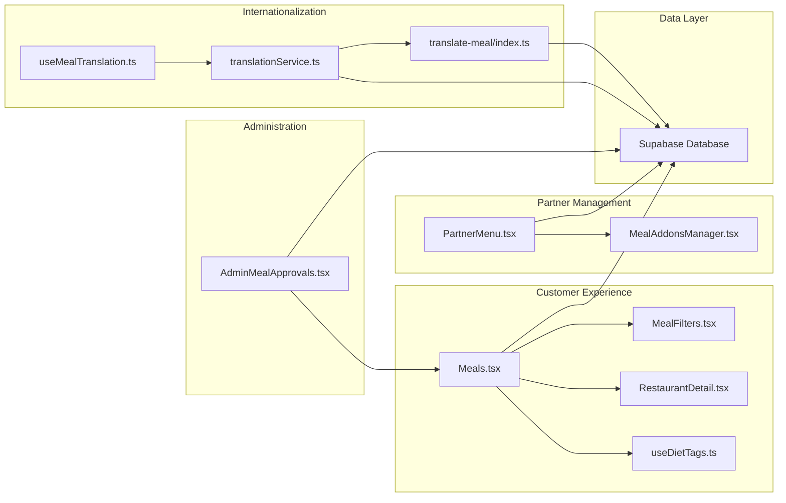

# Meal Catalog Management

<cite>
**Referenced Files in This Document**
- [Meals.tsx](file://src/pages/Meals.tsx)
- [MealFilters.tsx](file://src/components/MealFilters.tsx)
- [useDietTags.ts](file://src/hooks/useDietTags.ts)
- [PartnerMenu.tsx](file://src/pages/partner/PartnerMenu.tsx)
- [MealAddonsManager.tsx](file://src/components/MealAddonsManager.tsx)
- [AdminMealApprovals.tsx](file://src/pages/admin/AdminMealApprovals.tsx)
- [translationService.ts](file://src/services/translationService.ts)
- [useMealTranslation.ts](file://src/hooks/useMealTranslation.ts)
- [TranslatedMealDisplay.tsx](file://src/components/TranslatedMealDisplay.tsx)
- [translate-meal/index.ts](file://supabase/functions/translate-meal/index.ts)
- [meal-plan-generator.ts](file://src/lib/meal-plan-generator.ts)
- [20260313000000_add_meal_approval_status.sql](file://supabase/migrations/20260313000000_add_meal_approval_status.sql)
- [RestaurantDetail.tsx](file://src/pages/RestaurantDetail.tsx)
</cite>

## Table of Contents
1. [Introduction](#introduction)
2. [Project Structure](#project-structure)
3. [Core Components](#core-components)
4. [Architecture Overview](#architecture-overview)
5. [Detailed Component Analysis](#detailed-component-analysis)
6. [Dependency Analysis](#dependency-analysis)
7. [Performance Considerations](#performance-considerations)
8. [Troubleshooting Guide](#troubleshooting-guide)
9. [Conclusion](#conclusion)

## Introduction
This document provides comprehensive documentation for the meal catalog system, covering meal entity structure, filtering and search capabilities, approval workflow, internationalization through translation, addon customization, and scheduling for weekly meal plans. The system integrates frontend components, backend Supabase data access, and edge functions for translation services.

## Project Structure
The meal catalog system spans several key areas:
- Frontend pages for customer browsing and partner management
- Filtering and translation utilities
- Admin approval workflows
- Addon management for customization
- Weekly meal plan generation

**Diagram sources**
- [Meals.tsx:675-1195](file://src/pages/Meals.tsx#L675-L1195)
- [MealFilters.tsx:1-236](file://src/components/MealFilters.tsx#L1-L236)
- [PartnerMenu.tsx:166-1031](file://src/pages/partner/PartnerMenu.tsx#L166-L1031)
- [MealAddonsManager.tsx:1-756](file://src/components/MealAddonsManager.tsx#L1-L756)
- [AdminMealApprovals.tsx:74-582](file://src/pages/admin/AdminMealApprovals.tsx#L74-L582)
- [translationService.ts:132-354](file://src/services/translationService.ts#L132-L354)
- [useMealTranslation.ts:1-269](file://src/hooks/useMealTranslation.ts#L1-L269)
- [TranslatedMealDisplay.tsx:143-209](file://src/components/TranslatedMealDisplay.tsx#L143-L209)
- [translate-meal/index.ts:1-279](file://supabase/functions/translate-meal/index.ts#L1-L279)
- [meal-plan-generator.ts:64-164](file://src/lib/meal-plan-generator.ts#L64-L164)

**Section sources**
- [Meals.tsx:675-1195](file://src/pages/Meals.tsx#L675-L1195)
- [PartnerMenu.tsx:166-1031](file://src/pages/partner/PartnerMenu.tsx#L166-L1031)

## Core Components

### Meal Entity Structure
The meal entity encompasses nutritional information, preparation details, and metadata for display and filtering.

- **Nutritional Information**: calories, protein_g, carbs_g, fat_g, fiber_g
- **Preparation Details**: prep_time_minutes, category, rating, order_count
- **Pricing and Availability**: price, is_available, is_vip_exclusive
- **Dietary Tags**: diet_tags array for filtering and display
- **Relationships**: restaurant association via restaurant_id

**Diagram sources**
- [PartnerMenu.tsx:76-148](file://src/pages/partner/PartnerMenu.tsx#L76-L148)
- [PartnerMenu.tsx:103-130](file://src/pages/partner/PartnerMenu.tsx#L103-L130)

**Section sources**
- [PartnerMenu.tsx:76-148](file://src/pages/partner/PartnerMenu.tsx#L76-L148)

### Filtering and Search Functionality
The system provides multiple filtering dimensions:
- **Cuisine Types**: Health-focused categories with emoji-based selection
- **Calorie Ranges**: Predefined ranges (under 300, 300-500, 500-700, 700+)
- **Favorites**: Restaurant favorites toggle
- **Advanced Filters**: By diet tags and macronutrient sliders
- **Search**: Name and restaurant matching

**Diagram sources**
- [Meals.tsx:822-877](file://src/pages/Meals.tsx#L822-L877)
- [Meals.tsx:879-920](file://src/pages/Meals.tsx#L879-L920)
- [MealFilters.tsx:117-231](file://src/components/MealFilters.tsx#L117-L231)

**Section sources**
- [Meals.tsx:822-877](file://src/pages/Meals.tsx#L822-L877)
- [Meals.tsx:879-920](file://src/pages/Meals.tsx#L879-L920)
- [MealFilters.tsx:1-236](file://src/components/MealFilters.tsx#L1-L236)
- [useDietTags.ts:11-63](file://src/hooks/useDietTags.ts#L11-L63)

### Meal Approval Workflow
The approval system manages meal visibility with three states: pending, approved, and rejected. Admins review meals, particularly those above a threshold price, and approve or reject them.

**Diagram sources**
- [AdminMealApprovals.tsx:146-207](file://src/pages/admin/AdminMealApprovals.tsx#L146-L207)
- [20260313000000_add_meal_approval_status.sql:1-4](file://supabase/migrations/20260313000000_add_meal_approval_status.sql#L1-L4)

**Section sources**
- [AdminMealApprovals.tsx:74-582](file://src/pages/admin/AdminMealApprovals.tsx#L74-L582)
- [20260313000000_add_meal_approval_status.sql:1-4](file://supabase/migrations/20260313000000_add_meal_approval_status.sql#L1-L4)

### Internationalization and Translation System
The translation system supports Arabic localization with automatic translation triggers and manual review workflows.

**Diagram sources**
- [useMealTranslation.ts:63-77](file://src/hooks/useMealTranslation.ts#L63-L77)
- [translationService.ts:158-190](file://src/services/translationService.ts#L158-L190)
- [translate-meal/index.ts:155-262](file://supabase/functions/translate-meal/index.ts#L155-L262)

**Section sources**
- [useMealTranslation.ts:1-269](file://src/hooks/useMealTranslation.ts#L1-L269)
- [translationService.ts:132-354](file://src/services/translationService.ts#L132-L354)
- [TranslatedMealDisplay.tsx:143-209](file://src/components/TranslatedMealDisplay.tsx#L143-L209)
- [translate-meal/index.ts:1-279](file://supabase/functions/translate-meal/index.ts#L1-L279)

### Meal Addon System
Partners can create reusable add-ons and assign them to specific meals, enabling customization options.

**Diagram sources**
- [MealAddonsManager.tsx:49-72](file://src/components/MealAddonsManager.tsx#L49-L72)

**Section sources**
- [MealAddonsManager.tsx:1-756](file://src/components/MealAddonsManager.tsx#L1-L756)
- [PartnerMenu.tsx:1011-1028](file://src/pages/partner/PartnerMenu.tsx#L1011-L1028)

### Weekly Meal Planning System
The system generates optimized weekly meal plans based on user nutrition targets and available meals.

**Diagram sources**
- [meal-plan-generator.ts:64-164](file://src/lib/meal-plan-generator.ts#L64-L164)

**Section sources**
- [meal-plan-generator.ts:1-439](file://src/lib/meal-plan-generator.ts#L1-L439)

## Architecture Overview

**Diagram sources**
- [Meals.tsx:1-50](file://src/pages/Meals.tsx#L1-L50)
- [PartnerMenu.tsx:1-60](file://src/pages/partner/PartnerMenu.tsx#L1-L60)
- [AdminMealApprovals.tsx:1-40](file://src/pages/admin/AdminMealApprovals.tsx#L1-L40)
- [useDietTags.ts:1-15](file://src/hooks/useDietTags.ts#L1-L15)
- [useMealTranslation.ts:1-20](file://src/hooks/useMealTranslation.ts#L1-L20)
- [translationService.ts:1-30](file://src/services/translationService.ts#L1-L30)
- [translate-meal/index.ts:1-20](file://supabase/functions/translate-meal/index.ts#L1-L20)

## Detailed Component Analysis

### Customer Meal Browsing and Filtering
The customer experience centers around intuitive browsing with multiple filter dimensions and responsive layouts.

Key features:
- Cuisine type selection with emoji-based navigation
- Calorie range filtering with visual indicators
- Favorites management with guest login prompts
- Advanced filtering sheet for diet tags and macronutrients
- Responsive card layouts for restaurants and meals

**Section sources**
- [Meals.tsx:675-1195](file://src/pages/Meals.tsx#L675-L1195)
- [RestaurantDetail.tsx:747-778](file://src/pages/RestaurantDetail.tsx#L747-L778)

### Partner Meal Management
Partners can manage their menu items with comprehensive nutrition tracking and addon integration.

Core capabilities:
- Complete CRUD operations for meals
- Nutrition input validation and schema enforcement
- Preparation time and category management
- Approval status tracking during creation
- Addon library management with categorization
- Batch addon assignment to specific meals

**Section sources**
- [PartnerMenu.tsx:166-1031](file://src/pages/partner/PartnerMenu.tsx#L166-L1031)
- [MealAddonsManager.tsx:1-756](file://src/components/MealAddonsManager.tsx#L1-L756)

### Admin Approval Workflow
Administrators oversee meal submissions with comprehensive review capabilities.

Workflow highlights:
- Pending, approved, and rejected status management
- Price threshold filtering (above 50 QAR)
- Real-time statistics dashboard
- Detailed meal information with restaurant context
- Platform fee calculation and payout preview
- Bulk search and refresh capabilities

**Section sources**
- [AdminMealApprovals.tsx:74-582](file://src/pages/admin/AdminMealApprovals.tsx#L74-L582)

### Translation and Localization
The internationalization system provides seamless Arabic language support with automated and manual translation workflows.

Implementation details:
- Automatic translation triggers via edge functions
- Manual review and approval process
- React Query integration for caching and invalidation
- Language detection and fallback mechanisms
- Status tracking with review states

**Section sources**
- [translationService.ts:132-354](file://src/services/translationService.ts#L132-L354)
- [useMealTranslation.ts:1-269](file://src/hooks/useMealTranslation.ts#L1-L269)
- [TranslatedMealDisplay.tsx:143-209](file://src/components/TranslatedMealDisplay.tsx#L143-L209)
- [translate-meal/index.ts:1-279](file://supabase/functions/translate-meal/index.ts#L1-L279)

### Addon Management System
The addon system enables flexible meal customization through reusable components.

System architecture:
- Restaurant-level addon library
- Meal-specific addon assignments
- Category-based organization (premium ingredients, sides, extras, drinks)
- Usage tracking and template support
- Real-time synchronization and validation

**Section sources**
- [MealAddonsManager.tsx:1-756](file://src/components/MealAddonsManager.tsx#L1-L756)
- [PartnerMenu.tsx:1011-1028](file://src/pages/partner/PartnerMenu.tsx#L1011-L1028)

## Dependency Analysis

**Diagram sources**
- [Meals.tsx:1-50](file://src/pages/Meals.tsx#L1-L50)
- [PartnerMenu.tsx:1-60](file://src/pages/partner/PartnerMenu.tsx#L1-L60)
- [AdminMealApprovals.tsx:1-40](file://src/pages/admin/AdminMealApprovals.tsx#L1-L40)
- [useMealTranslation.ts:1-20](file://src/hooks/useMealTranslation.ts#L1-L20)
- [translationService.ts:1-30](file://src/services/translationService.ts#L1-L30)
- [translate-meal/index.ts:1-20](file://supabase/functions/translate-meal/index.ts#L1-L20)

**Section sources**
- [Meals.tsx:1-1195](file://src/pages/Meals.tsx#L1-L1195)
- [PartnerMenu.tsx:1-1031](file://src/pages/partner/PartnerMenu.tsx#L1-L1031)
- [AdminMealApprovals.tsx:1-582](file://src/pages/admin/AdminMealApprovals.tsx#L1-L582)

## Performance Considerations
- **Translation Caching**: React Query provides 10-minute cache for translations
- **Batch Operations**: Translation service supports batch translation requests
- **Image Loading**: Optimized image loading with fallback strategies and parallel loading
- **Filtering Optimization**: Memoized computations prevent unnecessary re-renders
- **Database Queries**: Efficient joins and indexing for meal and restaurant data

## Troubleshooting Guide

### Common Issues and Solutions

**Translation Failures**
- Verify Azure Translator API key configuration
- Check service role key permissions
- Monitor character translation limits
- Validate meal IDs and text content format

**Approval Workflow Issues**
- Confirm approval_status column exists in meals table
- Verify admin role permissions
- Check RLS policies for update operations
- Validate price threshold configurations

**Addon Management Problems**
- Ensure unique addon names within restaurant libraries
- Verify usage count triggers are functioning
- Check RPC function permissions for increment/decrement operations
- Validate meal-addon relationships

**Filtering Performance**
- Monitor filter computation complexity
- Consider debouncing search queries
- Optimize diet tag loading
- Review restaurant-meal relationship queries

**Section sources**
- [translate-meal/index.ts:41-46](file://supabase/functions/translate-meal/index.ts#L41-L46)
- [AdminMealApprovals.tsx:158-160](file://src/pages/admin/AdminMealApprovals.tsx#L158-L160)
- [MealAddonsManager.tsx:182-202](file://src/components/MealAddonsManager.tsx#L182-L202)

## Conclusion
The meal catalog system provides a comprehensive foundation for managing restaurant menus, enabling personalized customer experiences through advanced filtering, supporting partner workflows with nutrition tracking and addon customization, and facilitating administrative oversight through approval processes. The internationalization framework ensures global accessibility, while the planning system supports long-term customer engagement. The modular architecture promotes maintainability and extensibility for future enhancements.