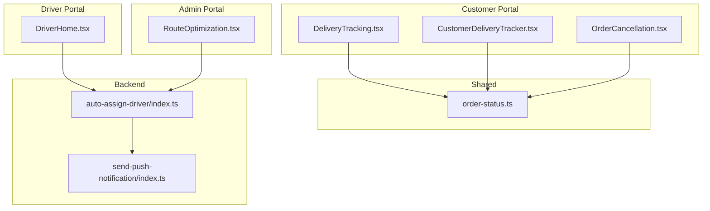
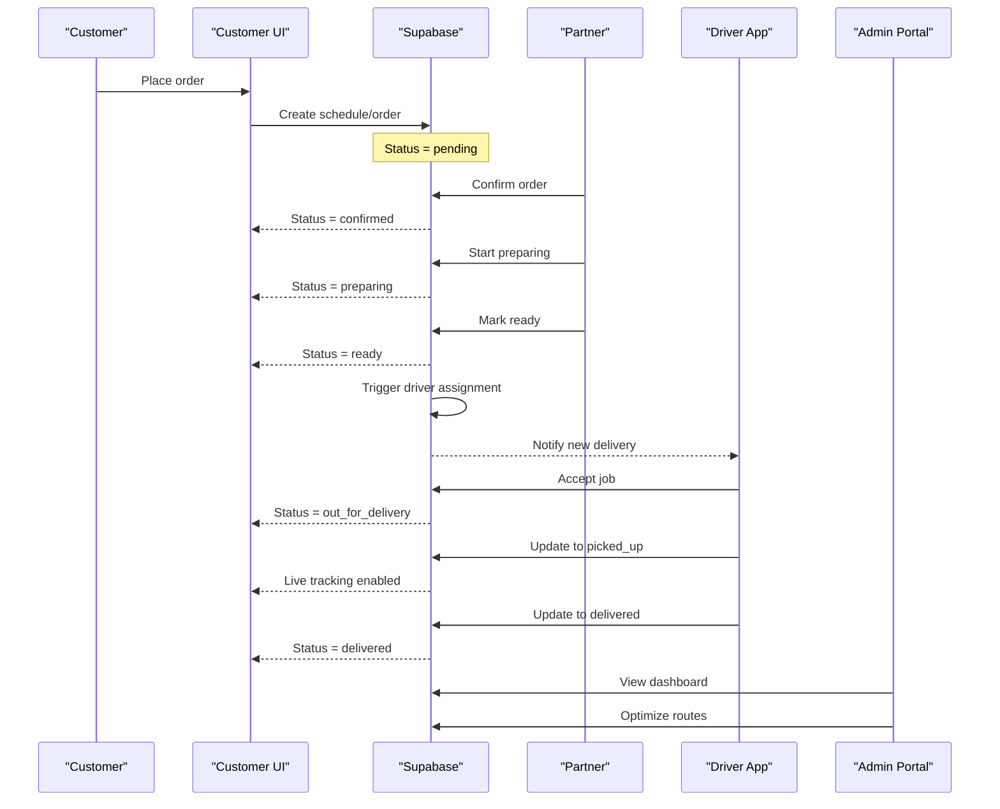
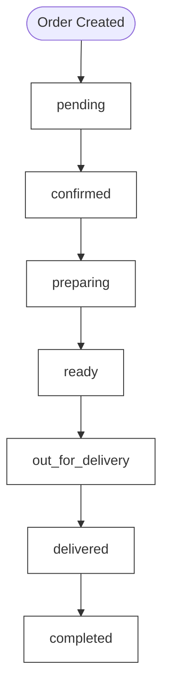
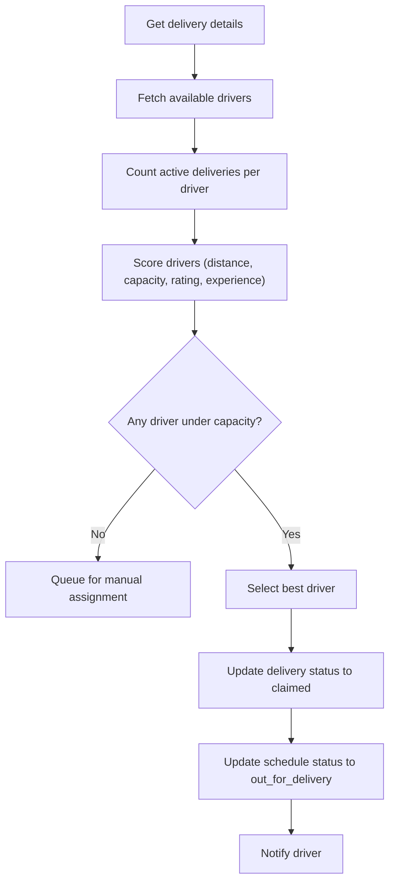
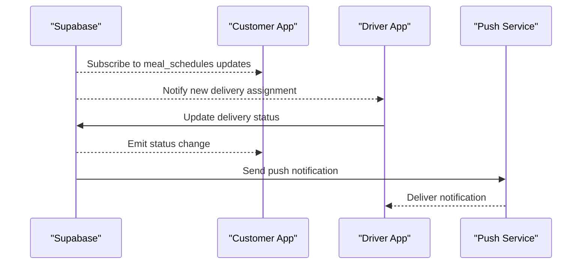
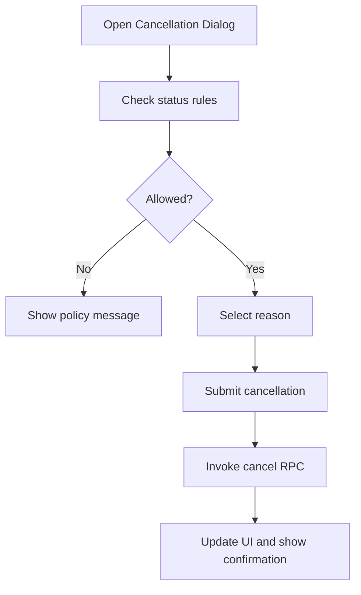
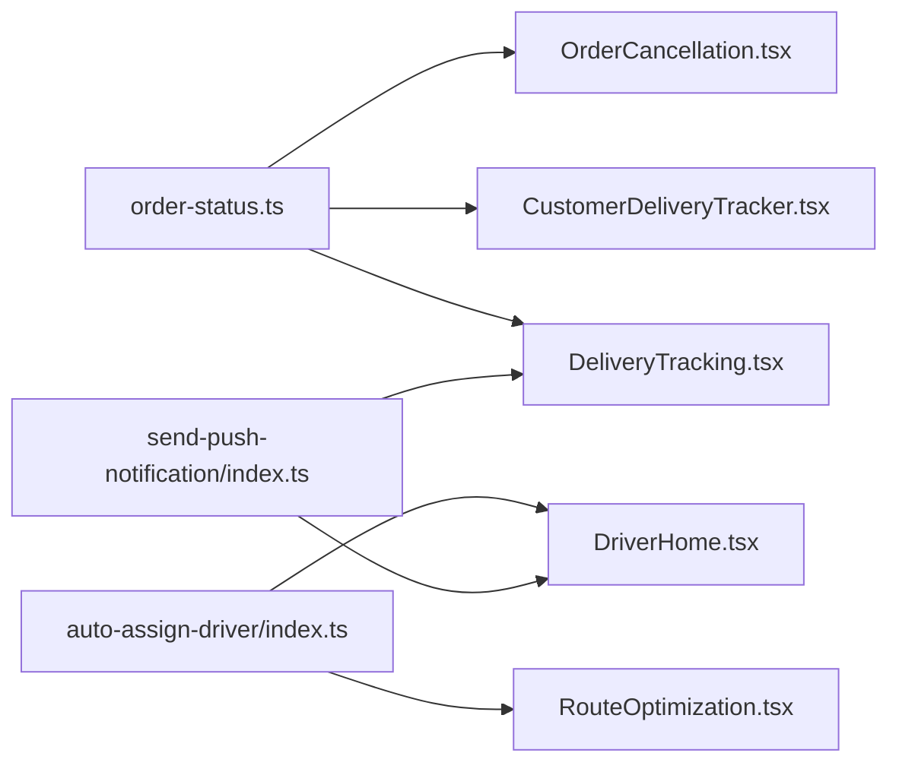

# Order & Delivery Workflow

<cite>
**Referenced Files in This Document**
- [order-status.ts](file://src/lib/constants/order-status.ts)
- [order-status.test.ts](file://src/lib/constants/order-status.test.ts)
- [Order-Workflow-Proposal.md](file://docs/Order-Workflow-Proposal.md)
- [delivery_analysis.md](file://delivery_analysis.md)
- [delivery_system_design.md](file://delivery_system_design.md)
- [delivery_system_visual.md](file://delivery_system_visual.md)
- [delivery_implementation_plan.md](file://delivery_implementation_plan.md)
- [implementation-plan-customer-portal.md](file://docs/implementation-plan-customer-portal.md)
- [auto-assign-driver/index.ts](file://supabase/functions/auto-assign-driver/index.ts)
- [send-push-notification/index.ts](file://supabase/functions/send-push-notification/index.ts)
- [push.ts](file://src/lib/notifications/push.ts)
- [NotificationPreferences.tsx](file://src/components/NotificationPreferences.tsx)
- [DeliveryTracking.tsx](file://src/pages/DeliveryTracking.tsx)
- [CustomerDeliveryTracker.tsx](file://src/components/customer/CustomerDeliveryTracker.tsx)
- [RouteOptimization.tsx](file://src/fleet/pages/RouteOptimization.tsx)
- [DriverHome.tsx](file://src/pages/driver/DriverHome.tsx)
- [OrderCancellation.tsx](file://src/components/OrderCancellation.tsx)
- [OrderTrackingHub.test.tsx](file://src/components/OrderTrackingHub.test.tsx)
- [IMPLEMENTATION_SUMMARY.md](file://docs/IMPLEMENTATION_SUMMARY.md)
</cite>

## Table of Contents
1. [Introduction](#introduction)
2. [Project Structure](#project-structure)
3. [Core Components](#core-components)
4. [Architecture Overview](#architecture-overview)
5. [Detailed Component Analysis](#detailed-component-analysis)
6. [Dependency Analysis](#dependency-analysis)
7. [Performance Considerations](#performance-considerations)
8. [Troubleshooting Guide](#troubleshooting-guide)
9. [Conclusion](#conclusion)
10. [Appendices](#appendices)

## Introduction
This document describes the order management and delivery workflow system across all four portals: customer, partner (restaurant), driver, and admin. It explains the order lifecycle from cart creation through delivery completion, the status tracking system, payment processing integration, order fulfillment coordination, driver assignment and route optimization, real-time delivery tracking, order modification and cancellation workflows, and the integration with the driver portal and customer notification system.

## Project Structure
The order and delivery workflow spans frontend components, backend Supabase Edge Functions, and portal-specific pages:
- Shared order status constants and helpers define the canonical status model used across the system.
- Supabase Edge Functions implement driver assignment and notifications.
- Customer, driver, and admin portals expose dedicated pages and components for order tracking, driver jobs, and fleet management.
- Real-time updates leverage Supabase Postgres changes and push notifications.

**Diagram sources**
- [DeliveryTracking.tsx:1-592](file://src/pages/DeliveryTracking.tsx#L1-L592)
- [CustomerDeliveryTracker.tsx:508-521](file://src/components/customer/CustomerDeliveryTracker.tsx#L508-L521)
- [OrderCancellation.tsx:1232-1385](file://src/components/OrderCancellation.tsx#L1232-L1385)
- [DriverHome.tsx:1-43](file://src/pages/driver/DriverHome.tsx#L1-L43)
- [RouteOptimization.tsx:333-362](file://src/fleet/pages/RouteOptimization.tsx#L333-L362)
- [order-status.ts:1-116](file://src/lib/constants/order-status.ts#L1-L116)
- [auto-assign-driver/index.ts:1-340](file://supabase/functions/auto-assign-driver/index.ts#L1-L340)
- [send-push-notification/index.ts:206-299](file://supabase/functions/send-push-notification/index.ts#L206-L299)

**Section sources**
- [order-status.ts:1-116](file://src/lib/constants/order-status.ts#L1-L116)
- [delivery_analysis.md:1-670](file://delivery_analysis.md#L1-L670)
- [delivery_system_design.md:76-293](file://delivery_system_design.md#L76-L293)

## Core Components
- Order status model and helpers: Defines canonical statuses, timeline progression, and estimated time helpers used by all portals.
- Driver assignment algorithm: Implemented as a Supabase Edge Function that selects the best available driver based on proximity, capacity, rating, and experience.
- Real-time tracking and notifications: Customer and driver dashboards receive live updates via Supabase Postgres changes and push notifications.
- Cancellation and modification workflows: Customer-facing cancellation dialog enforces policy rules and triggers backend RPCs.

**Section sources**
- [order-status.ts:1-116](file://src/lib/constants/order-status.ts#L1-L116)
- [order-status.test.ts:1-249](file://src/lib/constants/order-status.test.ts#L1-L249)
- [auto-assign-driver/index.ts:130-287](file://supabase/functions/auto-assign-driver/index.ts#L130-L287)
- [OrderCancellation.tsx:1232-1385](file://src/components/OrderCancellation.tsx#L1232-L1385)

## Architecture Overview
The system integrates four portals around a shared order lifecycle and a driver assignment pipeline:

**Diagram sources**
- [delivery_analysis.md:570-670](file://delivery_analysis.md#L570-L670)
- [Order-Workflow-Proposal.md:65-103](file://docs/Order-Workflow-Proposal.md#L65-L103)
- [auto-assign-driver/index.ts:130-287](file://supabase/functions/auto-assign-driver/index.ts#L130-L287)

## Detailed Component Analysis

### Order Lifecycle and Status Tracking
- Canonical statuses: pending, confirmed, preparing, ready, out_for_delivery, delivered, cancelled.
- Timeline progression excludes cancelled from the customer-visible timeline.
- Estimated time helpers provide contextual ETAs for active statuses.

**Diagram sources**
- [Order-Workflow-Proposal.md:65-103](file://docs/Order-Workflow-Proposal.md#L65-L103)
- [order-status.ts:75-115](file://src/lib/constants/order-status.ts#L75-L115)

**Section sources**
- [order-status.ts:1-116](file://src/lib/constants/order-status.ts#L1-L116)
- [order-status.test.ts:110-133](file://src/lib/constants/order-status.test.ts#L110-L133)

### Driver Assignment Algorithm
- Filters online, approved drivers and checks active deliveries against capacity.
- Scores drivers by distance (Haversine), capacity, rating, and experience.
- Updates delivery and schedule statuses upon assignment and notifies the driver.

**Diagram sources**
- [auto-assign-driver/index.ts:130-287](file://supabase/functions/auto-assign-driver/index.ts#L130-L287)

**Section sources**
- [auto-assign-driver/index.ts:51-97](file://supabase/functions/auto-assign-driver/index.ts#L51-L97)
- [auto-assign-driver/index.ts:186-287](file://supabase/functions/auto-assign-driver/index.ts#L186-L287)

### Real-time Delivery Tracking and Notifications
- Customer tracking page subscribes to Supabase Postgres changes for order status updates and displays live driver location and ETA.
- Push notifications are sent via Supabase Edge Functions to user devices; fallback stores notifications in the database when tokens are inactive.

**Diagram sources**
- [DeliveryTracking.tsx:257-275](file://src/pages/DeliveryTracking.tsx#L257-L275)
- [send-push-notification/index.ts:206-299](file://supabase/functions/send-push-notification/index.ts#L206-L299)
- [push.ts:1-44](file://src/lib/notifications/push.ts#L1-L44)

**Section sources**
- [DeliveryTracking.tsx:1-592](file://src/pages/DeliveryTracking.tsx#L1-L592)
- [send-push-notification/index.ts:206-299](file://supabase/functions/send-push-notification/index.ts#L206-L299)
- [push.ts:1-44](file://src/lib/notifications/push.ts#L1-L44)

### Order Modification and Cancellation Workflows
- Cancellation dialog enforces policy rules by status (e.g., partial refund for preparing, no cancellation after ready).
- Triggers backend RPCs to cancel schedules/orders and updates UI accordingly.

**Diagram sources**
- [OrderCancellation.tsx:1232-1385](file://src/components/OrderCancellation.tsx#L1232-L1385)

**Section sources**
- [OrderCancellation.tsx:1232-1385](file://src/components/OrderCancellation.tsx#L1232-L1385)

### Driver Portal Integration
- Driver home page fetches current job and recent job history, enabling acceptance and status updates.
- Integration points include job retrieval, status transitions, and driver availability.

**Section sources**
- [DriverHome.tsx:1-43](file://src/pages/driver/DriverHome.tsx#L1-L43)

### Route Optimization and Admin Dashboard
- Admin route optimization page supports assigning optimized sequences and batch operations.
- Provides visibility into driver assignments and enables manual reassignment.

**Section sources**
- [RouteOptimization.tsx:333-362](file://src/fleet/pages/RouteOptimization.tsx#L333-L362)

## Dependency Analysis
The system exhibits clear separation of concerns:
- Frontend depends on shared order status constants and Supabase client for real-time subscriptions.
- Backend depends on Supabase Edge Functions for driver assignment and notifications.
- Driver and admin portals depend on backend functions and shared status model.

**Diagram sources**
- [order-status.ts:1-116](file://src/lib/constants/order-status.ts#L1-L116)
- [DeliveryTracking.tsx:1-592](file://src/pages/DeliveryTracking.tsx#L1-L592)
- [CustomerDeliveryTracker.tsx:508-521](file://src/components/customer/CustomerDeliveryTracker.tsx#L508-L521)
- [OrderCancellation.tsx:1232-1385](file://src/components/OrderCancellation.tsx#L1232-L1385)
- [auto-assign-driver/index.ts:1-340](file://supabase/functions/auto-assign-driver/index.ts#L1-L340)
- [send-push-notification/index.ts:206-299](file://supabase/functions/send-push-notification/index.ts#L206-L299)
- [DriverHome.tsx:1-43](file://src/pages/driver/DriverHome.tsx#L1-L43)
- [RouteOptimization.tsx:333-362](file://src/fleet/pages/RouteOptimization.tsx#L333-L362)

**Section sources**
- [IMPLEMENTATION_SUMMARY.md:100-159](file://docs/IMPLEMENTATION_SUMMARY.md#L100-L159)

## Performance Considerations
- Driver assignment scoring balances proximity and capacity to minimize travel time while respecting driver limits.
- Real-time updates use efficient Postgres changes channels and push notifications to reduce polling overhead.
- Estimated ETAs are calculated with lightweight distance metrics and can be augmented with external routing APIs when available.

[No sources needed since this section provides general guidance]

## Troubleshooting Guide
Common issues and resolutions:
- No drivers available: Assignment function queues the job and adds a note; admins can manually assign later.
- Driver capacity reached: Jobs remain pending until capacity frees; scoring prioritizes drivers with fewer active deliveries.
- Push notifications not received: Function falls back to storing notifications in the database; verify active tokens and permissions.

**Section sources**
- [auto-assign-driver/index.ts:197-251](file://supabase/functions/auto-assign-driver/index.ts#L197-L251)
- [send-push-notification/index.ts:224-239](file://supabase/functions/send-push-notification/index.ts#L224-L239)

## Conclusion
The order and delivery workflow integrates customer, partner, driver, and admin experiences around a shared status model and automated driver assignment. Real-time tracking and notifications keep all stakeholders informed, while cancellation and modification controls enforce business policies. The architecture supports scalability and extensibility for future enhancements.

[No sources needed since this section summarizes without analyzing specific files]

## Appendices

### Order Status Reference
- pending: Order placed by customer.
- confirmed: Partner accepted the order.
- preparing: Partner is preparing the meal.
- ready: Meal is ready for pickup/delivery.
- out_for_delivery: Driver is on the way.
- delivered: Driver confirmed delivery.
- completed: Auto-completion after delivery.
- cancelled: Order was cancelled.

**Section sources**
- [order-status.ts:1-116](file://src/lib/constants/order-status.ts#L1-L116)
- [Order-Workflow-Proposal.md:65-103](file://docs/Order-Workflow-Proposal.md#L65-L103)