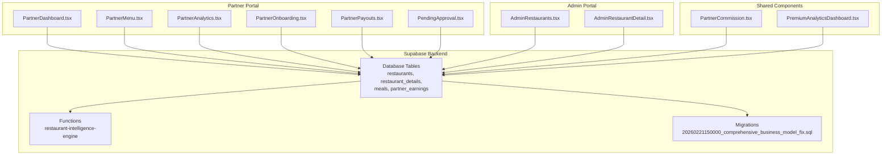
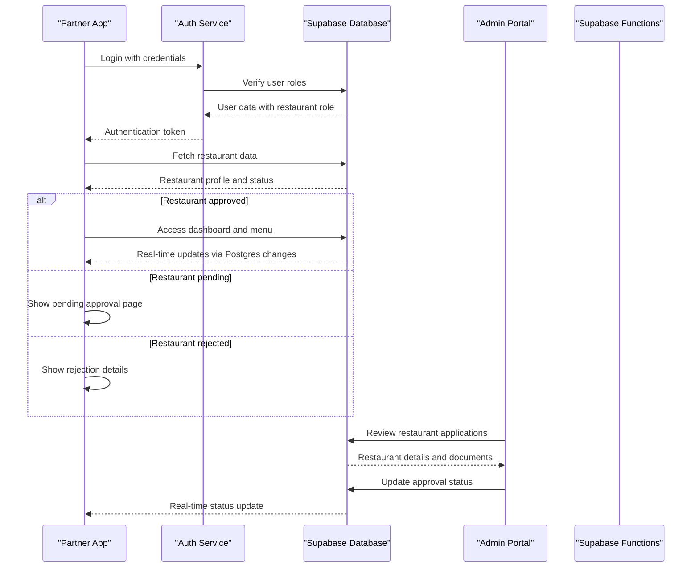
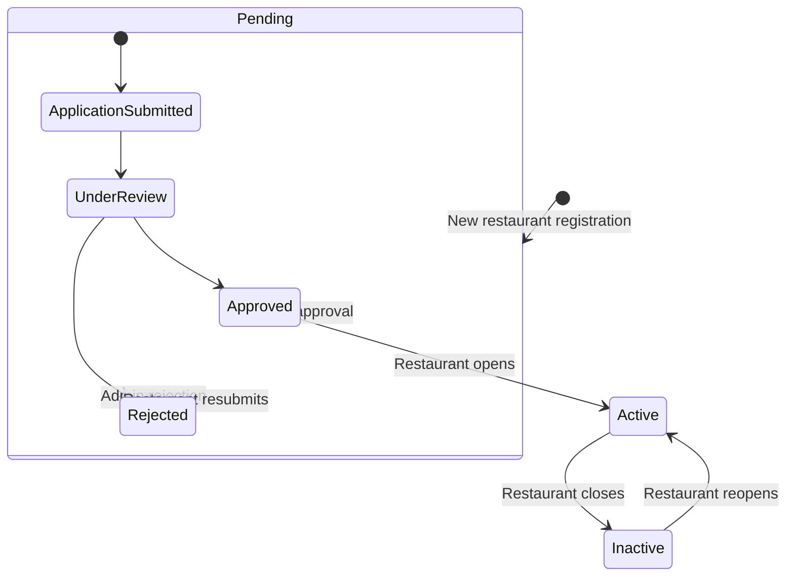
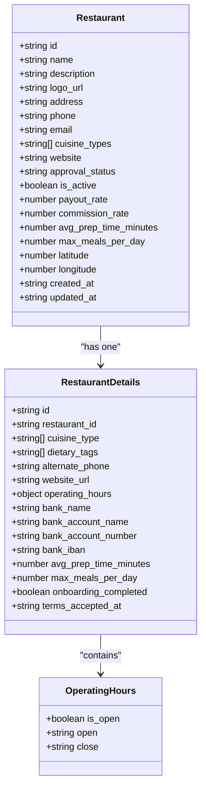
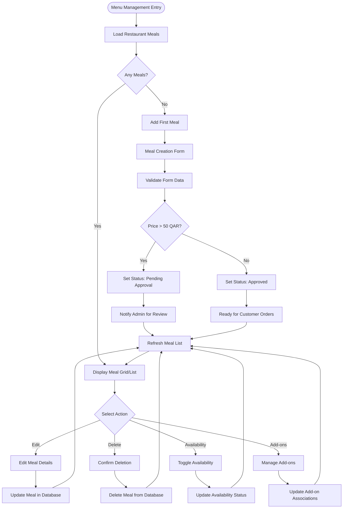
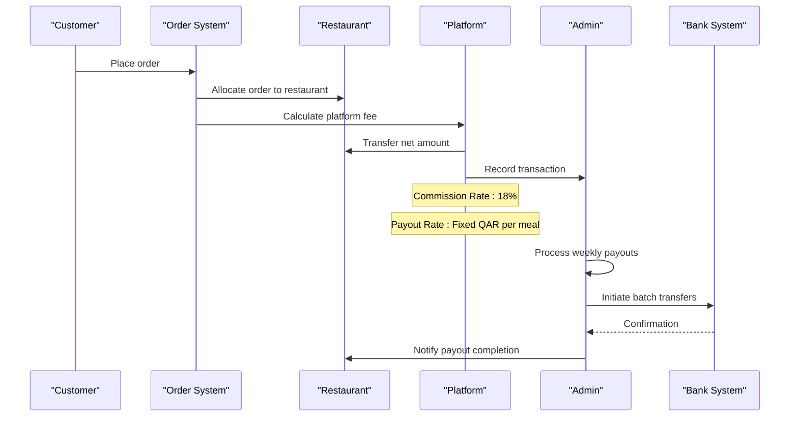
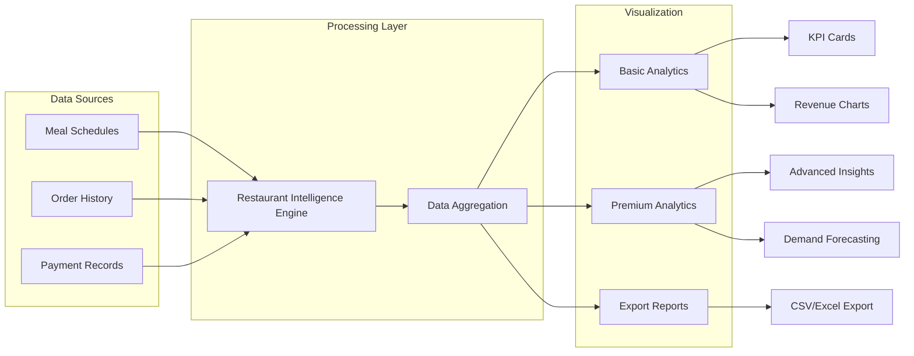
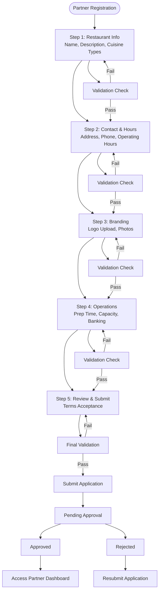
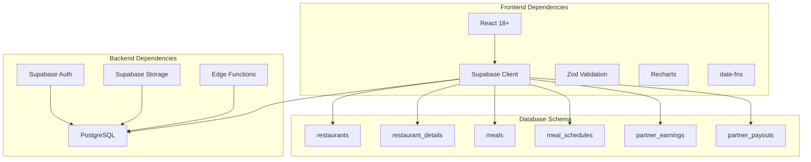

# Restaurant Partner System

<cite>
**Referenced Files in This Document**
- [PartnerDashboard.tsx](file://src/pages/partner/PartnerDashboard.tsx)
- [PartnerMenu.tsx](file://src/pages/partner/PartnerMenu.tsx)
- [PartnerAnalytics.tsx](file://src/pages/partner/PartnerAnalytics.tsx)
- [PartnerOnboarding.tsx](file://src/pages/partner/PartnerOnboarding.tsx)
- [PartnerPayouts.tsx](file://src/pages/partner/PartnerPayouts.tsx)
- [PendingApproval.tsx](file://src/pages/partner/PendingApproval.tsx)
- [AdminRestaurants.tsx](file://src/pages/admin/AdminRestaurants.tsx)
- [AdminRestaurantDetail.tsx](file://src/pages/admin/AdminRestaurantDetail.tsx)
- [PartnerCommission.tsx](file://src/components/partner/PartnerCommission.tsx)
- [PremiumAnalyticsDashboard.tsx](file://src/components/PremiumAnalyticsDashboard.tsx)
- [20260221150000_comprehensive_business_model_fix.sql](file://supabase/migrations/20260221150000_comprehensive_business_model_fix.sql)
- [restaurant-intelligence-engine/index.ts](file://supabase/functions/restaurant-intelligence-engine/index.ts)
- [PRODUCTION_HARDENING_IMPLEMENTATION.md](file://PRODUCTION_HARDENING_IMPLEMENTATION.md)
</cite>

## Table of Contents
1. [Introduction](#introduction)
2. [Project Structure](#project-structure)
3. [Core Components](#core-components)
4. [Architecture Overview](#architecture-overview)
5. [Detailed Component Analysis](#detailed-component-analysis)
6. [Dependency Analysis](#dependency-analysis)
7. [Performance Considerations](#performance-considerations)
8. [Troubleshooting Guide](#troubleshooting-guide)
9. [Conclusion](#conclusion)

## Introduction
This document provides comprehensive documentation for the restaurant partner management system. It covers the restaurant approval workflow (pending, approved, rejected states), restaurant profile management (business information, location data, operational hours), commission structure and payment processing, menu management (meal creation, pricing, availability, add-ons), analytics dashboard (order volume, revenue, performance metrics), and partner onboarding process with verification requirements and delivery system integration.

## Project Structure
The restaurant partner system is built as a React-based web application with Supabase backend services. Key components include:
- Partner portal pages for dashboard, menu management, analytics, onboarding, and payouts
- Admin portal for restaurant approval and management
- Supabase database with restaurant-related tables and functions
- Real-time data synchronization via Supabase Postgres changes

**Diagram sources**
- [PartnerDashboard.tsx:1-687](file://src/pages/partner/PartnerDashboard.tsx#L1-687)
- [PartnerMenu.tsx:1-1031](file://src/pages/partner/PartnerMenu.tsx#L1-1031)
- [PartnerAnalytics.tsx:1-436](file://src/pages/partner/PartnerAnalytics.tsx#L1-436)
- [PartnerOnboarding.tsx:1-927](file://src/pages/partner/PartnerOnboarding.tsx#L1-927)
- [PartnerPayouts.tsx:1-985](file://src/pages/partner/PartnerPayouts.tsx#L1-985)
- [PendingApproval.tsx:1-270](file://src/pages/partner/PendingApproval.tsx#L1-270)
- [AdminRestaurants.tsx:1-1137](file://src/pages/admin/AdminRestaurants.tsx#L1-1137)
- [AdminRestaurantDetail.tsx:1-2503](file://src/pages/admin/AdminRestaurantDetail.tsx#L1-2503)
- [PartnerCommission.tsx:1-260](file://src/components/partner/PartnerCommission.tsx#L1-260)
- [PremiumAnalyticsDashboard.tsx:141-740](file://src/components/PremiumAnalyticsDashboard.tsx#L141-740)
- [20260221150000_comprehensive_business_model_fix.sql:60-88](file://supabase/migrations/20260221150000_comprehensive_business_model_fix.sql#L60-L88)
- [restaurant-intelligence-engine/index.ts:41-384](file://supabase/functions/restaurant-intelligence-engine/index.ts#L41-L384)

**Section sources**
- [PartnerDashboard.tsx:1-687](file://src/pages/partner/PartnerDashboard.tsx#L1-687)
- [PartnerMenu.tsx:1-1031](file://src/pages/partner/PartnerMenu.tsx#L1-1031)
- [PartnerAnalytics.tsx:1-436](file://src/pages/partner/PartnerAnalytics.tsx#L1-436)
- [PartnerOnboarding.tsx:1-927](file://src/pages/partner/PartnerOnboarding.tsx#L1-927)
- [PartnerPayouts.tsx:1-985](file://src/pages/partner/PartnerPayouts.tsx#L1-985)
- [PendingApproval.tsx:1-270](file://src/pages/partner/PendingApproval.tsx#L1-270)
- [AdminRestaurants.tsx:1-1137](file://src/pages/admin/AdminRestaurants.tsx#L1-1137)
- [AdminRestaurantDetail.tsx:1-2503](file://src/pages/admin/AdminRestaurantDetail.tsx#L1-2503)
- [PartnerCommission.tsx:1-260](file://src/components/partner/PartnerCommission.tsx#L1-260)
- [PremiumAnalyticsDashboard.tsx:141-740](file://src/components/PremiumAnalyticsDashboard.tsx#L141-740)
- [20260221150000_comprehensive_business_model_fix.sql:60-88](file://supabase/migrations/20260221150000_comprehensive_business_model_fix.sql#L60-L88)
- [restaurant-intelligence-engine/index.ts:41-384](file://supabase/functions/restaurant-intelligence-engine/index.ts#L41-L384)

## Core Components
The system consists of several core components that work together to manage restaurant partners:

### Restaurant Approval Workflow
The approval system manages three states: pending, approved, and rejected. Partners submit applications during onboarding, which are then reviewed by administrators.

### Restaurant Profile Management
Restaurant profiles include business information, location data, and operational hours. The system supports comprehensive profile management with real-time updates.

### Menu Management System
The menu system allows restaurants to create, edit, and manage their offerings with pricing, nutritional information, and availability controls.

### Commission and Payment Processing
The system calculates platform commissions and processes payouts according to predefined rates and schedules.

### Analytics Dashboard
Partners can track their performance through comprehensive analytics including order volume, revenue, and customer metrics.

**Section sources**
- [PRODUCTION_HARDENING_IMPLEMENTATION.md:250-300](file://PRODUCTION_HARDENING_IMPLEMENTATION.md#L250-L300)
- [PartnerOnboarding.tsx:125-385](file://src/pages/partner/PartnerOnboarding.tsx#L125-L385)
- [AdminRestaurants.tsx:91-179](file://src/pages/admin/AdminRestaurants.tsx#L91-L179)

## Architecture Overview
The restaurant partner system follows a client-server architecture with real-time capabilities:

**Diagram sources**
- [PartnerDashboard.tsx:88-117](file://src/pages/partner/PartnerDashboard.tsx#L88-L117)
- [PendingApproval.tsx:36-80](file://src/pages/partner/PendingApproval.tsx#L36-L80)
- [AdminRestaurants.tsx:175-200](file://src/pages/admin/AdminRestaurants.tsx#L175-L200)

The architecture leverages Supabase for:
- Real-time database synchronization
- Authentication and authorization
- Storage for media assets
- Serverless functions for business logic

## Detailed Component Analysis

### Restaurant Approval Workflow
The approval workflow ensures proper verification and onboarding of restaurant partners:

**Diagram sources**
- [PRODUCTION_HARDENING_IMPLEMENTATION.md:250-281](file://PRODUCTION_HARDENING_IMPLEMENTATION.md#L250-L281)
- [PendingApproval.tsx:87-111](file://src/pages/partner/PendingApproval.tsx#L87-L111)

Key approval features include:
- Automatic status assignment during registration
- Real-time status updates via Supabase channels
- Administrative approval interface with rejection reasons
- User-friendly pending approval page with timeline information

**Section sources**
- [PRODUCTION_HARDENING_IMPLEMENTATION.md:250-300](file://PRODUCTION_HARDENING_IMPLEMENTATION.md#L250-L300)
- [PendingApproval.tsx:23-80](file://src/pages/partner/PendingApproval.tsx#L23-L80)
- [AdminRestaurants.tsx:175-200](file://src/pages/admin/AdminRestaurants.tsx#L175-L200)

### Restaurant Profile Management
Restaurant profiles encompass comprehensive business information and operational details:

**Diagram sources**
- [20260221150000_comprehensive_business_model_fix.sql:60-88](file://supabase/migrations/20260221150000_comprehensive_business_model_fix.sql#L60-L88)
- [PartnerOnboarding.tsx:75-105](file://src/pages/partner/PartnerOnboarding.tsx#L75-L105)

Profile management features include:
- Multi-step onboarding process with progress tracking
- Comprehensive business information capture
- Location data with geolocation support
- Operational hours configuration with time slots
- Media asset management for logos and photos
- Banking information for payout processing

**Section sources**
- [20260221150000_comprehensive_business_model_fix.sql:60-88](file://supabase/migrations/20260221150000_comprehensive_business_model_fix.sql#L60-L88)
- [PartnerOnboarding.tsx:125-385](file://src/pages/partner/PartnerOnboarding.tsx#L125-L385)

### Menu Management System
The menu management system provides comprehensive control over restaurant offerings:

**Diagram sources**
- [PartnerMenu.tsx:249-300](file://src/pages/partner/PartnerMenu.tsx#L249-L300)
- [PartnerMenu.tsx:465-527](file://src/pages/partner/PartnerMenu.tsx#L465-L527)

Menu management capabilities include:
- Meal creation with comprehensive details (name, description, pricing, nutrition)
- Real-time approval workflow for high-value items
- Availability management with automatic status updates
- Add-on system for customizable meal options
- Image upload and AI-powered meal analysis
- Dietary tag management for special diets
- Category organization and sorting

**Section sources**
- [PartnerMenu.tsx:166-527](file://src/pages/partner/PartnerMenu.tsx#L166-L527)

### Commission Structure and Payment Processing
The commission system calculates platform fees and processes restaurant payouts:

**Diagram sources**
- [PartnerPayouts.tsx:311-361](file://src/pages/partner/PartnerPayouts.tsx#L311-L361)
- [PartnerCommission.tsx:15-38](file://src/components/partner/PartnerCommission.tsx#L15-L38)

Payment processing features include:
- Dynamic commission rate calculation (variable per restaurant)
- Automated payout scheduling (weekly, bi-weekly, monthly)
- Real-time earnings tracking with detailed breakdowns
- CSV export functionality for accounting
- Bank account management with multiple payout methods
- Pending payout management and status tracking

**Section sources**
- [PartnerPayouts.tsx:227-415](file://src/pages/partner/PartnerPayouts.tsx#L227-L415)
- [PartnerCommission.tsx:1-260](file://src/components/partner/PartnerCommission.tsx#L1-L260)

### Analytics Dashboard
The analytics system provides comprehensive performance insights:

**Diagram sources**
- [PartnerAnalytics.tsx:76-191](file://src/pages/partner/PartnerAnalytics.tsx#L76-L191)
- [PremiumAnalyticsDashboard.tsx:141-740](file://src/components/PremiumAnalyticsDashboard.tsx#L141-L740)
- [restaurant-intelligence-engine/index.ts:77-384](file://supabase/functions/restaurant-intelligence-engine/index.ts#L77-L384)

Analytics capabilities include:
- Real-time order volume tracking
- Revenue and earnings calculations
- Customer segmentation and retention metrics
- Menu performance analysis
- Capacity utilization monitoring
- Predictive demand forecasting
- Premium analytics with advanced insights

**Section sources**
- [PartnerAnalytics.tsx:51-191](file://src/pages/partner/PartnerAnalytics.tsx#L51-L191)
- [PremiumAnalyticsDashboard.tsx:141-740](file://src/components/PremiumAnalyticsDashboard.tsx#L141-L740)
- [restaurant-intelligence-engine/index.ts:41-384](file://supabase/functions/restaurant-intelligence-engine/index.ts#L41-L384)

### Partner Onboarding Process
The onboarding system streamlines restaurant registration and verification:

**Diagram sources**
- [PartnerOnboarding.tsx:107-124](file://src/pages/partner/PartnerOnboarding.tsx#L107-L124)
- [PartnerOnboarding.tsx:263-385](file://src/pages/partner/PartnerOnboarding.tsx#L263-L385)

Onboarding features include:
- Multi-step wizard with progress tracking
- Real-time validation and error feedback
- File upload capabilities with size limits
- Automated approval workflow initiation
- Terms and conditions acceptance
- Integration with delivery system requirements

**Section sources**
- [PartnerOnboarding.tsx:125-385](file://src/pages/partner/PartnerOnboarding.tsx#L125-L385)

## Dependency Analysis
The restaurant partner system exhibits strong modular architecture with clear separation of concerns:

**Diagram sources**
- [PartnerDashboard.tsx:32-36](file://src/pages/partner/PartnerDashboard.tsx#L32-L36)
- [PartnerMenu.tsx:54-58](file://src/pages/partner/PartnerMenu.tsx#L54-L58)
- [20260221150000_comprehensive_business_model_fix.sql:60-88](file://supabase/migrations/20260221150000_comprehensive_business_model_fix.sql#L60-L88)

Key dependencies and their roles:
- **Supabase Client**: Provides authentication, database access, and real-time capabilities
- **Zod Validation**: Ensures data integrity for form submissions and API calls
- **Recharts**: Enables sophisticated data visualization for analytics
- **date-fns**: Handles date manipulation and formatting
- **PostgreSQL**: Central database storing all restaurant and order data
- **Edge Functions**: Serverless functions for business logic and data processing

**Section sources**
- [PartnerDashboard.tsx:1-687](file://src/pages/partner/PartnerDashboard.tsx#L1-L687)
- [PartnerMenu.tsx:1-1031](file://src/pages/partner/PartnerMenu.tsx#L1-L1031)
- [20260221150000_comprehensive_business_model_fix.sql:60-88](file://supabase/migrations/20260221150000_comprehensive_business_model_fix.sql#L60-L88)

## Performance Considerations
The system incorporates several performance optimization strategies:

### Real-time Data Synchronization
- Uses Supabase Postgres changes for instant UI updates
- Implements efficient polling intervals for non-critical data
- Leverages caching for frequently accessed configuration data

### Database Optimization
- Creates indexes on frequently queried columns (approval_status, restaurant_id)
- Uses JSONB for flexible operating hours storage
- Implements partitioning strategies for large datasets

### Frontend Performance
- Lazy loading for heavy components (analytics, premium features)
- Virtual scrolling for large lists
- Optimized image loading with compression

### Scalability Features
- Horizontal scaling through Supabase infrastructure
- CDN integration for static assets
- Edge computing for analytics processing

## Troubleshooting Guide
Common issues and their resolutions:

### Authentication and Authorization
- **Issue**: Users redirected to login despite valid session
- **Cause**: Stale authentication tokens or role changes
- **Solution**: Clear browser cache, re-authenticate, verify user_roles table

### Approval Workflow Issues
- **Issue**: Restaurant remains stuck in pending status
- **Cause**: Database synchronization delays or approval process errors
- **Solution**: Check Supabase logs, verify approval triggers, restart pending processes

### Menu Management Problems
- **Issue**: Menu items not appearing after creation
- **Cause**: Approval status not transitioning or database constraints
- **Solution**: Verify approval thresholds, check meal_diet_tags associations, review validation rules

### Analytics Data Gaps
- **Issue**: Missing analytics data or delayed updates
- **Cause**: Function execution failures or data pipeline issues
- **Solution**: Monitor Supabase functions logs, verify data aggregation jobs, check storage permissions

### Payment Processing Failures
- **Issue**: Payout requests not processed
- **Cause**: Bank account configuration errors or insufficient funds
- **Solution**: Validate bank details, check account verification status, review payout thresholds

**Section sources**
- [PRODUCTION_HARDENING_IMPLEMENTATION.md:292-300](file://PRODUCTION_HARDENING_IMPLEMENTATION.md#L292-L300)
- [PartnerPayouts.tsx:365-389](file://src/pages/partner/PartnerPayouts.tsx#L365-L389)
- [PartnerMenu.tsx:465-527](file://src/pages/partner/PartnerMenu.tsx#L465-L527)

## Conclusion
The restaurant partner management system provides a comprehensive solution for managing restaurant partners through a well-architected, scalable platform. Key strengths include:

- **Robust Approval Workflow**: Automated, transparent approval process with clear status tracking
- **Comprehensive Profile Management**: Multi-faceted restaurant information capture with real-time updates
- **Flexible Menu System**: Rich menu management with approval workflows and customization options
- **Advanced Analytics**: Deep insights into restaurant performance with predictive capabilities
- **Secure Payment Processing**: Automated commission calculations and reliable payout systems
- **Developer-Friendly Architecture**: Modular design with clear separation of concerns and extensive documentation

The system successfully integrates modern web technologies with enterprise-grade database capabilities, providing restaurant partners with powerful tools to manage their businesses effectively while ensuring operational efficiency for platform administrators.