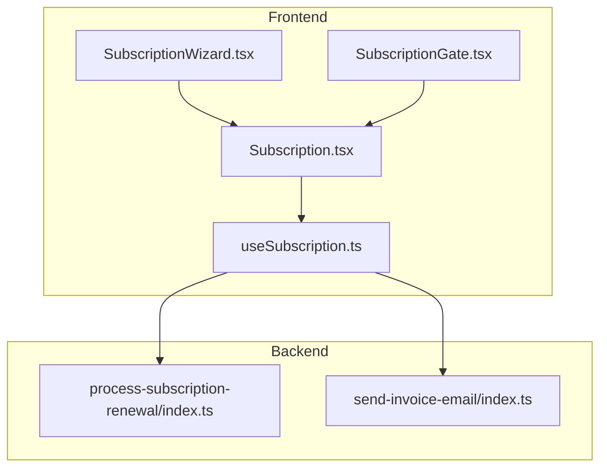
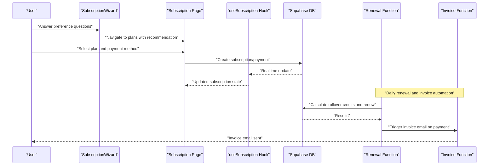
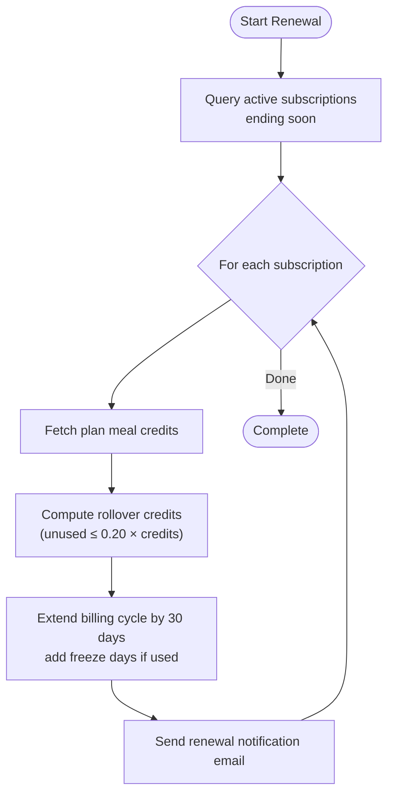
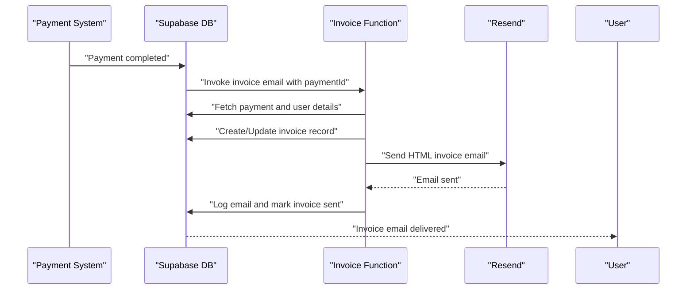
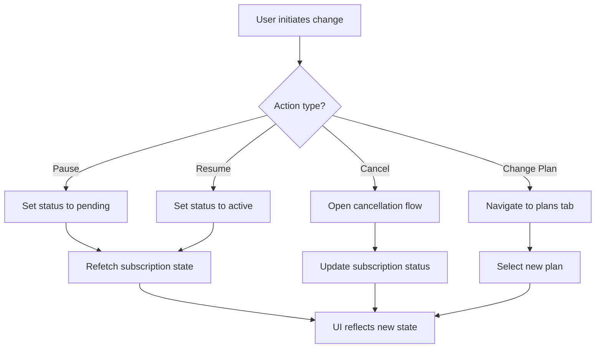
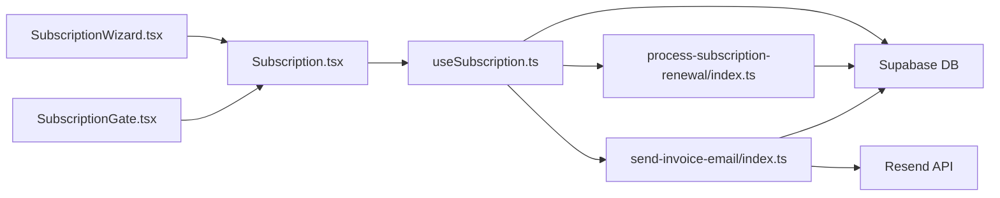

# Subscription & Billing System

<cite>
**Referenced Files in This Document**
- [SubscriptionWizard.tsx](file://src/components/SubscriptionWizard.tsx)
- [SubscriptionGate.tsx](file://src/components/SubscriptionGate.tsx)
- [useSubscription.ts](file://src/hooks/useSubscription.ts)
- [Subscription.tsx](file://src/pages/Subscription.tsx)
- [process-subscription-renewal/index.ts](file://supabase/functions/process-subscription-renewal/index.ts)
- [send-invoice-email/index.ts](file://supabase/functions/send-invoice-email/index.ts)
</cite>

## Table of Contents
1. [Introduction](#introduction)
2. [Project Structure](#project-structure)
3. [Core Components](#core-components)
4. [Architecture Overview](#architecture-overview)
5. [Detailed Component Analysis](#detailed-component-analysis)
6. [Dependency Analysis](#dependency-analysis)
7. [Performance Considerations](#performance-considerations)
8. [Troubleshooting Guide](#troubleshooting-guide)
9. [Conclusion](#conclusion)

## Introduction
This document describes the subscription and billing management system, focusing on subscription plan types, billing cycles, status management, automatic renewal, payment processing, modification workflows, and integration with the customer portal. It also covers the rollover credit system and invoice generation.

## Project Structure
The subscription and billing system spans frontend React components and hooks, and backend Supabase Edge Functions. Key areas:
- Frontend subscription experience: wizard, gate, and management page
- Subscription state management: React hook with Supabase integration
- Backend automation: renewal processing and invoice email generation

**Diagram sources**
- [SubscriptionWizard.tsx:1-184](file://src/components/SubscriptionWizard.tsx#L1-L184)
- [SubscriptionGate.tsx:1-103](file://src/components/SubscriptionGate.tsx#L1-L103)
- [useSubscription.ts:1-264](file://src/hooks/useSubscription.ts#L1-L264)
- [Subscription.tsx:889-970](file://src/pages/Subscription.tsx#L889-L970)
- [process-subscription-renewal/index.ts:1-278](file://supabase/functions/process-subscription-renewal/index.ts#L1-L278)
- [send-invoice-email/index.ts:1-540](file://supabase/functions/send-invoice-email/index.ts#L1-L540)

**Section sources**
- [SubscriptionWizard.tsx:1-184](file://src/components/SubscriptionWizard.tsx#L1-L184)
- [SubscriptionGate.tsx:1-103](file://src/components/SubscriptionGate.tsx#L1-L103)
- [useSubscription.ts:1-264](file://src/hooks/useSubscription.ts#L1-L264)
- [Subscription.tsx:889-970](file://src/pages/Subscription.tsx#L889-L970)
- [process-subscription-renewal/index.ts:1-278](file://supabase/functions/process-subscription-renewal/index.ts#L1-L278)
- [send-invoice-email/index.ts:1-540](file://supabase/functions/send-invoice-email/index.ts#L1-L540)

## Core Components
- Subscription plan recommendation and presentation: The wizard collects user preferences and recommends a plan with pricing and benefits.
- Subscription gating: A gate component blocks access to premium features until an active subscription is detected.
- Subscription state management: A React hook integrates with Supabase to fetch, track, and mutate subscription state, including pause/resume and rollover credit usage.
- Renewal automation: An Edge Function processes subscription renewals and calculates rollover credits.
- Invoice automation: An Edge Function generates and emails invoices upon payment completion.

Key capabilities:
- Plan tiers: Basic, Standard, Premium, VIP with different monthly meal quotas
- Status lifecycle: active, pending (paused), cancelled (grace period), expired
- Automatic renewal: Daily processing with rollover credit carryover
- Payment integration: Wallet balance, card, Sadad; invoice email automation
- Modification workflows: Pause/resume, cancellation, plan changes

**Section sources**
- [SubscriptionWizard.tsx:50-55](file://src/components/SubscriptionWizard.tsx#L50-L55)
- [SubscriptionGate.tsx:22-50](file://src/components/SubscriptionGate.tsx#L22-L50)
- [useSubscription.ts:5-40](file://src/hooks/useSubscription.ts#L5-L40)
- [useSubscription.ts:136-161](file://src/hooks/useSubscription.ts#L136-L161)
- [process-subscription-renewal/index.ts:96-121](file://supabase/functions/process-subscription-renewal/index.ts#L96-L121)
- [send-invoice-email/index.ts:326-473](file://supabase/functions/send-invoice-email/index.ts#L326-L473)

## Architecture Overview
The system combines a frontend subscription experience with backend automation:
- Frontend components render plans and manage user actions
- Supabase Realtime keeps subscription state synchronized
- Edge Functions automate renewal and invoicing

**Diagram sources**
- [SubscriptionWizard.tsx:59-101](file://src/components/SubscriptionWizard.tsx#L59-L101)
- [Subscription.tsx:902-970](file://src/pages/Subscription.tsx#L902-L970)
- [useSubscription.ts:47-98](file://src/hooks/useSubscription.ts#L47-L98)
- [process-subscription-renewal/index.ts:194-241](file://supabase/functions/process-subscription-renewal/index.ts#L194-L241)
- [send-invoice-email/index.ts:326-473](file://supabase/functions/send-invoice-email/index.ts#L326-L473)

## Detailed Component Analysis

### Subscription Plan Types and Pricing
- Plan tiers: Basic, Standard, Premium, VIP
- Pricing and benefits are presented in the wizard and subscription page
- VIP tier offers unlimited meals; others have fixed monthly quotas
- Annual billing option displays monthly-equivalent pricing

Implementation highlights:
- Plan metadata and recommendations are defined in the wizard component
- Pricing and period are rendered on the subscription page

**Section sources**
- [SubscriptionWizard.tsx:50-55](file://src/components/SubscriptionWizard.tsx#L50-L55)
- [Subscription.tsx:960-969](file://src/pages/Subscription.tsx#L960-L969)

### Subscription Status Management
Supported statuses:
- active: Current subscription in good standing
- pending: Paused ("freeze") state
- cancelled: Terminated but still within grace (end_date >= today)
- expired: Outside grace period

State evaluation logic:
- Active if status is active OR cancelled with end_date in future
- Paused if status is pending
- Unlimited if VIP tier or monthly quota is zero

**Section sources**
- [useSubscription.ts:136-141](file://src/hooks/useSubscription.ts#L136-L141)
- [useSubscription.ts:144-145](file://src/hooks/useSubscription.ts#L144-L145)

### Automatic Renewal System
Daily renewal processing:
- Identifies subscriptions ending within 24 hours
- Calculates rollover credits (up to 20% of unused monthly credits)
- Extends billing cycle by 30 days, adding freeze days if applicable
- Sends renewal notification email

Dry-run capability:
- Preview renewal without executing updates

**Diagram sources**
- [process-subscription-renewal/index.ts:96-121](file://supabase/functions/process-subscription-renewal/index.ts#L96-L121)
- [process-subscription-renewal/index.ts:166-192](file://supabase/functions/process-subscription-renewal/index.ts#L166-L192)
- [process-subscription-renewal/index.ts:227-240](file://supabase/functions/process-subscription-renewal/index.ts#L227-L240)

**Section sources**
- [process-subscription-renewal/index.ts:30-278](file://supabase/functions/process-subscription-renewal/index.ts#L30-L278)

### Payment Processing and Invoicing
Payment types supported:
- Wallet balance
- Credit/Debit card
- Sadad (local payment)

Invoice automation:
- Generates invoice number from payment ID
- Formats date and currency for Qatar locale
- Creates invoice record and emails PDF-style invoice via Resend
- Updates invoice status to sent and logs email

**Diagram sources**
- [send-invoice-email/index.ts:326-473](file://supabase/functions/send-invoice-email/index.ts#L326-L473)

**Section sources**
- [send-invoice-email/index.ts:18-37](file://supabase/functions/send-invoice-email/index.ts#L18-L37)
- [send-invoice-email/index.ts:48-86](file://supabase/functions/send-invoice-email/index.ts#L48-L86)
- [send-invoice-email/index.ts:326-473](file://supabase/functions/send-invoice-email/index.ts#L326-L473)

### Subscription Modification Workflows
- Pause/Resume: Transition between active and pending states
- Cancellation: Managed via the cancellation flow component integrated in the subscription page
- Plan changes: Accessible from the subscription page under the plans tab

**Diagram sources**
- [useSubscription.ts:205-241](file://src/hooks/useSubscription.ts#L205-L241)
- [Subscription.tsx:889-897](file://src/pages/Subscription.tsx#L889-L897)

**Section sources**
- [useSubscription.ts:205-241](file://src/hooks/useSubscription.ts#L205-L241)
- [Subscription.tsx:889-897](file://src/pages/Subscription.tsx#L889-L897)

### Customer Portal Integration
- SubscriptionGate: Prompts users to subscribe when accessing restricted features
- Subscription page: Central hub for viewing plans, selecting billing intervals, and managing subscription
- Realtime synchronization: Supabase Realtime channels keep UI in sync with backend state

**Section sources**
- [SubscriptionGate.tsx:52-102](file://src/components/SubscriptionGate.tsx#L52-L102)
- [Subscription.tsx:902-970](file://src/pages/Subscription.tsx#L902-L970)
- [useSubscription.ts:100-123](file://src/hooks/useSubscription.ts#L100-L123)

## Dependency Analysis
The frontend depends on Supabase for subscription data and on Edge Functions for automation. The backend depends on Supabase for data access and external services for email delivery.

**Diagram sources**
- [SubscriptionWizard.tsx:1-184](file://src/components/SubscriptionWizard.tsx#L1-L184)
- [SubscriptionGate.tsx:1-103](file://src/components/SubscriptionGate.tsx#L1-L103)
- [useSubscription.ts:1-264](file://src/hooks/useSubscription.ts#L1-L264)
- [process-subscription-renewal/index.ts:1-278](file://supabase/functions/process-subscription-renewal/index.ts#L1-L278)
- [send-invoice-email/index.ts:1-540](file://supabase/functions/send-invoice-email/index.ts#L1-L540)

**Section sources**
- [useSubscription.ts:47-98](file://src/hooks/useSubscription.ts#L47-L98)
- [process-subscription-renewal/index.ts:36-94](file://supabase/functions/process-subscription-renewal/index.ts#L36-L94)
- [send-invoice-email/index.ts:332-473](file://supabase/functions/send-invoice-email/index.ts#L332-L473)

## Performance Considerations
- Realtime channels minimize polling and ensure immediate UI updates
- Dry-run mode in renewal function allows safe previews without database writes
- Efficient queries limit results to active subscriptions due for renewal
- Frontend caching via local state reduces redundant network calls

## Troubleshooting Guide
Common issues and resolutions:
- Subscription not updating after payment: Verify Realtime channel subscription and network connectivity
- Renewal not triggered: Confirm daily cron job and that billing_cycle_end is approaching
- Invoice not sent: Check Resend API key configuration and payment status completeness
- Pause/Resume failing: Ensure subscription exists and user has permission to modify

**Section sources**
- [useSubscription.ts:100-123](file://src/hooks/useSubscription.ts#L100-L123)
- [process-subscription-renewal/index.ts:36-94](file://supabase/functions/process-subscription-renewal/index.ts#L36-L94)
- [send-invoice-email/index.ts:482-500](file://supabase/functions/send-invoice-email/index.ts#L482-L500)

## Conclusion
The subscription and billing system provides a robust foundation for managing recurring subscriptions, automated renewals, and payment workflows. Its modular design enables clear separation between frontend UX and backend automation, while Supabase Realtime ensures responsive user experiences. The system supports flexible plan tiers, pause/resume functionality, and comprehensive invoice automation.