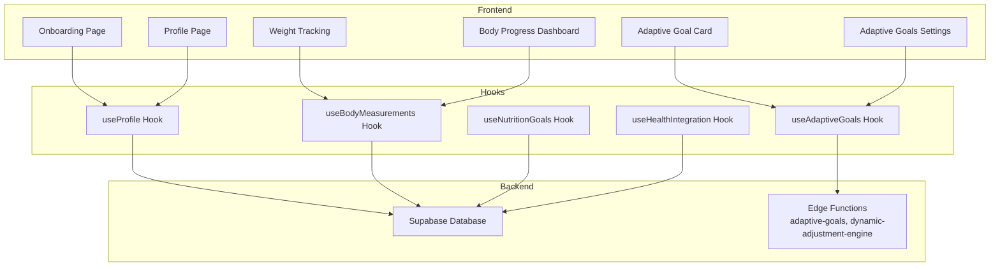
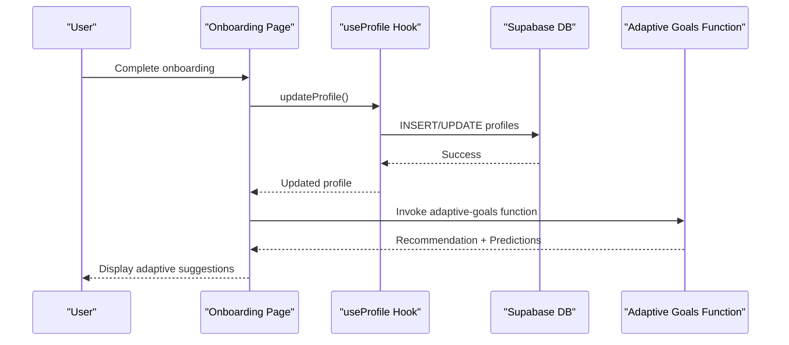
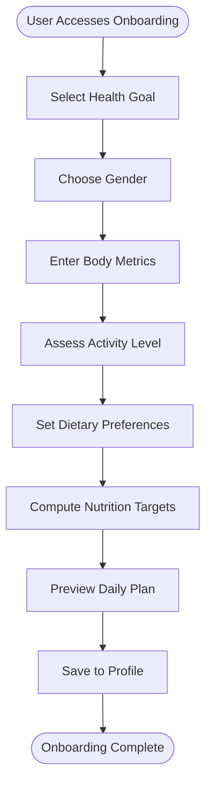
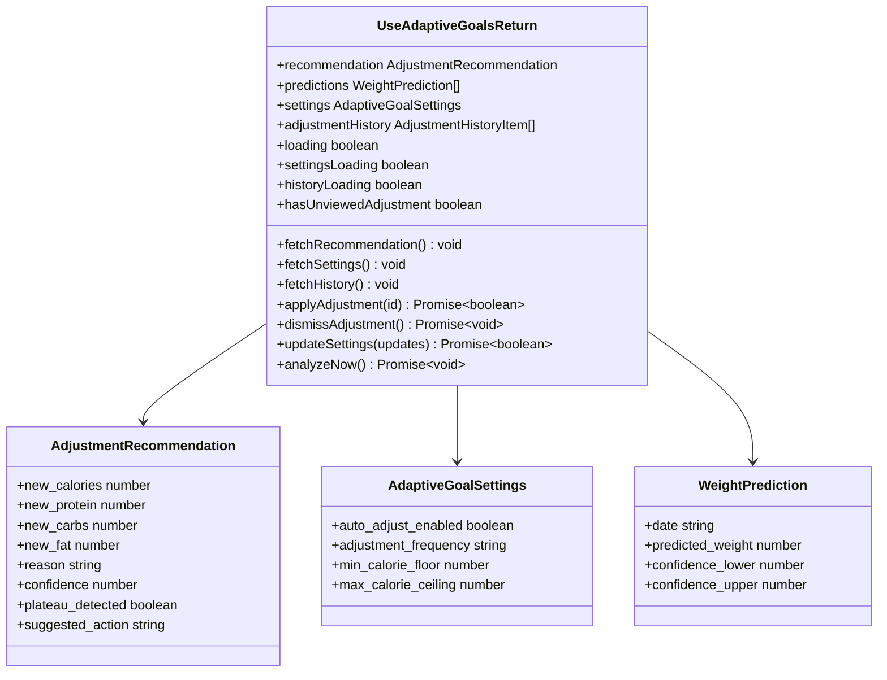
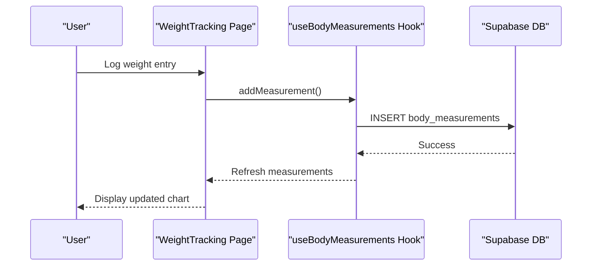
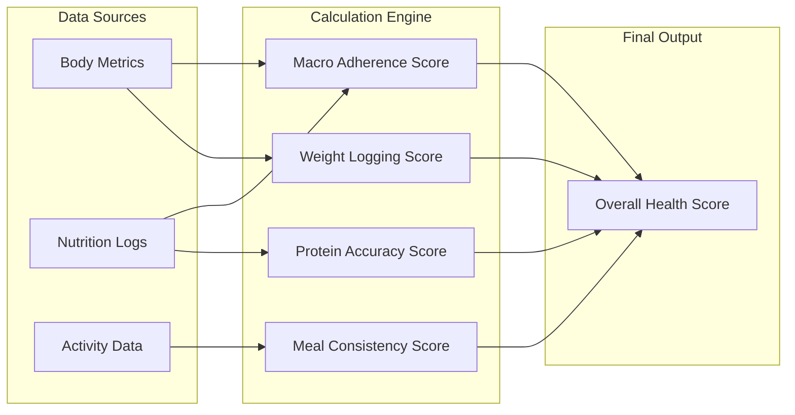
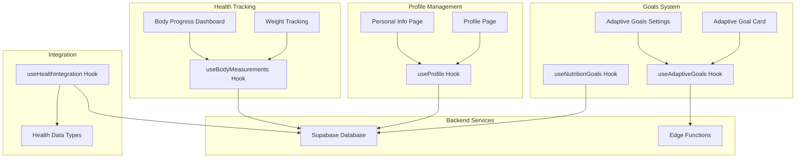

# User Profile & Health Data

<cite>
**Referenced Files in This Document**
- [Onboarding.tsx](file://src/pages/Onboarding.tsx)
- [Profile.tsx](file://src/pages/Profile.tsx)
- [PersonalInfo.tsx](file://src/pages/PersonalInfo.tsx)
- [WeightTracking.tsx](file://src/pages/WeightTracking.tsx)
- [BodyProgressDashboard.tsx](file://src/pages/progress/BodyProgressDashboard.tsx)
- [useProfile.ts](file://src/hooks/useProfile.ts)
- [useBodyMeasurements.ts](file://src/hooks/useBodyMeasurements.ts)
- [useNutritionGoals.ts](file://src/hooks/useNutritionGoals.ts)
- [useAdaptiveGoals.ts](file://src/hooks/useAdaptiveGoals.ts)
- [useHealthIntegration.ts](file://src/hooks/useHealthIntegration.ts)
- [AdaptiveGoalCard.tsx](file://src/components/AdaptiveGoalCard.tsx)
- [AdaptiveGoalsSettings.tsx](file://src/components/AdaptiveGoalsSettings.tsx)
- [BodyMeasurements.tsx](file://src/components/body-metrics/BodyMeasurements.tsx)
- [onboarding.spec.ts](file://e2e/customer/onboarding.spec.ts)
- [implementation-plan-customer-portal.md](file://docs/implementation-plan-customer-portal.md)
- [FULL_INTEGRATION_PLAN.md](file://docs/plans/FULL_INTEGRATION_PLAN.md)
- [index.ts](file://supabase/functions/adaptive-goals/index.ts)
- [index.ts](file://supabase/functions/dynamic-adjustment-engine/index.ts)
</cite>

## Table of Contents
1. [Introduction](#introduction)
2. [Project Structure](#project-structure)
3. [Core Components](#core-components)
4. [Architecture Overview](#architecture-overview)
5. [Detailed Component Analysis](#detailed-component-analysis)
6. [Dependency Analysis](#dependency-analysis)
7. [Performance Considerations](#performance-considerations)
8. [Troubleshooting Guide](#troubleshooting-guide)
9. [Conclusion](#conclusion)

## Introduction
This document provides comprehensive documentation for the user profile management and health data tracking system. It covers user profile structure, health goals, activity levels, body measurement tracking, onboarding completion, health data integration, and the adaptive goals system that dynamically adjusts recommendations based on user progress and behavior patterns.

## Project Structure
The system is organized around React components, custom hooks for data management, Supabase integration, and edge functions for AI-driven adaptive recommendations. Key areas include:
- Onboarding and profile management pages
- Body measurement and weight tracking
- Health score calculation and progress visualization
- Adaptive goals with AI recommendations
- Health data integration with mobile platforms

**Diagram sources**
- [Onboarding.tsx:169-454](file://src/pages/Onboarding.tsx#L169-L454)
- [Profile.tsx:245-430](file://src/pages/Profile.tsx#L245-L430)
- [WeightTracking.tsx:33-114](file://src/pages/WeightTracking.tsx#L33-L114)
- [BodyProgressDashboard.tsx:87-171](file://src/pages/progress/BodyProgressDashboard.tsx#L87-L171)
- [useProfile.ts:33-87](file://src/hooks/useProfile.ts#L33-L87)
- [useBodyMeasurements.ts:17-112](file://src/hooks/useBodyMeasurements.ts#L17-L112)
- [useNutritionGoals.ts:27-133](file://src/hooks/useNutritionGoals.ts#L27-L133)
- [useAdaptiveGoals.ts:62-406](file://src/hooks/useAdaptiveGoals.ts#L62-L406)
- [useHealthIntegration.ts:39-201](file://src/hooks/useHealthIntegration.ts#L39-L201)

**Section sources**
- [Onboarding.tsx:1-800](file://src/pages/Onboarding.tsx#L1-L800)
- [Profile.tsx:1-800](file://src/pages/Profile.tsx#L1-L800)
- [WeightTracking.tsx:1-315](file://src/pages/WeightTracking.tsx#L1-L315)
- [BodyProgressDashboard.tsx:1-758](file://src/pages/progress/BodyProgressDashboard.tsx#L1-L758)

## Core Components

### User Profile Management
The profile system manages personal information, demographic data, and health metrics. It integrates with Supabase for persistence and provides real-time updates.

Key capabilities:
- Personal information storage (name, gender, age)
- Demographic data (height, current weight, target weight)
- Health goals and activity levels
- Dietary preferences and allergies
- Onboarding completion tracking

**Section sources**
- [useProfile.ts:5-31](file://src/hooks/useProfile.ts#L5-L31)
- [Profile.tsx:245-430](file://src/pages/Profile.tsx#L245-L430)
- [PersonalInfo.tsx:44-86](file://src/pages/PersonalInfo.tsx#L44-L86)

### Health Goal System
The system supports three primary health goals with distinct nutritional impacts:
- **Weight Loss**: Creates 20% caloric deficit
- **Muscle Gain**: Creates 15% caloric surplus
- **Weight Maintenance**: Maintains maintenance calories

Goal selection influences macronutrient distribution and daily caloric targets.

**Section sources**
- [Onboarding.tsx:34-84](file://src/pages/Onboarding.tsx#L34-L84)
- [Onboarding.tsx:479-501](file://src/pages/Onboarding.tsx#L479-L501)

### Activity Level Classification
Activity levels are categorized from sedentary to extra active, each with specific TDEE multipliers:
- Sedentary: 1.2
- Lightly Active: 1.375
- Moderately Active: 1.55
- Very Active: 1.725
- Extra Active: 1.9

These classifications directly impact caloric and macronutrient targets.

**Section sources**
- [Onboarding.tsx:62-71](file://src/pages/Onboarding.tsx#L62-L71)
- [Onboarding.tsx:503-509](file://src/pages/Onboarding.tsx#L503-L509)

### Body Measurement Tracking
The system tracks weight, waist, hip, chest measurements, body fat percentage, and muscle mass percentage. Features include:
- Weekly measurement logging
- Historical tracking and visualization
- Progress charts for weight, waist, and body fat
- Integration with health apps (HealthKit/Google Fit)

**Section sources**
- [useBodyMeasurements.ts:5-15](file://src/hooks/useBodyMeasurements.ts#L5-L15)
- [WeightTracking.tsx:19-23](file://src/pages/WeightTracking.tsx#L19-L23)
- [BodyProgressDashboard.tsx:43-51](file://src/pages/progress/BodyProgressDashboard.tsx#L43-L51)

### Onboarding Process and Completion Tracking
The onboarding flow guides users through five essential steps:
1. Health goal selection
2. Gender identification
3. Body metrics entry (age, height, weight)
4. Activity level assessment
5. Dietary preferences and allergies

Progress is autosaved and recovery dialogs help prevent abandonment.

**Section sources**
- [Onboarding.tsx:141-147](file://src/pages/Onboarding.tsx#L141-L147)
- [Onboarding.tsx:207-284](file://src/pages/Onboarding.tsx#L207-L284)
- [implementation-plan-customer-portal.md:23-63](file://docs/implementation-plan-customer-portal.md#L23-L63)
- [onboarding.spec.ts:1-33](file://e2e/customer/onboarding.spec.ts#L1-L33)

### Health Data Integration
Mobile health data synchronization enables:
- Steps, calories burned, active minutes
- Workouts and sleep tracking
- Heart rate monitoring
- Bidirectional sync with Apple Health and Google Fit
- Writing meal data to health platforms

**Section sources**
- [useHealthIntegration.ts:12-29](file://src/hooks/useHealthIntegration.ts#L12-L29)
- [useHealthIntegration.ts:125-188](file://src/hooks/useHealthIntegration.ts#L125-L188)

### Adaptive Goals System
The adaptive goals system provides AI-powered recommendations that evolve based on user progress:
- Automatic analysis of weight trends and adherence
- Plateau detection and intervention
- Calorie adjustments (±100-150 calories)
- Macro nutrient adjustments
- Confidence scoring and suggested actions
- Manual override capability

**Section sources**
- [useAdaptiveGoals.ts:6-29](file://src/hooks/useAdaptiveGoals.ts#L6-L29)
- [useAdaptiveGoals.ts:136-178](file://src/hooks/useAdaptiveGoals.ts#L136-L178)
- [AdaptiveGoalCard.tsx:7-26](file://src/components/AdaptiveGoalCard.tsx#L7-L26)
- [AdaptiveGoalsSettings.tsx:16-35](file://src/components/AdaptiveGoalsSettings.tsx#L16-L35)

## Architecture Overview

**Diagram sources**
- [Onboarding.tsx:385-454](file://src/pages/Onboarding.tsx#L385-L454)
- [useProfile.ts:63-80](file://src/hooks/useProfile.ts#L63-L80)
- [useAdaptiveGoals.ts:136-178](file://src/hooks/useAdaptiveGoals.ts#L136-L178)

The system follows a reactive architecture pattern where user actions trigger hook-based data operations, persist to Supabase, and optionally invoke edge functions for AI-driven insights.

**Section sources**
- [Onboarding.tsx:385-454](file://src/pages/Onboarding.tsx#L385-L454)
- [useAdaptiveGoals.ts:136-178](file://src/hooks/useAdaptiveGoals.ts#L136-L178)

## Detailed Component Analysis

### Onboarding Workflow Analysis

**Diagram sources**
- [Onboarding.tsx:141-147](file://src/pages/Onboarding.tsx#L141-L147)
- [Onboarding.tsx:356-383](file://src/pages/Onboarding.tsx#L356-L383)
- [Onboarding.tsx:385-454](file://src/pages/Onboarding.tsx#L385-L454)

The onboarding process calculates BMR using the Mifflin-St Jeor equation, applies activity multipliers, and determines caloric targets based on selected goals. Macronutrient ratios adapt based on dietary preferences.

**Section sources**
- [Onboarding.tsx:52-136](file://src/pages/Onboarding.tsx#L52-L136)

### Adaptive Goals Implementation

**Diagram sources**
- [useAdaptiveGoals.ts:44-60](file://src/hooks/useAdaptiveGoals.ts#L44-L60)
- [useAdaptiveGoals.ts:6-29](file://src/hooks/useAdaptiveGoals.ts#L6-L29)

The adaptive goals system provides intelligent nutrition recommendations through edge functions, with safety bounds and manual approval mechanisms.

**Section sources**
- [useAdaptiveGoals.ts:62-406](file://src/hooks/useAdaptiveGoals.ts#L62-L406)
- [AdaptiveGoalCard.tsx:28-217](file://src/components/AdaptiveGoalCard.tsx#L28-L217)
- [AdaptiveGoalsSettings.tsx:16-179](file://src/components/AdaptiveGoalsSettings.tsx#L16-L179)

### Body Measurement Tracking System

**Diagram sources**
- [WeightTracking.tsx:81-102](file://src/pages/WeightTracking.tsx#L81-L102)
- [useBodyMeasurements.ts:47-80](file://src/hooks/useBodyMeasurements.ts#L47-L80)

The body measurement tracking system maintains historical data with automatic updates to current weight and comprehensive visualization capabilities.

**Section sources**
- [WeightTracking.tsx:33-114](file://src/pages/WeightTracking.tsx#L33-L114)
- [useBodyMeasurements.ts:17-112](file://src/hooks/useBodyMeasurements.ts#L17-L112)

### Health Score Calculation and Progress Visualization

**Diagram sources**
- [BodyProgressDashboard.tsx:53-61](file://src/pages/progress/BodyProgressDashboard.tsx#L53-L61)
- [BodyProgressDashboard.tsx:130-139](file://src/pages/progress/BodyProgressDashboard.tsx#L130-L139)

Health scores are calculated as weighted averages of four key metrics, providing comprehensive compliance assessment.

**Section sources**
- [BodyProgressDashboard.tsx:53-61](file://src/pages/progress/BodyProgressDashboard.tsx#L53-L61)
- [BodyProgressDashboard.tsx:269-329](file://src/pages/progress/BodyProgressDashboard.tsx#L269-L329)

## Dependency Analysis

**Diagram sources**
- [Profile.tsx:245-430](file://src/pages/Profile.tsx#L245-L430)
- [PersonalInfo.tsx:44-86](file://src/pages/PersonalInfo.tsx#L44-L86)
- [WeightTracking.tsx:33-114](file://src/pages/WeightTracking.tsx#L33-L114)
- [BodyProgressDashboard.tsx:87-171](file://src/pages/progress/BodyProgressDashboard.tsx#L87-L171)
- [useAdaptiveGoals.ts:62-406](file://src/hooks/useAdaptiveGoals.ts#L62-L406)
- [useHealthIntegration.ts:39-201](file://src/hooks/useHealthIntegration.ts#L39-L201)

**Section sources**
- [useProfile.ts:33-87](file://src/hooks/useProfile.ts#L33-L87)
- [useBodyMeasurements.ts:17-112](file://src/hooks/useBodyMeasurements.ts#L17-L112)
- [useNutritionGoals.ts:27-133](file://src/hooks/useNutritionGoals.ts#L27-L133)

## Performance Considerations
- **Data Fetching**: Hooks implement efficient caching and selective re-fetching to minimize network requests
- **Chart Rendering**: Responsive charts use optimized rendering with appropriate data sampling
- **Edge Function Availability**: Graceful degradation when adaptive goals functions are unavailable
- **Local Storage**: Strategic use of localStorage for onboarding progress persistence
- **Image Optimization**: Asset optimization for avatar uploads and progress visuals

## Troubleshooting Guide

### Common Issues and Solutions

**Onboarding Progress Not Saving**
- Verify localStorage availability in browser
- Check for authentication state before saving
- Review autosave mechanism and recovery dialogs

**Adaptive Goals Not Available**
- Confirm edge function deployment status
- Check CORS configuration for function invocation
- Verify user authentication context

**Health Data Sync Failures**
- Validate platform-specific permissions
- Check device compatibility (iOS/Android/web)
- Review health app connectivity and permissions

**Section sources**
- [Onboarding.tsx:207-284](file://src/pages/Onboarding.tsx#L207-L284)
- [useAdaptiveGoals.ts:136-178](file://src/hooks/useAdaptiveGoals.ts#L136-L178)
- [useHealthIntegration.ts:69-97](file://src/hooks/useHealthIntegration.ts#L69-L97)

## Conclusion
The user profile and health data tracking system provides a comprehensive foundation for personalized nutrition and wellness management. Through structured onboarding, adaptive goal systems, and integrated health tracking, users receive tailored recommendations that evolve with their progress. The modular architecture ensures scalability, maintainability, and seamless integration with modern health data sources.