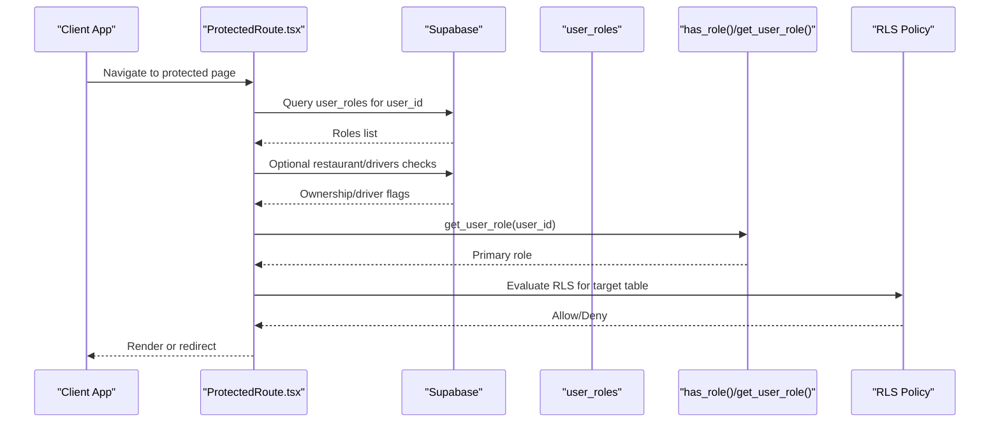
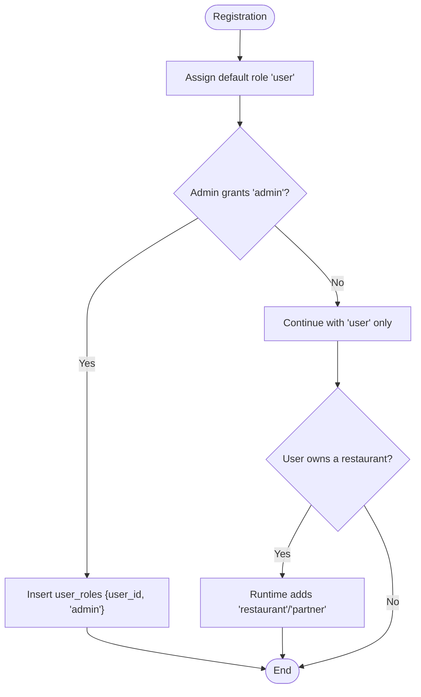
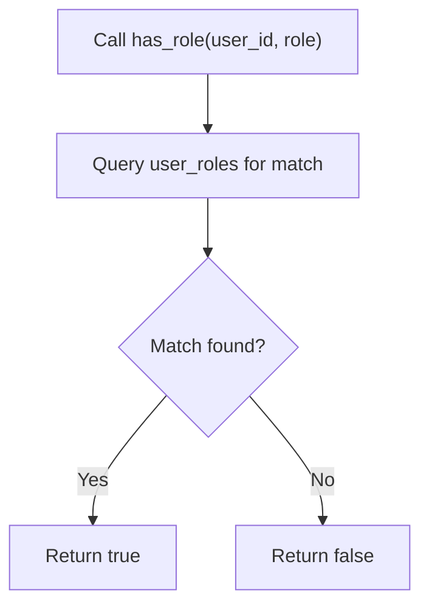
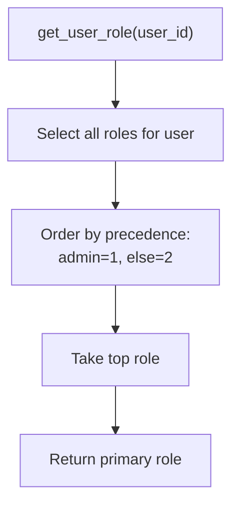
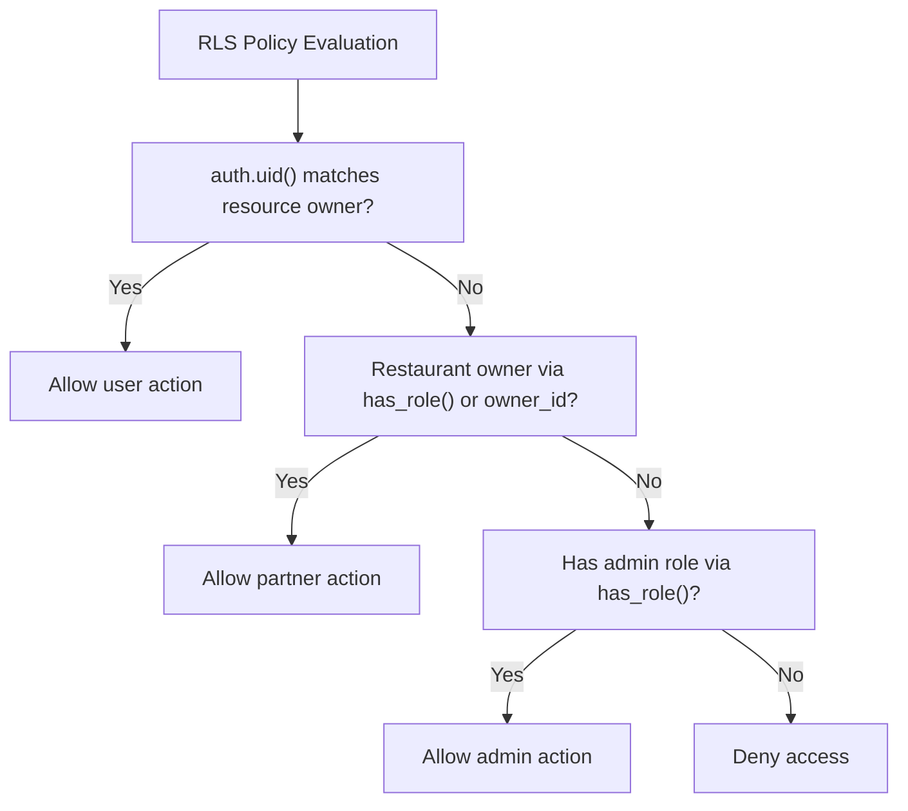
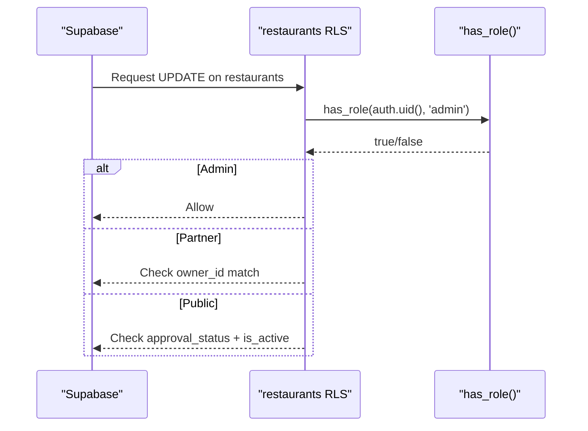
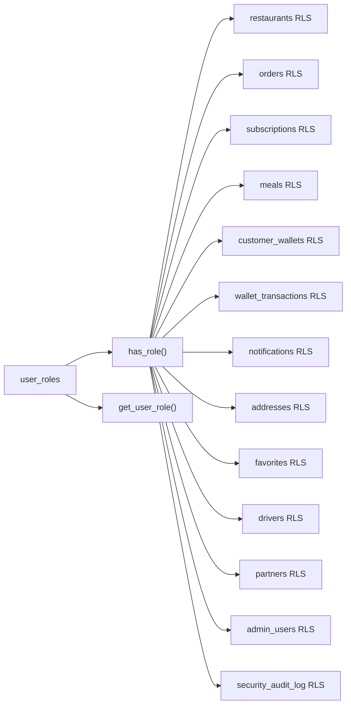

# User Roles & Permissions

<cite>
**Referenced Files in This Document**
- [20250218000002_rls_audit_and_policies.sql](file://supabase/migrations/20250218000002_rls_audit_and_policies.sql)
- [20250219000003_grant_admin_role.sql](file://supabase/migrations/20250219000003_grant_admin_role.sql)
- [20250219000004_fix_restaurants_rls.sql](file://supabase/migrations/20250219000004_fix_restaurants_rls.sql)
- [20250219000005_fix_restaurants_rls_v2.sql](file://supabase/migrations/20250219000005_fix_restaurants_rls_v2.sql)
- [20260226000008_fix_rls_and_security_issues.sql](file://supabase/migrations/20260226000008_fix_rls_and_security_issues.sql)
- [20260221220600_fix_app_role_enum_restaurant.sql](file://supabase/migrations/20260221220600_fix_app_role_enum_restaurant.sql)
- [20250220000000_create_essential_tables.sql](file://supabase/migrations/20250220000000_create_essential_tables.sql)
- [CREATE_TABLES_SQL.md](file://CREATE_TABLES_SQL.md)
- [ManageRolesDialog.tsx](file://src/components/admin/ManageRolesDialog.tsx)
- [ProtectedRoute.tsx](file://src/components/ProtectedRoute.tsx)
- [assign-admin-role-final.mjs](file://assign-admin-role-final.mjs)
- [NUTRIOFUEL_PRINT_READY.html](file://NUTRIOFUEL_PRINT_READY.html)
</cite>

## Table of Contents
1. [Introduction](#introduction)
2. [Project Structure](#project-structure)
3. [Core Components](#core-components)
4. [Architecture Overview](#architecture-overview)
5. [Detailed Component Analysis](#detailed-component-analysis)
6. [Dependency Analysis](#dependency-analysis)
7. [Performance Considerations](#performance-considerations)
8. [Troubleshooting Guide](#troubleshooting-guide)
9. [Conclusion](#conclusion)

## Introduction
This document explains Nutrio’s user role-based access control (RBAC) system. It covers the role hierarchy (user, admin, restaurant partner), row-level security (RLS) policies that enforce data isolation, the role assignment workflow during registration and afterward, and the security functions that determine effective roles. It also demonstrates how RLS policies prevent unauthorized data access across all user portals.

## Project Structure
The RBAC system spans Supabase database migrations (tables, policies, functions) and the frontend components that manage roles and gate protected routes.

```mermaid
graph TB
subgraph "Supabase Backend"
T_user_roles["Table: user_roles"]
T_restaurants["Table: restaurants"]
T_orders["Table: orders"]
T_subscriptions["Table: subscriptions"]
T_meals["Table: meals"]
T_customer_wallets["Table: customer_wallets"]
T_wallet_transactions["Table: wallet_transactions"]
T_notifications["Table: notifications"]
T_addresses["Table: addresses"]
T_favorites["Table: favorites"]
T_profiles["Table: profiles"]
T_drivers["Table: drivers"]
T_partners["Table: partners"]
T_admin_users["Table: admin_users"]
T_audit_log["Table: security_audit_log"]
F_has_role["Function: has_role(user_id, role)"]
F_get_user_role["Function: get_user_role(user_id)"]
end
subgraph "Frontend"
C_ManageRoles["Component: ManageRolesDialog.tsx"]
C_ProtectedRoute["Component: ProtectedRoute.tsx"]
end
T_user_roles --> F_has_role
T_user_roles --> F_get_user_role
T_restaurants --> F_has_role
T_orders --> F_has_role
T_subscriptions --> F_has_role
T_meals --> F_has_role
T_customer_wallets --> F_has_role
T_wallet_transactions --> F_has_role
T_notifications --> F_has_role
T_addresses --> F_has_role
T_favorites --> F_has_role
T_profiles --> F_has_role
T_drivers --> F_has_role
T_partners --> F_has_role
T_admin_users --> F_has_role
T_audit_log --> F_has_role
C_ManageRoles --> T_user_roles
C_ProtectedRoute --> T_user_roles
C_ProtectedRoute --> T_restaurants
C_ProtectedRoute --> T_orders
C_ProtectedRoute --> T_subscriptions
C_ProtectedRoute --> T_meals
C_ProtectedRoute --> T_customer_wallets
C_ProtectedRoute --> T_wallet_transactions
C_ProtectedRoute --> T_notifications
C_ProtectedRoute --> T_addresses
C_ProtectedRoute --> T_favorites
C_ProtectedRoute --> T_profiles
C_ProtectedRoute --> T_drivers
C_ProtectedRoute --> T_partners
C_ProtectedRoute --> T_admin_users
```

**Diagram sources**
- [20250218000002_rls_audit_and_policies.sql:1-356](file://supabase/migrations/20250218000002_rls_audit_and_policies.sql#L1-L356)
- [20250219000004_fix_restaurants_rls.sql:50-63](file://supabase/migrations/20250219000004_fix_restaurants_rls.sql#L50-L63)
- [20250219000005_fix_restaurants_rls_v2.sql:13-47](file://supabase/migrations/20250219000005_fix_restaurants_rls_v2.sql#L13-L47)
- [20260226000008_fix_rls_and_security_issues.sql:6-33](file://supabase/migrations/20260226000008_fix_rls_and_security_issues.sql#L6-L33)
- [20260221220600_fix_app_role_enum_restaurant.sql:1-16](file://supabase/migrations/20260221220600_fix_app_role_enum_restaurant.sql#L1-L16)
- [20250220000000_create_essential_tables.sql:90-136](file://supabase/migrations/20250220000000_create_essential_tables.sql#L90-L136)
- [ManageRolesDialog.tsx:17-73](file://src/components/admin/ManageRolesDialog.tsx#L17-L73)
- [ProtectedRoute.tsx:44-98](file://src/components/ProtectedRoute.tsx#L44-L98)

**Section sources**
- [20250218000002_rls_audit_and_policies.sql:1-356](file://supabase/migrations/20250218000002_rls_audit_and_policies.sql#L1-L356)
- [20250219000004_fix_restaurants_rls.sql:1-80](file://supabase/migrations/20250219000004_fix_restaurants_rls.sql#L1-L80)
- [20250219000005_fix_restaurants_rls_v2.sql:1-63](file://supabase/migrations/20250219000005_fix_restaurants_rls_v2.sql#L1-L63)
- [20260226000008_fix_rls_and_security_issues.sql:1-252](file://supabase/migrations/20260226000008_fix_rls_and_security_issues.sql#L1-L252)
- [20260221220600_fix_app_role_enum_restaurant.sql:1-16](file://supabase/migrations/20260221220600_fix_app_role_enum_restaurant.sql#L1-L16)
- [20250220000000_create_essential_tables.sql:90-136](file://supabase/migrations/20250220000000_create_essential_tables.sql#L90-L136)
- [ManageRolesDialog.tsx:17-73](file://src/components/admin/ManageRolesDialog.tsx#L17-L73)
- [ProtectedRoute.tsx:44-98](file://src/components/ProtectedRoute.tsx#L44-L98)

## Core Components
- Role model and hierarchy:
  - Primary roles stored in the user_roles table with the app_role enum.
  - Effective roles are determined by has_role() and get_user_role().
- Security functions:
  - has_role(user_id, role): checks membership in a specific role.
  - get_user_role(user_id): returns the highest-precedence role for a user.
- RLS policies:
  - Enforce per-table access rules for users, restaurant partners, drivers, and admins.
  - Admins can bypass most restrictions via has_role() checks.
- Frontend role management:
  - ManageRolesDialog.tsx allows administrators to assign/remove roles.
  - ProtectedRoute.tsx resolves effective roles for route protection.

**Section sources**
- [20250220000000_create_essential_tables.sql:90-136](file://supabase/migrations/20250220000000_create_essential_tables.sql#L90-L136)
- [20260221220600_fix_app_role_enum_restaurant.sql:1-16](file://supabase/migrations/20260221220600_fix_app_role_enum_restaurant.sql#L1-L16)
- [20250218000002_rls_audit_and_policies.sql:247-270](file://supabase/migrations/20250218000002_rls_audit_and_policies.sql#L247-L270)
- [ManageRolesDialog.tsx:17-73](file://src/components/admin/ManageRolesDialog.tsx#L17-L73)
- [ProtectedRoute.tsx:44-98](file://src/components/ProtectedRoute.tsx#L44-L98)

## Architecture Overview
The RBAC architecture combines a central role table with per-table RLS policies and two key functions to compute access.

**Diagram sources**
- [ProtectedRoute.tsx:44-98](file://src/components/ProtectedRoute.tsx#L44-L98)
- [20250220000000_create_essential_tables.sql:103-120](file://supabase/migrations/20250220000000_create_essential_tables.sql#L103-L120)
- [20250218000002_rls_audit_and_policies.sql:46-96](file://supabase/migrations/20250218000002_rls_audit_and_policies.sql#L46-L96)

## Detailed Component Analysis

### Role Hierarchy and Enum
- Roles are stored in the user_roles table with the app_role enum.
- The enum includes values for user, admin, restaurant, partner, driver, staff, gym_owner, and fleet_manager (via separate fleet_managers table).
- The frontend recognizes “restaurant” and “partner” consistently; the enum was updated to include “restaurant”.

**Section sources**
- [20260221220600_fix_app_role_enum_restaurant.sql:1-16](file://supabase/migrations/20260221220600_fix_app_role_enum_restaurant.sql#L1-L16)
- [ManageRolesDialog.tsx:17-73](file://src/components/admin/ManageRolesDialog.tsx#L17-L73)

### Role Assignment Workflow
- Default role: newly registered users receive the “user” role by default.
- Admin assignment: administrators can grant “admin” via ManageRolesDialog.tsx or via a dedicated script.
- Restaurant ownership: users who own a restaurant gain “restaurant” and “partner” roles at runtime.

**Diagram sources**
- [NUTRIOFUEL_PRINT_READY.html:3932-3943](file://NUTRIOFUEL_PRINT_READY.html#L3932-L3943)
- [assign-admin-role-final.mjs:36-62](file://assign-admin-role-final.mjs#L36-L62)
- [ManageRolesDialog.tsx:142-187](file://src/components/admin/ManageRolesDialog.tsx#L142-L187)
- [ProtectedRoute.tsx:63-77](file://src/components/ProtectedRoute.tsx#L63-L77)

**Section sources**
- [NUTRIOFUEL_PRINT_READY.html:3932-3943](file://NUTRIOFUEL_PRINT_READY.html#L3932-L3943)
- [assign-admin-role-final.mjs:36-62](file://assign-admin-role-final.mjs#L36-L62)
- [ManageRolesDialog.tsx:142-187](file://src/components/admin/ManageRolesDialog.tsx#L142-L187)
- [ProtectedRoute.tsx:63-77](file://src/components/ProtectedRoute.tsx#L63-L77)

### has_role() Security Function
- Purpose: Determine if a user belongs to a specific role.
- Implementation: A stable, security-definer function that queries user_roles.
- Usage: RLS policies use has_role() to authorize access for admins and restaurant partners.

**Diagram sources**
- [20250220000000_create_essential_tables.sql:90-101](file://supabase/migrations/20250220000000_create_essential_tables.sql#L90-L101)
- [20250218000002_rls_audit_and_policies.sql:247-257](file://supabase/migrations/20250218000002_rls_audit_and_policies.sql#L247-L257)

**Section sources**
- [20250220000000_create_essential_tables.sql:90-101](file://supabase/migrations/20250220000000_create_essential_tables.sql#L90-L101)
- [20250218000002_rls_audit_and_policies.sql:247-257](file://supabase/migrations/20250218000002_rls_audit_and_policies.sql#L247-L257)

### get_user_role() Function and Role Precedence
- Purpose: Determine a user’s primary role for authorization decisions.
- Implementation: Returns the highest-precedence role among a user’s roles (admin > others).
- Security implication: Ensures admins always take precedence in access checks.

**Diagram sources**
- [20250220000000_create_essential_tables.sql:103-120](file://supabase/migrations/20250220000000_create_essential_tables.sql#L103-L120)

**Section sources**
- [20250220000000_create_essential_tables.sql:103-120](file://supabase/migrations/20250220000000_create_essential_tables.sql#L103-L120)

### Row-Level Security (RLS) Policies
- Orders: Users see only their orders; partners see orders for their restaurants; drivers see assigned orders; admins can manage all.
- Subscriptions: Users see/update only their subscriptions; admins can manage all.
- Meals: Anyone can view active meals; partners manage meals for their restaurants; admins can manage all.
- Restaurants: Public can view approved and active restaurants; partners can view/update/manage their own; admins can manage all.
- Customer wallets and transactions: Users see/update only their own; admins can view all.
- Notifications: Users can view/update their own; system can create.
- Addresses and favorites: Users can manage their own.
- Additional tables: RLS enabled and policies applied for drivers, partners, admin users, and audit logging.

**Diagram sources**
- [20250218000002_rls_audit_and_policies.sql:46-96](file://supabase/migrations/20250218000002_rls_audit_and_policies.sql#L46-L96)
- [20250218000002_rls_audit_and_policies.sql:99-115](file://supabase/migrations/20250218000002_rls_audit_and_policies.sql#L99-L115)
- [20250218000002_rls_audit_and_policies.sql:118-143](file://supabase/migrations/20250218000002_rls_audit_and_policies.sql#L118-L143)
- [20250218000002_rls_audit_and_policies.sql:146-165](file://supabase/migrations/20250218000002_rls_audit_and_policies.sql#L146-L165)
- [20250218000002_rls_audit_and_policies.sql:168-203](file://supabase/migrations/20250218000002_rls_audit_and_policies.sql#L168-L203)
- [20250218000002_rls_audit_and_policies.sql:206-222](file://supabase/migrations/20250218000002_rls_audit_and_policies.sql#L206-L222)
- [20250218000002_rls_audit_and_policies.sql:224-241](file://supabase/migrations/20250218000002_rls_audit_and_policies.sql#L224-L241)

**Section sources**
- [20250218000002_rls_audit_and_policies.sql:46-96](file://supabase/migrations/20250218000002_rls_audit_and_policies.sql#L46-L96)
- [20250218000002_rls_audit_and_policies.sql:99-115](file://supabase/migrations/20250218000002_rls_audit_and_policies.sql#L99-L115)
- [20250218000002_rls_audit_and_policies.sql:118-143](file://supabase/migrations/20250218000002_rls_audit_and_policies.sql#L118-L143)
- [20250218000002_rls_audit_and_policies.sql:146-165](file://supabase/migrations/20250218000002_rls_audit_and_policies.sql#L146-L165)
- [20250218000002_rls_audit_and_policies.sql:168-203](file://supabase/migrations/20250218000002_rls_audit_and_policies.sql#L168-L203)
- [20250218000002_rls_audit_and_policies.sql:206-222](file://supabase/migrations/20250218000002_rls_audit_and_policies.sql#L206-L222)
- [20250218000002_rls_audit_and_policies.sql:224-241](file://supabase/migrations/20250218000002_rls_audit_and_policies.sql#L224-L241)

### Restaurant Partner RLS Enhancements
- Initial policies: Conflicting or incomplete permissions led to errors.
- Fixed policies: Admins can manage all restaurants; partners can view/update/insert their own; public can view approved and active restaurants.
- has_role() function ensures admin override.

**Diagram sources**
- [20250219000004_fix_restaurants_rls.sql:44-47](file://supabase/migrations/20250219000004_fix_restaurants_rls.sql#L44-L47)
- [20250219000005_fix_restaurants_rls_v2.sql:13-47](file://supabase/migrations/20250219000005_fix_restaurants_rls_v2.sql#L13-L47)

**Section sources**
- [20250219000004_fix_restaurants_rls.sql:1-80](file://supabase/migrations/20250219000004_fix_restaurants_rls.sql#L1-L80)
- [20250219000005_fix_restaurants_rls_v2.sql:1-63](file://supabase/migrations/20250219000005_fix_restaurants_rls_v2.sql#L1-L63)

### Additional Security Hardening
- user_nutrition_log: Enabled RLS and added CRUD policies; admins can manage all via has_role().
- Data retention: Policies table and purge function for GDPR/privacy compliance.
- Authentication security: Failed auth attempts tracking and IP blocking thresholds.
- Audit logging: Dedicated table and policy restricting access to admins.

**Section sources**
- [20260226000008_fix_rls_and_security_issues.sql:1-252](file://supabase/migrations/20260226000008_fix_rls_and_security_issues.sql#L1-L252)

### Frontend Role Management and Route Protection
- ManageRolesDialog.tsx:
  - Fetches current roles from user_roles.
  - Supports adding/removing roles except removing the last role (“user”).
  - Handles fleet_manager via a separate table while assigning “admin” in user_roles.
- ProtectedRoute.tsx:
  - Builds a roles list by querying user_roles and checking restaurant/drivers ownership.
  - Uses get_user_role() semantics implicitly to decide access.

**Section sources**
- [ManageRolesDialog.tsx:88-126](file://src/components/admin/ManageRolesDialog.tsx#L88-L126)
- [ManageRolesDialog.tsx:142-187](file://src/components/admin/ManageRolesDialog.tsx#L142-L187)
- [ProtectedRoute.tsx:44-98](file://src/components/ProtectedRoute.tsx#L44-L98)

## Dependency Analysis
The RBAC system depends on:
- user_roles table for role membership.
- has_role() and get_user_role() functions for role checks.
- RLS policies on all relevant tables.
- Frontend components to manage and consume roles.

**Diagram sources**
- [20250218000002_rls_audit_and_policies.sql:46-96](file://supabase/migrations/20250218000002_rls_audit_and_policies.sql#L46-L96)
- [20250218000002_rls_audit_and_policies.sql:99-115](file://supabase/migrations/20250218000002_rls_audit_and_policies.sql#L99-L115)
- [20250218000002_rls_audit_and_policies.sql:118-143](file://supabase/migrations/20250218000002_rls_audit_and_policies.sql#L118-L143)
- [20250218000002_rls_audit_and_policies.sql:146-165](file://supabase/migrations/20250218000002_rls_audit_and_policies.sql#L146-L165)
- [20250218000002_rls_audit_and_policies.sql:168-203](file://supabase/migrations/20250218000002_rls_audit_and_policies.sql#L168-L203)
- [20250218000002_rls_audit_and_policies.sql:206-222](file://supabase/migrations/20250218000002_rls_audit_and_policies.sql#L206-L222)
- [20250218000002_rls_audit_and_policies.sql:224-241](file://supabase/migrations/20250218000002_rls_audit_and_policies.sql#L224-L241)
- [20250220000000_create_essential_tables.sql:90-136](file://supabase/migrations/20250220000000_create_essential_tables.sql#L90-L136)

**Section sources**
- [20250218000002_rls_audit_and_policies.sql:46-96](file://supabase/migrations/20250218000002_rls_audit_and_policies.sql#L46-L96)
- [20250220000000_create_essential_tables.sql:90-136](file://supabase/migrations/20250220000000_create_essential_tables.sql#L90-L136)

## Performance Considerations
- has_role() and get_user_role() are lightweight function calls; keep role sets minimal per user.
- RLS evaluation occurs per-row; ensure indexes exist on join/filter columns (e.g., owner_id, user_id).
- Prefer selective policies to reduce scans (already present in many tables).
- Cache role lists in frontend where appropriate to minimize repeated queries.

## Troubleshooting Guide
- Admin cannot access admin features:
  - Verify admin role assignment in user_roles and that has_role() resolves true for the user.
  - Confirm RLS policies on admin-only tables use has_role() checks.
- Restaurant approvals failing:
  - Ensure restaurants RLS policies allow admin full access and that has_role() is used for admin checks.
- Users seeing wrong data:
  - Check RLS policy conditions for owner_id and auth.uid() alignment.
  - Verify get_user_role() precedence and that admin takes priority.
- Role not persisting after save:
  - Confirm ManageRolesDialog.tsx inserts/deletes from user_roles and excludes fleet_manager from this table.

**Section sources**
- [20250219000005_fix_restaurants_rls_v2.sql:13-47](file://supabase/migrations/20250219000005_fix_restaurants_rls_v2.sql#L13-L47)
- [20250218000002_rls_audit_and_policies.sql:93-96](file://supabase/migrations/20250218000002_rls_audit_and_policies.sql#L93-L96)
- [ManageRolesDialog.tsx:142-187](file://src/components/admin/ManageRolesDialog.tsx#L142-L187)

## Conclusion
Nutrio’s RBAC system centers on a robust role table, precise security functions, and comprehensive RLS policies. Administrators gain broad authority via has_role(), while restaurant partners and drivers operate under strict ownership-based controls. The frontend components provide practical tools to manage roles and protect routes. Together, these mechanisms enforce strong data isolation across all user portals.