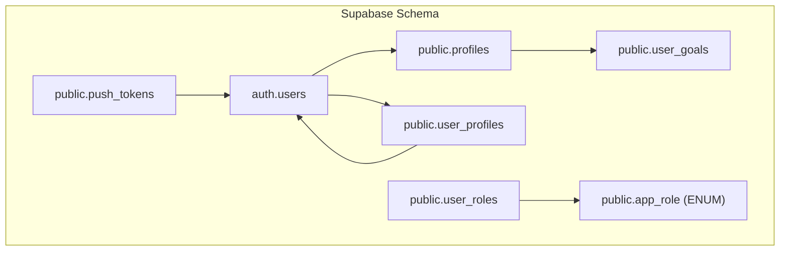
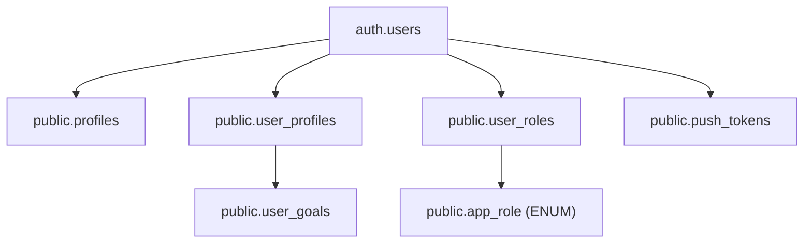
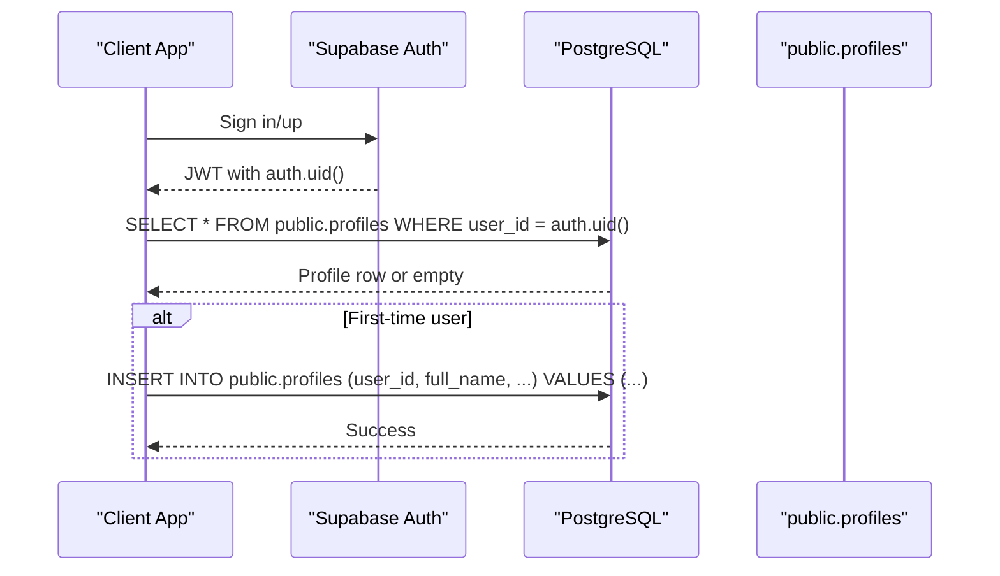
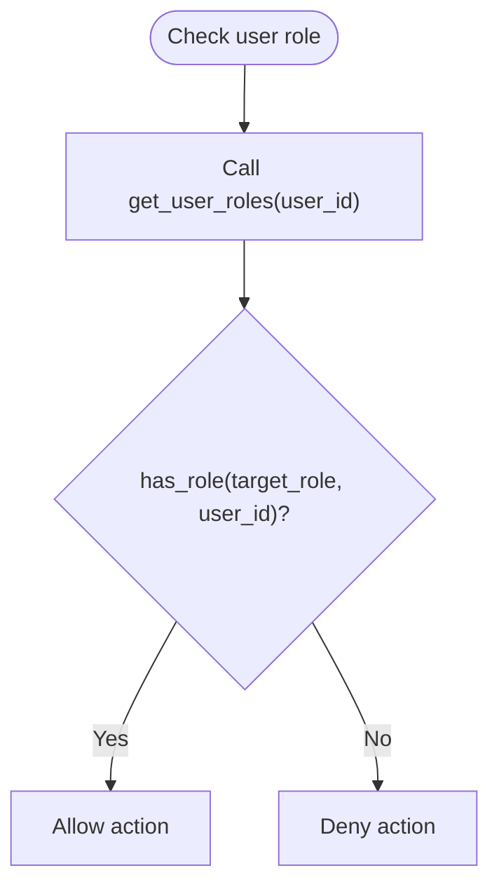
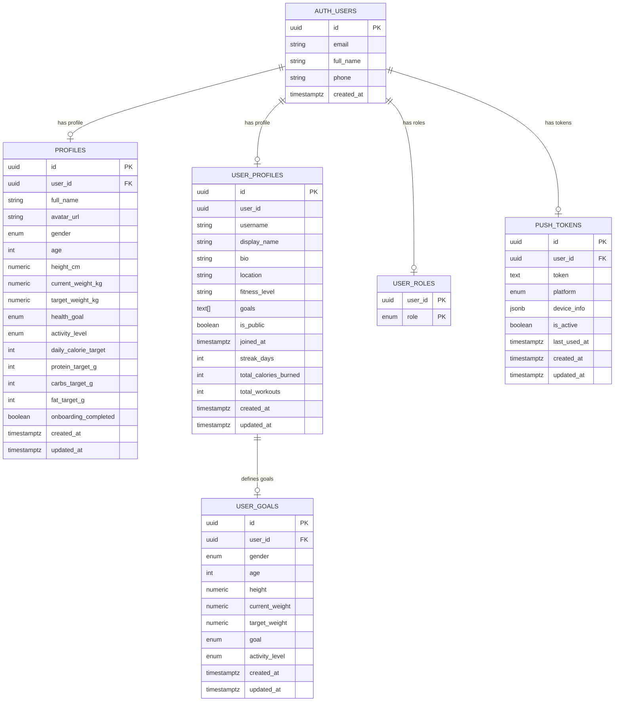

# Core Entities

<cite>
**Referenced Files in This Document**
- [types.ts](file://supabase/types.ts)
- [20250220000000_create_essential_tables.sql](file://supabase/migrations/20250220000000_create_essential_tables.sql)
- [20240101000000_add_notification_preferences.sql](file://supabase/migrations/20240101000000_add_notification_preferences.sql)
- [20250218000001_add_performance_indexes.sql](file://supabase/migrations/20250218000001_add_performance_indexes.sql)
- [setup-admin-role.mjs](file://setup-admin-role.mjs)
- [20260221220600_fix_app_role_enum_restaurant.sql](file://supabase/migrations/20260221220600_fix_app_role_enum_restaurant.sql)
- [AdminUsers.tsx](file://src/pages/admin/AdminUsers.tsx)
</cite>

## Table of Contents
1. [Introduction](#introduction)
2. [Project Structure](#project-structure)
3. [Core Components](#core-components)
4. [Architecture Overview](#architecture-overview)
5. [Detailed Component Analysis](#detailed-component-analysis)
6. [Dependency Analysis](#dependency-analysis)
7. [Performance Considerations](#performance-considerations)
8. [Troubleshooting Guide](#troubleshooting-guide)
9. [Conclusion](#conclusion)

## Introduction
This document describes Nutrio's core database entities focused on user management, profiles, roles, and authentication integration. It explains the relationship between Supabase auth.users and the custom profiles table, details the role-based access control (RBAC) implementation via user_roles and app_role enum, and documents health metrics and personal information fields used for nutrition and wellness workflows. It also outlines typical data structures and common query patterns for each entity.

## Project Structure
The database schema is defined in Supabase with TypeScript type definitions and migrations. Key elements:
- Supabase types definition enumerates tables, views, functions, enums, and relationships.
- Migrations create and evolve core tables including profiles, user_profiles, user_roles, and supporting enums.
- Application code integrates with these tables and functions for user management and RBAC.

**Diagram sources**
- [types.ts:2748-2831](file://supabase/types.ts#L2748-L2831)
- [20250220000000_create_essential_tables.sql:137-167](file://supabase/migrations/20250220000000_create_essential_tables.sql#L137-L167)
- [20240101000000_add_notification_preferences.sql:45-97](file://supabase/migrations/20240101000000_add_notification_preferences.sql#L45-L97)

**Section sources**
- [types.ts:2748-2831](file://supabase/types.ts#L2748-L2831)
- [20250220000000_create_essential_tables.sql:137-167](file://supabase/migrations/20250220000000_create_essential_tables.sql#L137-L167)

## Core Components
This section defines the primary entities and their fields, constraints, and relationships.

- auth.users
  - Purpose: Supabase authentication table storing base user identifiers and contact info.
  - Key fields: id (UUID, PK), email, full_name, phone, created_at.
  - Notes: Linked to custom profiles via foreign key.

- public.profiles
  - Purpose: Extended user profile with health metrics, personal info, and nutrition targets.
  - Key fields:
    - id (UUID, PK)
    - user_id (UUID, FK to auth.users, UNIQUE, NOT NULL)
    - full_name, avatar_url
    - gender (gender_type enum)
    - age (INTEGER, CHECK 13..120)
    - height_cm (NUMERIC(5,2), CHECK > 0 and < 300)
    - current_weight_kg, target_weight_kg (NUMERIC(5,2), CHECK > 0 and < 500)
    - health_goal (health_goal enum)
    - activity_level (activity_level enum)
    - daily_calorie_target, protein_target_g, carbs_target_g, fat_target_g (INTEGER)
    - onboarding_completed (BOOLEAN, DEFAULT false)
    - created_at, updated_at (TIMESTAMP WITH TIME ZONE)
  - Constraints and policies:
    - RLS enabled
    - Policies for self-view, self-update, self-insert
    - Admins can view all profiles

- public.user_profiles
  - Purpose: Alternative user profile table with social and display attributes.
  - Key fields:
    - id (UUID, PK)
    - user_id (UUID)
    - username, display_name, bio, location
    - fitness_level, goals (array)
    - is_public, joined_at, streak_days, total_calories_burned, total_workouts
    - created_at, updated_at
  - Notes: Separate from profiles; used for public-facing profiles and social features.

- public.user_roles
  - Purpose: Stores user role assignments mapped to app_role enum.
  - Key fields: user_id (UUID), role (app_role enum)
  - Constraints: UNIQUE(user_id, role)

- public.app_role (ENUM)
  - Values: user, admin, gym_owner, staff, restaurant, driver
  - Used by has_role(), get_user_roles() functions for authorization checks.

- public.user_goals
  - Purpose: Stores per-user health goals and metrics used for nutrition calculations.
  - Key fields:
    - id (UUID, PK)
    - user_id (FK to user_profiles)
    - gender (gender_type), age, height, current_weight, target_weight
    - goal (health_goal_type enum)
    - activity_level, created_at, updated_at

- public.push_tokens
  - Purpose: Stores push notification tokens for mobile/web devices.
  - Key fields:
    - id (UUID, PK)
    - user_id (FK to auth.users)
    - token (TEXT, UNIQUE per user)
    - platform (CHECK in 'ios','android','web')
    - device_info (JSONB), is_active, last_used_at, created_at, updated_at
  - Policies: Self-management for users; service_role can manage all

**Section sources**
- [types.ts:2748-2831](file://supabase/types.ts#L2748-L2831)
- [20250220000000_create_essential_tables.sql:137-167](file://supabase/migrations/20250220000000_create_essential_tables.sql#L137-L167)
- [20240101000000_add_notification_preferences.sql:45-97](file://supabase/migrations/20240101000000_add_notification_preferences.sql#L45-L97)
- [setup-admin-role.mjs:72-123](file://setup-admin-role.mjs#L72-L123)
- [20260221220600_fix_app_role_enum_restaurant.sql:1-15](file://supabase/migrations/20260221220600_fix_app_role_enum_restaurant.sql#L1-L15)

## Architecture Overview
The user management architecture integrates Supabase auth.users with custom tables for extended profiles, roles, and preferences. Security is enforced via row-level security (RLS) and application-defined roles.

**Diagram sources**
- [types.ts:2748-2831](file://supabase/types.ts#L2748-L2831)
- [20250220000000_create_essential_tables.sql:137-167](file://supabase/migrations/20250220000000_create_essential_tables.sql#L137-L167)
- [20240101000000_add_notification_preferences.sql:45-97](file://supabase/migrations/20240101000000_add_notification_preferences.sql#L45-L97)

## Detailed Component Analysis

### Authentication Integration: auth.users and profiles
- Relationship
  - public.profiles.user_id references auth.users.id with ON DELETE CASCADE and is UNIQUE.
  - This ensures one profile per authenticated user and automatic cleanup on user deletion.
- Typical data structures
  - auth.users: minimal identity fields (id, email, full_name, phone, created_at)
  - public.profiles: extended health and nutrition fields (gender, age, height_cm, weights, goals, activity_level, macro targets)
- Common query patterns
  - Fetch profile by authenticated user: SELECT * FROM public.profiles WHERE user_id = auth.uid()
  - Upsert profile on first login: INSERT ... ON CONFLICT (user_id) DO UPDATE ...
  - Join with auth.users for email/name: SELECT u.email, p.* FROM public.profiles p JOIN auth.users u ON p.user_id = u.id

**Diagram sources**
- [20250220000000_create_essential_tables.sql:137-167](file://supabase/migrations/20250220000000_create_essential_tables.sql#L137-L167)
- [types.ts:2748-2831](file://supabase/types.ts#L2748-L2831)

**Section sources**
- [types.ts:2748-2831](file://supabase/types.ts#L2748-L2831)
- [20250220000000_create_essential_tables.sql:137-167](file://supabase/migrations/20250220000000_create_essential_tables.sql#L137-L167)

### Role-Based Access Control: user_roles and app_role
- Implementation
  - app_role is a PostgreSQL ENUM with values: user, admin, gym_owner, staff, restaurant, driver.
  - public.user_roles stores (user_id, role) pairs.
  - Helper functions:
    - get_user_roles(_user_id): returns array of roles for a user
    - has_role(_role, _user_id): boolean check if user has a given role
- Admin setup
  - The setup script creates the enum, updates user_roles to use the enum, and assigns admin role to a user.

**Diagram sources**
- [setup-admin-role.mjs:72-123](file://setup-admin-role.mjs#L72-L123)
- [20260221220600_fix_app_role_enum_restaurant.sql:1-15](file://supabase/migrations/20260221220600_fix_app_role_enum_restaurant.sql#L1-L15)
- [types.ts:3086-3098](file://supabase/types.ts#L3086-L3098)

**Section sources**
- [setup-admin-role.mjs:72-123](file://setup-admin-role.mjs#L72-L123)
- [20260221220600_fix_app_role_enum_restaurant.sql:1-15](file://supabase/migrations/20260221220600_fix_app_role_enum_restaurant.sql#L1-L15)
- [types.ts:3086-3098](file://supabase/types.ts#L3086-L3098)

### Health Metrics and Personal Information Fields
- public.profiles fields for health and nutrition
  - Gender: gender_type enum
  - Age: INTEGER with bounds
  - Height: height_cm (NUMERIC) with bounds
  - Weight: current_weight_kg and target_weight_kg (NUMERIC) with bounds
  - Activity level: activity_level enum
  - Health goal: health_goal enum
  - Macro targets: daily_calorie_target, protein_target_g, carbs_target_g, fat_target_g
- public.user_goals fields for goal-driven calculations
  - gender, age, height, current_weight, target_weight
  - goal: health_goal_type enum
  - activity_level
- Typical query patterns
  - Calculate macros based on targets: SELECT daily_calorie_target, protein_target_g, carbs_target_g, fat_target_g FROM public.profiles WHERE user_id = auth.uid()
  - Retrieve user goal for calculation engine: SELECT * FROM public.user_goals WHERE user_id = (SELECT id FROM public.user_profiles WHERE user_id = auth.uid())

**Section sources**
- [20250220000000_create_essential_tables.sql:137-167](file://supabase/migrations/20250220000000_create_essential_tables.sql#L137-L167)
- [types.ts:2654-2703](file://supabase/types.ts#L2654-L2703)

### Notification Preferences and Push Tokens
- public.profiles.notification_preferences (JSONB)
  - Stores user notification preferences by channel (email, push, sms, whatsapp)
  - Indexed with GIN for efficient querying
- public.push_tokens
  - Stores device push tokens with platform and device_info
  - RLS policies allow users to manage their own tokens; service_role can manage all
- Common patterns
  - Upsert preferences: UPDATE public.profiles SET notification_preferences = jsonb_set(notification_preferences, '{channel,setting}', 'true') WHERE user_id = auth.uid()
  - Get active tokens: SELECT token, platform FROM public.push_tokens WHERE user_id = auth.uid() AND is_active = true

**Section sources**
- [20240101000000_add_notification_preferences.sql:9-97](file://supabase/migrations/20240101000000_add_notification_preferences.sql#L9-L97)

### Admin Portal Integration Example
- The admin page aggregates profile data with roles and IP logs, demonstrating how user roles are surfaced alongside profile information.

**Section sources**
- [AdminUsers.tsx:155-193](file://src/pages/admin/AdminUsers.tsx#L155-L193)

## Dependency Analysis
- auth.users ← public.profiles (FK)
- auth.users ← public.user_profiles (optional FK)
- public.user_profiles ← public.user_goals (FK)
- public.user_roles ← public.app_role (ENUM)
- auth.users ← public.push_tokens (FK)

**Diagram sources**
- [types.ts:2748-2831](file://supabase/types.ts#L2748-L2831)
- [20250220000000_create_essential_tables.sql:137-167](file://supabase/migrations/20250220000000_create_essential_tables.sql#L137-L167)
- [20240101000000_add_notification_preferences.sql:45-97](file://supabase/migrations/20240101000000_add_notification_preferences.sql#L45-L97)

**Section sources**
- [types.ts:2748-2831](file://supabase/types.ts#L2748-L2831)
- [20250220000000_create_essential_tables.sql:137-167](file://supabase/migrations/20250220000000_create_essential_tables.sql#L137-L167)
- [20240101000000_add_notification_preferences.sql:45-97](file://supabase/migrations/20240101000000_add_notification_preferences.sql#L45-L97)

## Performance Considerations
- Indexes for production performance
  - Orders: user_id, status, restaurant_id, driver_id, delivery_date
  - Order items: order_id, meal_id
  - Subscriptions: user_id, status (with partial index for active/pending)
  - Meals: restaurant_id, is_active, dietary_tags (GIN)
  - Meal schedules: user_id, scheduled_date, order_status
  - Wallet transactions: wallet_id, created_at
  - Notifications: user_id, unread (partial)
  - Reviews: restaurant_id, meal_id, user_id
  - Favorites: user_id, restaurant_id
  - Partner analytics: restaurant_id, date
- Recommendations
  - Use partial indexes for commonly filtered statuses (active/pending).
  - Leverage GIN indexes for JSONB fields like notification_preferences and device_info.
  - Keep RLS policies selective to minimize scans.

**Section sources**
- [20250218000001_add_performance_indexes.sql:1-73](file://supabase/migrations/20250218000001_add_performance_indexes.sql#L1-L73)

## Troubleshooting Guide
- Role assignment issues
  - Ensure app_role enum includes required values (e.g., restaurant). Use the fix migration to add missing enum values.
  - After enum update, cast existing user_roles entries to the new enum type.
- Admin role not recognized
  - Confirm the setup script ran and user_roles contains the admin entry for the target user.
- Profile creation failures
  - Check constraints on numeric fields (height, weights) and age range.
  - Verify RLS policy allows INSERT with CHECK (auth.uid() = user_id).
- Notification preferences not applied
  - Confirm GIN index exists on notification_preferences and JSONB structure matches expectations.
- Push token management
  - Ensure users can only manage their own tokens; service_role can manage all for delivery.

**Section sources**
- [setup-admin-role.mjs:72-123](file://setup-admin-role.mjs#L72-L123)
- [20260221220600_fix_app_role_enum_restaurant.sql:1-15](file://supabase/migrations/20260221220600_fix_app_role_enum_restaurant.sql#L1-L15)
- [20250220000000_create_essential_tables.sql:137-167](file://supabase/migrations/20250220000000_create_essential_tables.sql#L137-L167)
- [20240101000000_add_notification_preferences.sql:9-97](file://supabase/migrations/20240101000000_add_notification_preferences.sql#L9-L97)

## Conclusion
Nutrio’s user management leverages Supabase auth.users as the identity foundation and extends it with custom tables for profiles, roles, goals, and preferences. The RBAC system uses a dedicated enum and helper functions to enforce access controls. Health metrics and personal information are modeled with strict constraints and RLS policies. Performance is supported by targeted indexes, and the admin portal demonstrates integration patterns for roles and user data.