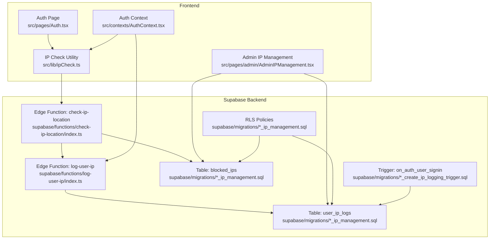
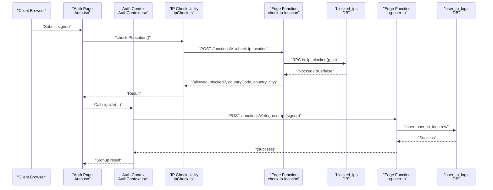
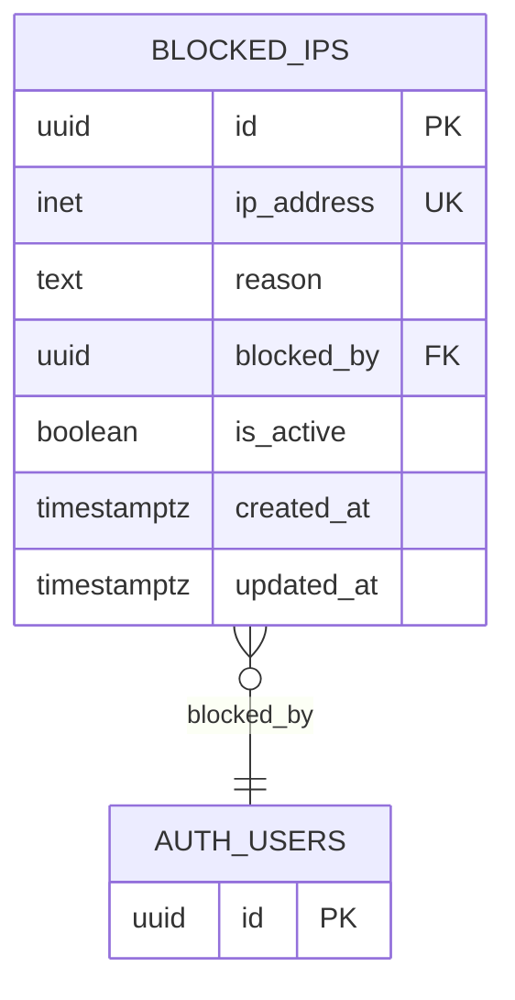
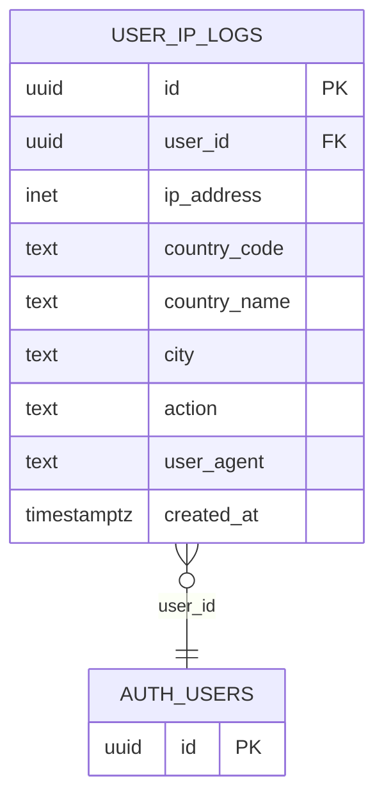
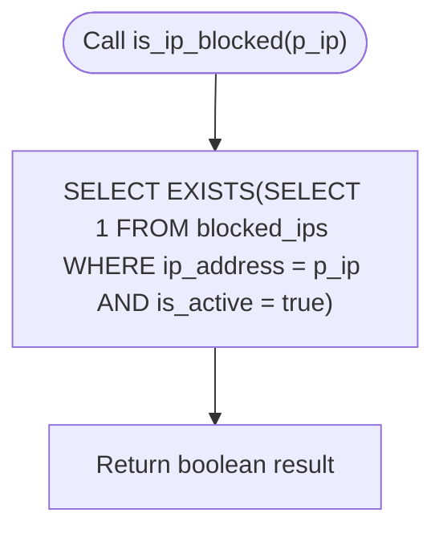
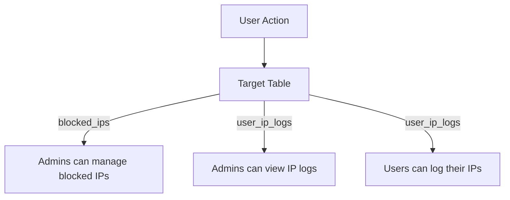
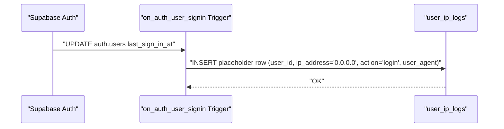
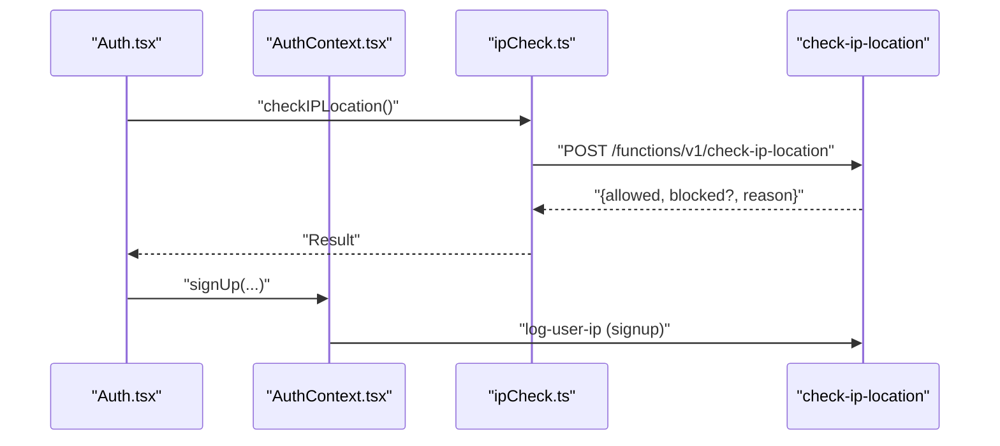
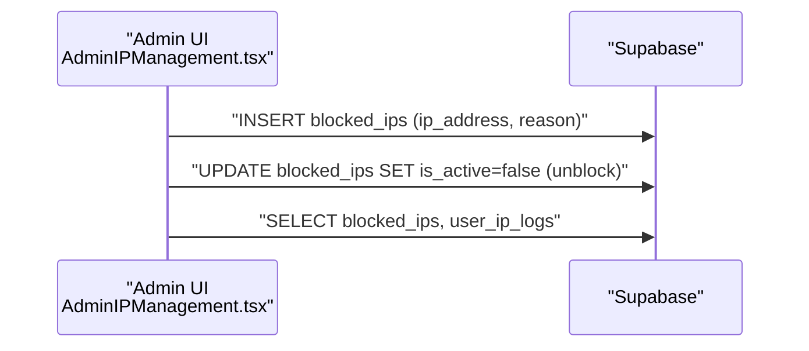
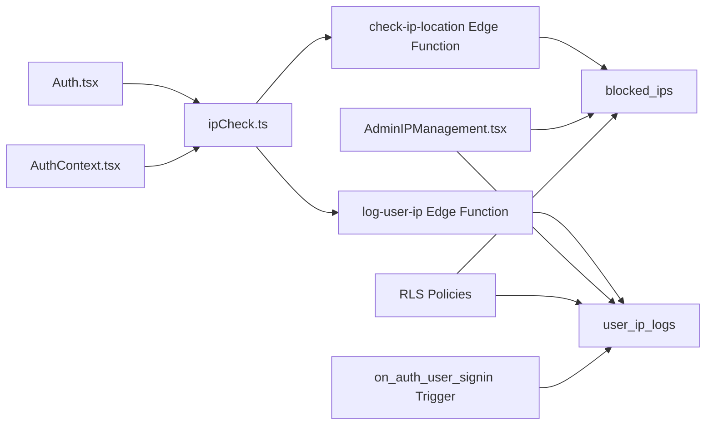

# IP Management & Security

<cite>
**Referenced Files in This Document**
- [ipCheck.ts](file://src/lib/ipCheck.ts)
- [Auth.tsx](file://src/pages/Auth.tsx)
- [AuthContext.tsx](file://src/contexts/AuthContext.tsx)
- [AdminIPManagement.tsx](file://src/pages/admin/AdminIPManagement.tsx)
- [check-ip-location/index.ts](file://supabase/functions/check-ip-location/index.ts)
- [log-user-ip/index.ts](file://supabase/functions/log-user-ip/index.ts)
- [20250219000000_ip_management.sql](file://supabase/migrations/20250219000000_ip_management.sql)
- [20250220000000_create_essential_tables.sql](file://supabase/migrations/20250220000000_create_essential_tables.sql)
- [20250220000008_create_ip_logging_trigger.sql](file://supabase/migrations/20250220000008_create_ip_logging_trigger.sql)
- [IP_MANAGEMENT_STATUS.md](file://IP_MANAGEMENT_STATUS.md)
- [IP-BYPASS-STATUS.md](file://IP-BYPASS-STATUS.md)
</cite>

## Table of Contents
1. [Introduction](#introduction)
2. [Project Structure](#project-structure)
3. [Core Components](#core-components)
4. [Architecture Overview](#architecture-overview)
5. [Detailed Component Analysis](#detailed-component-analysis)
6. [Dependency Analysis](#dependency-analysis)
7. [Performance Considerations](#performance-considerations)
8. [Troubleshooting Guide](#troubleshooting-guide)
9. [Conclusion](#conclusion)

## Introduction
This document describes the IP Management and Security system in Nutrio. It covers:
- The blocked_ips table for IP address blocking with fields for ip_address, reason, blocked_by, and is_active status
- The user_ip_logs table for tracking user login/signup activities with geolocation data (country_code, country_name, city) and user agent information
- The is_ip_blocked() security function for real-time IP validation
- Row Level Security (RLS) policies for IP management
- The automated IP logging trigger
- Examples of IP blocking scenarios, security policy enforcement, and integration with the authentication flow
- Performance optimizations through indexing strategies

## Project Structure
The IP Management system spans frontend and backend components:
- Frontend integration via a reusable IP checker utility
- Supabase Edge Functions for geolocation checks and user IP logging
- Supabase database tables and migration scripts
- Authentication flows that optionally integrate IP checks
- An administrative UI for managing blocked IPs

**Diagram sources**
- [Auth.tsx:15-203](file://src/pages/Auth.tsx#L15-L203)
- [AuthContext.tsx:87-112](file://src/contexts/AuthContext.tsx#L87-L112)
- [ipCheck.ts:19-107](file://src/lib/ipCheck.ts#L19-L107)
- [check-ip-location/index.ts:1-107](file://supabase/functions/check-ip-location/index.ts#L1-L107)
- [log-user-ip/index.ts:1-65](file://supabase/functions/log-user-ip/index.ts#L1-L65)
- [20250219000000_ip_management.sql:1-60](file://supabase/migrations/20250219000000_ip_management.sql#L1-L60)
- [20250220000008_create_ip_logging_trigger.sql:1-48](file://supabase/migrations/20250220000008_create_ip_logging_trigger.sql#L1-L48)

**Section sources**
- [Auth.tsx:15-203](file://src/pages/Auth.tsx#L15-L203)
- [AuthContext.tsx:87-112](file://src/contexts/AuthContext.tsx#L87-L112)
- [ipCheck.ts:19-107](file://src/lib/ipCheck.ts#L19-L107)
- [check-ip-location/index.ts:1-107](file://supabase/functions/check-ip-location/index.ts#L1-L107)
- [log-user-ip/index.ts:1-65](file://supabase/functions/log-user-ip/index.ts#L1-L65)
- [20250219000000_ip_management.sql:1-60](file://supabase/migrations/20250219000000_ip_management.sql#L1-L60)
- [20250220000008_create_ip_logging_trigger.sql:1-48](file://supabase/migrations/20250220000008_create_ip_logging_trigger.sql#L1-L48)

## Core Components
- blocked_ips table
  - Fields: id, ip_address (unique), reason, blocked_by (references auth.users), is_active (default true), timestamps
  - Purpose: Maintain a list of blocked IP addresses with optional reasons and active status
- user_ip_logs table
  - Fields: id, user_id (FK to auth.users), ip_address, country_code, country_name, city, action ('signup' or 'login'), user_agent, created_at
  - Purpose: Track user login/signup events with geolocation and user agent metadata
- is_ip_blocked() function
  - Validates whether a given IP is present in blocked_ips and currently active
- Edge Functions
  - check-ip-location: performs IP geolocation and blocks based on database lookup and geo-validation
  - log-user-ip: captures IP, geolocation, and user agent during user actions
- RLS Policies
  - Admin-only management of blocked_ips
  - Admin-only viewing of user_ip_logs
  - Users can insert their own IP logs
- Indexes
  - Optimizations for blocked_ips (ip_address, is_active) and user_ip_logs (user_id, ip_address, created_at DESC)

**Section sources**
- [20250219000000_ip_management.sql:1-60](file://supabase/migrations/20250219000000_ip_management.sql#L1-L60)
- [20250220000000_create_essential_tables.sql:204-232](file://supabase/migrations/20250220000000_create_essential_tables.sql#L204-L232)
- [check-ip-location/index.ts:52-60](file://supabase/functions/check-ip-location/index.ts#L52-L60)

## Architecture Overview
The system integrates frontend and backend components to enforce IP-based security and track user locations.

**Diagram sources**
- [Auth.tsx:169-203](file://src/pages/Auth.tsx#L169-L203)
- [AuthContext.tsx:87-112](file://src/contexts/AuthContext.tsx#L87-L112)
- [ipCheck.ts:49-80](file://src/lib/ipCheck.ts#L49-L80)
- [check-ip-location/index.ts:49-94](file://supabase/functions/check-ip-location/index.ts#L49-L94)
- [log-user-ip/index.ts:35-45](file://supabase/functions/log-user-ip/index.ts#L35-L45)

## Detailed Component Analysis

### blocked_ips Table
- Purpose: Central registry of blocked IP addresses
- Key fields:
  - ip_address: unique INET field for the IP
  - reason: optional text describing the reason
  - blocked_by: references the admin who added the block
  - is_active: boolean flag to activate/deactivate blocks
  - created_at/updated_at: timestamps
- RLS: Admins can manage blocked_ips; enforced via policy

**Diagram sources**
- [20250219000000_ip_management.sql:2-10](file://supabase/migrations/20250219000000_ip_management.sql#L2-L10)

**Section sources**
- [20250219000000_ip_management.sql:2-10](file://supabase/migrations/20250219000000_ip_management.sql#L2-L10)
- [20250219000000_ip_management.sql:37-39](file://supabase/migrations/20250219000000_ip_management.sql#L37-L39)

### user_ip_logs Table
- Purpose: Audit trail of user IP usage with geolocation and user agent
- Key fields:
  - user_id: references auth.users
  - ip_address: INET
  - country_code, country_name, city: geolocation
  - action: 'signup' or 'login'
  - user_agent: browser/device info
  - created_at: timestamp
- RLS: Admins can SELECT; users can INSERT their own logs

**Diagram sources**
- [20250219000000_ip_management.sql:12-23](file://supabase/migrations/20250219000000_ip_management.sql#L12-L23)

**Section sources**
- [20250219000000_ip_management.sql:12-23](file://supabase/migrations/20250219000000_ip_management.sql#L12-L23)
- [20250219000000_ip_management.sql:41-49](file://supabase/migrations/20250219000000_ip_management.sql#L41-L49)

### is_ip_blocked() Security Function
- Validates if an IP is present in blocked_ips and currently active
- Used by the check-ip-location Edge Function to decide blocking

**Diagram sources**
- [check-ip-location/index.ts:52-60](file://supabase/functions/check-ip-location/index.ts#L52-L60)
- [20250219000000_ip_management.sql:52-60](file://supabase/migrations/20250219000000_ip_management.sql#L52-L60)

**Section sources**
- [check-ip-location/index.ts:52-60](file://supabase/functions/check-ip-location/index.ts#L52-L60)
- [20250219000000_ip_management.sql:52-60](file://supabase/migrations/20250219000000_ip_management.sql#L52-L60)

### RLS Policies for IP Management
- blocked_ips
  - Policy: Admins can manage blocked IPs
- user_ip_logs
  - Policy: Admins can SELECT
  - Policy: Users can INSERT their own logs

**Diagram sources**
- [20250219000000_ip_management.sql:37-49](file://supabase/migrations/20250219000000_ip_management.sql#L37-L49)

**Section sources**
- [20250219000000_ip_management.sql:37-49](file://supabase/migrations/20250219000000_ip_management.sql#L37-L49)

### Automated IP Logging Trigger
- Trigger: on_auth_user_signin on auth.users
- Behavior: On first login per session, inserts a placeholder row into user_ip_logs
- Production note: The trigger inserts a placeholder IP; production uses Edge Functions to capture real IP and geolocation

**Diagram sources**
- [20250220000008_create_ip_logging_trigger.sql:6-35](file://supabase/migrations/20250220000008_create_ip_logging_trigger.sql#L6-L35)

**Section sources**
- [20250220000008_create_ip_logging_trigger.sql:6-35](file://supabase/migrations/20250220000008_create_ip_logging_trigger.sql#L6-L35)

### Frontend IP Check Utility and Authentication Integration
- checkIPLocation()
  - Returns a predefined result in current test mode (allows all IPs)
  - In normal operation, calls the Edge Function to check IP geolocation and block status
- Auth.tsx
  - Calls checkIPLocation() during signup and displays user-friendly messages based on allowed/blocked/reason
- AuthContext.tsx
  - Optionally checks IP during login; allows login on failure with a warning

**Diagram sources**
- [Auth.tsx:169-203](file://src/pages/Auth.tsx#L169-L203)
- [AuthContext.tsx:87-112](file://src/contexts/AuthContext.tsx#L87-L112)
- [ipCheck.ts:49-80](file://src/lib/ipCheck.ts#L49-L80)
- [check-ip-location/index.ts:49-94](file://supabase/functions/check-ip-location/index.ts#L49-L94)

**Section sources**
- [ipCheck.ts:19-80](file://src/lib/ipCheck.ts#L19-L80)
- [Auth.tsx:169-203](file://src/pages/Auth.tsx#L169-L203)
- [AuthContext.tsx:87-112](file://src/contexts/AuthContext.tsx#L87-L112)

### Admin IP Management UI
- Provides controls to block/unblock IPs and view statistics
- Integrates with blocked_ips and user_ip_logs for display and updates

**Diagram sources**
- [AdminIPManagement.tsx:96-132](file://src/pages/admin/AdminIPManagement.tsx#L96-L132)
- [AdminIPManagement.tsx:134-139](file://src/pages/admin/AdminIPManagement.tsx#L134-L139)

**Section sources**
- [AdminIPManagement.tsx:96-132](file://src/pages/admin/AdminIPManagement.tsx#L96-L132)
- [AdminIPManagement.tsx:134-139](file://src/pages/admin/AdminIPManagement.tsx#L134-L139)

## Dependency Analysis
- Frontend depends on:
  - ipCheck.ts for IP validation
  - Auth.tsx and AuthContext.tsx for integration into signup/login flows
- Backend depends on:
  - Edge Functions for IP geolocation and logging
  - blocked_ips and user_ip_logs tables for storage
  - RLS policies for access control
  - Trigger for automatic logging on sign-in

**Diagram sources**
- [Auth.tsx:15-203](file://src/pages/Auth.tsx#L15-L203)
- [AuthContext.tsx:87-112](file://src/contexts/AuthContext.tsx#L87-L112)
- [ipCheck.ts:19-107](file://src/lib/ipCheck.ts#L19-L107)
- [check-ip-location/index.ts:1-107](file://supabase/functions/check-ip-location/index.ts#L1-L107)
- [log-user-ip/index.ts:1-65](file://supabase/functions/log-user-ip/index.ts#L1-L65)
- [20250219000000_ip_management.sql:32-49](file://supabase/migrations/20250219000000_ip_management.sql#L32-L49)
- [20250220000008_create_ip_logging_trigger.sql:6-35](file://supabase/migrations/20250220000008_create_ip_logging_trigger.sql#L6-L35)

**Section sources**
- [Auth.tsx:15-203](file://src/pages/Auth.tsx#L15-L203)
- [AuthContext.tsx:87-112](file://src/contexts/AuthContext.tsx#L87-L112)
- [ipCheck.ts:19-107](file://src/lib/ipCheck.ts#L19-L107)
- [check-ip-location/index.ts:1-107](file://supabase/functions/check-ip-location/index.ts#L1-L107)
- [log-user-ip/index.ts:1-65](file://supabase/functions/log-user-ip/index.ts#L1-L65)
- [20250219000000_ip_management.sql:32-49](file://supabase/migrations/20250219000000_ip_management.sql#L32-L49)
- [20250220000008_create_ip_logging_trigger.sql:6-35](file://supabase/migrations/20250220000008_create_ip_logging_trigger.sql#L6-L35)

## Performance Considerations
- Indexes
  - blocked_ips: ip_address, is_active
  - user_ip_logs: user_id, ip_address, created_at DESC
- Edge Function behavior
  - check-ip-location: RPC to is_ip_blocked() plus external geolocation API call
  - log-user-ip: inserts rows with geolocation data
- Fail-open/fail-closed strategies
  - check-ip-location: returns allowed=true on function errors; denies on geolocation API failures
  - ipCheck.ts: returns allowed=true on network failures
- Recommendations
  - Keep indexes aligned with frequent queries (blocked IP existence, recent logs)
  - Consider caching geolocation lookups for repeated IPs
  - Monitor Edge Function latency and error rates

**Section sources**
- [20250219000000_ip_management.sql:25-30](file://supabase/migrations/20250219000000_ip_management.sql#L25-L30)
- [check-ip-location/index.ts:68-78](file://supabase/functions/check-ip-location/index.ts#L68-L78)
- [ipCheck.ts:57-79](file://src/lib/ipCheck.ts#L57-L79)

## Troubleshooting Guide
- IP restriction is disabled for E2E testing
  - The frontend utility returns a predefined result that allows all IPs
  - To re-enable, remove the test bypass and restore original logic
- Edge Function errors
  - check-ip-location returns allowed=true on HTTP errors and function exceptions
  - log-user-ip returns success/failure; non-critical failures are logged
- Authentication flows
  - Signup: displays user-friendly messages based on IP check results
  - Login: attempts IP check; if it fails, logs a warning and proceeds
- Admin UI
  - Ensure admin role is properly set; RLS policies restrict access

**Section sources**
- [IP-BYPASS-STATUS.md:177-187](file://IP-BYPASS-STATUS.md#L177-L187)
- [ipCheck.ts:19-80](file://src/lib/ipCheck.ts#L19-L80)
- [check-ip-location/index.ts:96-106](file://supabase/functions/check-ip-location/index.ts#L96-L106)
- [log-user-ip/index.ts:56-64](file://supabase/functions/log-user-ip/index.ts#L56-L64)
- [Auth.tsx:185-189](file://src/pages/Auth.tsx#L185-L189)
- [AuthContext.tsx:93-100](file://src/contexts/AuthContext.tsx#L93-L100)

## Conclusion
The IP Management and Security system in Nutrio provides:
- A robust database schema for blocking and auditing IP addresses
- Real-time IP validation via Edge Functions with configurable fail-open/fail-closed behavior
- Administrative controls for managing blocked IPs and viewing logs
- Integration points in authentication flows for signup and login
- Performance optimizations through strategic indexing and RLS policies

Implementation status indicates that the database and Edge Functions are ready, while frontend integration and admin UI updates are ongoing. Administrators can manage blocks and review logs, and the system is designed to be resilient under network failures.