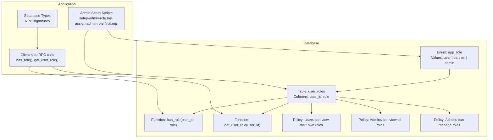
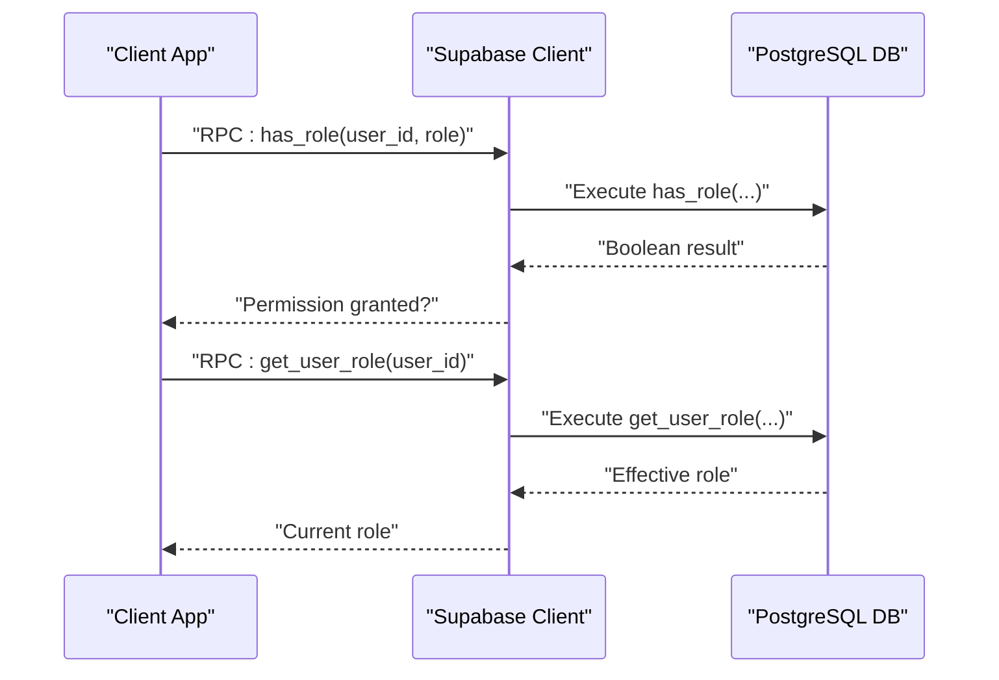
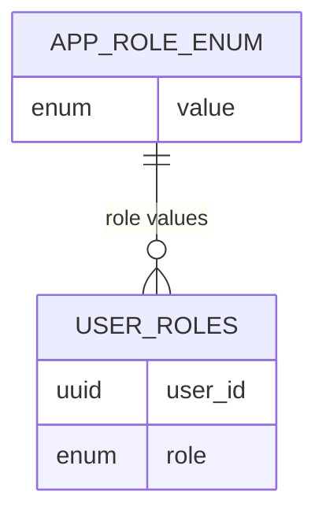
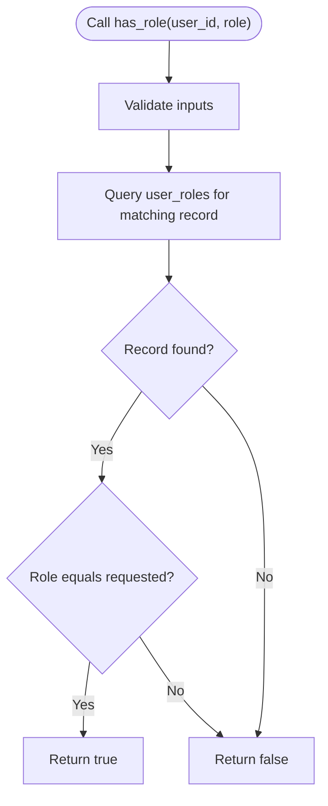
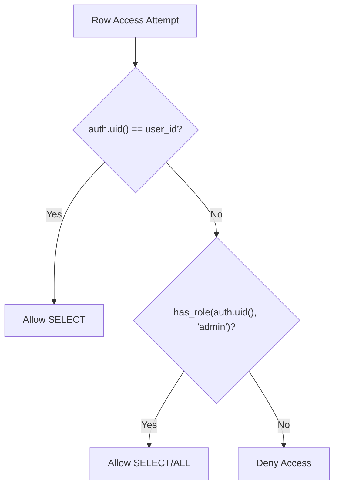
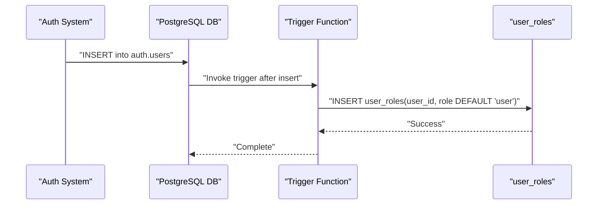
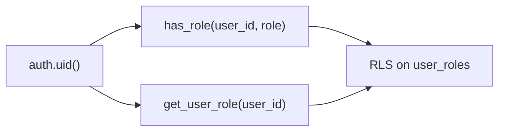
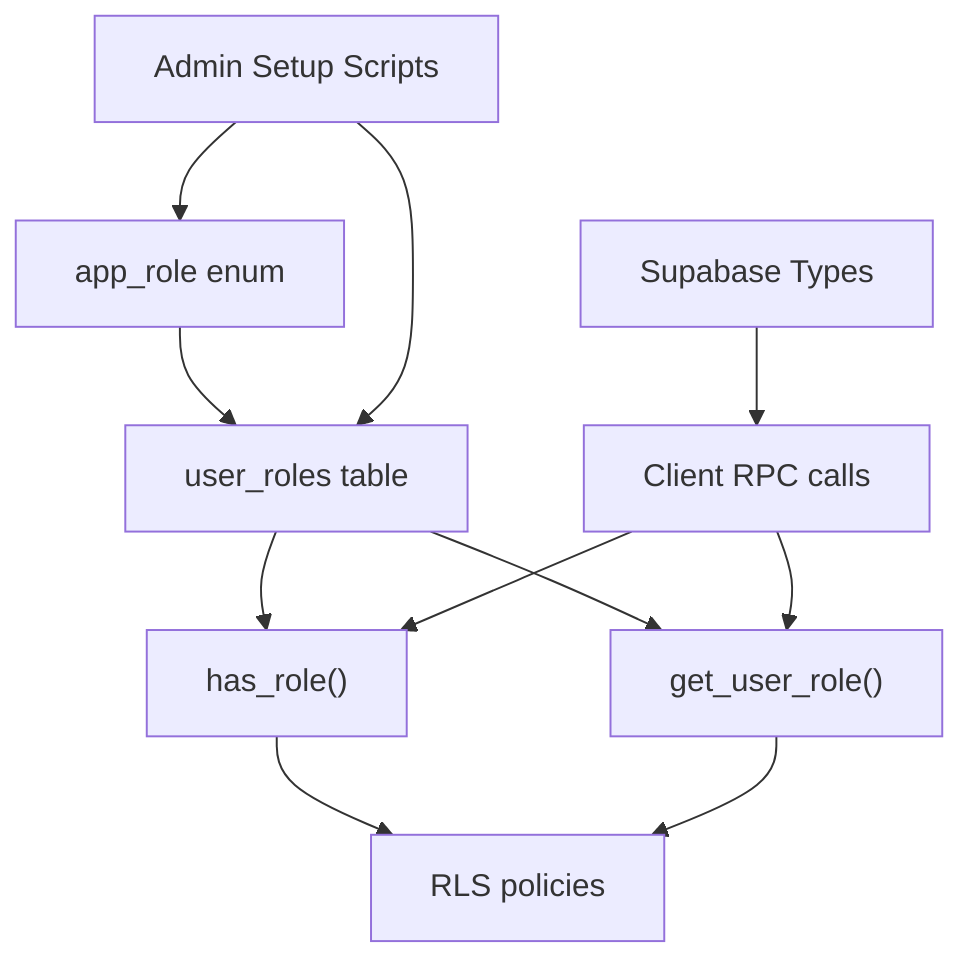

# User Roles & Permissions

<cite>
**Referenced Files in This Document**
- [CREATE_TABLES_SQL.md](file://CREATE_TABLES_SQL.md)
- [20250220000000_create_essential_tables.sql](file://supabase/migrations/20250220000000_create_essential_tables.sql)
- [24cbd0a5-185b-43dd-aed9-d1ae7379e6b0.sql](file://supabase/migrations/24cbd0a5-185b-43dd-aed9-d1ae7379e6b0.sql)
- [types.ts](file://src/integrations/supabase/types.ts)
- [change-password.mjs](file://change-password.mjs)
- [assign-admin-role-final.mjs](file://assign-admin-role-final.mjs)
- [setup-admin-role.mjs](file://setup-admin-role.mjs)
- [fix_admin_tables.sql](file://fix_admin_tables.sql)
- [COMPLETE_PRODUCTION_AUDIT_FINAL.md](file://COMPLETE_PRODUCTION_AUDIT_FINAL.md)
- [COMPLETION_SUMMARY.md](file://COMPLETION_SUMMARY.md)
- [IMPLEMENTATION_PLAN.md](file://IMPLEMENTATION_PLAN.md)
- [NUTRIOFUEL_ARCHITECTURE_DIAGRAMS.md](file://NUTRIOFUEL_ARCHITECTURE_DIAGRAMS.md)
- [NUTRIOFUEL_PRINT_READY.html](file://NUTRIOFUEL_PRINT_READY.html)
- [docs/plans/nutrio-system-documentation.html](file://docs/plans/nutrio-system-documentation.html)
- [docs/plans/system-architecture.html](file://docs/plans/system-architecture.html)
</cite>

## Table of Contents
1. [Introduction](#introduction)
2. [Project Structure](#project-structure)
3. [Core Components](#core-components)
4. [Architecture Overview](#architecture-overview)
5. [Detailed Component Analysis](#detailed-component-analysis)
6. [Dependency Analysis](#dependency-analysis)
7. [Performance Considerations](#performance-considerations)
8. [Troubleshooting Guide](#troubleshooting-guide)
9. [Conclusion](#conclusion)

## Introduction
This document describes the User Roles and Permission system in Nutrio. It covers the user_roles table structure, the app_role enum definition, role-based access control (RBAC) functions, row-level security (RLS) policies, and the automatic default role assignment mechanism during user registration. It also explains how the system integrates with the multi-portal authentication framework and provides practical examples of role-based queries and permission checks.

## Project Structure
The roles and permissions system spans several parts of the repository:
- Database schema and policies are defined in migration files and SQL documentation
- Supabase client typing and RPC function signatures are generated in TypeScript types
- Application logic invokes database functions via RPC calls
- Administrative scripts set up enums and enforce policies

**Diagram sources**
- [CREATE_TABLES_SQL.md:1-100](file://CREATE_TABLES_SQL.md#L1-L100)
- [20250220000000_create_essential_tables.sql:1-120](file://supabase/migrations/20250220000000_create_essential_tables.sql#L1-L120)
- [24cbd0a5-185b-43dd-aed9-d1ae7379e6b0.sql:1-80](file://supabase/migrations/24cbd0a5-185b-43dd-aed9-d1ae7379e6b0.sql#L1-L80)
- [types.ts:8140-8175](file://src/integrations/supabase/types.ts#L8140-L8175)
- [change-password.mjs:55-80](file://change-password.mjs#L55-L80)
- [setup-admin-role.mjs:60-100](file://setup-admin-role.mjs#L60-L100)
- [assign-admin-role-final.mjs:1-50](file://assign-admin-role-final.mjs#L1-L50)

**Section sources**
- [CREATE_TABLES_SQL.md:1-100](file://CREATE_TABLES_SQL.md#L1-L100)
- [20250220000000_create_essential_tables.sql:1-120](file://supabase/migrations/20250220000000_create_essential_tables.sql#L1-L120)
- [types.ts:8140-8175](file://src/integrations/supabase/types.ts#L8140-L8175)

## Core Components
- app_role enum: Defines the set of possible roles stored in user_roles.
- user_roles table: Stores per-user role assignments with RLS enabled.
- has_role(user_id, role): Database function to check if a user has a given role.
- get_user_role(user_id): Database function to resolve a user’s current effective role.
- Row-level security policies: Control who can view and modify role records.
- Trigger mechanism: Automatically assigns a default role upon user registration.

**Section sources**
- [CREATE_TABLES_SQL.md:1-100](file://CREATE_TABLES_SQL.md#L1-L100)
- [20250220000000_create_essential_tables.sql:1-120](file://supabase/migrations/20250220000000_create_essential_tables.sql#L1-L120)
- [24cbd0a5-185b-43dd-aed9-d1ae7379e6b0.sql:1-80](file://supabase/migrations/24cbd0a5-185b-43dd-aed9-d1ae7379e6b0.sql#L1-L80)
- [types.ts:8140-8175](file://src/integrations/supabase/types.ts#L8140-L8175)

## Architecture Overview
The RBAC architecture centers on three pillars:
- Data model: app_role enum and user_roles table
- Access control: has_role() and get_user_role() functions
- Enforcement: RLS policies on user_roles and optional triggers for defaults

**Diagram sources**
- [types.ts:8140-8175](file://src/integrations/supabase/types.ts#L8140-L8175)
- [change-password.mjs:55-80](file://change-password.mjs#L55-L80)
- [CREATE_TABLES_SQL.md:51-85](file://CREATE_TABLES_SQL.md#L51-L85)

## Detailed Component Analysis

### Database Schema: app_role Enum and user_roles Table
- Enum definition: app_role with values user, partner, admin.
- Table definition: user_roles with columns user_id and role, defaulting to user.
- RLS enabled on user_roles to enforce per-row access controls.

**Diagram sources**
- [CREATE_TABLES_SQL.md:1-60](file://CREATE_TABLES_SQL.md#L1-L60)
- [20250220000000_create_essential_tables.sql:1-80](file://supabase/migrations/20250220000000_create_essential_tables.sql#L1-L80)

**Section sources**
- [CREATE_TABLES_SQL.md:1-60](file://CREATE_TABLES_SQL.md#L1-L60)
- [20250220000000_create_essential_tables.sql:1-80](file://supabase/migrations/20250220000000_create_essential_tables.sql#L1-L80)

### Security Functions: has_role() and get_user_role()
- has_role(user_id, role): Returns true if the user possesses the specified role.
- get_user_role(user_id): Resolves the user’s effective role for authorization decisions.

**Diagram sources**
- [CREATE_TABLES_SQL.md:51-85](file://CREATE_TABLES_SQL.md#L51-L85)
- [24cbd0a5-185b-43dd-aed9-d1ae7379e6b0.sql:50-80](file://supabase/migrations/24cbd0a5-185b-43dd-aed9-d1ae7379e6b0.sql#L50-L80)

**Section sources**
- [CREATE_TABLES_SQL.md:51-85](file://CREATE_TABLES_SQL.md#L51-L85)
- [24cbd0a5-185b-43dd-aed9-d1ae7379e6b0.sql:50-80](file://supabase/migrations/24cbd0a5-185b-43dd-aed9-d1ae7379e6b0.sql#L50-L80)
- [types.ts:8140-8175](file://src/integrations/supabase/types.ts#L8140-L8175)

### Row-Level Security Policies on user_roles
- Policy: Users can view their own roles.
- Policy: Admins can view all roles.
- Policy: Admins can manage roles (insert/update/delete).

**Diagram sources**
- [CREATE_TABLES_SQL.md:44-60](file://CREATE_TABLES_SQL.md#L44-L60)
- [fix_admin_tables.sql:60-120](file://fix_admin_tables.sql#L60-L120)

**Section sources**
- [CREATE_TABLES_SQL.md:44-60](file://CREATE_TABLES_SQL.md#L44-L60)
- [fix_admin_tables.sql:60-120](file://fix_admin_tables.sql#L60-L120)

### Trigger Mechanism: Automatic Default Role Assignment
- Upon new user registration, a trigger ensures a default role is inserted into user_roles.
- The trigger inserts a record with role set to user for the new user_id.

**Diagram sources**
- [CREATE_TABLES_SQL.md:200-230](file://CREATE_TABLES_SQL.md#L200-L230)
- [20250220000000_create_essential_tables.sql:90-120](file://supabase/migrations/20250220000000_create_essential_tables.sql#L90-L120)

**Section sources**
- [CREATE_TABLES_SQL.md:200-230](file://CREATE_TABLES_SQL.md#L200-L230)
- [20250220000000_create_essential_tables.sql:90-120](file://supabase/migrations/20250220000000_create_essential_tables.sql#L90-L120)

### Integration with Multi-Portal Authentication
- The system relies on auth.uid() to identify the current session user.
- has_role() and get_user_role() use auth.uid() to resolve permissions and roles.
- RLS policies gate access to user_roles rows based on the session user and admin status.

**Diagram sources**
- [CREATE_TABLES_SQL.md:51-85](file://CREATE_TABLES_SQL.md#L51-L85)
- [fix_admin_tables.sql:60-120](file://fix_admin_tables.sql#L60-L120)

**Section sources**
- [CREATE_TABLES_SQL.md:51-85](file://CREATE_TABLES_SQL.md#L51-L85)
- [fix_admin_tables.sql:60-120](file://fix_admin_tables.sql#L60-L120)

### Examples of Role-Based Queries and Permission Checks
- Check if the current user has admin rights:
  - Call has_role(auth.uid(), 'admin')
- Resolve a user’s effective role:
  - Call get_user_role(user_id)
- Enforce RLS in application queries:
  - SELECT * FROM user_roles WHERE user_id = auth.uid() (permitted by policy)
  - SELECT * FROM user_roles WHERE has_role(auth.uid(), 'admin') (permitted by admin policy)

**Section sources**
- [change-password.mjs:55-80](file://change-password.mjs#L55-L80)
- [CREATE_TABLES_SQL.md:44-85](file://CREATE_TABLES_SQL.md#L44-L85)
- [IMPLEMENTATION_PLAN.md:170-220](file://IMPLEMENTATION_PLAN.md#L170-L220)

## Dependency Analysis
- Internal dependencies:
  - user_roles depends on app_role enum
  - has_role() and get_user_role() depend on user_roles
  - RLS policies depend on has_role() and auth.uid()
- External dependencies:
  - Supabase client types define RPC signatures for has_role and get_user_role
  - Admin scripts ensure enum and table alignment

**Diagram sources**
- [types.ts:8140-8175](file://src/integrations/supabase/types.ts#L8140-L8175)
- [setup-admin-role.mjs:60-100](file://setup-admin-role.mjs#L60-L100)
- [assign-admin-role-final.mjs:1-50](file://assign-admin-role-final.mjs#L1-L50)

**Section sources**
- [types.ts:8140-8175](file://src/integrations/supabase/types.ts#L8140-L8175)
- [setup-admin-role.mjs:60-100](file://setup-admin-role.mjs#L60-L100)
- [assign-admin-role-final.mjs:1-50](file://assign-admin-role-final.mjs#L1-L50)

## Performance Considerations
- Keep user_roles small and indexed by user_id for fast lookups.
- Prefer has_role() for boolean checks to avoid unnecessary data retrieval.
- Use get_user_role() judiciously; cache results at the application layer when appropriate.
- Ensure RLS evaluation remains efficient by avoiding expensive joins in policies.

## Troubleshooting Guide
- Symptom: has_role() returns unexpected results
  - Verify the user has a role record in user_roles
  - Confirm the app_role enum includes the target role value
  - Check RLS policies allow access for the current user
- Symptom: New users lack roles
  - Confirm the trigger runs after auth.users insert
  - Validate default role value is user
- Symptom: Admins cannot view all roles
  - Verify has_role(auth.uid(), 'admin') resolves to true for the admin user
  - Confirm RLS policy allows admin access

**Section sources**
- [CREATE_TABLES_SQL.md:44-85](file://CREATE_TABLES_SQL.md#L44-L85)
- [20250220000000_create_essential_tables.sql:90-120](file://supabase/migrations/20250220000000_create_essential_tables.sql#L90-L120)
- [change-password.mjs:55-80](file://change-password.mjs#L55-L80)

## Conclusion
Nutrio’s RBAC system is built around a compact schema (app_role enum and user_roles table), robust security functions (has_role(), get_user_role()), and strict RLS policies. The automatic default role assignment ensures every registered user starts with appropriate permissions, while admin oversight is enforced through dedicated policies. Together, these components integrate cleanly with the multi-portal authentication system to deliver secure, role-aware access across portals.